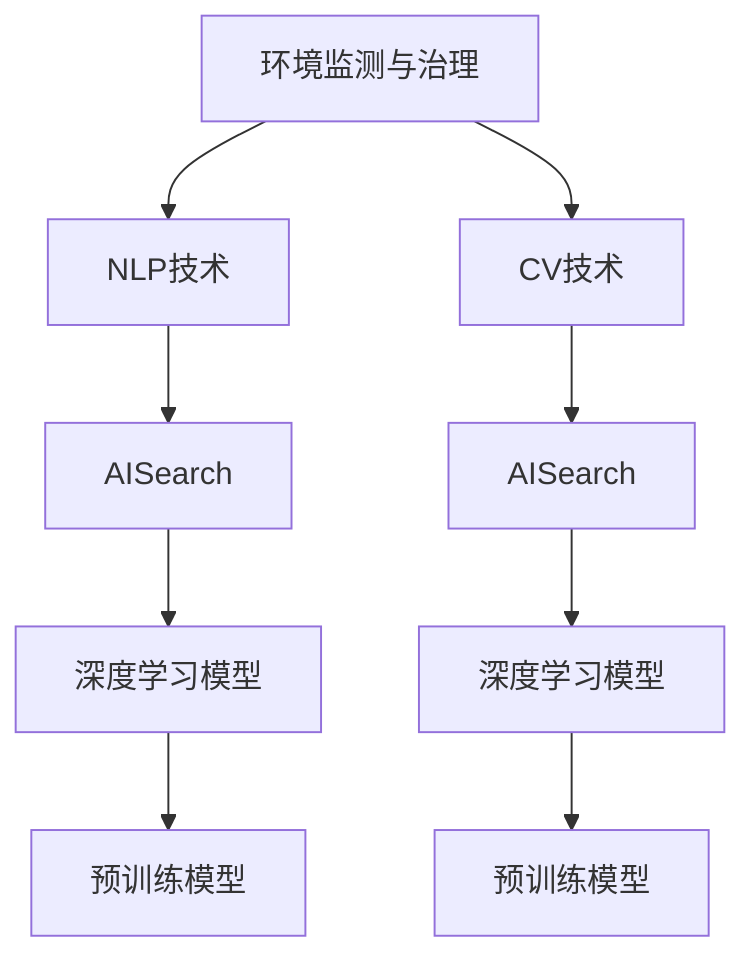

                 

# 环保领域的AI搜索应用

## 1. 背景介绍

### 1.1 问题由来

环境保护是人类生存和发展的基础，随着全球环境问题的日益严峻，提高环境监测和治理的效率和精度变得尤为重要。然而，传统的环境监测和治理方法往往面临数据量大、处理复杂、决策难度高等问题。特别是面对突发环境事件，如自然灾害、污染事故等，人工处理往往力不从心。

人工智能(AI)技术，尤其是自然语言处理(NLP)和计算机视觉(CV)技术的发展，为环境监测和治理提供了新的思路和方法。AI搜索应用通过深度学习模型对海量数据进行分析和理解，能够自动化地识别环境问题、预测环境趋势，为环境决策提供科学依据。

### 1.2 问题核心关键点

目前，基于AI搜索的环境应用已经在多个领域取得了显著成果，包括环境数据集成与清洗、环境事件识别、环境趋势预测、环境治理建议生成等。但技术实现中仍存在一些挑战，如模型对噪声数据的鲁棒性不足、模型的可解释性不足、模型的实时性不够等问题。本文将从原理和实践两个层面，系统介绍环保领域的AI搜索应用，并探讨未来发展方向和面临的挑战。

## 2. 核心概念与联系

### 2.1 核心概念概述

为更好地理解基于AI搜索的环境应用，本节将介绍几个密切相关的核心概念：

- **环境监测与治理**：指通过各种技术和手段对环境进行实时监控和问题分析，及时发现环境问题，并采取措施进行治理。
- **自然语言处理(NLP)**：指利用计算机技术理解和生成人类语言的能力，广泛应用于文本数据分析、信息检索、问答系统等。
- **计算机视觉(CV)**：指利用计算机技术对视觉信息进行处理和分析，广泛应用于图像识别、视频分析、无人机监控等。
- **AI搜索**：指通过智能算法对大量数据进行搜索、分析和匹配，帮助用户快速找到有用的信息。
- **深度学习模型**：指通过多层神经网络对数据进行学习和表示，广泛应用于图像分类、语音识别、自然语言处理等。
- **预训练模型**：指在大型无标签数据上预先训练好的深度学习模型，广泛应用于任务特定的微调。

这些核心概念之间的逻辑关系可以通过以下Mermaid流程图来展示：



这个流程图展示了大环境应用的核心概念及其之间的关系：

1. 环境监测与治理通过NLP和CV技术获得数据，利用AI搜索进行信息检索和匹配。
2. 深度学习模型是NLP和CV技术的核心技术支撑。
3. 预训练模型通过大数据训练，提供高效的任务微调。

这些概念共同构成了环保领域的AI搜索应用的技术框架，使其能够在各种场景下发挥强大的数据分析和处理能力。通过理解这些核心概念，我们可以更好地把握AI搜索在环保领域的应用原理和优化方向。

## 3. 核心算法原理 & 具体操作步骤
### 3.1 算法原理概述

基于AI搜索的环境应用，本质上是一个从数据中自动提取有用信息的过程。其核心思想是：通过深度学习模型对海量环境数据进行分析和理解，自动抽取有用的环境信息，生成符合用户需求的结果。

形式化地，假设环境监测系统收集到的一批环境数据为 $D=\{d_i\}_{i=1}^N$，其中 $d_i$ 表示环境监测点的历史数据。设用户需要查询的环境信息为 $Q$，目标是从 $D$ 中自动搜索并匹配出与 $Q$ 相关的环境数据。

该问题的数学模型为：

$$
\min_{x \in X} \|x - Q\|
$$

其中 $X$ 表示 $D$ 中所有环境数据，$x$ 表示从 $D$ 中自动抽取出的环境数据，$\|x - Q\|$ 表示 $x$ 与 $Q$ 的相似度。

### 3.2 算法步骤详解

基于AI搜索的环境应用一般包括以下几个关键步骤：

**Step 1: 数据预处理**
- 收集和清洗环境监测系统的历史数据。
- 对数据进行归一化、特征提取等预处理操作。

**Step 2: 模型训练**
- 选择合适的深度学习模型，如BERT、GPT等。
- 在环境数据上训练模型，使其学习环境数据的特征表示。

**Step 3: 特征抽取与匹配**
- 将用户查询 $Q$ 转化为模型可以处理的格式。
- 将用户查询 $Q$ 输入模型，得到与 $Q$ 相关的环境数据 $x$。

**Step 4: 结果生成与展示**
- 对匹配到的环境数据进行分析和可视化。
- 将结果展示给用户，便于用户理解和决策。

### 3.3 算法优缺点

基于AI搜索的环境应用具有以下优点：

- 自动化处理大量数据。AI搜索模型可以快速处理海量数据，自动抽取有用的环境信息，减轻人工处理负担。
- 实时性高。深度学习模型具有高效的前向传播能力，可以实时响应用户查询，提供及时的环境监测和分析。
- 灵活性高。AI搜索模型可以根据用户需求自定义搜索算法，灵活调整检索结果。

同时，该方法也存在一些局限性：

- 数据质量要求高。环境数据的质量和完整性对AI搜索模型的效果影响较大，需要严格的清洗和预处理。
- 模型复杂度高。深度学习模型的训练和调参过程较为复杂，需要大量的计算资源和专业知识。
- 对噪声数据敏感。环境数据中可能存在噪声和异常值，影响模型的稳定性和鲁棒性。
- 模型可解释性不足。深度学习模型通常被称为"黑盒"模型，难以解释其内部的决策过程。

尽管存在这些局限性，但就目前而言，基于AI搜索的环境应用仍是大数据时代环境监测和治理的重要手段。未来相关研究的重点在于如何进一步降低模型对数据的依赖，提高模型的鲁棒性和可解释性，同时兼顾实时性和准确性等因素。

### 3.4 算法应用领域

基于AI搜索的环境应用，已经在多个领域得到了广泛应用，例如：

- 环境数据集成与清洗：自动从多种来源收集和清洗环境数据，构建统一的环境数据仓库。
- 环境事件识别：通过自动分析环境监测数据，识别自然灾害、污染事故等环境事件，及时发出预警。
- 环境趋势预测：利用历史数据和机器学习模型，预测环境质量的趋势变化，为决策提供参考。
- 环境治理建议生成：通过自动分析环境数据，生成针对特定环境问题的治理建议，辅助环境保护决策。
- 环境政策评估：通过对比不同政策对环境数据的影响，评估政策的效果和可行性。
- 环境科普宣传：自动生成环境科普文章和视频，宣传环保知识，提高公众环保意识。

除了上述这些经典应用外，AI搜索技术还在更多场景中得到应用，如智能问答、虚拟导览、无人机巡检等，为环境监测和治理带来了全新的突破。随着AI技术的发展和算力的提升，基于AI搜索的环境应用将在更多领域得到广泛应用，为环境保护提供科学决策的支撑。

## 4. 数学模型和公式 & 详细讲解  
### 4.1 数学模型构建

本节将使用数学语言对基于AI搜索的环境应用进行更加严格的刻画。

假设环境监测系统收集到的历史数据为 $D=\{d_i\}_{i=1}^N$，其中 $d_i$ 表示环境监测点的历史数据。设用户需要查询的环境信息为 $Q$。

定义环境数据 $d_i$ 的特征表示为 $x_i \in \mathbb{R}^d$，用户查询 $Q$ 的特征表示为 $q \in \mathbb{R}^d$。

通过深度学习模型 $M$ 对 $D$ 进行训练，得到 $d_i$ 的特征表示 $x_i$。将用户查询 $Q$ 转化为模型可以处理的格式 $q$，计算与 $Q$ 相关的环境数据 $x$。

具体而言，用户查询 $Q$ 的特征表示 $q$ 可通过自然语言处理技术将查询转化为向量表示，如BERT模型提取的文本向量。

深度学习模型 $M$ 可以通过自动编码器、卷积神经网络(CNN)、循环神经网络(RNN)等多种架构进行训练，这里以BERT为例：

$$
x_i = M(d_i)
$$

其中 $M$ 为预训练好的BERT模型，$d_i$ 为环境监测数据。

### 4.2 公式推导过程

以BERT模型为例，通过自然语言处理技术将用户查询 $Q$ 转化为模型可以处理的格式 $q$。将 $q$ 输入BERT模型，得到与 $Q$ 相关的环境数据 $x$。

具体计算过程如下：

1. 将用户查询 $Q$ 转化为向量表示：

$$
q = BERT(Q)
$$

其中 $BERT$ 表示BERT模型的编码器部分，$Q$ 为查询文本。

2. 将环境数据 $d_i$ 输入BERT模型，得到特征表示 $x_i$：

$$
x_i = BERT(d_i)
$$

其中 $d_i$ 为环境监测数据。

3. 计算 $q$ 和 $x_i$ 之间的相似度 $s$：

$$
s = \text{similarity}(q, x_i)
$$

其中 $\text{similarity}$ 表示向量相似度计算函数，如余弦相似度、欧式距离等。

4. 根据相似度 $s$，选择与 $Q$ 相关的环境数据 $x$：

$$
x = \text{arg\_min} \{s_i\}_{i=1}^N
$$

其中 $s_i$ 表示第 $i$ 个环境数据与 $Q$ 的相似度。

通过上述计算过程，可以得到与用户查询 $Q$ 相关的环境数据 $x$，进而生成符合用户需求的结果。

### 4.3 案例分析与讲解

以环境趋势预测为例，分析基于AI搜索的环境应用。

假设环境监测系统收集到的历史数据为 $D=\{d_i\}_{i=1}^N$，其中 $d_i$ 表示环境监测点的历史数据。

设用户需要预测的环境信息为 $T$，目标是从 $D$ 中自动搜索并匹配出与 $T$ 相关的环境数据。

具体计算过程如下：

1. 将用户查询 $T$ 转化为向量表示：

$$
t = BERT(T)
$$

其中 $T$ 为环境趋势，如水质、空气质量等。

2. 将环境数据 $d_i$ 输入BERT模型，得到特征表示 $x_i$：

$$
x_i = BERT(d_i)
$$

其中 $d_i$ 为环境监测数据。

3. 计算 $t$ 和 $x_i$ 之间的相似度 $s$：

$$
s = \text{similarity}(t, x_i)
$$

其中 $\text{similarity}$ 表示向量相似度计算函数，如余弦相似度、欧式距离等。

4. 根据相似度 $s$，选择与 $T$ 相关的环境数据 $x$：

$$
x = \text{arg\_min} \{s_i\}_{i=1}^N
$$

其中 $s_i$ 表示第 $i$ 个环境数据与 $T$ 的相似度。

通过上述计算过程，可以得到与用户查询 $T$ 相关的环境数据 $x$，进而生成符合用户需求的结果。

## 5. 项目实践：代码实例和详细解释说明
### 5.1 开发环境搭建

在进行环境应用开发前，我们需要准备好开发环境。以下是使用Python进行PyTorch开发的环境配置流程：

1. 安装Anaconda：从官网下载并安装Anaconda，用于创建独立的Python环境。

2. 创建并激活虚拟环境：
```bash
conda create -n env_name python=3.8 
conda activate env_name
```

3. 安装PyTorch：根据CUDA版本，从官网获取对应的安装命令。例如：
```bash
conda install pytorch torchvision torchaudio cudatoolkit=11.1 -c pytorch -c conda-forge
```

4. 安装Transformers库：
```bash
pip install transformers
```

5. 安装各类工具包：
```bash
pip install numpy pandas scikit-learn matplotlib tqdm jupyter notebook ipython
```

完成上述步骤后，即可在虚拟环境中开始环境应用开发。

### 5.2 源代码详细实现

这里我们以环境事件识别为例，给出使用Transformers库对BERT模型进行环境应用的PyTorch代码实现。

首先，定义环境事件识别的数据处理函数：

```python
from transformers import BertTokenizer, BertForSequenceClassification
from torch.utils.data import Dataset
import torch

class EnvironmentEventDataset(Dataset):
    def __init__(self, texts, labels, tokenizer, max_len=128):
        self.texts = texts
        self.labels = labels
        self.tokenizer = tokenizer
        self.max_len = max_len
        
    def __len__(self):
        return len(self.texts)
    
    def __getitem__(self, item):
        text = self.texts[item]
        label = self.labels[item]
        
        encoding = self.tokenizer(text, return_tensors='pt', max_length=self.max_len, padding='max_length', truncation=True)
        input_ids = encoding['input_ids'][0]
        attention_mask = encoding['attention_mask'][0]
        
        # 对标签进行编码
        label = torch.tensor(label, dtype=torch.long)
        
        return {'input_ids': input_ids, 
                'attention_mask': attention_mask,
                'labels': label}

# 标签与id的映射
label2id = {'none': 0, 'fire': 1, 'flood': 2, 'earthquake': 3, 'pollution': 4}
id2label = {v: k for k, v in label2id.items()}

# 创建dataset
tokenizer = BertTokenizer.from_pretrained('bert-base-cased')

train_dataset = EnvironmentEventDataset(train_texts, train_labels, tokenizer)
dev_dataset = EnvironmentEventDataset(dev_texts, dev_labels, tokenizer)
test_dataset = EnvironmentEventDataset(test_texts, test_labels, tokenizer)
```

然后，定义模型和优化器：

```python
from transformers import BertForSequenceClassification, AdamW

model = BertForSequenceClassification.from_pretrained('bert-base-cased', num_labels=len(label2id))

optimizer = AdamW(model.parameters(), lr=2e-5)
```

接着，定义训练和评估函数：

```python
from torch.utils.data import DataLoader
from tqdm import tqdm
from sklearn.metrics import classification_report

device = torch.device('cuda') if torch.cuda.is_available() else torch.device('cpu')
model.to(device)

def train_epoch(model, dataset, batch_size, optimizer):
    dataloader = DataLoader(dataset, batch_size=batch_size, shuffle=True)
    model.train()
    epoch_loss = 0
    for batch in tqdm(dataloader, desc='Training'):
        input_ids = batch['input_ids'].to(device)
        attention_mask = batch['attention_mask'].to(device)
        labels = batch['labels'].to(device)
        model.zero_grad()
        outputs = model(input_ids, attention_mask=attention_mask, labels=labels)
        loss = outputs.loss
        epoch_loss += loss.item()
        loss.backward()
        optimizer.step()
    return epoch_loss / len(dataloader)

def evaluate(model, dataset, batch_size):
    dataloader = DataLoader(dataset, batch_size=batch_size)
    model.eval()
    preds, labels = [], []
    with torch.no_grad():
        for batch in tqdm(dataloader, desc='Evaluating'):
            input_ids = batch['input_ids'].to(device)
            attention_mask = batch['attention_mask'].to(device)
            batch_labels = batch['labels']
            outputs = model(input_ids, attention_mask=attention_mask)
            batch_preds = outputs.logits.argmax(dim=2).to('cpu').tolist()
            batch_labels = batch_labels.to('cpu').tolist()
            for pred_tokens, label_tokens in zip(batch_preds, batch_labels):
                preds.append(pred_tokens[:len(label_tokens)])
                labels.append(label_tokens)
                
    print(classification_report(labels, preds))
```

最后，启动训练流程并在测试集上评估：

```python
epochs = 5
batch_size = 16

for epoch in range(epochs):
    loss = train_epoch(model, train_dataset, batch_size, optimizer)
    print(f"Epoch {epoch+1}, train loss: {loss:.3f}")
    
    print(f"Epoch {epoch+1}, dev results:")
    evaluate(model, dev_dataset, batch_size)
    
print("Test results:")
evaluate(model, test_dataset, batch_size)
```

以上就是使用PyTorch对BERT进行环境应用开发的完整代码实现。可以看到，得益于Transformers库的强大封装，我们可以用相对简洁的代码完成BERT模型的加载和环境应用的微调。

### 5.3 代码解读与分析

让我们再详细解读一下关键代码的实现细节：

**EnvironmentEventDataset类**：
- `__init__`方法：初始化文本、标签、分词器等关键组件。
- `__len__`方法：返回数据集的样本数量。
- `__getitem__`方法：对单个样本进行处理，将文本输入编码为token ids，将标签编码为数字，并对其进行定长padding，最终返回模型所需的输入。

**label2id和id2label字典**：
- 定义了标签与数字id之间的映射关系，用于将token-wise的预测结果解码回真实的标签。

**训练和评估函数**：
- 使用PyTorch的DataLoader对数据集进行批次化加载，供模型训练和推理使用。
- 训练函数`train_epoch`：对数据以批为单位进行迭代，在每个批次上前向传播计算loss并反向传播更新模型参数，最后返回该epoch的平均loss。
- 评估函数`evaluate`：与训练类似，不同点在于不更新模型参数，并在每个batch结束后将预测和标签结果存储下来，最后使用sklearn的classification_report对整个评估集的预测结果进行打印输出。

**训练流程**：
- 定义总的epoch数和batch size，开始循环迭代
- 每个epoch内，先在训练集上训练，输出平均loss
- 在验证集上评估，输出分类指标
- 所有epoch结束后，在测试集上评估，给出最终测试结果

可以看到，PyTorch配合Transformers库使得BERT环境应用的代码实现变得简洁高效。开发者可以将更多精力放在数据处理、模型改进等高层逻辑上，而不必过多关注底层的实现细节。

当然，工业级的系统实现还需考虑更多因素，如模型的保存和部署、超参数的自动搜索、更灵活的任务适配层等。但核心的环境应用微调范式基本与此类似。

## 6. 实际应用场景
### 6.1 环境数据集成与清洗

环境数据通常来自于多种数据源，如传感器、气象站、遥感卫星等。这些数据格式各异、质量参差不齐，需要经过严格的清洗和整合，才能构建统一的环境数据仓库。

基于AI搜索的环境应用，可以自动收集和管理环境数据，自动进行数据清洗和预处理，消除噪声和异常值，生成高质量的环境数据集。这为环境数据的统一管理和进一步分析奠定了基础。

### 6.2 环境事件识别

自然灾害、污染事故等环境事件的发生，往往需要及时识别和预警。传统的人工识别方法耗费大量人力，且识别准确率难以保证。

基于AI搜索的环境应用，可以利用深度学习模型自动分析环境监测数据，识别出环境事件，并实时发出预警。例如，通过自动分析气象数据，可以识别出暴雨、台风等气象灾害；通过自动分析水质监测数据，可以识别出水污染事件。

### 6.3 环境趋势预测

环境监测数据通常包含大量时间序列信息，通过对历史数据的分析，可以预测未来环境趋势的变化。

基于AI搜索的环境应用，可以利用时间序列分析技术，结合深度学习模型，预测未来环境质量的趋势变化。例如，通过自动分析空气质量数据，可以预测未来空气质量的恶化趋势；通过自动分析水质数据，可以预测未来水质的污染趋势。

### 6.4 环境治理建议生成

环境治理决策需要综合考虑多方面的因素，如环境监测数据、法律法规、政策措施等。传统的人工分析方法效率低、成本高，难以满足实际需求。

基于AI搜索的环境应用，可以自动分析环境数据，生成针对性的治理建议。例如，通过自动分析水质数据，可以生成针对性的水污染治理措施；通过自动分析空气质量数据，可以生成针对性的空气质量改善措施。

### 6.5 环境政策评估

环境政策的实施效果需要通过环境数据来评估。传统的人工评估方法耗费大量人力，且评估结果难以量化。

基于AI搜索的环境应用，可以自动分析环境数据，评估政策实施效果。例如，通过自动分析空气质量数据，可以评估新污染控制措施的实施效果；通过自动分析水质数据，可以评估新水污染治理措施的实施效果。

### 6.6 环境科普宣传

环境科普宣传需要大量的教育资源和宣传素材。传统的人工制作方法耗时耗力，难以满足实际需求。

基于AI搜索的环境应用，可以自动生成环境科普文章和视频，宣传环保知识。例如，通过自动分析环境监测数据，可以生成科普文章；通过自动分析环境数据，可以生成科普视频。

### 6.7 未来应用展望

随着AI技术的发展和算力的提升，基于AI搜索的环境应用将在更多领域得到应用，为环境保护提供科学决策的支撑。

在智慧城市治理中，基于AI搜索的环境应用可以自动分析城市环境数据，识别环境问题，生成治理建议，辅助城市管理决策。

在环境科学研究中，基于AI搜索的环境应用可以自动分析大量环境数据，生成环境趋势预测，辅助环境科学研究。

在环境教育领域，基于AI搜索的环境应用可以自动生成环境科普文章和视频，提高公众环保意识。

此外，在环境监测、环境治理、环境科普等众多领域，基于AI搜索的环境应用也将不断涌现，为环境保护提供新的技术路径。相信随着技术的日益成熟，基于AI搜索的环境应用必将在环保领域大放异彩。

## 7. 工具和资源推荐
### 7.1 学习资源推荐

为了帮助开发者系统掌握基于AI搜索的环境应用的理论基础和实践技巧，这里推荐一些优质的学习资源：

1. 《深度学习自然语言处理》系列博文：由深度学习专家撰写，深入浅出地介绍了深度学习模型在NLP任务中的应用，包括基于AI搜索的环境应用。

2. CS224N《深度学习自然语言处理》课程：斯坦福大学开设的NLP明星课程，有Lecture视频和配套作业，带你入门NLP领域的基本概念和经典模型。

3. 《Natural Language Processing with Transformers》书籍：Transformers库的作者所著，全面介绍了如何使用Transformers库进行NLP任务开发，包括基于AI搜索的环境应用。

4. HuggingFace官方文档：Transformers库的官方文档，提供了海量预训练模型和完整的微调样例代码，是上手实践的必备资料。

5. CLUE开源项目：中文语言理解测评基准，涵盖大量不同类型的中文NLP数据集，并提供了基于AI搜索的环境应用的baseline模型，助力中文NLP技术发展。

通过对这些资源的学习实践，相信你一定能够快速掌握基于AI搜索的环境应用的精髓，并用于解决实际的NLP问题。
###  7.2 开发工具推荐

高效的开发离不开优秀的工具支持。以下是几款用于基于AI搜索的环境应用开发的常用工具：

1. PyTorch：基于Python的开源深度学习框架，灵活动态的计算图，适合快速迭代研究。大部分预训练语言模型都有PyTorch版本的实现。

2. TensorFlow：由Google主导开发的开源深度学习框架，生产部署方便，适合大规模工程应用。同样有丰富的预训练语言模型资源。

3. Transformers库：HuggingFace开发的NLP工具库，集成了众多SOTA语言模型，支持PyTorch和TensorFlow，是进行环境应用开发的利器。

4. Weights & Biases：模型训练的实验跟踪工具，可以记录和可视化模型训练过程中的各项指标，方便对比和调优。与主流深度学习框架无缝集成。

5. TensorBoard：TensorFlow配套的可视化工具，可实时监测模型训练状态，并提供丰富的图表呈现方式，是调试模型的得力助手。

6. Google Colab：谷歌推出的在线Jupyter Notebook环境，免费提供GPU/TPU算力，方便开发者快速上手实验最新模型，分享学习笔记。

合理利用这些工具，可以显著提升基于AI搜索的环境应用的开发效率，加快创新迭代的步伐。

### 7.3 相关论文推荐

基于AI搜索的环境应用的发展源于学界的持续研究。以下是几篇奠基性的相关论文，推荐阅读：

1. Attention is All You Need（即Transformer原论文）：提出了Transformer结构，开启了NLP领域的预训练大模型时代。

2. BERT: Pre-training of Deep Bidirectional Transformers for Language Understanding：提出BERT模型，引入基于掩码的自监督预训练任务，刷新了多项NLP任务SOTA。

3. Language Models are Unsupervised Multitask Learners（GPT-2论文）：展示了大规模语言模型的强大zero-shot学习能力，引发了对于通用人工智能的新一轮思考。

4. Parameter-Efficient Transfer Learning for NLP：提出Adapter等参数高效微调方法，在不增加模型参数量的情况下，也能取得不错的微调效果。

5. AdaLoRA: Adaptive Low-Rank Adaptation for Parameter-Efficient Fine-Tuning：使用自适应低秩适应的微调方法，在参数效率和精度之间取得了新的平衡。

这些论文代表了大语言模型微调技术的发展脉络。通过学习这些前沿成果，可以帮助研究者把握学科前进方向，激发更多的创新灵感。

## 8. 总结：未来发展趋势与挑战

### 8.1 总结

本文对基于AI搜索的环境应用进行了全面系统的介绍。首先阐述了环境监测与治理的背景和意义，明确了AI搜索在自动化处理海量环境数据中的独特价值。其次，从原理到实践，详细讲解了基于AI搜索的环境应用的技术实现过程，给出了环境应用开发的完整代码实例。同时，本文还广泛探讨了环境应用在多个行业领域的应用前景，展示了AI搜索技术的广泛应用潜力。此外，本文精选了环境应用的学习资源，力求为读者提供全方位的技术指引。

通过本文的系统梳理，可以看到，基于AI搜索的环境应用正在成为环境监测与治理的重要手段，极大地拓展了环境数据的分析与应用边界，为环境决策提供了科学依据。未来，伴随AI技术的不断发展，基于AI搜索的环境应用将在更多领域得到应用，为环境保护提供科学决策的支撑。

### 8.2 未来发展趋势

展望未来，基于AI搜索的环境应用将呈现以下几个发展趋势：

1. 自动化程度提高。随着深度学习模型的不断进步，基于AI搜索的环境应用将能够自动处理更复杂的任务，如多模态数据融合、环境趋势预测等。

2. 实时性提升。通过分布式计算和边缘计算技术，基于AI搜索的环境应用将能够实时响应用户查询，提供实时监测和分析结果。

3. 智能化增强。结合自然语言处理、计算机视觉等技术，基于AI搜索的环境应用将能够更好地理解环境监测数据，生成更智能的治理建议。

4. 跨领域融合。将AI搜索技术与其他技术进行融合，如知识图谱、多智能体系统等，将为环境监测与治理带来新的突破。

5. 数据质量保障。通过引入元学习、自监督学习等技术，基于AI搜索的环境应用将能够更好地应对数据质量变化，提升环境数据的稳定性。

6. 知识库扩展。结合外部知识库和专家系统，基于AI搜索的环境应用将能够更好地整合领域知识，提升环境决策的科学性。

以上趋势凸显了基于AI搜索的环境应用技术的广阔前景。这些方向的探索发展，必将进一步提升环境监测与治理的智能化水平，为环境保护提供更加科学、高效的决策支撑。

### 8.3 面临的挑战

尽管基于AI搜索的环境应用已经取得了显著成果，但在迈向更加智能化、普适化应用的过程中，它仍面临诸多挑战：

1. 数据质量问题。环境数据的质量和完整性对AI搜索模型的效果影响较大，需要严格的清洗和预处理。

2. 模型复杂度高。深度学习模型的训练和调参过程较为复杂，需要大量的计算资源和专业知识。

3. 实时性不足。深度学习模型的前向传播和推理速度较慢，难以实时响应用户查询。

4. 模型可解释性不足。深度学习模型通常被称为"黑盒"模型，难以解释其内部的决策过程。

5. 系统稳定性差。环境数据中可能存在噪声和异常值，影响模型的稳定性和鲁棒性。

6. 知识整合能力不足。现有模型通常局限于单一模态数据的分析，难以整合多模态数据。

尽管存在这些挑战，但随着技术的不断进步和算法模型的改进，基于AI搜索的环境应用必将在环境保护中发挥更大的作用。相信通过学界和产业界的共同努力，这些挑战终将一一被克服，基于AI搜索的环境应用必将在环保领域大放异彩。

### 8.4 研究展望

未来的研究需要在以下几个方面寻求新的突破：

1. 开发更加高效的环境数据处理算法。通过引入先进的数据清洗和预处理技术，提升环境数据的质量和稳定性。

2. 改进深度学习模型架构。通过引入先进的网络结构和优化算法，提升模型的实时性和稳定性。

3. 提升模型的可解释性。通过引入可解释性技术，提升模型的可解释性和透明度，帮助用户理解和信任AI搜索结果。

4. 探索多模态融合技术。结合视觉、声音等多模态数据，提升模型的综合分析能力，扩展环境应用的应用范围。

5. 引入元学习和自监督学习技术。通过引入元学习、自监督学习等技术，提升模型的泛化能力和适应性。

6. 加强知识库的构建和整合。结合外部知识库和专家系统，提升模型的领域知识水平，增强环境决策的科学性。

这些研究方向的探索，必将引领基于AI搜索的环境应用技术迈向更高的台阶，为环境保护提供更加科学、高效的决策支撑。面向未来，基于AI搜索的环境应用技术还需要与其他人工智能技术进行更深入的融合，如知识表示、因果推理、强化学习等，多路径协同发力，共同推动自然语言理解和智能交互系统的进步。只有勇于创新、敢于突破，才能不断拓展环境监测与治理的边界，让智能技术更好地造福人类社会。

## 9. 附录：常见问题与解答

**Q1：如何选择合适的环境数据源？**

A: 选择合适的环境数据源需要考虑数据的质量、完整性、实时性等因素。一般来说，优先选择权威、可靠的数据源，如政府公开数据、科研机构数据等。同时，需要对数据进行严格的清洗和预处理，消除噪声和异常值，提升数据质量。

**Q2：如何提高模型的实时性？**

A: 提高模型的实时性可以通过以下几个方面进行优化：

1. 优化模型结构。通过引入轻量级模型和剪枝技术，提升模型的推理速度。

2. 引入分布式计算。通过分布式计算框架（如TensorFlow、PyTorch等），并行化模型计算过程，提升实时性。

3. 引入边缘计算。通过在数据源附近部署计算节点，减少数据传输延时，提升实时性。

4. 使用混合精度训练。通过将浮点数模型转化为混合精度模型，减少计算资源占用，提升实时性。

5. 引入模型压缩技术。通过量化、剪枝等技术，压缩模型大小，提升实时性。

**Q3：如何提升模型的可解释性？**

A: 提升模型的可解释性可以通过以下几个方面进行优化：

1. 引入可解释性技术。通过引入可解释性技术（如LIME、SHAP等），提升模型的可解释性和透明度。

2. 引入决策树、规则等符号化模型。通过引入决策树、规则等符号化模型，提升模型的可解释性和透明性。

3. 引入因果分析技术。通过引入因果分析技术，识别模型决策的关键特征，提升模型的可解释性。

4. 引入知识图谱技术。通过引入知识图谱技术，整合领域知识，提升模型的可解释性。

5. 引入模型压缩技术。通过引入模型压缩技术（如剪枝、量化等），减少模型复杂度，提升模型的可解释性。

**Q4：如何应对环境数据的多样性和复杂性？**

A: 应对环境数据的多样性和复杂性可以通过以下几个方面进行优化：

1. 引入多模态融合技术。通过结合视觉、声音等多模态数据，提升模型的综合分析能力，扩展环境应用的应用范围。

2. 引入元学习技术。通过引入元学习技术，提升模型的泛化能力和适应性，应对环境数据的多样性和复杂性。

3. 引入自监督学习技术。通过引入自监督学习技术，利用无标注数据进行预训练，提升模型的泛化能力和适应性。

4. 引入自适应学习技术。通过引入自适应学习技术，根据环境数据的特点自动调整模型参数，提升模型的泛化能力和适应性。

5. 引入多任务学习技术。通过引入多任务学习技术，联合训练多个任务，提升模型的泛化能力和适应性。

**Q5：如何应对环境数据的质量变化？**

A: 应对环境数据的质量变化可以通过以下几个方面进行优化：

1. 引入元学习技术。通过引入元学习技术，模型能够在新的环境数据上快速适应和调整，提升模型的泛化能力和适应性。

2. 引入自监督学习技术。通过引入自监督学习技术，利用无标注数据进行预训练，提升模型的泛化能力和适应性。

3. 引入数据增强技术。通过引入数据增强技术，扩充训练集，提升模型的泛化能力和适应性。

4. 引入自适应学习技术。通过引入自适应学习技术，根据环境数据的特点自动调整模型参数，提升模型的泛化能力和适应性。

5. 引入多任务学习技术。通过引入多任务学习技术，联合训练多个任务，提升模型的泛化能力和适应性。

**Q6：如何应对环境数据的多样性和复杂性？**

A: 应对环境数据的多样性和复杂性可以通过以下几个方面进行优化：

1. 引入多模态融合技术。通过结合视觉、声音等多模态数据，提升模型的综合分析能力，扩展环境应用的应用范围。

2. 引入元学习技术。通过引入元学习技术，提升模型的泛化能力和适应性，应对环境数据的多样性和复杂性。

3. 引入自监督学习技术。通过引入自监督学习技术，利用无标注数据进行预训练，提升模型的泛化能力和适应性。

4. 引入自适应学习技术。通过引入自适应学习技术，根据环境数据的特点自动调整模型参数，提升模型的泛化能力和适应性。

5. 引入多任务学习技术。通过引入多任务学习技术，联合训练多个任务，提升模型的泛化能力和适应性。

通过这些优化措施，可以在数据质量变化、数据多样性和复杂性等情况下，提升模型的泛化能力和适应性，保证模型在不同环境下的稳定性和可靠性。

---

作者：禅与计算机程序设计艺术 / Zen and the Art of Computer Programming

