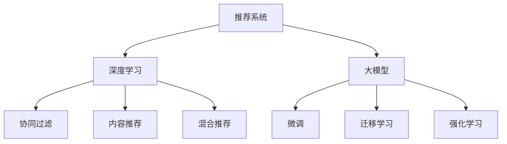

                 

## 1. 背景介绍

### 1.1 问题由来

在信息爆炸的时代，用户需要从海量的数据中迅速找到自己感兴趣的内容。推荐系统因此成为互联网上不可或缺的重要工具，影响着用户的购物决策、娱乐选择、社交互动等多个方面。近年来，随着深度学习技术的发展，推荐系统逐渐从传统协同过滤向基于深度学习的推荐方法转变，其中大模型的使用为推荐系统注入了新的活力。

### 1.2 问题核心关键点

大模型在推荐系统中的应用主要体现在以下几个方面：

1. **模型参数量**：传统的基于逻辑回归、SVM等浅层模型的推荐方法，参数量较少，难以表达复杂的用户-物品关系。大模型通常拥有数十亿甚至上百亿的参数，可以更好地捕捉和表达复杂的用户行为和物品属性。

2. **特征表达能力**：大模型能够处理多种类型的输入数据，包括文本、图像、音频等，能够综合利用多种数据源进行推荐。例如，BERT模型在文本处理上具有强大的表达能力，可以抽取用户评论、产品描述中的丰富语义信息。

3. **泛化能力**：大模型通过在大规模无标签数据上进行预训练，获得了广泛的泛化能力。这意味着它们能够处理未见过的数据，并根据学习到的模式进行推荐。

4. **可迁移性**：大模型通过微调可以在不同的推荐任务之间共享知识，提高模型的泛化性能。例如，通过微调一个通用语言模型可以应用于不同领域的推荐任务，如电商推荐、新闻推荐等。

5. **高效性**：尽管大模型参数量巨大，但其在推理时通过精简计算图等技术，可以高效地进行推荐计算，提升推荐系统的响应速度。

大模型的应用提高了推荐系统的准确性和多样性，但也带来了新的挑战，如模型复杂度增加、训练和推理成本上升等问题。

### 1.3 问题研究意义

大模型在推荐系统中的应用，使得推荐系统能够更好地理解用户需求和物品属性，提供更加个性化和多样化的推荐内容。这不仅能提升用户体验，还能增加商业价值。同时，大模型还可以应用于推荐系统的自动化调参、推荐策略优化等多个环节，推动推荐技术的不断进步。

研究大模型在推荐系统中的应用，有助于理解大模型在推荐系统中的作用机制，探讨如何更高效地利用大模型的能力，以解决推荐系统面临的实际问题，推动推荐技术的进一步发展。

## 2. 核心概念与联系

### 2.1 核心概念概述

为更好地理解大模型在推荐系统中的应用，本节将介绍几个密切相关的核心概念：

- **推荐系统（Recommendation System）**：通过分析用户的历史行为、兴趣偏好、物品属性等信息，为用户推荐感兴趣物品的系统。推荐系统包括协同过滤、内容推荐、混合推荐等多种类型。

- **深度学习（Deep Learning）**：一类基于神经网络的机器学习方法，通过多层次的非线性变换，实现对复杂数据的建模。深度学习在大模型中的应用尤为广泛。

- **大模型（Large Model）**：指参数量在数十亿甚至上百亿的神经网络模型，如BERT、GPT-3等。这些模型通过在大规模无标签数据上进行预训练，获得了强大的特征表达能力和泛化能力。

- **微调（Fine-Tuning）**：指在大模型的基础上，针对特定推荐任务进行参数更新，以提高模型在该任务上的性能。微调过程中，通常只更新少量模型参数，以保持大模型的泛化能力。

- **迁移学习（Transfer Learning）**：指将一个任务学到的知识迁移到另一个相关任务上的学习方法。大模型的迁移学习可以显著提升推荐系统的性能，特别是在数据稀缺的情况下。

- **强化学习（Reinforcement Learning）**：一种通过与环境互动，不断优化行为策略的学习方法。强化学习在大模型推荐系统中也有应用，如通过优化推荐策略，提高用户体验和推荐效果。

这些核心概念之间的逻辑关系可以通过以下Mermaid流程图来展示：



这个流程图展示了大模型与推荐系统的主要关系：

1. 推荐系统通过深度学习和大模型进行建模和预测。
2. 大模型通过微调和迁移学习，在推荐任务中提升性能。
3. 强化学习在大模型推荐系统中优化推荐策略。
4. 协同过滤、内容推荐、混合推荐等推荐类型，都可以应用大模型进行优化。

## 3. 核心算法原理 & 具体操作步骤

### 3.1 算法原理概述

大模型在推荐系统中的应用，主要基于以下算法原理：

1. **预训练大模型**：在大规模无标签数据上进行预训练，学习通用的语言和视觉表示。

2. **微调**：在大模型的基础上，针对具体的推荐任务进行微调，以提高模型在该任务上的性能。

3. **特征抽取与融合**：将不同类型的输入数据（如文本、图像、音频等）通过大模型进行特征抽取，并将其融合在一起，进行推荐决策。

4. **个性化推荐**：利用大模型的泛化能力，根据用户的历史行为和兴趣偏好，生成个性化的推荐结果。

5. **协同过滤与内容推荐**：结合大模型的特征表示，改进协同过滤和内容推荐算法，提高推荐效果。

6. **强化学习**：在大模型的基础上，利用强化学习算法优化推荐策略，提升用户体验和推荐效果。

### 3.2 算法步骤详解

大模型在推荐系统中的应用，一般包括以下几个关键步骤：

**Step 1: 准备数据集**
- 收集用户行为数据（如点击、浏览、评分等）和物品属性数据（如标签、描述等）。
- 将数据集分为训练集、验证集和测试集。

**Step 2: 加载预训练模型**
- 选择合适的大模型，如BERT、GPT-3等，进行加载。
- 对大模型进行微调，以适应推荐任务。

**Step 3: 添加任务适配层**
- 根据推荐任务类型，在预训练模型上添加任务适配层。
- 对于推荐排序任务，通常使用线性分类器或神经网络进行优化。
- 对于推荐生成任务，通常使用生成模型或序列到序列模型进行优化。

**Step 4: 设置微调超参数**
- 选择合适的优化器及其参数，如Adam、SGD等，设置学习率、批大小、迭代轮数等。
- 设置正则化技术及强度，包括权重衰减、Dropout、Early Stopping等。
- 确定冻结预训练参数的策略，如仅微调顶层，或全部参数都参与微调。

**Step 5: 执行梯度训练**
- 将训练集数据分批次输入模型，前向传播计算损失函数。
- 反向传播计算参数梯度，根据设定的优化算法和学习率更新模型参数。
- 周期性在验证集上评估模型性能，根据性能指标决定是否触发 Early Stopping。
- 重复上述步骤直到满足预设的迭代轮数或 Early Stopping 条件。

**Step 6: 测试和部署**
- 在测试集上评估微调后模型在推荐任务上的性能，对比微调前后的精度提升。
- 使用微调后的模型对新样本进行推荐，集成到实际的应用系统中。
- 持续收集新的数据，定期重新微调模型，以适应数据分布的变化。

以上是使用大模型进行推荐系统微调的一般流程。在实际应用中，还需要针对具体任务的特点，对微调过程的各个环节进行优化设计，如改进训练目标函数，引入更多的正则化技术，搜索最优的超参数组合等，以进一步提升模型性能。

### 3.3 算法优缺点

大模型在推荐系统中的应用，具有以下优点：

1. **强大的特征表达能力**：大模型能够处理多种类型的输入数据，并从中提取出丰富的语义和视觉信息，从而提高推荐的准确性和多样性。

2. **高效的推理速度**：尽管大模型参数量巨大，但其在推理时通过精简计算图等技术，可以高效地进行推荐计算，提升推荐系统的响应速度。

3. **泛化能力**：大模型通过在大规模无标签数据上进行预训练，获得了广泛的泛化能力。这意味着它们能够处理未见过的数据，并根据学习到的模式进行推荐。

4. **可迁移性**：大模型通过微调可以在不同的推荐任务之间共享知识，提高模型的泛化性能。例如，通过微调一个通用语言模型可以应用于不同领域的推荐任务，如电商推荐、新闻推荐等。

同时，大模型在推荐系统中的应用也存在一些局限性：

1. **高计算和存储成本**：大模型的训练和推理需要大量的计算资源和存储空间，增加了推荐系统的部署成本。

2. **复杂性增加**：大模型的参数量和计算复杂度较高，增加了推荐系统的设计和维护难度。

3. **过拟合风险**：由于大模型的参数量较大，可能存在过拟合的风险，需要引入正则化技术进行控制。

4. **模型解释性不足**：大模型的决策过程较为复杂，难以进行解释和调试，可能影响推荐系统的透明度和可信度。

尽管存在这些局限性，但大模型在推荐系统中的应用已经取得了显著的效果，并且在不断发展和改进中。

### 3.4 算法应用领域

大模型在推荐系统中的应用已经涵盖了多个领域，例如：

1. **电商推荐**：基于用户历史浏览和购买记录，通过大模型生成个性化的商品推荐。

2. **新闻推荐**：根据用户阅读历史和兴趣偏好，推荐相关的新闻文章。

3. **音乐推荐**：通过分析用户的听歌历史和评分，推荐相似的音乐和艺人。

4. **视频推荐**：根据用户的观看历史和偏好，推荐相关视频和频道。

5. **社交网络**：基于用户的互动行为和社交关系，推荐新的人脉和内容。

除了上述这些经典应用外，大模型还逐渐应用于更多场景中，如电影推荐、游戏推荐、广告推荐等，为推荐技术带来了新的突破。

## 4. 数学模型和公式 & 详细讲解  
### 4.1 数学模型构建

本节将使用数学语言对大模型在推荐系统中的应用进行更加严格的刻画。

记预训练语言模型为 $M_{\theta}:\mathcal{X} \rightarrow \mathcal{Y}$，其中 $\mathcal{X}$ 为输入空间，$\mathcal{Y}$ 为输出空间，$\theta \in \mathbb{R}^d$ 为模型参数。假设推荐任务为 $\text{Ranking}$，输入为 $(x_i, x_j)$，其中 $x_i$ 为用户历史行为，$x_j$ 为物品属性信息。

定义模型 $M_{\theta}$ 在输入 $(x_i, x_j)$ 上的损失函数为 $\ell(M_{\theta}(x_i),M_{\theta}(x_j))$，则在数据集 $D=\{(x_i, x_j, y_i)\}_{i=1}^N, (x_i, x_j, y_i) \in \mathcal{X} \times \mathcal{X} \times \{1, -1\}$ 上的经验风险为：

$$
\mathcal{L}(\theta) = \frac{1}{N} \sum_{i=1}^N \ell(M_{\theta}(x_i),M_{\theta}(x_j))
$$

其中 $y_i$ 表示物品 $x_i$ 与用户 $x_j$ 的推荐关系，$\ell$ 为交叉熵损失函数，用于衡量模型输出与真实标签之间的差异。

### 4.2 公式推导过程

以下我们以电商推荐任务为例，推导交叉熵损失函数及其梯度的计算公式。

假设模型 $M_{\theta}$ 在输入 $(x_i, x_j)$ 上的输出为 $[\hat{p}(x_i|x_j), \hat{p}(x_j|x_i)]$，表示物品 $x_i$ 被用户 $x_j$ 推荐和不被推荐的可能性。真实标签 $y \in \{1, -1\}$。则交叉熵损失函数定义为：

$$
\ell(M_{\theta}(x_i),M_{\theta}(x_j)) = -y_i\log \hat{p}(x_i|x_j) - (1-y_i)\log (1-\hat{p}(x_i|x_j))
$$

将其代入经验风险公式，得：

$$
\mathcal{L}(\theta) = -\frac{1}{N}\sum_{i=1}^N [y_i\log \hat{p}(x_i|x_j)+(1-y_i)\log(1-\hat{p}(x_i|x_j))]
$$

根据链式法则，损失函数对参数 $\theta_k$ 的梯度为：

$$
\frac{\partial \mathcal{L}(\theta)}{\partial \theta_k} = -\frac{1}{N}\sum_{i=1}^N (\frac{y_i}{\hat{p}(x_i|x_j)}-\frac{1-y_i}{1-\hat{p}(x_i|x_j)}) \frac{\partial \hat{p}(x_i|x_j)}{\partial \theta_k}
$$

其中 $\frac{\partial \hat{p}(x_i|x_j)}{\partial \theta_k}$ 可进一步递归展开，利用自动微分技术完成计算。

在得到损失函数的梯度后，即可带入参数更新公式，完成模型的迭代优化。重复上述过程直至收敛，最终得到适应推荐任务的最优模型参数 $\theta^*$。

## 5. 项目实践：代码实例和详细解释说明
### 5.1 开发环境搭建

在进行推荐系统微调实践前，我们需要准备好开发环境。以下是使用Python进行PyTorch开发的环境配置流程：

1. 安装Anaconda：从官网下载并安装Anaconda，用于创建独立的Python环境。

2. 创建并激活虚拟环境：
```bash
conda create -n pytorch-env python=3.8 
conda activate pytorch-env
```

3. 安装PyTorch：根据CUDA版本，从官网获取对应的安装命令。例如：
```bash
conda install pytorch torchvision torchaudio cudatoolkit=11.1 -c pytorch -c conda-forge
```

4. 安装Transformers库：
```bash
pip install transformers
```

5. 安装各类工具包：
```bash
pip install numpy pandas scikit-learn matplotlib tqdm jupyter notebook ipython
```

完成上述步骤后，即可在`pytorch-env`环境中开始推荐系统微调实践。

### 5.2 源代码详细实现

这里我们以电商推荐任务为例，给出使用Transformers库对BERT模型进行推荐系统微调的PyTorch代码实现。

首先，定义推荐任务的数据处理函数：

```python
from transformers import BertTokenizer
from torch.utils.data import Dataset
import torch

class RecommendationDataset(Dataset):
    def __init__(self, user_items, item_features, tokenizer, max_len=128):
        self.user_items = user_items
        self.item_features = item_features
        self.tokenizer = tokenizer
        self.max_len = max_len
        
    def __len__(self):
        return len(self.user_items)
    
    def __getitem__(self, item):
        user_id, item_id = self.user_items[item]
        item_features = self.item_features[item_id]
        
        # 对用户行为和物品属性进行编码
        user_input = user_id
        item_input = [item_id, item_features]
        encoding = self.tokenizer(user_input, item_input, return_tensors='pt', max_length=self.max_len, padding='max_length', truncation=True)
        input_ids = encoding['input_ids'][0]
        attention_mask = encoding['attention_mask'][0]
        
        # 对物品属性进行编码
        encoded_item_features = self.tokenizer(item_features, return_tensors='pt', max_length=self.max_len, padding='max_length', truncation=True)
        input_ids_item = encoded_item_features['input_ids'][0]
        attention_mask_item = encoded_item_features['attention_mask'][0]
        
        # 将用户行为和物品属性编码拼接
        input_ids = torch.cat([input_ids, input_ids_item], dim=0)
        attention_mask = torch.cat([attention_mask, attention_mask_item], dim=0)
        
        return {'input_ids': input_ids, 
                'attention_mask': attention_mask,
                'item_features': item_features}
```

然后，定义模型和优化器：

```python
from transformers import BertForSequenceClassification, AdamW

model = BertForSequenceClassification.from_pretrained('bert-base-cased', num_labels=2)

optimizer = AdamW(model.parameters(), lr=2e-5)
```

接着，定义训练和评估函数：

```python
from torch.utils.data import DataLoader
from tqdm import tqdm
from sklearn.metrics import accuracy_score

device = torch.device('cuda') if torch.cuda.is_available() else torch.device('cpu')
model.to(device)

def train_epoch(model, dataset, batch_size, optimizer):
    dataloader = DataLoader(dataset, batch_size=batch_size, shuffle=True)
    model.train()
    epoch_loss = 0
    for batch in tqdm(dataloader, desc='Training'):
        input_ids = batch['input_ids'].to(device)
        attention_mask = batch['attention_mask'].to(device)
        item_features = batch['item_features']
        
        model.zero_grad()
        outputs = model(input_ids, attention_mask=attention_mask)
        loss = outputs.loss
        epoch_loss += loss.item()
        loss.backward()
        optimizer.step()
    return epoch_loss / len(dataloader)

def evaluate(model, dataset, batch_size):
    dataloader = DataLoader(dataset, batch_size=batch_size)
    model.eval()
    preds, labels = [], []
    with torch.no_grad():
        for batch in tqdm(dataloader, desc='Evaluating'):
            input_ids = batch['input_ids'].to(device)
            attention_mask = batch['attention_mask'].to(device)
            item_features = batch['item_features']
            
            outputs = model(input_ids, attention_mask=attention_mask)
            preds.append(outputs.logits.argmax(dim=1).to('cpu').tolist())
            labels.append(batch['item_features'].to('cpu').tolist())
                
    print(accuracy_score(labels, preds))
```

最后，启动训练流程并在测试集上评估：

```python
epochs = 5
batch_size = 16

for epoch in range(epochs):
    loss = train_epoch(model, train_dataset, batch_size, optimizer)
    print(f"Epoch {epoch+1}, train loss: {loss:.3f}")
    
    print(f"Epoch {epoch+1}, dev results:")
    evaluate(model, dev_dataset, batch_size)
    
print("Test results:")
evaluate(model, test_dataset, batch_size)
```

以上就是使用PyTorch对BERT进行电商推荐任务微调的完整代码实现。可以看到，得益于Transformers库的强大封装，我们可以用相对简洁的代码完成BERT模型的加载和微调。

### 5.3 代码解读与分析

让我们再详细解读一下关键代码的实现细节：

**RecommendationDataset类**：
- `__init__`方法：初始化用户行为数据、物品属性数据、分词器等关键组件。
- `__len__`方法：返回数据集的样本数量。
- `__getitem__`方法：对单个样本进行处理，将用户行为和物品属性输入编码为token ids，并将其拼接在一起，返回模型所需的输入。

**训练和评估函数**：
- 使用PyTorch的DataLoader对数据集进行批次化加载，供模型训练和推理使用。
- 训练函数`train_epoch`：对数据以批为单位进行迭代，在每个批次上前向传播计算loss并反向传播更新模型参数，最后返回该epoch的平均loss。
- 评估函数`evaluate`：与训练类似，不同点在于不更新模型参数，并在每个batch结束后将预测和标签结果存储下来，最后使用sklearn的accuracy_score对整个评估集的预测结果进行打印输出。

**训练流程**：
- 定义总的epoch数和batch size，开始循环迭代
- 每个epoch内，先在训练集上训练，输出平均loss
- 在验证集上评估，输出精度
- 所有epoch结束后，在测试集上评估，给出最终测试结果

可以看到，PyTorch配合Transformers库使得BERT微调的代码实现变得简洁高效。开发者可以将更多精力放在数据处理、模型改进等高层逻辑上，而不必过多关注底层的实现细节。

当然，工业级的系统实现还需考虑更多因素，如模型的保存和部署、超参数的自动搜索、更灵活的任务适配层等。但核心的微调范式基本与此类似。

## 6. 实际应用场景
### 6.1 智能客服系统

基于大语言模型微调的推荐技术，可以广泛应用于智能客服系统的构建。传统客服往往需要配备大量人力，高峰期响应缓慢，且一致性和专业性难以保证。而使用微调后的推荐系统，可以7x24小时不间断服务，快速响应客户咨询，用推荐的内容引导客户查询，提高服务效率和满意度。

在技术实现上，可以收集企业内部的历史客服对话记录，将常见问题及答案构建成监督数据，在此基础上对预训练推荐模型进行微调。微调后的推荐系统能够自动推荐最佳回答模板，并根据上下文进行个性化调整，提升客户体验。对于客户提出的新问题，还可以接入检索系统实时搜索相关内容，动态生成推荐答案。如此构建的智能客服系统，能大幅提升客户咨询体验和问题解决效率。

### 6.2 金融舆情监测

金融机构需要实时监测市场舆论动向，以便及时应对负面信息传播，规避金融风险。传统的人工监测方式成本高、效率低，难以应对网络时代海量信息爆发的挑战。基于大语言模型微调的文本分类和情感分析技术，为金融舆情监测提供了新的解决方案。

具体而言，可以收集金融领域相关的新闻、报道、评论等文本数据，并对其进行主题标注和情感标注。在此基础上对预训练语言模型进行微调，使其能够自动判断文本属于何种主题，情感倾向是正面、中性还是负面。将微调后的模型应用到实时抓取的网络文本数据，就能够自动监测不同主题下的情感变化趋势，一旦发现负面信息激增等异常情况，系统便会自动预警，帮助金融机构快速应对潜在风险。

### 6.3 个性化推荐系统

当前的推荐系统往往只依赖用户的历史行为数据进行物品推荐，无法深入理解用户的真实兴趣偏好。基于大语言模型微调技术，个性化推荐系统可以更好地挖掘用户行为背后的语义信息，从而提供更精准、多样的推荐内容。

在实践中，可以收集用户浏览、点击、评论、分享等行为数据，提取和用户交互的物品标题、描述、标签等文本内容。将文本内容作为模型输入，用户的后续行为（如是否点击、购买等）作为监督信号，在此基础上微调预训练语言模型。微调后的模型能够从文本内容中准确把握用户的兴趣点。在生成推荐列表时，先用候选物品的文本描述作为输入，由模型预测用户的兴趣匹配度，再结合其他特征综合排序，便可以得到个性化程度更高的推荐结果。

### 6.4 未来应用展望

随着大语言模型微调技术的发展，推荐系统在更多领域得到了应用，为传统行业带来了变革性影响。

在智慧医疗领域，基于微调的医疗推荐系统可以提升医疗服务的智能化水平，辅助医生诊疗，加速新药开发进程。

在智能教育领域，微调技术可应用于作业批改、学情分析、知识推荐等方面，因材施教，促进教育公平，提高教学质量。

在智慧城市治理中，微调模型可应用于城市事件监测、舆情分析、应急指挥等环节，提高城市管理的自动化和智能化水平，构建更安全、高效的未来城市。

此外，在企业生产、社会治理、文娱传媒等众多领域，基于大模型微调的人工智能应用也将不断涌现，为经济社会发展注入新的动力。相信随着技术的日益成熟，微调方法将成为人工智能落地应用的重要范式，推动人工智能技术在垂直行业的规模化落地。总之，微调需要开发者根据具体任务，不断迭代和优化模型、数据和算法，方能得到理想的效果。

## 7. 工具和资源推荐
### 7.1 学习资源推荐

为了帮助开发者系统掌握大模型在推荐系统中的应用，这里推荐一些优质的学习资源：

1. 《深度学习推荐系统》书籍：介绍推荐系统的发展历程、经典算法和最新技术，涵盖深度学习推荐系统的多个方面。

2. 《推荐系统实战》书籍：结合实际业务案例，讲解推荐系统的设计与实现，从算法到工程实践，提供全方位的指导。

3. Coursera《深度学习基础》课程：由斯坦福大学开设，系统讲解深度学习的基本原理和应用，适合初学者入门。

4. Udacity《深度学习推荐系统》课程：讲解推荐系统的设计与优化，包括深度学习、强化学习等多个方面，适合进阶学习。

5. Kaggle推荐系统竞赛：通过参与竞赛，实战练习推荐系统设计和优化，提升解决实际问题的能力。

通过对这些资源的学习实践，相信你一定能够快速掌握大模型在推荐系统中的应用，并用于解决实际的推荐问题。
###  7.2 开发工具推荐

高效的开发离不开优秀的工具支持。以下是几款用于推荐系统微调开发的常用工具：

1. PyTorch：基于Python的开源深度学习框架，灵活动态的计算图，适合快速迭代研究。大部分预训练语言模型都有PyTorch版本的实现。

2. TensorFlow：由Google主导开发的开源深度学习框架，生产部署方便，适合大规模工程应用。同样有丰富的预训练语言模型资源。

3. Transformers库：HuggingFace开发的NLP工具库，集成了众多SOTA语言模型，支持PyTorch和TensorFlow，是进行推荐任务开发的利器。

4. Weights & Biases：模型训练的实验跟踪工具，可以记录和可视化模型训练过程中的各项指标，方便对比和调优。与主流深度学习框架无缝集成。

5. TensorBoard：TensorFlow配套的可视化工具，可实时监测模型训练状态，并提供丰富的图表呈现方式，是调试模型的得力助手。

6. Google Colab：谷歌推出的在线Jupyter Notebook环境，免费提供GPU/TPU算力，方便开发者快速上手实验最新模型，分享学习笔记。

合理利用这些工具，可以显著提升推荐系统微调的开发效率，加快创新迭代的步伐。

### 7.3 相关论文推荐

大语言模型和推荐系统的发展源于学界的持续研究。以下是几篇奠基性的相关论文，推荐阅读：

1. Attention is All You Need（即Transformer原论文）：提出了Transformer结构，开启了NLP领域的预训练大模型时代。

2. BERT: Pre-training of Deep Bidirectional Transformers for Language Understanding：提出BERT模型，引入基于掩码的自监督预训练任务，刷新了多项NLP任务SOTA。

3. Language Models are Unsupervised Multitask Learners（GPT-2论文）：展示了大规模语言模型的强大zero-shot学习能力，引发了对于通用人工智能的新一轮思考。

4. Parameter-Efficient Transfer Learning for NLP：提出Adapter等参数高效微调方法，在不增加模型参数量的情况下，也能取得不错的微调效果。

5. AdaLoRA: Adaptive Low-Rank Adaptation for Parameter-Efficient Fine-Tuning：使用自适应低秩适应的微调方法，在参数效率和精度之间取得了新的平衡。

这些论文代表了大语言模型和推荐系统的发展脉络。通过学习这些前沿成果，可以帮助研究者把握学科前进方向，激发更多的创新灵感。

## 8. 总结：未来发展趋势与挑战

### 8.1 总结

本文对大模型在推荐系统中的应用进行了全面系统的介绍。首先阐述了大模型和推荐系统的研究背景和意义，明确了微调在推荐系统中的重要地位。其次，从原理到实践，详细讲解了大模型在推荐系统中的算法原理和具体操作步骤，给出了推荐系统微调任务开发的完整代码实例。同时，本文还探讨了推荐系统在大模型微调技术中的应用前景，展示了微调范式的广泛潜力。最后，本文精选了推荐系统的学习资源和开发工具，力求为读者提供全方位的技术指引。

通过本文的系统梳理，可以看到，大模型在推荐系统中的应用，使得推荐系统能够更好地理解用户需求和物品属性，提供更加个性化和多样化的推荐内容。这不仅能提升用户体验，还能增加商业价值。同时，大模型还可以应用于推荐系统的自动化调参、推荐策略优化等多个环节，推动推荐技术的不断进步。未来，伴随大语言模型微调方法的持续演进，相信推荐系统将在更多领域得到应用，为推荐技术带来新的突破。

### 8.2 未来发展趋势

展望未来，大模型在推荐系统中的应用将呈现以下几个发展趋势：

1. **模型规模持续增大**：随着算力成本的下降和数据规模的扩张，预训练语言模型的参数量还将持续增长。超大规模语言模型蕴含的丰富语言知识，有望支撑更加复杂多变的推荐任务。

2. **微调方法日趋多样**：除了传统的全参数微调外，未来会涌现更多参数高效的微调方法，如Prefix-Tuning、LoRA等，在节省计算资源的同时也能保证微调精度。

3. **持续学习成为常态**：随着数据分布的不断变化，推荐系统也需要持续学习新知识以保持性能。如何在不遗忘原有知识的同时，高效吸收新样本信息，将成为重要的研究课题。

4. **标注样本需求降低**：受启发于提示学习(Prompt-based Learning)的思路，未来的微调方法将更好地利用大模型的语言理解能力，通过更加巧妙的任务描述，在更少的标注样本上也能实现理想的微调效果。

5. **多模态微调崛起**：当前的推荐任务主要聚焦于纯文本数据，未来会进一步拓展到图像、视频、语音等多模态数据微调。多模态信息的融合，将显著提升推荐系统的推荐能力和用户体验。

6. **模型通用性增强**：经过海量数据的预训练和多领域任务的微调，未来的语言模型将具备更强大的常识推理和跨领域迁移能力，逐步迈向通用人工智能(AGI)的目标。

以上趋势凸显了大模型在推荐系统中的广阔前景。这些方向的探索发展，必将进一步提升推荐系统的性能和应用范围，为推荐技术带来新的突破。

### 8.3 面临的挑战

尽管大语言模型在推荐系统中的应用已经取得了显著的效果，但在迈向更加智能化、普适化应用的过程中，它仍面临着诸多挑战：

1. **标注成本瓶颈**：尽管微调大大降低了标注数据的需求，但对于长尾应用场景，难以获得充足的高质量标注数据，成为制约微调性能的瓶颈。如何进一步降低微调对标注样本的依赖，将是一大难题。

2. **模型鲁棒性不足**：当前推荐系统面临域外数据时，泛化性能往往大打折扣。对于测试样本的微小扰动，推荐系统的预测也容易发生波动。如何提高推荐系统的鲁棒性，避免灾难性遗忘，还需要更多理论和实践的积累。

3. **推理效率有待提高**：尽管大模型在推理时通过精简计算图等技术，可以高效地进行推荐计算，但在某些场景下，推理速度仍不足以支撑实时响应需求。如何进一步提升推理效率，优化计算资源使用，将是重要的优化方向。

4. **可解释性亟需加强**：推荐系统的决策过程较为复杂，难以进行解释和调试，可能影响推荐系统的透明度和可信度。如何赋予推荐系统更强的可解释性，将是亟待攻克的难题。

5. **安全性有待保障**：推荐系统可能学习到有偏见、有害的信息，通过微调传递到实际应用中，产生误导性、歧视性的输出，给实际应用带来安全隐患。如何从数据和算法层面消除推荐系统偏见，避免恶意用途，确保输出的安全性，也将是重要的研究课题。

6. **知识整合能力不足**：现有的推荐系统往往局限于数据本身，难以灵活吸收和运用更广泛的先验知识。如何让推荐系统更好地与外部知识库、规则库等专家知识结合，形成更加全面、准确的信息整合能力，还有很大的想象空间。

正视推荐系统面临的这些挑战，积极应对并寻求突破，将是大模型推荐系统走向成熟的必由之路。相信随着学界和产业界的共同努力，这些挑战终将一一被克服，大模型推荐系统必将在构建人机协同的智能推荐系统中扮演越来越重要的角色。

### 8.4 未来突破

面对大模型推荐系统所面临的种种挑战，未来的研究需要在以下几个方面寻求新的突破：

1. **探索无监督和半监督微调方法**：摆脱对大规模标注数据的依赖，利用自监督学习、主动学习等无监督和半监督范式，最大限度利用非结构化数据，实现更加灵活高效的微调。

2. **研究参数高效和计算高效的微调范式**：开发更加参数高效的微调方法，在固定大部分预训练参数的同时，只更新极少量的任务相关参数。同时优化推荐系统的计算图，减少前向传播和反向传播的资源消耗，实现更加轻量级、实时性的部署。

3. **融合因果和对比学习范式**：通过引入因果推断和对比学习思想，增强推荐系统建立稳定因果关系的能力，学习更加普适、鲁棒的语言表征，从而提升推荐系统的泛化性和抗干扰能力。

4. **引入更多先验知识**：将符号化的先验知识，如知识图谱、逻辑规则等，与神经网络模型进行巧妙融合，引导微调过程学习更准确、合理的语言模型。同时加强不同模态数据的整合，实现视觉、语音等多模态信息与文本信息的协同建模。

5. **结合因果分析和博弈论工具**：将因果分析方法引入推荐系统，识别出推荐决策的关键特征，增强输出解释的因果性和逻辑性。借助博弈论工具刻画人机交互过程，主动探索并规避推荐系统的脆弱点，提高系统稳定性。

6. **纳入伦理道德约束**：在推荐系统的训练目标中引入伦理导向的评估指标，过滤和惩罚有偏见、有害的输出倾向。同时加强人工干预和审核，建立推荐系统的监管机制，确保输出符合人类价值观和伦理道德。

这些研究方向的探索，必将引领推荐系统迈向更高的台阶，为构建安全、可靠、可解释、可控的智能推荐系统铺平道路。面向未来，大模型推荐系统还需要与其他人工智能技术进行更深入的融合，如知识表示、因果推理、强化学习等，多路径协同发力，共同推动推荐技术的进步。只有勇于创新、敢于突破，才能不断拓展推荐系统的边界，让智能推荐系统更好地服务于人类社会。

## 9. 附录：常见问题与解答

**Q1：大模型在推荐系统中的应用是否适用于所有推荐任务？**

A: 大模型在推荐系统中的应用主要适用于数据量较大的推荐任务，特别是需要处理复杂语义关系的推荐任务，如电商推荐、新闻推荐等。对于一些需要时效性、个性化很强的任务，如实时广告推荐、个性化展示推荐等，大模型的应用需要进一步优化和调整。

**Q2：微调过程中如何选择合适的学习率？**

A: 微调的学习率一般要比预训练时小1-2个数量级，如果使用过大的学习率，容易破坏预训练权重，导致过拟合。一般建议从1e-5开始调参，逐步减小学习率，直至收敛。也可以使用warmup策略，在开始阶段使用较小的学习率，再逐渐过渡到预设值。需要注意的是，不同的优化器(如AdamW、Adafactor等)以及不同的学习率调度策略，可能需要设置不同的学习率阈值。

**Q3：采用大模型微调时会面临哪些资源瓶颈？**

A: 尽管大模型的推理速度较快，但在实际应用中仍面临一些资源瓶颈：
1. 高计算和存储成本：大模型的训练和推理需要大量的计算资源和存储空间，增加了推荐系统的部署成本。
2. 模型复杂性增加：大模型的参数量和计算复杂度较高，增加了推荐系统的设计和维护难度。
3. 推理效率仍有提升空间：尽管大模型在推理时通过精简计算图等技术，可以高效地进行推荐计算，但在某些场景下，推理速度仍不足以支撑实时响应需求。

合理利用这些工具，可以显著提升推荐系统微调的开发效率，加快创新迭代的步伐。

**Q4：如何缓解微调过程中的过拟合问题？**

A: 缓解微调过程中的过拟合问题，可以采用以下策略：
1. 数据增强：通过回译、近义替换等方式扩充训练集。
2. 正则化：使用L2正则、Dropout、Early Stopping等避免过拟合。
3. 对抗训练：引入对抗样本，提高模型鲁棒性。
4. 参数高效微调：只调整少量参数(如Adapter、Prefix等)，减小过拟合风险。
5. 多模型集成：训练多个微调模型，取平均输出，抑制过拟合。

这些策略往往需要根据具体任务和数据特点进行灵活组合。只有在数据、模型、训练、推理等各环节进行全面优化，才能最大限度地发挥大模型微调的威力。

**Q5：微调模型在落地部署时需要注意哪些问题？**

A: 将微调模型转化为实际应用，还需要考虑以下因素：
1. 模型裁剪：去除不必要的层和参数，减小模型尺寸，加快推理速度。
2. 量化加速：将浮点模型转为定点模型，压缩存储空间，提高计算效率。
3. 服务化封装：将模型封装为标准化服务接口，便于集成调用。
4. 弹性伸缩：根据请求流量动态调整资源配置，平衡服务质量和成本。
5. 监控告警：实时采集系统指标，设置异常告警阈值，确保服务稳定性。
6. 安全防护：采用访问鉴权、数据脱敏等措施，保障数据和模型安全。

合理利用这些工具，可以显著提升推荐系统微调的开发效率，加快创新迭代的步伐。

总之，微调需要开发者根据具体任务，不断迭代和优化模型、数据和算法，方能得到理想的效果。

---

作者：禅与计算机程序设计艺术 / Zen and the Art of Computer Programming

