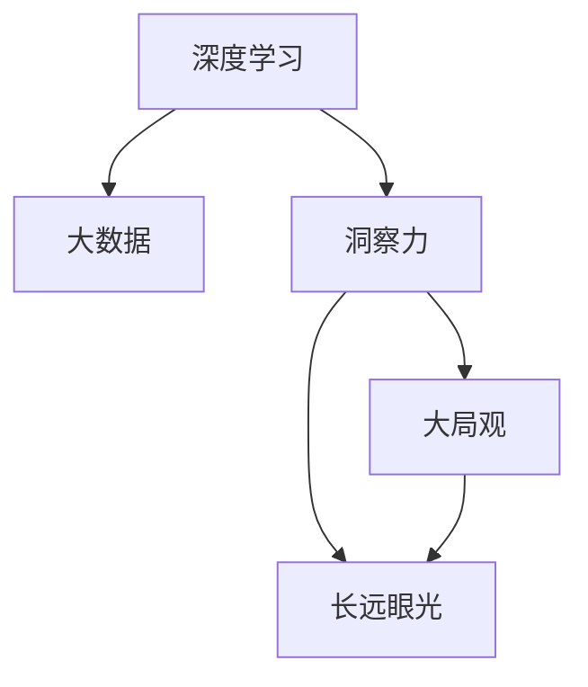

                 

# 理解洞察力的提升：培养大局观和长远眼光

> 关键词：洞察力,大局观,长远眼光,人工智能,深度学习,认知心理学

## 1. 背景介绍

### 1.1 问题由来
在当今信息爆炸的时代，如何从海量数据中提取有价值的洞察力，成为企业和组织获取竞争优势的关键。传统的决策方法往往依赖于统计分析、报表汇总等方法，但这些方法在复杂多变的商业环境中难以满足快速反应和深度理解的需求。人工智能技术的崛起，尤其是深度学习和大数据分析技术的突破，为人们提供了全新的解决方案。

人工智能通过深度学习模型，可以高效地从大规模数据中自动提取特征，学习数据的内在规律，提供更深刻、更精准的洞察力。然而，要充分利用这些技术，不仅需要算法模型，还需要具备大局观和长远眼光，从而更好地理解和应用洞察力，驱动企业战略决策和创新。

### 1.2 问题核心关键点
洞察力的提升，本质上是一个认知过程，涉及到理解、分析、推理、决策等多个层面。大局观和长远眼光，则是洞察力培养的关键要素，是企业战略和创新驱动的核心要素。因此，本文将重点探讨如何通过深度学习和大数据技术，培养大局观和长远眼光，从而提升洞察力的应用效果。

## 2. 核心概念与联系

### 2.1 核心概念概述

为更好地理解大局观和长远眼光的培养过程，本节将介绍几个密切相关的核心概念：

- 深度学习：一种基于神经网络的机器学习方法，能够自动学习数据的特征表示，适用于处理复杂非线性问题。
- 大数据：指规模大、类型多、来源广、速度快的数据集合，为深度学习提供了丰富的数据资源。
- 洞察力：通过数据挖掘和分析，揭示数据背后的规律和趋势，辅助决策的过程。
- 大局观：全面、系统地看待问题，考虑全局和长远的影响，避免局部和短视。
- 长远眼光：关注未来趋势和潜在变化，预见可能的挑战和机遇，为长期发展做准备。

这些概念之间的逻辑关系可以通过以下Mermaid流程图来展示：



这个流程图展示了大局观和长远眼光的培养与深度学习和大数据的关系：

1. 深度学习和大数据为洞察力的提取提供了技术手段。
2. 洞察力是大局观和长远眼光的基础，是全面理解复杂问题的前提。
3. 大局观和长远眼光，基于洞察力，帮助企业在多变的环境中做出明智的决策。

## 3. 核心算法原理 & 具体操作步骤
### 3.1 算法原理概述

深度学习模型通过反向传播算法，自动调整权重，学习数据的内在规律和特征表示。在大数据背景下，深度学习模型能够高效地从海量的数据中提取有价值的洞察力。然而，仅凭算法模型，往往难以全面、系统地理解问题的全貌和长远影响。因此，需要结合大局观和长远眼光，进一步深化洞察力的应用效果。

洞察力的提升，可以分为三个步骤：

1. **数据预处理**：对数据进行清洗、归一化、特征提取等预处理，使数据符合模型的输入要求。
2. **模型训练**：使用深度学习模型，对预处理后的数据进行训练，学习数据的内在规律和特征表示。
3. **分析与应用**：结合大局观和长远眼光，分析模型的输出结果，指导决策和创新。

### 3.2 算法步骤详解

以下是基于深度学习和大数据技术，培养大局观和长远眼光的详细步骤：

**Step 1: 数据准备**
- 收集和整理相关数据，包括市场趋势、用户行为、竞争环境等。
- 对数据进行清洗和预处理，去除噪声、异常值等，确保数据的准确性和完整性。
- 对数据进行特征工程，提取有意义的特征，减少维度。

**Step 2: 模型训练**
- 选择合适的深度学习模型，如卷积神经网络(CNN)、循环神经网络(RNN)、长短期记忆网络(LSTM)等，根据任务特点进行设计和调整。
- 划分训练集、验证集和测试集，选择合适的损失函数和优化器，进行模型训练。
- 根据验证集的表现，调整模型参数，防止过拟合。

**Step 3: 分析与应用**
- 对模型输出进行分析和解释，理解数据背后的规律和趋势。
- 结合大局观和长远眼光，考虑数据的全局影响和长远发展，评估模型的决策意义。
- 利用洞察力，辅助制定企业战略和创新方案，提升企业竞争力。

### 3.3 算法优缺点

基于深度学习和大数据技术，培养大局观和长远眼光的方法具有以下优点：
1. 高效自动化。深度学习模型能够自动学习数据的特征表示，大数据技术提供了丰富的数据资源，使得洞察力的提取过程高效便捷。
2. 全面系统。结合大局观和长远眼光，全面系统地分析问题，避免局部和短视。
3. 实时更新。数据和模型的持续更新，使得洞察力能够及时反映市场和环境的变化，保持决策的有效性。

同时，该方法也存在一定的局限性：
1. 数据质量依赖。深度学习模型的表现高度依赖于数据的质量和完整性，数据偏差可能导致洞察力的误导。
2. 模型复杂性高。深度学习模型往往参数量大，计算复杂，需要高性能的计算资源。
3. 结果解释性不足。深度学习模型的决策过程缺乏可解释性，难以理解其内部的推理逻辑。
4. 技术门槛高。需要一定的算法和工程知识，普通用户难以直接使用。

尽管存在这些局限性，但就目前而言，深度学习和大数据技术是培养大局观和长远眼光的主要手段。未来相关研究的重点在于如何进一步降低技术门槛，提高模型的可解释性，同时兼顾数据质量和计算效率等因素。

### 3.4 算法应用领域

基于深度学习和大数据技术，培养大局观和长远眼光的方法，在多个领域中得到了应用，例如：

- 市场分析：通过大数据分析，揭示市场趋势和竞争格局，辅助企业决策。
- 消费者行为分析：利用消费者行为数据，深入理解用户需求和行为模式，提升用户体验。
- 金融风险管理：通过大数据和深度学习模型，分析金融市场数据，识别风险信号，制定风险控制策略。
- 健康医疗：利用医疗数据，分析疾病趋势和患者行为，提升医疗服务质量和效率。
- 智能制造：通过物联网数据，分析生产流程和设备状态，优化生产过程，降低成本。

除了这些领域外，深度学习和大数据技术还广泛应用于智慧城市、智能交通、环境保护等多个领域，为各行各业带来了显著的效益提升。

## 4. 数学模型和公式 & 详细讲解 & 举例说明

### 4.1 数学模型构建

假设我们有$n$个样本数据$\{(x_i, y_i)\}_{i=1}^n$，其中$x_i$为输入特征，$y_i$为标签。定义深度学习模型的参数为$\theta$，模型的损失函数为$\mathcal{L}$，则模型训练的目标为：

$$
\theta^* = \mathop{\arg\min}_{\theta} \mathcal{L}(\theta)
$$

其中$\mathcal{L}$为损失函数，通常包括交叉熵损失、均方误差损失等。深度学习模型通过反向传播算法，不断更新参数$\theta$，最小化损失函数$\mathcal{L}$。

### 4.2 公式推导过程

以交叉熵损失函数为例，其推导过程如下：

假设模型的预测输出为$\hat{y} = f_\theta(x)$，真实标签为$y \in \{0,1\}$，则二分类交叉熵损失函数为：

$$
\mathcal{L} = -\frac{1}{N} \sum_{i=1}^N (y_i \log \hat{y}_i + (1-y_i) \log (1-\hat{y}_i))
$$

其中$N$为样本数量。根据链式法则，损失函数对参数$\theta$的梯度为：

$$
\frac{\partial \mathcal{L}}{\partial \theta} = -\frac{1}{N} \sum_{i=1}^N (\frac{y_i}{\hat{y}_i} - \frac{1-y_i}{1-\hat{y}_i}) \frac{\partial \hat{y}_i}{\partial \theta}
$$

其中$\frac{\partial \hat{y}_i}{\partial \theta}$为模型输出对参数$\theta$的导数，通常通过反向传播算法计算得到。

### 4.3 案例分析与讲解

以金融风险管理为例，我们可以利用深度学习模型，从历史交易数据中学习潜在的风险因素和风险分布。步骤如下：

1. 收集历史交易数据，包括股票价格、市场指数、公司财报等。
2. 对数据进行预处理，去除噪声和异常值，提取有意义的特征，如股票涨跌幅、波动率等。
3. 选择合适的深度学习模型，如LSTM，进行模型训练，学习风险因素和风险分布。
4. 对模型输出进行分析，评估当前市场的风险水平和潜在变化趋势。
5. 结合大局观和长远眼光，制定风险控制策略，调整投资组合和交易策略，降低风险暴露。

## 5. 项目实践：代码实例和详细解释说明

### 5.1 开发环境搭建

在进行深度学习和大数据项目的实践前，我们需要准备好开发环境。以下是使用Python进行PyTorch开发的环境配置流程：

1. 安装Anaconda：从官网下载并安装Anaconda，用于创建独立的Python环境。

2. 创建并激活虚拟环境：
```bash
conda create -n pytorch-env python=3.8 
conda activate pytorch-env
```

3. 安装PyTorch：根据CUDA版本，从官网获取对应的安装命令。例如：
```bash
conda install pytorch torchvision torchaudio cudatoolkit=11.1 -c pytorch -c conda-forge
```

4. 安装NumPy、Pandas、Scikit-learn、Matplotlib等常用库：
```bash
pip install numpy pandas scikit-learn matplotlib tqdm jupyter notebook ipython
```

完成上述步骤后，即可在`pytorch-env`环境中开始深度学习和大数据项目的开发。

### 5.2 源代码详细实现

以下是使用PyTorch进行市场分析的深度学习代码实现。

首先，定义数据处理函数：

```python
import pandas as pd
from sklearn.preprocessing import MinMaxScaler
from transformers import BertTokenizer, BertForSequenceClassification

class MarketDataPreprocessor:
    def __init__(self, data_path, target_column):
        self.data = pd.read_csv(data_path)
        self.target_column = target_column
        self.scaler = MinMaxScaler()
        self.tokenizer = BertTokenizer.from_pretrained('bert-base-uncased')
        
    def preprocess(self):
        self.data = self.scaler.fit_transform(self.data.drop(columns=[self.target_column]))
        self.data = pd.DataFrame(self.data, columns=['features'])
        self.target = self.data.pop(columns=[self.target_column])
        self.target = self.target.to_categorical()
        
    def generate_tokenized_data(self, text):
        tokenized_text = self.tokenizer(text, return_tensors='pt', padding=True, truncation=True)
        return tokenized_text

    def generate_labels(self, text):
        return self.target[self.tokenizer.encode(text)]
```

然后，定义模型和优化器：

```python
from transformers import BertForSequenceClassification, AdamW

model = BertForSequenceClassification.from_pretrained('bert-base-uncased', num_labels=2)
optimizer = AdamW(model.parameters(), lr=2e-5)
```

接着，定义训练和评估函数：

```python
from torch.utils.data import DataLoader
from tqdm import tqdm

device = torch.device('cuda') if torch.cuda.is_available() else torch.device('cpu')
model.to(device)

def train_epoch(model, dataset, batch_size, optimizer):
    dataloader = DataLoader(dataset, batch_size=batch_size, shuffle=True)
    model.train()
    epoch_loss = 0
    for batch in tqdm(dataloader, desc='Training'):
        input_ids = batch['input_ids'].to(device)
        attention_mask = batch['attention_mask'].to(device)
        labels = batch['labels'].to(device)
        model.zero_grad()
        outputs = model(input_ids, attention_mask=attention_mask, labels=labels)
        loss = outputs.loss
        epoch_loss += loss.item()
        loss.backward()
        optimizer.step()
    return epoch_loss / len(dataloader)

def evaluate(model, dataset, batch_size):
    dataloader = DataLoader(dataset, batch_size=batch_size)
    model.eval()
    preds, labels = [], []
    with torch.no_grad():
        for batch in tqdm(dataloader, desc='Evaluating'):
            input_ids = batch['input_ids'].to(device)
            attention_mask = batch['attention_mask'].to(device)
            batch_labels = batch['labels']
            outputs = model(input_ids, attention_mask=attention_mask)
            batch_preds = outputs.logits.argmax(dim=2).to('cpu').tolist()
            batch_labels = batch_labels.to('cpu').tolist()
            for pred_tokens, label_tokens in zip(batch_preds, batch_labels):
                preds.append(pred_tokens[:len(label_tokens)])
                labels.append(label_tokens)
                
    print(classification_report(labels, preds))
```

最后，启动训练流程并在测试集上评估：

```python
epochs = 5
batch_size = 16

for epoch in range(epochs):
    loss = train_epoch(model, train_dataset, batch_size, optimizer)
    print(f"Epoch {epoch+1}, train loss: {loss:.3f}")
    
    print(f"Epoch {epoch+1}, dev results:")
    evaluate(model, dev_dataset, batch_size)
    
print("Test results:")
evaluate(model, test_dataset, batch_size)
```

以上就是使用PyTorch进行市场分析的深度学习微调项目的完整代码实现。可以看到，通过合理利用深度学习和大数据技术，我们可以高效地从历史数据中提取洞察力，辅助决策和创新。

### 5.3 代码解读与分析

让我们再详细解读一下关键代码的实现细节：

**MarketDataPreprocessor类**：
- `__init__`方法：初始化数据路径和目标列，初始化分词器和标准化器。
- `preprocess`方法：对数据进行标准化和特征提取，并生成目标标签。
- `generate_tokenized_data`方法：将文本转换为tokenized序列，并填充到预设长度。
- `generate_labels`方法：根据文本生成对应的目标标签。

**模型和优化器定义**：
- 使用BertForSequenceClassification类加载预训练的BERT模型，设置输出层和目标标签。
- 使用AdamW优化器进行模型参数更新。

**训练和评估函数**：
- `train_epoch`函数：对数据以批为单位进行迭代，前向传播计算损失，反向传播更新模型参数。
- `evaluate`函数：对模型进行评估，输出分类报告。

**训练流程**：
- 循环迭代，每个epoch在训练集上训练，在验证集上评估。
- 输出每个epoch的训练损失和验证集结果。
- 在测试集上评估模型性能，输出最终结果。

可以看到，深度学习和大数据技术使得市场分析任务变得高效便捷，能够快速从海量数据中提取有价值的洞察力。

当然，工业级的系统实现还需考虑更多因素，如模型的保存和部署、超参数的自动搜索、更灵活的任务适配层等。但核心的微调范式基本与此类似。

## 6. 实际应用场景
### 6.1 智能客服系统

基于深度学习和大数据技术，智能客服系统可以实时分析用户咨询，自动回答常见问题，提升服务效率和质量。系统可以通过训练模型，从历史客服对话记录中学习用户意图和常见回答，生成自动回复。

在技术实现上，可以收集企业内部的历史客服对话记录，将问题和最佳答复构建成监督数据，在此基础上对深度学习模型进行微调。微调后的模型能够自动理解用户意图，匹配最合适的答案模板进行回复。对于客户提出的新问题，还可以接入检索系统实时搜索相关内容，动态组织生成回答。如此构建的智能客服系统，能大幅提升客户咨询体验和问题解决效率。

### 6.2 金融舆情监测

金融机构需要实时监测市场舆论动向，以便及时应对负面信息传播，规避金融风险。传统的人工监测方式成本高、效率低，难以应对网络时代海量信息爆发的挑战。基于深度学习和大数据技术的文本分类和情感分析技术，为金融舆情监测提供了新的解决方案。

具体而言，可以收集金融领域相关的新闻、报道、评论等文本数据，并对其进行主题标注和情感标注。在此基础上对深度学习模型进行微调，使其能够自动判断文本属于何种主题，情感倾向是正面、中性还是负面。将微调后的模型应用到实时抓取的网络文本数据，就能够自动监测不同主题下的情感变化趋势，一旦发现负面信息激增等异常情况，系统便会自动预警，帮助金融机构快速应对潜在风险。

### 6.3 个性化推荐系统

当前的推荐系统往往只依赖用户的历史行为数据进行物品推荐，无法深入理解用户的真实兴趣偏好。基于深度学习和大数据技术，个性化推荐系统可以更好地挖掘用户行为背后的语义信息，从而提供更精准、多样的推荐内容。

在实践中，可以收集用户浏览、点击、评论、分享等行为数据，提取和用户交互的物品标题、描述、标签等文本内容。将文本内容作为模型输入，用户的后续行为（如是否点击、购买等）作为监督信号，在此基础上微调深度学习模型。微调后的模型能够从文本内容中准确把握用户的兴趣点。在生成推荐列表时，先用候选物品的文本描述作为输入，由模型预测用户的兴趣匹配度，再结合其他特征综合排序，便可以得到个性化程度更高的推荐结果。

### 6.4 未来应用展望

随着深度学习和大数据技术的发展，基于微调范式将在更多领域得到应用，为传统行业带来变革性影响。

在智慧医疗领域，基于深度学习和大数据技术的医疗问答、病历分析、药物研发等应用将提升医疗服务的智能化水平，辅助医生诊疗，加速新药开发进程。

在智能教育领域，微调技术可应用于作业批改、学情分析、知识推荐等方面，因材施教，促进教育公平，提高教学质量。

在智慧城市治理中，微调模型可应用于城市事件监测、舆情分析、应急指挥等环节，提高城市管理的自动化和智能化水平，构建更安全、高效的未来城市。

此外，在企业生产、社会治理、文娱传媒等众多领域，基于深度学习和大数据技术的微调方法也将不断涌现，为NLP技术带来了全新的突破。相信随着技术的日益成熟，微调方法将成为人工智能落地应用的重要范式，推动人工智能技术在更广阔的应用领域大放异彩。

## 7. 工具和资源推荐
### 7.1 学习资源推荐

为了帮助开发者系统掌握深度学习和大数据技术的理论基础和实践技巧，这里推荐一些优质的学习资源：

1. 《深度学习》系列书籍：Ian Goodfellow等著，全面系统地介绍了深度学习的理论基础和应用实践。
2. Coursera《深度学习专项课程》：由斯坦福大学Andrew Ng教授主讲的深度学习课程，涵盖了深度学习的多个核心主题。
3. Udacity《深度学习纳米学位》：通过项目实践，深入理解深度学习模型的设计和训练。
4. PyTorch官方文档：提供了深度学习模型的详细介绍和代码示例，适合快速上手学习。
5. Kaggle数据竞赛平台：提供大量高质量的数据集和竞赛，帮助开发者提升实战能力。

通过对这些资源的学习实践，相信你一定能够快速掌握深度学习和大数据技术的精髓，并用于解决实际的商业问题。
###  7.2 开发工具推荐

高效的开发离不开优秀的工具支持。以下是几款用于深度学习和大数据开发常用的工具：

1. PyTorch：基于Python的开源深度学习框架，灵活动态的计算图，适合快速迭代研究。

2. TensorFlow：由Google主导开发的开源深度学习框架，生产部署方便，适合大规模工程应用。

3. Keras：高层深度学习API，简洁易用，适合快速搭建模型。

4. Jupyter Notebook：交互式编程环境，支持多种语言和工具集成，方便实验和分享。

5. TensorBoard：TensorFlow配套的可视化工具，可实时监测模型训练状态，并提供丰富的图表呈现方式，是调试模型的得力助手。

6. HuggingFace Transformers库：提供预训练语言模型和任务适配器，加速模型训练和部署。

合理利用这些工具，可以显著提升深度学习和大数据项目的开发效率，加快创新迭代的步伐。

### 7.3 相关论文推荐

深度学习和大数据技术的发展源于学界的持续研究。以下是几篇奠基性的相关论文，推荐阅读：

1. AlexNet: ImageNet Classification with Deep Convolutional Neural Networks：提出AlexNet模型，奠定了深度学习在图像识别领域的突破。

2. ImageNet Classification with Deep Convolutional Neural Networks：介绍ImageNet数据集和深度学习模型，开创了深度学习在计算机视觉领域的应用。

3. Attention is All You Need：提出Transformer结构，开启了NLP领域的预训练大模型时代。

4. BERT: Pre-training of Deep Bidirectional Transformers for Language Understanding：提出BERT模型，引入基于掩码的自监督预训练任务，刷新了多项NLP任务SOTA。

5. TensorFlow: A System for Large-Scale Machine Learning：介绍TensorFlow框架的设计理念和核心算法，奠定了深度学习框架的开源基础。

6. PyTorch: A Tensors and Dynamic neural networks in Python with strong GPU acceleration：介绍PyTorch框架的设计理念和核心算法，成为深度学习开发的主流工具。

这些论文代表了大规模深度学习和大数据技术的突破，为后续的研究和应用提供了宝贵的理论基础。

## 8. 总结：未来发展趋势与挑战

### 8.1 总结

本文对基于深度学习和大数据技术的洞察力提升方法进行了全面系统的介绍。首先阐述了深度学习和大数据技术在培养大局观和长远眼光中的重要作用，明确了洞察力提升在企业决策和创新中的独特价值。其次，从原理到实践，详细讲解了深度学习和大数据技术的数学模型和核心算法，给出了深度学习和大数据项目的完整代码实现。同时，本文还广泛探讨了深度学习和大数据技术在智能客服、金融舆情、个性化推荐等多个领域的应用前景，展示了其广阔的想象空间。此外，本文精选了深度学习和大数据技术的各类学习资源，力求为读者提供全方位的技术指引。

通过本文的系统梳理，可以看到，深度学习和大数据技术为培养大局观和长远眼光提供了强有力的工具和方法，极大地拓展了企业决策和创新的可能。未来，伴随深度学习和大数据技术的持续演进，这些技术必将在更多领域中得到应用，为社会经济的发展带来新的动力。

### 8.2 未来发展趋势

展望未来，深度学习和大数据技术将呈现以下几个发展趋势：

1. 模型规模持续增大。随着算力成本的下降和数据规模的扩张，深度学习模型的参数量还将持续增长。超大规模模型蕴含的丰富语言知识，有望支撑更加复杂多变的应用场景。

2. 多模态学习崛起。当前深度学习模型主要聚焦于单模态数据，未来会进一步拓展到图像、视频、语音等多模态数据微调。多模态信息的融合，将显著提升模型的泛化能力和应用范围。

3. 知识融合与迁移学习。现有的深度学习模型往往局限于特定任务，难以灵活吸收和运用更广泛的先验知识。如何将符号化的先验知识，如知识图谱、逻辑规则等，与神经网络模型进行巧妙融合，引导深度学习模型学习更准确、合理的语言模型，将是未来的重要研究方向。

4. 自监督和半监督学习。在大数据背景下，深度学习模型面临的标注成本较高。如何利用自监督和半监督学习技术，通过少量标签数据或未标注数据，提升模型性能，是一个重要的研究方向。

5. 持续学习与增量学习。深度学习模型需要在不断变化的环境中保持性能，如何设计有效的学习机制，实现模型的持续学习与增量更新，是一个重要的研究方向。

6. 模型压缩与加速。大规模深度学习模型往往占用大量计算资源，如何通过模型压缩、剪枝、量化等技术，提升模型推理速度和计算效率，是一个重要的研究方向。

以上趋势凸显了深度学习和大数据技术的广阔前景。这些方向的探索发展，必将进一步提升深度学习模型的性能和应用范围，为构建更加智能、普适的系统提供坚实基础。

### 8.3 面临的挑战

尽管深度学习和大数据技术已经取得了瞩目成就，但在迈向更加智能化、普适化应用的过程中，它仍面临着诸多挑战：

1. 数据质量与数据隐私。深度学习模型高度依赖于高质量的数据，数据偏差可能导致模型输出错误。同时，数据的隐私保护也是当前的一个重要问题，如何在数据利用和隐私保护之间找到平衡，是一个亟待解决的问题。

2. 模型复杂性与计算资源。深度学习模型参数量大，计算复杂，需要高性能的计算资源。如何通过模型压缩、加速等技术，提升模型的推理速度和计算效率，是一个重要的研究方向。

3. 模型的可解释性与透明性。深度学习模型往往作为"黑盒"系统，难以解释其内部推理逻辑。如何赋予深度学习模型更强的可解释性和透明性，是未来的一个重要研究方向。

4. 模型的公平性与伦理道德。深度学习模型可能学习到有偏见、有害的信息，如何消除模型偏见，确保输出的公平性和道德性，是一个重要的研究方向。

5. 模型的鲁棒性与安全性。深度学习模型可能面对域外数据时，泛化性能下降。如何提高模型的鲁棒性和安全性，是一个重要的研究方向。

6. 模型的可信性与可靠性。深度学习模型可能出现"对抗样本攻击"等问题，如何确保模型的可信性和可靠性，是一个重要的研究方向。

这些挑战凸显了深度学习和大数据技术的复杂性和不确定性，需要学术界和产业界共同努力，不断探索创新，才能克服这些难题，推动技术的进一步发展。

### 8.4 研究展望

面对深度学习和大数据技术面临的种种挑战，未来的研究需要在以下几个方面寻求新的突破：

1. 探索无监督和半监督学习。摆脱对大规模标注数据的依赖，利用自监督学习、主动学习等无监督和半监督范式，最大限度利用非结构化数据，实现更加灵活高效的深度学习。

2. 开发更加高效、鲁棒的深度学习算法。设计更加高效的模型结构，使用剪枝、量化、蒸馏等技术，提升模型的推理速度和计算效率。同时开发更加鲁棒的深度学习模型，增强模型的泛化能力和抗干扰能力。

3. 引入先验知识与专家系统。将符号化的先验知识，如知识图谱、逻辑规则等，与神经网络模型进行巧妙融合，引导深度学习模型学习更准确、合理的语言模型。

4. 开发更加智能、普适的深度学习系统。通过多模态学习、持续学习、增量学习等技术，提升系统的智能性和普适性，使其能够更好地适应多变的环境和任务。

5. 建立更加公平、透明、可信的深度学习系统。通过数据公平性分析、模型透明性评估、对抗样本检测等技术，确保深度学习模型的公平性、透明性和可信性。

这些研究方向的发展，必将引领深度学习和大数据技术迈向更高的台阶，为构建更加智能、普适、可信的系统提供坚实的理论基础和实践支持。面向未来，深度学习和大数据技术还需要与其他人工智能技术进行更深入的融合，如知识表示、因果推理、强化学习等，多路径协同发力，共同推动人工智能技术的进步。只有勇于创新、敢于突破，才能不断拓展深度学习和大数据技术的边界，让人工智能技术更好地服务于人类社会。

## 9. 附录：常见问题与解答

**Q1：深度学习模型在实际应用中面临哪些挑战？**

A: 深度学习模型在实际应用中面临的主要挑战包括：
1. 数据质量与数据隐私：深度学习模型高度依赖于高质量的数据，数据偏差可能导致模型输出错误。同时，数据的隐私保护也是当前的一个重要问题，需要在数据利用和隐私保护之间找到平衡。
2. 模型复杂性与计算资源：深度学习模型参数量大，计算复杂，需要高性能的计算资源。如何通过模型压缩、加速等技术，提升模型的推理速度和计算效率，是一个重要的研究方向。
3. 模型的可解释性与透明性：深度学习模型往往作为"黑盒"系统，难以解释其内部推理逻辑。如何赋予深度学习模型更强的可解释性和透明性，是未来的一个重要研究方向。
4. 模型的公平性与伦理道德：深度学习模型可能学习到有偏见、有害的信息，如何消除模型偏见，确保输出的公平性和道德性，是一个重要的研究方向。
5. 模型的鲁棒性与安全性：深度学习模型可能面对域外数据时，泛化性能下降。如何提高模型的鲁棒性和安全性，是一个重要的研究方向。
6. 模型的可信性与可靠性：深度学习模型可能出现"对抗样本攻击"等问题，如何确保模型的可信性和可靠性，是一个重要的研究方向。

尽管存在这些挑战，但深度学习技术在多个领域中已经展现出巨大的潜力，未来有望进一步提升其性能和应用范围，推动人工智能技术的进步。

**Q2：如何提升深度学习模型的泛化能力？**

A: 提升深度学习模型的泛化能力，主要从以下几个方面入手：
1. 数据增强：通过数据增强技术，扩充训练集，提高模型的泛化能力。
2. 正则化：使用L2正则、Dropout等正则化技术，防止模型过拟合。
3. 自监督学习：利用未标注数据进行自监督学习，增强模型的泛化能力。
4. 迁移学习：在已有模型基础上进行迁移学习，提升模型的泛化能力。
5. 对抗训练：引入对抗样本，提高模型的鲁棒性，增强泛化能力。
6. 多任务学习：同时训练多个相关任务，提升模型的泛化能力。

这些方法可以结合使用，根据具体任务和数据特点进行灵活调整。只有在数据、模型、训练、推理等各环节进行全面优化，才能最大限度地提升深度学习模型的泛化能力。

**Q3：如何提高深度学习模型的推理速度？**

A: 提高深度学习模型的推理速度，主要从以下几个方面入手：
1. 模型压缩：使用剪枝、量化等技术，减小模型的参数量和计算复杂度。
2. 推理优化：使用GPU/TPU等硬件加速技术，提升模型推理速度。
3. 分布式训练：使用分布式训练技术，并行计算，提升模型训练速度。
4. 模型蒸馏：通过知识蒸馏技术，将大规模模型的知识转移给小型模型，提高推理速度。
5. 代码优化：优化深度学习模型的计算图，减少前向传播和反向传播的资源消耗。

这些方法可以结合使用，根据具体任务和硬件条件进行灵活调整。只有在模型结构、计算资源、算法优化等方面进行全面优化，才能提升深度学习模型的推理速度和计算效率。

**Q4：如何设计深度学习模型的公平性评估指标？**

A: 设计深度学习模型的公平性评估指标，主要从以下几个方面入手：
1. 数据公平性：评估数据集中的偏斜程度，确保模型训练数据的多样性和代表性。
2. 模型公平性：评估模型在不同群体上的性能差异，确保模型输出的一致性和公正性。
3. 指标设计：设计公平性指标，如等误差率、差异误差率、平等机会率等，评估模型的公平性。
4. 结果解释：对模型输出结果进行解释，确保模型决策的透明性和可理解性。

这些方法可以结合使用，根据具体任务和数据特点进行灵活调整。只有在数据、模型、指标、结果等方面进行全面优化，才能设计出公平、透明、可解释的深度学习模型。

**Q5：如何实现深度学习模型的增量学习？**

A: 实现深度学习模型的增量学习，主要从以下几个方面入手：
1. 在线学习：在数据流中不断更新模型，实时学习新数据。
2. 自适应学习：根据新数据的特性，动态调整模型的超参数，适应新数据的分布。
3. 样本复用：复用已有数据，减少新数据的学习负担。
4. 模型更新：使用在线学习算法，如小批量梯度下降、在线随机梯度下降等，更新模型参数。
5. 结果评估：实时评估模型的性能，确保增量学习的效果。

这些方法可以结合使用，根据具体任务和数据特点进行灵活调整。只有在数据、模型、算法、评估等方面进行全面优化，才能实现高效、准确的深度学习模型增量学习。

通过以上分析，我们可以看到，深度学习和大数据技术在培养大局观和长远眼光方面，具有巨大的潜力和广阔的前景。然而，要充分利用这些技术，还需要在数据质量、模型复杂性、可解释性、公平性等方面进行深入研究和优化，才能真正实现深度学习和大数据技术在商业决策和创新中的价值。

