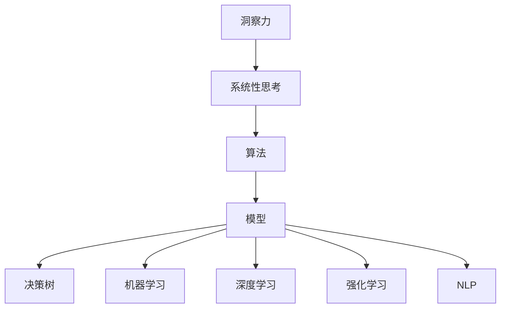

                 

# 理解洞察力的训练：提升系统性思考能力

> 关键词：洞察力,系统性思考,算法,模型,决策树,机器学习,深度学习,强化学习,自然语言处理(NLP)

## 1. 背景介绍

### 1.1 问题由来
在现代科技飞速发展的背景下，大数据和人工智能技术的应用愈加广泛，对决策和分析的深度和广度提出了更高的要求。然而，决策过程不仅仅是一个单纯的数据处理和计算问题，更是一个需要深刻洞察力和系统性思考能力的复杂过程。洞察力是识别关键信息，预测趋势，理解决策影响的能力，而系统性思考则是从整体视角分析问题，通过多角度、多层次的模型来支撑决策的科学性和可靠性。

### 1.2 问题核心关键点
为了培养和提升洞察力和系统性思考能力，本文聚焦于在决策过程中如何通过算法和模型进行有效训练，从而达到提升系统性思考和洞察力的目标。具体包括以下几个关键点：
- 如何构建有效的洞察力训练模型。
- 在机器学习和深度学习中如何应用洞察力和系统性思考。
- 强化学习和自然语言处理等前沿技术如何促进洞察力和系统性思考的提升。

本文旨在为决策者和数据分析师提供一个全面的视角，探讨如何通过算法和模型训练提升洞察力和系统性思考，从而在决策过程中取得更好的效果。

### 1.3 问题研究意义
提升洞察力和系统性思考能力，对决策者和数据分析师而言，具有重要意义：

1. **提高决策质量**：系统性思考和洞察力强的决策者能够全面考量各种因素，作出更为准确和科学的决策。
2. **降低决策风险**：通过多角度、多层次的分析，能够更早发现潜在问题和风险，并采取预防措施。
3. **增强创新能力**：系统性思考和洞察力能够帮助发现新机会和创新点，推动企业持续发展。
4. **提升竞争力**：在激烈的市场竞争中，具备敏锐洞察力和系统性思考能力的团队更容易取得优势。

## 2. 核心概念与联系

### 2.1 核心概念概述

本节将介绍几个核心概念及其相互联系：

- **洞察力(Insight)**：指识别关键信息，预测趋势，理解决策影响的能力。洞察力是决策的关键，能帮助识别数据背后的规律和模式。
- **系统性思考(Systematic Thinking)**：指从整体视角分析问题，通过多角度、多层次的模型来支撑决策的科学性和可靠性。系统性思考能避免单一视角的片面性，提高决策的全面性。
- **算法(Algorithm)**：指一系列处理数据和计算的规则，用于解决特定问题或任务。算法是模型训练的基础，通过选择和优化算法，可以提升洞察力和系统性思考。
- **模型(Model)**：指对实际问题进行抽象和简化，通过算法构建的数学或计算模型。模型是洞察力和系统性思考的载体，能够反映数据的复杂关系。
- **决策树(Decision Tree)**：一种常见的分类算法，通过树状结构表示决策过程，直观易懂，常用于提升洞察力和系统性思考。
- **机器学习(Machine Learning)**：一种通过数据驱动的算法，旨在从数据中学习规律和模式，提升决策的准确性和效率。
- **深度学习(Deep Learning)**：一种特殊的机器学习方法，通过多层神经网络模拟人脑结构，用于处理复杂和高维度的数据。
- **强化学习(Reinforcement Learning)**：一种通过奖励机制优化决策过程的算法，用于提升系统性思考和洞察力。
- **自然语言处理(Natural Language Processing, NLP)**：一种涉及语言模型和自然语言理解的算法，用于处理和分析文本数据，提升洞察力和系统性思考。

这些概念之间的逻辑关系可以通过以下Mermaid流程图来展示：



这个流程图展示了一些关键概念的相互关系：

1. 洞察力是系统性思考的基础，帮助识别数据中的关键信息。
2. 算法是构建模型的基础，通过选择和优化算法，可以提升洞察力和系统性思考。
3. 模型是洞察力和系统性思考的载体，能够反映数据的复杂关系。
4. 决策树、机器学习、深度学习、强化学习等算法和模型，均是提升洞察力和系统性思考的重要手段。
5. 自然语言处理等技术，也能够在处理文本数据时提升洞察力和系统性思考。

这些概念共同构成了提升洞察力和系统性思考能力的理论框架，通过理解和应用这些概念，可以更好地支撑决策和分析。

## 3. 核心算法原理 & 具体操作步骤
### 3.1 算法原理概述

提升洞察力和系统性思考能力的算法原理，主要包括以下几个方面：

- **特征工程**：通过选择合适的特征和特征组合，提升数据的质量和信息的丰富度。
- **模型选择与优化**：选择合适的模型和算法，并通过交叉验证、调参等方法优化模型性能。
- **多角度和多层次分析**：通过多种算法和模型，从不同角度和层次分析数据，全面理解问题的复杂性。
- **数据增强和对抗样本**：通过数据增强和对抗样本等技术，提升模型的鲁棒性和泛化能力。
- **持续学习与知识更新**：通过持续学习和知识更新，保持模型的准确性和可靠性。

这些原理共同构成了一个提升洞察力和系统性思考能力的完整框架。

### 3.2 算法步骤详解

以下是提升洞察力和系统性思考能力的具体步骤：

**Step 1: 数据收集与预处理**
- 收集与决策相关的数据，包括历史数据、实时数据和外部数据等。
- 对数据进行清洗、去重和标准化，确保数据的质量和一致性。

**Step 2: 特征工程**
- 选择合适的特征和特征组合，提升数据的质量和信息的丰富度。
- 利用数据增强和对抗样本等技术，提升模型的鲁棒性和泛化能力。

**Step 3: 模型选择与优化**
- 选择合适的模型和算法，如决策树、机器学习、深度学习、强化学习等。
- 通过交叉验证、调参等方法优化模型性能，选择最优模型。

**Step 4: 多角度和多层次分析**
- 通过多种算法和模型，从不同角度和层次分析数据，全面理解问题的复杂性。
- 通过融合不同模型的输出，提升整体分析的准确性和可靠性。

**Step 5: 决策与实施**
- 利用训练好的模型，进行预测和分析，支撑决策过程。
- 根据分析结果，调整和优化决策方案。

**Step 6: 持续学习与知识更新**
- 定期收集新数据，更新模型，保持模型的准确性和可靠性。
- 根据新的数据和反馈，不断优化模型和算法。

### 3.3 算法优缺点

提升洞察力和系统性思考能力的算法，具有以下优点：

- **全面性**：通过多角度和多层次分析，能够全面理解问题的复杂性，避免单一视角的片面性。
- **准确性**：通过选择和优化算法，能够提升模型的准确性和可靠性，降低决策风险。
- **可解释性**：通过决策树等可视化算法，能够直观理解模型的决策过程，提升决策的透明度。
- **鲁棒性**：通过数据增强和对抗样本等技术，能够提升模型的鲁棒性和泛化能力，避免过拟合。

同时，这些算法也存在一些缺点：

- **计算复杂度高**：训练复杂模型和进行多层次分析，计算资源需求较大。
- **数据依赖性强**：模型性能高度依赖于数据质量，数据偏差可能影响模型的决策。
- **模型复杂度高**：复杂模型可能导致“过拟合”，需要更多的数据和计算资源。

### 3.4 算法应用领域

提升洞察力和系统性思考能力的算法，在多个领域中得到广泛应用，例如：

- **金融风险评估**：利用决策树和机器学习模型，全面评估金融风险，提升决策的准确性和可靠性。
- **市场趋势预测**：通过多角度和多层次分析，预测市场趋势，帮助企业制定战略决策。
- **供应链管理**：通过多层次和动态分析，优化供应链管理，降低运营成本，提升效率。
- **医疗诊断**：利用自然语言处理和强化学习等技术，提升诊断准确性和治疗效果。
- **智能制造**：通过数据分析和预测，优化生产流程，提升产品质量和生产效率。
- **城市规划**：通过多角度和多层次分析，提升城市规划的科学性和合理性。

## 4. 数学模型和公式 & 详细讲解 & 举例说明

### 4.1 数学模型构建

本节将使用数学语言对提升洞察力和系统性思考能力的模型进行更加严格的刻画。

假设决策问题可以表示为一个优化问题：

$$
\min_{\theta} f(\theta) \quad s.t. \quad g(\theta) = 0
$$

其中 $f(\theta)$ 为目标函数，表示决策问题的损失函数；$g(\theta)$ 为约束条件，表示决策问题的约束条件。

对于目标函数 $f(\theta)$，我们可以采用多种算法进行求解，如梯度下降法、共轭梯度法、牛顿法等。对于约束条件 $g(\theta)$，我们可以采用罚函数法、拉格朗日乘子法等方法进行处理。

### 4.2 公式推导过程

以下我们以决策树算法为例，推导决策树的构建过程和损失函数。

决策树是一种基于树结构的分类算法，通过递归地将数据集划分为更小的子集，最终得到一棵决策树。设数据集 $D = \{(x_i, y_i)\}_{i=1}^N$，其中 $x_i \in \mathcal{X}$ 表示特征向量，$y_i \in \{0,1\}$ 表示类别标签。假设特征空间 $\mathcal{X}$ 的维度为 $d$，树的高度为 $h$，则决策树的构建过程如下：

1. 选择一个最佳特征 $i$ 作为划分节点。
2. 将数据集 $D$ 根据特征 $i$ 划分为 $d_i$ 个子集 $D_i = \{(x_{i,j}, y_{i,j})\}_{j=1}^{d_i}$。
3. 对于每个子集 $D_i$，递归构建子树 $T_i$，直至满足停止条件。
4. 最终得到决策树 $T = \{T_1, T_2, ..., T_d\}$。

决策树的损失函数为：

$$
\mathcal{L}(T) = \frac{1}{N} \sum_{i=1}^N \ell(y_i, T(x_i))
$$

其中 $\ell$ 为损失函数，如交叉熵损失、均方误差损失等。

### 4.3 案例分析与讲解

假设我们有一组历史交易数据，需要预测新交易是否为欺诈行为。我们可以利用决策树算法进行模型训练和预测。

首先，对数据进行预处理，选择合适的特征和特征组合。然后，选择合适的决策树算法和参数，通过交叉验证和调参等方法，构建最优的决策树模型。

在模型构建完成后，利用决策树的可视化功能，对模型进行解释和分析。通过分析决策树的每个节点，可以理解模型决策的依据，从而提升决策的透明度和可解释性。

## 5. 项目实践：代码实例和详细解释说明
### 5.1 开发环境搭建

在进行项目实践前，我们需要准备好开发环境。以下是使用Python进行Scikit-learn开发的环境配置流程：

1. 安装Anaconda：从官网下载并安装Anaconda，用于创建独立的Python环境。

2. 创建并激活虚拟环境：
```bash
conda create -n myenv python=3.8 
conda activate myenv
```

3. 安装Scikit-learn：
```bash
pip install scikit-learn
```

4. 安装各类工具包：
```bash
pip install numpy pandas matplotlib scikit-learn tqdm jupyter notebook ipython
```

完成上述步骤后，即可在`myenv`环境中开始项目实践。

### 5.2 源代码详细实现

下面以决策树算法为例，给出使用Scikit-learn进行分类任务的Python代码实现。

首先，定义决策树分类器：

```python
from sklearn.tree import DecisionTreeClassifier

# 创建决策树分类器
clf = DecisionTreeClassifier(max_depth=3, criterion='gini', random_state=0)
```

然后，进行模型训练和预测：

```python
from sklearn.model_selection import train_test_split
from sklearn.datasets import make_classification
from sklearn.metrics import accuracy_score

# 生成随机数据集
X, y = make_classification(n_samples=1000, n_features=5, n_informative=3, n_redundant=0, n_clusters_per_class=1, random_state=0)

# 划分训练集和测试集
X_train, X_test, y_train, y_test = train_test_split(X, y, test_size=0.2, random_state=0)

# 训练决策树模型
clf.fit(X_train, y_train)

# 预测测试集结果
y_pred = clf.predict(X_test)

# 计算准确率
acc = accuracy_score(y_test, y_pred)
print(f"Accuracy: {acc:.2f}")
```

以上就是使用Scikit-learn进行决策树分类任务的具体代码实现。可以看到，Scikit-learn提供了简单易用的API，使得模型训练和预测过程非常便捷。

### 5.3 代码解读与分析

让我们再详细解读一下关键代码的实现细节：

**决策树分类器**：
- `DecisionTreeClassifier`：创建决策树分类器，可以设置参数`max_depth`和`criterion`等。

**训练和预测**：
- `train_test_split`：划分训练集和测试集，用于模型训练和性能评估。
- `accuracy_score`：计算预测准确率，评估模型性能。

**训练流程**：
- 生成随机数据集，使用`make_classification`生成包含5个特征和3个可区分类别的数据集。
- 使用`train_test_split`将数据集划分为训练集和测试集，比例为80:20。
- 使用`clf.fit(X_train, y_train)`进行模型训练。
- 使用`clf.predict(X_test)`进行模型预测。
- 使用`accuracy_score(y_test, y_pred)`计算预测准确率，输出结果。

可以看到，Scikit-learn的决策树实现非常简单易用，适合快速进行模型开发和实验。

## 6. 实际应用场景
### 6.1 金融风险评估

金融风险评估是决策树算法的一个重要应用场景。金融机构需要评估客户的信用风险，判断其是否可能违约。通过决策树算法，可以根据客户的个人信息、财务数据、交易记录等多种特征，构建一个多层次的决策模型，从而提高风险评估的准确性和可靠性。

在实际应用中，可以使用决策树算法对客户的信用数据进行训练，通过多角度和多层次分析，识别出高风险客户，提前采取风险控制措施。

### 6.2 市场趋势预测

市场趋势预测是决策树算法的另一个重要应用场景。通过对历史交易数据和市场数据进行多角度和多层次分析，可以预测市场的未来走势，帮助企业制定战略决策。

在实际应用中，可以使用决策树算法对市场数据进行训练，通过多角度和多层次分析，识别出市场的变化趋势，提前采取应对措施。

### 6.3 供应链管理

供应链管理是决策树算法的另一个重要应用场景。通过对供应链数据进行多角度和多层次分析，可以优化供应链管理，降低运营成本，提升效率。

在实际应用中，可以使用决策树算法对供应链数据进行训练，通过多角度和多层次分析，识别出供应链中的瓶颈和问题，提前采取优化措施。

### 6.4 医疗诊断

医疗诊断是决策树算法的另一个重要应用场景。通过对患者的症状和检查数据进行多角度和多层次分析，可以提升诊断的准确性和治疗效果。

在实际应用中，可以使用决策树算法对患者的症状和检查数据进行训练，通过多角度和多层次分析，识别出患者的病情和诊断结果，提前采取治疗措施。

## 7. 工具和资源推荐
### 7.1 学习资源推荐

为了帮助开发者系统掌握提升洞察力和系统性思考能力的理论基础和实践技巧，这里推荐一些优质的学习资源：

1. **《统计学习方法》**：李航著，系统讲解了多种机器学习算法，适合初学者入门。

2. **《机器学习实战》**：Peter Harrington著，提供了丰富的Python代码示例，适合动手实践。

3. **《深度学习》**：Ian Goodfellow等著，详细讲解了深度学习的原理和应用。

4. **Coursera的机器学习和深度学习课程**：由斯坦福大学和Coursera联合开设，讲解了多种机器学习和深度学习算法。

5. **Kaggle数据科学竞赛**：提供丰富的数据集和挑战任务，适合动手实践和提升技能。

通过对这些资源的学习实践，相信你一定能够快速掌握提升洞察力和系统性思考能力的精髓，并用于解决实际的决策问题。

### 7.2 开发工具推荐

高效的开发离不开优秀的工具支持。以下是几款用于决策树算法开发的常用工具：

1. **Scikit-learn**：一个基于Python的机器学习库，提供了丰富的算法和工具，适合快速迭代研究。

2. **TensorFlow**：由Google主导开发的深度学习框架，生产部署方便，适合大规模工程应用。

3. **PyTorch**：一个基于Python的深度学习框架，灵活动态，适合快速迭代研究。

4. **Weights & Biases**：模型训练的实验跟踪工具，可以记录和可视化模型训练过程中的各项指标，方便对比和调优。

5. **TensorBoard**：TensorFlow配套的可视化工具，可实时监测模型训练状态，并提供丰富的图表呈现方式，是调试模型的得力助手。

合理利用这些工具，可以显著提升决策树算法的开发效率，加快创新迭代的步伐。

### 7.3 相关论文推荐

提升洞察力和系统性思考能力的决策树算法，已经在多个领域得到了广泛应用。以下是几篇奠基性的相关论文，推荐阅读：

1. **《C4.5: A Package for Multivalued Decision Tree Induction》**：Quinlan著，提出了C4.5决策树算法，是决策树算法的重要奠基之作。

2. **《Decision-Tree Ensembles via the Bootstrap》**：Hastie等著，提出随机森林算法，进一步提升了决策树算法的性能。

3. **《Gradient Boosting Machines》**：Friedman等著，提出梯度提升算法，进一步提升了决策树算法的性能。

4. **《Fast Feature Selection with Decision Trees》**：Cortes等著，提出快速特征选择算法，提升了决策树算法的可解释性和鲁棒性。

这些论文代表了大规模决策树算法的最新研究进展，通过学习这些前沿成果，可以帮助研究者把握学科前进方向，激发更多的创新灵感。

## 8. 总结：未来发展趋势与挑战

### 8.1 总结

本文对提升洞察力和系统性思考能力的算法进行了全面系统的介绍。首先阐述了洞察力和系统性思考在决策和分析中的重要性和当前的研究现状，明确了算法在提升洞察力和系统性思考中的关键作用。其次，从原理到实践，详细讲解了提升洞察力和系统性思考能力的数学模型和关键步骤，给出了决策树算法的完整代码实例。同时，本文还广泛探讨了决策树算法在金融、市场、供应链、医疗等多个行业领域的应用前景，展示了算法技术的巨大潜力。此外，本文精选了决策树算法的各类学习资源，力求为读者提供全方位的技术指引。

通过本文的系统梳理，可以看到，提升洞察力和系统性思考能力的算法，正在成为决策和分析的重要范式，极大地拓展了数据科学的应用边界，催生了更多的落地场景。受益于大规模数据和算力资源的不断投入，决策树算法等模型将不断演进，不断提升决策的准确性和可靠性。未来，伴随决策树算法和其他算法的进一步融合，相信决策和分析技术将在更多领域大放异彩，深刻影响人类的生产生活方式。

### 8.2 未来发展趋势

展望未来，提升洞察力和系统性思考能力的算法将呈现以下几个发展趋势：

1. **自动化和智能化**：随着AI技术的发展，自动化的决策过程将越来越普遍，智能化的决策模型将更加普及。

2. **跨领域融合**：决策树算法和其他算法将进一步融合，形成更强大的决策模型，应用于更多领域。

3. **实时性和动态性**：实时决策和动态优化将越来越重要，决策树算法将更多地应用于动态环境中。

4. **可解释性和透明性**：决策树算法将进一步提升可解释性和透明性，使得决策过程更加公开和透明。

5. **多模态融合**：决策树算法将更多地应用于多模态数据融合，提升数据的综合利用效率。

6. **大规模化和大数据化**：随着大数据和云计算技术的发展，决策树算法将越来越多地应用于大规模数据集和高性能计算环境中。

以上趋势凸显了提升洞察力和系统性思考能力的算法技术的广阔前景。这些方向的探索发展，必将进一步提升决策和分析系统的性能和应用范围，为人类认知智能的进化带来深远影响。

### 8.3 面临的挑战

尽管提升洞察力和系统性思考能力的算法已经取得了显著进展，但在迈向更加智能化、普适化应用的过程中，仍面临诸多挑战：

1. **数据质量和数量**：决策树算法对数据质量和数量要求较高，数据偏差和缺失可能影响模型的决策。

2. **模型复杂度**：决策树算法的复杂度较高，计算资源需求较大，难以应用于大规模数据集。

3. **模型解释性**：决策树算法的可解释性较强，但对于复杂问题，难以完全理解模型的决策过程。

4. **模型鲁棒性**：决策树算法在面对噪声和异常数据时，容易产生过拟合和欠拟合问题。

5. **模型公平性和安全性**：决策树算法的公平性和安全性问题，需要进一步研究和优化。

6. **跨领域应用**：决策树算法在不同领域中的适应性，仍需进一步研究和优化。

正视这些挑战，积极应对并寻求突破，将使决策树算法走向成熟的必要之路。相信随着学界和产业界的共同努力，这些挑战终将一一被克服，决策树算法必将在构建智能决策系统方面发挥重要作用。

### 8.4 研究展望

面对提升洞察力和系统性思考能力的算法所面临的种种挑战，未来的研究需要在以下几个方面寻求新的突破：

1. **自动化和智能化**：开发更加自动化和智能化的决策过程，提升决策效率和准确性。

2. **跨领域应用**：研究决策树算法在更多领域中的适应性和应用前景，推动决策树算法在其他领域的广泛应用。

3. **多模态融合**：研究多模态数据的融合方法，提升决策树算法的综合利用效率。

4. **模型解释性**：研究决策树算法的可解释性和透明性，提升模型的公平性和安全性。

5. **模型鲁棒性**：研究决策树算法的鲁棒性和泛化能力，提升模型的稳定性和可靠性。

6. **模型优化**：研究决策树算法的优化方法和改进策略，提升模型的性能和效率。

这些研究方向的探索，必将引领决策树算法技术的持续演进，为构建智能决策系统提供坚实的技术支撑。只有勇于创新、敢于突破，才能不断拓展决策树算法的边界，让智能决策技术更好地造福人类社会。

## 9. 附录：常见问题与解答

**Q1: 如何选择合适的特征和特征组合？**

A: 选择合适的特征和特征组合，是提升数据质量和模型性能的关键。一般有以下几种方法：

1. **领域知识**：根据领域知识和经验，选择合适的特征。
2. **特征选择算法**：使用特征选择算法，如卡方检验、互信息等，选择具有高相关性和区分度的特征。
3. **特征工程**：通过数据预处理和特征转换，提升特征质量。
4. **特征组合**：使用特征组合算法，如多项式特征、主成分分析等，提升特征表达能力。

通过以上方法，可以提升数据质量和模型性能，从而提升决策的准确性和可靠性。

**Q2: 如何处理数据偏差和缺失？**

A: 处理数据偏差和缺失，是提升模型性能和公平性的重要步骤。一般有以下几种方法：

1. **数据清洗**：对数据进行清洗和去重，消除数据偏差和异常。
2. **数据增强**：使用数据增强技术，如回译、近义替换等，扩充训练集。
3. **数据平衡**：通过数据平衡技术，如欠采样、过采样等，消除数据偏差。
4. **模型鲁棒性**：使用鲁棒性较强的算法和模型，如梯度提升、随机森林等，提升模型的泛化能力。

通过以上方法，可以提升模型的泛化能力和公平性，从而提升决策的准确性和可靠性。

**Q3: 如何处理决策树算法的过拟合和欠拟合问题？**

A: 处理决策树算法的过拟合和欠拟合问题，是提升模型性能的重要步骤。一般有以下几种方法：

1. **过拟合**：使用正则化技术，如L2正则、剪枝等，减少模型复杂度，避免过拟合。
2. **欠拟合**：增加模型复杂度，如增加树的深度和叶子节点数，避免欠拟合。
3. **交叉验证**：使用交叉验证技术，选择最优模型和参数，避免模型过拟合和欠拟合。
4. **模型鲁棒性**：使用鲁棒性较强的算法和模型，如梯度提升、随机森林等，提升模型的泛化能力。

通过以上方法，可以提升模型的泛化能力和鲁棒性，从而提升决策的准确性和可靠性。

**Q4: 如何提升决策树算法的可解释性和透明性？**

A: 提升决策树算法的可解释性和透明性，是决策和分析的重要目标。一般有以下几种方法：

1. **可视化**：使用可视化工具，如TensorBoard、Weights & Biases等，展示模型训练和推理过程。
2. **特征重要性**：使用特征重要性算法，如GBDT、随机森林等，展示特征对模型决策的贡献度。
3. **决策路径**：展示决策树的决策路径，解释模型决策的依据。
4. **模型解释性**：使用模型解释性工具，如LIME、SHAP等，解释模型的决策过程。

通过以上方法，可以提升模型的可解释性和透明性，从而提升决策的公平性和安全性。

**Q5: 如何处理决策树算法的公平性和安全性问题？**

A: 处理决策树算法的公平性和安全性问题，是提升决策模型可靠性的重要步骤。一般有以下几种方法：

1. **公平性**：使用公平性算法，如平衡抽样、贝叶斯公平性等，消除模型偏见。
2. **安全性**：使用安全性技术，如加密、匿名化等，保护数据隐私和安全性。
3. **模型解释性**：使用模型解释性工具，如LIME、SHAP等，解释模型的决策过程，避免黑箱决策。
4. **监督学习**：使用监督学习技术，如对抗样本、回译等，提升模型的鲁棒性和泛化能力。

通过以上方法，可以提升模型的公平性和安全性，从而提升决策的可靠性。

---

作者：禅与计算机程序设计艺术 / Zen and the Art of Computer Programming

