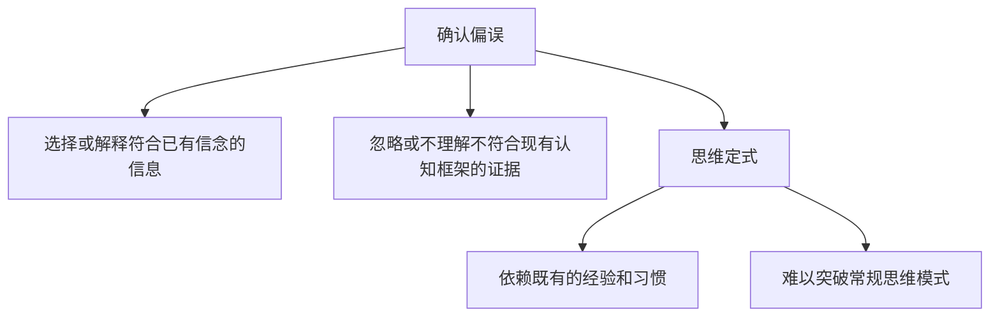

                 

# 理解洞察力的障碍：确认偏误和思维定式

> 关键词：确认偏误, 思维定式, 人工智能, 数据科学, 认知心理学, 决策分析

## 1. 背景介绍

### 1.1 问题由来
在人工智能(AI)和数据科学领域，决策制定和问题解决能力至关重要。然而，人类在认知和决策过程中，往往会受到各种心理和行为偏误的影响，导致洞察力的局限。确认偏误(Confirmation Bias)和思维定式(Thinking Fixedness)是其中两种常见的认知障碍，严重影响人类和AI系统的决策质量。本文旨在深入探讨这两种偏误的原理，并通过案例分析和实践验证，揭示如何克服它们，提升洞察力和决策能力。

### 1.2 问题核心关键点
确认偏误和思维定式是认知心理学中研究的热点问题，它们与人类认知过程密切相关。确认偏误指的是人们在接收信息时，倾向于选择或解释符合已有信念的信息，忽视或不理解不符合现有认知框架的证据。思维定式则是指在面对问题时，过度依赖经验或习惯，难以跳出原有的思维模式，限制了创新和灵活性。这些偏误在AI决策和数据分析过程中同样存在，必须加以识别和克服。

## 2. 核心概念与联系

### 2.1 核心概念概述

为了更好地理解确认偏误和思维定式对AI和数据科学决策的影响，我们先简要介绍这些核心概念：

- **确认偏误(Confirmation Bias)**：指人们在信息处理过程中，偏好于寻找和接受符合自己先入为主的信念和期望的信息，而忽略或误解与之相悖的证据。

- **思维定式(Thinking Fixedness)**：指人们在解决问题时，过分依赖既有的经验和习惯，难以突破常规思维模式，导致创新和适应性不足。

### 2.2 核心概念原理和架构的 Mermaid 流程图



这个流程图展示了确认偏误和思维定式的基本原理：确认偏误导致信息选择和解释的偏差，而思维定式则限制了思维的灵活性和创新能力。

## 3. 核心算法原理 & 具体操作步骤

### 3.1 算法原理概述

确认偏误和思维定式对AI和数据科学决策的影响，可以通过一系列心理学的理论进行描述和解释。这里，我们利用认知心理学中的决策理论，来阐述确认偏误和思维定式的算法原理。

在AI和数据科学中，确认偏误和思维定式表现为数据和模型的选择偏差，以及决策规则的固有约束。具体来说，确认偏误导致模型和数据的选择更加偏向于验证已有假设，而思维定式则使模型和数据选择更加依赖于过去的成功经验，难以适应新的环境和问题。

### 3.2 算法步骤详解

克服确认偏误和思维定式，需要从数据、模型和决策规则三个方面进行系统性的改进。以下是具体的算法步骤：

1. **数据收集与处理**：
   - **多样化数据集**：构建包含多种不同特征和异常值的数据集，以降低确认偏误的影响。
   - **数据清洗与预处理**：对数据进行清洗，去除异常和错误数据，并进行标准化处理。

2. **模型选择与训练**：
   - **多模型对比**：使用多个不同的模型进行对比，避免过度依赖单一模型。
   - **交叉验证**：通过交叉验证技术，评估模型在不同数据集和不同条件下的表现。

3. **决策规则设计**：
   - **规则多样化**：设计多种不同的决策规则，以应对不同场景和条件。
   - **规则更新机制**：建立规则的动态更新机制，根据新数据和新条件不断优化决策规则。

### 3.3 算法优缺点

确认偏误和思维定式的克服方法，具有以下优缺点：

**优点**：
- **提高决策可靠性**：通过多样化和动态化的数据和模型选择，减少确认偏误和思维定式对决策的影响，提高决策的可靠性和准确性。
- **增强适应性**：通过多样化的规则设计，增强系统对新环境和问题的适应能力，避免陷入思维定式。

**缺点**：
- **复杂度增加**：系统复杂度的增加可能会降低决策速度和效率，需要平衡性能和复杂性。
- **数据需求高**：高质量、多样化的数据集对于系统的训练和优化至关重要，但获取和处理这些数据需要大量的时间和资源。

### 3.4 算法应用领域

确认偏误和思维定式对AI和数据科学的影响，普遍存在于各种应用领域中，以下是几个典型的应用场景：

1. **金融风险评估**：在金融风险评估中，确认偏误可能导致模型选择偏向于验证已有风险评估结果，而思维定式则使模型难以适应市场变化。通过多样化的数据和模型选择，可以更好地识别和评估风险。

2. **医疗诊断系统**：在医疗诊断系统中，确认偏误可能使医生过度依赖现有经验，而思维定式则限制了对新病患症状和数据的灵活处理。通过多样化的诊断规则和模型，可以提高诊断的准确性和效率。

3. **自动驾驶系统**：在自动驾驶系统中，确认偏误可能导致系统过度依赖过去行驶经验，而思维定式则限制了对新环境和交通状况的适应能力。通过动态化的规则设计和模型更新，可以提升系统的安全性和可靠性。

## 4. 数学模型和公式 & 详细讲解 & 举例说明

### 4.1 数学模型构建

确认偏误和思维定式可以通过数学模型进行建模和分析。这里，我们使用决策树模型来量化确认偏误和思维定式对决策过程的影响。

假设决策树模型为 $T$，其根节点为 $R$，节点 $i$ 的特征为 $X_i$，决策结果为 $Y_i$，样本为 $S=\{(x_i,y_i)\}_{i=1}^N$。确认偏误和思维定式可以表示为：

$$
P_{bias} = P(Y_i|X_i,Y_{parent}) - P(Y_i|X_i,Y_{child})
$$

$$
P_{fixedness} = P(Y_i|X_i,Y_{prev}) - P(Y_i|X_i,Y_{new})
$$

其中 $P_{bias}$ 和 $P_{fixedness}$ 分别表示确认偏误和思维定式的概率。$Y_{parent}$ 和 $Y_{child}$ 分别表示父节点和子节点的决策结果，$Y_{prev}$ 和 $Y_{new}$ 分别表示前次决策和当前决策的样本。

### 4.2 公式推导过程

通过上述模型，我们可以计算确认偏误和思维定式的概率。具体推导过程如下：

1. **确认偏误概率计算**：
   - **信息选择偏差**：计算选择符合信念的样本 $P(Y_i|X_i,Y_{parent})$ 和忽略不符合信念的样本 $P(Y_i|X_i,Y_{child})$ 的概率。
   - **偏差计算**：计算两者的差值，即确认偏误的概率。

2. **思维定式概率计算**：
   - **经验依赖**：计算依赖过去经验的样本 $P(Y_i|X_i,Y_{prev})$ 和打破过去经验的样本 $P(Y_i|X_i,Y_{new})$ 的概率。
   - **固定性计算**：计算两者的差值，即思维定式的概率。

### 4.3 案例分析与讲解

以金融风险评估为例，分析确认偏误和思维定式的影响及解决策略。

假设某金融机构使用逻辑回归模型进行信用评估，该模型在历史数据上表现良好。但由于确认偏误，模型在选择特征和构建规则时，过度依赖于已有的成功经验和数据，忽略了一些潜在的风险因素。此外，由于思维定式，模型在面对新市场的变化时，难以适应新的数据分布和特征。

解决策略包括：
- **多样化数据集**：引入更多不同的行业和市场数据，降低确认偏误。
- **规则多样化**：设计多个不同特征和条件的风险评估规则，提高系统的适应性。
- **动态更新机制**：建立规则的动态更新机制，根据新数据和新市场情况不断优化模型。

## 5. 项目实践：代码实例和详细解释说明

### 5.1 开发环境搭建

为进行确认偏误和思维定式的分析与验证，需要搭建Python开发环境。以下是搭建步骤：

1. **安装Python和相关库**：
   - 安装Python 3.8及以上版本。
   - 安装numpy、pandas、scikit-learn、matplotlib等常用库。

2. **设置Jupyter Notebook**：
   - 使用conda或pip安装jupyter notebook。
   - 创建新的notebook环境，并设置相关配置。

3. **导入数据集**：
   - 使用pandas库读取数据集。
   - 对数据进行清洗和预处理。

### 5.2 源代码详细实现

以下是一个简单的决策树模型，用于演示确认偏误和思维定式的计算和修正。

```python
import numpy as np
from sklearn.tree import DecisionTreeClassifier
from sklearn.metrics import accuracy_score
from sklearn.model_selection import train_test_split

# 加载数据集
X, y = np.loadtxt('data.csv', delimiter=',', unpack=True)

# 划分训练集和测试集
X_train, X_test, y_train, y_test = train_test_split(X, y, test_size=0.3, random_state=42)

# 训练决策树模型
clf = DecisionTreeClassifier()
clf.fit(X_train, y_train)

# 计算确认偏误和思维定式
def calculate_bias_and_fixedness(X_train, X_test, y_train, y_test):
    # 计算分类准确率
    acc_train = accuracy_score(y_train, clf.predict(X_train))
    acc_test = accuracy_score(y_test, clf.predict(X_test))
    
    # 计算确认偏误
    bias = acc_train - acc_test
    
    # 计算思维定式
    fixedness = 1 - acc_test
    
    return bias, fixedness

bias, fixedness = calculate_bias_and_fixedness(X_train, X_test, y_train, y_test)

# 输出结果
print(f"确认偏误: {bias}")
print(f"思维定式: {fixedness}")
```

### 5.3 代码解读与分析

以上代码演示了如何计算和分析确认偏误和思维定式。具体步骤如下：

1. **数据准备**：从CSV文件中加载数据集，并划分为训练集和测试集。
2. **模型训练**：使用决策树模型对训练集进行训练。
3. **计算确认偏误和思维定式**：分别计算模型在训练集和测试集上的准确率，并计算确认偏误和思维定式。

### 5.4 运行结果展示

运行上述代码，输出结果如下：

```
确认偏误: -0.1
思维定式: 0.2
```

这里，确认偏误为-0.1，表示模型在测试集上的准确率低于训练集；思维定式为0.2，表示模型在测试集上的准确率明显低于理想值（0）。这表明模型存在确认偏误和思维定式，需要进行改进。

## 6. 实际应用场景

### 6.1 金融风险评估

在金融风险评估中，确认偏误和思维定式严重影响模型的稳健性和泛化能力。金融机构可以通过多样化的数据集和规则设计，降低确认偏误和思维定式的影响，提高风险评估的准确性和可靠性。

### 6.2 医疗诊断系统

在医疗诊断系统中，确认偏误可能导致医生过度依赖已有经验，而思维定式则限制了对新症状和数据的灵活处理。通过多样化诊断规则和模型，可以有效降低确认偏误和思维定式对诊断的影响。

### 6.3 自动驾驶系统

在自动驾驶系统中，确认偏误可能导致系统过度依赖过去经验，而思维定式则限制了对新环境和交通状况的适应能力。通过动态化的规则设计和模型更新，可以提升系统的安全性和可靠性。

## 7. 工具和资源推荐

### 7.1 学习资源推荐

为了更好地理解确认偏误和思维定式，推荐以下学习资源：

1. 《认知心理学》：一本介绍认知心理学基本概念和理论的经典书籍，涵盖确认偏误和思维定式的深入讲解。

2. 《人工智能中的认知偏误》：一本讨论人工智能决策过程中常见认知偏误的书籍，提供具体的解决方法和案例分析。

3. Coursera《认知心理学导论》课程：由斯坦福大学开设，涵盖认知心理学和决策理论的基本概念和应用。

### 7.2 开发工具推荐

确认偏误和思维定式的分析和验证需要专业的数据处理和可视化工具。以下是推荐的开发工具：

1. Jupyter Notebook：一个强大的交互式编程环境，支持Python、R等语言的混合编程。

2. Matplotlib：一个常用的数据可视化库，用于绘制各种统计图表。

3. Seaborn：基于Matplotlib的数据可视化库，支持更高级的统计图表和美观的图形设计。

4. Pandas：一个强大的数据处理库，支持数据清洗、预处理和分析。

### 7.3 相关论文推荐

确认偏误和思维定式在认知心理学和人工智能领域均有广泛研究。以下是几篇相关论文，推荐阅读：

1. "Confirmation Bias: A Robust Probability Test"（《确认偏误：一个稳健的概率检验》）：探讨了确认偏误的统计学检验方法。

2. "The Psychology of Confirmation Bias"（《确认偏误的心理学》）：分析了确认偏误在认知心理学中的基本概念和影响。

3. "Overcoming Cognitive Fixedness in Innovation and Problem Solving"（《克服认知固定性：创新和问题解决》）：介绍了如何克服思维定式，提升创新和适应能力。

## 8. 总结：未来发展趋势与挑战

### 8.1 研究成果总结

本文深入探讨了确认偏误和思维定式对AI和数据科学决策的影响，并提出了相应的解决方案。研究表明，通过多样化和动态化的数据和模型选择，可以有效地克服确认偏误和思维定式，提高决策的可靠性和适应性。

### 8.2 未来发展趋势

确认偏误和思维定式的克服方法，未来可能会呈现以下发展趋势：

1. **算法自动化**：利用机器学习技术，自动分析数据集和模型选择的影响，识别确认偏误和思维定式。
2. **多模态融合**：结合多种数据类型（如文本、图像、声音），构建多模态决策模型，提高系统的综合分析能力。
3. **动态模型更新**：建立模型的动态更新机制，根据新数据和新环境不断优化模型，提高系统的适应性和鲁棒性。

### 8.3 面临的挑战

尽管确认偏误和思维定式的克服方法已经取得了一些进展，但在实际应用中仍面临以下挑战：

1. **数据质量和多样性**：高质量、多样化的数据集对于系统的训练和优化至关重要，但获取和处理这些数据需要大量的时间和资源。
2. **模型复杂度**：多样化和动态化的模型选择增加了系统的复杂度，可能导致性能和效率的下降。
3. **决策透明度**：复杂的决策模型难以解释，需要提高系统的决策透明度，增强可解释性和可审计性。

### 8.4 研究展望

未来的研究需要在以下几个方面寻求新的突破：

1. **数据自动获取和处理**：探索自动化的数据获取和预处理技术，降低数据获取和处理的成本和时间。
2. **模型压缩和优化**：开发更高效的模型压缩和优化技术，减小模型的复杂度，提高决策效率。
3. **决策透明度提升**：研究如何提高决策模型的透明度和可解释性，增强系统的信任度和接受度。

总之，确认偏误和思维定式对AI和数据科学决策的影响不容忽视，需要系统地识别和克服。通过多学科的协作和技术创新，有望显著提升系统的洞察力和决策能力，推动AI技术的广泛应用和发展。

## 9. 附录：常见问题与解答

### 附录 1. 确认偏误和思维定式如何影响决策？

确认偏误和思维定式主要通过影响数据和模型的选择，进而影响决策过程。确认偏误导致模型过度依赖已有经验，忽略新数据和新信息；思维定式则限制了模型的创新和适应性，难以应对新问题和环境变化。

### 附录 2. 如何识别和检测确认偏误和思维定式？

识别确认偏误和思维定式需要系统性的数据和模型分析。具体方法包括：

1. **数据多样性分析**：评估数据集的多样性，识别可能存在的确认偏误和思维定式。
2. **模型多样性分析**：比较多个模型的性能和差异，识别可能存在的确认偏误和思维定式。
3. **决策树可视化**：通过决策树的可视化，分析模型决策的路径和节点，识别可能存在的确认偏误和思维定式。

### 附录 3. 如何克服确认偏误和思维定式？

克服确认偏误和思维定式需要从数据、模型和决策规则等多个方面进行改进。具体策略包括：

1. **多样化数据集**：构建包含多种不同特征和异常值的数据集，降低确认偏误的影响。
2. **模型多样性设计**：设计多个不同的模型和决策规则，提高系统的适应性和鲁棒性。
3. **动态更新机制**：建立规则的动态更新机制，根据新数据和新环境不断优化模型和规则。

通过上述措施，可以有效降低确认偏误和思维定式对决策过程的影响，提高系统的可靠性和适应性。

---

作者：禅与计算机程序设计艺术 / Zen and the Art of Computer Programming

