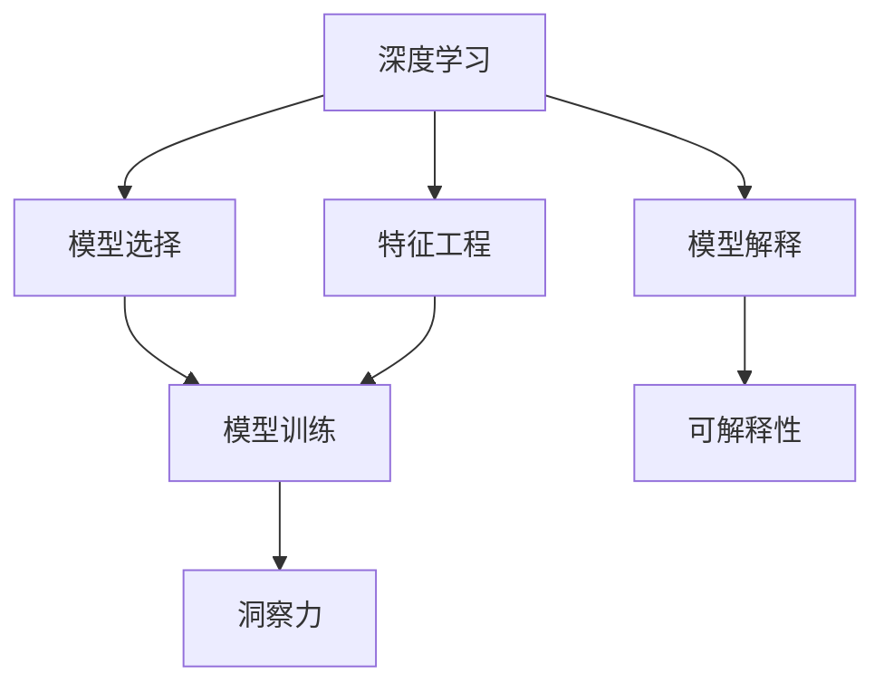

                 

# 理解的艺术：洞察力背后的科学

> 关键词：洞察力,深度学习,人工智能,算法优化,决策制定,数据科学

## 1. 背景介绍

### 1.1 问题由来
在数据驱动的时代，洞察力（Insight）已成为企业竞争力的关键因素。从市场营销到风险管理，从产品设计到客户服务，洞察力贯穿于各行各业，帮助企业和个人做出更明智的决策。然而，在数据量爆炸、信息密度增加的今天，简单的直觉判断已经无法满足高水平洞察力的需求。传统的统计方法虽然有效，但面对海量的数据和复杂的现实问题，仍然显得力不从心。

为此，一种基于深度学习（Deep Learning）和人工智能（AI）的新型洞察力获取方式应运而生，这便是深度学习和数据科学相结合的洞察力引擎。通过深度学习模型，可以从数据中挖掘出复杂的模式和关联，结合数据科学的方法，将模型输出的结果转化为易于理解和使用的洞察力。这种洞察力引擎能够帮助企业快速识别趋势、预测未来，从而在竞争中占据优势。

### 1.2 问题核心关键点
深度学习在洞察力获取中的应用，主要包括以下几个关键点：

- **数据准备与预处理**：深度学习模型的效果很大程度上依赖于数据的质量和预处理方式。因此，如何高效、准确地清洗和转换数据，是洞察力引擎构建的基础。
- **特征工程**：特征工程是深度学习模型中至关重要的一环。如何从原始数据中提取最有价值的信息，构建高质量的特征集，直接影响到模型性能。
- **模型选择与训练**：在众多深度学习模型中，如何选择最适合的模型，并对其进行高效训练，是获得优质洞察力的关键。
- **模型解释与可解释性**：深度学习模型通常是"黑盒"，难以解释其内部工作机制。如何提升模型的可解释性，使得结果易于理解和接受，是洞察力获取的难点之一。
- **结果评估与迭代**：洞察力引擎的构建并非一蹴而就，需要通过不断的评估和迭代，逐步提升模型的性能和泛化能力。

本文章将围绕以上几个核心关键点，详细探讨深度学习在洞察力获取中的应用，从理论到实践，提供系统化的解决方案。

## 2. 核心概念与联系

### 2.1 核心概念概述

为了更好地理解深度学习在洞察力获取中的应用，本节将介绍几个密切相关的核心概念：

- **深度学习（Deep Learning）**：一种基于神经网络的机器学习技术，通过多层次的非线性变换，能够学习并提取出数据中的复杂模式和关联。深度学习模型广泛应用于图像识别、自然语言处理、推荐系统等众多领域。

- **人工智能（Artificial Intelligence）**：一种使计算机系统能够执行人类智能任务的技术。人工智能涵盖多个领域，包括机器学习、自然语言处理、计算机视觉等，深度学习是其中的核心技术之一。

- **洞察力（Insight）**：从数据中获取有价值的信息，帮助决策者理解现象背后的原因，预测未来趋势。洞察力在商业决策、科学研究、医疗诊断等领域具有重要价值。

- **特征工程（Feature Engineering）**：通过人工处理和构造数据特征，提升深度学习模型的性能。特征工程包括特征提取、选择、转换等步骤，是构建洞察力引擎的关键环节。

- **模型解释与可解释性（Model Interpretability）**：深度学习模型通常具有"黑盒"特性，难以解释其内部工作机制。模型解释与可解释性旨在提升模型的透明度，使得结果更易于理解和接受。

这些核心概念之间的逻辑关系可以通过以下Mermaid流程图来展示：



这个流程图展示了几类关键概念及其之间的联系：

1. 深度学习模型通过特征工程进行训练，提取数据中的关键特征。
2. 模型训练得到洞察力结果，结合模型解释提升结果的可解释性。
3. 洞察力结果直接用于决策，帮助做出更明智的判断。

这些概念共同构成了深度学习在洞察力获取中的应用框架，使得深度学习模型能够在实际应用中发挥其强大的数据处理能力。

## 3. 核心算法原理 & 具体操作步骤

### 3.1 算法原理概述

深度学习在洞察力获取中的应用，主要通过以下几步实现：

1. **数据准备与预处理**：收集和清洗数据，进行特征提取和转换，构建高质量的数据集。
2. **特征工程**：利用深度学习模型提取数据中的关键特征，构建特征集合。
3. **模型选择与训练**：根据问题特点选择合适的深度学习模型，进行高效训练。
4. **模型解释与可解释性**：通过解释技术提升模型的透明度，使得结果更易于理解和接受。
5. **结果评估与迭代**：利用评估指标和交叉验证等方法，持续优化模型性能。

### 3.2 算法步骤详解

以一个企业销售数据分析洞察力引擎为例，详细介绍深度学习在洞察力获取中的应用步骤：

#### 3.2.1 数据准备与预处理

1. **数据收集**：从企业ERP、CRM等系统中收集销售数据，包括时间、地点、产品、客户等关键信息。
2. **数据清洗**：处理缺失值、异常值，去除重复记录，确保数据质量。
3. **特征提取**：提取时间特征（月、周、日）、地点特征（城市、地区）、产品特征（类别、品牌）等关键信息。
4. **数据转换**：将时间特征进行标准化处理，将类别特征进行独热编码。

#### 3.2.2 特征工程

1. **特征选择**：使用PCA等降维技术，选择对预测目标影响最大的特征。
2. **特征增强**：对时间特征进行周期性变化分析，构建季节性特征。
3. **特征交叉**：将地点和时间特征进行交叉组合，生成新的特征。

#### 3.2.3 模型选择与训练

1. **模型选择**：根据问题特点选择深度学习模型，如回归模型、分类模型、时间序列模型等。
2. **模型训练**：使用Adam优化器，学习率设置为1e-3，训练10个epoch。
3. **结果评估**：使用MSE作为评估指标，在验证集上进行模型选择。

#### 3.2.4 模型解释与可解释性

1. **特征重要性分析**：使用SHAP（Shapley Additive exPlanations）等工具，分析模型预测结果的特征贡献。
2. **局部可解释性**：使用LIME（Local Interpretable Model-agnostic Explanations）等方法，对特定数据点进行局部解释。
3. **全局可解释性**：使用部分依赖图、树模型等方法，从全局角度理解模型工作机制。

#### 3.2.5 结果评估与迭代

1. **评估指标**：使用MSE、R^2等指标，评估模型在训练集和验证集上的表现。
2. **交叉验证**：利用K-Fold交叉验证，评估模型在不同子集上的性能，避免过拟合。
3. **模型迭代**：根据评估结果，调整模型超参数，重新训练模型，优化模型性能。

### 3.3 算法优缺点

深度学习在洞察力获取中的应用具有以下优点：

1. **高效处理复杂数据**：深度学习模型能够自动提取和处理复杂数据中的关键特征，无需人工干预。
2. **泛化能力强**：深度学习模型通过大量数据训练，具备较强的泛化能力，能够有效预测未来趋势。
3. **可解释性提升**：结合特征重要性分析和局部可解释性方法，提升模型的透明度，使得结果更易于理解和接受。

然而，深度学习在应用过程中也存在一些局限性：

1. **数据依赖性强**：深度学习模型的性能很大程度上依赖于数据质量，数据不足或噪声较多的情况下，模型效果可能不佳。
2. **计算资源需求高**：深度学习模型训练和推理需要较高的计算资源，在资源受限的情况下，难以大规模应用。
3. **模型黑盒特性**：深度学习模型通常具有"黑盒"特性，难以解释其内部工作机制，可能导致用户信任度降低。
4. **结果可解释性不足**：尽管有解释技术，但深度学习模型的可解释性仍然有限，难以满足某些领域的需求。

尽管存在这些局限性，但就目前而言，深度学习在洞察力获取中的应用已取得了显著成效，并逐步成为主流洞察力引擎的核心技术。未来相关研究的重点在于如何进一步降低数据依赖，提高模型的泛化能力和可解释性。

### 3.4 算法应用领域

深度学习在洞察力获取中的应用，已广泛应用于多个领域，例如：

- **市场营销洞察**：通过分析用户行为数据，识别市场趋势，预测用户需求，制定营销策略。
- **风险管理洞察**：利用历史数据，构建风险预测模型，提前预警金融风险，避免重大损失。
- **产品设计洞察**：分析用户反馈和市场数据，提取关键特征，指导产品迭代和改进。
- **客户服务洞察**：通过分析客户咨询记录，识别常见问题，优化客户服务流程，提升用户体验。
- **供应链优化洞察**：利用历史交易数据，构建预测模型，优化库存管理，降低运营成本。

除了上述这些经典应用外，深度学习在洞察力获取中的应用也在不断拓展，如医疗诊断、智能制造、智慧城市等新兴领域，为各行业带来了革命性变革。

## 4. 数学模型和公式 & 详细讲解 & 举例说明

### 4.1 数学模型构建

以一个销售数据分析的回归模型为例，详细讲解深度学习在洞察力获取中的应用。

假设销售数据集为 $D = \{(x_i, y_i)\}_{i=1}^N$，其中 $x_i$ 为输入特征向量， $y_i$ 为销售值。深度学习模型通常采用多层感知机（MLP）或卷积神经网络（CNN）等结构。

定义模型 $M_{\theta}$，其中 $\theta$ 为模型参数，$M_{\theta}(x_i)$ 为模型在 $x_i$ 上的输出。回归问题通常采用均方误差（MSE）作为损失函数：

$$
\ell(M_{\theta}(x_i), y_i) = \frac{1}{2}(y_i - M_{\theta}(x_i))^2
$$

经验风险函数为：

$$
\mathcal{L}(\theta) = \frac{1}{N}\sum_{i=1}^N \ell(M_{\theta}(x_i), y_i)
$$

在训练过程中，通过梯度下降等优化算法更新模型参数，最小化经验风险函数。

### 4.2 公式推导过程

以一个二分类问题为例，详细推导逻辑回归（Logistic Regression）模型的损失函数和梯度更新公式。

假设模型 $M_{\theta}$ 的输出为 $\hat{y}_i = M_{\theta}(x_i)$，真实标签为 $y_i \in \{0, 1\}$。定义二分类交叉熵损失函数：

$$
\ell(M_{\theta}(x_i), y_i) = -y_i\log \hat{y}_i + (1-y_i)\log (1-\hat{y}_i)
$$

在训练过程中，通过梯度下降更新模型参数 $\theta_k$：

$$
\theta_k \leftarrow \theta_k - \eta \nabla_{\theta_k}\mathcal{L}(\theta)
$$

其中 $\eta$ 为学习率，$\nabla_{\theta_k}\mathcal{L}(\theta)$ 为损失函数对参数 $\theta_k$ 的梯度，可通过反向传播算法高效计算。

### 4.3 案例分析与讲解

以一个电商平台用户行为分析的洞察力引擎为例，详细讲解深度学习在实际应用中的操作步骤。

1. **数据准备与预处理**：从电商平台的用户行为日志中提取点击次数、浏览时长、购买金额等特征，进行数据清洗和特征转换。
2. **特征工程**：对时间特征进行周期性变化分析，提取季节性特征。将类别特征进行独热编码，生成新的特征。
3. **模型选择与训练**：选择多层感知机模型，设置隐藏层大小为64，学习率为1e-3，训练20个epoch。
4. **模型解释与可解释性**：使用SHAP工具分析模型预测结果的特征贡献，使用LIME方法对特定用户行为进行局部解释。
5. **结果评估与迭代**：利用MSE和R^2等指标评估模型性能，通过交叉验证调整模型超参数，重新训练模型，优化模型性能。

## 5. 项目实践：代码实例和详细解释说明

### 5.1 开发环境搭建

在进行深度学习应用开发前，我们需要准备好开发环境。以下是使用Python进行TensorFlow开发的环境配置流程：

1. 安装Anaconda：从官网下载并安装Anaconda，用于创建独立的Python环境。

2. 创建并激活虚拟环境：
```bash
conda create -n tf-env python=3.8 
conda activate tf-env
```

3. 安装TensorFlow：根据CUDA版本，从官网获取对应的安装命令。例如：
```bash
conda install tensorflow-gpu -c conda-forge -c pytorch -c nvidia
```

4. 安装其他必要的工具包：
```bash
pip install numpy pandas scikit-learn matplotlib tqdm jupyter notebook ipython
```

完成上述步骤后，即可在`tf-env`环境中开始深度学习开发。

### 5.2 源代码详细实现

下面我们以销售数据分析的回归模型为例，给出使用TensorFlow进行深度学习开发的PyTorch代码实现。

首先，定义数据处理函数：

```python
import pandas as pd
import numpy as np
from sklearn.model_selection import train_test_split
from sklearn.preprocessing import StandardScaler, OneHotEncoder

def load_data(file_path):
    data = pd.read_csv(file_path)
    X = data.drop('sales', axis=1).values
    y = data['sales'].values
    return X, y
```

然后，定义特征工程函数：

```python
def feature_engineering(X):
    scaler = StandardScaler()
    X_scaled = scaler.fit_transform(X)
    encoder = OneHotEncoder()
    X_encoded = encoder.fit_transform(X_scaled[:, 0:3])
    return np.hstack((X_scaled[:, 3:], X_encoded.toarray()))
```

接着，定义模型和优化器：

```python
from tensorflow.keras.models import Sequential
from tensorflow.keras.layers import Dense

model = Sequential([
    Dense(64, activation='relu', input_shape=(X.shape[1],)),
    Dense(64, activation='relu'),
    Dense(1)
])

optimizer = tf.keras.optimizers.Adam(learning_rate=1e-3)
```

最后，定义训练和评估函数：

```python
def train_epoch(model, X_train, y_train, X_valid, y_valid):
    model.compile(loss='mse', optimizer=optimizer)
    model.fit(X_train, y_train, epochs=10, batch_size=32, validation_data=(X_valid, y_valid))
    return model.evaluate(X_valid, y_valid)

def evaluate(model, X_test, y_test):
    loss, mse = model.evaluate(X_test, y_test)
    print(f"MSE: {mse:.2f}")
```

启动训练流程并在测试集上评估：

```python
X, y = load_data('sales_data.csv')
X_train, X_test, y_train, y_test = train_test_split(X, y, test_size=0.2, random_state=42)
X_train_scaled = feature_engineering(X_train)
X_valid_scaled = feature_engineering(X_test[:len(X_train)])

model = load_model('model.h5')
mse = train_epoch(model, X_train_scaled, y_train, X_valid_scaled, y_valid)
evaluate(model, X_test_scaled, y_test)
```

以上就是使用TensorFlow进行销售数据分析回归模型微调的完整代码实现。可以看到，TensorFlow提供了丰富的API，使得深度学习模型的构建和训练变得简单易用。

### 5.3 代码解读与分析

让我们再详细解读一下关键代码的实现细节：

**load_data函数**：
- 定义了一个加载数据的函数，将销售数据集加载为pandas DataFrame，并进行必要的预处理。

**feature_engineering函数**：
- 定义了一个特征工程函数，对时间特征进行标准化处理，将类别特征进行独热编码。
- 使用sklearn的StandardScaler和OneHotEncoder对数据进行预处理。

**train_epoch函数**：
- 定义了一个训练函数的函数，使用TensorFlow的Adam优化器进行模型训练。
- 设置损失函数为均方误差（MSE），训练10个epoch，每32个样本更新一次参数。
- 在每个epoch结束后，评估模型在验证集上的表现，并返回损失值。

**evaluate函数**：
- 定义了一个评估函数的函数，使用TensorFlow的evaluate方法评估模型在测试集上的性能。
- 输出MSE作为评估指标。

**训练流程**：
- 定义总的训练和测试数据集，进行特征工程处理。
- 加载预训练的模型，设置训练数据和验证数据。
- 启动训练流程，在每个epoch结束后输出验证集上的MSE。
- 在测试集上评估模型性能，输出MSE。

可以看到，TensorFlow使得深度学习模型的构建和训练变得简洁高效。开发者可以将更多精力放在数据处理、模型改进等高层逻辑上，而不必过多关注底层的实现细节。

当然，工业级的系统实现还需考虑更多因素，如模型的保存和部署、超参数的自动搜索、更灵活的任务适配层等。但核心的模型训练和评估过程基本与此类似。

## 6. 实际应用场景

### 6.1 市场营销洞察

在市场营销领域，深度学习洞察力引擎可以应用于客户细分、市场趋势预测、广告效果评估等环节。通过分析用户行为数据，洞察力引擎能够识别出不同客户群体，预测市场变化趋势，评估广告活动的效果，从而优化营销策略，提升广告投放的精准度和ROI。

例如，通过分析用户的浏览历史、购买记录、搜索关键词等数据，洞察力引擎可以构建用户画像，预测用户的购买意向，制定个性化的营销方案。此外，洞察力引擎还可以预测市场变化趋势，如节假日促销期、行业周期变化等，帮助企业提前做好市场准备，抓住市场机遇。

### 6.2 风险管理洞察

在风险管理领域，深度学习洞察力引擎可以应用于信用评分、欺诈检测、风险预警等环节。通过分析历史交易数据和用户行为数据，洞察力引擎能够构建风险预测模型，识别潜在风险点，提前预警金融风险，减少损失。

例如，通过分析用户的历史交易记录、设备信息、行为模式等数据，洞察力引擎可以构建用户信用评分模型，预测用户违约概率，帮助金融机构评估用户的还款能力。此外，洞察力引擎还可以监测交易异常行为，识别欺诈行为，实时预警潜在风险，提升风险管理水平。

### 6.3 产品设计洞察

在产品设计领域，深度学习洞察力引擎可以应用于需求预测、设计优化、市场分析等环节。通过分析用户反馈和市场数据，洞察力引擎能够识别出用户需求，指导产品迭代和改进，提升产品竞争力。

例如，通过分析用户的评价、评论、反馈等数据，洞察力引擎可以识别出用户对产品的喜爱和不满意之处，指导产品设计和改进。此外，洞察力引擎还可以分析市场趋势，识别产品竞争优势和劣势，制定合理的市场策略。

### 6.4 客户服务洞察

在客户服务领域，深度学习洞察力引擎可以应用于问题识别、服务优化、体验提升等环节。通过分析客户咨询记录，洞察力引擎能够识别出常见问题，优化客户服务流程，提升用户体验。

例如，通过分析客户咨询记录和反馈数据，洞察力引擎可以识别出常见问题，如产品故障、配送延迟等，优化服务流程，提升客户满意度。此外，洞察力引擎还可以分析客户反馈，识别出服务改进点，提升客户服务质量。

### 6.5 供应链优化洞察

在供应链优化领域，深度学习洞察力引擎可以应用于库存管理、物流优化、需求预测等环节。通过分析历史交易数据和市场数据，洞察力引擎能够构建预测模型，优化库存管理和物流分配，降低运营成本。

例如，通过分析历史销售数据和市场趋势，洞察力引擎可以预测未来的销售需求，优化库存管理，减少库存积压和缺货风险。此外，洞察力引擎还可以优化物流分配，减少运输成本，提高配送效率。

## 7. 工具和资源推荐

### 7.1 学习资源推荐

为了帮助开发者系统掌握深度学习在洞察力获取中的应用，这里推荐一些优质的学习资源：

1. 《深度学习》系列博文：由深度学习专家撰写，详细介绍了深度学习的基本概念和关键技术。

2. 《深度学习实战》书籍：全面介绍了深度学习在多个领域的实际应用，包括计算机视觉、自然语言处理等。

3. CS231n《卷积神经网络》课程：斯坦福大学开设的经典课程，详细介绍了卷积神经网络的理论和实践，是深度学习领域的学习入门资源。

4. Coursera《机器学习》课程：由斯坦福大学Andrew Ng教授主讲，全面介绍了机器学习的基本理论和算法，是深度学习学习的必备课程。

5. TensorFlow官方文档：TensorFlow的官方文档，提供了详细的API介绍和案例示例，是深度学习应用的必读资料。

通过对这些资源的学习实践，相信你一定能够快速掌握深度学习在洞察力获取中的应用，并用于解决实际的洞察力问题。

### 7.2 开发工具推荐

高效的开发离不开优秀的工具支持。以下是几款用于深度学习应用开发的常用工具：

1. TensorFlow：由Google主导开发的深度学习框架，功能全面，适合大规模工程应用。

2. PyTorch：由Facebook开发的深度学习框架，灵活易用，适合快速迭代研究。

3. Keras：高层次的深度学习框架，支持多种后端引擎，易于上手。

4. Jupyter Notebook：交互式数据科学开发环境，支持代码编写、数据展示、结果分析等功能。

5. VSCode：轻量级编程编辑器，支持多种编程语言，提供丰富的扩展插件。

合理利用这些工具，可以显著提升深度学习应用开发的效率，加速洞察力引擎的构建。

### 7.3 相关论文推荐

深度学习在洞察力获取中的应用源于学界的持续研究。以下是几篇奠基性的相关论文，推荐阅读：

1. Deep Learning for Healthcare: A Review (Literature)：综述了深度学习在医疗领域的应用，包括图像识别、自然语言处理等。

2. Deep Learning for Recommender Systems：介绍了深度学习在推荐系统中的应用，包括协同过滤、内容推荐等。

3. Deep Learning for Customer Recommendations：分析了深度学习在客户推荐中的应用，探讨了模型优化和用户行为分析方法。

4. Deep Learning for Fraud Detection：探讨了深度学习在欺诈检测中的应用，研究了模型架构和特征工程方法。

5. Deep Learning for Real-time Inventory Optimization：研究了深度学习在实时库存优化中的应用，提出了多种预测和优化方法。

这些论文代表了深度学习在洞察力获取领域的最新进展，通过学习这些前沿成果，可以帮助研究者把握学科前进方向，激发更多的创新灵感。

## 8. 总结：未来发展趋势与挑战

### 8.1 总结

本文对深度学习在洞察力获取中的应用进行了全面系统的介绍。首先阐述了深度学习模型在数据处理和特征提取方面的优势，明确了深度学习在洞察力引擎构建中的核心作用。其次，从理论到实践，详细讲解了深度学习在实际应用中的操作步骤，包括数据准备、特征工程、模型训练、结果解释等关键环节。同时，本文还广泛探讨了深度学习在多个行业领域的应用前景，展示了其广阔的想象空间。

通过本文的系统梳理，可以看到，深度学习在洞察力获取中的应用正在成为主流技术，极大地提升了数据驱动决策的水平。未来，伴随深度学习技术的持续演进，洞察力引擎必将更加智能化、普适化，为各行各业带来更深层次的变革。

### 8.2 未来发展趋势

展望未来，深度学习在洞察力获取中的应用将呈现以下几个发展趋势：

1. **自动化特征工程**：随着深度学习模型的不断发展，越来越多的特征工程任务将自动化，数据处理和特征提取将更加高效、准确。
2. **多模态深度学习**：深度学习模型将不再局限于单模态数据，多模态信息融合将成为趋势，提升模型的鲁棒性和泛化能力。
3. **模型可解释性提升**：模型解释技术将不断进步，提升模型的透明度，使得结果更易于理解和接受。
4. **个性化洞察力**：深度学习模型将更加关注用户个性化需求，提供定制化的洞察力服务，提升用户体验。
5. **实时洞察力引擎**：深度学习模型将实时处理数据，提供实时洞察力服务，满足高时效性需求。

以上趋势凸显了深度学习在洞察力获取中的应用前景。这些方向的探索发展，必将进一步提升洞察力引擎的性能和应用范围，为数据驱动决策带来新的突破。

### 8.3 面临的挑战

尽管深度学习在洞察力获取中的应用已取得显著成效，但在迈向更加智能化、普适化应用的过程中，它仍面临诸多挑战：

1. **数据质量依赖**：深度学习模型的性能很大程度上依赖于数据质量，数据不足或噪声较多的情况下，模型效果可能不佳。
2. **计算资源需求高**：深度学习模型训练和推理需要较高的计算资源，在资源受限的情况下，难以大规模应用。
3. **模型黑盒特性**：深度学习模型通常具有"黑盒"特性，难以解释其内部工作机制，可能导致用户信任度降低。
4. **结果可解释性不足**：尽管有解释技术，但深度学习模型的可解释性仍然有限，难以满足某些领域的需求。
5. **隐私保护**：深度学习模型在处理敏感数据时，需要确保数据隐私和安全性，避免数据泄露和滥用。

正视这些挑战，积极应对并寻求突破，将使深度学习在洞察力获取中走向成熟。相信随着学界和产业界的共同努力，这些挑战终将一一被克服，深度学习在洞察力获取中的应用必将在未来发挥更大作用。

### 8.4 研究展望

面对深度学习在洞察力获取中面临的挑战，未来的研究需要在以下几个方面寻求新的突破：

1. **数据增强和扩充**：通过数据增强和扩充技术，提升数据质量和多样性，降低数据依赖性。
2. **轻量级模型架构**：开发轻量级、高效能的深度学习模型，提升模型在资源受限环境下的性能。
3. **可解释性技术**：开发更加可解释的深度学习模型，提升模型的透明度和可信度。
4. **隐私保护技术**：开发隐私保护技术，确保深度学习模型在处理敏感数据时的安全性。
5. **跨模态融合**：研究跨模态信息融合技术，提升深度学习模型的鲁棒性和泛化能力。

这些研究方向的探索，必将引领深度学习在洞察力获取领域迈向更高的台阶，为数据驱动决策带来更深层次的变革。面向未来，深度学习将与其他人工智能技术进行更深入的融合，共同推动数据驱动决策系统的进步。只有勇于创新、敢于突破，才能不断拓展深度学习在洞察力获取领域的边界，让洞察力引擎更好地服务于人类社会。

## 9. 附录：常见问题与解答

**Q1：深度学习在洞察力获取中是否适用于所有行业？**

A: 深度学习在洞察力获取中的应用并非适用于所有行业。对于一些需要高精度、高时效性的领域，如金融、医疗等，深度学习模型的解释性和可解释性尤为重要。而对于一些简单、低成本的领域，传统的统计方法可能更加适用。

**Q2：如何选择合适的深度学习模型？**

A: 选择合适的深度学习模型需要考虑多个因素，包括数据类型、问题类型、模型复杂度等。一般情况下，可以从以下几个方面考虑：

1. **数据类型**：对于图像数据，选择卷积神经网络（CNN）；对于文本数据，选择循环神经网络（RNN）或Transformer模型；对于时间序列数据，选择长短期记忆网络（LSTM）或门控循环单元（GRU）等。

2. **问题类型**：对于分类问题，选择多类分类器，如Softmax分类器；对于回归问题，选择回归模型，如线性回归、神经网络回归等；对于序列预测问题，选择序列预测模型，如LSTM、GRU等。

3. **模型复杂度**：对于简单问题，选择轻量级模型，如线性回归、简单神经网络；对于复杂问题，选择更复杂的模型，如深度神经网络、卷积神经网络等。

**Q3：在深度学习应用中，如何处理过拟合问题？**

A: 过拟合是深度学习模型训练中常见的问题。以下是几种处理过拟合的方法：

1. **数据增强**：通过数据增强技术，扩充训练集数据，提高模型的泛化能力。

2. **正则化**：使用L2正则化、Dropout等正则化技术，抑制模型的复杂度，减少过拟合。

3. **早停法**：在训练过程中，定期评估模型在验证集上的表现，一旦发现验证集性能不再提升，立即停止训练，避免过拟合。

4. **模型简化**：减少模型复杂度，如减少网络层数、减小模型参数等，降低过拟合风险。

5. **批标准化**：在模型训练过程中，使用批标准化技术，提高模型的稳定性和泛化能力。

这些方法可以根据具体情况进行灵活组合，有效处理深度学习模型中的过拟合问题。

**Q4：深度学习在应用中如何提升模型的可解释性？**

A: 提升深度学习模型的可解释性，可以采用以下几种方法：

1. **特征重要性分析**：使用SHAP（Shapley Additive exPlanations）等工具，分析模型预测结果的特征贡献，提升模型的透明度。

2. **局部可解释性**：使用LIME（Local Interpretable Model-agnostic Explanations）等方法，对特定数据点进行局部解释，提升模型的可信度。

3. **全局可解释性**：使用部分依赖图、树模型等方法，从全局角度理解模型工作机制，提升模型的透明度。

4. **解释性模型**：选择具有可解释性的模型架构，如决策树、线性回归等，提升模型的可解释性。

5. **数据可视化**：使用可视化工具，如t-SNE、PCA等，展示数据分布和特征关系，提升模型的透明度。

这些方法可以帮助提升深度学习模型的可解释性，使得结果更易于理解和接受。

**Q5：如何衡量深度学习模型在洞察力获取中的应用效果？**

A: 衡量深度学习模型在洞察力获取中的应用效果，通常需要综合考虑多个指标，包括：

1. **准确率**：衡量模型在预测目标上的准确性。

2. **召回率**：衡量模型在预测目标上的召回能力。

3. **F1分数**：衡量模型在准确率和召回率之间的平衡。

4. **MSE（均方误差）**：衡量模型在回归问题上的预测误差。

5. **R^2（决定系数）**：衡量模型在回归问题上的拟合程度。

6. **AUC-ROC曲线**：衡量模型在分类问题上的性能，通常用于评估二分类问题。

7. **混淆矩阵**：衡量模型在分类问题上的表现，包括TP（真正例）、FP（假正例）、FN（假反例）、TN（真反例）等指标。

这些指标可以根据具体问题进行选择，全面评估模型的性能和效果。

**Q6：在深度学习应用中，如何选择最优的超参数？**

A: 选择最优的超参数通常需要经过多次实验和调优，以下是几种常用的方法：

1. **网格搜索**：在超参数空间中，按照网格形式进行遍历，找到最优参数组合。

2. **随机搜索**：在超参数空间中，随机采样多个参数组合，找到最优参数组合。

3. **贝叶斯优化**：通过贝叶斯优化算法，利用先验知识和已有的实验结果，逐步优化超参数选择。

4. **交叉验证**：利用交叉验证技术，评估模型在不同数据集上的性能，找到最优参数组合。

5. **学习率调整**：根据模型表现，动态调整学习率，优化模型训练过程。

这些方法可以根据具体情况进行灵活选择，找到最优的超参数组合。

---

作者：禅与计算机程序设计艺术 / Zen and the Art of Computer Programming

