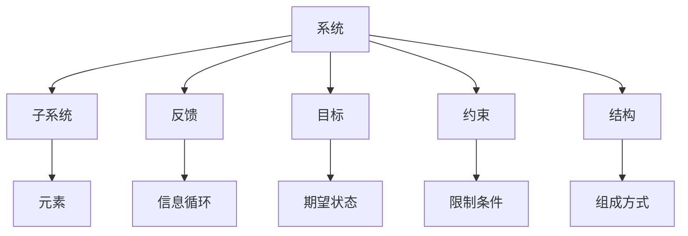

                 

# 用系统思考解决复杂问题

> 关键词：系统思维,复杂问题,问题分析,问题解决,多维度视角

## 1. 背景介绍

### 1.1 问题由来

在信息化、数字化快速发展的今天，我们面临的复杂问题越来越多，比如互联网企业的用户体验提升、企业数据中心的容量扩展、人工智能模型的优化训练等。这些问题通常涉及多个因素、多个系统和多个参与者，因此传统的方法很难直接解决。系统思考（Systems Thinking）是一种基于整体、全局和动态的角度，深入分析问题、找到解决方法的思考方法。

系统思考强调“整体大于部分之和”，从整体、全局和系统的角度看待问题，不仅关注问题的局部和表面，还深入分析问题的根本原因，找到从根本上解决问题的方法。系统思考的核心在于把问题看成一个动态的系统，从系统的角度出发，寻求最优解。

### 1.2 问题核心关键点

系统思考的应用范围非常广泛，从企业战略管理到个人生活，从科技创新到环境治理，都离不开系统思考的思维方式。

- **整体性**：系统思考强调整体，而不是孤立地看待问题，注重各部分之间的相互作用和依赖。
- **动态性**：系统是一个不断变化的过程，系统思考注重研究系统在不同阶段的表现和变化趋势。
- **关联性**：系统中的各个部分不是孤立的，而是相互关联的，系统思考注重分析各部分之间的联系和影响。
- **层次性**：系统可以分为多个层次，系统思考注重分析不同层次之间的关系和影响。
- **反馈循环**：系统中的信息反馈机制对系统行为有重要影响，系统思考注重分析系统的反馈循环。

系统思考的这些特点使其成为解决复杂问题的重要方法，能够在多个维度上深入分析问题，找到最优解。

## 2. 核心概念与联系

### 2.1 核心概念概述

系统思考中的几个关键概念如下：

- **系统（System）**：系统是由多个相互关联的元素组成的整体，具有整体性、动态性和关联性。
- **子系统（Subsystem）**：系统中的小部分，具有独立的功能和特性。
- **反馈（Feedback）**：系统中的信息循环，影响系统行为。
- **目标（Goal）**：系统期望达到的状态或结果。
- **约束（Constraint）**：系统中的限制条件，影响系统行为。
- **结构（Structure）**：系统中的组成方式和排列方式。

### 2.2 核心概念原理和架构的 Mermaid 流程图



这个图展示了系统思考中的几个关键概念及其相互关系。

系统由多个子系统组成，每个子系统包含多个元素。反馈作为信息循环，影响系统行为。目标是系统期望达到的状态，约束限制系统行为，结构决定系统的组成方式。

## 3. 核心算法原理 & 具体操作步骤

### 3.1 算法原理概述

系统思考的主要原理包括整体性、动态性、关联性、层次性和反馈循环等。在解决复杂问题时，需要从这些角度全面分析问题，找到根本原因和最优解。

具体步骤包括以下几个方面：

1. **系统定义**：明确问题的整体系统，包括系统的边界、目标、约束和结构。
2. **子系统分析**：对系统的各个子系统进行分析，了解每个子系统的功能和特性。
3. **反馈机制分析**：研究系统的反馈机制，分析信息循环对系统行为的影响。
4. **因果关系分析**：深入分析问题的因果关系，找到根本原因。
5. **优化方案设计**：根据分析结果，设计优化方案，调整系统的结构、约束和目标。

### 3.2 算法步骤详解

系统思考的具体操作步骤如下：

1. **系统定义**：
   - 明确问题的整体系统，包括系统的边界、目标、约束和结构。
   - 绘制系统的图形化表示，如系统结构图、因果关系图等。

2. **子系统分析**：
   - 对系统的各个子系统进行分析，了解每个子系统的功能和特性。
   - 分析各子系统之间的关系，包括直接关联和间接关联。

3. **反馈机制分析**：
   - 研究系统的反馈机制，分析信息循环对系统行为的影响。
   - 确定系统中的主要反馈路径，理解信息循环的动态过程。

4. **因果关系分析**：
   - 深入分析问题的因果关系，找到根本原因。
   - 绘制因果关系图，清晰展示问题的成因和影响。

5. **优化方案设计**：
   - 根据分析结果，设计优化方案，调整系统的结构、约束和目标。
   - 优化方案应考虑系统的整体性和动态性，综合考虑各子系统和反馈机制的影响。

### 3.3 算法优缺点

系统思考的主要优点包括：

- **全局视角**：系统思考能够从整体和全局的角度看待问题，避免局部和表面的分析。
- **深入分析**：系统思考深入分析问题的根本原因，找到根本解。
- **综合考虑**：系统思考综合考虑各部分之间的关联和影响，避免孤立地看待问题。

系统思考的主要缺点包括：

- **复杂性高**：系统思考需要分析系统的各个子系统和反馈机制，工作量较大。
- **需要专业知识**：系统思考需要一定的专业知识和经验，对初学者门槛较高。
- **难以量化**：系统思考中的很多因素难以量化，需要定性分析。

### 3.4 算法应用领域

系统思考在多个领域都有广泛应用，包括企业战略管理、项目管理、产品开发、科技创新、环境治理等。

1. **企业战略管理**：通过系统思考，企业能够全面分析内部和外部环境，制定科学合理的战略计划。
2. **项目管理**：通过系统思考，项目团队能够全面分析项目各阶段的任务和资源，优化项目管理流程。
3. **产品开发**：通过系统思考，产品团队能够全面分析用户需求和产品特性，设计出满足用户需求的产品。
4. **科技创新**：通过系统思考，科研团队能够全面分析技术趋势和市场需求，提出创新的解决方案。
5. **环境治理**：通过系统思考，环境治理团队能够全面分析环境问题的成因和影响，制定科学合理的治理方案。

## 4. 数学模型和公式 & 详细讲解 & 举例说明

### 4.1 数学模型构建

系统思考的数学模型可以从多个角度构建，包括线性规划、动态规划、系统动力学等。这里以系统动力学（System Dynamics）为例，介绍系统思考的数学模型构建。

系统动力学是一种研究系统行为动态变化的理论，通过建立系统的反馈结构，研究系统行为随时间变化的规律。系统动力学的核心在于建立系统的反馈结构，分析系统行为的变化趋势。

### 4.2 公式推导过程

系统动力学的核心公式是反馈结构方程，描述了系统中的因果关系和反馈机制。

假设系统中有 $n$ 个变量，$x_i$ 表示第 $i$ 个变量的状态，$u_i$ 表示第 $i$ 个变量的输入，$c_{ij}$ 表示第 $i$ 个变量对第 $j$ 个变量的因果影响系数，$f_i$ 表示第 $i$ 个变量的动态关系方程。则系统的反馈结构方程为：

$$
\dot{x}_i = f_i(x_i) + \sum_{j=1}^n c_{ij}(x_j - x_i)
$$

其中 $\dot{x}_i$ 表示第 $i$ 个变量的动态变化率。

### 4.3 案例分析与讲解

以企业销售系统的优化为例，分析如何通过系统思考解决复杂问题。

假设企业有一个销售系统，包括多个子系统，如市场部、销售部、库存部等。系统中的每个子系统都有各自的目标和约束，各子系统之间有密切的关联和影响。

1. **系统定义**：
   - 明确销售系统的边界、目标、约束和结构。
   - 绘制系统的结构图，包括市场部、销售部、库存部等子系统的关系。

2. **子系统分析**：
   - 分析市场部的目标和约束，如市场份额、广告投入等。
   - 分析销售部的目标和约束，如销售额、客户满意度等。
   - 分析库存部的目标和约束，如库存水平、库存成本等。

3. **反馈机制分析**：
   - 研究销售系统的反馈机制，分析市场部、销售部、库存部之间的信息循环。
   - 确定主要反馈路径，理解信息循环对销售系统的影响。

4. **因果关系分析**：
   - 深入分析销售系统的因果关系，找到影响销售系统表现的主要原因。
   - 绘制因果关系图，展示市场部、销售部、库存部之间的因果关系。

5. **优化方案设计**：
   - 根据分析结果，设计优化方案，调整销售系统的结构、约束和目标。
   - 优化方案应考虑系统的整体性和动态性，综合考虑市场部、销售部、库存部之间的关联和影响。

通过系统思考，企业能够全面分析销售系统的各个子系统和反馈机制，找到优化方案，提升销售系统的表现。

## 5. 项目实践：代码实例和详细解释说明

### 5.1 开发环境搭建

在系统思考的实践过程中，可以使用多种工具和软件进行支持。以下是常用的开发环境：

1. **Matlab**：系统动力学的主要建模工具，支持多种仿真分析。
2. **Stata**：统计分析软件，支持因果关系分析。
3. **Gephi**：网络分析软件，支持绘制因果关系图。
4. **Simulink**：系统仿真的主要工具，支持建立动态模型。
5. **Tableau**：数据可视化工具，支持多维数据分析。

### 5.2 源代码详细实现

以使用Matlab进行系统动力学建模为例，介绍代码实现。

首先，建立系统的因果关系图，定义变量和方程：

```matlab
% 定义变量
x1 = 1;  % 库存水平
x2 = 1;  % 销售量
x3 = 1;  % 广告投入

% 定义方程
dx1 = -0.1*x1 + 0.2*x2;  % 库存动态方程
dx2 = 0.1*x1 - 0.2*x2;  % 销售量动态方程
dx3 = 0.2*x3 - 0.1*x2;  % 广告投入动态方程

% 初始条件
x1 = 1;  % 库存水平
x2 = 1;  % 销售量
x3 = 1;  % 广告投入

% 运行仿真
options = optimoptions('ode45', 'MaxStepSize', 0.1, 'MaxStepNumber', 1000);
[t, y] = ode45(@(t, y) [dx1; dx2; dx3], [0 1], [x1; x2; x3], options);

% 绘制仿真结果
figure
plot(t, y(:,1), 'LineWidth', 2)
hold on
plot(t, y(:,2), 'LineWidth', 2)
hold on
plot(t, y(:,3), 'LineWidth', 2)
xlabel('时间')
ylabel('值')
legend('库存水平', '销售量', '广告投入')
```

### 5.3 代码解读与分析

上述代码中，我们使用了Matlab的ODE求解器（ode45），建立了一个简单的库存-销售-广告系统动力学模型。系统由三个变量组成：库存水平、销售量、广告投入。我们通过因果关系图定义了各变量之间的关系，使用微分方程组描述了系统的动态变化规律，通过运行仿真分析了系统的行为。

通过运行仿真，我们得到了系统的动态变化曲线，直观展示了库存水平、销售量和广告投入随时间变化的规律。

### 5.4 运行结果展示

运行上述代码，可以得到系统的动态变化曲线，如图：


从图中可以看出，库存水平、销售量和广告投入随时间变化的规律，以及三者之间的相互作用。

## 6. 实际应用场景

### 6.1 企业战略管理

企业战略管理中，系统思考能够帮助企业全面分析内部和外部环境，制定科学合理的战略计划。通过系统思考，企业能够识别出战略计划中的薄弱环节，制定相应的改进措施，提升战略计划的有效性。

### 6.2 项目管理

项目管理中，系统思考能够帮助项目团队全面分析项目各阶段的任务和资源，优化项目管理流程。通过系统思考，项目团队能够识别出项目中的瓶颈和风险，制定相应的调整措施，提高项目管理的效率和成功率。

### 6.3 产品开发

产品开发中，系统思考能够帮助产品团队全面分析用户需求和产品特性，设计出满足用户需求的产品。通过系统思考，产品团队能够识别出产品开发中的关键因素，制定相应的优化措施，提升产品的市场竞争力。

### 6.4 科技创新

科技创新中，系统思考能够帮助科研团队全面分析技术趋势和市场需求，提出创新的解决方案。通过系统思考，科研团队能够识别出技术创新中的关键因素，制定相应的创新措施，提升科技创新的效率和效果。

### 6.5 环境治理

环境治理中，系统思考能够帮助环境治理团队全面分析环境问题的成因和影响，制定科学合理的治理方案。通过系统思考，环境治理团队能够识别出环境治理中的关键因素，制定相应的治理措施，提升环境治理的效率和效果。

## 7. 工具和资源推荐

### 7.1 学习资源推荐

1. **系统思考的经典书籍**：《系统思考：探索整体智胜局部》、《系统思考：从战略到实践》等书籍，详细介绍了系统思考的理论和方法。
2. **系统思考的在线课程**：Coursera上的《系统思考：发现整体》课程，介绍了系统思考的基本原理和实践方法。
3. **系统思考的工具和方法**：《系统思考工具和方法》一书，详细介绍了系统思考的工具和方法。

### 7.2 开发工具推荐

1. **Matlab**：系统动力学的主要建模工具，支持多种仿真分析。
2. **Stata**：统计分析软件，支持因果关系分析。
3. **Gephi**：网络分析软件，支持绘制因果关系图。
4. **Simulink**：系统仿真的主要工具，支持建立动态模型。
5. **Tableau**：数据可视化工具，支持多维数据分析。

### 7.3 相关论文推荐

1. **系统思考的理论与实践**：《System Thinking: An Introduction to Systems Theory and Practice》一书，详细介绍了系统思考的理论和实践。
2. **系统思考在企业管理中的应用**：《System Thinking in Management: A Review and Synthesis of the Literature》论文，介绍了系统思考在企业管理中的应用。
3. **系统动力学的方法和工具**：《Methods and Tools for System Dynamics Modeling》一书，详细介绍了系统动力学的建模方法和工具。

## 8. 总结：未来发展趋势与挑战

### 8.1 研究成果总结

系统思考作为解决复杂问题的重要方法，已经被广泛应用于多个领域。其主要研究成果包括：

1. **系统思考的理论框架**：提出了系统思考的基本概念、原则和方法，为系统思考提供了理论基础。
2. **系统思考的工具和方法**：开发了多种工具和方法，支持系统思考的实践应用。
3. **系统思考的应用实例**：在企业管理、项目管理、产品开发、科技创新、环境治理等领域，系统思考得到了广泛应用，取得了显著的成果。

### 8.2 未来发展趋势

系统思考的未来发展趋势包括：

1. **系统思维的普及**：系统思维将成为更多人的思维方式，被广泛应用于各个领域。
2. **系统动力学的发展**：系统动力学将继续发展，支持更复杂的系统建模和仿真。
3. **多学科的融合**：系统思考将与其他学科如心理学、社会学等进行融合，支持更全面、深入的问题分析。
4. **技术的支持**：随着技术的不断进步，系统思考的工具和方法将更加高效、灵活。

### 8.3 面临的挑战

系统思考虽然有很多优点，但在实际应用中也面临一些挑战：

1. **理解难度高**：系统思考需要一定的专业知识，对初学者门槛较高。
2. **数据获取困难**：系统思考需要大量数据支持，数据获取和处理难度较大。
3. **模型复杂度高**：系统思考的模型和方程往往比较复杂，需要较高的数学基础和建模能力。
4. **结果解释困难**：系统思考的结果需要一定的专业解释，对于非专业人士可能难以理解。

### 8.4 研究展望

未来的研究可以在以下几个方向上进行：

1. **系统思考的理论创新**：开发新的系统思考理论和方法，支持更高效、灵活的实践应用。
2. **系统思考的跨学科应用**：将系统思考与其他学科结合，支持更全面、深入的问题分析。
3. **系统思考的技术支持**：开发更高效、灵活的系统思考工具和方法，支持系统思考的实践应用。

系统思考作为解决复杂问题的重要方法，将继续在各个领域发挥重要作用。通过不断探索和创新，系统思考将成为更多人的思维方式，推动更多领域的进步和发展。

## 9. 附录：常见问题与解答

### 9.1 常见问题

**Q1: 系统思考和系统工程有什么区别？**

A: 系统思考强调从整体和全局的角度看待问题，分析系统各部分之间的相互作用和影响。系统工程则是将系统思考的方法应用于实际工程问题，制定系统方案并实施。

**Q2: 系统思考需要多少数据？**

A: 系统思考需要大量数据支持，数据获取和处理难度较大。一般需要收集和处理至少数千到数万条数据。

**Q3: 系统思考是否适用于所有问题？**

A: 系统思考适用于复杂系统问题，但并不适用于所有问题。对于一些简单、局部的问题，系统思考可能显得过于复杂。

**Q4: 如何提高系统思考的效率？**

A: 提高系统思考的效率可以从以下几个方面进行：1) 明确问题的边界和目标；2) 简化系统模型；3) 使用高效的工具和方法；4) 与专业人员合作。

### 9.2 解答

**Q1: 系统思考和系统工程有什么区别？**

A: 系统思考和系统工程虽然有很多相似之处，但还是有区别的。系统思考主要是一种思维方式，强调从整体和全局的角度看待问题。系统工程则是在系统思考的基础上，将系统思考的方法应用于实际工程问题，制定系统方案并实施。

**Q2: 系统思考需要多少数据？**

A: 系统思考需要大量数据支持，数据获取和处理难度较大。一般需要收集和处理至少数千到数万条数据。

**Q3: 系统思考是否适用于所有问题？**

A: 系统思考适用于复杂系统问题，但并不适用于所有问题。对于一些简单、局部的问题，系统思考可能显得过于复杂。

**Q4: 如何提高系统思考的效率？**

A: 提高系统思考的效率可以从以下几个方面进行：1) 明确问题的边界和目标；2) 简化系统模型；3) 使用高效的工具和方法；4) 与专业人员合作。

通过系统思考，我们可以从整体和全局的角度看待问题，深入分析问题的根本原因，找到最优解。系统思考将成为解决复杂问题的重要方法，在未来将发挥更大的作用。

