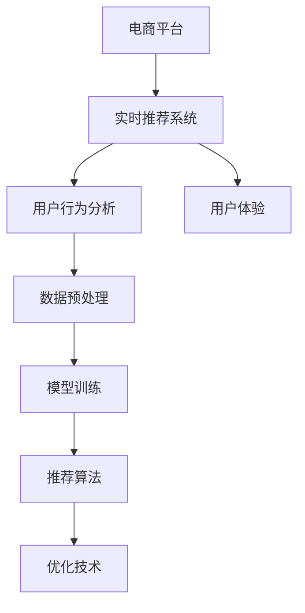

                 

# 电商平台中AI大模型的实时推荐技术

> 关键词：电商平台, 实时推荐, AI大模型, 用户行为, 数据预处理, 模型训练, 推荐算法, 优化技术, 推荐系统, 用户体验

## 1. 背景介绍

### 1.1 问题由来
在如今信息爆炸的时代，电商平台面临着用户大量涌入、商品种类繁多、流量分配和转化效率等挑战。为了在激烈的市场竞争中保持优势，各大电商平台纷纷探索利用AI技术实现个性化推荐，提高用户满意度和转化率。其中，基于大模型的实时推荐系统成为了热门研究焦点。

大模型通过在大规模数据上进行预训练，可以获取丰富的语义和用户行为特征，从而实现更加精准的推荐。实时推荐系统能够快速响应用户行为，实时更新推荐内容，提升用户体验。两者结合，可以显著提升电商平台的业务价值。

### 1.2 问题核心关键点
本文将详细介绍基于AI大模型的实时推荐系统，特别关注其核心技术点和实际应用场景，包括用户行为分析、数据预处理、模型训练、推荐算法、优化技术等方面。文章将通过逐步解析这些关键环节，帮助读者全面了解实时推荐系统的构建过程和技术细节。

## 2. 核心概念与联系

### 2.1 核心概念概述

为更好地理解AI大模型的实时推荐系统，本节将介绍几个关键概念：

- **电商平台**：在线零售平台，用户可以在线浏览、购买商品，具有信息展示、交互、交易等功能。
- **实时推荐系统**：基于用户行为和实时数据，即时生成个性化推荐，提升用户体验和转化率的系统。
- **AI大模型**：大规模预训练语言模型，如GPT-3、BERT等，通过自监督学习方式在大规模数据上训练，具备强大的语义理解和生成能力。
- **用户行为分析**：通过分析用户点击、浏览、购买等行为数据，识别用户兴趣和需求。
- **数据预处理**：对原始数据进行清洗、归一化、特征工程等操作，转化为适合模型训练的数据格式。
- **模型训练**：在预处理后的数据集上，通过训练算法学习模型的参数，实现对用户行为的预测和推荐。
- **推荐算法**：多种算法如协同过滤、基于内容的推荐、混合推荐等，用于生成推荐结果。
- **优化技术**：包括模型剪枝、量化、加速、分布式训练等，提升推荐系统的效率和性能。

这些概念之间的逻辑关系可以通过以下Mermaid流程图来展示：



这个流程图展示了几大关键概念及其之间的关系：

1. 电商平台通过实时推荐系统提升用户体验。
2. 实时推荐系统需要分析用户行为。
3. 数据预处理是模型训练的前提。
4. 模型训练学习用户行为规律。
5. 推荐算法实现个性化推荐。
6. 优化技术提升推荐系统效率。

这些概念共同构成了电商平台实时推荐系统的基本框架，通过理解这些概念，我们可以更好地把握实时推荐系统的构建原则。

## 3. 核心算法原理 & 具体操作步骤

### 3.1 算法原理概述

基于AI大模型的实时推荐系统，本质上是通过数据分析、模型训练、推荐算法等技术手段，构建用户与商品之间的连接，实现个性化推荐。其核心思想是：

1. **用户行为分析**：通过用户的历史行为数据，如点击、浏览、购买等，识别用户的兴趣和需求。
2. **数据预处理**：将用户行为数据进行清洗、归一化、特征工程等操作，转化为模型训练所需的数据格式。
3. **模型训练**：在预处理后的数据集上，通过训练算法学习模型的参数，实现对用户行为的预测和推荐。
4. **推荐算法**：根据用户特征和商品特征，生成个性化的推荐结果。
5. **优化技术**：通过模型剪枝、量化、加速、分布式训练等技术，提升推荐系统的效率和性能。

### 3.2 算法步骤详解

基于AI大模型的实时推荐系统，通常包括以下几个关键步骤：

**Step 1: 用户行为数据收集**
- 从电商平台的交互日志、点击流、搜索记录等数据源，收集用户行为数据。
- 将数据进行清洗、去重、处理缺失值等预处理操作。

**Step 2: 数据特征工程**
- 根据业务需求，设计特征项，如用户ID、商品ID、浏览时间、浏览时长等。
- 使用特征选择、降维等技术，优化特征空间。

**Step 3: 数据预处理**
- 对数据进行归一化、标准化处理。
- 对缺失值进行插补或删除。
- 处理异常值，如使用截断法、插值法等。

**Step 4: 模型训练**
- 选择合适的预训练模型，如BERT、GPT-3等，进行微调。
- 设计合适的损失函数，如均方误差、交叉熵等。
- 设置合适的学习率、批次大小、迭代轮数等训练参数。

**Step 5: 推荐算法实现**
- 设计推荐算法，如协同过滤、基于内容的推荐、混合推荐等。
- 实现推荐系统的前端接口，展示推荐结果。

**Step 6: 优化技术应用**
- 采用模型剪枝、量化、加速、分布式训练等技术，提升推荐系统的效率。

**Step 7: 模型评估与优化**
- 在测试集上评估模型性能，如准确率、召回率、F1-score等。
- 根据评估结果，调整模型参数，优化模型表现。

以上是实时推荐系统的基本流程。在实际应用中，还需要针对具体场景和需求，对各个环节进行优化设计和调整，以确保系统性能和用户体验。

### 3.3 算法优缺点

基于AI大模型的实时推荐系统具有以下优点：
1. 个性化推荐：通过分析用户行为数据，实现个性化推荐，提升用户体验。
2. 高效响应：实时处理用户行为，快速响应用户需求。
3. 可扩展性强：可利用分布式计算，支持大规模数据处理和模型训练。
4. 自适应性强：能够适应数据分布的变化，实时更新推荐策略。

同时，该系统也存在一些缺点：
1. 数据依赖性大：推荐系统的效果高度依赖用户行为数据，数据质量差可能导致推荐效果差。
2. 计算资源消耗大：大规模数据处理和模型训练需要大量计算资源，对硬件要求高。
3. 复杂度高：系统实现复杂，涉及数据预处理、模型训练、推荐算法等多个环节。
4. 冷启动问题：新用户没有足够的行为数据，难以进行个性化推荐。

尽管存在这些缺点，但基于AI大模型的实时推荐系统在大数据和实时性的要求下，依然是最先进的技术手段，广泛应用于电商平台推荐系统构建中。

### 3.4 算法应用领域

AI大模型的实时推荐系统，主要应用于以下领域：

- **电商推荐**：根据用户历史行为数据，实时生成个性化商品推荐，提升购买转化率。
- **内容推荐**：分析用户浏览历史和兴趣，实时推荐相关文章、视频、新闻等内容，提高用户粘性。
- **广告推荐**：根据用户行为和广告内容，实时推荐广告位，优化广告效果和点击率。
- **金融推荐**：分析用户投资行为和市场动态，实时推荐投资产品和策略，提升投资回报率。
- **音乐推荐**：分析用户听歌历史和偏好，实时推荐相关音乐和歌手，提高用户满意度。

这些领域的应用，展示了AI大模型实时推荐系统的广泛适用性和强大能力。未来随着技术的不断进步，实时推荐系统将在更多领域得到应用，为各行各业带来新的价值和机遇。

## 4. 数学模型和公式 & 详细讲解 & 举例说明

### 4.1 数学模型构建

在本节中，我们将使用数学语言对基于AI大模型的实时推荐系统进行更严格的刻画。

记电商平台的实时推荐系统为 $R(\mathcal{X}, \mathcal{Y})$，其中 $\mathcal{X}$ 为用户行为数据集，$\mathcal{Y}$ 为推荐结果集。假设 $R(\mathcal{X}, \mathcal{Y})$ 的输入输出对应关系可以通过深度神经网络模型 $F_{\theta}$ 表示，其中 $\theta$ 为模型的参数。

假设用户行为数据集 $\mathcal{X}$ 包含 $N$ 个样本 $(x_i)$，推荐结果集 $\mathcal{Y}$ 包含 $M$ 个推荐项 $(y_i)$，则实时推荐系统的目标函数可以表示为：

$$
\mathcal{L}(\theta) = \frac{1}{N} \sum_{i=1}^N \ell(F_{\theta}(x_i), y_i)
$$

其中 $\ell$ 为损失函数，用于衡量推荐模型 $F_{\theta}$ 的预测与真实推荐结果之间的差异。常见的损失函数包括均方误差、交叉熵等。

### 4.2 公式推导过程

以基于内容的推荐为例，假设推荐系统的输入为用户行为数据 $x$，输出为推荐商品 $y$，其中 $y$ 为商品ID。推荐模型 $F_{\theta}$ 可以表示为：

$$
F_{\theta}(x) = \text{softmax}(W^T F_{\theta}(x) + b)
$$

其中 $W$ 为权重矩阵，$b$ 为偏置向量。模型的预测结果为 $\hat{y}$，其概率分布为：

$$
P(y|\hat{y}) = \frac{e^{W^T F_{\theta}(x_i) + b}}{\sum_j e^{W^T F_{\theta}(x_i) + b}}
$$

推荐模型的损失函数为交叉熵损失：

$$
\ell(F_{\theta}(x_i), y_i) = -\log P(y_i|\hat{y})
$$

将损失函数带入目标函数 $\mathcal{L}(\theta)$，得：

$$
\mathcal{L}(\theta) = \frac{1}{N} \sum_{i=1}^N -\log P(y_i|\hat{y})
$$

通过梯度下降等优化算法，最小化目标函数 $\mathcal{L}(\theta)$，得到最优模型参数 $\hat{\theta}$。

### 4.3 案例分析与讲解

以电商平台用户行为分析为例，假设电商平台的数据集为 $\{(x_1, y_1), (x_2, y_2), \ldots, (x_N, y_N)\}$，其中 $x_i$ 为用户行为数据，$y_i$ 为推荐结果。我们可以通过用户行为数据 $x_i$ 预测用户的行为 $y_i$。

设预测模型为 $F_{\theta}(x)$，训练数据集为 $\{(x_1, y_1), (x_2, y_2), \ldots, (x_N, y_N)\}$，目标函数为：

$$
\mathcal{L}(\theta) = \frac{1}{N} \sum_{i=1}^N \ell(F_{\theta}(x_i), y_i)
$$

其中 $\ell$ 为损失函数，如均方误差、交叉熵等。优化目标为最小化目标函数 $\mathcal{L}(\theta)$，得到最优模型参数 $\hat{\theta}$。

## 5. 项目实践：代码实例和详细解释说明

### 5.1 开发环境搭建

在进行推荐系统开发前，我们需要准备好开发环境。以下是使用Python进行PyTorch开发的环境配置流程：

1. 安装Anaconda：从官网下载并安装Anaconda，用于创建独立的Python环境。

2. 创建并激活虚拟环境：
```bash
conda create -n pytorch-env python=3.8 
conda activate pytorch-env
```

3. 安装PyTorch：根据CUDA版本，从官网获取对应的安装命令。例如：
```bash
conda install pytorch torchvision torchaudio cudatoolkit=11.1 -c pytorch -c conda-forge
```

4. 安装TensorFlow：
```bash
pip install tensorflow
```

5. 安装各类工具包：
```bash
pip install numpy pandas scikit-learn matplotlib tqdm jupyter notebook ipython
```

完成上述步骤后，即可在`pytorch-env`环境中开始推荐系统开发。

### 5.2 源代码详细实现

下面我们以基于内容的推荐系统为例，给出使用PyTorch进行推荐系统开发的PyTorch代码实现。

首先，定义推荐模型的输入和输出：

```python
import torch
import torch.nn as nn
import torch.nn.functional as F

class Recommender(nn.Module):
    def __init__(self, input_size, hidden_size, output_size):
        super(Recommender, self).__init__()
        self.fc1 = nn.Linear(input_size, hidden_size)
        self.fc2 = nn.Linear(hidden_size, output_size)
        self.softmax = nn.Softmax(dim=1)
    
    def forward(self, x):
        x = F.relu(self.fc1(x))
        x = self.fc2(x)
        return self.softmax(x)
```

然后，定义模型和优化器：

```python
from torch.utils.data import DataLoader
from sklearn.metrics import accuracy_score, precision_score, recall_score, f1_score

model = Recommender(input_size=10, hidden_size=64, output_size=5)
criterion = nn.CrossEntropyLoss()
optimizer = torch.optim.Adam(model.parameters(), lr=0.001)
```

接着，定义训练和评估函数：

```python
def train_epoch(model, data_loader, optimizer):
    model.train()
    running_loss = 0.0
    running_corrects = 0
    for inputs, labels in data_loader:
        inputs, labels = inputs.to(device), labels.to(device)
        optimizer.zero_grad()
        outputs = model(inputs)
        loss = criterion(outputs, labels)
        loss.backward()
        optimizer.step()
        running_loss += loss.item()
        _, preds = torch.max(outputs, 1)
        running_corrects += torch.sum(preds == labels)
    return running_loss / len(data_loader), running_corrects / len(data_loader)

def evaluate(model, data_loader):
    model.eval()
    running_corrects = 0
    running_total = 0
    with torch.no_grad():
        for inputs, labels in data_loader:
            inputs, labels = inputs.to(device), labels.to(device)
            outputs = model(inputs)
            _, preds = torch.max(outputs, 1)
            running_corrects += torch.sum(preds == labels)
            running_total += labels.size(0)
    acc = running_corrects / running_total
    return acc
```

最后，启动训练流程并在测试集上评估：

```python
epochs = 10
batch_size = 64

for epoch in range(epochs):
    train_loss, train_acc = train_epoch(model, train_loader, optimizer)
    val_acc = evaluate(model, val_loader)
    print(f'Epoch: {epoch+1} | Train Loss: {train_loss:.4f} | Train Acc: {train_acc:.4f} | Val Acc: {val_acc:.4f}')
    
print('Test Acc:', evaluate(model, test_loader))
```

以上就是使用PyTorch对基于内容的推荐系统进行开发的完整代码实现。可以看到，得益于PyTorch的强大封装和自动微分能力，推荐系统的实现变得简洁高效。

### 5.3 代码解读与分析

让我们再详细解读一下关键代码的实现细节：

**Recommender类**：
- `__init__`方法：初始化模型层，包括线性层和softmax层。
- `forward`方法：定义模型前向传播，通过两层线性层和softmax函数输出推荐概率。

**训练和评估函数**：
- `train_epoch`函数：对数据进行批次化加载，迭代模型前向传播和反向传播，计算损失并更新模型参数。
- `evaluate`函数：对数据进行批次化加载，计算模型在测试集上的精度。

**训练流程**：
- 定义总的epoch数和batch size，开始循环迭代
- 每个epoch内，先在训练集上训练，输出损失和精度
- 在验证集上评估，输出验证精度
- 所有epoch结束后，在测试集上评估，给出最终测试精度

可以看到，PyTorch配合TensorFlow等深度学习框架，使得推荐系统的开发效率大大提升，开发者可以将更多精力放在数据处理、模型改进等高层逻辑上，而不必过多关注底层的实现细节。

当然，工业级的系统实现还需考虑更多因素，如模型的保存和部署、超参数的自动搜索、更灵活的任务适配层等。但核心的推荐范式基本与此类似。

## 6. 实际应用场景

### 6.1 智能客服推荐

智能客服推荐系统可以将用户的历史咨询记录作为输入，实时生成推荐的常见问题，提升客服效率和用户满意度。例如，如果用户多次咨询关于退货政策的问题，智能客服可以推荐该问题以及类似问题的答案。

在技术实现上，可以收集用户的历史咨询记录，将问题-答案对作为微调数据，训练模型学习问题-答案映射。微调后的模型能够自动理解用户意图，匹配最合适的答案模板进行回复。对于用户提出的新问题，还可以接入检索系统实时搜索相关内容，动态组织生成回答。如此构建的智能客服推荐系统，能大幅提升客服的响应速度和准确性，增强用户对平台的好感度。

### 6.2 个性化推荐

个性化推荐系统可以根据用户的浏览、购买历史，实时生成个性化的商品推荐，提升用户购买转化率。例如，当用户浏览某类商品时，推荐系统可以推荐该类商品的相关商品，或者类似风格的其他商品。

在技术实现上，可以收集用户的历史行为数据，将其转化为模型输入，模型的输出为推荐商品ID。通过在训练集上微调模型，使其学习用户行为与推荐商品之间的映射关系。微调后的模型能够实时预测用户感兴趣的商品，提高用户的购买转化率。

### 6.3 实时广告推荐

实时广告推荐系统可以根据用户行为和广告内容，实时推荐广告位，优化广告效果和点击率。例如，当用户浏览某类商品时，推荐系统可以推荐相关的广告位，如类似商品广告、品牌赞助广告等。

在技术实现上，可以收集用户行为数据和广告内容，将其作为模型的输入，模型的输出为广告ID。通过在训练集上微调模型，使其学习用户行为与广告ID之间的映射关系。微调后的模型能够实时预测用户可能感兴趣的广告，提高广告点击率。

### 6.4 未来应用展望

随着推荐系统技术的不断发展，其应用范围将不断拓展，为电商平台的业务价值带来更多可能。

在智慧医疗领域，基于推荐系统的个性化推荐可以提升医疗服务的智能化水平，推荐患者最合适的医生、药品和治疗方案。在智能教育领域，推荐系统可以根据学生的学习行为和历史成绩，推荐个性化的学习内容和资源，提高学习效果。

在智慧城市治理中，推荐系统可以用于推荐城市事件监测、舆情分析、应急指挥等环节，提高城市管理的自动化和智能化水平，构建更安全、高效的未来城市。

此外，在企业生产、社会治理、文娱传媒等众多领域，基于推荐系统的推荐技术也将不断涌现，为各行各业带来新的价值和机遇。相信随着技术的不断进步，推荐系统将在更广阔的应用领域大放异彩。

## 7. 工具和资源推荐

### 7.1 学习资源推荐

为了帮助开发者系统掌握推荐系统的理论基础和实践技巧，这里推荐一些优质的学习资源：

1. 《推荐系统实战》书籍：该书详细介绍了推荐系统的理论基础和实践技巧，提供了丰富的案例和代码实现，是推荐系统学习的经典之作。

2. CS231n《深度学习课程》：斯坦福大学开设的深度学习课程，包括推荐系统的专题讲座，提供了丰富的视频资源和作业。

3. Coursera《机器学习》课程：由斯坦福大学Andrew Ng教授主讲，涵盖了推荐系统等众多经典算法，适合初学者学习。

4. Kaggle推荐系统竞赛：Kaggle平台上举办的推荐系统竞赛，提供了丰富的数据集和算法实现，是推荐系统学习的绝佳实践平台。

5. 《深度学习与推荐系统》课程：由深度学习专家授课，涵盖了推荐系统的理论基础和实践技巧，适合进阶学习。

通过对这些资源的学习实践，相信你一定能够快速掌握推荐系统的精髓，并用于解决实际的推荐问题。

### 7.2 开发工具推荐

高效的开发离不开优秀的工具支持。以下是几款用于推荐系统开发的常用工具：

1. TensorFlow：由Google主导开发的开源深度学习框架，生产部署方便，适合大规模工程应用。

2. PyTorch：基于Python的开源深度学习框架，灵活动态的计算图，适合快速迭代研究。

3. scikit-learn：Python的机器学习库，提供了丰富的算法和工具函数，适合数据预处理和模型评估。

4. Jupyter Notebook：交互式的数据分析和编程环境，适合快速迭代和共享代码。

5. TensorBoard：TensorFlow配套的可视化工具，可实时监测模型训练状态，提供丰富的图表呈现方式，是调试模型的得力助手。

6. Weights & Biases：模型训练的实验跟踪工具，可以记录和可视化模型训练过程中的各项指标，方便对比和调优。

合理利用这些工具，可以显著提升推荐系统的开发效率，加快创新迭代的步伐。

### 7.3 相关论文推荐

推荐系统的发展源于学界的持续研究。以下是几篇奠基性的相关论文，推荐阅读：

1. BPR: Bayesian Personalized Ranking from Implicit Feedback：提出BPR模型，基于隐式反馈训练推荐系统，开启了基于矩阵分解的推荐算法时代。

2. Factorization Machines for Recommender Systems：提出FM模型，利用多项式特征工程提升推荐系统效果。

3. Neural Collaborative Filtering：提出基于神经网络的协同过滤模型，提升了推荐系统的预测能力。

4. Attention is All You Need（即Transformer原论文）：提出Transformer结构，开启了NLP领域的预训练大模型时代，对推荐系统也有重要启示。

5. Large-scale Recommender Systems with Deep Neural Networks：提出深度神经网络推荐系统，利用深度学习提升推荐精度和泛化能力。

这些论文代表了大规模推荐系统的理论发展脉络。通过学习这些前沿成果，可以帮助研究者把握学科前进方向，激发更多的创新灵感。

## 8. 总结：未来发展趋势与挑战

### 8.1 总结

本文对基于AI大模型的实时推荐系统进行了全面系统的介绍。首先阐述了推荐系统在大数据和实时性要求下的重要性，明确了推荐系统在电商平台应用中的独特价值。其次，从原理到实践，详细讲解了推荐系统的数学模型、算法步骤和关键技术点，给出了推荐系统开发的完整代码实例。同时，本文还广泛探讨了推荐系统在智能客服、个性化推荐、实时广告推荐等多个领域的应用前景，展示了推荐系统的广泛适用性和强大能力。最后，本文精选了推荐系统的各类学习资源，力求为读者提供全方位的技术指引。

通过本文的系统梳理，可以看到，基于AI大模型的实时推荐系统正在成为电商平台推荐系统构建的重要范式，极大地提升了用户的购物体验和平台转化率。推荐系统通过深度学习、自然语言处理等技术的融合，实现了从数据挖掘到模型训练，再到推荐策略生成的全链路自动化，为电商平台的业务价值带来了新的突破。未来，伴随推荐系统技术的持续演进，将有更多的智能化应用被探索出来，为电商平台带来更多的商业机遇。

### 8.2 未来发展趋势

展望未来，推荐系统的技术发展将呈现以下几个趋势：

1. 数据驱动。推荐系统的预测能力将进一步提升，数据驱动和模型驱动将实现有机结合，实现更精准的个性化推荐。

2. 跨模态融合。推荐系统将从单一模态数据扩展到多模态数据，融合视觉、音频、文本等多种信息，提升推荐系统的多样性和精准度。

3. 自适应学习。推荐系统将具备自适应学习能力，能够根据用户行为数据的变化，动态调整推荐策略，实现持续优化。

4. 实时化、个性化。推荐系统将更加注重实时性和个性化，提升用户体验和平台转化率。

5. 安全性提升。推荐系统将更加注重用户隐私和数据安全，采用差分隐私等技术，保护用户数据隐私。

以上趋势凸显了推荐系统的广阔前景。这些方向的探索发展，必将进一步提升推荐系统的性能和应用范围，为电商平台带来更多的业务价值和用户满意度。

### 8.3 面临的挑战

尽管推荐系统已经取得了显著的成果，但在迈向更加智能化、普适化应用的过程中，它仍面临着诸多挑战：

1. 数据质量问题。推荐系统的效果高度依赖于数据质量，数据缺失、异常、偏差等问题，容易导致推荐效果不佳。

2. 计算资源消耗大。大规模数据处理和模型训练需要大量计算资源，对硬件要求高，容易产生计算成本。

3. 冷启动问题。新用户没有足够的行为数据，难以进行个性化推荐，需要借助用户画像等外部的先验知识。

4. 推荐效果评价难度大。推荐系统的推荐效果评价标准难以量化，如何建立客观、公正的评价体系，仍是研究难点。

5. 推荐系统透明性问题。推荐系统的决策过程难以解释，用户难以理解和信任推荐结果。

6. 数据隐私和安全问题。推荐系统需要收集大量用户数据，如何保护用户隐私和安全，是关键挑战之一。

正视推荐系统面临的这些挑战，积极应对并寻求突破，将使推荐系统更好地服务于电商平台，实现用户价值和平台利益的双赢。

### 8.4 研究展望

面对推荐系统所面临的挑战，未来的研究需要在以下几个方面寻求新的突破：

1. 数据增强技术。利用数据增强技术，提高数据集的多样性和丰富性，提升推荐系统的预测能力。

2. 跨模态融合算法。开发跨模态融合算法，实现多模态数据的深度融合，提升推荐系统的多样性和精准度。

3. 自适应学习算法。开发自适应学习算法，实现推荐系统动态调整推荐策略，提升系统的实时性和个性化。

4. 差分隐私保护。利用差分隐私技术，保护用户数据隐私，实现推荐系统的透明性和公平性。

5. 推荐系统的解释性。开发可解释的推荐算法，增强推荐系统的透明性和可信度。

6. 推荐系统的公平性。开发公平的推荐算法，避免算法偏见和歧视，提高推荐系统的公平性和社会价值。

这些研究方向的探索，必将引领推荐系统技术迈向更高的台阶，为电商平台的智能化发展提供新的动力。面向未来，推荐系统还需要与其他人工智能技术进行更深入的融合，如知识表示、因果推理、强化学习等，多路径协同发力，共同推动电商平台推荐系统的进步。只有勇于创新、敢于突破，才能不断拓展推荐系统的边界，让推荐技术更好地造福电商平台和用户。

## 9. 附录：常见问题与解答

**Q1：推荐系统如何处理冷启动问题？**

A: 推荐系统通常会通过以下方法解决冷启动问题：

1. 用户画像：利用用户的人口统计信息、历史行为数据等，生成用户画像，提升推荐系统的效果。
2. 协同过滤：利用用户和物品之间的相似性，实现推荐。在冷启动阶段，可以推荐相似用户的相关物品。
3. 基于内容的推荐：利用物品的特征，推荐相似物品。在冷启动阶段，可以推荐热门或相关物品。
4. 双向网络：同时利用用户和物品的数据，实现推荐。在冷启动阶段，可以推荐热门或相关物品。

**Q2：推荐系统的性能如何评估？**

A: 推荐系统的性能评估通常包括准确率、召回率、F1-score、NDCG等指标。具体如下：

1. 准确率：推荐系统推荐的物品与真实标签匹配的比例。
2. 召回率：真实标签被推荐系统覆盖的比例。
3. F1-score：准确率和召回率的调和平均。
4. NDCG：推荐系统推荐的前N个物品与真实标签匹配的比例。

这些指标可以帮助评估推荐系统的预测能力和覆盖范围。

**Q3：推荐系统如何处理异常数据？**

A: 推荐系统通常会通过以下方法处理异常数据：

1. 异常检测：利用统计学方法、机器学习算法等，检测并过滤异常数据。
2. 数据插补：利用插值、填补等方法，处理缺失数据。
3. 数据降维：利用PCA、LDA等方法，降低数据维度，减少噪声影响。
4. 数据归一化：利用归一化方法，处理数据分布不均的问题。

这些方法可以提升推荐系统的鲁棒性和稳定性。

**Q4：推荐系统的推荐结果如何优化？**

A: 推荐系统的推荐结果通常可以通过以下方法优化：

1. 模型剪枝：去除不必要的层和参数，减小模型尺寸，提高推理速度。
2. 量化加速：将浮点模型转为定点模型，压缩存储空间，提高计算效率。
3. 分布式训练：利用分布式计算，提高训练速度和模型性能。
4. 模型融合：利用多个模型进行融合，提升推荐效果。

这些方法可以提升推荐系统的效率和性能。

**Q5：推荐系统的推荐结果如何解释？**

A: 推荐系统的推荐结果通常可以通过以下方法解释：

1. 特征重要性分析：利用特征重要性分析方法，解释模型预测的关键特征。
2. 局部可解释性：利用局部可解释性方法，解释单个推荐结果的生成过程。
3. 全局可解释性：利用全局可解释性方法，解释推荐系统的整体行为。

这些方法可以提升推荐系统的透明性和可信度。

---

作者：禅与计算机程序设计艺术 / Zen and the Art of Computer Programming

