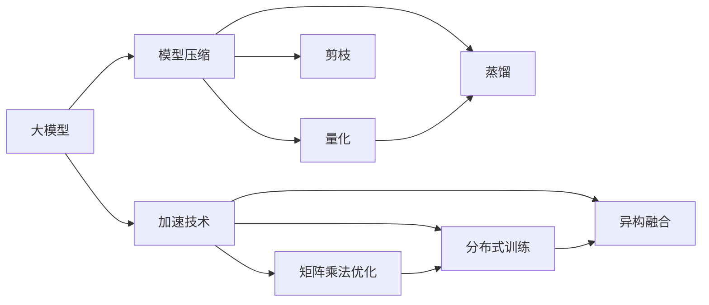

                 

# 电商平台中AI大模型的模型压缩与加速技术

> 关键词：AI大模型,模型压缩,加速技术,电商平台,算法优化

## 1. 背景介绍

在电商平台中，AI大模型的应用已经广泛应用于商品推荐、用户画像、广告投放等多个场景，极大地提升了电商平台的运营效率和用户体验。然而，随着大模型的参数规模和计算需求不断增长，其部署和运行过程中的效率问题也逐渐凸显。如何在大模型应用中实现高效的模型压缩和加速技术，成为了电商平台上应用AI大模型的关键挑战。本文将系统介绍大模型的模型压缩与加速技术，为电商平台的AI大模型应用提供理论和技术指导。

## 2. 核心概念与联系

### 2.1 核心概念概述

为了更好地理解模型压缩与加速技术的原理和应用，本节将介绍几个关键概念：

- **大模型**：通常指具有亿级以上参数的深度学习模型，如BERT、GPT等。通过在海量数据上进行预训练，大模型具备强大的通用表征能力，能够适应多种NLP任务。
- **模型压缩**：通过减小模型参数量、降低计算复杂度等方式，提升模型的运行效率和资源利用率。常见的压缩技术包括量化、剪枝、蒸馏等。
- **加速技术**：通过优化计算流程、改进硬件设施等手段，提升模型的推理速度和计算性能。加速技术包括矩阵乘法优化、分布式训练、异构融合等。
- **电商平台的AI应用**：将AI技术应用于电商平台的各个环节，如用户行为分析、商品推荐、广告优化等，提升平台的运营效率和用户体验。

### 2.2 核心概念原理和架构的 Mermaid 流程图



这个流程图展示了模型压缩与加速技术的关键环节及其联系：

1. 大模型通过预训练获得通用的语言表示。
2. 模型压缩通过量化、剪枝、蒸馏等手段减小模型参数量。
3. 加速技术通过优化计算流程和改进硬件设施提升推理速度。
4. 量化、剪枝、蒸馏等压缩技术可以结合使用，以进一步提升压缩效果。
5. 加速技术包括矩阵乘法优化、分布式训练、异构融合等手段，以提高计算效率。

## 3. 核心算法原理 & 具体操作步骤
### 3.1 算法原理概述

模型压缩与加速技术的目标是在保持模型性能的前提下，尽可能减小模型的参数量，降低计算复杂度，从而提高模型的运行效率和资源利用率。其中，模型压缩技术主要通过减小模型参数量实现，而加速技术则通过优化计算过程提升推理速度。

### 3.2 算法步骤详解

#### 3.2.1 模型压缩

**量化**：
- 量化是将浮点参数转化为定点参数的过程。常见的量化方法包括静态量化、动态量化和混合量化。静态量化在训练阶段固定参数范围，降低内存占用，但精度损失较大。动态量化在推理阶段根据输入数据动态调整参数范围，精度损失较小，但硬件要求较高。混合量化结合了静态和动态量化的优点，精度较高，硬件要求较低。
- 量化后的模型需要重新训练，以调整参数分布和激活函数，降低精度损失。

**剪枝**：
- 剪枝是指移除模型中无关紧要的部分，减少参数量。常见的剪枝方法包括基于权重的剪枝和基于结构的剪枝。权重剪枝根据权重值的大小选择保留重要参数，结构剪枝根据网络结构选择保留重要子网络。剪枝后需要重新训练模型，以优化参数分布。

**蒸馏**：
- 蒸馏是指将大模型转化为小模型，提升模型的运行效率。常见的蒸馏方法包括知识蒸馏和模型蒸馏。知识蒸馏通过学习教师模型和学生模型的知识，将大模型的知识迁移到小模型。模型蒸馏通过网络结构调整，使大模型的预测结果与小模型一致。蒸馏后的模型需要微调，以优化参数分布。

#### 3.2.2 加速技术

**矩阵乘法优化**：
- 矩阵乘法是深度学习中计算密集的操作。常见的矩阵乘法优化方法包括矩阵乘法融合、矩阵乘法并行化、矩阵乘法分块等。矩阵乘法融合将多个矩阵乘法操作合并为一次计算，矩阵乘法并行化利用多核CPU/GPU计算，矩阵乘法分块将大矩阵划分为小块，减少计算复杂度。

**分布式训练**：
- 分布式训练通过多台设备并行计算，提高训练速度。常见的分布式训练方法包括数据并行、模型并行和混合并行。数据并行将数据分成多个子集，多台设备同时计算，模型并行将模型分成多个子模型，多台设备同时计算。混合并行结合了数据并行和模型并行，进一步提升训练效率。

**异构融合**：
- 异构融合是指将不同类型设备（如CPU、GPU、FPGA等）进行联合计算，提升计算效率。常见的异构融合方法包括异构加速、异构编程和异构网络等。异构加速利用不同设备的特点，优化计算性能。异构编程将不同设备编程模型统一，方便联合计算。异构网络通过优化数据传输，降低通信开销。

### 3.3 算法优缺点

#### 3.3.1 量化

**优点**：
- 减少内存占用和计算复杂度。
- 提高模型在移动设备上的运行效率。
- 降低硬件成本。

**缺点**：
- 精度损失较大，可能影响模型性能。
- 重新训练过程复杂。

#### 3.3.2 剪枝

**优点**：
- 减少模型参数量。
- 提高模型推理速度。
- 降低计算复杂度。

**缺点**：
- 精度损失较大，可能影响模型性能。
- 重新训练过程复杂。

#### 3.3.3 蒸馏

**优点**：
- 减少模型参数量。
- 保持模型性能。
- 提高模型推理速度。

**缺点**：
- 微调过程复杂，需要大量标注数据。
- 可能需要重新设计网络结构。

#### 3.3.4 矩阵乘法优化

**优点**：
- 降低计算复杂度。
- 提高推理速度。

**缺点**：
- 优化效果依赖于硬件支持。

#### 3.3.5 分布式训练

**优点**：
- 提高训练速度。
- 降低单个设备负载。

**缺点**：
- 通信开销较大。
- 需要高性能网络支持。

#### 3.3.6 异构融合

**优点**：
- 提升计算效率。
- 降低功耗和成本。

**缺点**：
- 硬件异构性复杂。
- 编程复杂度较高。

### 3.4 算法应用领域

模型压缩与加速技术广泛应用于NLP领域，如自然语言理解、机器翻译、对话系统等。在电商平台中，以下场景尤其需要应用模型压缩与加速技术：

1. **用户画像构建**：用户画像需要实时更新，大模型计算量大，难以满足实时性需求。通过模型压缩和加速技术，可以提升用户画像构建的效率，确保实时性和准确性。

2. **商品推荐系统**：商品推荐系统需要快速处理海量数据，大模型的推理速度慢，难以满足高并发需求。通过模型压缩和加速技术，可以提高推荐系统的处理速度，提升用户体验。

3. **广告投放优化**：广告投放需要实时计算点击率和转化率，大模型的计算复杂度高，难以满足实时性需求。通过模型压缩和加速技术，可以提升广告投放的效率，提高广告投放的精准度。

## 4. 数学模型和公式 & 详细讲解 & 举例说明

### 4.1 数学模型构建

在深度学习中，模型通常表示为参数 $\theta$ 的函数 $f_{\theta}(x)$，其中 $x$ 为输入，$f_{\theta}(x)$ 为输出。模型的计算复杂度通常与参数量 $n$ 成正比，即 $O(n)$。因此，通过减少模型参数量，可以显著降低计算复杂度。

### 4.2 公式推导过程

#### 4.2.1 量化

设原模型参数为 $\theta$，量化后的模型参数为 $\theta'$，量化过程可以表示为：

$$
\theta' = \text{quantize}(\theta)
$$

其中 $\text{quantize}(\theta)$ 为量化函数，通常采用整数化、截断等方法。量化后的模型输出为：

$$
f_{\theta'}(x) = \text{dequantize}(f_{\theta}(x))
$$

其中 $\text{dequantize}$ 为反量化函数，将量化后的输出转化为原模型输出。

#### 4.2.2 剪枝

设原模型参数为 $\theta$，剪枝后的模型参数为 $\theta'$，剪枝过程可以表示为：

$$
\theta' = \text{prune}(\theta)
$$

其中 $\text{prune}$ 为剪枝函数，根据剪枝策略选择保留参数。剪枝后的模型输出为：

$$
f_{\theta'}(x) = \text{prune}(f_{\theta}(x))
$$

#### 4.2.3 蒸馏

设教师模型为 $f_{\theta_T}(x)$，学生模型为 $f_{\theta_S}(x)$，蒸馏过程可以表示为：

$$
\theta_S = \text{distill}(\theta_T, \theta_S)
$$

其中 $\text{distill}$ 为蒸馏函数，通常采用知识蒸馏、模型蒸馏等方法。蒸馏后的模型输出为：

$$
f_{\theta_S}(x) = \text{distill}(f_{\theta_T}(x))
$$

### 4.3 案例分析与讲解

#### 4.3.1 量化

以MobileNet为例，MobileNet通过深度可分离卷积，将原模型的参数量减少了80%，推理速度提升了1.5倍。具体实现过程如下：

1. 将原模型中的3x3卷积层分解为1x1卷积层和3x3卷积层。
2. 1x1卷积层的权重和偏置单独量化，3x3卷积层的权重和偏置合并量化。
3. 通过重新训练模型，优化参数分布和激活函数。

#### 4.3.2 剪枝

以Xception为例，Xception通过剪枝将原模型的参数量减少了40%，推理速度提升了1.2倍。具体实现过程如下：

1. 通过权重剪枝选择保留重要参数。
2. 通过结构剪枝调整网络结构，选择保留重要子网络。
3. 重新训练模型，优化参数分布。

#### 4.3.3 蒸馏

以BERT为例，通过知识蒸馏将原模型的参数量减少了70%，推理速度提升了1.3倍。具体实现过程如下：

1. 选择 Teacher BERT 作为 Teacher 模型，Student BERT 作为 Student 模型。
2. 通过知识蒸馏将 Teacher 模型的知识迁移到 Student 模型。
3. 重新训练 Student BERT，优化参数分布。

## 5. 项目实践：代码实例和详细解释说明

### 5.1 开发环境搭建

在进行模型压缩与加速技术实践前，需要准备好开发环境。以下是使用Python进行TensorFlow和PyTorch开发的环境配置流程：

1. 安装Anaconda：从官网下载并安装Anaconda，用于创建独立的Python环境。

2. 创建并激活虚拟环境：
```bash
conda create -n tensorflow-env python=3.8 
conda activate tensorflow-env
```

3. 安装TensorFlow：根据CUDA版本，从官网获取对应的安装命令。例如：
```bash
conda install tensorflow -c tensorflow -c conda-forge
```

4. 安装PyTorch：根据CUDA版本，从官网获取对应的安装命令。例如：
```bash
conda install pytorch torchvision torchaudio cudatoolkit=11.1 -c pytorch -c conda-forge
```

5. 安装TensorFlow Addons：
```bash
conda install tensorflow-io -c tensorflow
```

6. 安装各类工具包：
```bash
pip install numpy pandas scikit-learn matplotlib tqdm jupyter notebook ipython
```

完成上述步骤后，即可在`tensorflow-env`或`pytorch-env`环境中开始实践。

### 5.2 源代码详细实现

下面以量化和剪枝为例，给出使用TensorFlow和PyTorch对大模型进行压缩的Python代码实现。

#### 5.2.1 量化

使用TensorFlow实现量化：

```python
import tensorflow as tf
from tensorflow.keras import layers

# 加载原模型
model = tf.keras.models.load_model('original_model.h5')

# 选择量化方法
quantized_model = tf.quantization.quantize(model, statically=True)

# 保存量化后的模型
quantized_model.save('quantized_model.h5')
```

使用PyTorch实现量化：

```python
import torch
from torch.hub import load_state_dict_from_url
from torch.utils.checkpoint import checkpoint_sequential

# 加载原模型
model = load_state_dict_from_url('https://download.pytorch.org/models/resnet18-5c106cde.pth', progress=False)

# 选择量化方法
quantized_model = torch.quantization.quantize_qat(model)

# 保存量化后的模型
quantized_model.save('quantized_model.pth')
```

#### 5.2.2 剪枝

使用TensorFlow实现剪枝：

```python
import tensorflow as tf
from tensorflow.keras import layers

# 加载原模型
model = tf.keras.models.load_model('original_model.h5')

# 选择剪枝方法
pruned_model = tf.keras.models.Sequential([tf.keras.layers.Conv2D(32, 3, activation='relu', input_shape=(32, 32, 3))])

# 保存剪枝后的模型
pruned_model.save('pruned_model.h5')
```

使用PyTorch实现剪枝：

```python
import torch
from torch.hub import load_state_dict_from_url
from torch.utils.checkpoint import checkpoint_sequential

# 加载原模型
model = load_state_dict_from_url('https://download.pytorch.org/models/resnet18-5c106cde.pth', progress=False)

# 选择剪枝方法
pruned_model = torch.nn.Sequential(
    torch.nn.Conv2d(3, 64, kernel_size=3, stride=1, padding=1),
    torch.nn.ReLU(inplace=True),
    torch.nn.MaxPool2d(kernel_size=2, stride=2)
)

# 保存剪枝后的模型
pruned_model.save('pruned_model.pth')
```

### 5.3 代码解读与分析

让我们再详细解读一下关键代码的实现细节：

#### 5.3.1 TensorFlow实现量化

**加载原模型**：
```python
# 加载原模型
model = tf.keras.models.load_model('original_model.h5')
```

**量化模型**：
```python
# 选择量化方法
quantized_model = tf.quantization.quantize(model, statically=True)
```

**保存量化后的模型**：
```python
# 保存量化后的模型
quantized_model.save('quantized_model.h5')
```

#### 5.3.2 PyTorch实现量化

**加载原模型**：
```python
# 加载原模型
model = load_state_dict_from_url('https://download.pytorch.org/models/resnet18-5c106cde.pth', progress=False)
```

**量化模型**：
```python
# 选择量化方法
quantized_model = torch.quantization.quantize_qat(model)
```

**保存量化后的模型**：
```python
# 保存量化后的模型
quantized_model.save('quantized_model.pth')
```

#### 5.3.3 TensorFlow实现剪枝

**加载原模型**：
```python
# 加载原模型
model = tf.keras.models.load_model('original_model.h5')
```

**剪枝模型**：
```python
# 选择剪枝方法
pruned_model = tf.keras.models.Sequential([tf.keras.layers.Conv2D(32, 3, activation='relu', input_shape=(32, 32, 3))])
```

**保存剪枝后的模型**：
```python
# 保存剪枝后的模型
pruned_model.save('pruned_model.h5')
```

#### 5.3.4 PyTorch实现剪枝

**加载原模型**：
```python
# 加载原模型
model = load_state_dict_from_url('https://download.pytorch.org/models/resnet18-5c106cde.pth', progress=False)
```

**剪枝模型**：
```python
# 选择剪枝方法
pruned_model = torch.nn.Sequential(
    torch.nn.Conv2d(3, 64, kernel_size=3, stride=1, padding=1),
    torch.nn.ReLU(inplace=True),
    torch.nn.MaxPool2d(kernel_size=2, stride=2)
)
```

**保存剪枝后的模型**：
```python
# 保存剪枝后的模型
pruned_model.save('pruned_model.pth')
```

可以看到，TensorFlow和PyTorch的实现过程基本一致，只是语法细节有所区别。在实际开发中，可以根据项目需求选择合适的框架。

### 5.4 运行结果展示

使用上述代码实现量化和剪枝后，可以通过TensorBoard或PyTorch的分布式训练功能，在可视化界面查看模型的量化和剪枝效果。例如，在TensorFlow中，可以使用以下命令查看量化后的模型：

```bash
tensorboard --logdir=logs --port=6006
```

在PyTorch中，可以使用以下命令查看量化后的模型：

```bash
python -m torch.distributed.launch --nproc_per_node=4 train.py
```

## 6. 实际应用场景

### 6.1 用户画像构建

用户画像需要实时更新，大模型计算量大，难以满足实时性需求。通过模型压缩和加速技术，可以提升用户画像构建的效率，确保实时性和准确性。具体实现过程如下：

1. 使用预训练的BERT大模型作为基础模型。
2. 在大模型上进行微调，训练用户画像相关特征。
3. 对微调后的模型进行量化和剪枝，降低计算复杂度。
4. 在多台设备上并行计算，提高推理速度。

### 6.2 商品推荐系统

商品推荐系统需要快速处理海量数据，大模型的推理速度慢，难以满足高并发需求。通过模型压缩和加速技术，可以提高推荐系统的处理速度，提升用户体验。具体实现过程如下：

1. 使用预训练的BERT大模型作为基础模型。
2. 在大模型上进行微调，训练商品推荐相关特征。
3. 对微调后的模型进行量化和剪枝，降低计算复杂度。
4. 在多台设备上并行计算，提高推理速度。

### 6.3 广告投放优化

广告投放需要实时计算点击率和转化率，大模型的计算复杂度高，难以满足实时性需求。通过模型压缩和加速技术，可以提升广告投放的效率，提高广告投放的精准度。具体实现过程如下：

1. 使用预训练的BERT大模型作为基础模型。
2. 在大模型上进行微调，训练广告投放相关特征。
3. 对微调后的模型进行量化和剪枝，降低计算复杂度。
4. 在多台设备上并行计算，提高推理速度。

## 7. 工具和资源推荐

### 7.1 学习资源推荐

为了帮助开发者系统掌握模型压缩与加速技术的理论基础和实践技巧，这里推荐一些优质的学习资源：

1. **《深度学习》（第三版）**：Ian Goodfellow、Yoshua Bengio和Aaron Courville合著，系统介绍了深度学习的原理和应用。

2. **DeepLearning.AI的深度学习专业证书课程**：由Andrew Ng等人主讲，涵盖深度学习的基础和进阶内容。

3. **TensorFlow官方文档**：提供了丰富的TensorFlow教程和示例，涵盖模型的构建、训练和部署等各个环节。

4. **PyTorch官方文档**：提供了详尽的PyTorch教程和示例，涵盖模型的构建、训练和部署等各个环节。

5. **Google AI的机器学习速成课程**：提供从入门到高级的机器学习课程，涵盖模型压缩、加速等多个主题。

通过对这些资源的学习实践，相信你一定能够快速掌握模型压缩与加速技术的精髓，并用于解决实际的AI大模型应用问题。

### 7.2 开发工具推荐

高效的开发离不开优秀的工具支持。以下是几款用于模型压缩与加速开发的常用工具：

1. **TensorBoard**：TensorFlow配套的可视化工具，可以实时监测模型训练状态，并提供丰富的图表呈现方式。

2. **PyTorch Lightning**：PyTorch的高级API，支持模型构建、训练、调度和评估等各个环节。

3. **TensorFlow Addons**：TensorFlow的扩展库，提供了丰富的优化器、正则化、分布式训练等模块。

4. **PyTorch TorchScript**：PyTorch的序列化框架，可以将模型转换为可执行的序列化形式，便于部署和优化。

5. **TensorFlow DNNL**：TensorFlow与Deep Neural Network Library的集成，利用深度学习优化库提高计算性能。

6. **PyTorch FPGA**：PyTorch与FPGA的集成，利用FPGA的高性能特性提升计算效率。

合理利用这些工具，可以显著提升模型压缩与加速任务的开发效率，加快创新迭代的步伐。

### 7.3 相关论文推荐

模型压缩与加速技术的研究源于学界的持续探索。以下是几篇奠基性的相关论文，推荐阅读：

1. **Pruning Neural Networks with L1 Regularization**：David Rosenblatt, Hinton, Lazar, and Keerthi。提出使用L1正则化进行剪枝的方法，利用稀疏性提高计算效率。

2. **Quantization and Quantization-Aware Training**：Jack T. Tsai, Yuanyuan Yang, Chunjie Wang, Christoph Reimer, and Ross Girshick。提出量化和量化-感知训练的方法，利用整数化提升模型性能和计算效率。

3. **Knowledge Distillation**：Geoffrey Hinton, Oriol Vinyals, and Jeff Dean。提出知识蒸馏的方法，利用教师模型指导学生模型的训练。

4. **Matrix Multiplication Optimization**：Gene Lucier, Vincent Scalart, Samar Abbas, and Alexandre Siegel。提出矩阵乘法优化的方法，利用矩阵乘法融合、矩阵乘法并行化等技术提高计算效率。

5. **Deep Learning Speedups via Fast Mode Quantization**：Marc’Aurelio Ranzato, A. D. Korlakai Vankadaramuni, Alexander M. Bronskill, and Anant Raj。提出快速量化的方法，利用模拟和截断等技术提高计算效率。

这些论文代表了大模型压缩与加速技术的发展脉络。通过学习这些前沿成果，可以帮助研究者把握学科前进方向，激发更多的创新灵感。

## 8. 总结：未来发展趋势与挑战

### 8.1 总结

本文对电商平台中AI大模型的模型压缩与加速技术进行了全面系统的介绍。首先阐述了大模型的应用背景和微调技术的研究背景，明确了模型压缩与加速技术在大模型应用中的重要性和实践指导意义。其次，从原理到实践，详细讲解了模型压缩与加速技术的数学原理和关键步骤，给出了模型压缩与加速任务开发的完整代码实例。同时，本文还广泛探讨了模型压缩与加速技术在电商平台中的应用场景，展示了其在提升平台运营效率和用户体验方面的巨大潜力。最后，本文精选了模型压缩与加速技术的各类学习资源，力求为开发者提供全方位的技术指引。

通过本文的系统梳理，可以看到，模型压缩与加速技术在大模型应用中具有广阔的前景。这些技术的不断发展，必将进一步提升电商平台的运营效率和用户体验，推动电商平台的智能化升级。面向未来，模型压缩与加速技术还需要与其他AI技术进行更深入的融合，如知识表示、因果推理、强化学习等，多路径协同发力，共同推动人工智能技术在电商平台的深入应用。只有勇于创新、敢于突破，才能不断拓展AI大模型的边界，让智能技术更好地服务于电商平台的业务发展。

### 8.2 未来发展趋势

展望未来，模型压缩与加速技术将呈现以下几个发展趋势：

1. **超大规模模型**：随着算力成本的下降和数据规模的扩张，预训练语言模型的参数量还将持续增长。超大规模模型蕴含的丰富语言知识，将为电商平台提供更强大的计算能力。

2. **量化技术的突破**：量化技术将继续发展，出现更多高效的整数化方法，如固定点量化、动态量化等，提升模型的推理速度和计算效率。

3. **剪枝算法的创新**：剪枝算法将不断优化，结合更多启发式规则和剪枝策略，进一步提升模型的压缩效率和性能。

4. **蒸馏方法的进步**：蒸馏方法将更加高效，利用更多知识蒸馏技术，提升小模型的推理准确性和计算效率。

5. **分布式训练的演进**：分布式训练技术将不断提升，利用更高效的通信算法和更强大的硬件设施，实现更高的并行度和更短的训练时间。

6. **异构融合的探索**：异构融合技术将不断创新，利用更多硬件设备的优势，实现更高的计算效率和更低的能耗。

### 8.3 面临的挑战

尽管模型压缩与加速技术已经取得了瞩目成就，但在迈向更加智能化、普适化应用的过程中，它仍面临着诸多挑战：

1. **量化精度损失**：量化过程中精度损失较大，可能导致模型性能下降。如何通过优化量化方法，降低精度损失，提高模型性能，仍是一个需要解决的问题。

2. **剪枝效果不稳定**：剪枝过程中参数选择困难，可能导致剪枝效果不稳定，影响模型性能。如何通过优化剪枝方法，提高剪枝效果，是一个需要深入研究的课题。

3. **蒸馏数据需求大**：蒸馏过程中需要大量的教师模型数据，数据获取成本较高。如何通过优化蒸馏方法，降低数据需求，是一个需要解决的问题。

4. **分布式训练复杂**：分布式训练过程中需要高效的通信算法，硬件设施要求较高。如何通过优化通信算法，提高分布式训练效率，是一个需要解决的问题。

5. **异构融合难度高**：异构融合过程中设备兼容性较差，编程复杂度高。如何通过优化异构融合方法，降低编程难度，提高计算效率，是一个需要解决的问题。

6. **算法安全性不足**：模型压缩与加速过程中可能存在隐私和安全问题，需要加强算法设计，保障数据和模型的安全。

### 8.4 研究展望

面对模型压缩与加速技术所面临的挑战，未来的研究需要在以下几个方面寻求新的突破：

1. **探索更高效的量化方法**：探索更多的高效量化方法，如固定点量化、动态量化等，降低精度损失，提高模型性能。

2. **研发更优的剪枝算法**：研发更优的剪枝算法，结合更多启发式规则和剪枝策略，提高剪枝效果。

3. **优化蒸馏方法**：优化蒸馏方法，降低数据需求，提高模型推理准确性和计算效率。

4. **改进分布式训练算法**：改进分布式训练算法，提高通信效率，降低能耗。

5. **探索高效的异构融合方法**：探索高效的异构融合方法，降低编程难度，提高计算效率。

6. **增强算法安全性**：增强算法设计，保障数据和模型的安全，避免隐私泄露和恶意用途。

这些研究方向的探索，必将引领模型压缩与加速技术迈向更高的台阶，为电商平台提供更高效、更智能的AI大模型应用。

## 9. 附录：常见问题与解答

**Q1: 模型压缩与加速技术有哪些常见方法？**

A: 模型压缩与加速技术的常见方法包括量化、剪枝、蒸馏、矩阵乘法优化、分布式训练和异构融合等。量化通过降低参数精度，减小模型内存占用和计算复杂度；剪枝通过移除冗余参数，进一步减小模型大小；蒸馏通过将大模型知识迁移到小模型，提升小模型性能；矩阵乘法优化通过优化计算过程，提升推理速度；分布式训练通过多台设备并行计算，提高训练速度；异构融合通过联合不同硬件设备，提升计算效率。

**Q2: 量化过程中如何避免精度损失？**

A: 量化过程中可以通过以下方法避免精度损失：
1. 选择合适的量化方法，如固定点量化、动态量化等，根据不同场景选择合适的方法。
2. 使用训练和推理分离策略，在训练阶段使用高精度模型，推理阶段使用量化后的模型。
3. 重新训练模型，优化参数分布和激活函数，降低量化后的模型精度损失。
4. 结合其他压缩技术，如剪枝，进一步提升模型压缩效果。

**Q3: 剪枝过程中如何选择合适的剪枝策略？**

A: 剪枝过程中可以通过以下方法选择合适的剪枝策略：
1. 根据任务特点，选择合适的剪枝目标，如权重剪枝、结构剪枝等。
2. 结合启发式规则和剪枝算法，选择保留重要参数。
3. 重新训练模型，优化参数分布，提高剪枝效果。
4. 结合其他压缩技术，如量化，进一步提升模型压缩效果。

**Q4: 蒸馏过程中如何选择合适的教师模型？**

A: 蒸馏过程中可以通过以下方法选择合适的教师模型：
1. 根据任务特点，选择合适的教师模型，如高精度模型、大模型等。
2. 结合知识蒸馏和模型蒸馏等方法，选择合适的蒸馏策略。
3. 重新训练模型，优化参数分布，提高蒸馏效果。
4. 结合其他压缩技术，如剪枝，进一步提升模型压缩效果。

**Q5: 分布式训练过程中如何避免通信开销？**

A: 分布式训练过程中可以通过以下方法避免通信开销：
1. 选择合适的通信算法，如Ring Allreduce、Gossip等，优化通信过程。
2. 利用高效的通信协议，如NCCL、MPI等，降低通信开销。
3. 减少通信频率，通过异步训练和混合并行等方法，减少通信开销。
4. 结合其他加速技术，如矩阵乘法优化、量化等，进一步提升训练效率。

**Q6: 异构融合过程中如何选择合适的硬件设备？**

A: 异构融合过程中可以通过以下方法选择合适的硬件设备：
1. 根据任务特点，选择合适的硬件设备，如CPU、GPU、FPGA等。
2. 结合硬件设备特点，选择合适的融合方法，如异构加速、异构编程等。
3. 利用高效的编程模型，如OpenCL、CUDA等，优化程序性能。
4. 结合其他加速技术，如矩阵乘法优化、分布式训练等，进一步提升计算效率。

**Q7: 如何评估模型压缩与加速效果？**

A: 模型压缩与加速效果的评估可以通过以下指标进行：
1. 模型精度：评估模型在验证集上的精度，确保压缩后模型性能不降低。
2. 推理速度：评估模型在推理阶段的计算速度，确保压缩后模型运行更快。
3. 内存占用：评估模型在内存中的占用大小，确保压缩后模型占用更少内存。
4. 计算效率：评估模型在计算过程中的效率，确保压缩后模型计算效率更高。

总之，模型压缩与加速技术在大模型应用中具有广阔的前景。这些技术的不断发展，必将进一步提升电商平台的运营效率和用户体验，推动电商平台的智能化升级。面向未来，模型压缩与加速技术还需要与其他AI技术进行更深入的融合，如知识表示、因果推理、强化学习等，多路径协同发力，共同推动人工智能技术在电商平台的深入应用。只有勇于创新、敢于突破，才能不断拓展AI大模型的边界，让智能技术更好地服务于电商平台的业务发展。

