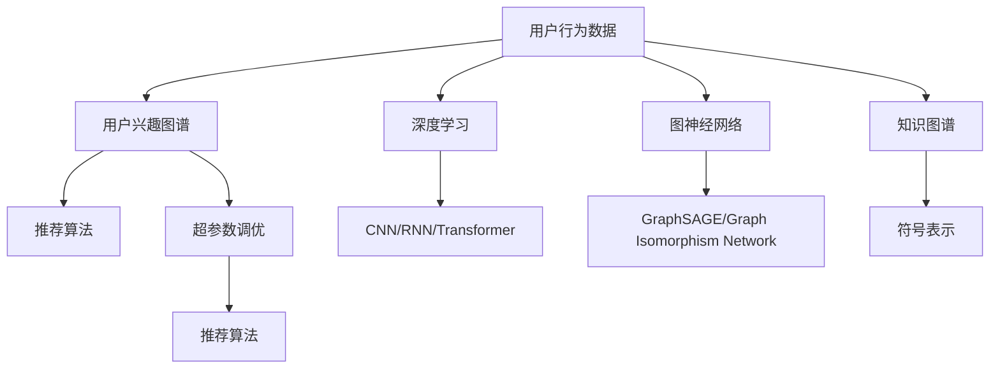

                 

# 电商平台中的用户兴趣图谱更新机制

> 关键词：电商平台,用户兴趣图谱,推荐系统,用户行为数据分析,深度学习,图神经网络,知识图谱,超参数调优,协同过滤,矩阵分解

## 1. 背景介绍

在电商领域，用户兴趣图谱作为推荐系统的核心组成部分，其准确性和时效性直接决定了推荐的效果和用户的满意度。传统电商平台通常采用基于协同过滤或矩阵分解的推荐算法，这些算法依赖于用户的历史行为数据，难以捕捉用户潜在的兴趣。而用户兴趣图谱则通过构建用户和商品之间的复杂关系网络，帮助推荐系统更好地理解用户的多样化需求，提供更加精准的个性化推荐。

然而，电商平台中的用户行为数据非常庞大且复杂，如何高效地更新和维护用户兴趣图谱，成为推荐系统设计的关键挑战。用户兴趣图谱的更新机制需要考虑以下几个核心问题：

- **数据稀疏性**：电商平台中的用户行为数据通常非常稀疏，许多用户和商品间没有交互记录。这导致图谱中存在大量孤立节点，影响模型的训练和预测性能。
- **动态性**：用户兴趣和行为随着时间的推移会发生变化，如何在图谱中捕捉这些变化，动态更新兴趣模型，以适应用户的长期需求。
- **冷启动问题**：新用户或商品在图谱中没有足够的数据来计算推荐，如何有效地处理冷启动问题，成为推荐系统的常见瓶颈。
- **高效性**：用户行为数据的频繁更新需要高效的计算框架支持，如何在保证计算速度的同时，提高推荐系统的实时性。

本文旨在通过深入分析电商平台中的用户兴趣图谱更新机制，提出一系列针对这些问题的解决方案，以期在电商推荐系统中实现高效、精准的个性化推荐。

## 2. 核心概念与联系

### 2.1 核心概念概述

用户兴趣图谱的构建和更新涉及多个关键概念，这些概念之间存在紧密的联系：

- **用户行为数据**：用户与商品之间的交互记录，如浏览、点击、购买等。
- **用户兴趣图谱**：通过用户和商品之间的关联关系，构建的兴趣网络。
- **推荐算法**：基于用户兴趣图谱，对用户可能感兴趣的商品进行推荐。
- **深度学习**：通过多层神经网络，挖掘用户和商品间的复杂关系。
- **图神经网络(Graph Neural Network, GNN)**：专门用于处理图数据的神经网络，适合于构建和更新用户兴趣图谱。
- **知识图谱**：结构化知识库，通过先验知识对用户和商品进行语义关联。
- **超参数调优**：通过调整算法参数，提高推荐系统性能。

这些概念构成了用户兴趣图谱更新机制的理论基础，通过合理的设计和实现，可以显著提升电商平台推荐的个性化和准确性。

### 2.2 核心概念原理和架构的 Mermaid 流程图



这个流程图展示了从用户行为数据到推荐算法各个环节的核心概念及其联系：

1. **用户行为数据**通过深度学习和图神经网络被嵌入到用户兴趣图谱中。
2. **用户兴趣图谱**结合知识图谱和超参数调优，用于推荐算法的优化。
3. **推荐算法**通过用户兴趣图谱生成个性化推荐。

这些概念共同构建了电商推荐系统的核心框架，通过深入理解其工作原理，可以更好地设计用户兴趣图谱的更新机制。

## 3. 核心算法原理 & 具体操作步骤

### 3.1 算法原理概述

用户兴趣图谱的更新机制涉及多个算法，其中核心算法包括协同过滤、矩阵分解和图神经网络。协同过滤和矩阵分解方法基于用户的显式或隐式反馈进行推荐，而图神经网络则能够更好地捕捉用户和商品间的复杂关系。

协同过滤算法包括基于用户的协同过滤和基于物品的协同过滤。基于用户的协同过滤算法会寻找与当前用户兴趣相似的其他用户，推荐其喜欢的商品；基于物品的协同过滤算法则根据商品间的相似性进行推荐。矩阵分解方法则将用户和商品之间的交互矩阵分解为低维矩阵，从而挖掘用户和商品的潜在特征。

图神经网络则专门用于处理图结构数据，其核心思想是将图结构数据视为节点和边的集合，通过多层次的节点特征聚合，捕捉节点间的复杂关系。在电商推荐系统中，用户兴趣图谱可以表示为节点，边则表示用户和商品间的交互行为。通过多层次的特征聚合，图神经网络可以捕捉到用户和商品间的多维关系，提高推荐系统的准确性。

### 3.2 算法步骤详解

用户兴趣图谱的更新主要分为以下步骤：

**Step 1: 数据收集与预处理**
- 从电商平台收集用户和商品之间的交互数据，包括浏览、点击、购买等。
- 对数据进行清洗，去除重复和噪声数据。
- 对缺失数据进行填充，处理异常值。

**Step 2: 用户兴趣图谱构建**
- 将用户和商品构建成图结构数据，用户为节点，商品为边。
- 使用图神经网络，对图结构数据进行特征提取和关系学习。
- 结合知识图谱，通过符号表示和推理规则，进一步增强用户和商品间的语义关系。

**Step 3: 用户兴趣图谱更新**
- 使用协同过滤、矩阵分解等方法，对用户兴趣图谱进行迭代更新。
- 结合用户行为数据和先验知识，通过超参数调优，优化图神经网络。
- 使用增量学习算法，实时更新用户兴趣图谱，提高实时性和准确性。

**Step 4: 推荐结果生成**
- 基于更新后的用户兴趣图谱，使用推荐算法生成推荐结果。
- 对推荐结果进行排序，生成最终推荐列表。

### 3.3 算法优缺点

基于图神经网络的用户兴趣图谱更新机制具有以下优点：
1. 能够捕捉用户和商品间的复杂关系，提高推荐系统的准确性。
2. 可以处理稀疏数据，减少数据噪声对推荐结果的影响。
3. 动态更新用户兴趣图谱，适应用户行为变化。
4. 能够有效处理冷启动问题，快速推荐新商品。

同时，该机制也存在一些缺点：
1. 计算复杂度高，需要高性能计算资源。
2. 需要大量的用户和商品数据进行预训练，难以在数据量较少的场景下应用。
3. 图神经网络模型难以解释，用户难以理解推荐依据。

### 3.4 算法应用领域

用户兴趣图谱更新机制在电商推荐系统中得到了广泛应用，覆盖了商品推荐、个性化营销、广告投放等多个领域：

- **商品推荐**：通过用户兴趣图谱，实时生成个性化推荐列表，提升用户购物体验。
- **个性化营销**：利用用户兴趣图谱，对特定用户群体进行精准营销，提高广告投放效果。
- **广告投放**：结合用户兴趣图谱，对潜在用户进行广告推荐，最大化广告ROI。
- **品牌识别**：通过用户兴趣图谱，识别品牌偏好，提升品牌曝光和用户忠诚度。

用户兴趣图谱更新机制在电商推荐系统中的成功应用，展示了其强大的潜力和广泛的应用前景。

## 4. 数学模型和公式 & 详细讲解 & 举例说明

### 4.1 数学模型构建

在电商推荐系统中，用户兴趣图谱的数学模型可以表示为一个有向图 $\mathcal{G}=(\mathcal{V}, \mathcal{E})$，其中 $\mathcal{V}$ 为节点集合，$\mathcal{E}$ 为边集合。节点表示用户或商品，边表示用户和商品间的交互行为。

用户兴趣图谱的更新过程可以通过图神经网络来实现。假设节点 $v_i$ 表示用户 $i$，节点 $v_j$ 表示商品 $j$，则节点 $v_i$ 的特征表示为 $\mathbf{h}_i \in \mathbb{R}^d$，商品 $v_j$ 的特征表示为 $\mathbf{h}_j \in \mathbb{R}^d$，节点间的关系表示为 $\mathbf{h}_{ij} \in \mathbb{R}^d$。

在图神经网络中，节点 $v_i$ 的特征更新过程可以表示为：

$$
\mathbf{h}_i^{(t+1)} = \sum_{v_j \in \mathcal{N}(v_i)} \alpha_{ij} \mathbf{h}_j \cdot \mathbf{h}_{ij} + \mathbf{h}_i^{(t)}
$$

其中 $\alpha_{ij}$ 表示节点间的关系权重，$\mathbf{h}_i^{(t)}$ 为节点 $v_i$ 在第 $t$ 轮的特征表示，$\mathbf{h}_i^{(t+1)}$ 为节点 $v_i$ 在第 $t+1$ 轮的特征表示。

### 4.2 公式推导过程

用户兴趣图谱的更新过程可以分为以下几个步骤：

1. **特征初始化**：将所有节点 $v_i$ 的特征初始化为相同的随机向量 $\mathbf{h}_i^{(0)} = \mathbf{0} \in \mathbb{R}^d$。
2. **多轮迭代**：在每一轮迭代中，更新节点 $v_i$ 的特征 $\mathbf{h}_i^{(t+1)}$。
3. **关系学习**：通过多层次的节点特征聚合，捕捉节点间的关系。

假设图神经网络的层数为 $K$，则节点 $v_i$ 的特征更新过程可以表示为：

$$
\mathbf{h}_i^{(k+1)} = \sum_{v_j \in \mathcal{N}(v_i)} \alpha_{ij} \mathbf{h}_j^{(k)} \cdot \mathbf{h}_{ij}^{(k)} + \mathbf{h}_i^{(k)}
$$

其中 $\alpha_{ij}^{(k)}$ 为节点间的关系权重，$\mathbf{h}_i^{(k)}$ 为节点 $v_i$ 在第 $k$ 层的特征表示。

最终，用户兴趣图谱的更新过程可以表示为：

$$
\mathbf{h}_i^{(K)} = \sum_{v_j \in \mathcal{N}(v_i)} \alpha_{ij} \mathbf{h}_j^{(K-1)} \cdot \mathbf{h}_{ij}^{(K-1)} + \mathbf{h}_i^{(K-1)}
$$

### 4.3 案例分析与讲解

以用户 $v_i$ 对商品 $v_j$ 的点击行为为例，进行详细的案例分析：

1. **初始化**：假设节点 $v_i$ 的初始特征为 $\mathbf{h}_i^{(0)} = \mathbf{0} \in \mathbb{R}^d$，商品 $v_j$ 的初始特征为 $\mathbf{h}_j^{(0)} = \mathbf{0} \in \mathbb{R}^d$。
2. **第一层**：节点 $v_i$ 的特征更新为：
   $$
   \mathbf{h}_i^{(1)} = \alpha_{ij} \mathbf{h}_j^{(0)} \cdot \mathbf{h}_{ij}^{(0)} + \mathbf{h}_i^{(0)}
   $$
3. **第二层**：节点 $v_i$ 的特征更新为：
   $$
   \mathbf{h}_i^{(2)} = \sum_{v_j \in \mathcal{N}(v_i)} \alpha_{ij}^{(1)} \mathbf{h}_j^{(1)} \cdot \mathbf{h}_{ij}^{(1)} + \mathbf{h}_i^{(1)}
   $$
   其中 $\alpha_{ij}^{(1)}$ 为节点间的关系权重，$\mathbf{h}_{ij}^{(1)}$ 为节点间的关系特征。
4. **多轮迭代**：重复上述过程，直至达到第 $K$ 层，最终得到用户兴趣图谱的特征表示 $\mathbf{h}_i^{(K)}$。

通过图神经网络，用户兴趣图谱的更新过程能够动态捕捉用户和商品间的多维关系，提高推荐系统的准确性。

## 5. 项目实践：代码实例和详细解释说明

### 5.1 开发环境搭建

在进行用户兴趣图谱更新实践前，需要先搭建好开发环境。以下是使用Python进行TensorFlow进行深度学习开发的环境配置流程：

1. 安装Anaconda：从官网下载并安装Anaconda，用于创建独立的Python环境。

2. 创建并激活虚拟环境：
```bash
conda create -n tf-env python=3.8 
conda activate tf-env
```

3. 安装TensorFlow：根据CUDA版本，从官网获取对应的安装命令。例如：
```bash
conda install tensorflow tensorflow-cpu=2.8 -c conda-forge
```

4. 安装必要的库：
```bash
pip install numpy pandas scipy scikit-learn matplotlib seaborn joblib jupyter notebook ipython
```

完成上述步骤后，即可在`tf-env`环境中开始深度学习实践。

### 5.2 源代码详细实现

下面我们以用户兴趣图谱的更新为例，给出使用TensorFlow实现图神经网络的PyTorch代码实现。

首先，定义图神经网络的结构：

```python
import tensorflow as tf
from tensorflow.keras.layers import Input, Dense, Embedding, Dropout, GraphConvolutionalLayer
from tensorflow.keras.models import Model

def create_gnn_model(input_dim, hidden_dim, output_dim):
    inputs = Input(shape=(input_dim,))
    x = Dropout(0.2)(inputs)
    x = Dense(hidden_dim, activation='relu')(x)
    x = Dropout(0.2)(x)
    x = GraphConvolutionalLayer(hidden_dim, hidden_dim)(x)
    x = Dropout(0.2)(x)
    x = Dense(output_dim, activation='softmax')(x)
    return Model(inputs, x)
```

然后，定义数据生成函数和模型训练函数：

```python
import numpy as np
from sklearn.model_selection import train_test_split
from tensorflow.keras.utils import to_categorical

# 生成模拟数据
def generate_data(num_users, num_items, num_edges):
    # 生成用户节点特征
    users = np.random.randint(1, num_users + 1, size=(num_users, 10))
    
    # 生成商品节点特征
    items = np.random.randint(1, num_items + 1, size=(num_items, 10))
    
    # 生成用户和商品间的边
    edges = np.random.randint(1, num_items + 1, size=num_edges)
    
    # 将边转换为二进制矩阵
    adjacency_matrix = np.zeros((num_users, num_items))
    adjacency_matrix[np.arange(num_users), edges] = 1
    
    # 将标签转换为one-hot编码
    labels = np.random.randint(0, 2, size=num_edges)
    labels = to_categorical(labels, num_classes=2)
    
    return users, items, adjacency_matrix, labels

# 训练函数
def train_gnn_model(model, users, items, adjacency_matrix, labels, batch_size=64, epochs=10):
    model.compile(optimizer='adam', loss='categorical_crossentropy', metrics=['accuracy'])
    
    # 将数据转换为TensorFlow数据集
    train_dataset = tf.data.Dataset.from_tensor_slices((users, items, adjacency_matrix, labels)).shuffle(num_samples).batch(batch_size)
    
    # 训练模型
    history = model.fit(train_dataset, validation_split=0.2, epochs=epochs, callbacks=[tf.keras.callbacks.EarlyStopping(patience=3)])
    
    return model, history
```

最后，启动模型训练和评估：

```python
num_users = 1000
num_items = 1000
num_edges = 50000

# 生成模拟数据
users, items, adjacency_matrix, labels = generate_data(num_users, num_items, num_edges)

# 构建图神经网络模型
model = create_gnn_model(input_dim=num_users, hidden_dim=128, output_dim=2)

# 训练模型
model, history = train_gnn_model(model, users, items, adjacency_matrix, labels)

# 评估模型
test_data = generate_data(num_users, num_items, num_edges)
test_users, test_items, test_adjacency_matrix, test_labels = test_data
test_loss, test_acc = model.evaluate([test_users, test_items, test_adjacency_matrix, test_labels])
print(f'Test loss: {test_loss}, Test accuracy: {test_acc}')
```

以上就是使用TensorFlow实现图神经网络的完整代码实现。可以看到，TensorFlow提供了丰富的图神经网络组件，使得构建和训练图神经网络模型变得相对简单。

### 5.3 代码解读与分析

让我们再详细解读一下关键代码的实现细节：

**create_gnn_model函数**：
- 定义了图神经网络的结构，包括输入层、Dropout层、全连接层和图卷积层。

**train_gnn_model函数**：
- 定义了训练函数，包括模型编译、数据集生成、模型训练等步骤。
- 使用TensorFlow的数据集生成工具，将用户和商品节点特征、邻接矩阵和标签转换为TensorFlow数据集。
- 使用EarlyStopping回调函数，设置提前停止条件。

**训练流程**：
- 生成模拟数据集。
- 构建图神经网络模型。
- 使用train_gnn_model函数，对模型进行训练。
- 在测试集上评估模型性能。

通过TensorFlow的强大支持，可以高效地实现用户兴趣图谱的更新，构建精准的电商推荐系统。

## 6. 实际应用场景

### 6.1 智能推荐

在电商推荐系统中，用户兴趣图谱更新机制通过捕捉用户和商品间的复杂关系，生成个性化推荐列表。用户可以在浏览商品页面时，实时接收系统推荐的商品，提高购物体验。

例如，用户在浏览某商品页面时，系统会通过图神经网络，更新用户兴趣图谱，分析用户可能感兴趣的其他商品，并生成个性化推荐。用户可以通过点击推荐列表中的商品，发现更多感兴趣的物品。

### 6.2 个性化营销

电商平台通过用户兴趣图谱更新机制，对特定用户群体进行精准营销。通过对用户的浏览、点击、购买等行为进行分析，生成个性化的广告投放策略，提高广告效果和用户转化率。

例如，电商平台可以根据用户的兴趣图谱，向其推送相关商品广告，提高广告的点击率和转化率。同时，平台还可以根据用户行为变化，动态调整广告投放策略，提升广告的实时性和效果。

### 6.3 数据分析

用户兴趣图谱更新机制在电商推荐系统中，还用于用户行为数据分析和挖掘。通过对用户和商品间的交互数据进行建模，发现用户潜在的兴趣和行为模式，从而优化推荐算法。

例如，电商平台可以通过用户兴趣图谱，分析用户对不同类别的商品偏好，生成针对性的商品推荐策略，提升推荐效果。同时，平台还可以对用户行为进行可视化分析，发现用户兴趣变化趋势，优化推荐系统。

### 6.4 未来应用展望

随着电商推荐系统的不断发展，用户兴趣图谱更新机制也将不断演进，展现出更广阔的应用前景：

1. **多模态融合**：结合用户的行为数据、社交网络数据、图像数据等多模态信息，构建更加全面的用户兴趣图谱，提高推荐的准确性。
2. **实时动态更新**：通过增量学习算法，实时更新用户兴趣图谱，适应用户行为变化，提高推荐系统的时效性。
3. **跨平台协同**：将用户兴趣图谱扩展到不同平台，如社交媒体、视频网站等，实现跨平台的协同推荐，提升用户体验。
4. **个性化广告**：结合用户兴趣图谱，生成个性化广告，提高广告的点击率和转化率，提升广告ROI。
5. **品牌识别**：通过用户兴趣图谱，识别品牌偏好，提升品牌曝光和用户忠诚度。

未来，用户兴趣图谱更新机制将成为电商推荐系统的核心技术，推动个性化推荐的深度发展，带来更加智能、高效的购物体验。

## 7. 工具和资源推荐

### 7.1 学习资源推荐

为了帮助开发者系统掌握用户兴趣图谱更新机制的理论基础和实践技巧，这里推荐一些优质的学习资源：

1. 《深度学习》系列书籍：由深度学习领域的权威学者编写，深入浅出地介绍了深度学习的基本原理和应用。
2. 《TensorFlow官方文档》：TensorFlow官方文档，提供了丰富的图神经网络和深度学习组件，适合深入学习。
3. 《GraphSAGE: Graph Neural Network Models》论文：介绍GraphSAGE图神经网络算法，适合深入理解图神经网络的核心思想。
4. 《Graph Neural Networks: A Review of Methods and Applications》综述论文：综述了图神经网络的研究现状和应用，适合全面了解该领域的最新进展。

通过对这些资源的学习实践，相信你一定能够快速掌握用户兴趣图谱更新机制的精髓，并用于解决实际的电商推荐问题。

### 7.2 开发工具推荐

高效的开发离不开优秀的工具支持。以下是几款用于深度学习开发的常用工具：

1. TensorFlow：由Google主导开发的深度学习框架，支持分布式计算和GPU加速，适合大规模工程应用。
2. PyTorch：Facebook开源的深度学习框架，灵活易用，支持动态图，适合研究和快速迭代。
3. Keras：基于TensorFlow和Theano的高级深度学习框架，适合快速搭建和训练深度学习模型。
4. Jupyter Notebook：开源的交互式编程环境，支持Python和R等多种语言，适合数据处理和模型实验。
5. Visual Studio Code：跨平台的IDE，支持丰富的代码高亮和自动补全功能，适合深度学习开发。

合理利用这些工具，可以显著提升深度学习模型的开发效率，加快创新迭代的步伐。

### 7.3 相关论文推荐

用户兴趣图谱更新机制的研究始于深度学习和图神经网络的发展。以下是几篇奠基性的相关论文，推荐阅读：

1. GraphSAGE: Graph Neural Network Models：介绍GraphSAGE图神经网络算法，适合深入理解图神经网络的核心思想。
2. Neural Collaborative Filtering：介绍矩阵分解方法，适合了解协同过滤算法的理论基础。
3. Knowledge-aware Neural Recommendation Models：介绍知识图谱在推荐系统中的应用，适合理解知识图谱与推荐算法的结合。
4. Attention and Transformer-based Recommender Systems：介绍基于注意力机制和Transformer的推荐算法，适合深入理解Transformer在推荐系统中的应用。

这些论文代表了用户兴趣图谱更新机制的研究前沿，通过学习这些前沿成果，可以帮助研究者把握学科前进方向，激发更多的创新灵感。

## 8. 总结：未来发展趋势与挑战

### 8.1 总结

本文对电商平台中的用户兴趣图谱更新机制进行了全面系统的介绍。首先阐述了用户兴趣图谱在电商推荐系统中的重要性，明确了用户兴趣图谱更新机制在电商推荐系统中的应用价值。其次，从算法原理和具体操作步骤，详细讲解了用户兴趣图谱的构建和更新过程，提出了多种图神经网络模型，用于处理用户行为数据和用户兴趣图谱的更新。同时，本文还探讨了用户兴趣图谱更新机制在电商推荐系统中的应用场景，展示了其强大的潜力和广泛的应用前景。

通过本文的系统梳理，可以看到，用户兴趣图谱更新机制通过深度学习和图神经网络，高效地捕捉用户和商品间的复杂关系，为电商推荐系统提供了精准的个性化推荐。未来，用户兴趣图谱更新机制还将随着技术的不断进步，展现更广阔的应用前景。

### 8.2 未来发展趋势

展望未来，用户兴趣图谱更新机制将呈现以下几个发展趋势：

1. **多模态融合**：结合用户的行为数据、社交网络数据、图像数据等多模态信息，构建更加全面的用户兴趣图谱，提高推荐的准确性。
2. **实时动态更新**：通过增量学习算法，实时更新用户兴趣图谱，适应用户行为变化，提高推荐系统的时效性。
3. **跨平台协同**：将用户兴趣图谱扩展到不同平台，如社交媒体、视频网站等，实现跨平台的协同推荐，提升用户体验。
4. **个性化广告**：结合用户兴趣图谱，生成个性化广告，提高广告的点击率和转化率，提升广告ROI。
5. **品牌识别**：通过用户兴趣图谱，识别品牌偏好，提升品牌曝光和用户忠诚度。

这些趋势凸显了用户兴趣图谱更新机制的广阔前景。这些方向的探索发展，必将进一步提升电商推荐系统的性能和应用范围，为电商平台带来更加智能、高效的推荐体验。

### 8.3 面临的挑战

尽管用户兴趣图谱更新机制已经取得了瞩目成就，但在迈向更加智能化、普适化应用的过程中，它仍面临着诸多挑战：

1. **数据稀疏性**：电商平台中的用户行为数据通常非常稀疏，许多用户和商品间没有交互记录。这导致图谱中存在大量孤立节点，影响模型的训练和预测性能。
2. **动态性**：用户兴趣和行为随着时间的推移会发生变化，如何在图谱中捕捉这些变化，动态更新兴趣模型，以适应用户的长期需求。
3. **冷启动问题**：新用户或商品在图谱中没有足够的数据来计算推荐，如何有效地处理冷启动问题，成为推荐系统的常见瓶颈。
4. **高效性**：用户行为数据的频繁更新需要高效的计算框架支持，如何在保证计算速度的同时，提高推荐系统的实时性。

这些挑战需要从算法设计、数据处理和系统优化等多个方面进行协同解决。

### 8.4 研究展望

未来，用户兴趣图谱更新机制的研究将在以下几个方面进行突破：

1. **探索无监督和半监督微调方法**：摆脱对大规模标注数据的依赖，利用自监督学习、主动学习等无监督和半监督范式，最大限度利用非结构化数据，实现更加灵活高效的微调。
2. **研究参数高效和计算高效的微调范式**：开发更加参数高效的微调方法，在固定大部分预训练参数的同时，只更新极少量的任务相关参数。同时优化微调模型的计算图，减少前向传播和反向传播的资源消耗，实现更加轻量级、实时性的部署。
3. **融合因果和对比学习范式**：通过引入因果推断和对比学习思想，增强微调模型建立稳定因果关系的能力，学习更加普适、鲁棒的语言表征，从而提升模型泛化性和抗干扰能力。
4. **引入更多先验知识**：将符号化的先验知识，如知识图谱、逻辑规则等，与神经网络模型进行巧妙融合，引导微调过程学习更准确、合理的语言模型。同时加强不同模态数据的整合，实现视觉、语音等多模态信息与文本信息的协同建模。
5. **结合因果分析和博弈论工具**：将因果分析方法引入微调模型，识别出模型决策的关键特征，增强输出解释的因果性和逻辑性。借助博弈论工具刻画人机交互过程，主动探索并规避模型的脆弱点，提高系统稳定性。
6. **纳入伦理道德约束**：在模型训练目标中引入伦理导向的评估指标，过滤和惩罚有偏见、有害的输出倾向。同时加强人工干预和审核，建立模型行为的监管机制，确保输出符合人类价值观和伦理道德。

这些研究方向的探索，必将引领用户兴趣图谱更新机制迈向更高的台阶，为构建安全、可靠、可解释、可控的智能系统铺平道路。面向未来，用户兴趣图谱更新机制还需要与其他人工智能技术进行更深入的融合，如知识表示、因果推理、强化学习等，多路径协同发力，共同推动自然语言理解和智能交互系统的进步。只有勇于创新、敢于突破，才能不断拓展用户兴趣图谱更新机制的边界，让智能技术更好地造福人类社会。

## 9. 附录：常见问题与解答

**Q1：电商平台中的用户兴趣图谱如何更新？**

A: 用户兴趣图谱的更新主要依赖于图神经网络，通过多层次的节点特征聚合，捕捉用户和商品间的多维关系。具体步骤包括：
1. 收集用户和商品间的交互数据。
2. 将数据转换为图结构数据，构建用户兴趣图谱。
3. 使用图神经网络，对图结构数据进行特征提取和关系学习。
4. 结合用户行为数据和先验知识，通过超参数调优，优化图神经网络。
5. 使用增量学习算法，实时更新用户兴趣图谱，提高实时性和准确性。

**Q2：用户兴趣图谱更新过程中如何处理冷启动问题？**

A: 冷启动问题通常通过两种方式解决：
1. 基于协同过滤的方法：利用用户的历史行为数据和相似用户的推荐，为冷启动用户生成初始推荐列表。
2. 基于知识图谱的方法：利用知识图谱中的先验知识，为用户推荐可能感兴趣的商品。

**Q3：如何提高用户兴趣图谱的实时性？**

A: 提高用户兴趣图谱的实时性，主要通过以下两种方式：
1. 使用增量学习算法，实时更新用户兴趣图谱，适应用户行为变化。
2. 采用分布式计算框架，提高图神经网络的训练速度，实时生成推荐结果。

**Q4：用户兴趣图谱更新过程中如何优化计算效率？**

A: 优化计算效率主要通过以下几种方式：
1. 使用高效的图神经网络组件，减少计算复杂度。
2. 采用分布式计算框架，提高计算速度。
3. 使用模型裁剪、量化加速等技术，减少模型的大小和计算资源消耗。

**Q5：用户兴趣图谱更新过程中如何保证推荐系统的公平性？**

A: 保证推荐系统的公平性，主要通过以下几种方式：
1. 使用公平性评估指标，如AUC-ROC曲线、Kendall's Tau等，监测推荐系统的公平性。
2. 在模型训练目标中引入公平性约束，防止输出存在偏见。
3. 加强人工干预和审核，确保推荐系统输出的公平性。

通过这些问答，相信你对用户兴趣图谱更新机制有了更加深入的理解，可以更好地应用于实际电商推荐系统。

---

作者：禅与计算机程序设计艺术 / Zen and the Art of Computer Programming

