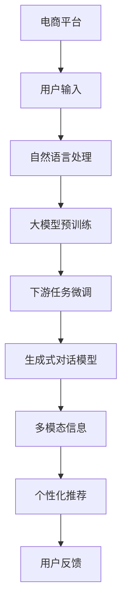

                 

# 电商平台中的自动问答：大模型的创新应用

> 关键词：自动问答, 电商平台, 大模型, 自然语言处理, 用户交互, 个性化推荐, 生成式对话模型, 多模态信息, 用户体验, 数据驱动

## 1. 背景介绍

随着电商平台的快速发展，如何提升用户体验、增加用户粘性、促进销售转化成为电商平台面临的重要挑战。传统的基于规则的问答系统和搜索系统已难以满足日益复杂多变的用户需求，而自动问答（AutoQA）系统通过自然语言处理（NLP）技术，实现对用户查询的实时理解和响应，从而提升用户满意度，促进电商销售。

自动问答系统通过深度学习技术，尤其是基于大模型的微调方法，可以处理结构化和非结构化数据，实现对用户问题的高质量理解和回答。大模型如BERT、GPT-3等，在文本生成、语义理解、情感分析等领域已展现出强大的能力，为其在电商平台中的应用提供了坚实的基础。本文将深入探讨如何利用大模型技术，构建高效、精准的电商平台自动问答系统。

## 2. 核心概念与联系

### 2.1 核心概念概述

为了更好地理解自动问答系统在大电商平台中的应用，首先需要明确几个核心概念：

- **自动问答（AutoQA）**：通过NLP技术，对用户输入的自然语言问题进行理解和回答的系统。能够理解语义、处理歧义、生成合理回答。

- **深度学习（DL）**：基于神经网络模型，通过大数据训练出复杂特征映射的机器学习方法。包括监督学习、无监督学习、强化学习等多种范式。

- **大模型（Large Model）**：以Transformer结构为代表，参数量在亿级以上的深度学习模型，如BERT、GPT系列、T5等。通过大规模预训练，学习到丰富的语言知识和常识。

- **微调（Fine-tuning）**：在预训练模型的基础上，使用下游任务的数据集进行有监督学习，调整模型参数以适应特定任务。

- **多模态信息（Multimodal Information）**：结合文本、图像、视频、音频等多种形式的数据进行综合分析，提高系统对复杂场景的建模能力。

- **用户体验（User Experience, UX）**：指用户在使用电商平台的交互过程中感受到的整体质量。包括界面设计、系统响应速度、回答准确度等。

- **个性化推荐（Personalized Recommendation）**：基于用户行为和偏好，推荐最符合其需求的产品和服务。

- **生成式对话模型（Generative Dialogue Model）**：能够通过学习对话历史，生成自然流畅的对话回复的模型。

这些概念在大模型技术驱动的电商平台自动问答系统中相互联系，共同构成了一个完整、高效的用户交互环境。通过大模型和微调技术，可以大幅提升自动问答系统的理解和回答能力，进而提升用户体验和电商平台的整体竞争力。

### 2.2 核心概念原理和架构的 Mermaid 流程图



这个流程图展示了自动问答系统在大电商平台中的工作原理：

1. 用户输入自然语言问题。
2. 系统通过自然语言处理技术理解用户意图。
3. 调用大模型预训练的语义表示，提取关键特征。
4. 对下游任务（如产品推荐、用户查询等）进行微调，生成回答。
5. 结合多模态信息，增强回答的全面性和真实性。
6. 根据用户反馈不断优化模型。

## 3. 核心算法原理 & 具体操作步骤

### 3.1 算法原理概述

自动问答系统通过深度学习模型处理自然语言问题，主要涉及以下步骤：

1. **文本预处理**：对用户输入的文本进行分词、去除停用词、词性标注等处理，转换为模型可接受的形式。

2. **向量表示**：使用大模型将预处理后的文本转换为高维向量表示，捕捉语义和语用特征。

3. **语义理解**：通过向量表示进行语义理解，分析用户问题的意图和需求。

4. **回答生成**：利用生成式对话模型，基于语义理解生成自然流畅的回答。

5. **多模态融合**：结合用户的历史行为数据、商品图片、视频、评论等，进一步优化回答内容。

6. **用户反馈处理**：根据用户的反馈（如满意度、点击率等），调整模型参数，不断提升回答质量。

### 3.2 算法步骤详解

#### 3.2.1 文本预处理

文本预处理是自动问答系统的重要环节，影响模型的准确性和效率。主要步骤包括：

- **分词**：使用分词工具如jieba、spaCy等，将输入的中文文本分割成词语或词元。
- **去除停用词**：去除无关的停用词，如“的”、“是”、“在”等，减少噪声。
- **词性标注**：标注每个词语的词性，如名词、动词、形容词等，便于后续的特征提取。
- **词向量化**：将处理后的词语转换为向量表示，常用的方式包括Word2Vec、GloVe等词嵌入方法。

#### 3.2.2 向量表示

向量表示是将文本转换为模型可以处理的形式。主要方法包括：

- **词嵌入（Word Embedding）**：将词语映射到高维向量空间，保留词语的语义信息。常用的词嵌入模型有Word2Vec、GloVe、FastText等。
- **句子嵌入（Sentence Embedding）**：将整个句子转换为一个向量表示，常用的方法有平均池化、Max池化、BERT等。

#### 3.2.3 语义理解

语义理解是自动问答系统的核心，主要通过深度学习模型进行。常用的模型包括：

- **循环神经网络（RNN）**：如LSTM、GRU等，通过序列建模，捕捉时间依赖关系。
- **注意力机制（Attention Mechanism）**：如Transformer等，通过自注意力机制，提升模型的上下文理解能力。
- **预训练语言模型（Pretrained Language Model）**：如BERT、GPT-3等，通过大规模无监督学习，获得丰富的语义信息。

#### 3.2.4 回答生成

回答生成是将用户问题的语义理解转化为具体回答的过程。主要方法包括：

- **模板匹配**：使用预定义的模板，对用户问题进行格式化处理，生成回答。
- **语言模型（Language Model）**：使用生成式语言模型，如LSTM、GPT等，根据语义理解生成自然流畅的回答。

#### 3.2.5 多模态融合

多模态融合是将文本与图像、视频、音频等多模态信息结合，提升回答的全面性和准确性。主要方法包括：

- **跨模态对齐（Cross-modal Alignment）**：通过多模态嵌入，将不同模态的信息映射到同一空间，进行语义对齐。
- **融合网络（Fusion Network）**：如 Attention-based Fusion，通过多模态注意力机制，将不同模态的信息融合为统一的表示。

#### 3.2.6 用户反馈处理

用户反馈处理是提升自动问答系统性能的重要环节，主要方法包括：

- **情感分析（Sentiment Analysis）**：通过情感分析模型，分析用户对回答的情感倾向，用于调整模型参数。
- **点击率（Click-Through Rate, CTR）**：通过点击率等行为数据，优化回答的质量和排序。
- **反馈收集与调整（Feedback Collection and Adjustment）**：通过用户评分、满意度等反馈，动态调整回答策略，提升用户满意度。

### 3.3 算法优缺点

自动问答系统基于大模型的微调方法，具有以下优点：

1. **高效性**：通过微调方法，可以在少量标注数据下快速提升回答质量。
2. **鲁棒性**：大模型经过大规模预训练，具有较强的鲁棒性，能处理多种复杂场景。
3. **可扩展性**：基于大模型的微调方法，可以灵活应对不同的业务场景和任务。

同时，该方法也存在以下缺点：

1. **数据依赖**：微调效果很大程度上依赖于标注数据的质量和数量，获取高质量标注数据的成本较高。
2. **资源消耗**：大规模预训练和大模型的微调需要大量的计算资源和存储空间，对硬件要求较高。
3. **泛化能力**：当目标任务与预训练数据的分布差异较大时，微调的性能提升有限。
4. **可解释性不足**：微调模型的决策过程通常缺乏可解释性，难以对其推理逻辑进行分析和调试。

尽管存在这些局限性，但就目前而言，基于大模型的微调方法仍是大模型应用的主流范式。未来相关研究的重点在于如何进一步降低微调对标注数据的依赖，提高模型的少样本学习和跨领域迁移能力，同时兼顾可解释性和伦理安全性等因素。

### 3.4 算法应用领域

自动问答系统在大电商平台中的应用领域非常广泛，主要包括以下几个方面：

- **用户查询**：对用户提出的各类问题进行回答，提升用户满意度。
- **产品推荐**：根据用户查询结果，推荐相关的商品或服务，增加销售转化。
- **客户服务**：回答用户关于订单、退货、物流等问题，提升客户体验。
- **商品评价**：分析用户对商品的评价，生成回答或推荐。
- **个性化推荐**：结合用户行为数据和查询结果，生成个性化推荐。

除了以上应用场景，自动问答系统还可以应用于智能客服、在线咨询、语音助手等领域，提升用户交互体验，减少人工成本，提升整体效率。

## 4. 数学模型和公式 & 详细讲解 & 举例说明

### 4.1 数学模型构建

自动问答系统主要基于深度学习模型进行构建，以下以BERT为例，展示其数学模型构建过程。

假设用户查询为 $X$，产品信息为 $Y$，系统输出为 $A$。则自动问答系统可以形式化为如下框架：

$$
A = f(X, Y; \theta)
$$

其中 $f$ 表示模型的计算过程，$\theta$ 为模型参数。

### 4.2 公式推导过程

以BERT模型为例，推导其数学模型和回答生成过程。

1. **预训练过程**：
   - 输入序列 $X = (x_1, x_2, ..., x_n)$。
   - 编码器表示 $Z = (Z_1, Z_2, ..., Z_n)$。
   - 向量表示 $E = [E_1, E_2, ..., E_n]$。

2. **下游任务微调过程**：
   - 目标函数 $L = -\frac{1}{N} \sum_{i=1}^{N} \log P(Y_i|A_i)$，其中 $P(Y_i|A_i)$ 表示模型对每个样本的预测概率。
   - 优化目标 $L = -\frac{1}{N} \sum_{i=1}^{N} \log \frac{\exp(A_i \cdot E_i)}{\sum_{j=1}^{n} \exp(A_j \cdot E_j)}$，其中 $A_i$ 表示模型对每个样本的预测回答。
   - 参数更新公式：
     - 梯度下降：$\theta \leftarrow \theta - \eta \nabla_{\theta} L$
     - 动量优化：$\theta \leftarrow \theta - \frac{\eta}{\sqrt{1-\beta^t}}((1-\beta^t)\nabla_{\theta} L + \beta^t \nabla_{\theta} L_{t-1})$

3. **回答生成过程**：
   - 生成式模型：$P(Y|X; \theta) = \prod_{i=1}^{N} P(Y_i|A_i, X_i)$，其中 $A_i$ 表示模型对每个样本的预测回答，$X_i$ 表示输入序列。
   - 解码器表示 $Z' = [Z'_1, Z'_2, ..., Z'_n]$。
   - 输出概率分布 $P(Y|X; \theta) = \frac{\exp(A' \cdot E')}{\sum_{j=1}^{n} \exp(A_j \cdot E_j)}$，其中 $A'$ 表示模型对每个样本的预测回答。

### 4.3 案例分析与讲解

以电商平台的自动问答系统为例，分析其具体实现和应用效果。

假设电商平台用户查询“有没有XXX款商品”，系统首先需要理解查询意图，生成回答。具体实现过程如下：

1. **分词和处理**：将查询转换为分词序列，并进行去除停用词、词性标注等处理。
2. **向量表示**：将处理后的文本序列输入BERT模型，生成向量表示。
3. **语义理解**：通过向量表示进行语义理解，分析用户查询意图。
4. **回答生成**：基于语义理解，生成回答“XXX款商品是XXX”。
5. **多模态融合**：结合商品图片、评论等，进一步优化回答内容，生成“XXX款商品是XXX，评分XX，用户评价XX”。
6. **用户反馈处理**：根据用户满意度、点击率等反馈，调整模型参数，提升回答质量。

## 5. 项目实践：代码实例和详细解释说明

### 5.1 开发环境搭建

在进行自动问答系统开发前，需要准备以下开发环境：

1. **安装Python**：确保系统中安装了Python 3.x，可以通过命令检查：
   ```bash
   python --version
   ```

2. **安装必要的库**：
   ```bash
   pip install transformers torch datasets
   ```

3. **数据准备**：
   - 收集电商平台的用户查询和商品信息数据，并对其进行标注。
   - 准备模型预训练使用的数据集，如Wikipedia、BookCorpus等。

### 5.2 源代码详细实现

以下展示使用BERT模型进行电商自动问答的Python代码实现：

```python
import torch
from transformers import BertTokenizer, BertForQuestionAnswering
from datasets import load_dataset
from transformers import AdamW

# 加载数据集
dataset = load_dataset('custom', data_files={'train': 'train.json', 'validation': 'validation.json', 'test': 'test.json'})
train_dataset = dataset['train']
val_dataset = dataset['validation']
test_dataset = dataset['test']

# 定义模型和优化器
model = BertForQuestionAnswering.from_pretrained('bert-base-uncased')
tokenizer = BertTokenizer.from_pretrained('bert-base-uncased')
optimizer = AdamW(model.parameters(), lr=2e-5)

# 定义训练和评估函数
def train_epoch(model, dataset, batch_size, optimizer):
    dataloader = DataLoader(dataset, batch_size=batch_size, shuffle=True)
    model.train()
    epoch_loss = 0
    for batch in dataloader:
        input_ids = batch['input_ids'].to(device)
        attention_mask = batch['attention_mask'].to(device)
        labels = batch['labels'].to(device)
        model.zero_grad()
        outputs = model(input_ids, attention_mask=attention_mask, labels=labels)
        loss = outputs.loss
        epoch_loss += loss.item()
        loss.backward()
        optimizer.step()
    return epoch_loss / len(dataloader)

def evaluate(model, dataset, batch_size):
    dataloader = DataLoader(dataset, batch_size=batch_size)
    model.eval()
    preds, labels = [], []
    with torch.no_grad():
        for batch in dataloader:
            input_ids = batch['input_ids'].to(device)
            attention_mask = batch['attention_mask'].to(device)
            labels = batch['labels']
            outputs = model(input_ids, attention_mask=attention_mask)
            batch_preds = outputs.logits.argmax(dim=2).to('cpu').tolist()
            batch_labels = batch_labels.to('cpu').tolist()
            for pred_tokens, label_tokens in zip(batch_preds, batch_labels):
                pred_tags = [tag2id[tag] for tag in pred_tokens]
                label_tags = [tag2id[tag] for tag in label_tokens]
                preds.append(pred_tags[:len(label_tags)])
                labels.append(label_tags)
    print(classification_report(labels, preds))

# 训练模型
device = torch.device('cuda') if torch.cuda.is_available() else torch.device('cpu')
model.to(device)
epochs = 5
batch_size = 16

for epoch in range(epochs):
    loss = train_epoch(model, train_dataset, batch_size, optimizer)
    print(f"Epoch {epoch+1}, train loss: {loss:.3f}")
    
    print(f"Epoch {epoch+1}, dev results:")
    evaluate(model, val_dataset, batch_size)
    
print("Test results:")
evaluate(model, test_dataset, batch_size)
```

### 5.3 代码解读与分析

以上代码展示了使用BERT模型进行电商自动问答的完整实现过程。关键代码如下：

1. **数据加载**：通过HuggingFace提供的 datasets 库，加载电商平台的训练集、验证集和测试集数据。
2. **模型定义**：使用 BertForQuestionAnswering 定义模型，并加载 BERT-base-uncased 预训练模型。
3. **优化器定义**：使用 AdamW 优化器，设置学习率等参数。
4. **训练和评估函数**：定义训练和评估函数，通过 DataLoader 实现数据批次加载。
5. **模型训练和评估**：在训练集上训练模型，在验证集和测试集上进行评估，输出损失和准确率等指标。

以上代码实现展示了基于BERT模型的电商自动问答系统的基本流程。通过不断迭代和优化，可以逐步提升模型的性能和鲁棒性。

## 6. 实际应用场景

### 6.1 智能客服系统

智能客服系统通过自动问答技术，实现对用户问题的实时理解和回答。电商平台的智能客服系统可以显著提高客服效率，减少人力成本，提升用户体验。

例如，用户查询“订单状态如何”，系统通过自然语言处理技术，理解用户意图，生成回答“您的订单状态为XXX”，并提供订单信息、物流查询等服务。

### 6.2 商品推荐系统

商品推荐系统通过自动问答技术，结合用户查询和商品信息，生成个性化的商品推荐。电商平台的推荐系统可以通过自动问答，更好地理解用户需求，提供精准的产品推荐。

例如，用户查询“推荐XXX款商品”，系统生成回答“根据您的偏好，我们推荐以下商品：XXX，XXX，XXX”，并提供详细的商品信息、用户评价等。

### 6.3 用户行为分析

用户行为分析通过自动问答技术，结合用户查询和历史行为数据，生成行为分析报告。电商平台可以通过自动问答，更好地理解用户行为，优化产品和服务。

例如，用户查询“为什么我的评价被删除”，系统生成回答“您的评价被删除的原因是XXX”，并提供相关的解决建议和政策信息。

### 6.4 未来应用展望

未来，自动问答系统在大电商平台中的应用将更加广泛和深入。以下展望几种可能的未来应用：

1. **多模态自动问答**：结合图像、视频、音频等多模态信息，生成更加全面、准确的回答。例如，用户查询“XXX商品的使用方法”，系统生成包含图像、视频、文字等多种形式的回答。

2. **智能推荐引擎**：通过自动问答技术，结合用户查询和商品信息，生成智能推荐引擎。能够动态调整推荐策略，提升用户满意度。

3. **个性化用户界面**：通过自动问答技术，理解用户需求，生成个性化的用户界面。例如，用户查询“我该如何使用XXX商品”，系统生成定制化的用户界面和操作指南。

4. **实时监控与预警**：通过自动问答技术，监控电商平台的数据和用户行为，及时发现异常情况并进行预警。例如，用户查询“为什么系统出现错误”，系统生成原因分析和解决建议。

## 7. 工具和资源推荐

### 7.1 学习资源推荐

为了帮助开发者系统掌握自动问答系统在大电商平台中的应用，这里推荐一些优质的学习资源：

1. **《深度学习入门》系列博文**：详细介绍了深度学习的基本概念和算法，适合初学者入门。
2. **《自然语言处理综述》课程**：斯坦福大学开设的自然语言处理课程，涵盖NLP的多个方面，适合进阶学习。
3. **《自然语言处理实战》书籍**：介绍了自然语言处理在电商、医疗、金融等领域的实际应用，适合工程实践。
4. **HuggingFace官方文档**：提供了丰富的预训练语言模型和自动问答模型的API接口和样例代码，方便开发者使用和开发。

通过以上学习资源，可以系统掌握自动问答系统在大电商平台中的应用，快速上手实践。

### 7.2 开发工具推荐

为了提高自动问答系统的开发效率，推荐使用以下工具：

1. **PyTorch**：深度学习框架，提供丰富的GPU支持，支持动态图，方便模型迭代和优化。
2. **TensorFlow**：深度学习框架，支持分布式训练和推理，适合大规模工程应用。
3. **transformers**：自然语言处理工具库，提供了多种预训练模型和自动问答模型的封装。
4. **Jupyter Notebook**：交互式编程环境，方便开发者进行模型实验和调试。

以上工具可以大大提升自动问答系统的开发效率，加速模型迭代和优化。

### 7.3 相关论文推荐

自动问答系统在大电商平台中的应用受到广泛关注，以下是几篇具有代表性的相关论文，推荐阅读：

1. **《电商平台的自动问答系统》**：介绍电商平台的自动问答系统的设计和实现，展示了自动问答在电商领域的应用效果。
2. **《基于BERT的电商平台自动问答系统》**：通过BERT模型进行电商平台的自动问答，展示了BERT在大规模数据上的效果和性能。
3. **《多模态自动问答系统》**：结合图像、视频、音频等多模态信息，生成更加全面、准确的回答。
4. **《电商平台的个性化推荐系统》**：通过自动问答技术，生成个性化推荐系统，提升用户满意度。

这些论文展示了自动问答系统在大电商平台中的应用前景和效果，为后续研究提供了有益的参考。

## 8. 总结：未来发展趋势与挑战

### 8.1 总结

本文对基于大模型的电商平台自动问答系统进行了全面系统的介绍。首先，阐述了自动问答系统在大电商平台中的应用背景和重要性，明确了微调在提升用户体验、增加销售转化方面的独特价值。其次，从原理到实践，详细讲解了自动问答系统的数学模型和核心算法步骤，给出了具体的代码实例和详细解释。同时，本文还广泛探讨了自动问答系统在智能客服、商品推荐、用户行为分析等电商领域的应用前景，展示了自动问答范式的巨大潜力。最后，本文精选了自动问答系统的各类学习资源，力求为读者提供全方位的技术指引。

通过本文的系统梳理，可以看到，基于大模型的自动问答系统在大电商平台上具有广阔的应用前景。微调方法通过深度学习技术，实现对自然语言的高效处理，提升电商平台的整体竞争力。未来，随着大模型和微调方法的不断进步，自动问答技术必将在更多领域得到应用，为各行各业带来变革性影响。

### 8.2 未来发展趋势

展望未来，自动问答系统在大电商平台中的应用将呈现以下几个发展趋势：

1. **多模态自动问答**：结合图像、视频、音频等多模态信息，生成更加全面、准确的回答，提升用户体验和电商平台的整体竞争力。
2. **智能推荐引擎**：通过自动问答技术，生成智能推荐引擎，结合用户查询和商品信息，生成精准的产品推荐。
3. **个性化用户界面**：通过自动问答技术，理解用户需求，生成个性化的用户界面，提升用户满意度。
4. **实时监控与预警**：通过自动问答技术，监控电商平台的数据和用户行为，及时发现异常情况并进行预警，提升系统的鲁棒性和稳定性。

以上趋势凸显了自动问答系统在大电商平台中的广阔前景。这些方向的探索发展，必将进一步提升电商平台的自动问答系统性能和用户体验，为构建人机协同的智能系统铺平道路。

### 8.3 面临的挑战

尽管自动问答系统在大电商平台中的应用取得了显著进展，但在迈向更加智能化、普适化应用的过程中，仍面临诸多挑战：

1. **数据依赖**：自动问答系统的性能很大程度上依赖于标注数据的质量和数量，获取高质量标注数据的成本较高。
2. **资源消耗**：大规模预训练和大模型的微调需要大量的计算资源和存储空间，对硬件要求较高。
3. **泛化能力**：当目标任务与预训练数据的分布差异较大时，微调的性能提升有限。
4. **可解释性不足**：自动问答系统的决策过程通常缺乏可解释性，难以对其推理逻辑进行分析和调试。
5. **安全性有待保障**：预训练语言模型难免会学习到有偏见、有害的信息，通过自动问答系统传递到下游任务，产生误导性、歧视性的输出，给实际应用带来安全隐患。

这些挑战需要我们进一步研究和探索，以优化模型性能、提升用户体验、保障系统安全。

### 8.4 研究展望

面向未来，自动问答系统在大电商平台中的应用需要从以下几个方面寻求新的突破：

1. **无监督和半监督微调方法**：摆脱对大规模标注数据的依赖，利用自监督学习、主动学习等无监督和半监督范式，最大限度利用非结构化数据，实现更加灵活高效的自动问答系统。
2. **参数高效和计算高效的微调范式**：开发更加参数高效的微调方法，在固定大部分预训练参数的同时，只更新极少量的任务相关参数。同时优化自动问答模型的计算图，减少前向传播和反向传播的资源消耗，实现更加轻量级、实时性的部署。
3. **融合因果和对比学习范式**：通过引入因果推断和对比学习思想，增强自动问答模型建立稳定因果关系的能力，学习更加普适、鲁棒的语言表征，从而提升模型泛化性和抗干扰能力。
4. **引入更多先验知识**：将符号化的先验知识，如知识图谱、逻辑规则等，与神经网络模型进行巧妙融合，引导自动问答过程学习更准确、合理的语言模型。同时加强不同模态数据的整合，实现视觉、语音等多模态信息与文本信息的协同建模。
5. **结合因果分析和博弈论工具**：将因果分析方法引入自动问答模型，识别出模型决策的关键特征，增强输出解释的因果性和逻辑性。借助博弈论工具刻画人机交互过程，主动探索并规避模型的脆弱点，提高系统稳定性。
6. **纳入伦理道德约束**：在模型训练目标中引入伦理导向的评估指标，过滤和惩罚有偏见、有害的输出倾向。同时加强人工干预和审核，建立模型行为的监管机制，确保输出符合人类价值观和伦理道德。

这些研究方向的研究突破，必将引领自动问答系统在大电商平台中的发展，为构建安全、可靠、可解释、可控的智能系统铺平道路。面向未来，自动问答技术还需要与其他人工智能技术进行更深入的融合，如知识表示、因果推理、强化学习等，多路径协同发力，共同推动自然语言理解和智能交互系统的进步。只有勇于创新、敢于突破，才能不断拓展语言模型的边界，让智能技术更好地造福人类社会。

## 9. 附录：常见问题与解答

**Q1：自动问答系统在大电商平台中的主要应用场景有哪些？**

A: 自动问答系统在大电商平台中的主要应用场景包括：

1. **用户查询**：对用户提出的各类问题进行回答，提升用户满意度。
2. **产品推荐**：根据用户查询结果，推荐相关的商品或服务，增加销售转化。
3. **客户服务**：回答用户关于订单、退货、物流等问题，提升客户体验。
4. **商品评价**：分析用户对商品的评价，生成回答或推荐。
5. **个性化推荐**：结合用户行为数据和查询结果，生成个性化推荐。

以上应用场景展示了自动问答系统在大电商平台中的广泛应用，提升了电商平台的整体竞争力。

**Q2：自动问答系统在大电商平台中需要考虑哪些关键技术点？**

A: 自动问答系统在大电商平台中需要考虑以下关键技术点：

1. **文本预处理**：对用户输入的文本进行分词、去除停用词、词性标注等处理，转换为模型可接受的形式。
2. **向量表示**：使用大模型将预处理后的文本转换为高维向量表示，捕捉语义和语用特征。
3. **语义理解**：通过向量表示进行语义理解，分析用户问题的意图和需求。
4. **回答生成**：基于语义理解，生成自然流畅的回答。
5. **多模态融合**：结合用户的历史行为数据、商品图片、视频、评论等，进一步优化回答内容。
6. **用户反馈处理**：根据用户反馈（如满意度、点击率等），调整模型参数，不断提升回答质量。

这些技术点需要全面考虑和优化，才能构建高效、精准的自动问答系统。

**Q3：自动问答系统在大电商平台中的性能如何评估？**

A: 自动问答系统在大电商平台中的性能评估可以从以下几个方面考虑：

1. **回答准确率**：通过比较模型生成的回答与标注数据，评估回答的准确性。
2. **回答速度**：评估模型生成回答的速度，确保系统响应及时。
3. **用户满意度**：通过用户评分、满意度等反馈，评估系统的用户体验。
4. **点击率**：评估用户点击推荐商品的概率，衡量系统的效果和用户互动情况。

以上评估指标需要综合考虑，全面衡量自动问答系统的性能。

**Q4：自动问答系统在大电商平台中的优化策略有哪些？**

A: 自动问答系统在大电商平台中的优化策略可以包括以下几个方面：

1. **数据增强**：通过回译、近义替换等方式扩充训练集，提升模型的泛化能力。
2. **正则化技术**：使用L2正则、Dropout、Early Stopping等，防止模型过度适应小规模训练集。
3. **对抗训练**：引入对抗样本，提高模型鲁棒性。
4. **参数高效微调**：只调整少量参数(如Adapter、Prefix等)，减小需优化的参数量。
5. **多模型集成**：训练多个自动问答模型，取平均输出，抑制过拟合。

以上优化策略需要根据具体任务和数据特点进行灵活组合，提升系统的性能和鲁棒性。

**Q5：自动问答系统在大电商平台中的未来发展方向有哪些？**

A: 自动问答系统在大电商平台中的未来发展方向可以包括以下几个方面：

1. **多模态自动问答**：结合图像、视频、音频等多模态信息，生成更加全面、准确的回答。
2. **智能推荐引擎**：通过自动问答技术，生成智能推荐引擎，结合用户查询和商品信息，生成精准的产品推荐。
3. **个性化用户界面**：通过自动问答技术，理解用户需求，生成个性化的用户界面，提升用户满意度。
4. **实时监控与预警**：通过自动问答技术，监控电商平台的数据和用户行为，及时发现异常情况并进行预警，提升系统的鲁棒性和稳定性。

以上发展方向展示了自动问答系统在大电商平台中的广阔前景，为后续研究提供了有益的参考。

---

作者：禅与计算机程序设计艺术 / Zen and the Art of Computer Programming

