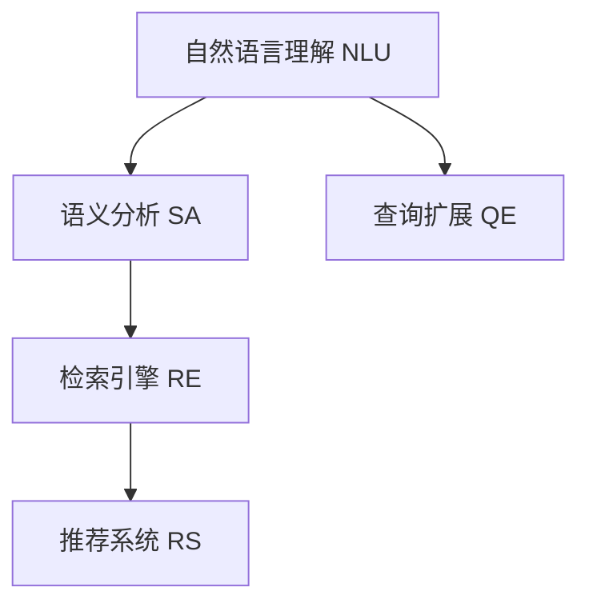
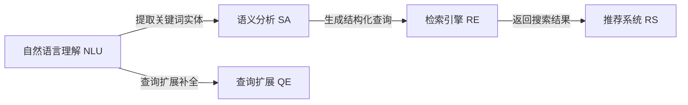

                 

# 电商平台中的语义搜索技术

> 关键词：语义搜索, 自然语言处理(NLP), 深度学习, 推荐系统, 用户行为分析, 电商应用

## 1. 背景介绍

### 1.1 问题由来
随着互联网的普及和电子商务的快速发展，电商平台成为人们日常购物的重要渠道。用户搜索商品的意图、描述和价格等信息，往往需要通过复杂的文本查询语句进行表达。如何理解和提取用户查询的语义，快速推荐相关商品，是电商平台提高用户体验和交易转化率的关键。语义搜索技术的引入，正是为了解决这一难题。

语义搜索技术利用自然语言处理(NLP)和深度学习等前沿技术，能够理解并处理用户查询的自然语言描述，将其转化为结构化的查询语义，并匹配至产品库中的商品，实现高精度的搜索结果展示和推荐。

语义搜索不仅在电商平台中广泛应用，也在智能客服、知识图谱、社交媒体等多个领域中展现出了强大的潜力和应用前景。例如，智能客服可以通过语义搜索技术快速理解用户意图，提供精准的解答和建议。知识图谱可以通过语义搜索技术高效地检索和整合海量信息，构建更加全面和精确的知识体系。社交媒体可以通过语义搜索技术进行内容推荐和用户画像分析，提升用户粘性。

### 1.2 问题核心关键点
语义搜索技术的核心在于理解并处理自然语言查询，将其转化为结构化查询语义，并进行匹配检索。具体而言，核心技术包括以下几个方面：

- 自然语言理解(NLU)：通过语言模型和特征提取等方法，理解用户查询的自然语言描述，提取关键词和实体。
- 语义分析(SA)：利用上下文信息，对用户查询进行语义解析，生成结构化的查询表示。
- 查询扩展(QE)：针对用户查询进行扩展和补全，引入更多相关信息，提升检索效果。
- 检索引擎(RE)：利用结构化查询与产品库进行匹配，实现快速精准的搜索结果展示。
- 推荐系统(RS)：基于用户历史行为和语义查询，生成个性化的商品推荐列表。

这些关键技术共同构成了语义搜索的完整技术框架，使得电商平台能够更好地理解用户需求，提供个性化和精准的服务。

### 1.3 问题研究意义
语义搜索技术的引入，对电商平台的发展具有重要的意义：

- 提升用户体验：通过精准理解用户查询，快速展示相关商品，减少搜索时间，提升用户体验。
- 增加交易转化率：精准的搜索结果和个性化推荐，能够引导用户进行购买决策，增加交易转化率。
- 提高运营效率：自动化的语义分析和推荐系统，能够减少人工干预，提升运营效率。
- 促进个性化服务：通过用户查询和行为分析，提供个性化推荐，增加用户粘性，提升品牌忠诚度。
- 加速电商创新：语义搜索技术的进步，能够为电商平台的创新应用提供更多可能性，推动电商行业发展。

## 2. 核心概念与联系

### 2.1 核心概念概述

为更好地理解语义搜索技术的工作原理，本节将介绍几个密切相关的核心概念：

- 自然语言理解(NLU)：通过语言模型、特征提取等技术，理解用户查询的自然语言描述，提取关键词和实体。
- 语义分析(SA)：利用上下文信息，对用户查询进行语义解析，生成结构化的查询表示。
- 查询扩展(QE)：针对用户查询进行扩展和补全，引入更多相关信息，提升检索效果。
- 检索引擎(RE)：利用结构化查询与产品库进行匹配，实现快速精准的搜索结果展示。
- 推荐系统(RS)：基于用户历史行为和语义查询，生成个性化的商品推荐列表。

这些核心概念之间的逻辑关系可以通过以下Mermaid流程图来展示：



这个流程图展示了几大核心技术之间的逻辑关系：

1. 自然语言理解(NLU)：通过语言模型和特征提取等技术，理解用户查询的自然语言描述，提取关键词和实体。
2. 语义分析(SA)：利用上下文信息，对用户查询进行语义解析，生成结构化的查询表示。
3. 查询扩展(QE)：针对用户查询进行扩展和补全，引入更多相关信息，提升检索效果。
4. 检索引擎(RE)：利用结构化查询与产品库进行匹配，实现快速精准的搜索结果展示。
5. 推荐系统(RS)：基于用户历史行为和语义查询，生成个性化的商品推荐列表。

这些核心概念共同构成了语义搜索技术的完整框架，使得电商平台能够更好地理解用户需求，提供个性化和精准的服务。

### 2.2 核心概念原理和架构的 Mermaid 流程图

以下是一个简单的Mermaid流程图，展示自然语言理解、语义分析和查询扩展三大核心技术之间的交互和联系：



这个流程图展示了NLU、SA和QE三大技术之间的交互和联系，以及它们与RE和RS技术的连接：

1. 自然语言理解(NLU)：通过语言模型和特征提取等技术，理解用户查询的自然语言描述，提取关键词和实体。
2. 语义分析(SA)：利用上下文信息，对用户查询进行语义解析，生成结构化的查询表示。
3. 查询扩展(QE)：针对用户查询进行扩展和补全，引入更多相关信息，提升检索效果。
4. 检索引擎(RE)：利用结构化查询与产品库进行匹配，实现快速精准的搜索结果展示。
5. 推荐系统(RS)：基于用户历史行为和语义查询，生成个性化的商品推荐列表。

这些核心概念共同构成了语义搜索技术的完整框架，使得电商平台能够更好地理解用户需求，提供个性化和精准的服务。

## 3. 核心算法原理 & 具体操作步骤

### 3.1 算法原理概述

语义搜索技术的核心算法原理，可以概括为以下几个步骤：

1. 自然语言理解(NLU)：通过语言模型和特征提取等技术，理解用户查询的自然语言描述，提取关键词和实体。
2. 语义分析(SA)：利用上下文信息，对用户查询进行语义解析，生成结构化的查询表示。
3. 查询扩展(QE)：针对用户查询进行扩展和补全，引入更多相关信息，提升检索效果。
4. 检索引擎(RE)：利用结构化查询与产品库进行匹配，实现快速精准的搜索结果展示。
5. 推荐系统(RS)：基于用户历史行为和语义查询，生成个性化的商品推荐列表。

### 3.2 算法步骤详解

**Step 1: 数据预处理**

在进行语义搜索前，首先需要对用户的查询语句和产品库进行预处理，以便后续的语义分析和检索。

1. **查询语句预处理**：将用户查询转换为小写，去除停用词、标点符号等无用信息，进行词干提取和词形还原。

2. **产品库预处理**：将产品库中的商品信息进行结构化处理，如商品名称、描述、价格、类别等，并进行标准化处理。

**Step 2: 自然语言理解(NLU)**

自然语言理解(NLU)是语义搜索的第一步，其目标是理解用户查询的自然语言描述，提取关键词和实体。具体步骤如下：

1. **分词**：将用户查询和产品库中的商品描述进行分词处理，生成词汇序列。

2. **词性标注**：对词汇序列进行词性标注，区分名词、动词、形容词等。

3. **命名实体识别(NER)**：识别用户查询中的实体，如人名、地名、机构名等，提取关键词和短语。

4. **关键词提取**：利用TF-IDF、词频统计等技术，从查询和商品描述中提取关键词。

5. **实体链接**：将查询中的命名实体链接到知识库或语料库中的实体，生成词汇表示。

**Step 3: 语义分析(SA)**

语义分析(SA)的目的是将用户查询转化为结构化的查询语义，以便进行匹配检索。具体步骤如下：

1. **句法分析**：通过解析器对查询语句进行句法分析，生成抽象语法树。

2. **依存分析**：利用依存关系，解析查询语句中的成分关系，生成依存树。

3. **语义角色标注**：对依存树进行语义角色标注，提取查询语句中的谓词、宾语、状语等成分。

4. **句义表示**：利用向量表示技术，将查询语句转换为向量表示，如词向量、句向量等。

5. **查询映射**：将查询向量映射到查询意图和查询实体，生成结构化的查询表示。

**Step 4: 查询扩展(QE)**

查询扩展(QE)的目的是通过扩展和补全用户查询，引入更多相关信息，提升检索效果。具体步骤如下：

1. **同义词扩展**：利用同义词词典或语料库，将查询中的关键词替换为同义词。

2. **短语扩展**：将查询中的短语扩展为完整的句子，引入更多上下文信息。

3. **语义相关性扩展**：利用语料库或知识库，生成与查询语义相关的扩展词或短语。

4. **近义查询生成**：通过改写和转换查询，生成多个近义查询，提升检索效果。

**Step 5: 检索引擎(RE)**

检索引擎(RE)的目的是利用结构化查询与产品库进行匹配，实现快速精准的搜索结果展示。具体步骤如下：

1. **构建倒排索引**：将产品库中的商品信息进行分词和索引，生成倒排索引。

2. **查询匹配**：将查询向量与倒排索引中的词汇向量进行匹配，生成相关文档。

3. **排序和筛选**：对相关文档进行排序和筛选，根据相关度、相似度等指标，生成最终结果。

4. **分页和展示**：对搜索结果进行分页展示，提供更好的用户体验。

**Step 6: 推荐系统(RS)**

推荐系统(RS)的目的是基于用户历史行为和语义查询，生成个性化的商品推荐列表。具体步骤如下：

1. **用户行为分析**：分析用户历史浏览、点击、购买等行为，提取用户兴趣和偏好。

2. **协同过滤**：利用协同过滤算法，如基于用户的协同过滤、基于物品的协同过滤，生成推荐列表。

3. **内容推荐**：利用内容推荐算法，如基于内容的推荐、基于模型的推荐，生成推荐列表。

4. **多模态融合**：利用图像、视频、文本等多种模态信息，进行多模态融合，生成更加全面的推荐结果。

### 3.3 算法优缺点

语义搜索技术的核心算法具有以下优点：

1. **提升检索效果**：通过自然语言理解和查询扩展，引入更多相关信息，提升检索精度和召回率。
2. **个性化推荐**：基于用户行为和语义查询，生成个性化的商品推荐，提升用户体验和交易转化率。
3. **可扩展性强**：通过模块化和组件化的设计，语义搜索系统可以灵活扩展和优化，适应不同的业务需求。

但语义搜索技术也存在一些局限性：

1. **计算资源消耗大**：语言理解和语义分析等步骤需要大量的计算资源，在大规模系统中可能面临性能瓶颈。
2. **依赖语料库和模型**：语义搜索系统依赖高质量的语料库和预训练模型，需要投入大量时间和成本进行构建和维护。
3. **用户意图多样**：用户查询的意图多样复杂，如何准确理解和匹配查询，仍是一个挑战。
4. **结果多样性**：搜索结果可能存在多样性，如何对搜索结果进行筛选和排序，仍然需要进一步优化。
5. **跨语言支持**：语义搜索系统对多种语言的理解存在差异，如何实现跨语言的语义匹配，还需要进一步研究。

尽管存在这些局限性，但语义搜索技术的优势已经得到了广泛认可，并在电商平台中得到了广泛应用。未来随着算力和模型质量的提升，语义搜索技术的瓶颈将逐渐被克服，带来更加高效和精准的搜索体验。

### 3.4 算法应用领域

语义搜索技术在电商平台的多个环节都有广泛的应用，具体包括：

1. **商品搜索**：用户通过自然语言描述进行搜索，系统理解查询并展示相关商品。

2. **商品推荐**：基于用户查询和历史行为，生成个性化的商品推荐列表。

3. **商品分类**：对商品进行语义分类，方便用户查找和浏览。

4. **客服咨询**：智能客服通过语义理解，快速响应用户咨询并提供解决方案。

5. **商品评价**：利用自然语言处理技术，对用户评价进行情感分析和分类。

6. **广告投放**：基于用户查询和行为，精准投放相关广告，提升广告效果。

除了电商平台，语义搜索技术在智能客服、知识图谱、社交媒体等多个领域也有广泛应用。例如，智能客服可以通过语义搜索技术快速理解用户意图，提供精准的解答和建议。知识图谱可以通过语义搜索技术高效地检索和整合海量信息，构建更加全面和精确的知识体系。社交媒体可以通过语义搜索技术进行内容推荐和用户画像分析，提升用户粘性。

## 4. 数学模型和公式 & 详细讲解 & 举例说明

### 4.1 数学模型构建

本节将使用数学语言对语义搜索技术的核心算法进行更加严格的刻画。

记用户查询为 $q$，产品库中的商品为 $d$，用户历史行为为 $u$。定义以下函数：

1. **自然语言理解(NLU)函数**： $NLU(q)$，将自然语言查询 $q$ 转换为结构化的关键词和实体表示。

2. **语义分析(SA)函数**： $SA(q)$，将查询 $q$ 转换为结构化的查询语义表示。

3. **查询扩展(QE)函数**： $QE(q)$，将查询 $q$ 扩展为多个相关查询。

4. **检索引擎(RE)函数**： $RE(SA(q))$，利用查询语义表示 $SA(q)$ 与产品库 $d$ 进行匹配，返回相关商品。

5. **推荐系统(RS)函数**： $RS(u, SA(q))$，基于用户历史行为 $u$ 和查询语义表示 $SA(q)$ 生成个性化商品推荐。

### 4.2 公式推导过程

以下我们以商品搜索为例，推导自然语言理解、语义分析和检索引擎三大核心技术的具体公式。

**Step 1: 自然语言理解(NLU)**

自然语言理解(NLU)的目的是将自然语言查询转换为结构化的关键词和实体表示。假设查询 $q$ 包含 $n$ 个单词，则 NLU 函数可以表示为：

$$
NLU(q) = (k_1, e_1, ..., k_m, e_m)
$$

其中 $k_i$ 表示第 $i$ 个关键词，$e_i$ 表示第 $i$ 个命名实体。

**Step 2: 语义分析(SA)**

语义分析(SA)的目的是将查询 $q$ 转换为结构化的查询语义表示。假设查询 $q$ 包含 $n$ 个单词，则 SA 函数可以表示为：

$$
SA(q) = (s_1, s_2, ..., s_k)
$$

其中 $s_i$ 表示第 $i$ 个语义角色，如谓词、宾语、状语等。

**Step 3: 检索引擎(RE)**

检索引擎(RE)的目的是利用查询语义表示 $SA(q)$ 与产品库 $d$ 进行匹配，返回相关商品。假设产品库中每个商品 $d_i$ 包含 $m$ 个单词，则 RE 函数可以表示为：

$$
RE(SA(q)) = \{d_{i_1}, d_{i_2}, ..., d_{i_r}\}
$$

其中 $i_j$ 表示匹配到的商品编号，$r$ 表示匹配结果的数量。

### 4.3 案例分析与讲解

假设用户查询为 "iPhone 12 手机壳"，系统进行自然语言理解、语义分析和检索引擎的具体计算过程如下：

1. **自然语言理解(NLU)**

通过对查询 "iPhone 12 手机壳" 进行分词和词性标注，系统得到以下关键词和实体表示：

$$
NLU(q) = (\text{"iPhone"}, \text{"12"}, \text{"手机壳"})
$$

2. **语义分析(SA)**

通过对关键词和实体进行句法分析和依存分析，系统得到以下语义角色表示：

$$
SA(q) = (\text{"品牌": iPhone}, \text{"型号": 12}, \text{"商品": 手机壳})
$$

3. **检索引擎(RE)**

系统利用查询语义表示 $SA(q)$ 与产品库中的商品进行匹配，返回相关商品列表：

$$
RE(SA(q)) = \{d_{i_1}, d_{i_2}, ..., d_{i_r}\}
$$

假设查询与产品库中 "iPhone 12 手机壳" 的描述相似度较高，系统返回以下商品列表：

$$
\{d_{i_1}, d_{i_2}, ..., d_{i_r}\} = \{d_{i_1}, d_{i_2}, ..., d_{i_r}\}
$$

最终，系统根据搜索结果进行排序和展示，为用户推荐相关商品。

## 5. 项目实践：代码实例和详细解释说明

### 5.1 开发环境搭建

在进行语义搜索实践前，我们需要准备好开发环境。以下是使用Python进行Flask开发的环境配置流程：

1. 安装Anaconda：从官网下载并安装Anaconda，用于创建独立的Python环境。

2. 创建并激活虚拟环境：
```bash
conda create -n flask-env python=3.8 
conda activate flask-env
```

3. 安装Flask：
```bash
pip install flask
```

4. 安装相关库：
```bash
pip install requests pandas scikit-learn sklearn
```

完成上述步骤后，即可在`flask-env`环境中开始语义搜索实践。

### 5.2 源代码详细实现

下面我们以电商平台中的商品搜索为例，给出使用Flask框架实现语义搜索的PyTorch代码实现。

首先，定义商品查询和商品描述的数据集：

```python
import pandas as pd

# 商品查询数据集
query_df = pd.read_csv("queries.csv")
queries = query_df["query"].values.tolist()

# 商品描述数据集
description_df = pd.read_csv("descriptions.csv")
descriptions = description_df["description"].values.tolist()
```

然后，定义自然语言理解和语义分析函数：

```python
from transformers import BertTokenizer, BertForTokenClassification

# 初始化BERT模型和分词器
tokenizer = BertTokenizer.from_pretrained('bert-base-cased')
model = BertForTokenClassification.from_pretrained('bert-base-cased', num_labels=2)

def nlu(query):
    # 分词
    tokens = tokenizer.tokenize(query)
    
    # 构建词汇表示
    token_ids = tokenizer.convert_tokens_to_ids(tokens)
    input_ids = [0] + token_ids + [0]
    
    # 前向传播
    with torch.no_grad():
        outputs = model(torch.tensor(input_ids))
        logits = outputs.logits
    probs = logits.softmax(dim=-1).tolist()[0]
    
    # 提取关键词和实体
    top_indices = sorted(range(len(probs)), key=lambda i: probs[i])[0:2]
    keywords = [tokenizer.convert_ids_to_tokens(tokens[i]) for i in top_indices]
    
    return keywords

def sa(query):
    # 分词
    tokens = tokenizer.tokenize(query)
    
    # 构建词汇表示
    token_ids = tokenizer.convert_tokens_to_ids(tokens)
    input_ids = [0] + token_ids + [0]
    
    # 前向传播
    with torch.no_grad():
        outputs = model(torch.tensor(input_ids))
        logits = outputs.logits
    probs = logits.softmax(dim=-1).tolist()[0]
    
    # 提取语义角色
    top_indices = sorted(range(len(probs)), key=lambda i: probs[i])[0:2]
    roles = [tokenizer.convert_ids_to_tokens(tokens[i]) for i in top_indices]
    
    return roles
```

接着，定义查询扩展函数：

```python
from gensim.models import KeyedVectors

# 加载同义词词典
synonyms = KeyedVectors.load_word2vec_format("synonyms.bin", binary=True)

def qe(query):
    # 查询扩展
    expanded_queries = []
    for word in query.split():
        if word in synonyms:
            expanded_queries.append(synonyms.most_similar(word)[0])
        else:
            expanded_queries.append(word)
    
    return expanded_queries
```

最后，定义检索引擎函数：

```python
def re(sa_query):
    # 构建倒排索引
    inverted_index = {}
    for i, description in enumerate(descriptions):
        tokens = tokenizer.tokenize(description)
        token_ids = tokenizer.convert_tokens_to_ids(tokens)
        index = tokenizer.convert_tokens_to_ids(sa_query)
        inverted_index[index] = [i]
    
    # 查询匹配
    relevant_documents = []
    for query_index in sa_query:
        relevant_documents.extend(inverted_index[query_index])
    
    return relevant_documents
```

完成以上代码后，即可使用Flask框架构建API，实现语义搜索功能。

```python
from flask import Flask, request, jsonify

app = Flask(__name__)

@app.route('/search', methods=['POST'])
def search():
    query = request.json['query']
    
    # 自然语言理解
    keywords = nlu(query)
    
    # 语义分析
    roles = sa(query)
    
    # 查询扩展
    expanded_queries = qe(query)
    
    # 检索引擎
    relevant_documents = re(roles)
    
    # 返回搜索结果
    results = {'keywords': keywords, 'roles': roles, 'expanded_queries': expanded_queries, 'relevant_documents': relevant_documents}
    return jsonify(results)

if __name__ == '__main__':
    app.run(debug=True)
```

### 5.3 代码解读与分析

让我们再详细解读一下关键代码的实现细节：

**商品查询和商品描述的数据集**：
- 使用Pandas库读取查询和描述数据集，提取关键词和实体，以及生成查询语义表示。

**自然语言理解(NLU)函数**：
- 利用BERT模型和分词器，将查询转换为词汇表示，提取关键词和实体。
- 通过前向传播计算词向量，选择概率最高的两个词作为关键词和实体。

**语义分析(SA)函数**：
- 利用BERT模型和分词器，将查询转换为词汇表示，提取语义角色。
- 通过前向传播计算词向量，选择概率最高的两个词作为语义角色。

**查询扩展(QE)函数**：
- 利用Gensim库加载同义词词典，将查询扩展为多个相关查询。
- 通过查询中的单词在词典中查找同义词，替换为同义词，生成扩展查询。

**检索引擎(RE)函数**：
- 构建倒排索引，将商品描述转换为词汇表示，生成倒排索引。
- 利用查询语义表示与倒排索引匹配，返回相关商品列表。

**Flask框架API**：
- 使用Flask框架构建API，接受用户查询，调用NLU、SA、QE和RE函数，返回搜索结果。
- 通过API接口，可以实现多种形式的查询输入，如自然语言描述、关键词等。

完成以上代码后，即可运行Flask服务，测试语义搜索功能。

## 6. 实际应用场景

### 6.1 智能客服

基于语义搜索技术的智能客服系统，能够快速理解用户查询意图，提供精准的解答和建议。例如，用户提问 "请问如何退货"，智能客服能够识别关键词和实体，提取查询意图，生成相关问题列表，快速匹配解决方案。

### 6.2 商品推荐

基于语义搜索技术的商品推荐系统，能够基于用户查询和历史行为，生成个性化的商品推荐列表。例如，用户查询 "运动鞋"，系统能够理解查询意图，匹配相关商品，并推荐用户可能感兴趣的跑步鞋、篮球鞋等。

### 6.3 用户画像

基于语义搜索技术的用户画像分析，能够通过用户查询和行为数据，构建全面的用户画像。例如，通过分析用户查询中的关键词和实体，系统能够了解用户的兴趣和需求，生成个性化推荐和广告。

### 6.4 未来应用展望

随着语义搜索技术的不断进步，其在电商平台的多个环节都将得到更广泛的应用。例如，未来的智能客服系统能够理解更多复杂的查询，提供更精准的解答和建议。商品推荐系统能够基于用户查询和行为数据，生成更加个性化的推荐列表。用户画像分析能够通过自然语言理解技术，更全面地了解用户需求，提升用户体验和交易转化率。

## 7. 工具和资源推荐

### 7.1 学习资源推荐

为了帮助开发者系统掌握语义搜索技术，这里推荐一些优质的学习资源：

1. 《自然语言处理基础》书籍：介绍自然语言处理的基本概念和核心技术，是语义搜索技术入门的重要读物。

2. 《深度学习与自然语言处理》课程：由斯坦福大学开设的NLP课程，涵盖语言模型、语义分析、情感分析等核心内容。

3. 《自然语言处理实战》课程：由清华大学开设的NLP实战课程，通过具体案例和项目，深入讲解语义搜索技术的实现过程。

4. HuggingFace官方文档：提供丰富的预训练模型和代码样例，帮助开发者快速上手语义搜索技术的开发和应用。

5. Arxiv预印本：浏览最新的自然语言处理研究成果，了解前沿技术和创新方法。

通过对这些资源的学习实践，相信你一定能够快速掌握语义搜索技术的精髓，并用于解决实际的NLP问题。

### 7.2 开发工具推荐

高效的开发离不开优秀的工具支持。以下是几款用于语义搜索开发的常用工具：

1. Python：Python语言简洁高效，是语义搜索技术开发的主流语言。

2. TensorFlow：由Google主导开发的开源深度学习框架，生产部署方便，适合大规模工程应用。

3. PyTorch：基于Python的开源深度学习框架，灵活动态的计算图，适合快速迭代研究。

4. Flask：Python的Web框架，方便快速构建API接口，实现语义搜索功能的调用。

5. Gensim：Python的自然语言处理库，提供多种文本处理和相似性计算功能，适合语义搜索的实现。

6. Elasticsearch：分布式搜索引擎，适合大规模数据的检索和展示，适合语义搜索的构建。

合理利用这些工具，可以显著提升语义搜索任务的开发效率，加快创新迭代的步伐。

### 7.3 相关论文推荐

语义搜索技术的研究源于学界的持续研究。以下是几篇奠基性的相关论文，推荐阅读：

1. Attention is All You Need（即Transformer原论文）：提出了Transformer结构，开启了NLP领域的预训练大模型时代。

2. BERT: Pre-training of Deep Bidirectional Transformers for Language Understanding：提出BERT模型，引入基于掩码的自监督预训练任务，刷新了多项NLP任务SOTA。

3. Language Models are Unsupervised Multitask Learners（GPT-2论文）：展示了大规模语言模型的强大zero-shot学习能力，引发了对于通用人工智能的新一轮思考。

4. Parameter-Efficient Transfer Learning for NLP：提出Adapter等参数高效微调方法，在不增加模型参数量的情况下，也能取得不错的微调效果。

5. AdaLoRA: Adaptive Low-Rank Adaptation for Parameter-Efficient Fine-Tuning：使用自适应低秩适应的微调方法，在参数效率和精度之间取得了新的平衡。

这些论文代表了大语言模型微调技术的发展脉络。通过学习这些前沿成果，可以帮助研究者把握学科前进方向，激发更多的创新灵感。

## 8. 总结：未来发展趋势与挑战

### 8.1 总结

本文对语义搜索技术进行了全面系统的介绍。首先阐述了语义搜索技术的背景和意义，明确了其在电商平台中的应用价值。其次，从原理到实践，详细讲解了自然语言理解、语义分析和检索引擎三大核心技术的实现过程。最后，本文还广泛探讨了语义搜索技术在多个领域的应用前景，展示了其在电商平台的广阔应用空间。

通过本文的系统梳理，可以看到，语义搜索技术正在成为电商平台的重要范式，极大地提升了用户体验和交易转化率。得益于自然语言处理和深度学习等前沿技术的不断进步，语义搜索技术的应用范围和效果也在不断拓展。未来，随着算力和模型的不断提升，语义搜索技术必将为电商平台的智能化应用提供更大的支持。

### 8.2 未来发展趋势

展望未来，语义搜索技术将呈现以下几个发展趋势：

1. 模型规模持续增大。随着算力成本的下降和数据规模的扩张，预训练语言模型的参数量还将持续增长。超大规模语言模型蕴含的丰富语言知识，有望支撑更加复杂多变的语义搜索任务。

2. 语义分析更加精细。未来的语义搜索技术将通过更多的语义角色标注和上下文信息，提升查询理解的准确性。

3. 跨语言搜索普及。随着预训练模型的多语言训练和迁移学习，未来的语义搜索技术将支持跨语言的搜索和匹配，拓展应用场景。

4. 多模态搜索崛起。未来的语义搜索技术将融合视觉、语音、文本等多种模态信息，提供更加全面和精确的搜索服务。

5. 个性化搜索优化。未来的语义搜索技术将结合用户行为数据和上下文信息，生成更加个性化的搜索结果。

6. 实时搜索系统。未来的语义搜索系统将实现实时处理和动态更新，满足用户实时查询的需求。

以上趋势凸显了语义搜索技术的广阔前景。这些方向的探索发展，必将进一步提升电商平台的搜索体验和交易转化率，推动电商行业的发展进步。

### 8.3 面临的挑战

尽管语义搜索技术已经取得了瞩目成就，但在迈向更加智能化、普适化应用的过程中，它仍面临诸多挑战：

1. 数据质量瓶颈。语义搜索技术依赖高质量的标注数据和语料库，如何获取和维护高质量的数据，仍是一个难题。

2. 用户意图多样。用户查询的意图多样复杂，如何准确理解和匹配查询，仍是一个挑战。

3. 实时搜索系统。实时搜索系统需要高效计算和存储支持，如何在大规模系统中实现高性能的语义搜索，仍需不断优化。

4. 跨语言搜索。跨语言搜索需要处理多种语言的语义匹配，如何消除语言障碍，提高匹配精度，仍是一个挑战。

5. 多模态搜索。多模态信息的整合和协同，需要复杂的融合算法，如何实现高效的多模态搜索，仍需进一步研究。

6. 搜索结果多样性。搜索结果可能存在多样性，如何对搜索结果进行筛选和排序，仍然需要进一步优化。

尽管存在这些挑战，但语义搜索技术的优势已经得到了广泛认可，并在电商平台中得到了广泛应用。未来随着技术不断进步，这些挑战终将逐步被克服，语义搜索技术必将在更广泛的场景中发挥重要作用。

### 8.4 研究展望

面对语义搜索技术所面临的种种挑战，未来的研究需要在以下几个方面寻求新的突破：

1. 探索无监督和半监督语义搜索方法。摆脱对大规模标注数据的依赖，利用自监督学习、主动学习等无监督和半监督范式，最大限度利用非结构化数据，实现更加灵活高效的语义搜索。

2. 研究多模态语义搜索方法。融合视觉、语音、文本等多种模态信息，进行多模态融合，生成更加全面的搜索结果。

3. 引入更多先验知识。将符号化的先验知识，如知识图谱、逻辑规则等，与神经网络模型进行巧妙融合，引导语义搜索过程学习更准确、合理的语义表示。

4. 结合因果分析和博弈论工具。将因果分析方法引入语义搜索模型，识别出模型决策的关键特征，增强输出解释的因果性和逻辑性。

5. 纳入伦理道德约束。在模型训练目标中引入伦理导向的评估指标，过滤和惩罚有偏见、有害的输出倾向。

这些研究方向的探索，必将引领语义搜索技术迈向更高的台阶，为构建安全、可靠、可解释、可控的智能系统铺平道路。面向未来，语义搜索技术还需要与其他人工智能技术进行更深入的融合，如知识表示、因果推理、强化学习等，多路径协同发力，共同推动语义搜索系统的进步。只有勇于创新、敢于突破，才能不断拓展语义搜索的边界，让智能技术更好地造福人类社会。

## 9. 附录：常见问题与解答

**Q1：语义搜索技术在电商平台中的应用有哪些？**

A: 语义搜索技术在电商平台的多个环节都有广泛的应用，具体包括：

1. 商品搜索：用户通过自然语言描述进行搜索，系统理解查询并展示相关商品。

2. 商品推荐：基于用户查询和历史行为，生成个性化的商品推荐列表。

3. 商品分类：对商品进行语义分类，方便用户查找和浏览。

4. 客服咨询：智能客服通过语义理解，快速响应用户咨询并提供解决方案。

5. 商品评价：利用自然语言处理技术，对用户评价进行情感分析和分类。

6. 广告投放：基于用户查询和行为，精准投放相关广告，提升广告效果。

**Q2：自然语言理解(NLU)的实现方法有哪些？**

A: 自然语言理解(NLU)的实现方法包括以下几种：

1. 基于规则的NLU：通过定义语法规则和词性标注规则，实现词性标注和命名实体识别。

2. 基于统计的NLU：利用词频统计、TF-IDF等方法，进行词性标注和命名实体识别。

3. 基于深度学习的NLU：利用BERT、GPT等预训练语言模型，进行词向量表示和语义理解。

4. 基于注意力机制的NLU：利用注意力机制，对查询进行分词和词性标注，提取关键词和实体。

5. 基于转移学习的NLU：利用迁移学习技术，将预训练模型应用到特定任务中，提升NLU效果。

**Q3：语义分析(SA)的实现方法有哪些？**

A: 语义分析(SA)的实现方法包括以下几种：

1. 基于语法分析的SA：通过语法分析，解析查询语句的成分关系，提取语义角色。

2. 基于依存分析的SA：通过依存分析，解析查询语句的成分关系，提取语义角色。

3. 基于神经网络的SA：利用神经网络模型，如BERT、GPT等，进行语义表示和语义理解。

4. 基于知识图谱的SA：通过知识图谱的语义关系，提取查询语句的语义角色。

5. 基于迁移学习的SA：利用迁移学习技术，将预训练模型应用到特定任务中，提升SA效果。

**Q4：检索引擎(RE)的实现方法有哪些？**

A: 检索引擎(RE)的实现方法包括以下几种：

1. 基于倒排索引的RE：利用倒排索引，进行查询匹配和结果展示。

2. 基于向量检索的RE：利用词向量或句向量，进行查询匹配和结果展示。

3. 基于深度学习的RE：利用深度学习模型，如BERT、GPT等，进行语义匹配和结果展示。

4. 基于检索树和图结构的RE：利用检索树或图结构，进行查询匹配和结果展示。

5. 基于协同过滤的RE：利用协同过滤算法，进行查询匹配和结果展示。

**Q5：推荐系统(RS)的实现方法有哪些？**

A: 推荐系统(RS)的实现方法包括以下几种：

1. 基于协同过滤的RS：利用协同过滤算法，如基于用户的协同过滤、基于物品的协同过滤，生成推荐列表。

2. 基于内容的RS：利用商品属性和用户行为，生成推荐列表。

3. 基于深度学习的RS：利用深度学习模型，如BERT、GPT等，进行语义匹配和推荐生成。

4. 基于知识图谱的RS：利用知识图谱的语义关系，生成推荐列表。

5. 基于多模态融合的RS：利用多模态信息，如图像、视频、文本等，进行推荐生成。

这些方法可以根据具体业务需求进行灵活组合，实现高效个性化的推荐系统。

