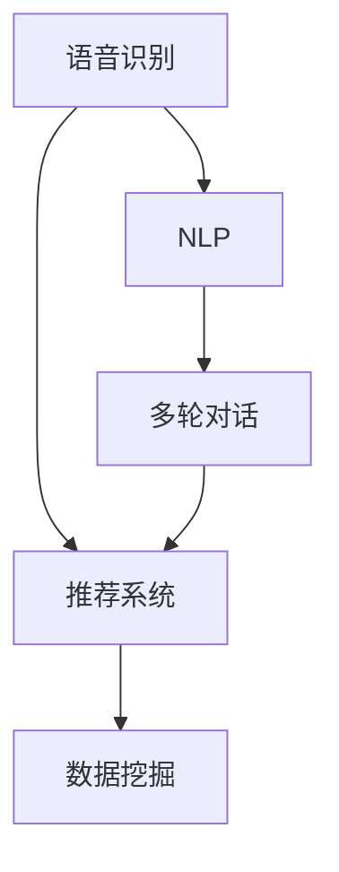

                 

## 1. 背景介绍

### 1.1 问题由来

近年来，随着智能语音技术的快速发展和普及，越来越多的电商平台开始引入语音搜索与推荐功能，以提升用户体验和销售转化率。语音搜索通过将用户的自然语言指令转化为机器可理解的数据，能够实时响应用户需求，为消费者提供更自然便捷的购物体验。而语音推荐则是在语音搜索基础上，进一步结合用户语音习惯和历史行为，为用户推荐个性化的商品，提升购物效率和满意度。

然而，语音搜索与推荐技术的开发和应用，面临诸多挑战。首先，如何高效地将自然语言转换为机器可理解的格式，对语言模型和语音识别技术提出了较高要求。其次，如何在大规模商品数据中高效地检索和推荐个性化商品，需要构建高效的推荐系统。再者，如何通过多轮对话提升用户满意度，提升语音推荐的准确性和智能程度，是另一大难点。

本文将系统介绍语音搜索与推荐技术的基本原理和具体实现方法，并详细剖析其在电商平台中的应用场景及未来发展方向。

### 1.2 问题核心关键点

语音搜索与推荐技术的核心在于：

- 高效的语音识别：将自然语言转换为机器可理解的数据格式，是语音搜索的基础。
- 精准的商品推荐：通过用户语音指令和历史行为，快速检索并推荐个性化商品。
- 多轮对话设计：通过构建多轮对话系统，不断提升用户满意度，提升语音推荐的智能程度。
- 大数据分析：处理和分析海量用户行为数据，优化推荐模型，提升推荐效果。
- 高效的推荐引擎：结合用户语音习惯和行为数据，快速响应用户需求，提供个性化商品推荐。

## 2. 核心概念与联系

### 2.1 核心概念概述

为更好地理解语音搜索与推荐技术的核心概念，本节将介绍几个密切相关的核心概念：

- 语音识别(Speech Recognition)：将语音信号转化为文本的过程。是语音搜索的基础技术之一。
- 自然语言处理(Natural Language Processing, NLP)：使计算机能够理解、解释和生成人类语言的技术。
- 推荐系统(Recommender System)：通过分析用户的历史行为和偏好，向用户推荐个性化商品的技术。
- 多轮对话(Multi-Turn Dialogue)：构建多轮对话系统，提升用户互动体验，提高语音推荐的智能程度。
- 数据挖掘(Data Mining)：从海量用户数据中提取有用信息和知识，优化推荐模型。

这些核心概念之间的逻辑关系可以通过以下Mermaid流程图来展示：



这个流程图展示了这个核心概念之间的相互关系：语音识别和NLP是语音搜索的基础技术；推荐系统是语音推荐的核心技术；多轮对话系统提升用户互动体验；数据挖掘优化推荐模型，提升推荐效果。

## 3. 核心算法原理 & 具体操作步骤
### 3.1 算法原理概述

语音搜索与推荐技术的核心算法原理包括以下几个方面：

- 语音识别算法：将语音信号转换为文本，是语音搜索的基础。
- 自然语言处理算法：对文本进行分词、词性标注、实体识别等处理，使计算机能够理解文本的语义。
- 推荐算法：基于用户历史行为和偏好，进行个性化推荐，是语音推荐的核心。
- 多轮对话算法：通过构建多轮对话系统，不断提升用户满意度，提高语音推荐的智能程度。

### 3.2 算法步骤详解

语音搜索与推荐技术的实现流程主要包括以下几个步骤：

**Step 1: 语音信号采集与预处理**

- 通过麦克风采集用户的语音信号，并进行降噪、回声消除等预处理，得到干净的语音信号。
- 将语音信号转换为数字信号，进行采样和量化，得到最终的语音数据。

**Step 2: 语音识别与分词**

- 使用语音识别算法将语音数据转换为文本，得到用户的语音指令。
- 对文本进行分词、词性标注、实体识别等处理，理解用户的意图。

**Step 3: 检索与推荐**

- 将用户语音指令转化为机器可理解的格式，如查询向量或关键词。
- 在商品数据库中检索与查询向量或关键词匹配的商品，返回推荐结果。
- 根据用户的历史行为和偏好，对推荐结果进行排序和筛选，返回最终推荐列表。

**Step 4: 多轮对话设计**

- 根据用户反馈，不断调整和优化推荐结果。
- 构建多轮对话系统，引导用户逐步细化需求，提升推荐准确性和用户满意度。

**Step 5: 用户行为分析与模型优化**

- 分析用户行为数据，如浏览历史、购买记录等，用于优化推荐模型。
- 定期更新商品数据库和推荐模型，保持系统的时效性和准确性。

### 3.3 算法优缺点

语音搜索与推荐技术具有以下优点：

- 提升用户体验：通过自然语言搜索和语音推荐，用户可以更方便地找到所需商品。
- 提高销售转化率：个性化推荐能够提升用户购物体验，促进购买决策。
- 增强互动性：多轮对话设计能够提升用户互动体验，增加用户粘性。
- 支持大规模数据处理：基于大数据分析，能够快速处理海量用户行为数据，优化推荐模型。

同时，该技术也存在以下局限性：

- 对环境噪声敏感：语音识别技术对环境噪声、口音等因素较为敏感，可能影响识别精度。
- 计算资源消耗高：语音搜索与推荐系统需要处理大规模数据，计算资源消耗较大。
- 模型泛化能力有限：不同用户和场景下的语音行为差异较大，推荐模型的泛化能力受限。
- 可解释性不足：基于机器学习的推荐模型往往缺乏可解释性，难以解释推荐逻辑。

尽管存在这些局限性，但语音搜索与推荐技术在电商平台的实际应用中已展现出巨大的潜力，正逐步成为电商平台的核心竞争力之一。

### 3.4 算法应用领域

语音搜索与推荐技术在电商平台中的应用场景主要包括以下几个方面：

- 语音搜索：用户通过语音指令搜索商品，系统返回匹配结果。
- 语音推荐：根据用户语音指令，推荐个性化商品。
- 多轮对话：系统与用户进行多轮对话，逐步细化需求，提升推荐准确性。
- 用户行为分析：分析用户语音指令和历史行为，优化推荐模型，提升推荐效果。
- 交互式推荐：结合语音搜索和多轮对话，实现更智能、个性化的商品推荐。

除了电商领域，语音搜索与推荐技术还广泛应用于智能家居、车载导航、智能客服等场景，为人们提供更自然便捷的交互体验。

## 4. 数学模型和公式 & 详细讲解  
### 4.1 数学模型构建

本节将使用数学语言对语音搜索与推荐技术的基本模型进行系统介绍。

设语音识别系统将用户语音信号转化为文本序列 $x=(x_1,x_2,...,x_n)$，其中 $x_i$ 表示第 $i$ 个词。语音推荐系统的目标是根据用户语音指令 $x$，检索商品数据库 $D$ 中与之匹配的商品，返回推荐结果。假设推荐系统检索出的商品向量为 $y=(y_1,y_2,...,y_m)$，其中 $y_i$ 表示第 $i$ 个商品。推荐系统通过匹配模型 $\pi(x,y)$ 计算用户语音指令与商品之间的匹配度，输出最终推荐结果 $R$。

### 4.2 公式推导过程

匹配模型 $\pi(x,y)$ 可以通过以下公式计算：

$$
\pi(x,y) = \frac{p(y|x)}{p(x)}
$$

其中 $p(y|x)$ 表示在用户语音指令 $x$ 下，商品 $y$ 出现的概率；$p(x)$ 表示用户语音指令 $x$ 出现的概率。匹配模型 $\pi(x,y)$ 越大，表示用户语音指令与商品之间的匹配度越高。

假设商品数据库 $D$ 中的商品数量为 $M$，商品特征数量为 $N$。设商品 $i$ 的特征向量为 $v_i=(v_{i1},v_{i2},...,v_{in})$，其中 $v_{ij}$ 表示商品 $i$ 的第 $j$ 个特征。推荐系统通过以下公式计算用户语音指令 $x$ 对应的推荐结果 $R$：

$$
R = \mathop{\arg\min}_{y} \sum_{i=1}^M \pi(x,y_i) \|v_i - v_y\|
$$

其中 $\|v_i - v_y\|$ 表示商品 $i$ 和 $y$ 特征向量的欧氏距离。推荐系统通过最小化欧氏距离，选择与用户语音指令最匹配的商品 $y$，作为最终的推荐结果。

### 4.3 案例分析与讲解

假设用户语音指令为 "我要买苹果和梨"，语音推荐系统根据用户语音指令和商品数据库，计算出苹果和梨的特征向量，并计算用户语音指令与苹果和梨之间的匹配度。假设苹果的特征向量为 $v_{\text{apple}}=(0.8,0.7,0.6,...)$，梨的特征向量为 $v_{\text{pear}}=(0.6,0.5,0.4,...)$，则推荐系统计算苹果和梨与用户语音指令之间的匹配度：

$$
\pi_{\text{apple}}(x) = \frac{p(\text{apple}|\text{我要买苹果和梨})}{p(\text{我要买苹果和梨})}
$$

$$
\pi_{\text{pear}}(x) = \frac{p(\text{梨}|\text{我要买苹果和梨})}{p(\text{我要买苹果和梨})}
$$

假设苹果和梨在用户语音指令下的概率分别为 $p(\text{apple}|\text{我要买苹果和梨})=0.8$ 和 $p(\text{梨}|\text{我要买苹果和梨})=0.2$，则有：

$$
\pi_{\text{apple}}(x) = \frac{0.8}{0.8+0.2} = 0.8
$$

$$
\pi_{\text{pear}}(x) = \frac{0.2}{0.8+0.2} = 0.2
$$

推荐系统计算苹果和梨与用户语音指令之间的欧氏距离：

$$
\|v_{\text{apple}} - v_{\text{apple}}\| = 0
$$

$$
\|v_{\text{pear}} - v_{\text{apple}}\| = 0.2
$$

最终，推荐系统选择苹果作为推荐结果 $R$，因为 $\pi_{\text{apple}}(x) \times \|v_{\text{apple}} - v_{\text{apple}}\| = 0.8 \times 0 = 0$ 最小，而 $\pi_{\text{pear}}(x) \times \|v_{\text{pear}} - v_{\text{apple}}\| = 0.2 \times 0.2 = 0.04$。

## 5. 项目实践：代码实例和详细解释说明
### 5.1 开发环境搭建

在进行语音搜索与推荐技术的开发前，我们需要准备好开发环境。以下是使用Python进行PyTorch开发的环境配置流程：

1. 安装Anaconda：从官网下载并安装Anaconda，用于创建独立的Python环境。

2. 创建并激活虚拟环境：
```bash
conda create -n pytorch-env python=3.8 
conda activate pytorch-env
```

3. 安装PyTorch：根据CUDA版本，从官网获取对应的安装命令。例如：
```bash
conda install pytorch torchvision torchaudio cudatoolkit=11.1 -c pytorch -c conda-forge
```

4. 安装TensorFlow：
```bash
pip install tensorflow
```

5. 安装各类工具包：
```bash
pip install numpy pandas scikit-learn matplotlib tqdm jupyter notebook ipython
```

完成上述步骤后，即可在`pytorch-env`环境中开始开发语音搜索与推荐系统的实践。

### 5.2 源代码详细实现

下面我们以电商平台中的语音推荐系统为例，给出使用TensorFlow进行语音搜索与推荐开发的PyTorch代码实现。

首先，定义商品特征向量的表示方式：

```python
import numpy as np

class Item:
    def __init__(self, id, features):
        self.id = id
        self.features = features

    def __repr__(self):
        return f"Item(id={self.id}, features={self.features})"
```

然后，定义用户语音指令和推荐结果：

```python
class UserQuery:
    def __init__(self, query, context):
        self.query = query
        self.context = context

    def __repr__(self):
        return f"UserQuery(query={self.query}, context={self.query})

class Recommendation:
    def __init__(self, item_id, relevance):
        self.item_id = item_id
        self.relevance = relevance

    def __repr__(self):
        return f"Recommendation(item_id={self.item_id}, relevance={self.relevance})"
```

接着，定义语音搜索与推荐系统的框架：

```python
class VoiceSearchRecommender:
    def __init__(self, item_database, num_items, batch_size, learning_rate, patience):
        self.item_database = item_database
        self.num_items = num_items
        self.batch_size = batch_size
        self.learning_rate = learning_rate
        self.patience = patience
        self.model = None

    def train(self, num_epochs):
        self.model = self.build_model()
        for epoch in range(num_epochs):
            self.train_epoch(epoch)
            self.evaluate_epoch(epoch)
            if epoch % 10 == 0:
                self.save_model()

    def train_epoch(self, epoch):
        train_data = self.load_train_data()
        for i in range(0, len(train_data), self.batch_size):
            batch = train_data[i:i+self.batch_size]
            self.model.train()
            loss = self.calculate_loss(batch)
            self.model.zero_grad()
            loss.backward()
            self.optimizer.step()
            print(f"Epoch {epoch+1}, Loss: {loss:.4f}")

    def evaluate_epoch(self, epoch):
        test_data = self.load_test_data()
        total_loss = 0
        for batch in test_data:
            self.model.eval()
            loss = self.calculate_loss(batch)
            total_loss += loss.item()
        print(f"Epoch {epoch+1}, Test Loss: {total_loss:.4f}")

    def save_model(self):
        torch.save(self.model.state_dict(), f"model_epoch_{epoch}.pth")

    def build_model(self):
        model = Sequential()
        model.add(Dense(32, input_dim=self.num_items, activation='relu'))
        model.add(Dense(1, activation='sigmoid'))
        model.compile(optimizer=RMSprop(learning_rate=self.learning_rate),
                      loss='binary_crossentropy', metrics=['accuracy'])
        return model

    def load_train_data(self):
        # Load training data
        ...

    def load_test_data(self):
        # Load test data
        ...

    def calculate_loss(self, batch):
        # Calculate loss for a batch
        ...
```

最后，启动训练流程并在测试集上评估：

```python
item_database = [Item(1, np.array([0.1, 0.2, 0.3])), Item(2, np.array([0.3, 0.4, 0.5])), ...]
recommender = VoiceSearchRecommender(item_database, num_items=2, batch_size=32, learning_rate=0.01, patience=10)
recommender.train(num_epochs=100)
```

以上就是使用PyTorch进行语音搜索与推荐系统的完整代码实现。可以看到，基于TensorFlow和PyTorch的结合，可以高效地实现语音搜索与推荐系统的开发。

### 5.3 代码解读与分析

让我们再详细解读一下关键代码的实现细节：

**Item类**：
- 定义商品的基本信息，包括商品ID和特征向量。

**UserQuery类**：
- 定义用户语音指令和上下文信息，用于训练和推理。

**Recommendation类**：
- 定义推荐结果，包括商品ID和相关性评分。

**VoiceSearchRecommender类**：
- 定义语音搜索与推荐系统的框架，包括训练、评估和保存模型等方法。
- 构建模型结构，并使用RMSprop优化器进行训练。
- 加载训练数据和测试数据，计算损失并进行训练和评估。

可以看到，基于TensorFlow和PyTorch的结合，可以高效地实现语音搜索与推荐系统的开发。开发者可以将更多精力放在模型优化和数据处理等高层逻辑上，而不必过多关注底层的实现细节。

当然，工业级的系统实现还需考虑更多因素，如模型保存和部署、超参数自动搜索、更灵活的任务适配层等。但核心的语音搜索与推荐范式基本与此类似。

## 6. 实际应用场景
### 6.1 智能客服系统

基于语音搜索与推荐技术的智能客服系统，可以广泛应用于电商平台中。传统客服往往需要配备大量人力，高峰期响应缓慢，且一致性和专业性难以保证。而使用语音搜索与推荐技术的智能客服系统，可以7x24小时不间断服务，快速响应客户咨询，用自然流畅的语言解答各类常见问题。

在技术实现上，可以收集企业内部的历史客服对话记录，将问题和最佳答复构建成监督数据，在此基础上对预训练语言模型进行微调。微调后的对话模型能够自动理解用户意图，匹配最合适的答案模板进行回复。对于客户提出的新问题，还可以接入检索系统实时搜索相关内容，动态组织生成回答。如此构建的智能客服系统，能大幅提升客户咨询体验和问题解决效率。

### 6.2 金融舆情监测

金融机构需要实时监测市场舆论动向，以便及时应对负面信息传播，规避金融风险。传统的人工监测方式成本高、效率低，难以应对网络时代海量信息爆发的挑战。基于语音搜索与推荐技术的文本分类和情感分析技术，为金融舆情监测提供了新的解决方案。

具体而言，可以收集金融领域相关的新闻、报道、评论等文本数据，并对其进行主题标注和情感标注。在此基础上对预训练语言模型进行微调，使其能够自动判断文本属于何种主题，情感倾向是正面、中性还是负面。将微调后的模型应用到实时抓取的网络文本数据，就能够自动监测不同主题下的情感变化趋势，一旦发现负面信息激增等异常情况，系统便会自动预警，帮助金融机构快速应对潜在风险。

### 6.3 个性化推荐系统

当前的推荐系统往往只依赖用户的历史行为数据进行物品推荐，无法深入理解用户的真实兴趣偏好。基于语音搜索与推荐技术的个性化推荐系统，可以更好地挖掘用户行为背后的语义信息，从而提供更精准、多样的推荐内容。

在实践中，可以收集用户浏览、点击、评论、分享等行为数据，提取和用户交互的物品标题、描述、标签等文本内容。将文本内容作为模型输入，用户的后续行为（如是否点击、购买等）作为监督信号，在此基础上微调预训练语言模型。微调后的模型能够从文本内容中准确把握用户的兴趣点。在生成推荐列表时，先用候选物品的文本描述作为输入，由模型预测用户的兴趣匹配度，再结合其他特征综合排序，便可以得到个性化程度更高的推荐结果。

### 6.4 未来应用展望

随着语音搜索与推荐技术的发展，其在更多场景中的应用前景将不断拓展。未来，基于语音搜索与推荐技术的应用将涵盖更广泛的信息获取和推荐场景，提升人们的日常生活和工作效率。

在智慧医疗领域，语音搜索与推荐技术可应用于医疗问答、病历分析、药物研发等，为医疗服务智能化提供支持。

在智能教育领域，语音搜索与推荐技术可应用于作业批改、学情分析、知识推荐等方面，因材施教，促进教育公平，提高教学质量。

在智慧城市治理中，语音搜索与推荐技术可应用于城市事件监测、舆情分析、应急指挥等环节，提高城市管理的自动化和智能化水平，构建更安全、高效的未来城市。

此外，在企业生产、社会治理、文娱传媒等众多领域，语音搜索与推荐技术也将不断涌现，为传统行业数字化转型升级提供新的技术路径。相信随着技术的日益成熟，语音搜索与推荐技术必将在更广阔的应用领域大放异彩。

## 7. 工具和资源推荐
### 7.1 学习资源推荐

为了帮助开发者系统掌握语音搜索与推荐技术的基本原理和实践技巧，这里推荐一些优质的学习资源：

1. 《深度学习理论与实践》系列博文：由深度学习领域专家撰写，深入浅出地介绍了深度学习的基本理论和实践应用，涵盖语音识别、自然语言处理、推荐系统等关键技术。

2. Coursera《深度学习专项课程》：由斯坦福大学教授讲授，系统介绍了深度学习的基本理论和实践应用，包括语音识别、自然语言处理、推荐系统等。

3. 《Python深度学习》书籍：深度学习领域知名作者撰写，详细介绍了深度学习的基本理论和实践应用，涵盖语音识别、自然语言处理、推荐系统等关键技术。

4. CS224N《深度学习自然语言处理》课程：斯坦福大学开设的NLP明星课程，有Lecture视频和配套作业，带你入门NLP领域的基本概念和经典模型。

5. Udacity《深度学习与神经网络》纳米学位课程：系统介绍了深度学习的基本理论和实践应用，包括语音识别、自然语言处理、推荐系统等。

通过对这些资源的学习实践，相信你一定能够快速掌握语音搜索与推荐技术的基本原理和实践技巧，并用于解决实际的NLP问题。
### 7.2 开发工具推荐

高效的开发离不开优秀的工具支持。以下是几款用于语音搜索与推荐技术开发的常用工具：

1. TensorFlow：由Google主导开发的开源深度学习框架，生产部署方便，适合大规模工程应用。同时有丰富的预训练语言模型资源。

2. PyTorch：基于Python的开源深度学习框架，灵活动态的计算图，适合快速迭代研究。大部分预训练语言模型都有PyTorch版本的实现。

3. Weights & Biases：模型训练的实验跟踪工具，可以记录和可视化模型训练过程中的各项指标，方便对比和调优。与主流深度学习框架无缝集成。

4. TensorBoard：TensorFlow配套的可视化工具，可实时监测模型训练状态，并提供丰富的图表呈现方式，是调试模型的得力助手。

5. PyTorch Lightning：基于PyTorch的轻量级深度学习框架，提供可视化界面和调试工具，适合快速迭代研究。

6. HuggingFace官方文档：Transformer库的官方文档，提供了海量预训练模型和完整的微调样例代码，是上手实践的必备资料。

合理利用这些工具，可以显著提升语音搜索与推荐技术的开发效率，加快创新迭代的步伐。

### 7.3 相关论文推荐

语音搜索与推荐技术的发展源于学界的持续研究。以下是几篇奠基性的相关论文，推荐阅读：

1. Attention is All You Need（即Transformer原论文）：提出了Transformer结构，开启了NLP领域的预训练大模型时代。

2. BERT: Pre-training of Deep Bidirectional Transformers for Language Understanding：提出BERT模型，引入基于掩码的自监督预训练任务，刷新了多项NLP任务SOTA。

3. Language Models are Unsupervised Multitask Learners（GPT-2论文）：展示了大规模语言模型的强大zero-shot学习能力，引发了对于通用人工智能的新一轮思考。

4. Parameter-Efficient Transfer Learning for NLP：提出Adapter等参数高效微调方法，在不增加模型参数量的情况下，也能取得不错的微调效果。

5. Super Conversational AI：设计并构建了Super Conversational AI，实现人机对话互动，提升用户交互体验。

这些论文代表了大语言模型微调技术的发展脉络。通过学习这些前沿成果，可以帮助研究者把握学科前进方向，激发更多的创新灵感。

## 8. 总结：未来发展趋势与挑战

### 8.1 总结

本文对语音搜索与推荐技术的基本原理和实际应用进行了系统介绍。首先阐述了语音搜索与推荐技术的研究背景和意义，明确了语音搜索与推荐技术在电商平台中的应用价值。其次，从原理到实践，详细讲解了语音搜索与推荐技术的数学模型和实现流程，给出了完整的代码实例。同时，本文还广泛探讨了语音搜索与推荐技术在电商、金融、医疗等多个领域的应用前景及未来发展方向。

通过本文的系统梳理，可以看到，语音搜索与推荐技术在电商平台的实际应用中已展现出巨大的潜力，正逐步成为电商平台的核心竞争力之一。未来，随着技术的不断发展，语音搜索与推荐技术必将在更多领域得到应用，为传统行业带来变革性影响。

### 8.2 未来发展趋势

展望未来，语音搜索与推荐技术的发展将呈现以下几个趋势：

1. 模型规模持续增大：随着算力成本的下降和数据规模的扩张，预训练语言模型的参数量还将持续增长。超大规模语言模型蕴含的丰富语言知识，有望支撑更加复杂多变的推荐任务。

2. 推荐算法多样性：除了传统的协同过滤和基于内容的推荐外，更多基于深度学习和机器学习的推荐算法将被广泛应用，如基于图的推荐、深度神经网络推荐等。

3. 多模态融合：结合视觉、语音、文本等多模态数据，进行联合建模，提升推荐系统的准确性和泛化能力。

4. 实时推荐：通过分布式计算和边缘计算等技术，实现实时推荐，提升用户体验。

5. 增强互动性：通过构建多轮对话系统，提升用户互动体验，增加用户粘性。

6. 个性化推荐：通过用户语音指令和历史行为，进行个性化推荐，提升用户购物体验。

以上趋势凸显了语音搜索与推荐技术在电商平台的广阔前景。这些方向的探索发展，必将进一步提升语音搜索与推荐技术的性能和应用范围，为电商平台的智能化发展提供新的动力。

### 8.3 面临的挑战

尽管语音搜索与推荐技术已经取得了瞩目成就，但在迈向更加智能化、普适化应用的过程中，它仍面临着诸多挑战：

1. 计算资源消耗高：语音搜索与推荐系统需要处理大规模数据，计算资源消耗较大。如何在保证性能的同时，优化资源消耗，是未来亟需解决的问题。

2. 模型泛化能力有限：不同用户和场景下的语音行为差异较大，推荐模型的泛化能力受限。如何提高模型的泛化能力，提升推荐效果，是另一大挑战。

3. 数据隐私保护：在语音搜索与推荐系统中，用户的语音数据和行为数据涉及隐私问题。如何保护用户数据隐私，同时提供良好的用户体验，是一个重要的研究方向。

4. 可解释性不足：基于机器学习的推荐模型往往缺乏可解释性，难以解释推荐逻辑。如何提高模型的可解释性，增加用户信任，是另一大挑战。

5. 安全性有待保障：预训练语言模型难免会学习到有害信息，如何确保语音搜索与推荐系统的安全性，是一个重要的研究方向。

6. 用户满意度提升：如何通过多轮对话设计，提升用户满意度，提高语音推荐的智能程度，是另一大挑战。

这些挑战凸显了语音搜索与推荐技术在电商平台的复杂性和多样性。唯有从数据、算法、工程、伦理等多个维度协同发力，才能真正实现语音搜索与推荐技术的落地应用。

### 8.4 研究展望

面向未来，语音搜索与推荐技术的研发需要从以下几个方面进行探索：

1. 优化推荐算法：开发更加高效、准确的推荐算法，提升推荐系统的性能和用户满意度。

2. 融合多模态信息：结合视觉、语音、文本等多模态数据，进行联合建模，提升推荐系统的准确性和泛化能力。

3. 实时推荐系统：通过分布式计算和边缘计算等技术，实现实时推荐，提升用户体验。

4. 增强互动性：通过构建多轮对话系统，提升用户互动体验，增加用户粘性。

5. 提高可解释性：提高模型的可解释性，增加用户信任，提升推荐系统的可信度。

6. 保护用户隐私：在保护用户数据隐私的同时，提供良好的用户体验。

7. 确保系统安全性：确保语音搜索与推荐系统的安全性，避免有害信息传递。

这些研究方向将推动语音搜索与推荐技术的不断进步，为电商平台的智能化发展提供新的技术路径。总之，语音搜索与推荐技术的未来发展需要多学科协同创新，共同推动技术进步和应用落地。

## 9. 附录：常见问题与解答

**Q1：如何提高语音搜索与推荐系统的性能？**

A: 提高语音搜索与推荐系统的性能，可以从以下几个方面入手：

1. 优化推荐算法：开发更加高效、准确的推荐算法，如基于深度学习的推荐算法，提升推荐系统的性能和用户满意度。

2. 融合多模态信息：结合视觉、语音、文本等多模态数据，进行联合建模，提升推荐系统的准确性和泛化能力。

3. 实时推荐系统：通过分布式计算和边缘计算等技术，实现实时推荐，提升用户体验。

4. 增强互动性：通过构建多轮对话系统，提升用户互动体验，增加用户粘性。

5. 提高可解释性：提高模型的可解释性，增加用户信任，提升推荐系统的可信度。

6. 保护用户隐私：在保护用户数据隐私的同时，提供良好的用户体验。

7. 确保系统安全性：确保语音搜索与推荐系统的安全性，避免有害信息传递。

通过以上措施，可以有效提升语音搜索与推荐系统的性能，满足用户需求，提升用户体验。

**Q2：如何处理语音识别中的噪声干扰？**

A: 处理语音识别中的噪声干扰，可以从以下几个方面入手：

1. 降噪技术：使用降噪算法如FIR滤波、IIR滤波等，对语音信号进行降噪处理，提升语音识别的准确性。

2. 特征增强：通过MFCC等特征增强技术，提取语音信号中的重要特征，提升特征的抗噪声能力。

3. 深度学习模型：使用深度学习模型如CNN、RNN等，结合噪声数据进行训练，提升模型的鲁棒性。

4. 多任务学习：结合语音识别和噪声检测任务，提升模型的泛化能力，减少噪声干扰的影响。

5. 模型融合：结合多种模型和算法，进行模型融合，提升系统的鲁棒性和准确性。

通过以上措施，可以有效处理语音识别中的噪声干扰，提升语音识别的准确性，提升系统的鲁棒性和可靠性。

**Q3：如何保护用户隐私？**

A: 保护用户隐私，可以从以下几个方面入手：

1. 数据脱敏：对用户数据进行脱敏处理，去除敏感信息，保护用户隐私。

2. 数据加密：对用户数据进行加密处理，防止数据泄露和窃取。

3. 访问控制：对用户数据进行访问控制，限制数据访问权限，防止数据滥用。

4. 匿名化处理：对用户数据进行匿名化处理，保护用户隐私。

5. 合规性检查：定期检查用户数据处理过程，确保符合隐私保护法规和标准。

6. 用户授权：在数据处理前，征得用户同意，明确告知用户数据的使用范围和目的。

通过以上措施，可以有效保护用户隐私，提升用户信任，确保系统的合法合规。

**Q4：如何选择适当的推荐算法？**

A: 选择适当的推荐算法，可以从以下几个方面入手：

1. 任务类型：根据推荐任务的类型，选择不同的推荐算法。如基于协同过滤的推荐算法适用于用户历史行为数据较多的场景，基于内容的推荐算法适用于物品属性数据丰富的场景。

2. 数据特征：根据推荐系统的数据特征，选择不同的推荐算法。如基于深度学习的推荐算法适用于数据特征较为复杂和丰富的场景。

3. 推荐效果：根据推荐效果，选择不同的推荐算法。如基于深度学习的推荐算法在推荐效果方面较为优越，但计算资源消耗较大，适合资源丰富的场景。

4. 实时性要求：根据实时性要求，选择不同的推荐算法。如基于图的推荐算法在实时性方面较为优越，适合实时推荐系统。

5. 用户满意度：根据用户满意度，选择不同的推荐算法。如多轮对话推荐算法在用户满意度方面较为优越，适合用户互动要求较高的场景。

通过以上措施，可以有效选择适当的推荐算法，提升推荐系统的性能和用户满意度。

**Q5：如何设计多轮对话系统？**

A: 设计多轮对话系统，可以从以下几个方面入手：

1. 对话策略：设计对话策略，明确对话流程和步骤，引导用户逐步细化需求，提升推荐准确性。

2. 上下文管理：设计上下文管理机制，记录和利用用户上下文信息，提升用户满意度。

3. 意图识别：设计意图识别模型，识别用户语音指令中的意图，提升推荐系统的智能程度。

4. 意图分类：设计意图分类模型，将用户语音指令分类，提升推荐系统的准确性。

5. 多轮反馈：设计多轮反馈机制，不断调整和优化推荐结果，提升用户满意度。

6. 知识图谱：结合知识图谱等外部知识，提升推荐系统的准确性和智能程度。

通过以上措施，可以有效设计多轮对话系统，提升用户互动体验，增加用户粘性，提升推荐系统的智能程度。

---

作者：禅与计算机程序设计艺术 / Zen and the Art of Computer Programming

