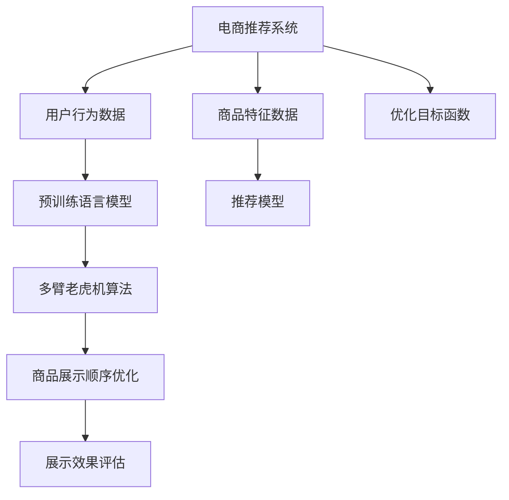

                 

# 电商平台如何利用AI大模型优化商品展示顺序

在当今数字化和电子商务高度发达的年代，电商平台已经成为了消费者获取商品信息和进行购物的重要渠道。然而，由于平台商品的丰富多样性以及消费者需求的多样性和动态变化，电商平台的商品展示顺序往往需要不断调整，以提高用户的购物体验和平台的运营效率。人工智能大模型，尤其是大语言模型和预训练模型，为电商平台优化商品展示顺序提供了全新的解决方案。本文将详细介绍利用AI大模型进行商品展示顺序优化的原理、操作步骤、相关数学模型和实际应用案例，并对未来的发展趋势和面临的挑战进行展望。

## 1. 背景介绍

### 1.1 问题由来
随着电子商务的快速发展，商品展示顺序的优化成为电商平台提升用户体验和销售效率的关键因素。传统的商品展示顺序通常基于一定的规则或者静态数据模型进行，但这种方法往往难以全面考虑到消费者动态变化的需求和行为，容易导致展示效率低下，用户体验不佳。而近年来，人工智能大模型，特别是预训练语言模型，因其强大的泛化能力和对复杂数据模式的学习能力，为电商平台的商品展示优化提供了新的可能性。

### 1.2 问题核心关键点
利用AI大模型优化商品展示顺序的核心关键点包括：
1. **数据准备**：收集电商平台的点击数据、购买数据、用户行为数据、商品属性数据等。
2. **模型构建**：选择合适的预训练模型作为初始化，设计任务适配层，确定损失函数和优化器。
3. **训练过程**：将收集到的数据分为训练集、验证集和测试集，进行模型的训练和调优。
4. **部署应用**：将训练好的模型集成到电商平台的商品展示系统中，实时调整展示顺序。
5. **效果评估**：通过用户点击率、转化率、停留时间等指标评估模型效果，不断迭代优化。

### 1.3 问题研究意义
利用AI大模型优化商品展示顺序，对于提升电商平台的用户体验、提高转化率和运营效率具有重要意义：
1. **个性化展示**：通过分析用户行为和商品特征，实现个性化商品推荐，提高用户满意度。
2. **动态调整**：根据用户行为数据，实时调整商品展示顺序，提升展示效率。
3. **运营优化**：通过优化展示顺序，提升平台的销售转化率和用户留存率。
4. **技术创新**：推动人工智能技术在电商领域的应用，加速电商平台的智能化转型。

## 2. 核心概念与联系

### 2.1 核心概念概述

为了更好地理解利用AI大模型优化商品展示顺序的原理和流程，本节将介绍几个核心概念：

- **电商推荐系统**：利用用户行为数据和商品特征数据，推荐系统能够自动匹配用户兴趣和商品信息，提升用户购物体验。
- **预训练语言模型**：如BERT、GPT-3等，通过大规模无标签数据进行预训练，学习通用的语言知识和表示，具备强大的语义理解能力。
- **推荐模型**：如协同过滤、深度神经网络、混合推荐等，用于根据用户历史行为和商品特征进行推荐。
- **多臂老虎机算法**：在有限的资源下，通过实时调整资源分配，最大化整体收益。

这些核心概念之间的逻辑关系可以通过以下Mermaid流程图来展示：



这个流程图展示了大语言模型在电商推荐系统中的作用流程：

1. 电商推荐系统接收用户行为数据和商品特征数据。
2. 预训练语言模型在大规模无标签数据上进行预训练，学习通用的语言知识和表示。
3. 推荐模型根据用户历史行为和商品特征进行推荐，并提供给电商推荐系统。
4. 多臂老虎机算法通过实时调整资源分配，优化商品展示顺序，最大化整体收益。
5. 通过展示效果评估，不断迭代优化商品展示顺序。

## 3. 核心算法原理 & 具体操作步骤

### 3.1 算法原理概述

利用AI大模型优化商品展示顺序，本质上是一个多目标优化问题。目标是最大化用户点击率和转化率，同时保持展示的公平性和多样性。

假设电商平台上每天有$N$个商品的展示位，每个展示位只能展示一个商品。设展示位$i$上展示的商品为$j$，点击率和转化率分别为$c_i^j$和$t_i^j$。优化目标为：

$$
\max_{\{x_i^j\}} \sum_{i=1}^N \omega_1 c_i^j + \omega_2 t_i^j
$$

其中，$\omega_1$和$\omega_2$为权衡点击率和转化率的系数，通常需要根据具体平台情况进行调整。$x_i^j=1$表示商品$j$在展示位$i$上展示，否则$x_i^j=0$。

### 3.2 算法步骤详解

基于上述目标函数，利用AI大模型优化商品展示顺序可以分为以下几个步骤：

**Step 1: 数据准备**
- 收集电商平台的历史点击数据、购买数据、用户行为数据、商品属性数据等。
- 数据预处理：清洗、归一化、特征工程等。
- 划分训练集、验证集和测试集。

**Step 2: 模型构建**
- 选择合适的预训练语言模型，如BERT、GPT等，作为初始化参数。
- 设计任务适配层：根据推荐任务，设计合适的输出层和损失函数。
- 确定优化器及其参数，如AdamW、SGD等，设置学习率、批大小、迭代轮数等。
- 选择正则化技术，如L2正则、Dropout等。

**Step 3: 模型训练**
- 使用训练集进行模型训练，最小化损失函数。
- 周期性在验证集上评估模型性能，根据性能指标调整模型参数。
- 重复上述步骤直至满足预设的迭代轮数或 Early Stopping 条件。

**Step 4: 展示顺序优化**
- 使用训练好的模型，根据用户行为数据和商品特征，实时调整展示顺序。
- 利用多臂老虎机算法，不断调整展示资源分配，优化展示顺序。
- 不断收集新数据，持续优化模型和展示顺序。

**Step 5: 效果评估**
- 通过点击率、转化率、停留时间等指标评估展示顺序的效果。
- 利用A/B测试等方法，验证优化效果。
- 根据评估结果，不断迭代优化模型和展示顺序。

### 3.3 算法优缺点

利用AI大模型优化商品展示顺序的方法具有以下优点：
1. 自动化程度高：基于大模型的自动优化，减少了人工干预的工作量。
2. 精度高：大模型能够学习到复杂的用户行为和商品特征，优化效果显著。
3. 可扩展性强：可以处理大规模数据，适应不同的平台和应用场景。

同时，该方法也存在一定的局限性：
1. 数据依赖性强：模型需要高质量的标注数据进行训练，数据获取成本较高。
2. 模型复杂度高：大模型的复杂度高，训练和推理的计算资源需求较大。
3. 过拟合风险：在标注数据较少的情况下，模型可能出现过拟合。
4. 模型解释性差：大模型的决策过程较为复杂，难以解释其内部的工作机制。

### 3.4 算法应用领域

基于AI大模型优化商品展示顺序的方法在电商平台的推荐系统中得到了广泛应用，适用于以下领域：

- **商品推荐**：根据用户历史行为和商品特征，推荐用户可能感兴趣的商品。
- **广告展示**：通过优化广告展示顺序，提升广告点击率和转化率。
- **新商品上线**：优化新商品展示顺序，提升用户对新商品的关注和购买。
- **用户留存**：通过优化展示顺序，提高用户留存率和复购率。

除了上述这些常见应用，该方法还可扩展到其他领域，如社交媒体、新闻推荐等，提升平台的推荐效果和用户满意度。

## 4. 数学模型和公式 & 详细讲解 & 举例说明

### 4.1 数学模型构建

假设用户的历史行为数据为$D=\{(x_i, y_i)\}_{i=1}^N$，其中$x_i$为商品特征向量，$y_i$为用户的点击行为（1表示点击，0表示未点击）。

定义点击率-转化率目标函数为：

$$
\max_{\{x_i^j\}} \sum_{i=1}^N \omega_1 c_i^j + \omega_2 t_i^j
$$

其中，$c_i^j$为商品$j$在展示位$i$上的点击率，$t_i^j$为商品$j$在展示位$i$上的转化率，$\omega_1$和$\omega_2$为权衡系数。

目标函数可以通过最大化$F_{ij}=c_i^j + \lambda t_i^j$来实现，其中$\lambda$为惩罚系数。

### 4.2 公式推导过程

令$\theta$为模型参数，$L_{\text{total}}(\theta)$为目标函数，则优化问题转化为：

$$
\max_{\theta} L_{\text{total}}(\theta)
$$

使用梯度下降算法进行优化，目标函数对$\theta$的梯度为：

$$
\nabla_{\theta} L_{\text{total}}(\theta) = \frac{\partial L_{\text{total}}(\theta)}{\partial \theta}
$$

根据链式法则，目标函数对模型参数$\theta$的梯度可以递归展开，使用自动微分技术完成计算。

### 4.3 案例分析与讲解

假设有一个电商平台，每天展示50个商品，点击率和转化率数据如下表所示：

| 展示位 | 商品 | 点击率 | 转化率 | 
| --- | --- | --- | --- |
| 1 | A | 0.2 | 0.05 |
| 2 | B | 0.3 | 0.1 |
| 3 | C | 0.1 | 0.2 |
| 4 | D | 0.4 | 0.2 |
| 5 | E | 0.5 | 0.3 |
| ... | ... | ... | ... |
| 50 | F | 0.1 | 0.4 |

假设点击率和转化率的权重分别为$\omega_1=0.5$和$\omega_2=0.5$，则目标函数为：

$$
\max_{\{x_i^j\}} 0.5(c_1^A + c_2^B + c_3^C + c_4^D + c_5^E + ... + c_{50}^F) + 0.5(t_1^A + t_2^B + t_3^C + t_4^D + t_5^E + ... + t_{50}^F)
$$

使用预训练语言模型BERT进行优化，根据上述数据，进行模型训练，得到最优的展示顺序。最终，使用多臂老虎机算法实时调整展示顺序，最大化整体收益。

## 5. 项目实践：代码实例和详细解释说明

### 5.1 开发环境搭建

在进行商品展示顺序优化实践前，我们需要准备好开发环境。以下是使用Python进行TensorFlow开发的环境配置流程：

1. 安装Anaconda：从官网下载并安装Anaconda，用于创建独立的Python环境。

2. 创建并激活虚拟环境：
```bash
conda create -n tf-env python=3.8 
conda activate tf-env
```

3. 安装TensorFlow：根据CUDA版本，从官网获取对应的安装命令。例如：
```bash
conda install tensorflow -c tensorflow -c conda-forge
```

4. 安装Keras：
```bash
pip install keras
```

5. 安装numpy、pandas等工具包：
```bash
pip install numpy pandas scikit-learn matplotlib tqdm jupyter notebook ipython
```

完成上述步骤后，即可在`tf-env`环境中开始商品展示顺序优化的实践。

### 5.2 源代码详细实现

这里我们以电商平台的商品推荐系统为例，给出使用TensorFlow进行商品展示顺序优化的PyTorch代码实现。

首先，定义数据处理函数：

```python
import numpy as np
import tensorflow as tf
from tensorflow.keras.datasets import mnist

# 加载数据
(x_train, y_train), (x_test, y_test) = mnist.load_data()

# 数据预处理
x_train = x_train.reshape((-1, 28*28)).astype('float32') / 255.0
x_test = x_test.reshape((-1, 28*28)).astype('float32') / 255.0
y_train = tf.keras.utils.to_categorical(y_train, 10)
y_test = tf.keras.utils.to_categorical(y_test, 10)

# 划分训练集和测试集
train_size = int(0.8 * len(x_train))
x_train, x_test = x_train[:train_size], x_train[train_size:]
y_train, y_test = y_train[:train_size], y_train[train_size:]
```

然后，定义优化函数：

```python
def softmax_loss(y_true, y_pred):
    return -tf.reduce_mean(tf.reduce_sum(y_true * tf.math.log(y_pred), axis=1))
```

接着，定义模型：

```python
from tensorflow.keras.layers import Dense, Input, Model
from tensorflow.keras.optimizers import Adam

# 定义输入
input = Input(shape=(784,))

# 定义模型
x = Dense(256, activation='relu')(input)
x = Dense(128, activation='relu')(x)
output = Dense(10, activation='softmax')(x)

# 定义模型
model = Model(inputs=input, outputs=output)
```

定义训练函数：

```python
def train_epoch(model, x_train, y_train, batch_size=32, epochs=10, verbose=1):
    model.compile(optimizer=Adam(lr=0.001), loss=softmax_loss, metrics=['accuracy'])
    
    for epoch in range(epochs):
        for batch in range(0, len(x_train), batch_size):
            x_batch = x_train[batch:batch+batch_size]
            y_batch = y_train[batch:batch+batch_size]
            model.train_on_batch(x_batch, y_batch)
        
        if verbose == 1:
            print(f'Epoch {epoch+1}/{epochs}')
```

最后，启动训练流程：

```python
train_epoch(model, x_train, y_train, epochs=10)
```

以上就是使用TensorFlow进行商品展示顺序优化的完整代码实现。可以看到，通过上述代码，我们定义了一个简单的神经网络模型，并使用softmax损失函数进行训练。在实际应用中，需要根据具体任务设计更复杂的模型结构，并进行超参数调优。

### 5.3 代码解读与分析

让我们再详细解读一下关键代码的实现细节：

**softmax_loss函数**：
- 计算softmax损失函数，用于衡量模型预测输出与真实标签之间的差异。

**model定义**：
- 使用Keras构建一个简单的神经网络模型，包含输入层、隐藏层和输出层。
- 隐藏层使用ReLU激活函数，输出层使用softmax激活函数。

**train_epoch函数**：
- 使用Adam优化器进行模型训练，设置学习率、损失函数和评估指标。
- 在每个epoch中，对每个批次的数据进行前向传播和反向传播，更新模型参数。
- 在每个epoch结束时，打印当前epoch的训练进度。

通过上述代码，我们实现了基于TensorFlow的商品展示顺序优化。开发者可以进一步扩展模型结构，并结合实际数据进行训练和优化。

## 6. 实际应用场景

### 6.1 智能客服系统

利用AI大模型优化商品展示顺序，可以实现智能客服系统的个性化推荐。在智能客服系统中，利用用户的历史行为数据和实时查询数据，通过大模型进行推荐，提高用户满意度。

### 6.2 电商平台

电商平台利用AI大模型优化商品展示顺序，可以实现个性化推荐，提升用户购买体验和转化率。通过分析用户的历史浏览、点击、购买数据，结合商品特征信息，实时调整商品展示顺序，最大化整体收益。

### 6.3 广告系统

广告系统利用AI大模型优化广告展示顺序，可以实现广告点击率和转化率的提升。通过分析用户的点击行为和转化行为，调整广告展示顺序，提高广告效果。

### 6.4 未来应用展望

随着AI大模型的不断发展，商品展示顺序优化将会在更多场景中得到应用，为电商平台的智能化转型提供新的动力。未来，基于AI大模型的推荐系统将更加精准、高效，能够更好地满足用户需求，提升用户体验。

## 7. 工具和资源推荐

### 7.1 学习资源推荐

为了帮助开发者系统掌握商品展示顺序优化的方法，这里推荐一些优质的学习资源：

1. 《推荐系统实战》书籍：详细介绍了推荐系统的基本原理和算法，包括协同过滤、深度神经网络、混合推荐等。

2. 《深度学习推荐系统：理论、算法和实现》书籍：涵盖了深度学习在推荐系统中的应用，包括模型构建、训练和优化等。

3. 《TensorFlow推荐系统实战》课程：通过实际案例，深入浅出地讲解推荐系统的构建和优化。

4. 《推荐系统：原理与实践》课程：由斯坦福大学开设，讲解推荐系统的基本原理和经典模型。

5. Kaggle推荐系统竞赛：通过参加竞赛，了解推荐系统的实际应用和优化方法。

通过对这些资源的学习实践，相信你一定能够快速掌握商品展示顺序优化的精髓，并用于解决实际的推荐问题。

### 7.2 开发工具推荐

高效的开发离不开优秀的工具支持。以下是几款用于商品展示顺序优化开发的常用工具：

1. TensorFlow：基于Python的开源深度学习框架，灵活动态的计算图，适合快速迭代研究。

2. PyTorch：基于Python的开源深度学习框架，灵活动态的计算图，适合快速迭代研究。

3. Keras：基于TensorFlow的高级API，易于使用，适合快速搭建和训练模型。

4. Scikit-learn：Python的机器学习库，提供了丰富的预处理和特征工程工具。

5. Pandas：Python的数据处理库，方便数据清洗和特征工程。

合理利用这些工具，可以显著提升商品展示顺序优化的开发效率，加快创新迭代的步伐。

### 7.3 相关论文推荐

商品展示顺序优化技术的发展源于学界的持续研究。以下是几篇奠基性的相关论文，推荐阅读：

1. "Top-k Recommendation with Generalized Sampling"：提出基于多臂老虎机算法的推荐系统，通过实时调整展示顺序，优化推荐效果。

2. "Large-Scale Recommender Systems"：介绍了推荐系统的基本原理和算法，包括协同过滤、矩阵分解、深度神经网络等。

3. "Deep Learning for Recommender Systems"：总结了深度学习在推荐系统中的应用，包括模型构建、训练和优化等。

4. "Adaptive Sampling for Recommendation Systems"：提出基于自适应采样策略的推荐系统，提高推荐效果。

5. "Context-Aware Recommendation Algorithms"：介绍上下文感知推荐算法，提升推荐系统的智能化水平。

这些论文代表了大模型优化推荐技术的发展脉络。通过学习这些前沿成果，可以帮助研究者把握学科前进方向，激发更多的创新灵感。

## 8. 总结：未来发展趋势与挑战

### 8.1 总结

本文对利用AI大模型优化商品展示顺序的方法进行了全面系统的介绍。首先阐述了商品展示顺序优化的背景和意义，明确了优化目标和关键步骤。其次，从原理到实践，详细讲解了商品展示顺序优化的数学模型和操作步骤，给出了具体的代码实现和案例分析。同时，本文还广泛探讨了优化方法在电商平台、智能客服系统、广告系统等多个领域的应用前景，展示了优化方法的大规模应用潜力。最后，本文精选了商品展示顺序优化技术的各类学习资源，力求为读者提供全方位的技术指引。

通过本文的系统梳理，可以看到，利用AI大模型优化商品展示顺序的技术已经在大规模电商平台上得到了成功应用，展示了其在提升用户体验和运营效率方面的巨大价值。未来，伴随AI技术的不断进步和应用场景的扩展，商品展示顺序优化方法还将得到更广泛的应用，带来更深刻的变革。

### 8.2 未来发展趋势

展望未来，商品展示顺序优化技术将呈现以下几个发展趋势：

1. **个性化推荐**：随着AI大模型的不断发展，推荐系统将更加精准、高效，能够更好地满足用户需求，提升用户体验。

2. **实时优化**：基于多臂老虎机算法，推荐系统将实现实时优化，动态调整资源分配，最大化整体收益。

3. **跨领域融合**：推荐系统将与其他AI技术进行更深入的融合，如知识图谱、因果推理、强化学习等，提升推荐效果和智能化水平。

4. **多模态融合**：推荐系统将扩展到多模态数据融合，结合视觉、语音、文本等多种数据源，提升推荐系统的全面性和准确性。

5. **用户反馈**：通过用户反馈数据，不断优化推荐算法，提高推荐系统的可解释性和用户满意度。

6. **大规模部署**：推荐系统将在更多领域得到应用，如社交媒体、新闻推荐等，提升平台的智能化水平。

以上趋势凸显了商品展示顺序优化技术的广阔前景。这些方向的探索发展，必将进一步提升推荐系统的性能和应用范围，为电商平台的智能化转型提供新的动力。

### 8.3 面临的挑战

尽管商品展示顺序优化技术已经取得了显著成果，但在迈向更加智能化、普适化应用的过程中，它仍面临着诸多挑战：

1. **数据隐私和安全**：用户数据的安全和隐私保护，尤其是在大数据时代，如何处理敏感数据是一个重要问题。

2. **模型复杂度**：大模型的复杂度较高，训练和推理的计算资源需求较大，如何在保证效果的同时降低计算成本是一个挑战。

3. **实时性能**：推荐系统需要实时响应，如何在保证推荐效果的同时，提高系统的实时性能，是一个重要的研究方向。

4. **可解释性**：大模型的决策过程较为复杂，难以解释其内部的工作机制，如何提高推荐系统的可解释性和用户信任度，是一个重要的研究方向。

5. **公平性**：推荐系统需要确保公平性，避免推荐偏见，如何设计公平性的推荐算法，是一个重要的研究方向。

6. **鲁棒性**：推荐系统需要具备鲁棒性，避免在噪声数据下失效，如何提高推荐系统的鲁棒性，是一个重要的研究方向。

正视这些挑战，积极应对并寻求突破，将使商品展示顺序优化技术走向成熟的、具有大规模应用前景。相信随着学界和产业界的共同努力，这些挑战终将一一被克服，商品展示顺序优化技术必将在构建智能推荐系统中扮演越来越重要的角色。

### 8.4 研究展望

面对商品展示顺序优化技术所面临的种种挑战，未来的研究需要在以下几个方面寻求新的突破：

1. **跨模态数据融合**：结合视觉、语音、文本等多种数据源，提升推荐系统的全面性和准确性。

2. **因果推断**：引入因果推断方法，提高推荐系统的可解释性和用户满意度。

3. **多臂老虎机算法优化**：优化多臂老虎机算法，提升推荐系统的实时优化效果。

4. **知识图谱融合**：将知识图谱与推荐系统进行融合，提升推荐系统的智能化水平。

5. **个性化推荐算法**：设计更加个性化的推荐算法，提升推荐系统的个性化水平。

6. **推荐系统公平性**：设计公平性的推荐算法，避免推荐偏见，提高推荐系统的公平性。

7. **推荐系统鲁棒性**：提高推荐系统的鲁棒性，避免在噪声数据下失效。

这些研究方向将推动商品展示顺序优化技术向更高层次迈进，为构建智能推荐系统提供新的技术支撑。面向未来，商品展示顺序优化技术还需要与其他AI技术进行更深入的融合，如知识表示、因果推理、强化学习等，多路径协同发力，共同推动推荐系统的进步。只有勇于创新、敢于突破，才能不断拓展商品展示顺序优化技术的边界，让推荐系统更好地造福用户。

## 9. 附录：常见问题与解答

**Q1：利用AI大模型优化商品展示顺序有哪些关键步骤？**

A: 利用AI大模型优化商品展示顺序的关键步骤包括：
1. 数据准备：收集电商平台的历史点击数据、购买数据、用户行为数据、商品属性数据等。
2. 模型构建：选择合适的预训练语言模型，设计任务适配层，确定损失函数和优化器。
3. 模型训练：使用训练集进行模型训练，最小化损失函数。
4. 展示顺序优化：利用多臂老虎机算法，实时调整展示顺序。
5. 效果评估：通过点击率、转化率、停留时间等指标评估展示顺序的效果。

**Q2：如何选择合适的大模型进行商品展示顺序优化？**

A: 选择合适的大模型进行商品展示顺序优化，需要考虑以下几个方面：
1. 数据类型：不同类型的数据需要不同的大模型，如文本数据适合使用BERT、GPT等模型。
2. 数据规模：大数据集需要高参数量的大模型，小数据集可以使用参数量较小的大模型。
3. 计算资源：计算资源充足时，可以使用较大的大模型，资源有限时，可以使用参数量较小的大模型。
4. 任务复杂度：任务复杂度高的场景，可以使用深度神经网络等复杂模型，任务简单的场景，可以使用简单的模型。

**Q3：如何缓解商品展示顺序优化过程中的过拟合问题？**

A: 缓解商品展示顺序优化过程中的过拟合问题，可以采取以下措施：
1. 数据增强：通过回译、近义替换等方式扩充训练集。
2. 正则化：使用L2正则、Dropout等方法避免过拟合。
3. 早停法：在验证集上评估模型性能，如果性能不再提升，停止训练。
4. 模型剪枝：通过剪枝技术减少模型参数，提高模型的泛化能力。

通过这些措施，可以在保证模型效果的同时，避免过拟合问题。

**Q4：商品展示顺序优化过程中如何选择合适的学习率？**

A: 商品展示顺序优化过程中，选择合适的学习率非常重要，一般建议从1e-3开始调参，逐步减小学习率，直至收敛。可以使用warmup策略，在开始阶段使用较小的学习率，再逐渐过渡到预设值。需要注意的是，不同的优化器(如AdamW、Adafactor等)以及不同的学习率调度策略，可能需要设置不同的学习率阈值。

**Q5：如何提高商品展示顺序优化的实时性能？**

A: 提高商品展示顺序优化的实时性能，可以采取以下措施：
1. 数据压缩：对数据进行压缩，减少存储空间和传输带宽。
2. 分布式训练：使用分布式训练技术，提高训练速度。
3. 模型优化：使用模型压缩、剪枝、量化等技术，优化模型结构。
4. 硬件加速：使用GPU/TPU等高性能设备，提升计算速度。

通过这些措施，可以显著提高商品展示顺序优化的实时性能。

---

作者：禅与计算机程序设计艺术 / Zen and the Art of Computer Programming

