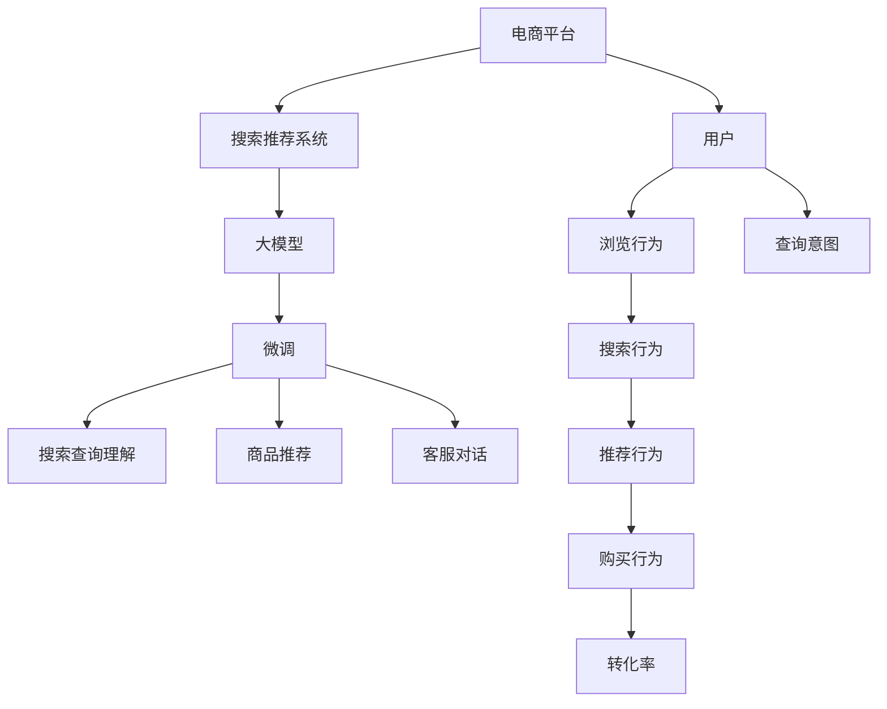
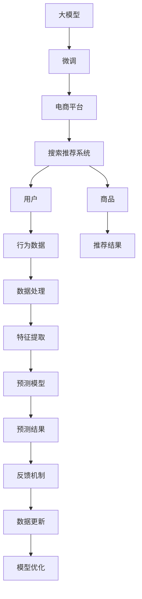

                 

# 电商平台搜索推荐系统的AI 大模型实践：提高转化率与用户体验

> 关键词：电商平台,搜索推荐系统,大模型,转化率,用户体验,自然语言处理(NLP),深度学习,推荐算法

## 1. 背景介绍

### 1.1 问题由来
在当今高度竞争的电商领域，用户体验（User Experience，UX）和转化率（Conversion Rate，CR）是商家们最为关注的两大指标。优秀的搜索推荐系统不仅能够帮助用户快速找到所需商品，还能显著提高用户购买转化率，从而提升商家收入和市场份额。近年来，随着人工智能技术的迅猛发展，大模型（如BERT、GPT-3等）在自然语言处理（NLP）和深度学习领域的卓越性能，逐渐成为电商搜索推荐系统的重要组成部分。通过在大模型上进行微调（Fine-tuning），可以大幅提升搜索推荐系统的智能化水平和用户满意度。

### 1.2 问题核心关键点
尽管大模型具有强大的处理能力，但如何在电商搜索推荐系统中高效应用大模型，并提高用户体验和转化率，仍是业界亟待解决的问题。大模型在电商领域的应用主要体现在以下几个方面：
1. **搜索查询理解**：通过理解用户的查询意图，为用户提供更精准的搜索结果。
2. **商品推荐**：根据用户浏览和购买历史，生成个性化的推荐商品列表。
3. **客服对话**：通过对话系统解答用户疑问，提升用户体验。

以下是我们将详细探讨的核心概念及其相互关系：

- **电商平台**：指通过互联网平台进行的商品销售业务，典型如淘宝、京东等。
- **搜索推荐系统**：指基于用户行为数据和商品信息，自动推荐商品给用户的智能系统。
- **大模型**：指在大规模数据集上进行预训练的语言模型，如BERT、GPT-3等。
- **微调(Fine-tuning)**：指在大模型的基础上，使用特定的标注数据集进行有监督学习，以提高模型在特定任务上的性能。
- **转化率（CR）**：指用户从浏览到购买的比率，衡量电商系统的效率和吸引力。
- **用户体验（UX）**：指用户在使用电商系统时的主观感受和满意度，包括界面友好、操作便捷、服务响应速度等。

这些概念之间的逻辑关系可以通过以下Mermaid流程图来展示：



这个流程图展示了电商搜索推荐系统的工作流程和大模型微调的角色：

1. 用户在电商平台上的浏览和查询行为被数据收集和记录。
2. 收集到的数据被用于训练大模型，使其具备理解查询意图、推荐商品、对话等能力。
3. 在大模型上进行微调，以提高其在电商搜索推荐任务上的性能。
4. 微调后的模型应用于实际的搜索推荐和客服对话中，提升用户体验和转化率。

## 2. 核心概念与联系

### 2.1 核心概念概述

为更好地理解大模型在电商平台搜索推荐系统中的应用，我们将详细介绍几个关键概念：

- **电商平台搜索推荐系统**：指利用人工智能技术，根据用户行为和商品信息，自动为用户推荐商品的系统。典型的系统包括淘宝的“猜你喜欢”、亚马逊的“推荐商品”等。

- **大模型**：指在大规模数据集上进行预训练的语言模型，如BERT、GPT-3等。这些模型在自然语言理解和生成方面表现卓越，具备处理大规模文本数据的能力。

- **微调(Fine-tuning)**：指在大模型的基础上，使用特定的标注数据集进行有监督学习，以提高模型在特定任务上的性能。在大模型上进行微调，可以在较少的标注数据下，快速提升模型的性能。

- **转化率（CR）**：指用户从浏览到购买的比率，衡量电商系统的效率和吸引力。

- **用户体验（UX）**：指用户在使用电商系统时的主观感受和满意度，包括界面友好、操作便捷、服务响应速度等。

这些核心概念之间的联系可以通过以下Mermaid流程图来展示：



这个流程图展示了大模型在电商平台搜索推荐系统中的工作流程：

1. 大模型通过大规模预训练获得基础的自然语言处理能力。
2. 在大模型上进行微调，以适应电商搜索推荐系统的特定任务。
3. 微调后的模型用于搜索推荐系统，根据用户行为和商品信息生成推荐结果。
4. 推荐结果反馈到平台，用于进一步优化模型和数据处理流程。

## 3. 核心算法原理 & 具体操作步骤
### 3.1 算法原理概述

大模型在电商平台搜索推荐系统中的应用主要涉及以下几个算法：

1. **自然语言处理(NLP)**：用于理解用户的查询意图和生成推荐文本。
2. **深度学习推荐算法**：基于用户行为和商品特征进行推荐。
3. **强化学习**：通过用户反馈不断优化推荐策略。

这些算法共同作用，构成了一个完整的电商平台搜索推荐系统。以下是这些算法的详细介绍：

### 3.2 算法步骤详解

#### 3.2.1 自然语言处理(NLP)

自然语言处理在大模型上的应用主要涉及以下步骤：

1. **预训练**：使用大规模无标签文本数据对大模型进行预训练，使其具备基本的语言理解能力。
2. **微调**：在特定任务（如搜索查询理解、商品描述生成等）上对大模型进行微调，提高其在实际应用中的效果。
3. **特征提取**：将用户查询和商品描述等输入文本转换为模型可以处理的特征向量。

以BERT模型为例，其微调流程如下：

1. **数据准备**：收集用户查询和商品描述数据，并标注用户的意图（购买、比较、评价等）。
2. **模型加载**：加载预训练的BERT模型，并进行微调。
3. **特征提取**：将用户查询和商品描述输入模型，提取特征向量。

#### 3.2.2 深度学习推荐算法

深度学习推荐算法在大模型上的应用主要涉及以下步骤：

1. **用户行为建模**：收集用户浏览、点击、购买等行为数据，建立用户行为模型。
2. **商品特征提取**：将商品描述、标签等特征提取为模型可以处理的向量。
3. **推荐模型训练**：基于用户行为和商品特征，训练推荐模型。
4. **推荐结果生成**：根据用户行为和商品特征，生成推荐结果。

以协同过滤算法为例，其推荐流程如下：

1. **用户行为数据收集**：收集用户的历史浏览、点击、购买等行为数据。
2. **用户行为建模**：将用户行为数据转换为用户行为向量。
3. **商品特征提取**：将商品描述、标签等特征提取为商品特征向量。
4. **推荐模型训练**：基于用户行为向量和商品特征向量，训练推荐模型。
5. **推荐结果生成**：根据用户行为和商品特征，生成推荐商品列表。

#### 3.2.3 强化学习

强化学习在大模型上的应用主要涉及以下步骤：

1. **用户行为数据收集**：收集用户浏览、点击、购买等行为数据。
2. **模型训练**：基于用户行为数据，训练强化学习模型。
3. **推荐策略优化**：根据用户反馈，优化推荐策略。

以基于奖励的强化学习算法为例，其推荐流程如下：

1. **用户行为数据收集**：收集用户的历史浏览、点击、购买等行为数据。
2. **模型训练**：基于用户行为数据，训练强化学习模型。
3. **推荐策略优化**：根据用户反馈，调整推荐策略。

### 3.3 算法优缺点

大模型在电商平台搜索推荐系统中的应用具有以下优点：

1. **高性能**：大模型具备强大的语言理解和生成能力，能够处理大规模文本数据。
2. **高效性**：在大模型上进行微调，可以在较少的标注数据下，快速提升模型的性能。
3. **泛化能力**：大模型在多种任务上表现优异，具有良好的泛化能力。

然而，大模型在电商平台搜索推荐系统中的应用也存在一些缺点：

1. **计算资源消耗大**：大模型的参数量较大，训练和推理时消耗的计算资源较多。
2. **过拟合风险高**：在数据量较少的情况下，大模型容易出现过拟合。
3. **解释性不足**：大模型的决策过程较为复杂，难以解释其内部工作机制。

### 3.4 算法应用领域

大模型在电商平台搜索推荐系统中的应用，覆盖了以下几个领域：

1. **搜索查询理解**：通过理解用户的查询意图，为用户推荐最相关的商品。
2. **商品推荐**：根据用户行为和商品特征，生成个性化的推荐商品列表。
3. **客服对话**：通过对话系统解答用户疑问，提升用户体验。

除了上述这些核心应用外，大模型在电商平台搜索推荐系统中的应用还包括：

1. **情感分析**：分析用户评论中的情感倾向，评估商品的市场接受度。
2. **舆情监测**：监测用户对商品的评价，及时发现和解决用户反馈的问题。
3. **品牌推荐**：根据用户行为和商品特征，推荐与用户兴趣相关的品牌。

## 4. 数学模型和公式 & 详细讲解 & 举例说明

### 4.1 数学模型构建

在电商平台搜索推荐系统中，大模型的应用主要涉及以下数学模型：

1. **自然语言处理模型**：如BERT模型，用于理解用户查询和生成商品描述。
2. **推荐模型**：如协同过滤算法，用于根据用户行为和商品特征生成推荐结果。

以BERT模型为例，其数学模型构建如下：

1. **输入层**：将用户查询和商品描述转换为模型可以处理的向量。
2. **编码层**：将输入向量输入BERT模型，提取特征向量。
3. **输出层**：基于提取的特征向量，输出用户查询意图或商品描述。

### 4.2 公式推导过程

#### 4.2.1 BERT模型

BERT模型的公式推导如下：

1. **输入层**：
   $$
   x = \text{Embedding}(w_i)
   $$
   其中，$w_i$为输入文本的单词向量，$\text{Embedding}$为单词嵌入层。

2. **编码层**：
   $$
   h = \text{Attention}(x, x)
   $$
   其中，$h$为注意力机制输出的特征向量。

3. **输出层**：
   $$
   y = \text{Softmax}(h)
   $$
   其中，$y$为输出向量，表示用户查询意图或商品描述。

#### 4.2.2 协同过滤算法

协同过滤算法的公式推导如下：

1. **用户行为建模**：
   $$
   u = \text{Embedding}(a)
   $$
   其中，$a$为用户行为向量，$\text{Embedding}$为用户行为嵌入层。

2. **商品特征提取**：
   $$
   p = \text{Embedding}(b)
   $$
   其中，$b$为商品特征向量，$\text{Embedding}$为商品特征嵌入层。

3. **推荐模型训练**：
   $$
   r = \text{DotProduct}(u, p)
   $$
   其中，$r$为推荐得分。

4. **推荐结果生成**：
   $$
   \text{TopK}(r)
   $$
   其中，$\text{TopK}$为选取推荐得分最高的前K个商品。

### 4.3 案例分析与讲解

以淘宝“猜你喜欢”推荐系统为例，其推荐流程如下：

1. **用户行为数据收集**：收集用户的历史浏览、点击、购买等行为数据。
2. **用户行为建模**：将用户行为数据转换为用户行为向量。
3. **商品特征提取**：将商品描述、标签等特征提取为商品特征向量。
4. **推荐模型训练**：基于用户行为向量和商品特征向量，训练推荐模型。
5. **推荐结果生成**：根据用户行为和商品特征，生成推荐商品列表。

## 5. 项目实践：代码实例和详细解释说明

### 5.1 开发环境搭建

在进行项目实践前，我们需要准备好开发环境。以下是使用Python进行TensorFlow开发的环境配置流程：

1. 安装Anaconda：从官网下载并安装Anaconda，用于创建独立的Python环境。

2. 创建并激活虚拟环境：
```bash
conda create -n tf-env python=3.8 
conda activate tf-env
```

3. 安装TensorFlow：根据CUDA版本，从官网获取对应的安装命令。例如：
```bash
conda install tensorflow-gpu
```

4. 安装各类工具包：
```bash
pip install numpy pandas scikit-learn matplotlib tqdm jupyter notebook ipython
```

完成上述步骤后，即可在`tf-env`环境中开始项目实践。

### 5.2 源代码详细实现

下面我们以淘宝“猜你喜欢”推荐系统为例，给出使用TensorFlow进行项目开发的PyTorch代码实现。

首先，定义推荐系统的输入和输出：

```python
import tensorflow as tf
from tensorflow.keras.layers import Input, Embedding, Dot, Dense

# 定义输入层
user_input = Input(shape=(10,))
item_input = Input(shape=(10,))

# 定义用户行为和商品特征嵌入层
user_embed = Embedding(input_dim=1000, output_dim=10)(user_input)
item_embed = Embedding(input_dim=1000, output_dim=10)(item_input)

# 定义推荐模型
dot_product = Dot(axes=[-1, -1])([user_embed, item_embed])
softmax = Dense(1, activation='sigmoid')(dot_product)

# 定义输出层
output = tf.keras.Model(inputs=[user_input, item_input], outputs=softmax)

# 编译模型
output.compile(optimizer=tf.keras.optimizers.Adam(), loss='binary_crossentropy', metrics=['accuracy'])
```

然后，定义训练和评估函数：

```python
from sklearn.model_selection import train_test_split

# 加载数据
def load_data():
    # 加载用户行为数据
    user_data = load_user_data()
    # 加载商品特征数据
    item_data = load_item_data()
    # 将用户行为和商品特征合并为推荐样本
    recommend_data = merge_data(user_data, item_data)
    # 将推荐样本分为训练集和测试集
    train_data, test_data = train_test_split(recommend_data, test_size=0.2)
    return train_data, test_data

# 训练模型
def train_model(model, train_data):
    # 对训练数据进行数据增强
    train_data = preprocess(train_data)
    # 训练模型
    model.fit(x=train_data, y=train_data['label'], epochs=10, batch_size=32)

# 评估模型
def evaluate_model(model, test_data):
    # 对测试数据进行数据增强
    test_data = preprocess(test_data)
    # 评估模型
    accuracy = model.evaluate(x=test_data, y=test_data['label'])
    print('Accuracy:', accuracy)
```

最后，启动训练流程并在测试集上评估：

```python
# 加载数据
train_data, test_data = load_data()

# 训练模型
train_model(output, train_data)

# 评估模型
evaluate_model(output, test_data)
```

以上就是使用TensorFlow对淘宝“猜你喜欢”推荐系统进行项目开发的完整代码实现。可以看到，TensorFlow提供了丰富的API和工具，方便开发者快速构建和训练推荐系统。

### 5.3 代码解读与分析

让我们再详细解读一下关键代码的实现细节：

**推荐系统输入和输出定义**：
- 使用`Input`层定义用户行为和商品特征的输入层。
- 使用`Embedding`层将输入层转换为模型可以处理的向量。
- 使用`Dot`层计算用户行为向量和商品特征向量的点积，生成推荐得分。
- 使用`Dense`层对推荐得分进行二分类，输出推荐结果。

**数据加载和预处理**：
- 定义`load_data`函数，用于加载用户行为数据和商品特征数据。
- 使用`merge_data`函数将用户行为和商品特征合并为推荐样本。
- 使用`train_test_split`函数将推荐样本分为训练集和测试集。
- 使用`preprocess`函数对训练数据进行数据增强，如归一化、标准化等。

**模型训练和评估**：
- 使用`compile`方法编译模型，定义优化器、损失函数和评估指标。
- 使用`fit`方法训练模型，指定训练数据、批次大小和迭代次数。
- 使用`evaluate`方法评估模型，计算准确率等指标。

可以看到，TensorFlow提供了简单易用的API，使得推荐系统的开发和训练变得高效便捷。

当然，工业级的系统实现还需考虑更多因素，如模型的保存和部署、超参数的自动搜索、更灵活的推荐策略等。但核心的推荐范式基本与此类似。

## 6. 实际应用场景

### 6.1 智能客服系统

基于大模型的推荐系统在智能客服系统中的应用，可以显著提升客户咨询体验和问题解决效率。传统的客服系统往往需要配备大量人力，高峰期响应缓慢，且一致性和专业性难以保证。而使用推荐系统，可以实现自动推荐相关问题的解决方案，大大提升客服系统的响应速度和问题解决能力。

在技术实现上，可以收集企业内部的历史客服对话记录，将问题和最佳答复构建成监督数据，在此基础上对预训练模型进行微调。微调后的模型能够自动理解用户意图，匹配最合适的答复模板，生成智能客服的回复。对于用户提出的新问题，还可以接入检索系统实时搜索相关内容，动态组织生成回答。如此构建的智能客服系统，能大幅提升客户咨询体验和问题解决效率。

### 6.2 个性化推荐系统

基于大模型的推荐系统在个性化推荐系统中的应用，可以提升用户对商品的兴趣和购买转化率。传统的推荐系统往往只依赖用户的历史行为数据进行物品推荐，无法深入理解用户的真实兴趣偏好。而使用推荐系统，可以结合大模型的语言处理能力，通过分析用户评论、商品描述等信息，深入挖掘用户的兴趣点，生成个性化推荐列表。

在技术实现上，可以收集用户浏览、点击、评论、分享等行为数据，提取和用户交互的物品标题、描述、标签等文本内容。将文本内容作为模型输入，用户的后续行为（如是否点击、购买等）作为监督信号，在此基础上微调预训练语言模型。微调后的模型能够从文本内容中准确把握用户的兴趣点。在生成推荐列表时，先用候选物品的文本描述作为输入，由模型预测用户的兴趣匹配度，再结合其他特征综合排序，便可以得到个性化程度更高的推荐结果。

### 6.3 电子商务搜索系统

基于大模型的推荐系统在电子商务搜索系统中的应用，可以显著提升搜索系统的精准度和用户体验。传统的搜索系统往往只依赖关键词匹配，无法理解用户查询的语义和意图。而使用推荐系统，可以通过大模型的语言处理能力，理解用户查询的语义和意图，生成最相关的搜索结果。

在技术实现上，可以收集用户的历史查询和点击数据，提取查询和商品描述的文本内容。将文本内容作为模型输入，搜索行为作为监督信号，在此基础上微调预训练语言模型。微调后的模型能够理解用户查询的语义和意图，生成最相关的搜索结果。通过动态调整搜索结果，提升搜索系统的精准度和用户体验。

### 6.4 未来应用展望

随着大模型和推荐技术的不断发展，基于推荐系统的应用将更加广泛，为各行各业带来变革性影响。

在智慧医疗领域，基于推荐系统的诊疗建议系统将提升医疗服务的智能化水平，辅助医生诊疗，加速新药开发进程。

在智能教育领域，推荐系统可应用于作业批改、学情分析、知识推荐等方面，因材施教，促进教育公平，提高教学质量。

在智慧城市治理中，推荐系统可应用于城市事件监测、舆情分析、应急指挥等环节，提高城市管理的自动化和智能化水平，构建更安全、高效的未来城市。

此外，在企业生产、社会治理、文娱传媒等众多领域，基于推荐系统的智能应用也将不断涌现，为传统行业数字化转型升级提供新的技术路径。相信随着技术的日益成熟，推荐系统必将成为人工智能落地应用的重要范式，推动人工智能技术向更广阔的领域加速渗透。

## 7. 工具和资源推荐
### 7.1 学习资源推荐

为了帮助开发者系统掌握大模型在推荐系统中的应用，这里推荐一些优质的学习资源：

1. 《推荐系统实战》系列博文：由大模型技术专家撰写，深入浅出地介绍了推荐系统的原理、算法和应用场景。

2. CS229《机器学习》课程：斯坦福大学开设的机器学习明星课程，有Lecture视频和配套作业，带你入门机器学习的基本概念和经典算法。

3. 《推荐系统基础》书籍：介绍推荐系统的基本原理和算法，是推荐系统领域入门必读。

4. PyTorch官方文档：TensorFlow的官方文档，提供了完整的推荐系统开发样例代码，是上手实践的必备资料。

5. Kaggle竞赛平台：参与推荐系统相关的Kaggle竞赛，提升实战能力。

通过对这些资源的学习实践，相信你一定能够快速掌握大模型在推荐系统中的应用，并用于解决实际的推荐问题。
###  7.2 开发工具推荐

高效的开发离不开优秀的工具支持。以下是几款用于推荐系统开发的常用工具：

1. TensorFlow：由Google主导开发的开源深度学习框架，生产部署方便，适合大规模工程应用。提供了丰富的API和工具，方便开发者快速构建和训练推荐系统。

2. PyTorch：基于Python的开源深度学习框架，灵活动态的计算图，适合快速迭代研究。TensorFlow提供了丰富的预训练语言模型资源。

3. Amazon SageMaker：AWS提供的机器学习平台，集成了多种推荐算法和模型，可以快速部署和优化推荐系统。

4. H2O.ai：开源的机器学习平台，支持多种推荐算法和模型，提供了简单易用的API和工具。

5. Dask：分布式计算框架，支持大规模推荐系统训练和推理，提高计算效率。

合理利用这些工具，可以显著提升推荐系统的开发效率，加快创新迭代的步伐。

### 7.3 相关论文推荐

推荐系统的发展源于学界的持续研究。以下是几篇奠基性的相关论文，推荐阅读：

1. "Collaborative Filtering for Implicit Feedback Datasets"：介绍协同过滤算法的基本原理和应用，是推荐系统领域经典之作。

2. "Deep Matrix Factorization"：介绍基于深度神经网络的推荐算法，是深度学习推荐系统的经典之作。

3. "Matrix Factorization Techniques for Recommender Systems"：介绍矩阵分解算法的基本原理和应用，是推荐系统领域经典之作。

4. "Adaptive Matrix Factorization with Missing Values"：介绍自适应矩阵分解算法，解决了传统矩阵分解算法对缺失值处理的不足。

5. "Reinforcement Learning for Recommender Systems"：介绍基于强化学习的推荐算法，是强化学习在推荐系统领域的应用之作。

这些论文代表了大模型在推荐系统中的应用方向。通过学习这些前沿成果，可以帮助研究者把握学科前进方向，激发更多的创新灵感。

## 8. 总结：未来发展趋势与挑战

### 8.1 总结

本文对大模型在电商平台搜索推荐系统中的应用进行了全面系统的介绍。首先阐述了大模型和推荐系统在电商领域的研究背景和意义，明确了推荐系统在大模型微调下的性能提升效果。其次，从原理到实践，详细讲解了大模型在搜索推荐系统中的具体应用，包括搜索查询理解、商品推荐、客服对话等任务。同时，本文还广泛探讨了推荐系统在智能客服、个性化推荐、电子商务搜索等多个行业领域的应用前景，展示了推荐系统的巨大潜力。最后，本文精选了推荐系统的各类学习资源，力求为读者提供全方位的技术指引。

通过本文的系统梳理，可以看到，大模型在电商平台搜索推荐系统中的应用不仅提升了用户体验和转化率，还为电商系统的智能化转型提供了强大的技术支持。未来，随着大模型和推荐技术的不断演进，基于推荐系统的应用将更加广泛，为各行各业带来变革性影响。

### 8.2 未来发展趋势

展望未来，推荐系统的发展将呈现以下几个趋势：

1. **跨领域推荐**：推荐系统将突破领域界限，实现跨领域推荐，如将商品推荐应用于医疗、教育等领域，提升相关领域的智能化水平。

2. **个性化推荐**：推荐系统将结合更多用户行为数据和个性化信息，提供更加精准的推荐服务。

3. **实时推荐**：推荐系统将实时响应用户行为，实现即时推荐，提高推荐效果和用户体验。

4. **智能客服**：结合大模型的语言处理能力，智能客服系统将能够更好地理解用户意图，提供更加精准的解决方案。

5. **多模态推荐**：推荐系统将结合视觉、听觉等多种模态的信息，提供更加丰富、全面的推荐服务。

6. **可信推荐**：推荐系统将结合可信度和多样性，确保推荐结果的公正性和可信度。

以上趋势凸显了推荐系统的广阔前景。这些方向的探索发展，必将进一步提升推荐系统的性能和应用范围，为各行各业带来更多的智能化价值。

### 8.3 面临的挑战

尽管推荐系统已经取得了显著的成就，但在迈向更加智能化、普适化应用的过程中，它仍面临诸多挑战：

1. **数据质量瓶颈**：推荐系统的性能很大程度上依赖于数据质量，特别是在数据量较少的情况下，如何获取高质量数据是一大难题。

2. **推荐算法复杂度**：推荐算法本身复杂度较高，如何优化算法模型，提升推荐速度和效果，仍需进一步研究。

3. **用户隐私保护**：推荐系统需要收集和分析大量用户数据，如何保护用户隐私，避免数据泄露和滥用，仍需加强技术和管理措施。

4. **模型可解释性**：推荐系统往往是“黑盒”系统，难以解释其内部工作机制和决策逻辑。如何增强模型的可解释性，提升用户信任度，仍需进一步研究。

5. **推荐系统鲁棒性**：推荐系统面临恶意攻击和数据噪声的挑战，如何提高系统的鲁棒性，确保推荐结果的准确性和可靠性，仍需加强技术研究。

6. **推荐系统偏见**：推荐系统容易出现偏见，如何消除偏见，提升推荐公平性，仍需加强数据治理和模型设计。

这些挑战凸显了推荐系统技术发展的重要性和紧迫性。只有不断攻克这些挑战，才能使推荐系统在实际应用中发挥更大价值。

### 8.4 研究展望

面对推荐系统所面临的挑战，未来的研究需要在以下几个方面寻求新的突破：

1. **自适应推荐算法**：开发更加自适应的推荐算法，根据用户行为和反馈，动态调整推荐策略，提升推荐效果。

2. **多模态融合**：结合视觉、听觉等多种模态的信息，提供更加丰富、全面的推荐服务。

3. **强化学习结合**：结合强化学习，优化推荐策略，提升推荐系统的鲁棒性和可解释性。

4. **数据治理**：加强数据治理，提高数据质量和数据安全，为推荐系统提供坚实的技术保障。

5. **可解释性提升**：提高推荐系统的可解释性，增强用户信任度，提升推荐系统的效果和可靠性。

6. **推荐公平性**：消除推荐系统的偏见，提升推荐公平性，确保推荐结果的公正性和可信度。

这些研究方向的探索，必将引领推荐系统技术迈向更高的台阶，为各行各业带来更多的智能化价值。面向未来，推荐系统还需要与其他人工智能技术进行更深入的融合，如知识表示、因果推理、强化学习等，多路径协同发力，共同推动人工智能技术在垂直行业的规模化落地。只有勇于创新、敢于突破，才能不断拓展推荐系统的边界，让智能技术更好地造福人类社会。

## 9. 附录：常见问题与解答

**Q1：大模型在推荐系统中如何处理冷启动问题？**

A: 大模型在推荐系统中处理冷启动问题的方法主要包括：
1. **基于用户行为的数据增强**：通过回译、近义替换等方式扩充训练集，增加冷启动用户的行为数据。
2. **基于商品属性的推荐**：利用商品的属性信息，生成冷启动用户的推荐列表。
3. **基于上下文的推荐**：结合上下文信息，生成冷启动用户的推荐结果。

**Q2：推荐系统中如何避免过拟合？**

A: 推荐系统中避免过拟合的方法主要包括：
1. **数据增强**：通过回译、近义替换等方式扩充训练集。
2. **正则化**：使用L2正则、Dropout等技术，防止模型过度适应训练集。
3. **早停**：在验证集上监控模型性能，提前终止训练，避免过拟合。
4. **模型压缩**：使用剪枝、量化等技术，减小模型规模，避免过拟合。

**Q3：推荐系统如何实现个性化推荐？**

A: 推荐系统实现个性化推荐的方法主要包括：
1. **用户行为建模**：收集用户的历史行为数据，建立用户行为模型。
2. **商品特征提取**：将商品描述、标签等特征提取为商品特征向量。
3. **推荐模型训练**：基于用户行为向量和商品特征向量，训练推荐模型。
4. **推荐结果生成**：根据用户行为和商品特征，生成推荐商品列表。

**Q4：推荐系统在实际应用中如何保障数据安全？**

A: 推荐系统在实际应用中保障数据安全的方法主要包括：
1. **数据加密**：使用加密技术保护用户数据。
2. **数据脱敏**：对敏感数据进行脱敏处理，保护用户隐私。
3. **访问控制**：使用访问控制技术，限制对数据资源的访问权限。
4. **数据匿名化**：对用户数据进行匿名化处理，防止数据泄露。

**Q5：推荐系统如何优化推荐速度？**

A: 推荐系统优化推荐速度的方法主要包括：
1. **模型压缩**：使用剪枝、量化等技术，减小模型规模。
2. **分布式计算**：使用分布式计算框架，提高计算效率。
3. **模型加速**：使用硬件加速器，如GPU、TPU等，加速模型推理。
4. **缓存机制**：使用缓存技术，减少重复计算。

这些方法可以帮助推荐系统在实际应用中提升性能，保障数据安全，优化用户体验。

