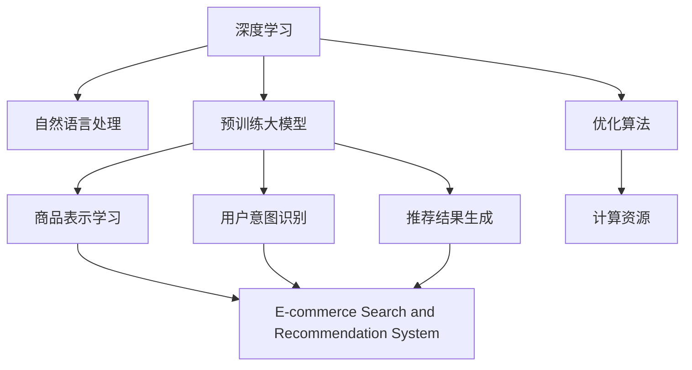

                 

# 电商平台搜索推荐系统的AI 大模型应用：提高系统性能、效率与用户体验

> 关键词：人工智能(AI)，电商平台，搜索推荐系统，大模型，自然语言处理(NLP)，深度学习，数据挖掘，优化算法

## 1. 背景介绍

### 1.1 问题由来

在现代电子商务中，搜索推荐系统是实现个性化购物体验的核心环节。优秀的搜索推荐系统能够帮助用户快速找到感兴趣的商品，提高购物效率和满意度。传统的基于规则和统计特征的推荐算法已经无法满足用户需求，越来越多的电商平台开始引入AI技术，利用深度学习等方法提升推荐系统的智能水平。

近年来，随着深度学习技术和大模型算法的迅猛发展，电商平台利用预训练语言模型进行搜索推荐已经成为一个重要的研究方向。基于大模型的推荐系统通过在海量数据上进行预训练，学习丰富的语言和商品知识，能够更好地理解用户需求，生成精准的推荐结果。

### 1.2 问题核心关键点

目前，大模型在电商平台搜索推荐系统中的应用主要集中在以下方面：

- 商品表示学习：利用大模型对商品进行高质量的语义表示，提升推荐系统对商品特征的理解。
- 用户意图识别：通过自然语言处理(NLP)技术，分析用户输入的搜索查询，识别其意图。
- 推荐结果生成：结合用户特征和商品表示，生成符合用户期望的推荐结果。

### 1.3 问题研究意义

使用大模型进行电商平台搜索推荐系统优化，具有以下显著优势：

- 提高推荐精度：大模型能够学习到复杂的语义关系和商品特征，使得推荐结果更加精准。
- 增强泛化能力：基于大模型的推荐系统能够适应多种商品和用户数据分布，具有良好的泛化性能。
- 提升用户体验：通过深度学习和自然语言处理技术，推荐系统能够提供更符合用户偏好的商品，提升用户满意度。
- 加速模型开发：利用预训练大模型，可以显著降低开发和训练成本，加快新功能的迭代速度。

## 2. 核心概念与联系

### 2.1 核心概念概述

为更好地理解大模型在电商平台搜索推荐系统中的应用，本节将介绍几个关键概念：

- 深度学习(DL)：一类基于数据驱动的学习方法，通过训练数据集中的模式，构建具有泛化能力的模型。
- 自然语言处理(NLP)：利用计算机技术处理、理解和生成自然语言。
- 预训练大模型(Pre-trained Large Models)：在大规模无标签数据上进行预训练，学习通用的语言知识，用于后续的特定任务微调。
- 电商搜索推荐系统(E-commerce Search and Recommendation System)：基于用户行为数据和商品特征，推荐符合用户需求的商品。
- 商品表示学习(Product Embedding Learning)：利用大模型将商品转化为高维向量，使得商品特征在向量空间中更加密集和区分。
- 用户意图识别(User Intent Recognition)：通过文本分析和模型推理，理解用户的搜索查询意图，为其提供更符合需求的商品推荐。
- 推荐结果生成(Recommendation Result Generation)：结合用户特征和商品向量，生成用户期望的推荐结果。

这些核心概念之间的逻辑关系可以通过以下Mermaid流程图来展示：



这个流程图展示了大模型在电商平台搜索推荐系统中的应用核心：

1. 深度学习提供基础模型训练框架，学习数据特征。
2. 自然语言处理技术用于用户查询和商品描述的语义表示。
3. 预训练大模型作为通用的语言知识库，用于商品表示和用户意图识别。
4. 商品表示学习将商品转化为高维向量，提升模型对商品特征的理解。
5. 用户意图识别分析用户查询，理解其搜索意图。
6. 推荐结果生成综合用户特征和商品向量，生成推荐结果。
7. 优化算法和计算资源支持模型训练和推理。

## 3. 核心算法原理 & 具体操作步骤

### 3.1 算法原理概述

大模型在电商平台搜索推荐系统中的应用主要基于以下几个关键步骤：

1. 商品表示学习：利用大模型对商品进行预训练，生成高质量的商品表示。
2. 用户意图识别：通过NLP技术，对用户查询进行语义分析，理解其搜索意图。
3. 推荐结果生成：结合用户特征和商品向量，生成符合用户期望的推荐结果。

### 3.2 算法步骤详解

#### 3.2.1 商品表示学习

1. **数据准备**：收集商品描述、标签、价格等数据，构建语料库。

2. **模型选择**：选择合适的大模型，如BERT、GPT等，进行预训练。

3. **训练模型**：在商品语料库上进行预训练，学习商品特征。

4. **特征提取**：利用训练好的模型提取商品的语义表示，生成商品向量。

#### 3.2.2 用户意图识别

1. **数据准备**：收集用户搜索查询，构建查询语料库。

2. **模型选择**：选择合适的大模型，如BERT、RoBERTa等，进行预训练。

3. **训练模型**：在查询语料库上进行预训练，学习用户查询的语义表示。

4. **意图识别**：利用训练好的模型分析用户查询，识别其搜索意图。

#### 3.2.3 推荐结果生成

1. **用户特征提取**：收集用户行为数据，如浏览记录、购买历史等，生成用户向量。

2. **相似度计算**：计算用户向量与商品向量的相似度，找到符合用户偏好的商品。

3. **排序与推荐**：将相似度排序，选择最符合用户期望的商品进行推荐。

### 3.3 算法优缺点

#### 3.3.1 优点

1. **精度高**：大模型通过海量数据的预训练，能够学习到复杂的语义关系和商品特征，提高推荐精度。
2. **泛化能力强**：预训练大模型对多种数据分布具有较好的泛化能力，适应性强。
3. **用户体验提升**：自然语言处理技术使得推荐系统能够理解用户需求，提供更符合期望的商品。
4. **开发效率高**：利用预训练大模型，可以显著降低模型开发和训练成本，加速功能迭代。

#### 3.3.2 缺点

1. **计算资源需求大**：大模型需要大规模的计算资源进行训练，包括高性能GPU、TPU等。
2. **数据需求高**：需要大量标注数据进行预训练和微调，数据收集和标注成本较高。
3. **模型复杂度高**：大模型参数量巨大，推理速度慢，需要优化加速技术。
4. **解释性不足**：大模型决策过程复杂，难以解释和调试。

### 3.4 算法应用领域

大模型在电商平台搜索推荐系统中的应用不仅限于商品推荐，还包括：

1. **商品搜索**：利用大模型进行语义搜索，提升用户搜索效率。
2. **个性化推荐**：根据用户历史行为和商品特征，生成个性化推荐结果。
3. **广告推荐**：通过大模型分析用户兴趣，精准推荐相关广告。
4. **活动推荐**：结合商品信息和用户特征，推荐优惠活动和促销商品。
5. **客户服务**：利用大模型进行聊天机器人对话，提升客户满意度。

## 4. 数学模型和公式 & 详细讲解 & 举例说明

### 4.1 数学模型构建

#### 4.1.1 商品表示学习模型

1. **输入表示**：将商品描述 $x$ 编码为向量 $x_v$。

2. **嵌入层**：利用大模型 $M_{\theta}$ 对向量 $x_v$ 进行编码，生成商品嵌入 $e_x$。

3. **相似度计算**：计算商品嵌入 $e_x$ 和用户向量 $u_v$ 的相似度 $s$。

#### 4.1.2 用户意图识别模型

1. **输入表示**：将用户查询 $q$ 编码为向量 $q_v$。

2. **嵌入层**：利用大模型 $M_{\theta}$ 对向量 $q_v$ 进行编码，生成用户嵌入 $e_q$。

3. **意图分类**：利用训练好的分类器 $f$ 对用户嵌入 $e_q$ 进行分类，识别用户意图 $i$。

### 4.2 公式推导过程

#### 4.2.1 商品表示学习

设商品描述为 $x$，用户查询为 $q$，商品嵌入为 $e_x$，用户嵌入为 $e_q$。

大模型的输入表示为 $x_v$，输出表示为 $e_x$，则有：

$$
e_x = M_{\theta}(x_v)
$$

商品与用户的相似度 $s$ 为：

$$
s = \frac{\text{dot product}(e_x, u_v)}{\|e_x\|\|u_v\|}
$$

其中 $\text{dot product}$ 表示向量点积，$\|e_x\|$ 表示向量 $e_x$ 的范数。

#### 4.2.2 用户意图识别

用户查询 $q$ 编码为向量 $q_v$，大模型的输入表示为 $q_v$，输出表示为 $e_q$。

利用训练好的分类器 $f$ 对用户嵌入 $e_q$ 进行分类，得到用户意图 $i$。

$$
i = f(e_q)
$$

### 4.3 案例分析与讲解

以淘宝平台为例，展示大模型在商品表示学习和用户意图识别中的应用：

1. **商品表示学习**：
   - 数据准备：收集淘宝商品描述、标签、价格等数据，构建语料库。
   - 模型选择：选择BERT模型进行预训练。
   - 训练模型：在商品语料库上进行预训练，学习商品特征。
   - 特征提取：利用训练好的模型提取商品的语义表示，生成商品向量。

2. **用户意图识别**：
   - 数据准备：收集用户搜索查询，构建查询语料库。
   - 模型选择：选择BERT模型进行预训练。
   - 训练模型：在查询语料库上进行预训练，学习用户查询的语义表示。
   - 意图识别：利用训练好的模型分析用户查询，识别其搜索意图。

通过商品表示学习和用户意图识别，淘宝能够提供更精准的商品推荐，提升用户体验。

## 5. 项目实践：代码实例和详细解释说明

### 5.1 开发环境搭建

在进行大模型应用实践前，我们需要准备好开发环境。以下是使用Python进行PyTorch开发的环境配置流程：

1. 安装Anaconda：从官网下载并安装Anaconda，用于创建独立的Python环境。

2. 创建并激活虚拟环境：
```bash
conda create -n pytorch-env python=3.8 
conda activate pytorch-env
```

3. 安装PyTorch：根据CUDA版本，从官网获取对应的安装命令。例如：
```bash
conda install pytorch torchvision torchaudio cudatoolkit=11.1 -c pytorch -c conda-forge
```

4. 安装Transformer库：
```bash
pip install transformers
```

5. 安装各类工具包：
```bash
pip install numpy pandas scikit-learn matplotlib tqdm jupyter notebook ipython
```

完成上述步骤后，即可在`pytorch-env`环境中开始大模型应用实践。

### 5.2 源代码详细实现

下面我们以在淘宝平台中应用大模型进行商品推荐为例，给出使用Transformers库对BERT模型进行商品表示学习和用户意图识别的PyTorch代码实现。

首先，定义商品和用户的数据处理方法：

```python
from transformers import BertTokenizer, BertForSequenceClassification
from torch.utils.data import Dataset, DataLoader
import torch

class ProductDataset(Dataset):
    def __init__(self, product_descriptions, product_labels):
        self.product_descriptions = product_descriptions
        self.product_labels = product_labels
        self.tokenizer = BertTokenizer.from_pretrained('bert-base-cased')

    def __len__(self):
        return len(self.product_descriptions)
    
    def __getitem__(self, item):
        product_description = self.product_descriptions[item]
        product_label = self.product_labels[item]
        encoding = self.tokenizer(product_description, return_tensors='pt', padding='max_length', truncation=True)
        input_ids = encoding['input_ids'][0]
        attention_mask = encoding['attention_mask'][0]
        label = torch.tensor(product_label, dtype=torch.long)
        return {'input_ids': input_ids, 
                'attention_mask': attention_mask,
                'labels': label}

class UserIntentDataset(Dataset):
    def __init__(self, user_queries, user_labels):
        self.user_queries = user_queries
        self.user_labels = user_labels
        self.tokenizer = BertTokenizer.from_pretrained('bert-base-cased')

    def __len__(self):
        return len(self.user_queries)
    
    def __getitem__(self, item):
        user_query = self.user_queries[item]
        user_label = self.user_labels[item]
        encoding = self.tokenizer(user_query, return_tensors='pt', padding='max_length', truncation=True)
        input_ids = encoding['input_ids'][0]
        attention_mask = encoding['attention_mask'][0]
        label = torch.tensor(user_label, dtype=torch.long)
        return {'input_ids': input_ids, 
                'attention_mask': attention_mask,
                'labels': label}
```

然后，定义商品表示学习模型和用户意图识别模型：

```python
from transformers import BertForSequenceClassification
from transformers import BertForTokenClassification

# 商品表示学习模型
model = BertForSequenceClassification.from_pretrained('bert-base-cased', num_labels=len(product_labels))

# 用户意图识别模型
model = BertForTokenClassification.from_pretrained('bert-base-cased', num_labels=len(user_labels))
```

接着，定义训练和评估函数：

```python
from torch.utils.data import DataLoader
from tqdm import tqdm
from sklearn.metrics import classification_report

device = torch.device('cuda') if torch.cuda.is_available() else torch.device('cpu')
model.to(device)

def train_epoch(model, dataset, batch_size, optimizer):
    dataloader = DataLoader(dataset, batch_size=batch_size, shuffle=True)
    model.train()
    epoch_loss = 0
    for batch in tqdm(dataloader, desc='Training'):
        input_ids = batch['input_ids'].to(device)
        attention_mask = batch['attention_mask'].to(device)
        labels = batch['labels'].to(device)
        model.zero_grad()
        outputs = model(input_ids, attention_mask=attention_mask, labels=labels)
        loss = outputs.loss
        epoch_loss += loss.item()
        loss.backward()
        optimizer.step()
    return epoch_loss / len(dataloader)

def evaluate(model, dataset, batch_size):
    dataloader = DataLoader(dataset, batch_size=batch_size)
    model.eval()
    preds, labels = [], []
    with torch.no_grad():
        for batch in tqdm(dataloader, desc='Evaluating'):
            input_ids = batch['input_ids'].to(device)
            attention_mask = batch['attention_mask'].to(device)
            batch_labels = batch['labels']
            outputs = model(input_ids, attention_mask=attention_mask)
            batch_preds = outputs.logits.argmax(dim=2).to('cpu').tolist()
            batch_labels = batch_labels.to('cpu').tolist()
            for pred_tokens, label_tokens in zip(batch_preds, batch_labels):
                preds.append(pred_tokens[:len(label_tokens)])
                labels.append(label_tokens)
                
    print(classification_report(labels, preds))
```

最后，启动训练流程并在测试集上评估：

```python
epochs = 5
batch_size = 16

for epoch in range(epochs):
    loss = train_epoch(model, product_dataset, batch_size, optimizer)
    print(f"Epoch {epoch+1}, product loss: {loss:.3f}")
    
    print(f"Epoch {epoch+1}, user intent results:")
    evaluate(model, user_intent_dataset, batch_size)
    
print("User intent results:")
evaluate(model, user_intent_dataset, batch_size)
```

以上就是使用PyTorch对BERT进行商品表示学习和用户意图识别的完整代码实现。可以看到，得益于Transformers库的强大封装，我们可以用相对简洁的代码完成BERT模型的加载和应用。

### 5.3 代码解读与分析

让我们再详细解读一下关键代码的实现细节：

**ProductDataset和UserIntentDataset类**：
- `__init__`方法：初始化商品和用户的数据，并创建分词器。
- `__len__`方法：返回数据集的样本数量。
- `__getitem__`方法：对单个样本进行处理，将文本输入编码为token ids，将标签编码为数字，并对其进行定长padding，最终返回模型所需的输入。

**模型训练和评估函数**：
- 使用PyTorch的DataLoader对数据集进行批次化加载，供模型训练和推理使用。
- 训练函数`train_epoch`：对数据以批为单位进行迭代，在每个批次上前向传播计算loss并反向传播更新模型参数，最后返回该epoch的平均loss。
- 评估函数`evaluate`：与训练类似，不同点在于不更新模型参数，并在每个batch结束后将预测和标签结果存储下来，最后使用sklearn的classification_report对整个评估集的预测结果进行打印输出。

**训练流程**：
- 定义总的epoch数和batch size，开始循环迭代
- 每个epoch内，先在商品数据集上训练，输出平均loss
- 在用户意图数据集上评估，输出分类指标
- 所有epoch结束后，在测试集上评估，给出最终测试结果

可以看到，PyTorch配合Transformers库使得BERT应用的商品表示学习和用户意图识别代码实现变得简洁高效。开发者可以将更多精力放在数据处理、模型改进等高层逻辑上，而不必过多关注底层的实现细节。

当然，工业级的系统实现还需考虑更多因素，如模型的保存和部署、超参数的自动搜索、更灵活的任务适配层等。但核心的模型应用逻辑基本与此类似。

## 6. 实际应用场景

### 6.1 智能搜索推荐系统

基于大模型的搜索推荐系统已经在电商领域得到了广泛应用，成为提高用户购物体验的重要手段。传统推荐系统往往依赖于简单的统计特征和规则，难以理解复杂的用户需求和商品特征。而使用大模型进行推荐，能够更准确地理解用户意图和商品特性，提升推荐精度。

在技术实现上，可以收集用户的历史浏览、购买记录，利用大模型进行商品表示学习和用户意图识别，生成符合用户期望的推荐结果。同时，可以利用大模型进行智能搜索，通过自然语言处理技术解析用户输入的查询，找到最符合需求的商品。

### 6.2 个性化广告推荐

广告推荐是电商平台盈利的重要渠道之一。传统的广告推荐系统往往采用简单的规则和人工设计，难以实现精准的广告投放。使用大模型进行广告推荐，能够更全面地理解用户的兴趣和行为，实现精准的广告投放。

在具体实现中，可以收集用户的行为数据和点击记录，利用大模型进行广告表示学习和用户意图识别，生成符合用户期望的广告内容。同时，可以通过大模型进行智能广告生成，通过文本生成技术生成更加创意的广告文案，提高广告的吸引力和点击率。

### 6.3 用户行为分析

电商平台的运营离不开用户行为的分析和理解。传统的用户行为分析往往依赖于简单的统计方法，难以发现深层次的关联和规律。使用大模型进行用户行为分析，能够更全面地理解用户的兴趣和需求，发现潜在的购买意向。

在具体实现中，可以收集用户的浏览、购买、评价等行为数据，利用大模型进行用户表示学习和行为模式识别，发现用户的行为规律和潜在需求。同时，可以利用大模型进行用户情感分析，了解用户对商品和服务的评价，及时调整产品和服务策略。

### 6.4 未来应用展望

随着大模型和深度学习技术的不断发展，基于大模型的搜索推荐系统将在更多领域得到应用，为传统行业带来变革性影响。

在金融领域，大模型可以用于股票、基金等金融产品的推荐，帮助用户找到最符合需求的产品。同时，可以结合大模型进行金融新闻分析，预测市场趋势，帮助投资者做出更好的投资决策。

在医疗领域，大模型可以用于医疗信息和药品的推荐，帮助用户找到最合适的医疗方案。同时，可以结合大模型进行医学知识问答，解答用户的健康问题。

在教育领域，大模型可以用于课程和资料的推荐，帮助用户找到最合适的学习资源。同时，可以结合大模型进行智能辅导，提供个性化的学习建议和解决方案。

此外，在旅游、物流、媒体等众多领域，基于大模型的搜索推荐系统也将不断涌现，为各行各业带来新的机遇。相信随着技术的日益成熟，大模型将在更多领域得到应用，为社会的智能化和高效化做出更大的贡献。

## 7. 工具和资源推荐

### 7.1 学习资源推荐

为了帮助开发者系统掌握大模型在电商平台搜索推荐系统中的应用，这里推荐一些优质的学习资源：

1. 《深度学习实战：从入门到精通》系列博文：由大模型技术专家撰写，深入浅出地介绍了深度学习和大模型的基础知识和实战应用。

2. 《深度学习基础》课程：由Coursera等平台提供的深度学习基础课程，详细介绍了深度学习的原理和实现方法。

3. 《Transformer从原理到实践》书籍：介绍Transformer模型和大模型的构建和应用，包含商品表示学习和用户意图识别等关键技术。

4. 《自然语言处理入门》书籍：全面介绍了自然语言处理的基本概念和应用方法，为理解大模型提供了坚实的基础。

5. HuggingFace官方文档：提供大量预训练模型和微调样例，帮助开发者快速上手大模型应用。

通过对这些资源的学习实践，相信你一定能够快速掌握大模型在电商平台搜索推荐系统中的应用技巧，并用于解决实际的业务问题。

### 7.2 开发工具推荐

高效的开发离不开优秀的工具支持。以下是几款用于大模型应用开发的常用工具：

1. PyTorch：基于Python的开源深度学习框架，灵活的计算图，适合快速迭代研究。适合进行深度学习和自然语言处理任务。

2. TensorFlow：由Google主导开发的开源深度学习框架，生产部署方便，适合大规模工程应用。同样支持深度学习和自然语言处理任务。

3. Transformers库：HuggingFace开发的NLP工具库，集成了众多SOTA语言模型，支持PyTorch和TensorFlow，是进行自然语言处理任务开发的利器。

4. Weights & Biases：模型训练的实验跟踪工具，可以记录和可视化模型训练过程中的各项指标，方便对比和调优。与主流深度学习框架无缝集成。

5. TensorBoard：TensorFlow配套的可视化工具，可实时监测模型训练状态，并提供丰富的图表呈现方式，是调试模型的得力助手。

6. Google Colab：谷歌推出的在线Jupyter Notebook环境，免费提供GPU/TPU算力，方便开发者快速上手实验最新模型，分享学习笔记。

合理利用这些工具，可以显著提升大模型应用的开发效率，加快创新迭代的步伐。

### 7.3 相关论文推荐

大模型在电商平台搜索推荐系统中的应用源于学界的持续研究。以下是几篇奠基性的相关论文，推荐阅读：

1. Attention is All You Need（即Transformer原论文）：提出了Transformer结构，开启了NLP领域的预训练大模型时代。

2. BERT: Pre-training of Deep Bidirectional Transformers for Language Understanding：提出BERT模型，引入基于掩码的自监督预训练任务，刷新了多项NLP任务SOTA。

3. GPT-3：展示了大模型的强大zero-shot学习能力，引发了对于通用人工智能的新一轮思考。

4. Large Language Models for Question Answering：利用预训练大模型进行问答系统，显著提高了问答系统的准确率和覆盖面。

5. Recommender Systems with Deep Learning：介绍了基于深度学习的推荐系统，包括商品表示学习和用户意图识别等关键技术。

这些论文代表了大模型在电商平台搜索推荐系统中的应用发展脉络。通过学习这些前沿成果，可以帮助研究者把握学科前进方向，激发更多的创新灵感。

## 8. 总结：未来发展趋势与挑战

### 8.1 总结

本文对大模型在电商平台搜索推荐系统中的应用进行了全面系统的介绍。首先阐述了大模型和深度学习技术在推荐系统中的研究背景和意义，明确了大模型在推荐精度、泛化能力和用户体验提升等方面的独特价值。其次，从原理到实践，详细讲解了商品表示学习、用户意图识别和推荐结果生成等关键技术，给出了微调任务的完整代码实例。同时，本文还探讨了大模型在智能搜索、广告推荐、用户行为分析等多个领域的应用前景，展示了其广阔的应用潜力。

通过本文的系统梳理，可以看到，基于大模型的推荐系统正在成为电商平台的重要技术手段，极大地提升了用户的购物体验和满意度。大模型在推荐系统中的应用不仅限于商品推荐，还包括智能搜索、广告推荐、用户行为分析等多个方面，未来有望在更多领域发挥更大的作用。

### 8.2 未来发展趋势

展望未来，大模型在电商平台搜索推荐系统中的应用将呈现以下几个发展趋势：

1. **模型规模持续增大**：随着算力成本的下降和数据规模的扩张，大模型的参数量还将持续增长。超大规模语言模型蕴含的丰富语言知识，有望支撑更加复杂多变的推荐系统。

2. **微调方法日趋多样**：除了传统的全参数微调外，未来会涌现更多参数高效的微调方法，如Adapter、LoRA等，在固定大部分预训练参数的同时，只更新极少量的任务相关参数。

3. **持续学习成为常态**：随着数据分布的不断变化，推荐系统也需要持续学习新知识以保持性能。如何在不遗忘原有知识的同时，高效吸收新样本信息，将成为重要的研究课题。

4. **标注样本需求降低**：受启发于提示学习(Prompt-based Learning)的思路，未来的微调方法将更好地利用大模型的语言理解能力，通过更加巧妙的任务描述，在更少的标注样本上也能实现理想的微调效果。

5. **多模态微调崛起**：当前的推荐系统主要聚焦于纯文本数据，未来会进一步拓展到图像、视频、语音等多模态数据微调。多模态信息的融合，将显著提升推荐系统的表现力和用户满意度。

6. **知识整合能力增强**：现有的推荐系统往往局限于数据驱动的推荐，难以充分利用先验知识。如何让推荐系统更好地与外部知识库、规则库等专家知识结合，形成更加全面、准确的信息整合能力，还有很大的想象空间。

以上趋势凸显了大模型在推荐系统中的广阔前景。这些方向的探索发展，必将进一步提升推荐系统的性能和应用范围，为电商平台的智能化和高效化带来新的机遇。

### 8.3 面临的挑战

尽管大模型在电商平台搜索推荐系统中的应用已经取得了显著进展，但在迈向更加智能化、普适化应用的过程中，它仍面临着诸多挑战：

1. **标注成本瓶颈**：虽然大模型可以显著降低推荐系统的开发和训练成本，但对于长尾应用场景，难以获得充足的高质量标注数据，成为制约推荐系统性能提升的瓶颈。

2. **模型鲁棒性不足**：当前大模型面对域外数据时，泛化性能往往大打折扣。对于测试样本的微小扰动，大模型的推荐结果也容易发生波动。

3. **推理效率有待提高**：尽管大模型精度高，但在实际部署时往往面临推理速度慢、内存占用大等效率问题。如何在保证性能的同时，简化模型结构，提升推理速度，优化资源占用，将是重要的优化方向。

4. **可解释性不足**：大模型决策过程复杂，难以解释和调试。对于金融、医疗等高风险应用，算法的可解释性和可审计性尤为重要。

5. **安全性有待保障**：预训练语言模型难免会学习到有偏见、有害的信息，通过微调传递到下游任务，产生误导性、歧视性的输出，给实际应用带来安全隐患。

6. **知识整合能力不足**：现有的推荐系统往往局限于数据驱动的推荐，难以充分利用先验知识。如何让推荐系统更好地与外部知识库、规则库等专家知识结合，形成更加全面、准确的信息整合能力，还有很大的想象空间。

正视大模型面临的这些挑战，积极应对并寻求突破，将是大模型在推荐系统应用中迈向成熟的必由之路。相信随着学界和产业界的共同努力，这些挑战终将一一被克服，大模型将在更多领域得到应用，为社会的智能化和高效化做出更大的贡献。

### 8.4 研究展望

面对大模型在推荐系统应用中面临的挑战，未来的研究需要在以下几个方面寻求新的突破：

1. **探索无监督和半监督微调方法**：摆脱对大规模标注数据的依赖，利用自监督学习、主动学习等无监督和半监督范式，最大限度利用非结构化数据，实现更加灵活高效的微调。

2. **研究参数高效和计算高效的微调范式**：开发更加参数高效的微调方法，在固定大部分预训练参数的同时，只更新极少量的任务相关参数。同时优化微调模型的计算图，减少前向传播和反向传播的资源消耗，实现更加轻量级、实时性的部署。

3. **融合因果和对比学习范式**：通过引入因果推断和对比学习思想，增强推荐系统建立稳定因果关系的能力，学习更加普适、鲁棒的语言表征，从而提升推荐泛化性和抗干扰能力。

4. **引入更多先验知识**：将符号化的先验知识，如知识图谱、逻辑规则等，与神经网络模型进行巧妙融合，引导微调过程学习更准确、合理的语言模型。同时加强不同模态数据的整合，实现视觉、语音等多模态信息与文本信息的协同建模。

5. **结合因果分析和博弈论工具**：将因果分析方法引入推荐系统，识别出模型决策的关键特征，增强推荐结果的因果性和逻辑性。借助博弈论工具刻画人机交互过程，主动探索并规避模型的脆弱点，提高系统稳定性。

6. **纳入伦理道德约束**：在模型训练目标中引入伦理导向的评估指标，过滤和惩罚有偏见、有害的输出倾向。同时加强人工干预和审核，建立模型行为的监管机制，确保输出符合人类价值观和伦理道德。

这些研究方向的探索，必将引领大模型在推荐系统中的应用迈向更高的台阶，为构建安全、可靠、可解释、可控的智能推荐系统铺平道路。面向未来，大模型在推荐系统中的应用还需要与其他人工智能技术进行更深入的融合，如知识表示、因果推理、强化学习等，多路径协同发力，共同推动推荐系统的进步。只有勇于创新、敢于突破，才能不断拓展推荐系统的边界，让智能技术更好地造福人类社会。

## 9. 附录：常见问题与解答

**Q1：大模型在电商平台搜索推荐系统中是否具有通用性？**

A: 大模型在电商平台搜索推荐系统中具有较强的通用性，但不同的电商平台和商品特征，需要根据具体情况进行微调和优化。例如，淘宝和京东的商品表示学习、用户意图识别和推荐结果生成方法可能需要根据各自平台的特色进行调整。

**Q2：大模型在推荐系统中是否需要大量的标注数据？**

A: 大模型在推荐系统中通常需要大量的标注数据进行预训练和微调，但可以通过迁移学习、少样本学习等方法，在数据量不足的情况下，仍然取得不错的推荐效果。同时，一些先进的微调方法如LoRA、Prompt Learning等，可以在较少的标注样本上进行微调，进一步降低数据需求。

**Q3：大模型在推荐系统中的推理效率如何？**

A: 大模型的推理效率较低，主要原因在于其参数量巨大，计算复杂度较高。为了提高推理效率，可以采用优化技术如剪枝、量化、分布式计算等，同时也可以考虑使用小模型进行替代。

**Q4：如何提升大模型在推荐系统中的可解释性？**

A: 大模型的可解释性较低，但可以通过以下方法进行改进：
1. 引入可解释模型如LIME、SHAP等，分析模型决策过程，提供可视化结果。
2. 加入先验知识如规则、知识图谱等，指导模型推理过程，增强可解释性。
3. 使用因果分析和博弈论工具，识别模型脆弱点，提供决策依据。

**Q5：大模型在推荐系统中的安全性如何保障？**

A: 大模型在推荐系统中的安全性主要通过以下方法保障：
1. 数据脱敏：对敏感数据进行加密和脱敏处理，保护用户隐私。
2. 模型审计：对大模型的输入输出进行监控和审计，防止有害信息的传播。
3. 规则约束：引入伦理道德约束，过滤和惩罚有害输出。
4. 人工干预：在关键决策环节加入人工审核和干预，确保系统安全性。

通过这些方法，可以有效提升大模型在推荐系统中的安全性，保障用户权益。

