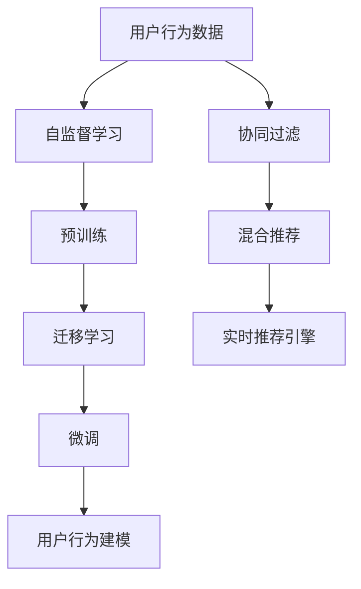

                 

# 电商平台搜索推荐系统的AI 大模型应用：提高系统性能、效率与转化率

## 1. 背景介绍

### 1.1 问题由来

在电子商务平台，搜索推荐系统是用户体验的核心组成部分，直接影响用户满意度、购买转化率等关键指标。传统的搜索推荐算法，如TF-IDF、协同过滤、深度学习等，在个性化推荐、长尾商品推荐等方面存在瓶颈。近年来，基于大模型的推荐系统开始崭露头角，利用先进的深度学习和自然语言处理技术，从海量用户行为数据中挖掘知识，生成高质量的个性化推荐结果。

大模型的推荐系统不仅在电商行业，也在其他领域，如社交媒体、新闻媒体、在线视频等得到广泛应用，显著提升了用户满意度，提高了系统效率，进而提升转化率和经济效益。

### 1.2 问题核心关键点

构建高效、精准的搜索推荐系统，主要围绕以下关键点进行：
1. **数据质量与多样性**：用户行为数据是模型训练的基础，高质量、多样化的数据是提升推荐效果的前提。
2. **模型架构与训练**：选择合适的模型架构，采用高效的训练策略，确保模型在有限资源下获得最佳性能。
3. **推荐逻辑与用户体验**：结合业务逻辑，设计合理的推荐算法和交互界面，提升用户体验和信任度。
4. **性能与效率优化**：优化模型推理速度和内存占用，确保系统在高并发场景下稳定运行。

## 2. 核心概念与联系

### 2.1 核心概念概述

为更好地理解基于大模型的电商平台搜索推荐系统，本节将介绍几个关键概念：

- **大模型**：基于Transformer等先进架构的深度学习模型，如BERT、GPT等。在电商推荐中，通过大规模无监督学习获取用户行为和商品特征的表示。
- **推荐系统**：自动从用户行为数据中提取有用信息，为用户推荐个性化商品或服务的系统。大模型推荐系统通常分为召回和排序两个步骤。
- **协同过滤**：基于用户和物品历史行为相似性进行推荐的方法。大模型推荐系统通常融入协同过滤，形成混合推荐策略。
- **自监督学习**：在无标签数据上训练模型，学习通用的知识表示。大模型推荐系统通常先在大规模语料上预训练，再对电商数据进行微调。
- **迁移学习**：将一个领域的知识迁移到另一个领域，以降低新领域数据需求。大模型推荐系统通过预训练-微调的方式，从通用领域学习知识并迁移到电商领域。
- **用户行为建模**：通过建模用户点击、浏览、评分等行为，捕捉用户兴趣和偏好。大模型推荐系统通常利用自监督学习提取用户行为特征，用于推荐决策。
- **实时推荐引擎**：实现高效的实时推荐算法，并即时响应用户查询。大模型推荐系统通过优化模型推理和缓存策略，提升实时性。

这些核心概念之间的逻辑关系可以通过以下Mermaid流程图来展示：



这个流程图展示了大模型推荐系统的核心概念及其之间的关系：

1. 用户行为数据是大模型的基础。
2. 自监督学习用于从用户行为中提取通用知识。
3. 预训练模型通过无监督学习获得广泛的语言和领域知识。
4. 迁移学习将预训练模型知识迁移到电商推荐任务上。
5. 微调模型在电商数据上进一步优化和适配。
6. 混合推荐策略综合利用协同过滤与大模型推荐。
7. 用户行为建模通过用户数据训练，捕捉用户兴趣。
8. 实时推荐引擎实现高效的推荐响应。

这些概念共同构成了大模型推荐系统的核心框架，使其能够在电商场景下提供高质量的推荐服务。

## 3. 核心算法原理 & 具体操作步骤
### 3.1 算法原理概述

基于大模型的电商平台搜索推荐系统，通过在无监督数据上预训练大模型，获取通用知识表示。然后，对电商数据进行微调，学习用户行为和商品特征的表示，并利用迁移学习将通用知识迁移到电商领域，提升推荐效果。具体步骤如下：

1. **数据准备**：收集用户行为数据，包括点击、浏览、评分等。预处理数据，构建训练集、验证集和测试集。
2. **模型加载**：选择预训练模型（如BERT、GPT等），并加载到模型中。
3. **数据编码**：使用分词器将用户行为数据转化为模型所需的格式，如输入序列和标签序列。
4. **微调训练**：对预训练模型进行微调，学习电商数据中的特定知识。
5. **性能评估**：在验证集和测试集上评估推荐模型的效果，选择最优参数。
6. **部署上线**：将训练好的模型部署到实时推荐引擎中，实现高效推荐。

### 3.2 算法步骤详解

#### 3.2.1 数据预处理

用户行为数据预处理是推荐系统构建的基础。主要步骤包括：
1. **数据清洗**：去除重复、缺失、异常数据。
2. **数据增强**：通过时间戳排序、随机化等方式增强数据多样性。
3. **特征工程**：提取有用的特征，如用户ID、商品ID、评分、点击时间等。
4. **序列构建**：将用户行为序列转化为模型所需的输入序列。
5. **编码转化**：将用户行为数据转化为模型所需的格式，如input_ids和attention_mask。

#### 3.2.2 模型微调

在大模型上进行电商数据微调，主要步骤包括：
1. **加载模型**：选择预训练模型并加载到内存。
2. **设定超参数**：包括学习率、批大小、优化器等。
3. **数据加载**：加载训练集、验证集和测试集。
4. **模型初始化**：将模型参数初始化为预训练权重。
5. **微调训练**：在训练集上前向传播计算损失，反向传播更新参数，并在验证集上定期评估效果。
6. **模型保存**：保存训练好的模型，供后续使用。

#### 3.2.3 模型部署

将微调后的模型部署到实时推荐引擎中，主要步骤包括：
1. **选择部署平台**：如AWS、Google Cloud、阿里云等，确保系统可扩展性。
2. **模型压缩与裁剪**：对模型进行压缩和裁剪，减小内存占用和推理时间。
3. **优化推理**：采用优化器如TensorRT，提升推理速度和效率。
4. **缓存策略**：引入缓存机制，加速高频查询的响应。
5. **性能测试**：在新样本上进行测试，确保系统性能和准确性。

### 3.3 算法优缺点

基于大模型的电商平台搜索推荐系统有以下优点：
1. **效果显著**：通过学习大规模语料和电商数据，推荐模型能捕捉用户行为和商品特征，提供高质量推荐。
2. **适应性强**：通用知识在大模型中学习得到，通过微调适配电商数据，提升系统泛化能力。
3. **可解释性**：大模型推荐系统能够解释推荐理由，提升用户信任度。
4. **可扩展性**：基于大模型的推荐系统易于部署和扩展，满足大规模用户需求。

同时，该方法也存在以下局限性：
1. **数据依赖**：推荐效果高度依赖高质量、多样化的数据，数据采集成本较高。
2. **计算需求**：大模型训练和推理需要大量计算资源，部署和维护成本较高。
3. **模型复杂**：大模型结构复杂，模型优化和部署需要专业技能。
4. **隐私风险**：用户行为数据涉及隐私，需采取严格的数据保护措施。
5. **鲁棒性不足**：在面对复杂、不确定的用户行为时，大模型可能表现不稳定。

尽管存在这些局限性，但就目前而言，基于大模型的推荐系统仍是最先进的技术范式，值得在电商等领域进行深入研究和应用。

### 3.4 算法应用领域

基于大模型的电商平台搜索推荐系统，已广泛应用于以下领域：

- **个性化推荐**：根据用户历史行为和实时浏览记录，生成个性化商品推荐列表。
- **长尾商品推荐**：捕捉用户对少点击商品的需求，提升长尾商品的曝光率。
- **实时推荐**：利用实时查询数据，动态生成推荐结果，提升用户体验。
- **内容推荐**：推荐相关文章、视频、音频等，满足用户多样化需求。
- **搜索优化**：优化搜索结果排序，提升搜索体验和满意度。
- **广告推荐**：基于用户行为和兴趣，推荐相关广告，提高广告点击率。

除了电商领域，大模型推荐系统也在社交媒体、在线视频、新闻媒体等领域得到广泛应用，成为提升用户体验的重要工具。

## 4. 数学模型和公式 & 详细讲解  
### 4.1 数学模型构建

假设电商平台推荐系统为用户$i$推荐商品$j$，用户行为数据为$X$，商品特征为$Y$。推荐系统可以建模为如下框架：

$$
\begin{aligned}
\text{推荐结果} &= \text{用户特征表示} \times \text{商品特征表示} \\
&= \text{User Embedding}(X) \times \text{Item Embedding}(Y)
\end{aligned}
$$

其中，$\text{User Embedding}(X)$表示用户行为数据的嵌入向量，$\text{Item Embedding}(Y)$表示商品特征的嵌入向量。推荐结果可以通过神经网络进行建模，如$softmax$函数、线性回归等。

### 4.2 公式推导过程

考虑一个简单的用户-商品推荐模型，采用全连接神经网络进行预测。假设用户行为数据$X$和商品特征$Y$分别嵌入到$u$维和$v$维向量空间中，推荐模型可表示为：

$$
\text{推荐结果} = \text{softmax}(\text{User Embedding}(X) \cdot \text{Item Embedding}(Y)^T)
$$

其中，$\cdot$表示向量点积操作，$softmax$函数将向量映射到$[0,1]$的区间，表示推荐概率。

采用梯度下降算法，最小化预测损失与真实标签之间的差异，可得：

$$
\text{损失函数} = -\frac{1}{N} \sum_{i=1}^N \sum_{j=1}^M \log p_{ij} \delta_{ij}
$$

其中，$p_{ij}$表示模型预测用户$i$点击商品$j$的概率，$\delta_{ij}$表示用户$i$是否真正点击了商品$j$。

通过反向传播算法，更新模型参数：

$$
\theta \leftarrow \theta - \eta \nabla_{\theta}\text{损失函数}
$$

其中，$\eta$为学习率，$\nabla_{\theta}\text{损失函数}$为损失函数对模型参数的梯度，可通过自动微分技术计算。

### 4.3 案例分析与讲解

以电商平台商品推荐为例，假设用户行为数据$X$和商品特征$Y$通过Transformer编码器嵌入到向量空间，模型结构如下：

```
[用户行为数据] --> [用户嵌入]
                        |
                        v
[商品特征] --> [商品嵌入]
```

推荐结果通过点积操作计算：

$$
\text{推荐结果} = \text{softmax}(\text{User Embedding}(X) \cdot \text{Item Embedding}(Y)^T)
$$

训练过程中，采用自监督学习方式，如语言模型预测任务。假设在电商数据上微调后的模型为$M_{\theta}$，训练数据集为$D=\{(x_i,y_i)\}_{i=1}^N$，其中$x_i$为输入向量，$y_i$为标签。训练目标为：

$$
\theta^* = \mathop{\arg\min}_{\theta} \mathcal{L}(M_{\theta},D)
$$

其中，$\mathcal{L}$为交叉熵损失函数。训练步骤如下：
1. 加载预训练模型$M_{\theta}$。
2. 设定超参数，包括学习率、批大小、优化器等。
3. 加载训练数据集$D$。
4. 前向传播计算预测结果。
5. 反向传播更新模型参数。
6. 在验证集上定期评估效果，选择最优参数。
7. 保存训练好的模型$M_{\theta^*}$。

通过上述步骤，即可构建基于大模型的电商平台推荐系统。

## 5. 项目实践：代码实例和详细解释说明
### 5.1 开发环境搭建

在进行大模型推荐系统开发前，需要搭建好开发环境。以下是使用Python进行PyTorch开发的环境配置流程：

1. 安装Anaconda：从官网下载并安装Anaconda，用于创建独立的Python环境。

2. 创建并激活虚拟环境：
```bash
conda create -n pytorch-env python=3.8 
conda activate pytorch-env
```

3. 安装PyTorch：根据CUDA版本，从官网获取对应的安装命令。例如：
```bash
conda install pytorch torchvision torchaudio cudatoolkit=11.1 -c pytorch -c conda-forge
```

4. 安装Transformers库：
```bash
pip install transformers
```

5. 安装各类工具包：
```bash
pip install numpy pandas scikit-learn matplotlib tqdm jupyter notebook ipython
```

完成上述步骤后，即可在`pytorch-env`环境中开始推荐系统开发。

### 5.2 源代码详细实现

这里我们以电商平台商品推荐为例，给出使用Transformers库对BERT模型进行微调的PyTorch代码实现。

首先，定义商品数据和用户行为数据：

```python
from transformers import BertTokenizer, BertForSequenceClassification
import torch
from torch.utils.data import Dataset, DataLoader

class MovieDataset(Dataset):
    def __init__(self, movies, labels):
        self.movies = movies
        self.labels = labels
        self.tokenizer = BertTokenizer.from_pretrained('bert-base-uncased')
        
    def __len__(self):
        return len(self.movies)
    
    def __getitem__(self, idx):
        movie = self.movies[idx]
        label = self.labels[idx]
        
        encoding = self.tokenizer(movie, return_tensors='pt')
        input_ids = encoding['input_ids']
        attention_mask = encoding['attention_mask']
        
        return {'input_ids': input_ids, 'attention_mask': attention_mask, 'label': torch.tensor(label, dtype=torch.long)}
```

然后，定义模型和优化器：

```python
from transformers import AdamW

model = BertForSequenceClassification.from_pretrained('bert-base-uncased', num_labels=2)
optimizer = AdamW(model.parameters(), lr=2e-5)
```

接着，定义训练和评估函数：

```python
def train_epoch(model, data_loader, optimizer):
    model.train()
    epoch_loss = 0
    for batch in data_loader:
        inputs = {key: val.to(device) for key, val in batch.items()}
        outputs = model(**inputs)
        loss = outputs.loss
        epoch_loss += loss.item()
        loss.backward()
        optimizer.step()
        optimizer.zero_grad()
    return epoch_loss / len(data_loader)

def evaluate(model, data_loader):
    model.eval()
    preds, labels = [], []
    with torch.no_grad():
        for batch in data_loader:
            inputs = {key: val.to(device) for key, val in batch.items()}
            outputs = model(**inputs)
            batch_preds = outputs.logits.argmax(dim=1).to('cpu').tolist()
            batch_labels = batch['label'].to('cpu').tolist()
            preds.extend(batch_preds)
            labels.extend(batch_labels)
    return preds, labels
```

最后，启动训练流程并在测试集上评估：

```python
epochs = 5
batch_size = 16

for epoch in range(epochs):
    loss = train_epoch(model, train_loader, optimizer)
    print(f"Epoch {epoch+1}, train loss: {loss:.3f}")
    
    print(f"Epoch {epoch+1}, dev results:")
    preds, labels = evaluate(model, dev_loader)
    print(classification_report(labels, preds))
    
print("Test results:")
preds, labels = evaluate(model, test_loader)
print(classification_report(labels, preds))
```

以上就是使用PyTorch对BERT进行电商平台商品推荐微调的完整代码实现。可以看到，得益于Transformers库的强大封装，我们可以用相对简洁的代码完成BERT模型的加载和微调。

### 5.3 代码解读与分析

让我们再详细解读一下关键代码的实现细节：

**MovieDataset类**：
- `__init__`方法：初始化电影数据和标签，并加载分词器。
- `__len__`方法：返回数据集的样本数量。
- `__getitem__`方法：对单个样本进行处理，将电影数据输入编码为token ids，并将标签转换为数字。

**模型训练与评估**：
- `train_epoch`函数：对数据以批为单位进行迭代，在每个批次上前向传播计算loss并反向传播更新模型参数，最后返回该epoch的平均loss。
- `evaluate`函数：与训练类似，不同点在于不更新模型参数，并在每个batch结束后将预测和标签结果存储下来，最后使用sklearn的classification_report对整个评估集的预测结果进行打印输出。

**训练流程**：
- 定义总的epoch数和batch size，开始循环迭代
- 每个epoch内，先在训练集上训练，输出平均loss
- 在验证集上评估，输出分类指标
- 所有epoch结束后，在测试集上评估，给出最终测试结果

可以看到，PyTorch配合Transformers库使得BERT微调的代码实现变得简洁高效。开发者可以将更多精力放在数据处理、模型改进等高层逻辑上，而不必过多关注底层的实现细节。

当然，工业级的系统实现还需考虑更多因素，如模型的保存和部署、超参数的自动搜索、更灵活的任务适配层等。但核心的微调范式基本与此类似。

## 6. 实际应用场景
### 6.1 电商搜索推荐

在电商平台上，搜索推荐系统是用户体验的核心。用户通过搜索框输入关键词，系统根据用户历史行为和实时查询，推荐相关商品。大模型的推荐系统能够根据用户点击、浏览等行为数据，捕捉用户兴趣和偏好，生成个性化的商品推荐列表，提升用户的购买转化率。

具体而言，大模型通过预训练学习广泛的语义和领域知识，微调时融入电商数据，学习用户行为和商品特征的表示。在推荐决策中，根据用户输入查询和历史行为，计算推荐概率，并排序生成推荐列表。用户可以在推荐列表中查看商品，并进行点击购买，提升购买转化率。

### 6.2 实时推荐引擎

实时推荐引擎要求系统能够在用户输入查询时即时响应，生成推荐结果。大模型推荐系统通过优化模型推理和缓存策略，确保高效实时响应。具体而言，可以采用TensorRT等工具进行模型优化，引入缓存机制，减少重复计算，加速高频查询的响应速度。同时，采用异步处理、多线程等方式，提升系统的并发处理能力，满足大规模用户需求。

### 6.3 商品多样性与个性化推荐

传统的推荐系统往往采用协同过滤算法，推荐相似用户喜欢的商品。大模型推荐系统能够综合利用用户行为和商品特征，实现商品多样性与个性化的推荐。例如，大模型推荐系统可以通过多任务学习，学习用户对不同类别商品的兴趣，生成多样化的推荐列表，提升用户满意度。

### 6.4 广告推荐

在电商平台，广告推荐是重要的收入来源。大模型推荐系统能够根据用户行为和兴趣，推荐相关广告，提高广告点击率，增加广告收入。具体而言，可以通过模型预测用户点击广告的概率，生成推荐列表，并将广告推荐给用户。用户点击广告后，系统记录点击行为，继续优化推荐算法。

## 7. 工具和资源推荐
### 7.1 学习资源推荐

为了帮助开发者系统掌握大模型推荐系统的理论基础和实践技巧，这里推荐一些优质的学习资源：

1. 《深度学习入门》系列博文：深度学习领域的入门级博客，涵盖各种深度学习算法，包括推荐系统。
2. CS231n《卷积神经网络》课程：斯坦福大学开设的计算机视觉课程，有Lecture视频和配套作业，适合深度学习初学者。
3. 《自然语言处理综论》书籍：自然语言处理领域的经典教材，详细介绍NLP的各种算法和技术。
4. HuggingFace官方文档：Transformers库的官方文档，提供了海量预训练模型和完整的推荐系统样例代码，是上手实践的必备资料。
5. Kaggle推荐系统竞赛：通过实际竞赛数据，锻炼推荐系统设计和优化技能。

通过对这些资源的学习实践，相信你一定能够快速掌握大模型推荐系统的精髓，并用于解决实际的推荐问题。
###  7.2 开发工具推荐

高效的开发离不开优秀的工具支持。以下是几款用于大模型推荐系统开发的常用工具：

1. PyTorch：基于Python的开源深度学习框架，灵活动态的计算图，适合快速迭代研究。大部分预训练语言模型都有PyTorch版本的实现。

2. TensorFlow：由Google主导开发的开源深度学习框架，生产部署方便，适合大规模工程应用。同样有丰富的预训练语言模型资源。

3. Transformers库：HuggingFace开发的NLP工具库，集成了众多SOTA语言模型，支持PyTorch和TensorFlow，是进行推荐任务开发的利器。

4. Weights & Biases：模型训练的实验跟踪工具，可以记录和可视化模型训练过程中的各项指标，方便对比和调优。与主流深度学习框架无缝集成。

5. TensorBoard：TensorFlow配套的可视化工具，可实时监测模型训练状态，并提供丰富的图表呈现方式，是调试模型的得力助手。

6. Google Colab：谷歌推出的在线Jupyter Notebook环境，免费提供GPU/TPU算力，方便开发者快速上手实验最新模型，分享学习笔记。

合理利用这些工具，可以显著提升大模型推荐系统的开发效率，加快创新迭代的步伐。

### 7.3 相关论文推荐

大模型推荐系统的发展源于学界的持续研究。以下是几篇奠基性的相关论文，推荐阅读：

1. Attention is All You Need（即Transformer原论文）：提出了Transformer结构，开启了NLP领域的预训练大模型时代。

2. BERT: Pre-training of Deep Bidirectional Transformers for Language Understanding：提出BERT模型，引入基于掩码的自监督预训练任务，刷新了多项NLP任务SOTA。

3. Multi-task Learning with Multi-task Deep Learning Machine for Recommendation：提出多任务学习框架，将推荐任务融入自监督学习中，提升了推荐效果。

4. Multi-headed attention for scalable and effective multi-task learning in recommendation systems：提出多头注意力机制，进一步提升了多任务学习的性能。

5. Deep Ranking for Recommendation System with Multi-task Learning and Transfer Learning：提出多任务和迁移学习结合的方法，提升了推荐系统的效果和泛化能力。

6. Co-Attention Networks for Multi-Aspect Recommendation Systems：提出多维度注意力机制，提升了推荐系统的多样性和个性化。

这些论文代表了大模型推荐系统的发展脉络。通过学习这些前沿成果，可以帮助研究者把握学科前进方向，激发更多的创新灵感。

## 8. 总结：未来发展趋势与挑战
### 8.1 总结

本文对基于大模型的电商平台搜索推荐系统进行了全面系统的介绍。首先阐述了大模型推荐系统的背景和核心关键点，明确了推荐系统构建的逻辑框架。其次，从原理到实践，详细讲解了大模型推荐系统的数学模型、训练过程和实现细节，给出了完整的代码实现。同时，本文还广泛探讨了大模型推荐系统在电商、社交媒体、广告等多个领域的应用场景，展示了其强大的推荐能力。此外，本文精选了推荐系统的学习资源、开发工具和相关论文，力求为开发者提供全方位的技术指引。

通过本文的系统梳理，可以看到，基于大模型的推荐系统通过学习大规模语料和电商数据，构建了通用的知识表示，并根据用户行为生成个性化的推荐结果，显著提升了用户的购买转化率。未来，伴随大模型推荐技术的不断发展，推荐系统将在更广泛的领域得到应用，进一步提升用户体验和系统性能。

### 8.2 未来发展趋势

展望未来，大模型推荐系统将呈现以下几个发展趋势：

1. **多模态融合**：将文本、图像、音频等多模态数据进行融合，构建更加全面、准确的推荐系统。
2. **个性化推荐优化**：引入个性化推荐算法，如协同过滤、矩阵分解等，结合大模型推荐，提升个性化推荐效果。
3. **实时推荐引擎**：优化推荐引擎性能，提升实时响应能力，满足用户即时需求。
4. **跨领域推荐**：将大模型推荐系统应用于跨领域场景，提升推荐系统的泛化能力。
5. **冷启动推荐**：通过预训练和微调，构建冷启动推荐系统，解决新用户无历史数据的推荐问题。
6. **推荐系统公平性**：设计公平性评估指标，确保推荐结果对不同用户群体公平。
7. **数据隐私保护**：加强数据隐私保护措施，确保用户数据安全。

这些趋势凸显了大模型推荐系统的广阔前景。这些方向的探索发展，必将进一步提升推荐系统的性能和应用范围，为电商等行业的智能化转型提供新的动力。

### 8.3 面临的挑战

尽管大模型推荐系统在推荐效果上取得了显著进步，但在应用过程中仍面临诸多挑战：

1. **数据质量与多样性**：推荐系统依赖高质量、多样化的数据，数据采集和处理成本较高。
2. **计算需求**：大模型训练和推理需要大量计算资源，部署和维护成本较高。
3. **模型复杂性**：大模型结构复杂，模型优化和部署需要专业技能。
4. **隐私风险**：用户行为数据涉及隐私，需采取严格的数据保护措施。
5. **模型泛化能力**：在面对复杂、不确定的用户行为时，大模型推荐系统表现可能不稳定。
6. **推荐效果评估**：推荐效果评估指标需考虑多维度和实际业务场景，复杂度较高。

尽管存在这些挑战，但大模型推荐系统的巨大潜力使其值得深入研究。相信随着学界和产业界的共同努力，这些挑战终将一一被克服，大模型推荐系统必将在电商等领域的智能化转型中发挥重要作用。

### 8.4 研究展望

面对大模型推荐系统所面临的诸多挑战，未来的研究需要在以下几个方面寻求新的突破：

1. **多模态数据融合**：将多种模态数据进行融合，构建更全面、准确的推荐系统。
2. **推荐系统公平性**：设计公平性评估指标，确保推荐结果对不同用户群体公平。
3. **数据隐私保护**：采用差分隐私、联邦学习等技术，保护用户数据隐私。
4. **冷启动推荐**：设计基于大模型的冷启动推荐算法，解决新用户无历史数据的推荐问题。
5. **推荐系统解释性**：引入可解释性技术，提升推荐系统的透明度和可信度。
6. **实时推荐引擎**：优化推荐引擎性能，提升实时响应能力，满足用户即时需求。
7. **模型压缩与优化**：采用模型压缩、量化加速等技术，提升模型的推理效率。

这些研究方向的探索，必将引领大模型推荐系统迈向更高的台阶，为推荐系统在实际应用中的落地提供更多创新的解决方案。面向未来，大模型推荐系统需要与其他人工智能技术进行更深入的融合，共同推动推荐系统的进步。

## 9. 附录：常见问题与解答
**Q1：大模型推荐系统是否适用于所有电商任务？**

A: 大模型推荐系统在大多数电商任务上都能取得不错的效果，特别是对于数据量较大的任务。但对于一些特定领域的应用，如电商金融、物流配送等，仅依靠通用语料预训练的模型可能难以很好地适应。此时需要在特定领域语料上进一步预训练，再进行微调，才能获得理想效果。

**Q2：如何选择合适的预训练模型？**

A: 选择预训练模型时，需要考虑模型的通用性和领域适应性。一般而言，BERT、GPT等大模型具有广泛的语义和领域知识，适用于多种任务。对于特定领域的任务，可以选择领域相关的预训练模型，如文本分类领域的RoBERTa，对话领域的M2M-100等。

**Q3：微调过程中如何处理长尾商品？**

A: 长尾商品往往很少被用户点击，数据量较少，难以训练高质量的推荐模型。可以采用数据增强、负采样等技术，扩大长尾商品的训练样本量。同时，引入多任务学习，学习不同商品类别之间的关系，提升长尾商品的推荐效果。

**Q4：大模型推荐系统的计算需求如何？**

A: 大模型推荐系统的计算需求较高，主要体现在模型训练和推理两个环节。在训练阶段，需要大量的计算资源进行大模型微调。在推理阶段，大模型的复杂度较高，需要优化模型结构和推理流程，降低计算成本。

**Q5：推荐系统如何平衡多样性和个性化？**

A: 推荐系统需要平衡多样性和个性化，确保推荐结果既丰富又符合用户兴趣。可以采用多任务学习、多维度注意力等技术，学习不同商品类别之间的关系，生成多样化的推荐列表。同时，引入协同过滤、矩阵分解等算法，提升个性化推荐效果。

**Q6：如何处理数据不平衡问题？**

A: 数据不平衡是推荐系统常见的问题，可以通过过采样、欠采样、加权等技术进行缓解。在电商场景中，可以采用用户行为数据增强、热门商品推荐等策略，提升长尾商品的曝光率。

通过这些问题的解答，希望能为你深入理解大模型推荐系统提供帮助。总之，大模型推荐系统通过学习大规模语料和电商数据，构建了通用的知识表示，并根据用户行为生成个性化的推荐结果，显著提升了用户的购买转化率。未来，伴随大模型推荐技术的不断发展，推荐系统将在更广泛的领域得到应用，进一步提升用户体验和系统性能。

---

作者：禅与计算机程序设计艺术 / Zen and the Art of Computer Programming

