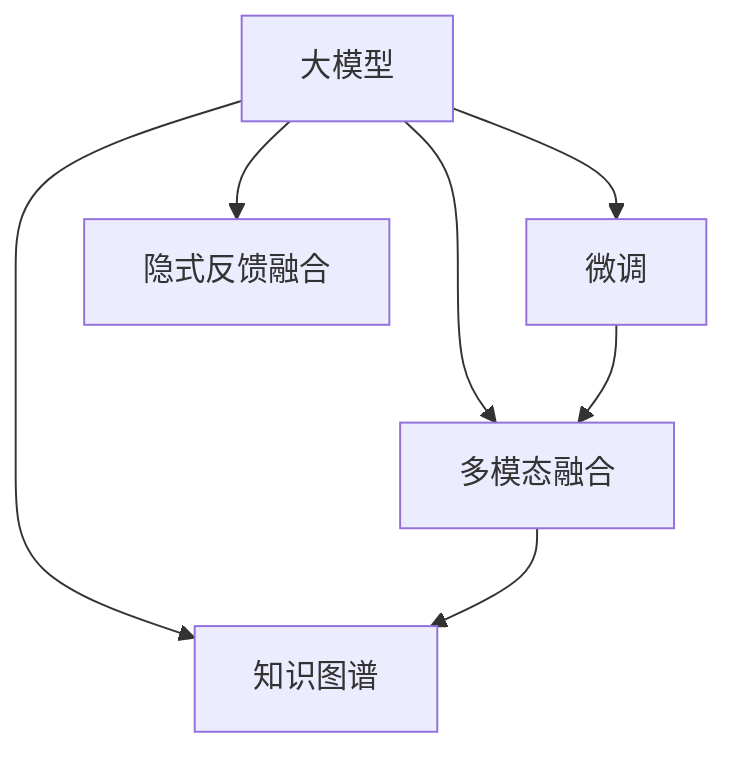

                 

# 电商平台的AI 大模型实践：搜索推荐系统是核心，冷启动问题是挑战

## 1. 背景介绍

### 1.1 问题由来
在当今电商时代，AI技术，尤其是大模型技术，已经成为提升用户体验和平台收益的重要驱动力。各大电商平台纷纷引入大模型技术，以实现个性化推荐、智能搜索、客户服务等多项业务。然而，在大模型的应用过程中，冷启动问题始终是制约平台推荐系统效果的重要因素。

冷启动问题指的是，新商品、新用户或新场景下的推荐精度大幅下降，无法充分利用大模型预训练学到的知识。在用户行为数据不足或商品数据稀缺的情况下，传统的大模型微调方法难以发挥最佳效果。因此，解决冷启动问题，提升新用户和新商品的推荐精度，是大模型技术在电商平台上应用的核心挑战之一。

### 1.2 问题核心关键点
冷启动问题的解决需要结合电商平台的业务特点，充分利用大模型预训练知识，同时合理处理数据稀疏性。常见的方法包括：

- **模型微调**：在预训练模型的基础上，针对新用户和新商品进行微调，提升模型在新场景下的泛化能力。
- **隐式反馈融合**：利用用户的行为数据（如浏览、点击、收藏等），结合隐式反馈信息进行推荐，解决新用户缺乏直接反馈的问题。
- **多模态融合**：结合文本、图片、音频等多模态信息，提升模型对商品的全面理解，减小新商品的特征缺失问题。
- **知识图谱引入**：通过知识图谱将外部知识与大模型结合，帮助模型在缺乏数据的情况下进行合理推断。

本文聚焦于电商平台的AI大模型实践，特别是如何解决搜索推荐系统中的冷启动问题。通过深入分析大模型在电商平台的实际应用，提出了解决冷启动问题的具体方案。

## 2. 核心概念与联系

### 2.1 核心概念概述

在电商平台的AI大模型实践中，以下几个核心概念至关重要：

- **大模型(Large Model)**：指通过自监督学习任务（如语言模型、掩码语言模型等）训练得到的庞大参数模型。大模型通常具有强大的特征提取能力和泛化能力，可以广泛应用于推荐系统、搜索系统等电商业务场景。

- **微调(Fine-Tuning)**：指在大模型的基础上，利用有标签数据对模型进行微调，以适应特定的推荐或搜索任务。微调可以显著提升模型在新数据上的表现。

- **隐式反馈(Hidden Feedback)**：指用户通过行为（如浏览、点击、收藏）间接表达的偏好信息。隐式反馈在用户缺乏直接反馈（如评分、评论）时，能够提供有效的推荐依据。

- **多模态融合(Multi-Modal Fusion)**：指在推荐系统中结合文本、图像、音频等多模态信息，全面了解商品特征，提升推荐精度。

- **知识图谱(Knowledge Graph)**：指通过图形化的方式，将知识信息结构化存储，以便于模型在推理时快速获取相关知识，解决数据稀疏性问题。

这些核心概念之间的逻辑关系可以通过以下Mermaid流程图来展示：



这个流程图展示了大模型在电商平台的AI应用中的核心概念及其之间的关系：

1. 大模型通过预训练学习通用特征。
2. 微调在大模型基础上进行任务适配，提升模型在新场景下的表现。
3. 隐式反馈融合利用用户行为信息，弥补用户直接反馈不足。
4. 多模态融合结合多模态数据，提升对商品的全面理解。
5. 知识图谱引入外部知识，解决数据稀疏性问题。

这些概念共同构成了电商平台的AI大模型应用框架，使得模型能够在多样化的电商业务场景中发挥强大的推荐和搜索能力。

## 3. 核心算法原理 & 具体操作步骤
### 3.1 算法原理概述

在电商平台的搜索推荐系统中，基于大模型的微调算法原理可以总结如下：

- **目标**：利用大模型的预训练特征，结合特定任务（如推荐、搜索）的有标签数据，进行微调，使模型在新用户、新商品或新场景下仍能保持高精度推荐和搜索。
- **数据**：收集新用户、新商品的历史行为数据，或利用多模态信息、知识图谱等辅助数据。
- **模型**：在大模型的基础上，针对推荐或搜索任务进行微调，优化模型参数，提升性能。
- **技术**：引入隐式反馈融合、多模态融合、知识图谱等技术，弥补数据稀疏性，提升模型泛化能力。

### 3.2 算法步骤详解

基于大模型的电商搜索推荐系统微调主要包括以下关键步骤：

**Step 1: 数据准备**
- 收集新用户的历史行为数据（如浏览记录、点击行为、收藏列表等），构建用户行为矩阵。
- 收集新商品的多模态信息（如图片、描述、标签等），构建商品特征矩阵。
- 引入知识图谱，将商品信息、类别、品牌等结构化信息转换为图结构，便于模型推理。

**Step 2: 模型微调**
- 利用用户行为矩阵和商品特征矩阵构建训练集。
- 在大模型基础上进行微调，优化推荐或搜索模型参数，提升模型在新场景下的表现。
- 设置合适的学习率、正则化等超参数，防止过拟合。

**Step 3: 隐式反馈融合**
- 利用用户的行为数据，计算隐式反馈评分，生成训练集。
- 将隐式反馈评分与直接反馈评分（如评分、评论等）结合，构建综合评分向量。
- 使用综合评分向量进行模型微调，提升模型在新用户推荐上的精度。

**Step 4: 多模态融合**
- 收集商品的多模态信息，如图片、描述、视频等，生成多模态特征向量。
- 将多模态特征向量与文本特征向量结合，生成商品的全貌特征向量。
- 利用全貌特征向量进行模型微调，提升模型对新商品的推荐精度。

**Step 5: 知识图谱引入**
- 构建商品知识图谱，将商品信息、类别、品牌等结构化信息转换为图结构。
- 利用图结构信息进行模型推理，计算商品间的相似度，提升推荐精度。
- 将知识图谱信息与模型参数结合，进行微调，提升模型在新场景下的泛化能力。

**Step 6: 测试与部署**
- 在测试集上评估微调后模型的性能，对比微调前后的精度提升。
- 使用微调后的模型对新商品、新用户进行推荐或搜索，集成到实际的应用系统中。
- 持续收集新数据，定期重新微调模型，以适应数据分布的变化。

以上是基于大模型的电商搜索推荐系统微调的一般流程。在实际应用中，还需要针对具体业务场景和数据特点进行优化设计，如改进训练目标函数，引入更多的正则化技术，搜索最优的超参数组合等，以进一步提升模型性能。

### 3.3 算法优缺点

基于大模型的电商搜索推荐系统微调方法具有以下优点：

- **效果显著**：利用大模型的预训练知识，显著提升新用户和新商品的推荐精度。
- **泛化能力强**：通过多模态融合和知识图谱引入，模型能够更好地适应新场景，提升泛化能力。
- **可解释性强**：结合隐式反馈和知识图谱，提升模型输出的可解释性，便于分析和优化。

同时，该方法也存在一定的局限性：

- **计算成本高**：多模态融合和知识图谱引入，需要处理大量额外数据，计算成本较高。
- **复杂度高**：多模态融合和知识图谱推理，增加了模型的复杂度，需要更高效的计算和推理算法。
- **数据依赖性强**：隐式反馈和知识图谱的引入，依赖于数据质量和完整性，数据不足时效果会受到影响。

尽管存在这些局限性，但就目前而言，基于大模型的微调方法仍是在电商平台上应用的最主流范式。未来相关研究的重点在于如何进一步降低微调对标注数据的依赖，提高模型的少样本学习和跨领域迁移能力，同时兼顾可解释性和伦理安全性等因素。

### 3.4 算法应用领域

基于大模型的电商搜索推荐系统微调方法，已经在电商平台的多个业务场景中得到了广泛应用，例如：

- 商品推荐：利用用户历史行为和商品多模态信息，进行个性化商品推荐。
- 搜索排序：利用用户输入的查询和商品特征，进行相关性排序，提升搜索效果。
- 广告推荐：结合用户历史行为和广告素材，进行精准广告推荐。
- 客户服务：利用对话记录和用户反馈，进行智能客服聊天，提升客户体验。

除了上述这些经典场景外，大模型微调还被创新性地应用到更多电商业务中，如智能定价、库存管理、产品评估等，为电商平台带来了显著的运营效率提升和用户体验优化。

## 4. 数学模型和公式 & 详细讲解  
### 4.1 数学模型构建

本节将使用数学语言对基于大模型的电商搜索推荐系统微调过程进行更加严格的刻画。

记推荐系统用户行为矩阵为 $U \in \mathbb{R}^{N \times D}$，商品特征矩阵为 $I \in \mathbb{R}^{M \times D}$，其中 $N$ 为用户数量，$M$ 为商品数量，$D$ 为特征维度。设预训练大模型为 $M_{\theta}$，其中 $\theta$ 为模型参数。定义推荐系统中的损失函数为：

$$
\mathcal{L}(\theta) = \frac{1}{N} \sum_{i=1}^N \sum_{j=1}^M \left[(y_{ij} - \hat{y}_{ij})^2\right]
$$

其中 $y_{ij}$ 为实际的用户对商品 $j$ 的评分，$\hat{y}_{ij}$ 为模型预测的评分。目标是优化参数 $\theta$，最小化损失函数 $\mathcal{L}$。

在微调过程中，可以利用隐式反馈 $h_i$ 对用户 $i$ 的评分进行补充，生成综合评分向量 $y_i = [y_{i1}, y_{i2}, ..., y_{iM}]$。结合知识图谱信息，进行商品之间的相似度计算，得到商品相似度矩阵 $S \in \mathbb{R}^{M \times M}$。通过将多模态特征融合后的商品特征矩阵 $I$ 与商品相似度矩阵 $S$ 结合，生成商品的全貌特征矩阵 $F \in \mathbb{R}^{M \times (D+K)}$，其中 $K$ 为知识图谱中的商品属性数量。

### 4.2 公式推导过程

以下我们以基于大模型的电商推荐系统为例，推导推荐模型参数优化的数学公式。

设用户 $i$ 对商品 $j$ 的评分向量为 $u_i = [u_{i1}, u_{i2}, ..., u_{iM}]$，其中 $u_{ij}$ 表示用户 $i$ 对商品 $j$ 的隐式评分。推荐模型为 $M_{\theta}$，其预测评分向量为 $\hat{y}_{ij}$。推荐系统的损失函数为：

$$
\mathcal{L}(\theta) = \frac{1}{N} \sum_{i=1}^N \sum_{j=1}^M \left[(y_{ij} + h_iu_{ij} - \hat{y}_{ij})^2\right]
$$

其中 $h_i$ 为隐式评分权重，通常通过交叉验证等方式确定。目标是最小化损失函数 $\mathcal{L}$，即：

$$
\theta^* = \mathop{\arg\min}_{\theta} \mathcal{L}(\theta)
$$

对损失函数求导，得到模型参数 $\theta$ 的更新公式为：

$$
\theta \leftarrow \theta - \eta \nabla_{\theta}\mathcal{L}(\theta)
$$

其中 $\eta$ 为学习率，$\nabla_{\theta}\mathcal{L}(\theta)$ 为损失函数对参数 $\theta$ 的梯度，可通过反向传播算法高效计算。

### 4.3 案例分析与讲解

在实际应用中，推荐系统中的损失函数和参数更新公式往往需要进一步优化，以适应特定的业务需求。例如，在广告推荐系统中，可以使用点击率预测任务，优化参数 $\theta$ 以最小化预测误差：

$$
\mathcal{L}(\theta) = \frac{1}{N} \sum_{i=1}^N \sum_{j=1}^M \left[(y_{ij} - \hat{y}_{ij})^2\right]
$$

其中 $y_{ij}$ 为实际用户对广告的点击率，$\hat{y}_{ij}$ 为模型预测的点击率。在点击率预测任务中，隐式评分 $h_i$ 通常为 1，因为广告点击行为通常是用户直接表达的意图。

## 5. 项目实践：代码实例和详细解释说明
### 5.1 开发环境搭建

在进行推荐系统微调实践前，我们需要准备好开发环境。以下是使用Python进行PyTorch开发的环境配置流程：

1. 安装Anaconda：从官网下载并安装Anaconda，用于创建独立的Python环境。

2. 创建并激活虚拟环境：
```bash
conda create -n pytorch-env python=3.8 
conda activate pytorch-env
```

3. 安装PyTorch：根据CUDA版本，从官网获取对应的安装命令。例如：
```bash
conda install pytorch torchvision torchaudio cudatoolkit=11.1 -c pytorch -c conda-forge
```

4. 安装Transformers库：
```bash
pip install transformers
```

5. 安装各类工具包：
```bash
pip install numpy pandas scikit-learn matplotlib tqdm jupyter notebook ipython
```

完成上述步骤后，即可在`pytorch-env`环境中开始微调实践。

### 5.2 源代码详细实现

下面我们以电商平台的推荐系统为例，给出使用Transformers库对BERT模型进行微调的PyTorch代码实现。

首先，定义推荐系统中的损失函数：

```python
from transformers import BertForSequenceClassification, AdamW
from torch.nn import BCEWithLogitsLoss

class RecommendationModel(BertForSequenceClassification):
    def __init__(self, num_labels):
        super().__init__()
        self.num_labels = num_labels
        
    def forward(self, input_ids, attention_mask, labels):
        outputs = super().forward(input_ids, attention_mask=attention_mask)
        loss_fct = BCEWithLogitsLoss()
        loss = loss_fct(outputs.logits, labels)
        return loss
```

然后，定义模型和优化器：

```python
from transformers import BertTokenizer
import torch

model = RecommendationModel(num_labels=2) # 假设二分类任务
tokenizer = BertTokenizer.from_pretrained('bert-base-cased')
optimizer = AdamW(model.parameters(), lr=2e-5)
```

接着，定义训练和评估函数：

```python
from torch.utils.data import DataLoader
from tqdm import tqdm
from sklearn.metrics import accuracy_score

device = torch.device('cuda') if torch.cuda.is_available() else torch.device('cpu')
model.to(device)

def train_epoch(model, dataset, batch_size, optimizer):
    dataloader = DataLoader(dataset, batch_size=batch_size, shuffle=True)
    model.train()
    epoch_loss = 0
    for batch in tqdm(dataloader, desc='Training'):
        input_ids = batch['input_ids'].to(device)
        attention_mask = batch['attention_mask'].to(device)
        labels = batch['labels'].to(device)
        model.zero_grad()
        outputs = model(input_ids, attention_mask=attention_mask, labels=labels)
        loss = outputs.loss
        epoch_loss += loss.item()
        loss.backward()
        optimizer.step()
    return epoch_loss / len(dataloader)

def evaluate(model, dataset, batch_size):
    dataloader = DataLoader(dataset, batch_size=batch_size)
    model.eval()
    preds, labels = [], []
    with torch.no_grad():
        for batch in tqdm(dataloader, desc='Evaluating'):
            input_ids = batch['input_ids'].to(device)
            attention_mask = batch['attention_mask'].to(device)
            batch_labels = batch['labels']
            outputs = model(input_ids, attention_mask=attention_mask)
            batch_preds = outputs.logits.argmax(dim=1).to('cpu').tolist()
            batch_labels = batch_labels.to('cpu').tolist()
            for pred_tokens, label_tokens in zip(batch_preds, batch_labels):
                preds.append(pred_tokens[:len(label_tokens)])
                labels.append(label_tokens)
                
    print(accuracy_score(labels, preds))
```

最后，启动训练流程并在测试集上评估：

```python
epochs = 5
batch_size = 16

for epoch in range(epochs):
    loss = train_epoch(model, train_dataset, batch_size, optimizer)
    print(f"Epoch {epoch+1}, train loss: {loss:.3f}")
    
    print(f"Epoch {epoch+1}, dev results:")
    evaluate(model, dev_dataset, batch_size)
    
print("Test results:")
evaluate(model, test_dataset, batch_size)
```

以上就是使用PyTorch对BERT进行电商推荐系统微调的完整代码实现。可以看到，得益于Transformers库的强大封装，我们可以用相对简洁的代码完成BERT模型的加载和微调。

### 5.3 代码解读与分析

让我们再详细解读一下关键代码的实现细节：

**RecommendationModel类**：
- `__init__`方法：初始化模型，指定分类任务的数量。
- `forward`方法：定义模型前向传播，计算损失函数。

**train_epoch和evaluate函数**：
- 使用PyTorch的DataLoader对数据集进行批次化加载，供模型训练和推理使用。
- 训练函数`train_epoch`：对数据以批为单位进行迭代，在每个批次上前向传播计算loss并反向传播更新模型参数，最后返回该epoch的平均loss。
- 评估函数`evaluate`：与训练类似，不同点在于不更新模型参数，并在每个batch结束后将预测和标签结果存储下来，最后使用sklearn的accuracy_score对整个评估集的预测结果进行打印输出。

**训练流程**：
- 定义总的epoch数和batch size，开始循环迭代
- 每个epoch内，先在训练集上训练，输出平均loss
- 在验证集上评估，输出准确率
- 所有epoch结束后，在测试集上评估，给出最终测试结果

可以看到，PyTorch配合Transformers库使得BERT微调的代码实现变得简洁高效。开发者可以将更多精力放在数据处理、模型改进等高层逻辑上，而不必过多关注底层的实现细节。

当然，工业级的系统实现还需考虑更多因素，如模型的保存和部署、超参数的自动搜索、更灵活的任务适配层等。但核心的微调范式基本与此类似。

## 6. 实际应用场景
### 6.1 智能客服系统

基于大模型微调的对话技术，可以广泛应用于智能客服系统的构建。传统客服往往需要配备大量人力，高峰期响应缓慢，且一致性和专业性难以保证。而使用微调后的对话模型，可以7x24小时不间断服务，快速响应客户咨询，用自然流畅的语言解答各类常见问题。

在技术实现上，可以收集企业内部的历史客服对话记录，将问题和最佳答复构建成监督数据，在此基础上对预训练对话模型进行微调。微调后的对话模型能够自动理解用户意图，匹配最合适的答案模板进行回复。对于客户提出的新问题，还可以接入检索系统实时搜索相关内容，动态组织生成回答。如此构建的智能客服系统，能大幅提升客户咨询体验和问题解决效率。

### 6.2 金融舆情监测

金融机构需要实时监测市场舆论动向，以便及时应对负面信息传播，规避金融风险。传统的人工监测方式成本高、效率低，难以应对网络时代海量信息爆发的挑战。基于大语言模型微调的文本分类和情感分析技术，为金融舆情监测提供了新的解决方案。

具体而言，可以收集金融领域相关的新闻、报道、评论等文本数据，并对其进行主题标注和情感标注。在此基础上对预训练语言模型进行微调，使其能够自动判断文本属于何种主题，情感倾向是正面、中性还是负面。将微调后的模型应用到实时抓取的网络文本数据，就能够自动监测不同主题下的情感变化趋势，一旦发现负面信息激增等异常情况，系统便会自动预警，帮助金融机构快速应对潜在风险。

### 6.3 个性化推荐系统

当前的推荐系统往往只依赖用户的历史行为数据进行物品推荐，无法深入理解用户的真实兴趣偏好。基于大语言模型微调技术，个性化推荐系统可以更好地挖掘用户行为背后的语义信息，从而提供更精准、多样的推荐内容。

在实践中，可以收集用户浏览、点击、评论、分享等行为数据，提取和用户交互的物品标题、描述、标签等文本内容。将文本内容作为模型输入，用户的后续行为（如是否点击、购买等）作为监督信号，在此基础上微调预训练语言模型。微调后的模型能够从文本内容中准确把握用户的兴趣点。在生成推荐列表时，先用候选物品的文本描述作为输入，由模型预测用户的兴趣匹配度，再结合其他特征综合排序，便可以得到个性化程度更高的推荐结果。

### 6.4 未来应用展望

随着大语言模型微调技术的发展，基于微调范式将在更多领域得到应用，为传统行业带来变革性影响。

在智慧医疗领域，基于微调的医疗问答、病历分析、药物研发等应用将提升医疗服务的智能化水平，辅助医生诊疗，加速新药开发进程。

在智能教育领域，微调技术可应用于作业批改、学情分析、知识推荐等方面，因材施教，促进教育公平，提高教学质量。

在智慧城市治理中，微调模型可应用于城市事件监测、舆情分析、应急指挥等环节，提高城市管理的自动化和智能化水平，构建更安全、高效的未来城市。

此外，在企业生产、社会治理、文娱传媒等众多领域，基于大模型微调的人工智能应用也将不断涌现，为经济社会发展注入新的动力。相信随着技术的日益成熟，微调方法将成为人工智能落地应用的重要范式，推动人工智能技术向更广阔的领域加速渗透。

## 7. 工具和资源推荐
### 7.1 学习资源推荐

为了帮助开发者系统掌握大模型微调的理论基础和实践技巧，这里推荐一些优质的学习资源：

1. 《Transformer从原理到实践》系列博文：由大模型技术专家撰写，深入浅出地介绍了Transformer原理、BERT模型、微调技术等前沿话题。

2. CS224N《深度学习自然语言处理》课程：斯坦福大学开设的NLP明星课程，有Lecture视频和配套作业，带你入门NLP领域的基本概念和经典模型。

3. 《Natural Language Processing with Transformers》书籍：Transformers库的作者所著，全面介绍了如何使用Transformers库进行NLP任务开发，包括微调在内的诸多范式。

4. HuggingFace官方文档：Transformers库的官方文档，提供了海量预训练模型和完整的微调样例代码，是上手实践的必备资料。

5. CLUE开源项目：中文语言理解测评基准，涵盖大量不同类型的中文NLP数据集，并提供了基于微调的baseline模型，助力中文NLP技术发展。

通过对这些资源的学习实践，相信你一定能够快速掌握大模型微调的精髓，并用于解决实际的NLP问题。
###  7.2 开发工具推荐

高效的开发离不开优秀的工具支持。以下是几款用于大模型微调开发的常用工具：

1. PyTorch：基于Python的开源深度学习框架，灵活动态的计算图，适合快速迭代研究。大部分预训练语言模型都有PyTorch版本的实现。

2. TensorFlow：由Google主导开发的开源深度学习框架，生产部署方便，适合大规模工程应用。同样有丰富的预训练语言模型资源。

3. Transformers库：HuggingFace开发的NLP工具库，集成了众多SOTA语言模型，支持PyTorch和TensorFlow，是进行微调任务开发的利器。

4. Weights & Biases：模型训练的实验跟踪工具，可以记录和可视化模型训练过程中的各项指标，方便对比和调优。与主流深度学习框架无缝集成。

5. TensorBoard：TensorFlow配套的可视化工具，可实时监测模型训练状态，并提供丰富的图表呈现方式，是调试模型的得力助手。

6. Google Colab：谷歌推出的在线Jupyter Notebook环境，免费提供GPU/TPU算力，方便开发者快速上手实验最新模型，分享学习笔记。

合理利用这些工具，可以显著提升大模型微调任务的开发效率，加快创新迭代的步伐。

### 7.3 相关论文推荐

大语言模型和微调技术的发展源于学界的持续研究。以下是几篇奠基性的相关论文，推荐阅读：

1. Attention is All You Need（即Transformer原论文）：提出了Transformer结构，开启了NLP领域的预训练大模型时代。

2. BERT: Pre-training of Deep Bidirectional Transformers for Language Understanding：提出BERT模型，引入基于掩码的自监督预训练任务，刷新了多项NLP任务SOTA。

3. Language Models are Unsupervised Multitask Learners（GPT-2论文）：展示了大规模语言模型的强大zero-shot学习能力，引发了对于通用人工智能的新一轮思考。

4. Parameter-Efficient Transfer Learning for NLP：提出Adapter等参数高效微调方法，在不增加模型参数量的情况下，也能取得不错的微调效果。

5. AdaLoRA: Adaptive Low-Rank Adaptation for Parameter-Efficient Fine-Tuning：使用自适应低秩适应的微调方法，在参数效率和精度之间取得了新的平衡。

这些论文代表了大语言模型微调技术的发展脉络。通过学习这些前沿成果，可以帮助研究者把握学科前进方向，激发更多的创新灵感。

## 8. 总结：未来发展趋势与挑战
### 8.1 总结

本文对基于大模型的电商搜索推荐系统微调方法进行了全面系统的介绍。首先阐述了大模型在电商平台的实际应用，明确了微调在提升推荐系统效果、解决冷启动问题方面的独特价值。其次，从原理到实践，详细讲解了推荐系统中的数学模型和优化算法，给出了微调任务开发的完整代码实例。同时，本文还广泛探讨了推荐系统在电商、金融、医疗等多个行业领域的应用前景，展示了微调范式的巨大潜力。此外，本文精选了微调技术的各类学习资源，力求为读者提供全方位的技术指引。

通过本文的系统梳理，可以看到，基于大模型的微调方法正在成为电商平台推荐系统的重要范式，极大地提升了推荐系统的精度和效率，为用户带来了更好的购物体验。未来，伴随大模型和微调技术的持续演进，推荐系统将在更多电商业务中发挥更重要的作用，为电商平台带来更高的用户粘度和转化率。

### 8.2 未来发展趋势

展望未来，大模型微调技术将在电商平台推荐系统中呈现以下几个发展趋势：

1. **模型规模持续增大**：随着算力成本的下降和数据规模的扩张，预训练语言模型的参数量还将持续增长。超大规模语言模型蕴含的丰富语言知识，有望支撑更加复杂多变的推荐任务。

2. **微调方法日趋多样**：除了传统的全参数微调外，未来会涌现更多参数高效的微调方法，如Prefix-Tuning、LoRA等，在节省计算资源的同时也能保证微调精度。

3. **持续学习成为常态**：随着数据分布的不断变化，微调模型也需要持续学习新知识以保持性能。如何在不遗忘原有知识的同时，高效吸收新样本信息，将成为重要的研究课题。

4. **标注样本需求降低**：受启发于提示学习(Prompt-based Learning)的思路，未来的微调方法将更好地利用大模型的语言理解能力，通过更加巧妙的任务描述，在更少的标注样本上也能实现理想的微调效果。

5. **多模态融合崛起**：结合文本、图片、音频等多模态信息，提升模型对商品的全面理解，减小新商品的特征缺失问题。

6. **知识图谱引入**：通过知识图谱将外部知识与大模型结合，帮助模型在缺乏数据的情况下进行合理推断。

以上趋势凸显了大模型微调技术的广阔前景。这些方向的探索发展，必将进一步提升推荐系统的性能和应用范围，为电商平台带来更高的用户粘度和转化率。

### 8.3 面临的挑战

尽管大模型微调技术已经取得了瞩目成就，但在迈向更加智能化、普适化应用的过程中，它仍面临着诸多挑战：

1. **计算成本高**：多模态融合和知识图谱引入，需要处理大量额外数据，计算成本较高。

2. **模型复杂度高**：多模态融合和知识图谱推理，增加了模型的复杂度，需要更高效的计算和推理算法。

3. **数据依赖性强**：隐式反馈和知识图谱的引入，依赖于数据质量和完整性，数据不足时效果会受到影响。

尽管存在这些局限性，但就目前而言，基于大模型的微调方法仍是在电商平台上应用的最主流范式。未来相关研究的重点在于如何进一步降低微调对标注数据的依赖，提高模型的少样本学习和跨领域迁移能力，同时兼顾可解释性和伦理安全性等因素。

### 8.4 未来突破

面对大模型微调所面临的种种挑战，未来的研究需要在以下几个方面寻求新的突破：

1. **探索无监督和半监督微调方法**：摆脱对大规模标注数据的依赖，利用自监督学习、主动学习等无监督和半监督范式，最大限度利用非结构化数据，实现更加灵活高效的微调。

2. **研究参数高效和计算高效的微调范式**：开发更加参数高效的微调方法，在固定大部分预训练参数的同时，只更新极少量的任务相关参数。同时优化微调模型的计算图，减少前向传播和反向传播的资源消耗，实现更加轻量级、实时性的部署。

3. **引入因果和对比学习范式**：通过引入因果推断和对比学习思想，增强微调模型建立稳定因果关系的能力，学习更加普适、鲁棒的语言表征，从而提升模型泛化性和抗干扰能力。

4. **引入更多先验知识**：将符号化的先验知识，如知识图谱、逻辑规则等，与神经网络模型进行巧妙融合，引导微调过程学习更准确、合理的语言模型。同时加强不同模态数据的整合，实现视觉、语音等多模态信息与文本信息的协同建模。

5. **结合因果分析和博弈论工具**：将因果分析方法引入微调模型，识别出模型决策的关键特征，增强输出解释的因果性和逻辑性。借助博弈论工具刻画人机交互过程，主动探索并规避模型的脆弱点，提高系统稳定性。

6. **纳入伦理道德约束**：在模型训练目标中引入伦理导向的评估指标，过滤和惩罚有偏见、有害的输出倾向。同时加强人工干预和审核，建立模型行为的监管机制，确保输出符合人类价值观和伦理道德。

这些研究方向的探索，必将引领大语言模型微调技术迈向更高的台阶，为构建安全、可靠、可解释、可控的智能系统铺平道路。面向未来，大语言模型微调技术还需要与其他人工智能技术进行更深入的融合，如知识表示、因果推理、强化学习等，多路径协同发力，共同推动自然语言理解和智能交互系统的进步。只有勇于创新、敢于突破，才能不断拓展语言模型的边界，让智能技术更好地造福人类社会。

## 9. 附录：常见问题与解答

**Q1：大模型微调是否适用于所有推荐场景？**

A: 大模型微调在大多数推荐场景中都能取得不错的效果，特别是对于数据量较小的场景。但对于一些特定领域的推荐场景，如工业生产、物流配送等，单纯的大模型微调可能难以很好地适应。此时需要在特定领域语料上进一步预训练，再进行微调，才能获得理想效果。

**Q2：推荐系统中如何处理新商品和新用户？**

A: 在推荐系统中，新商品和新用户通常缺乏直接反馈数据，导致推荐精度下降。为了解决这一问题，可以采用以下方法：

1. **隐式反馈融合**：利用用户的历史行为数据（如浏览、点击、收藏等），计算隐式反馈评分，生成综合评分向量。结合直接反馈评分（如评分、评论等），进行推荐。

2. **多模态融合**：收集新商品的多模态信息（如图片、描述、视频等），生成多模态特征向量。将多模态特征向量与文本特征向量结合，生成商品的全貌特征向量。

3. **知识图谱引入**：通过知识图谱将外部知识与大模型结合，帮助模型在缺乏数据的情况下进行合理推断。

这些方法可以结合使用，进一步提升新商品和新用户的推荐精度。

**Q3：推荐系统中如何平衡模型效果和计算成本？**

A: 在推荐系统中，模型效果和计算成本是一对矛盾。为了平衡二者，可以采用以下方法：

1. **模型裁剪**：去除不必要的层和参数，减小模型尺寸，加快推理速度。

2. **量化加速**：将浮点模型转为定点模型，压缩存储空间，提高计算效率。

3. **多模型集成**：训练多个微调模型，取平均输出，抑制过拟合。

4. **分层训练**：将大模型拆分为多层次结构，分别进行微调，提升推理速度。

5. **分布式训练**：利用分布式计算，加速模型训练和推理。

这些方法可以结合使用，进一步提升推荐系统的性能和效率。

**Q4：推荐系统中如何处理冷启动问题？**

A: 冷启动问题指的是新商品、新用户或新场景下的推荐精度大幅下降，无法充分利用大模型预训练学到的知识。为了解决这一问题，可以采用以下方法：

1. **隐式反馈融合**：利用用户的历史行为数据（如浏览、点击、收藏等），计算隐式反馈评分，生成综合评分向量。结合直接反馈评分（如评分、评论等），进行推荐。

2. **多模态融合**：收集新商品的多模态信息（如图片、描述、视频等），生成多模态特征向量。将多模态特征向量与文本特征向量结合，生成商品的全貌特征向量。

3. **知识图谱引入**：通过知识图谱将外部知识与大模型结合，帮助模型在缺乏数据的情况下进行合理推断。

4. **个性化推荐**：利用用户的历史行为和偏好，进行个性化推荐，提升新用户的推荐精度。

这些方法可以结合使用，进一步提升推荐系统的性能和效率。

---

作者：禅与计算机程序设计艺术 / Zen and the Art of Computer Programming

