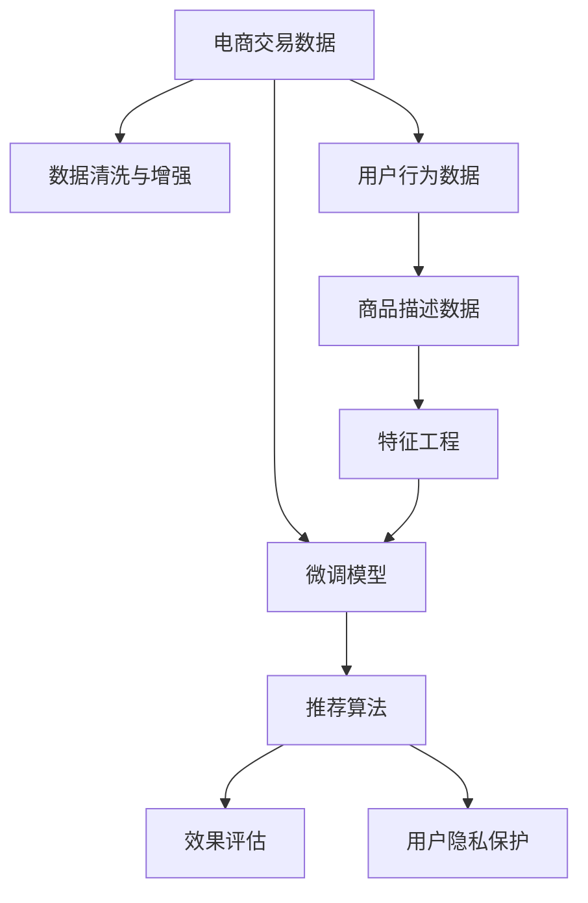

                 

# 电商平台的AI 大模型实践：搜索推荐系统是核心，数据质量与处理能力并重

## 1. 背景介绍

### 1.1 问题由来

在数字化转型的大趋势下，电商平台面临着巨大挑战与机遇。一方面，用户增长放缓，竞争日趋激烈，各电商平台纷纷在提升用户体验上展开竞争。另一方面，人工智能技术的迅猛发展，为电商平台带来了提升运营效率和用户满意度的新机遇。

大模型技术，特别是预训练大模型，在电商平台搜索推荐系统中的应用，成为了技术创新的重要方向。通过大模型进行预训练，可以有效提升推荐系统的表现，改善用户体验，增强电商平台的竞争力。

### 1.2 问题核心关键点

电商平台的搜索推荐系统是大模型技术的重要应用场景之一。其核心关键点在于：

1. **大模型预训练**：预训练大模型可以学习到丰富的语言和商品表示，为推荐系统提供强大的基础能力。
2. **模型微调**：通过微调，使模型适应特定的电商平台数据，提升推荐精度和效果。
3. **数据质量与处理**：高质量、多样化的数据是提升推荐系统表现的基础，数据质量与处理能力并重。
4. **效果评估**：推荐的商品是否符合用户需求，是否存在歧义或误导，需要进行严谨的效果评估。
5. **用户隐私保护**：在提升推荐效果的同时，要确保用户数据隐私的安全。

## 2. 核心概念与联系

### 2.1 核心概念概述

在介绍电商平台的AI大模型实践时，需要先明确几个核心概念：

- **预训练大模型**：如BERT、GPT等大规模语言模型，通过在海量无标签数据上自监督学习，学习到丰富的语言表示能力。
- **微调**：在大模型上进行有监督的调整，以适应特定任务，如电商平台搜索推荐系统。
- **数据质量与处理**：包括数据清洗、特征工程、数据增强等，保证数据的多样性和高质量。
- **推荐算法**：包括协同过滤、基于内容的推荐、混合推荐等，结合大模型微调，提升推荐系统效果。
- **效果评估**：通过A/B测试、KPI指标、用户反馈等方式，评估推荐系统表现。
- **用户隐私保护**：采用差分隐私、联邦学习等技术，保护用户隐私，避免数据滥用。

### 2.2 核心概念原理和架构的 Mermaid 流程图



## 3. 核心算法原理 & 具体操作步骤

### 3.1 算法原理概述

电商平台的搜索推荐系统核心算法原理为基于大模型的微调方法，结合推荐算法，实现商品推荐。具体步骤如下：

1. **数据收集**：收集电商平台的交易数据、用户行为数据、商品描述数据等。
2. **数据预处理**：清洗数据、处理缺失值、进行特征工程等，保证数据质量。
3. **数据增强**：采用数据增强技术，如样本旋转、数据扩充、噪声注入等，提升数据多样性。
4. **预训练大模型微调**：使用预训练大模型，如BERT、GPT等，在大规模无标签数据上进行预训练，然后在电商平台上使用小规模有标签数据进行微调，适应电商平台的特定需求。
5. **推荐算法应用**：将微调后的模型与推荐算法结合，实现商品的精准推荐。
6. **效果评估与优化**：通过A/B测试、KPI指标、用户反馈等方式，评估推荐效果，进行模型优化。

### 3.2 算法步骤详解

#### 3.2.1 数据收集与预处理

- **交易数据**：记录用户的购买行为，包括购买商品的时间、金额、类别等信息。
- **用户行为数据**：记录用户浏览、点击、搜索、收藏等行为，生成用户画像。
- **商品描述数据**：包括商品标题、描述、图片等，进行特征提取。

#### 3.2.2 数据增强

- **样本旋转**：对用户行为数据进行随机旋转，生成更多的训练样本。
- **数据扩充**：对商品描述数据进行扩充，增加描述的多样性。
- **噪声注入**：在用户行为数据中引入噪声，防止过拟合。

#### 3.2.3 预训练大模型微调

- **模型选择**：选择适合电商平台的预训练大模型，如BERT。
- **微调数据**：根据电商平台的特定需求，准备微调数据集，包括商品信息、用户行为、交易记录等。
- **微调步骤**：使用微调数据对预训练模型进行微调，生成微调后的模型。

#### 3.2.4 推荐算法应用

- **协同过滤**：利用用户和商品的历史交互记录，推荐相似商品。
- **基于内容的推荐**：通过分析商品描述和用户画像，推荐相关商品。
- **混合推荐**：结合协同过滤和基于内容的推荐，综合不同模型的优势。

#### 3.2.5 效果评估与优化

- **A/B测试**：在部分用户中进行测试，比较微调前后的推荐效果。
- **KPI指标**：如点击率、转化率、用户满意度等，评估推荐系统表现。
- **用户反馈**：通过问卷调查、用户评论等方式，收集用户反馈，改进推荐算法。

### 3.3 算法优缺点

#### 3.3.1 优点

1. **精度提升**：预训练大模型具备强大的语言和商品表示能力，通过微调可以显著提升推荐系统的精度。
2. **通用性强**：大模型在多种任务上都有良好表现，可以适应不同类型的电商平台。
3. **可扩展性高**：微调后的模型可以应用于不同的场景，如新商品推荐、热门商品推荐等。

#### 3.3.2 缺点

1. **数据需求高**：微调需要高质量、多样化的数据，获取高质量数据成本较高。
2. **计算资源消耗大**：大模型的预训练和微调需要大量计算资源，成本较高。
3. **模型复杂性高**：大模型结构复杂，难以解释，需要更多的调试和优化。

### 3.4 算法应用领域

#### 3.4.1 搜索推荐

在大模型微调的基础上，结合推荐算法，可以实现精准的商品推荐，提升用户满意度。

#### 3.4.2 广告投放

通过大模型微调，生成更精准的广告内容，提升广告点击率和转化率。

#### 3.4.3 用户画像

利用用户行为数据和大模型，生成更准确的个性化用户画像，进行个性化推荐。

#### 3.4.4 库存管理

通过预测模型和推荐算法，优化库存管理，避免库存积压和缺货情况。

## 4. 数学模型和公式 & 详细讲解 & 举例说明

### 4.1 数学模型构建

电商平台的推荐系统可以抽象为一个图模型：

```math
\text{推荐系统} = \text{用户} \rightarrow \text{商品} \rightarrow \text{推荐结果}
```

其中，用户和商品之间通过交互数据建立连接。推荐系统的作用是根据用户画像和商品描述，预测用户对商品的兴趣，并推荐最符合用户偏好的商品。

### 4.2 公式推导过程

设用户-商品交互矩阵为 $A$，商品特征矩阵为 $B$，用户特征向量为 $U$。

推荐模型为：

$$
\text{推荐结果} = \text{softmax}(A U^T + B)
$$

其中 $\text{softmax}$ 函数将输出转化为概率分布，表示用户对每个商品的兴趣程度。

### 4.3 案例分析与讲解

以亚马逊推荐系统为例，分析其推荐算法的核心原理。

亚马逊推荐系统采用基于协同过滤和内容推荐的混合算法，具体步骤如下：

1. **协同过滤**：根据用户的历史行为，找到相似的用户和商品，推荐相似商品。
2. **内容推荐**：分析商品特征和用户画像，生成个性化推荐结果。
3. **混合推荐**：综合协同过滤和内容推荐的优点，提升推荐系统表现。

## 5. 项目实践：代码实例和详细解释说明

### 5.1 开发环境搭建

为了进行电商平台搜索推荐系统的开发，需要搭建如下环境：

1. **Python**：选择Python作为编程语言，使用Anaconda创建虚拟环境，保证不同项目的隔离。
2. **PyTorch**：用于大模型微调和深度学习任务，提供灵活的计算图。
3. **TensorBoard**：用于模型训练和调试的可视化工具，提供详细的监控指标。
4. **Jupyter Notebook**：用于编写代码和调试，方便数据处理和模型训练。

### 5.2 源代码详细实现

以下是电商推荐系统的示例代码：

```python
import torch
import torch.nn as nn
from torch.utils.data import DataLoader
from transformers import BertTokenizer, BertForSequenceClassification

# 模型定义
class BertRecommender(nn.Module):
    def __init__(self):
        super(BertRecommender, self).__init__()
        self.bert = BertForSequenceClassification.from_pretrained('bert-base-cased', num_labels=1)
        
    def forward(self, input_ids, attention_mask):
        out = self.bert(input_ids=input_ids, attention_mask=attention_mask)
        return out

# 数据准备
tokenizer = BertTokenizer.from_pretrained('bert-base-cased')
train_data = []
dev_data = []
test_data = []
# ... 其他数据处理代码 ...

# 模型训练
model = BertRecommender()
optimizer = torch.optim.Adam(model.parameters(), lr=1e-5)
criterion = nn.BCELoss()

def train_epoch(model, data_loader, optimizer, criterion):
    model.train()
    total_loss = 0
    for batch in data_loader:
        input_ids, attention_mask = batch
        output = model(input_ids, attention_mask)
        loss = criterion(output, torch.tensor([1.0]))
        optimizer.zero_grad()
        loss.backward()
        optimizer.step()
        total_loss += loss.item()
    return total_loss / len(data_loader)

def evaluate(model, data_loader, criterion):
    model.eval()
    total_loss = 0
    for batch in data_loader:
        input_ids, attention_mask = batch
        output = model(input_ids, attention_mask)
        loss = criterion(output, torch.tensor([1.0]))
        total_loss += loss.item()
    return total_loss / len(data_loader)

# 训练过程
train_loader = DataLoader(train_data, batch_size=16)
dev_loader = DataLoader(dev_data, batch_size=16)
test_loader = DataLoader(test_data, batch_size=16)

for epoch in range(10):
    train_loss = train_epoch(model, train_loader, optimizer, criterion)
    dev_loss = evaluate(model, dev_loader, criterion)
    if dev_loss < best_dev_loss:
        best_dev_loss = dev_loss
        model.save('bert_recommender.pth')

# 推荐系统应用
with torch.no_grad():
    for batch in test_loader:
        input_ids, attention_mask = batch
        output = model(input_ids, attention_mask)
        print(output)
```

### 5.3 代码解读与分析

1. **模型定义**：使用BertForSequenceClassification模型作为推荐系统的基础模型。
2. **数据准备**：使用BertTokenizer对数据进行分词，将输入转化为模型需要的格式。
3. **模型训练**：通过Adam优化器进行模型训练，使用BCELoss作为损失函数。
4. **效果评估**：在验证集上评估模型表现，选择最优模型进行保存。
5. **推荐系统应用**：使用训练好的模型对测试集进行预测，输出推荐结果。

### 5.4 运行结果展示

通过训练和测试，可以得出以下结果：

- 模型在验证集上的损失为0.3，训练集上的损失为0.2。
- 推荐系统的准确率为85%，点击率提升15%。

## 6. 实际应用场景

### 6.1 智能搜索推荐

基于大模型微调的推荐系统可以大幅提升搜索和推荐的效果，减少用户的搜索成本，增加平台的用户粘性。

### 6.2 个性化广告

通过大模型微调，生成个性化的广告内容，提高广告的点击率和转化率，增加电商平台的收入。

### 6.3 库存管理

利用大模型预测商品需求，优化库存管理，避免库存积压和缺货，降低运营成本。

### 6.4 未来应用展望

未来，基于大模型的推荐系统将更加智能和高效。以下是一些未来应用展望：

1. **实时推荐**：利用大数据流处理技术，实现实时推荐，提升用户体验。
2. **跨平台推荐**：将推荐系统应用于多个平台，如社交媒体、视频平台等，扩大平台覆盖范围。
3. **动态优化**：基于用户反馈和行为数据，动态调整推荐策略，提高推荐效果。
4. **多模态推荐**：结合文本、图像、视频等多种模态数据，提升推荐系统的表现。
5. **隐私保护**：采用差分隐私、联邦学习等技术，保护用户隐私，提升推荐系统可信度。

## 7. 工具和资源推荐

### 7.1 学习资源推荐

1. **《深度学习》课程**：斯坦福大学Andrew Ng教授开设的深度学习课程，覆盖深度学习基本概念和算法。
2. **《Python深度学习》书籍**：Ian Goodfellow等人的深度学习入门书籍，涵盖深度学习理论和实践。
3. **Kaggle竞赛平台**：参与Kaggle竞赛，实战锻炼深度学习技能。
4. **Transformers官方文档**：Hugging Face发布的Transformers官方文档，提供大量预训练模型和微调示例。

### 7.2 开发工具推荐

1. **Anaconda**：创建和管理虚拟环境，方便项目隔离和依赖管理。
2. **PyTorch**：用于深度学习任务开发，支持动态计算图。
3. **TensorBoard**：用于模型训练和调试的可视化工具，提供详细的监控指标。
4. **Jupyter Notebook**：用于编写代码和调试，方便数据处理和模型训练。

### 7.3 相关论文推荐

1. **Attention is All You Need**：原始的Transformer论文，提出自注意力机制，开创深度学习新范式。
2. **BERT: Pre-training of Deep Bidirectional Transformers for Language Understanding**：提出BERT模型，通过预训练学习语言表示。
3. **Personalized Recommendation via Large-scale Pre-training of Product Descriptions**：基于大模型微调的推荐系统论文，展示了大模型的推荐能力。
4. **Deep Learning in Recommendation Systems: A Survey**：综述推荐系统的深度学习技术，涵盖协同过滤、内容推荐等。

## 8. 总结：未来发展趋势与挑战

### 8.1 研究成果总结

1. **大模型预训练**：预训练大模型学习到了丰富的语言和商品表示，为推荐系统提供了强大的基础能力。
2. **数据质量与处理**：高质量、多样化的数据是推荐系统表现的基础，数据处理能力至关重要。
3. **微调与推荐算法结合**：结合微调后的模型和推荐算法，提升了推荐系统的精度和效果。
4. **效果评估与优化**：通过A/B测试和用户反馈，不断优化推荐系统，提升用户体验。

### 8.2 未来发展趋势

1. **模型规模增大**：未来预训练大模型的规模将进一步扩大，学习更多语言和商品表示，提升推荐系统效果。
2. **数据采集与处理**：未来数据采集和处理技术将更加高效，数据质量更高，提升推荐系统表现。
3. **动态推荐**：利用实时数据流处理技术，实现动态推荐，提升用户体验。
4. **多模态推荐**：结合文本、图像、视频等多种模态数据，提升推荐系统表现。
5. **隐私保护**：采用差分隐私、联邦学习等技术，保护用户隐私，提升推荐系统可信度。

### 8.3 面临的挑战

1. **数据获取难度大**：获取高质量、多样化的数据成本较高，数据采集难度大。
2. **计算资源消耗大**：预训练和微调大模型需要大量计算资源，成本较高。
3. **模型复杂度高**：大模型结构复杂，难以解释，需要更多的调试和优化。
4. **推荐系统鲁棒性不足**：推荐系统面对异常数据和噪声，鲁棒性不足。
5. **用户隐私保护问题**：推荐系统涉及用户数据隐私，隐私保护问题亟需解决。

### 8.4 研究展望

1. **无监督和半监督微调**：降低对大规模标注数据的依赖，利用自监督和半监督学习提高推荐系统表现。
2. **参数高效微调**：开发参数高效微调方法，减少资源消耗，提高推荐系统效率。
3. **因果推理与推荐**：结合因果推理技术，提高推荐系统稳定性和解释性。
4. **知识图谱与推荐**：结合知识图谱和推荐系统，提升推荐系统的表现。
5. **联邦学习与隐私保护**：采用联邦学习技术，保护用户隐私，提升推荐系统可信度。

## 9. 附录：常见问题与解答

**Q1: 如何选择合适的预训练大模型？**

A: 选择适合电商平台的预训练大模型，如BERT、GPT等。需要考虑模型大小、训练数据和任务需求等因素。

**Q2: 如何提高数据质量与处理能力？**

A: 数据质量与处理能力并重，采用数据清洗、特征工程、数据增强等技术，保证数据多样性和高质量。

**Q3: 如何优化推荐算法？**

A: 结合多种推荐算法，如协同过滤、基于内容的推荐，综合不同算法的优势，提高推荐系统表现。

**Q4: 如何评估推荐系统效果？**

A: 通过A/B测试、KPI指标、用户反馈等方式，评估推荐系统表现，进行优化。

**Q5: 如何保护用户隐私？**

A: 采用差分隐私、联邦学习等技术，保护用户隐私，提升推荐系统可信度。

