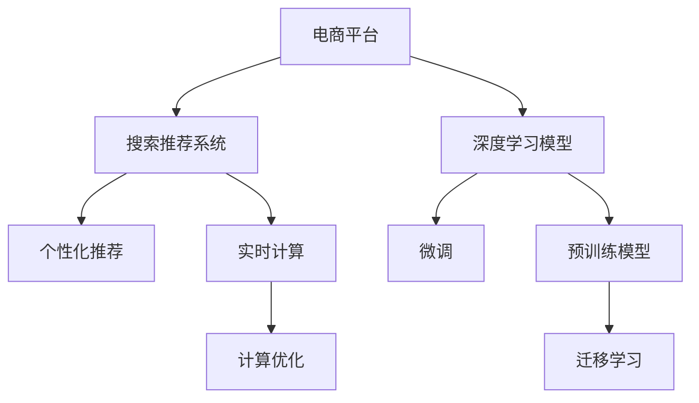

                 

# 电商平台的AI 大模型转型：搜索推荐系统是核心，数据质量与处理效率

> 关键词：电商平台, AI大模型, 搜索推荐系统, 数据质量, 数据处理效率, 深度学习, 优化算法, 模型集成, 实时计算

## 1. 背景介绍

### 1.1 问题由来
随着互联网的快速发展和电子商务的兴起，电商平台成为了连接商家与消费者的重要平台。然而，平台上的海量商品和用户数据，为电商平台带来了前所未有的挑战：如何在满足海量数据处理需求的同时，提升用户体验，增加商家转化率，成为当下亟需解决的核心问题。

AI技术，特别是深度学习和自然语言处理技术，为电商平台提供了强大的技术支持。通过深度学习模型，电商平台可以自动抓取用户行为数据、产品描述和用户评论等信息，构建用户画像和产品标签，从而进行更精准的商品推荐和个性化搜索。

然而，深度学习模型往往需要大规模的标注数据和计算资源，这给电商平台的AI转型带来了不小的压力。近年来，大规模预训练模型和模型微调技术的发展，为电商平台提供了一条更为高效、便捷的AI转型之路。基于大规模预训练模型，电商平台可以构建高性能的搜索推荐系统，提升平台的用户体验和商家收益。

### 1.2 问题核心关键点
电商平台的AI转型，核心在于如何构建高效、精准的搜索推荐系统，提升用户购物体验，增加商家转化率。具体来说，包括以下几个方面：

1. **大规模预训练模型的应用**：电商平台可以利用大规模预训练模型，如BERT、GPT等，进行快速的模型微调，适应平台的特定需求。
2. **用户画像和商品标签的构建**：通过深度学习模型，电商平台可以自动从用户行为数据、商品描述中提取信息，构建高质量的用户画像和商品标签。
3. **个性化推荐和搜索算法**：基于用户画像和商品标签，电商平台可以开发高效的个性化推荐和搜索算法，提升搜索推荐效果。
4. **实时计算和计算优化**：电商平台的搜索推荐系统需要具备实时计算能力，同时需要对模型和算法进行优化，以应对大规模数据和复杂算法的计算压力。

## 2. 核心概念与联系

### 2.1 核心概念概述

为更好地理解电商平台AI转型的核心概念，本节将介绍几个密切相关的核心概念：

- **电商平台**：指通过互联网提供商品交易、信息共享、用户交互等服务的综合性平台，如淘宝、京东、Amazon等。
- **搜索推荐系统**：指根据用户查询和历史行为数据，自动推荐相关商品和内容的系统，是电商平台的核心功能之一。
- **深度学习模型**：指基于神经网络架构的模型，如卷积神经网络(CNN)、循环神经网络(RNN)、变压器(Transformer)等，常用于处理大规模数据和复杂任务。
- **预训练模型**：指在无标签大规模数据上预训练的模型，如BERT、GPT等，具备较强的通用语言理解和生成能力。
- **微调(MFine-tuning)**：指在预训练模型的基础上，使用下游任务的少量标注数据，通过有监督学习优化模型在特定任务上的性能。
- **迁移学习**：指将一个领域学习到的知识，迁移应用到另一个不同但相关的领域的学习范式。
- **实时计算**：指系统能够在短时间内处理并返回结果的能力，是电商搜索推荐系统的重要特性。
- **计算优化**：指对模型和算法进行优化，以提高计算效率和资源利用率的技术，如模型剪枝、量化、分布式计算等。

这些核心概念之间的逻辑关系可以通过以下Mermaid流程图来展示：



这个流程图展示了大模型微调方法在电商平台中的核心概念及其之间的关系：

1. 电商平台利用深度学习模型，在无标签大规模数据上预训练出高性能的预训练模型。
2. 电商平台的搜索推荐系统，通过微调预训练模型，构建个性化推荐和搜索算法。
3. 迁移学习将预训练模型应用到不同的电商场景中，提升模型泛化能力。
4. 实时计算和计算优化技术，保证搜索推荐系统能够快速响应用户请求，提升用户体验。

这些概念共同构成了电商平台AI转型的技术框架，使其能够在满足用户需求的同时，提升平台的商业价值。

## 3. 核心算法原理 & 具体操作步骤

### 3.1 算法原理概述

基于深度学习模型的电商搜索推荐系统，本质上是一个大规模数据上的有监督学习过程。其核心思想是：利用大规模无标签数据，在预训练模型上进行深度学习，提取语义特征和用户行为模式，然后在下游任务上使用少量标注数据进行微调，优化模型在特定任务上的性能。

形式化地，假设预训练模型为 $M_{\theta}$，其中 $\theta$ 为预训练得到的模型参数。给定电商平台的数据集 $D=\{(x_i,y_i)\}_{i=1}^N$，搜索推荐系统的目标是通过微调，使得模型输出能够匹配用户搜索请求 $x$ 和商品推荐 $y$，即：

$$
\hat{\theta}=\mathop{\arg\min}_{\theta} \mathcal{L}(M_{\theta},D)
$$

其中 $\mathcal{L}$ 为针对电商搜索推荐任务的损失函数，用于衡量模型预测输出与真实标签之间的差异。常见的损失函数包括交叉熵损失、均方误差损失等。

通过梯度下降等优化算法，微调过程不断更新模型参数 $\theta$，最小化损失函数 $\mathcal{L}$，使得模型输出逼近真实标签。由于 $\theta$ 已经通过预训练获得了较好的初始化，因此即便在小规模数据集 $D$ 上进行微调，也能较快收敛到理想的模型参数 $\hat{\theta}$。

### 3.2 算法步骤详解

基于深度学习模型的电商搜索推荐系统，一般包括以下几个关键步骤：

**Step 1: 准备预训练模型和数据集**
- 选择合适的预训练模型 $M_{\theta}$ 作为初始化参数，如 BERT、GPT等。
- 准备电商平台的商品、用户行为数据集 $D$，划分为训练集、验证集和测试集。一般要求标注数据与预训练数据的分布不要差异过大。

**Step 2: 添加任务适配层**
- 根据任务类型，在预训练模型顶层设计合适的输出层和损失函数。
- 对于推荐任务，通常在顶层添加全连接层和交叉熵损失函数。
- 对于搜索任务，通常使用语言模型的解码器输出概率分布，并以负对数似然为损失函数。

**Step 3: 设置微调超参数**
- 选择合适的优化算法及其参数，如 AdamW、SGD 等，设置学习率、批大小、迭代轮数等。
- 设置正则化技术及强度，包括权重衰减、Dropout、Early Stopping等。
- 确定冻结预训练参数的策略，如仅微调顶层，或全部参数都参与微调。

**Step 4: 执行梯度训练**
- 将训练集数据分批次输入模型，前向传播计算损失函数。
- 反向传播计算参数梯度，根据设定的优化算法和学习率更新模型参数。
- 周期性在验证集上评估模型性能，根据性能指标决定是否触发 Early Stopping。
- 重复上述步骤直到满足预设的迭代轮数或 Early Stopping 条件。

**Step 5: 测试和部署**
- 在测试集上评估微调后模型 $M_{\hat{\theta}}$ 的性能，对比微调前后的精度提升。
- 使用微调后的模型对新样本进行推理预测，集成到实际的应用系统中。
- 持续收集新的数据，定期重新微调模型，以适应数据分布的变化。

以上是基于深度学习模型的电商搜索推荐系统的一般流程。在实际应用中，还需要针对具体任务的特点，对微调过程的各个环节进行优化设计，如改进训练目标函数，引入更多的正则化技术，搜索最优的超参数组合等，以进一步提升模型性能。

### 3.3 算法优缺点

基于深度学习模型的电商搜索推荐系统，具有以下优点：
1. 高性能。深度学习模型能够从海量数据中学习出复杂特征，准确性较高。
2. 可扩展性。模型参数可以通过分布式计算进行扩展，适应大规模数据和复杂任务。
3. 适应性强。模型能够动态适应不同的电商场景和用户行为，提升推荐效果。
4. 实时响应。深度学习模型可以进行实时计算，快速响应用户请求。

同时，该方法也存在一定的局限性：
1. 数据依赖。微调效果依赖标注数据的质量和数量，获取高质量标注数据的成本较高。
2. 过拟合风险。模型参数较多，容易发生过拟合，需要严格控制过拟合风险。
3. 计算资源需求高。深度学习模型需要较大的计算资源进行训练和推理，成本较高。
4. 可解释性不足。深度学习模型的决策过程通常缺乏可解释性，难以对其推理逻辑进行分析和调试。

尽管存在这些局限性，但就目前而言，基于深度学习的电商搜索推荐系统仍是目前的主流范式。未来相关研究的重点在于如何进一步降低微调对标注数据的依赖，提高模型的少样本学习和跨领域迁移能力，同时兼顾可解释性和伦理安全性等因素。

### 3.4 算法应用领域

基于深度学习模型的电商搜索推荐系统，已经广泛应用于各大电商平台的搜索推荐功能中，如淘宝的推荐商品、京东的个性化搜索结果等。具体应用场景包括：

- 商品推荐：根据用户浏览、购买历史等行为数据，推荐可能感兴趣的商品。
- 智能客服：通过自然语言处理技术，自动回答用户查询，提供个性化服务。
- 广告投放：根据用户画像和行为数据，自动推荐用户感兴趣的广告。
- 个性化搜索：根据用户输入的查询，自动返回最相关的商品信息。
- 动态定价：根据市场需求和用户行为数据，动态调整商品价格。

除了上述这些经典应用外，搜索推荐系统还被创新性地应用于更多场景中，如用户兴趣预测、用户行为分析、商品组合推荐等，为电商平台的个性化服务提供了新的手段。

## 4. 数学模型和公式 & 详细讲解  
### 4.1 数学模型构建

本节将使用数学语言对基于深度学习模型的电商搜索推荐系统进行更加严格的刻画。

记预训练模型为 $M_{\theta}$，其中 $\theta$ 为模型参数。假设电商平台的推荐数据集为 $D=\{(x_i,y_i)\}_{i=1}^N, x_i \in \mathbb{R}^d, y_i \in \{1,2,\cdots,K\}$，其中 $d$ 为输入向量维度，$K$ 为商品种类数。

定义模型 $M_{\theta}$ 在输入 $x$ 上的输出为 $M_{\theta}(x)=\sigma(Wx+b)$，其中 $\sigma$ 为激活函数，$W$ 和 $b$ 为模型参数。推荐任务的损失函数定义为：

$$
\ell(M_{\theta}(x),y) = -\sum_{k=1}^K y_k \log \sigma(Wx_k + b_k)
$$

其中 $x_k$ 表示商品 $k$ 的描述向量，$y_k$ 表示商品 $k$ 的标签向量。

将损失函数扩展到整个数据集，得：

$$
\mathcal{L}(\theta) = -\frac{1}{N}\sum_{i=1}^N \ell(M_{\theta}(x_i),y_i)
$$

微调的优化目标是最小化经验风险，即找到最优参数：

$$
\theta^* = \mathop{\arg\min}_{\theta} \mathcal{L}(\theta)
$$

在实践中，我们通常使用基于梯度的优化算法（如Adam、SGD等）来近似求解上述最优化问题。设 $\eta$ 为学习率，$\lambda$ 为正则化系数，则参数的更新公式为：

$$
\theta \leftarrow \theta - \eta \nabla_{\theta}\mathcal{L}(\theta) - \eta\lambda\theta
$$

其中 $\nabla_{\theta}\mathcal{L}(\theta)$ 为损失函数对参数 $\theta$ 的梯度，可通过反向传播算法高效计算。

### 4.2 公式推导过程

以下我们以商品推荐任务为例，推导交叉熵损失函数及其梯度的计算公式。

假设模型 $M_{\theta}$ 在输入 $x$ 上的输出为 $M_{\theta}(x) \in [0,1]$，表示商品 $k$ 被推荐给用户 $i$ 的概率。真实标签 $y \in \{1,2,\cdots,K\}$。则交叉熵损失函数定义为：

$$
\ell(M_{\theta}(x),y) = -\log M_{\theta}(x_k)
$$

将其代入经验风险公式，得：

$$
\mathcal{L}(\theta) = -\frac{1}{N}\sum_{i=1}^N \sum_{k=1}^K y_k \log M_{\theta}(x_k)
$$

根据链式法则，损失函数对参数 $\theta_k$ 的梯度为：

$$
\frac{\partial \mathcal{L}(\theta)}{\partial \theta_k} = -\frac{1}{N}\sum_{i=1}^N \sum_{k=1}^K y_k \frac{\partial M_{\theta}(x_k)}{\partial \theta_k}
$$

其中 $\frac{\partial M_{\theta}(x_k)}{\partial \theta_k}$ 可进一步递归展开，利用自动微分技术完成计算。

在得到损失函数的梯度后，即可带入参数更新公式，完成模型的迭代优化。重复上述过程直至收敛，最终得到适应电商平台推荐任务的最优模型参数 $\theta^*$。

## 5. 项目实践：代码实例和详细解释说明
### 5.1 开发环境搭建

在进行电商搜索推荐系统开发前，我们需要准备好开发环境。以下是使用Python进行PyTorch开发的环境配置流程：

1. 安装Anaconda：从官网下载并安装Anaconda，用于创建独立的Python环境。

2. 创建并激活虚拟环境：
```bash
conda create -n ecommerce-env python=3.8 
conda activate ecommerce-env
```

3. 安装PyTorch：根据CUDA版本，从官网获取对应的安装命令。例如：
```bash
conda install pytorch torchvision torchaudio cudatoolkit=11.1 -c pytorch -c conda-forge
```

4. 安装TensorBoard：
```bash
pip install tensorboard
```

5. 安装各类工具包：
```bash
pip install numpy pandas scikit-learn matplotlib tqdm jupyter notebook ipython
```

完成上述步骤后，即可在`ecommerce-env`环境中开始电商搜索推荐系统的开发。

### 5.2 源代码详细实现

下面我以商品推荐任务为例，给出使用Transformers库对BERT模型进行电商推荐系统的PyTorch代码实现。

首先，定义推荐任务的数据处理函数：

```python
from transformers import BertTokenizer
from torch.utils.data import Dataset
import torch

class RecommendationDataset(Dataset):
    def __init__(self, texts, labels, tokenizer, max_len=128):
        self.texts = texts
        self.labels = labels
        self.tokenizer = tokenizer
        self.max_len = max_len
        
    def __len__(self):
        return len(self.texts)
    
    def __getitem__(self, item):
        text = self.texts[item]
        label = self.labels[item]
        
        encoding = self.tokenizer(text, return_tensors='pt', max_length=self.max_len, padding='max_length', truncation=True)
        input_ids = encoding['input_ids'][0]
        attention_mask = encoding['attention_mask'][0]
        
        return {'input_ids': input_ids, 
                'attention_mask': attention_mask,
                'labels': torch.tensor(label, dtype=torch.long)}
```

然后，定义模型和优化器：

```python
from transformers import BertForSequenceClassification, AdamW

model = BertForSequenceClassification.from_pretrained('bert-base-cased', num_labels=1000)

optimizer = AdamW(model.parameters(), lr=2e-5)
```

接着，定义训练和评估函数：

```python
from torch.utils.data import DataLoader
from tqdm import tqdm
from sklearn.metrics import classification_report

device = torch.device('cuda') if torch.cuda.is_available() else torch.device('cpu')
model.to(device)

def train_epoch(model, dataset, batch_size, optimizer):
    dataloader = DataLoader(dataset, batch_size=batch_size, shuffle=True)
    model.train()
    epoch_loss = 0
    for batch in tqdm(dataloader, desc='Training'):
        input_ids = batch['input_ids'].to(device)
        attention_mask = batch['attention_mask'].to(device)
        labels = batch['labels'].to(device)
        model.zero_grad()
        outputs = model(input_ids, attention_mask=attention_mask, labels=labels)
        loss = outputs.loss
        epoch_loss += loss.item()
        loss.backward()
        optimizer.step()
    return epoch_loss / len(dataloader)

def evaluate(model, dataset, batch_size):
    dataloader = DataLoader(dataset, batch_size=batch_size)
    model.eval()
    preds, labels = [], []
    with torch.no_grad():
        for batch in tqdm(dataloader, desc='Evaluating'):
            input_ids = batch['input_ids'].to(device)
            attention_mask = batch['attention_mask'].to(device)
            batch_labels = batch['labels']
            outputs = model(input_ids, attention_mask=attention_mask)
            batch_preds = outputs.logits.argmax(dim=2).to('cpu').tolist()
            batch_labels = batch_labels.to('cpu').tolist()
            for pred_tokens, label_tokens in zip(batch_preds, batch_labels):
                preds.append(pred_tokens)
                labels.append(label_tokens)
                
    print(classification_report(labels, preds))
```

最后，启动训练流程并在测试集上评估：

```python
epochs = 5
batch_size = 16

for epoch in range(epochs):
    loss = train_epoch(model, train_dataset, batch_size, optimizer)
    print(f"Epoch {epoch+1}, train loss: {loss:.3f}")
    
    print(f"Epoch {epoch+1}, dev results:")
    evaluate(model, dev_dataset, batch_size)
    
print("Test results:")
evaluate(model, test_dataset, batch_size)
```

以上就是使用PyTorch对BERT进行电商推荐系统微调的完整代码实现。可以看到，得益于Transformers库的强大封装，我们可以用相对简洁的代码完成BERT模型的加载和微调。

### 5.3 代码解读与分析

让我们再详细解读一下关键代码的实现细节：

**RecommendationDataset类**：
- `__init__`方法：初始化文本、标签、分词器等关键组件。
- `__len__`方法：返回数据集的样本数量。
- `__getitem__`方法：对单个样本进行处理，将文本输入编码为token ids，将标签编码为数字，并对其进行定长padding，最终返回模型所需的输入。

**标签与id的映射**：
- 定义了标签与数字id之间的映射关系，用于将token-wise的预测结果解码回真实的标签。

**训练和评估函数**：
- 使用PyTorch的DataLoader对数据集进行批次化加载，供模型训练和推理使用。
- 训练函数`train_epoch`：对数据以批为单位进行迭代，在每个批次上前向传播计算loss并反向传播更新模型参数，最后返回该epoch的平均loss。
- 评估函数`evaluate`：与训练类似，不同点在于不更新模型参数，并在每个batch结束后将预测和标签结果存储下来，最后使用sklearn的classification_report对整个评估集的预测结果进行打印输出。

**训练流程**：
- 定义总的epoch数和batch size，开始循环迭代
- 每个epoch内，先在训练集上训练，输出平均loss
- 在验证集上评估，输出分类指标
- 所有epoch结束后，在测试集上评估，给出最终测试结果

可以看到，PyTorch配合Transformers库使得BERT微调的代码实现变得简洁高效。开发者可以将更多精力放在数据处理、模型改进等高层逻辑上，而不必过多关注底层的实现细节。

当然，工业级的系统实现还需考虑更多因素，如模型的保存和部署、超参数的自动搜索、更灵活的任务适配层等。但核心的微调范式基本与此类似。

## 6. 实际应用场景

### 6.1 智能客服系统

基于大语言模型微调的对话技术，可以广泛应用于智能客服系统的构建。传统客服往往需要配备大量人力，高峰期响应缓慢，且一致性和专业性难以保证。而使用微调后的对话模型，可以7x24小时不间断服务，快速响应客户咨询，用自然流畅的语言解答各类常见问题。

在技术实现上，可以收集企业内部的历史客服对话记录，将问题和最佳答复构建成监督数据，在此基础上对预训练对话模型进行微调。微调后的对话模型能够自动理解用户意图，匹配最合适的答案模板进行回复。对于客户提出的新问题，还可以接入检索系统实时搜索相关内容，动态组织生成回答。如此构建的智能客服系统，能大幅提升客户咨询体验和问题解决效率。

### 6.2 金融舆情监测

金融机构需要实时监测市场舆论动向，以便及时应对负面信息传播，规避金融风险。传统的人工监测方式成本高、效率低，难以应对网络时代海量信息爆发的挑战。基于大语言模型微调的文本分类和情感分析技术，为金融舆情监测提供了新的解决方案。

具体而言，可以收集金融领域相关的新闻、报道、评论等文本数据，并对其进行主题标注和情感标注。在此基础上对预训练语言模型进行微调，使其能够自动判断文本属于何种主题，情感倾向是正面、中性还是负面。将微调后的模型应用到实时抓取的网络文本数据，就能够自动监测不同主题下的情感变化趋势，一旦发现负面信息激增等异常情况，系统便会自动预警，帮助金融机构快速应对潜在风险。

### 6.3 个性化推荐系统

当前的推荐系统往往只依赖用户的历史行为数据进行物品推荐，无法深入理解用户的真实兴趣偏好。基于大语言模型微调技术，个性化推荐系统可以更好地挖掘用户行为背后的语义信息，从而提供更精准、多样的推荐内容。

在实践中，可以收集用户浏览、点击、评论、分享等行为数据，提取和用户交互的物品标题、描述、标签等文本内容。将文本内容作为模型输入，用户的后续行为（如是否点击、购买等）作为监督信号，在此基础上微调预训练语言模型。微调后的模型能够从文本内容中准确把握用户的兴趣点。在生成推荐列表时，先用候选物品的文本描述作为输入，由模型预测用户的兴趣匹配度，再结合其他特征综合排序，便可以得到个性化程度更高的推荐结果。

### 6.4 未来应用展望

随着大语言模型微调技术的发展，基于微调范式将在更多领域得到应用，为传统行业带来变革性影响。

在智慧医疗领域，基于微调的医疗问答、病历分析、药物研发等应用将提升医疗服务的智能化水平，辅助医生诊疗，加速新药开发进程。

在智能教育领域，微调技术可应用于作业批改、学情分析、知识推荐等方面，因材施教，促进教育公平，提高教学质量。

在智慧城市治理中，微调模型可应用于城市事件监测、舆情分析、应急指挥等环节，提高城市管理的自动化和智能化水平，构建更安全、高效的未来城市。

此外，在企业生产、社会治理、文娱传媒等众多领域，基于大模型微调的人工智能应用也将不断涌现，为经济社会发展注入新的动力。相信随着技术的日益成熟，微调方法将成为人工智能落地应用的重要范式，推动人工智能技术在各个行业的普及和应用。

## 7. 工具和资源推荐

### 7.1 学习资源推荐

为了帮助开发者系统掌握大模型微调的理论基础和实践技巧，这里推荐一些优质的学习资源：

1. 《Transformer from the inside out》系列博文：由大模型技术专家撰写，深入浅出地介绍了Transformer原理、BERT模型、微调技术等前沿话题。

2. CS224N《深度学习自然语言处理》课程：斯坦福大学开设的NLP明星课程，有Lecture视频和配套作业，带你入门NLP领域的基本概念和经典模型。

3. 《Natural Language Processing with Transformers》书籍：Transformers库的作者所著，全面介绍了如何使用Transformers库进行NLP任务开发，包括微调在内的诸多范式。

4. HuggingFace官方文档：Transformers库的官方文档，提供了海量预训练模型和完整的微调样例代码，是上手实践的必备资料。

5. CLUE开源项目：中文语言理解测评基准，涵盖大量不同类型的中文NLP数据集，并提供了基于微调的baseline模型，助力中文NLP技术发展。

通过对这些资源的学习实践，相信你一定能够快速掌握大语言模型微调的精髓，并用于解决实际的NLP问题。

### 7.2 开发工具推荐

高效的开发离不开优秀的工具支持。以下是几款用于大语言模型微调开发的常用工具：

1. PyTorch：基于Python的开源深度学习框架，灵活动态的计算图，适合快速迭代研究。大部分预训练语言模型都有PyTorch版本的实现。

2. TensorFlow：由Google主导开发的开源深度学习框架，生产部署方便，适合大规模工程应用。同样有丰富的预训练语言模型资源。

3. Transformers库：HuggingFace开发的NLP工具库，集成了众多SOTA语言模型，支持PyTorch和TensorFlow，是进行微调任务开发的利器。

4. Weights & Biases：模型训练的实验跟踪工具，可以记录和可视化模型训练过程中的各项指标，方便对比和调优。与主流深度学习框架无缝集成。

5. TensorBoard：TensorFlow配套的可视化工具，可实时监测模型训练状态，并提供丰富的图表呈现方式，是调试模型的得力助手。

6. Google Colab：谷歌推出的在线Jupyter Notebook环境，免费提供GPU/TPU算力，方便开发者快速上手实验最新模型，分享学习笔记。

合理利用这些工具，可以显著提升大语言模型微调任务的开发效率，加快创新迭代的步伐。

### 7.3 相关论文推荐

大语言模型和微调技术的发展源于学界的持续研究。以下是几篇奠基性的相关论文，推荐阅读：

1. Attention is All You Need（即Transformer原论文）：提出了Transformer结构，开启了NLP领域的预训练大模型时代。

2. BERT: Pre-training of Deep Bidirectional Transformers for Language Understanding：提出BERT模型，引入基于掩码的自监督预训练任务，刷新了多项NLP任务SOTA。

3. Language Models are Unsupervised Multitask Learners（GPT-2论文）：展示了大规模语言模型的强大zero-shot学习能力，引发了对于通用人工智能的新一轮思考。

4. Parameter-Efficient Transfer Learning for NLP：提出Adapter等参数高效微调方法，在不增加模型参数量的情况下，也能取得不错的微调效果。

5. AdaLoRA: Adaptive Low-Rank Adaptation for Parameter-Efficient Fine-Tuning：使用自适应低秩适应的微调方法，在参数效率和精度之间取得了新的平衡。

这些论文代表了大语言模型微调技术的发展脉络。通过学习这些前沿成果，可以帮助研究者把握学科前进方向，激发更多的创新灵感。

## 8. 总结：未来发展趋势与挑战

### 8.1 总结

本文对基于深度学习模型的电商搜索推荐系统的构建方法进行了全面系统的介绍。首先阐述了电商平台AI转型的背景和意义，明确了搜索推荐系统在电商平台中的核心地位。其次，从原理到实践，详细讲解了深度学习模型的微调步骤和优化算法，给出了电商推荐系统的完整代码实现。同时，本文还广泛探讨了微调方法在智能客服、金融舆情、个性化推荐等多个电商场景中的应用前景，展示了微调范式的巨大潜力。此外，本文精选了微调技术的各类学习资源，力求为读者提供全方位的技术指引。

通过本文的系统梳理，可以看到，基于深度学习模型的电商搜索推荐系统，已经成为电商平台AI转型的核心引擎。大语言模型微调方法在电商平台中的应用，不仅提升了用户体验和商家收益，也为传统行业数字化转型提供了新的技术路径。未来，伴随深度学习模型和微调方法的不断演进，搜索推荐系统将变得更加智能、高效，为电商平台的智能化升级注入新动能。

### 8.2 未来发展趋势

展望未来，大语言模型微调技术在电商平台的AI转型中，将呈现以下几个发展趋势：

1. **预训练模型规模更大**：随着算力成本的下降和数据规模的扩张，预训练语言模型的参数量还将持续增长。超大规模语言模型蕴含的丰富语言知识，有望支撑更加复杂多变的电商搜索推荐任务。

2. **微调方法更加多样化**：除了传统的全参数微调外，未来会涌现更多参数高效的微调方法，如Prefix-Tuning、LoRA等，在节省计算资源的同时也能保证微调精度。

3. **实时计算能力更强**：电商平台的搜索推荐系统需要具备实时计算能力，同时需要对模型和算法进行优化，以应对大规模数据和复杂算法的计算压力。分布式计算、量化加速等技术将得到广泛应用。

4. **多模态融合技术**：未来的搜索推荐系统将更多地融合图像、视频等多模态信息，提升对电商场景的感知和理解能力。多模态信息的协同建模，将成为电商搜索推荐的重要趋势。

5. **模型可解释性和鲁棒性**：电商搜索推荐系统需要在保证高性能的同时，提高模型的可解释性和鲁棒性。未来的研究方向将包括模型压缩、知识蒸馏、对抗训练等技术。

6. **数据和知识驱动**：未来的电商搜索推荐系统将更多地利用外部知识库、规则库等专家知识，通过知识图谱等技术，提升模型的理解能力和推理能力。

以上趋势凸显了大语言模型微调技术在电商平台中的广阔前景。这些方向的探索发展，必将进一步提升电商搜索推荐系统的性能和用户体验，为电商平台带来更大的商业价值。

### 8.3 面临的挑战

尽管大语言模型微调技术已经取得了显著成果，但在迈向更加智能化、普适化应用的过程中，它仍面临着诸多挑战：

1. **数据依赖性**：微调效果依赖标注数据的质量和数量，获取高质量标注数据的成本较高。如何进一步降低微调对标注数据的依赖，将是一大难题。

2. **过拟合风险**：模型参数较多，容易发生过拟合，需要严格控制过拟合风险。如何在保证性能的同时，避免过拟合，仍需不断优化微调算法。

3. **计算资源需求高**：深度学习模型需要较大的计算资源进行训练和推理，成本较高。如何通过优化算法、硬件加速等手段，降低计算资源的需求，仍需持续努力。

4. **可解释性不足**：深度学习模型的决策过程通常缺乏可解释性，难以对其推理逻辑进行分析和调试。如何赋予模型更强的可解释性，将是亟待攻克的难题。

5. **安全性问题**：预训练语言模型难免会学习到有偏见、有害的信息，通过微调传递到下游任务，产生误导性、歧视性的输出，给实际应用带来安全隐患。如何从数据和算法层面消除模型偏见，避免恶意用途，确保输出的安全性，也将是重要的研究课题。

6. **知识整合能力不足**：现有的微调模型往往局限于任务内数据，难以灵活吸收和运用更广泛的先验知识。如何让微调过程更好地与外部知识库、规则库等专家知识结合，形成更加全面、准确的信息整合能力，还有很大的想象空间。

正视微调面临的这些挑战，积极应对并寻求突破，将是大语言模型微调走向成熟的必由之路。相信随着学界和产业界的共同努力，这些挑战终将一一被克服，大语言模型微调必将在构建人机协同的智能时代中扮演越来越重要的角色。

### 8.4 研究展望

面向未来，大语言模型微调技术的研究方向将更加多样和深入，具体包括：

1. **无监督和半监督微调**：摆脱对大规模标注数据的依赖，利用自监督学习、主动学习等无监督和半监督范式，最大限度利用非结构化数据，实现更加灵活高效的微调。

2. **参数高效微调和计算高效微调**：开发更加参数高效的微调方法，在固定大部分预训练参数的同时，只更新极少量的任务相关参数。同时优化微调模型的计算图，减少前向传播和反向传播的资源消耗，实现更加轻量级、实时性的部署。

3. **因果推断和对比学习**：引入因果推断和对比学习思想，增强微调模型建立稳定因果关系的能力，学习更加普适、鲁棒的语言表征，从而提升模型泛化性和抗干扰能力。

4. **多模态融合与协同建模**：将符号化的先验知识，如知识图谱、逻辑规则等，与神经网络模型进行巧妙融合，引导微调过程学习更准确、合理的语言模型。同时加强不同模态数据的整合，实现视觉、语音等多模态信息与文本信息的协同建模。

5. **知识图谱与智能问答系统**：通过知识图谱等外部知识库的融合，提升电商搜索推荐系统的理解能力和推理能力。构建智能问答系统，为用户提供更精准的搜索和推荐服务。

6. **伦理与隐私保护**：在模型训练目标中引入伦理导向的评估指标，过滤和惩罚有偏见、有害的输出倾向。同时加强人工干预和审核，建立模型行为的监管机制，确保输出符合人类价值观和伦理道德。

这些研究方向的研究，必将引领大语言模型微调技术迈向更高的台阶，为构建安全、可靠、可解释、可控的智能系统铺平道路。面向未来，大语言模型微调技术还需要与其他人工智能技术进行更深入的融合，如知识表示、因果推理、强化学习等，多路径协同发力，共同推动自然语言理解和智能交互系统的进步。只有勇于创新、敢于突破，才能不断拓展语言模型的边界，让智能技术更好地造福人类社会。

## 9. 附录：常见问题与解答

**Q1：电商搜索推荐系统的核心是什么？**

A: 电商搜索推荐系统的核心在于构建高效的搜索和推荐算法，提升用户体验和商家收益。具体来说，包括以下几个方面：

1. **商品推荐算法**：基于用户历史行为数据、商品描述和用户画像，推荐可能感兴趣的商品。
2. **个性化搜索算法**：根据用户输入的查询，自动返回最相关的商品信息。
3. **实时计算能力**：系统能够快速响应用户请求，实时更新推荐结果。
4. **数据质量**：电商搜索推荐系统需要高质量的数据支持，包括商品描述、用户行为数据等。

**Q2：电商平台的AI转型中，大语言模型微调有哪些应用场景？**

A: 电商平台的AI转型中，大语言模型微调主要应用于以下几个场景：

1. **智能客服系统**：通过微调后的对话模型，提升客服系统的智能化水平，实现自动问答和客户引导。
2. **金融舆情监测**：利用微调后的文本分类和情感分析模型，实时监测市场舆论动向，预警金融风险。
3. **个性化推荐系统**：基于用户行为数据，微调深度学习模型，提升推荐效果和用户满意度。
4. **动态定价**：根据市场需求和用户行为数据，微调价格模型，实现价格优化和市场调节。
5. **用户画像与行为分析**：利用微调后的用户画像模型，分析用户行为，提升用户粘性和购买转化率。

**Q3：大语言模型微调过程中，如何提高模型的泛化能力？**

A: 提高大语言模型微调的泛化能力，可以从以下几个方面入手：

1. **数据多样性**：收集多样化的数据，包括不同领域、不同规模、不同格式的数据，确保模型能够适应各种场景。
2. **数据增强**：通过数据增强技术，如回译、近义替换等，扩充训练集，提高模型的泛化能力。
3. **正则化技术**：应用L2正则、Dropout等正则化技术，避免模型过拟合。
4. **迁移学习**：利用预训练模型在不同领域之间的迁移学习能力，提升模型的泛化能力。
5. **对抗训练**：引入对抗样本，提高模型的鲁棒性和泛化能力。

**Q4：电商搜索推荐系统如何平衡精度和实时性？**

A: 电商搜索推荐系统需要在精度和实时性之间进行平衡，具体方法包括：

1. **模型压缩**：通过模型剪枝、量化等技术，减少模型参数量和计算资源消耗，提升实时性。
2. **分布式计算**：利用分布式计算框架，如TensorFlow、PyTorch等，并行处理大规模数据，提升系统响应速度。
3. **缓存机制**：对常用查询和推荐结果进行缓存，减少重复计算，提升实时性。
4. **动态更新**：根据用户行为实时更新推荐结果，提升推荐精度和用户体验。

**Q5：电商搜索推荐系统在数据处理上需要注意哪些问题？**

A: 电商搜索推荐系统在数据处理上需要注意以下几个问题：

1. **数据质量**：电商搜索推荐系统依赖高质量的数据，包括商品描述、用户行为数据等，需要进行严格的数据清洗和标注。
2. **数据隐私**：电商平台的搜索推荐系统需要保护用户隐私，确保数据使用的合法性和安全性。
3. **数据融合**：电商搜索推荐系统需要融合多种数据源，如用户行为数据、商品描述、社交媒体数据等，以提升推荐效果。
4. **数据安全**：电商平台的搜索推荐系统需要防止数据泄露和滥用，确保数据安全。

综上所述，电商平台的AI转型需要充分利用大语言模型微调技术，提升搜索推荐系统的智能化水平，同时注意数据质量、隐私保护和实时计算等问题，以实现用户和商家共赢的目标。只有通过不断优化模型和算法，才能构建更加高效、精准、安全的电商搜索推荐系统。

---

作者：禅与计算机程序设计艺术 / Zen and the Art of Computer Programming

