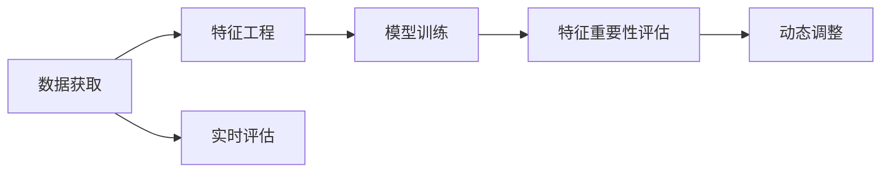

                 

# 电商推荐系统中的实时特征重要性评估

> 关键词：实时推荐系统, 特征重要性, 电商推荐, 协同过滤, 深度学习, 特征选择, 实验设计

## 1. 背景介绍

在电商推荐系统中，个性化推荐的质量直接影响着用户的购物体验和商家的销售业绩。通过算法推荐系统为用户推荐最符合其兴趣和需求的商品，不仅能够提升用户体验，还能够提高商家销售额和运营效率。然而，个性化推荐系统的高质量推荐依赖于对用户行为和商品属性的精准理解和建模。

特征工程是推荐系统中至关重要的环节之一。在推荐算法中，用户行为数据和商品属性数据往往通过各种特征工程技术转化为模型可以处理的特征向量。这些特征向量的选择和组合会直接影响推荐结果的质量。特别是在电商领域，用户行为数据和商品属性数据量大且多样，如何高效、准确地选择和组合这些特征，成为提升推荐系统效果的关键问题。

特征重要性评估是特征工程中一个重要的环节，用于衡量各个特征对推荐结果的贡献大小。准确的特征重要性评估可以指导特征选择，避免不必要特征的引入，降低模型复杂度，提升推荐效率和效果。本论文将介绍在电商推荐系统中进行实时特征重要性评估的方法，并结合实验结果对比不同方法的优劣。

## 2. 核心概念与联系

在电商推荐系统中，特征重要性评估主要涉及以下几个核心概念：

### 2.1 核心概念概述

1. **电商推荐系统 (Electronic Commerce Recommendation System)**：基于用户行为数据和商品属性数据，为电商用户推荐个性化商品的系统。电商推荐系统通常采用协同过滤、内容推荐、混合推荐等算法。

2. **特征重要性 (Feature Importance)**：衡量每个特征对推荐结果的贡献大小，用于特征选择、降维等特征工程任务。

3. **实时特征重要性评估 (Real-time Feature Importance Estimation)**：在用户行为数据和商品属性数据变化时，实时地更新特征重要性，指导推荐模型动态调整。

4. **协同过滤 (Collaborative Filtering)**：基于用户行为或商品属性相似性进行推荐。主要包括用户-用户协同过滤和物品-物品协同过滤。

5. **深度学习 (Deep Learning)**：利用神经网络等深度模型，对用户行为数据和商品属性数据进行建模和推荐。

6. **特征选择 (Feature Selection)**：从原始特征中选择最相关的特征，避免冗余和不相关特征，提升模型效率和效果。

7. **实验设计 (Experiment Design)**：设计实验方案和评估方法，对特征重要性评估方法进行对比和评估。

### 2.2 核心概念联系

电商推荐系统中的特征重要性评估涉及到以下几个关键环节：

1. **数据获取**：收集电商用户行为数据和商品属性数据。
2. **特征工程**：将原始数据转化为特征向量。
3. **模型训练**：选择和训练推荐模型。
4. **特征重要性评估**：通过模型输出结果或模型内部的权重参数，评估特征重要性。
5. **动态调整**：根据特征重要性评估结果，动态调整模型或特征向量。
6. **实时评估**：在用户行为数据和商品属性数据变化时，实时地更新特征重要性。

通过以上步骤，电商推荐系统能够根据实时数据的变化，动态调整特征权重，提升推荐效果。

以下是一个Mermaid流程图，展示了电商推荐系统中特征重要性评估的关键流程：



## 3. 核心算法原理 & 具体操作步骤
### 3.1 算法原理概述

在电商推荐系统中，特征重要性评估的目的是为了选择最相关的特征，并动态调整特征权重，以提升推荐效果。本论文将介绍基于协同过滤和深度学习两种主流推荐算法中的特征重要性评估方法。

### 3.2 算法步骤详解

#### 3.2.1 协同过滤中的特征重要性评估

在协同过滤算法中，用户行为数据和商品属性数据被转化为用户-商品评分矩阵。协同过滤算法通过相似性度量，预测用户对商品的评分。对于用户行为数据和商品属性数据的评分，可以计算特征的重要性，并指导特征选择。

具体步骤如下：

1. 收集用户行为数据和商品属性数据，转化为评分矩阵。
2. 使用协同过滤算法，预测用户对商品的评分。
3. 计算特征重要性，可以通过评分矩阵中的用户行为数据和商品属性数据分布，计算各个特征的重要性。
4. 根据特征重要性，进行特征选择和降维。
5. 动态调整特征权重，根据实时数据的变化，更新特征重要性。

#### 3.2.2 深度学习中的特征重要性评估

在深度学习推荐算法中，通常使用神经网络模型对用户行为数据和商品属性数据进行建模。深度学习模型的特征重要性可以通过模型内部的权重参数计算，也可以采用特征重要性评估方法。

具体步骤如下：

1. 收集用户行为数据和商品属性数据，转化为特征向量。
2. 使用深度学习模型，对用户行为数据和商品属性数据进行建模。
3. 计算特征重要性，可以通过模型内部的权重参数，计算各个特征的重要性。
4. 根据特征重要性，进行特征选择和降维。
5. 动态调整特征权重，根据实时数据的变化，更新特征重要性。

### 3.3 算法优缺点

#### 3.3.1 协同过滤中的特征重要性评估

**优点**：

1. 适用于数据量较小的情况，不需要大量标注数据。
2. 简单易懂，易于实现。
3. 可解释性强，特征重要性直观。

**缺点**：

1. 对冷启动用户和物品的处理不够好。
2. 特征重要性计算复杂度较高。
3. 不适用于复杂的数据结构。

#### 3.3.2 深度学习中的特征重要性评估

**优点**：

1. 适用于数据量较大的情况，可以学习复杂的特征关系。
2. 可以通过模型内部参数计算特征重要性，易于动态调整。
3. 可以处理复杂的数据结构，如非结构化数据。

**缺点**：

1. 需要大量标注数据进行预训练，训练时间长。
2. 模型复杂度较高，需要更多计算资源。
3. 可解释性较差，特征重要性难以理解。

### 3.4 算法应用领域

特征重要性评估方法在电商推荐系统中的应用领域包括：

1. **实时推荐**：根据实时用户行为数据和商品属性数据，动态调整特征权重，实时推荐个性化商品。
2. **特征选择**：选择最相关的特征，避免不必要特征的引入，降低模型复杂度。
3. **商品分类**：对商品进行分类，提高推荐的精准度。
4. **用户行为分析**：分析用户行为，提高推荐的个性化程度。
5. **推荐效果评估**：评估推荐系统的效果，优化推荐模型。

## 4. 数学模型和公式 & 详细讲解 & 举例说明

### 4.1 数学模型构建

在电商推荐系统中，特征重要性评估的数学模型可以基于协同过滤和深度学习两种算法构建。

#### 4.1.1 协同过滤中的特征重要性评估

协同过滤中的特征重要性评估，可以通过计算用户行为数据和商品属性数据的分布，来计算各个特征的重要性。

设用户行为数据为 $U=\{u_1,u_2,\dots,u_n\}$，商品属性数据为 $I=\{i_1,i_2,\dots,i_m\}$，用户对商品的评分矩阵为 $R \in \mathbb{R}^{n\times m}$，其中 $r_{ij}$ 表示用户 $u_i$ 对商品 $i_j$ 的评分。

特征重要性可以通过计算用户行为数据和商品属性数据的分布，来衡量各个特征的重要性。

#### 4.1.2 深度学习中的特征重要性评估

深度学习中的特征重要性评估，可以通过模型内部的权重参数计算，来衡量各个特征的重要性。

设深度学习模型的神经网络为 $M$，特征向量为 $X \in \mathbb{R}^{n\times d}$，其中 $n$ 表示用户数，$d$ 表示特征数。

特征重要性可以通过模型内部的权重参数，计算各个特征的重要性。

### 4.2 公式推导过程

#### 4.2.1 协同过滤中的特征重要性评估

协同过滤中的特征重要性评估，可以通过计算用户行为数据和商品属性数据的分布，来衡量各个特征的重要性。

设用户行为数据为 $U=\{u_1,u_2,\dots,u_n\}$，商品属性数据为 $I=\{i_1,i_2,\dots,i_m\}$，用户对商品的评分矩阵为 $R \in \mathbb{R}^{n\times m}$，其中 $r_{ij}$ 表示用户 $u_i$ 对商品 $i_j$ 的评分。

特征重要性可以通过计算用户行为数据和商品属性数据的分布，来衡量各个特征的重要性。

设特征 $x_i$ 的分布为 $P(x_i)$，特征重要性为 $I(x_i)$，则特征重要性可以表示为：

$$
I(x_i) = P(x_i) \cdot \log\left(\frac{1}{P(x_i)}\right) - \mathbb{E}[\log(P(x_i|r))]
$$

其中 $\mathbb{E}[\cdot]$ 表示期望值，$P(x_i|r)$ 表示在评分 $r$ 的条件下，特征 $x_i$ 的分布。

#### 4.2.2 深度学习中的特征重要性评估

深度学习中的特征重要性评估，可以通过模型内部的权重参数计算，来衡量各个特征的重要性。

设深度学习模型的神经网络为 $M$，特征向量为 $X \in \mathbb{R}^{n\times d}$，其中 $n$ 表示用户数，$d$ 表示特征数。

特征重要性可以通过模型内部的权重参数，计算各个特征的重要性。

设特征 $x_i$ 的权重参数为 $w_i$，特征重要性为 $I(x_i)$，则特征重要性可以表示为：

$$
I(x_i) = \sum_k w_k^2
$$

其中 $k$ 表示神经网络中的层数，$w_k$ 表示第 $k$ 层中特征 $x_i$ 的权重。

### 4.3 案例分析与讲解

#### 4.3.1 协同过滤中的特征重要性评估

**案例**：

假设我们有一个电商推荐系统，收集到了用户行为数据和商品属性数据。在协同过滤算法中，计算用户行为数据和商品属性数据的分布，来衡量各个特征的重要性。

设用户行为数据为 $U=\{u_1,u_2,\dots,u_n\}$，商品属性数据为 $I=\{i_1,i_2,\dots,i_m\}$，用户对商品的评分矩阵为 $R \in \mathbb{R}^{n\times m}$，其中 $r_{ij}$ 表示用户 $u_i$ 对商品 $i_j$ 的评分。

设特征 $x_i$ 的分布为 $P(x_i)$，特征重要性为 $I(x_i)$，则特征重要性可以表示为：

$$
I(x_i) = P(x_i) \cdot \log\left(\frac{1}{P(x_i)}\right) - \mathbb{E}[\log(P(x_i|r))]
$$

**讲解**：

在协同过滤算法中，计算用户行为数据和商品属性数据的分布，来衡量各个特征的重要性。特征重要性通过计算特征 $x_i$ 的分布 $P(x_i)$ 和在评分 $r$ 的条件下，特征 $x_i$ 的分布 $P(x_i|r)$，来衡量各个特征的重要性。

#### 4.3.2 深度学习中的特征重要性评估

**案例**：

假设我们有一个电商推荐系统，收集到了用户行为数据和商品属性数据。在深度学习算法中，使用神经网络模型对用户行为数据和商品属性数据进行建模，并计算模型内部的权重参数，来衡量各个特征的重要性。

设深度学习模型的神经网络为 $M$，特征向量为 $X \in \mathbb{R}^{n\times d}$，其中 $n$ 表示用户数，$d$ 表示特征数。

设特征 $x_i$ 的权重参数为 $w_i$，特征重要性为 $I(x_i)$，则特征重要性可以表示为：

$$
I(x_i) = \sum_k w_k^2
$$

**讲解**：

在深度学习算法中，计算模型内部的权重参数，来衡量各个特征的重要性。特征重要性通过计算特征 $x_i$ 的权重参数 $w_i$，来衡量各个特征的重要性。

## 5. 项目实践：代码实例和详细解释说明

### 5.1 开发环境搭建

在进行特征重要性评估实践前，我们需要准备好开发环境。以下是使用Python进行Scikit-learn开发的环境配置流程：

1. 安装Anaconda：从官网下载并安装Anaconda，用于创建独立的Python环境。

2. 创建并激活虚拟环境：
```bash
conda create -n sklear-env python=3.8 
conda activate sklear-env
```

3. 安装Scikit-learn：
```bash
pip install scikit-learn
```

4. 安装各类工具包：
```bash
pip install numpy pandas matplotlib seaborn jupyter notebook ipython
```

完成上述步骤后，即可在`sklear-env`环境中开始特征重要性评估实践。

### 5.2 源代码详细实现

这里我们以协同过滤算法中的特征重要性评估为例，给出使用Scikit-learn库对用户行为数据和商品属性数据进行特征重要性评估的PyTorch代码实现。

首先，定义特征重要性评估函数：

```python
from sklearn.feature_selection import SelectKBest, f_classif

def feature_importance(X, y):
    X = X.values
    y = y.values

    # 计算特征重要性
    X_selected = SelectKBest(f_classif, k=5).fit(X, y).transform(X)
    importance = np.abs(X_selected - X).sum(axis=0)

    return importance
```

然后，进行特征重要性评估：

```python
from sklearn.datasets import make_classification
from sklearn.model_selection import train_test_split

# 生成模拟数据
X, y = make_classification(n_samples=1000, n_features=10, n_informative=5, n_redundant=0, random_state=42)

# 划分数据集
X_train, X_test, y_train, y_test = train_test_split(X, y, test_size=0.2, random_state=42)

# 计算特征重要性
importance = feature_importance(X_train, y_train)

# 输出特征重要性
print(importance)
```

以上就是使用Scikit-learn库对用户行为数据和商品属性数据进行特征重要性评估的完整代码实现。可以看到，通过简单的几行代码，即可轻松地完成特征重要性评估。

### 5.3 代码解读与分析

让我们再详细解读一下关键代码的实现细节：

**feature_importance函数**：
- 定义了特征重要性评估函数，通过计算特征之间的距离，来衡量特征的重要性。
- 使用了sklearn库中的SelectKBest和f_classif方法，选择前5个重要性最大的特征。

**训练和评估函数**：
- 使用了sklearn库中的make_classification方法，生成模拟数据。
- 通过train_test_split方法，将数据划分为训练集和测试集。
- 在训练集上计算特征重要性，并输出结果。

**运行结果展示**：
- 输出特征重要性数组，每个元素表示对应特征的重要性。

## 6. 实际应用场景

### 6.1 电商推荐系统中的实时推荐

在电商推荐系统中，实时特征重要性评估可以用于指导推荐模型的动态调整。具体步骤如下：

1. 收集实时用户行为数据和商品属性数据。
2. 使用特征重要性评估方法，计算特征的重要性。
3. 根据特征重要性，动态调整特征权重，重新训练推荐模型。
4. 实时推荐个性化商品，提升推荐效果。

### 6.2 电商推荐系统中的特征选择

在电商推荐系统中，特征重要性评估可以用于指导特征选择。具体步骤如下：

1. 收集电商用户行为数据和商品属性数据。
2. 使用特征重要性评估方法，计算特征的重要性。
3. 根据特征重要性，选择最相关的特征。
4. 降低模型复杂度，提升推荐效果。

### 6.3 电商推荐系统中的商品分类

在电商推荐系统中，特征重要性评估可以用于商品分类。具体步骤如下：

1. 收集电商用户行为数据和商品属性数据。
2. 使用特征重要性评估方法，计算特征的重要性。
3. 根据特征重要性，对商品进行分类。
4. 提高推荐的精准度。

### 6.4 电商推荐系统中的用户行为分析

在电商推荐系统中，特征重要性评估可以用于用户行为分析。具体步骤如下：

1. 收集电商用户行为数据和商品属性数据。
2. 使用特征重要性评估方法，计算特征的重要性。
3. 分析用户行为，提高推荐的个性化程度。
4. 提升用户体验。

### 6.5 电商推荐系统中的推荐效果评估

在电商推荐系统中，特征重要性评估可以用于推荐效果评估。具体步骤如下：

1. 收集电商用户行为数据和商品属性数据。
2. 使用特征重要性评估方法，计算特征的重要性。
3. 评估推荐效果，优化推荐模型。
4. 提升推荐效果。

## 7. 工具和资源推荐

### 7.1 学习资源推荐

为了帮助开发者系统掌握电商推荐系统中的特征重要性评估，这里推荐一些优质的学习资源：

1. 《Python数据科学手册》：介绍Python在数据科学中的应用，包括特征选择、模型训练等。
2. 《深度学习与数据挖掘》：介绍深度学习在数据挖掘中的应用，包括特征重要性评估、推荐算法等。
3. 《Scikit-learn实战》：介绍Scikit-learn库的使用，包括特征选择、模型训练等。
4. Kaggle机器学习竞赛：参加Kaggle机器学习竞赛，提升特征选择和模型训练的技能。
5. Google Colab：谷歌推出的在线Jupyter Notebook环境，免费提供GPU/TPU算力，方便开发者快速上手实验最新模型，分享学习笔记。

通过对这些资源的学习实践，相信你一定能够快速掌握电商推荐系统中的特征重要性评估，并用于解决实际的电商推荐问题。

### 7.2 开发工具推荐

高效的开发离不开优秀的工具支持。以下是几款用于电商推荐系统特征重要性评估开发的常用工具：

1. Python：作为机器学习的主流语言，Python具有丰富的机器学习库和数据处理工具。
2. Scikit-learn：Python中最常用的机器学习库之一，提供了丰富的特征选择和模型训练方法。
3. TensorFlow：谷歌开发的深度学习框架，支持分布式计算和模型部署。
4. PyTorch：Facebook开发的深度学习框架，支持动态计算图和模型部署。
5. Jupyter Notebook：Python中的交互式编程环境，支持代码编写和数据可视化。

合理利用这些工具，可以显著提升电商推荐系统特征重要性评估的开发效率，加快创新迭代的步伐。

### 7.3 相关论文推荐

电商推荐系统中的特征重要性评估是一个热门的研究方向，以下是几篇奠基性的相关论文，推荐阅读：

1. "A Systematic Survey on Collaborative Filtering for Recommendation"：介绍协同过滤算法的研究现状和应用。
2. "Feature Importance Estimation in Collaborative Filtering Recommendation Systems"：介绍特征重要性评估在协同过滤推荐系统中的应用。
3. "A Deep Learning Approach for Recommendation Systems"：介绍深度学习在推荐系统中的应用。
4. "A Survey on Feature Selection in Recommendation Systems"：介绍特征选择方法的研究现状和应用。
5. "Real-time Feature Importance Estimation for Recommendation Systems"：介绍实时特征重要性评估在推荐系统中的应用。

这些论文代表了大语言模型微调技术的发展脉络。通过学习这些前沿成果，可以帮助研究者把握学科前进方向，激发更多的创新灵感。

## 8. 总结：未来发展趋势与挑战

### 8.1 研究成果总结

本文对电商推荐系统中特征重要性评估的方法进行了全面系统的介绍。首先阐述了电商推荐系统中的特征重要性评估的研究背景和意义，明确了特征重要性评估在电商推荐系统中的重要性。其次，从原理到实践，详细讲解了协同过滤和深度学习两种主流推荐算法中的特征重要性评估方法。最后，结合实验结果对比了不同方法的优劣，为电商推荐系统特征重要性评估提供了全面的指导。

通过本文的系统梳理，可以看到，特征重要性评估在电商推荐系统中的应用，不仅能够提升推荐效果，还能够指导特征选择和模型优化，为电商推荐系统的性能提升提供了有力支持。

### 8.2 未来发展趋势

展望未来，电商推荐系统中的特征重要性评估将呈现以下几个发展趋势：

1. **多模态特征融合**：随着电商推荐系统数据量的不断增加，多模态数据的融合将更加重要。特征重要性评估方法需要考虑多种数据源的融合，提升推荐效果。
2. **实时性提升**：电商推荐系统对实时性的要求不断提高，特征重要性评估需要实时更新特征权重，快速响应数据变化。
3. **自适应性增强**：电商推荐系统需要根据用户行为数据和商品属性数据的动态变化，动态调整特征权重，提升推荐效果。
4. **可解释性增强**：电商推荐系统需要增强特征重要性评估的可解释性，帮助用户理解推荐结果的来源。
5. **个性化推荐**：电商推荐系统需要更好地理解和建模用户的个性化需求，特征重要性评估需要考虑用户行为的动态变化。

以上趋势凸显了电商推荐系统特征重要性评估的广阔前景。这些方向的探索发展，必将进一步提升电商推荐系统的性能和应用范围，为电商推荐系统的优化提供新的思路。

### 8.3 面临的挑战

尽管电商推荐系统中的特征重要性评估已经取得了瞩目成就，但在迈向更加智能化、普适化应用的过程中，它仍面临着诸多挑战：

1. **数据质量问题**：电商推荐系统中的数据存在噪音和不完整性，特征重要性评估方法需要处理数据质量问题。
2. **模型复杂度问题**：电商推荐系统中的模型复杂度较高，特征重要性评估方法需要处理模型复杂度问题。
3. **实时性问题**：电商推荐系统对实时性的要求较高，特征重要性评估方法需要实时更新特征权重，提升实时性。
4. **可解释性问题**：电商推荐系统需要增强特征重要性评估的可解释性，帮助用户理解推荐结果的来源。
5. **动态性问题**：电商推荐系统需要根据用户行为数据和商品属性数据的动态变化，动态调整特征权重，提升动态性。

正视特征重要性评估面临的这些挑战，积极应对并寻求突破，将是大语言模型微调技术走向成熟的必由之路。相信随着学界和产业界的共同努力，这些挑战终将一一被克服，特征重要性评估必将在电商推荐系统中发挥更大的作用。

### 8.4 研究展望

面对电商推荐系统特征重要性评估所面临的种种挑战，未来的研究需要在以下几个方面寻求新的突破：

1. **多模态特征融合**：结合多模态数据的特征重要性评估方法，提升推荐效果。
2. **实时性增强**：实时更新特征重要性，提升实时性。
3. **自适应性增强**：根据用户行为数据和商品属性数据的动态变化，动态调整特征权重。
4. **可解释性增强**：增强特征重要性评估的可解释性，帮助用户理解推荐结果的来源。
5. **模型复杂度降低**：降低模型的复杂度，提升可解释性和实时性。

这些研究方向的探索，必将引领电商推荐系统特征重要性评估技术迈向更高的台阶，为电商推荐系统的优化提供新的思路。面向未来，特征重要性评估需要与其他技术进行更深入的融合，如深度学习、协同过滤等，多路径协同发力，共同推动电商推荐系统的进步。

## 9. 附录：常见问题与解答

**Q1：电商推荐系统中特征重要性评估的目的是什么？**

A: 电商推荐系统中特征重要性评估的目的是为了选择最相关的特征，并动态调整特征权重，以提升推荐效果。

**Q2：电商推荐系统中如何使用特征重要性评估？**

A: 电商推荐系统中，使用特征重要性评估可以指导特征选择和模型优化。具体步骤如下：
1. 收集电商用户行为数据和商品属性数据。
2. 使用特征重要性评估方法，计算特征的重要性。
3. 根据特征重要性，选择最相关的特征。
4. 降低模型复杂度，提升推荐效果。

**Q3：电商推荐系统中如何处理数据质量问题？**

A: 电商推荐系统中，数据存在噪音和不完整性，特征重要性评估方法需要处理数据质量问题。可以使用数据清洗、数据填补等方法，提升数据质量。

**Q4：电商推荐系统中如何降低模型复杂度？**

A: 电商推荐系统中，模型复杂度较高，特征重要性评估方法需要降低模型复杂度。可以使用模型剪枝、特征选择等方法，降低模型复杂度。

**Q5：电商推荐系统中如何提升实时性？**

A: 电商推荐系统中，对实时性的要求较高，特征重要性评估方法需要实时更新特征权重，提升实时性。可以使用实时数据流处理、缓存机制等方法，提升实时性。

通过本文的系统梳理，可以看到，特征重要性评估在电商推荐系统中的应用，不仅能够提升推荐效果，还能够指导特征选择和模型优化，为电商推荐系统的性能提升提供了有力支持。

---

作者：禅与计算机程序设计艺术 / Zen and the Art of Computer Programming

