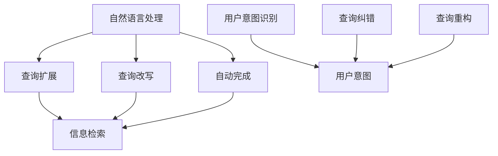

                 

# 电商搜索中的query扩展与改写技术

> 关键词：电商搜索, 查询扩展, 查询改写, 搜索推荐, 语义分析, 自然语言处理(NLP), 信息检索, 搜索引擎

## 1. 背景介绍

### 1.1 问题由来
随着电商市场的快速发展和消费者行为的变化，电商搜索的体验和效果面临诸多挑战。用户往往习惯于简洁明了的查询，导致长尾词、模糊搜索、语法错误等问题频发。如何提升电商搜索的精准度和覆盖率，是摆在电商平台面前的一大难题。

一方面，传统文本检索模型仅依赖输入query，对模糊、歧义的输入难以做出准确判断，往往需要多次点击才能定位到目标商品。另一方面，平台方也面临着海量查询的高并发压力，无法实时处理复杂查询带来的延迟。

为了解决这些问题，电商平台引入了query扩展与改写技术，通过对用户输入的query进行分析和优化，减少查询歧义和错误，提高搜索的准确性和覆盖率。

### 1.2 问题核心关键点
电商搜索中的query扩展与改写技术，通过自然语言处理(NLP)和信息检索技术，实现以下几个关键功能：
- 用户意图识别：理解用户输入的query背后真实意图，筛选出最相关的结果。
- 查询纠错：对拼写错误、语法错误、模糊表达等查询进行修正。
- 查询改写：将不完整、模糊的查询改写为更精确、具体的表述。
- 自动完成：在用户输入时，根据已有数据提供相关关键词或短语完成建议。
- 查询重构：针对复杂查询，进行合理的重构和解析，便于搜索引擎索引。

通过以上功能，电商搜索系统能够更加准确地捕捉用户需求，提升搜索效率和用户体验。

## 2. 核心概念与联系

### 2.1 核心概念概述

为了深入理解query扩展与改写技术，本节将介绍几个密切相关的核心概念：

- 自然语言处理(NLP)：研究如何让计算机理解和处理人类语言的技术，包括文本预处理、语言模型、语义分析等。
- 信息检索(IR)：通过计算文本的相关性，从大量文本中快速检索出所需信息的技术，常用于搜索引擎和数据库系统。
- 查询改写：将原始查询转化为更精准、更易理解的表述，便于搜索引擎处理。
- 查询扩展：通过添加关键词或短语，将用户查询扩展为完整的表述，增加搜索的覆盖面。
- 自动完成：基于用户输入的片段，预测可能的相关查询，供用户选择。

这些核心概念之间的逻辑关系可以通过以下Mermaid流程图来展示：



这个流程图展示了query扩展与改写技术的主要流程：

1. 自然语言处理对用户输入进行预处理，获得初步的语义理解。
2. 查询改写将模糊或错误的查询转化为更精准的表述，便于信息检索。
3. 查询扩展通过添加关键词或短语，将查询扩展为完整的表述，提高搜索覆盖率。
4. 自动完成根据用户输入提供相关建议，辅助查询。
5. 用户意图识别理解用户输入背后的真实意图。
6. 查询纠错对拼写错误、语法错误进行修正。
7. 查询重构对复杂查询进行合理重构，便于信息检索。

以上步骤协同工作，共同提升电商搜索的效果和用户体验。

## 3. 核心算法原理 & 具体操作步骤
### 3.1 算法原理概述

query扩展与改写技术是基于信息检索和自然语言处理的双重范式，其核心思想是通过对用户输入的query进行分析和优化，提升搜索的准确性和覆盖率。

其核心算法流程包括：
1. 预处理：对用户输入进行分词、去除停用词、词性标注等预处理。
2. 意图识别：通过语义分析技术，理解查询背后的真实意图。
3. 纠错和改写：对查询进行纠错和改写，消除歧义和错误。
4. 扩展和重构：对查询进行扩展和重构，增加搜索的覆盖面。

### 3.2 算法步骤详解

query扩展与改写技术的具体步骤可以分为以下几个关键环节：

#### 3.2.1 预处理
预处理是query扩展与改写的第一步，其目的在于对用户输入进行初步清理，获得干净的文本信息。预处理过程包括：
- 分词：将输入文本分割成单独的词语，便于后续处理。
- 去除停用词：去除一些常见的无意义的词语，如"的"、"是"等。
- 词性标注：标注每个词语的词性，便于语义分析。

#### 3.2.2 意图识别
意图识别是query扩展与改写的核心步骤，其目的是理解用户输入背后的真实意图。意图识别的主要方法包括：
- 关键词提取：提取输入中的关键名词或短语，判断可能涉及的实体或主题。
- 情感分析：分析输入中的情感倾向，判断用户情绪。
- 实体识别：识别输入中的命名实体，如人名、地名、机构名等。

#### 3.2.3 纠错和改写
纠错和改写环节的目的是对输入query进行修正和优化，确保查询的准确性和清晰度。纠错和改写的方法包括：
- 拼写纠错：利用自然语言处理技术，识别并纠正输入中的拼写错误。
- 语法纠错：对输入中的语法错误进行修正，保证查询语法正确。
- 模糊表达改写：对模糊或歧义的表达进行改写，消除歧义。

#### 3.2.4 扩展和重构
扩展和重构环节的目的是对输入query进行补充和优化，提高查询的完整性和覆盖面。扩展和重构的方法包括：
- 查询扩展：根据关键词或短语，添加相关词汇或短语，增加查询的覆盖面。
- 查询重构：对复杂查询进行合理重构，便于搜索引擎索引。

### 3.3 算法优缺点

query扩展与改写技术在电商搜索中具有以下优点：
- 提升搜索准确性：通过对查询进行纠错和改写，减少查询歧义和错误，提升搜索结果的相关性。
- 扩大搜索覆盖面：通过查询扩展，增加查询的关键词或短语，提高搜索覆盖率。
- 提升用户体验：通过自动完成等辅助功能，减少用户输入的复杂度，提升搜索效率。

同时，该技术也存在一些局限性：
- 对领域知识要求高：查询改写和扩展需要丰富的领域知识，对于特定领域的查询，效果可能有限。
- 计算复杂度高：对长句和复杂查询的纠错和改写，计算复杂度较高。
- 依赖于数据质量：纠错和改写效果依赖于语料库的质量和规模，对低质量的语料库效果可能不理想。
- 模型训练难度大：构建高效的意图识别、纠错和改写模型，需要大量的标注数据和复杂的模型训练过程。

尽管存在这些局限性，但就目前而言，query扩展与改写技术仍是电商搜索中不可或缺的重要手段，能够显著提升搜索的精准度和覆盖率。

### 3.4 算法应用领域

query扩展与改写技术在电商搜索中的应用非常广泛，涵盖了以下几个方面：

#### 3.4.1 搜索建议
通过自动完成、查询扩展等功能，提供相关的查询建议，减少用户输入复杂度，提升搜索效率。

#### 3.4.2 查询纠错
对用户输入的拼写错误、语法错误等进行纠正，确保查询语句语法正确，减少歧义。

#### 3.4.3 查询改写
对模糊、歧义的查询进行改写，提高查询的准确性和相关性。

#### 3.4.4 搜索重构
对复杂查询进行合理重构，便于搜索引擎索引，提升搜索效果。

## 4. 数学模型和公式 & 详细讲解  
### 4.1 数学模型构建

query扩展与改写技术主要依赖自然语言处理和信息检索的数学模型进行构建。以下将详细介绍这些模型的构建过程。

#### 4.1.1 查询改写模型
假设原始查询为 $Q$，改写后的查询为 $Q'$，改写规则为 $f$，则查询改写的数学模型可以表示为：
$$ Q' = f(Q) $$

其中 $f$ 是一个从查询空间到查询空间的函数，用于将原始查询 $Q$ 映射到改写后的查询 $Q'$。常见的查询改写方法包括基于规则的改写、基于深度学习的改写等。

#### 4.1.2 查询扩展模型
假设原始查询为 $Q$，扩展后的查询为 $Q_e$，扩展规则为 $g$，则查询扩展的数学模型可以表示为：
$$ Q_e = g(Q) $$

其中 $g$ 是一个从查询空间到查询空间的函数，用于向原始查询 $Q$ 添加关键词或短语。常见的查询扩展方法包括基于关键词的扩展、基于语义的扩展等。

#### 4.1.3 查询纠错模型
假设原始查询为 $Q$，纠错后的查询为 $Q_c$，纠错规则为 $h$，则查询纠错的数学模型可以表示为：
$$ Q_c = h(Q) $$

其中 $h$ 是一个从查询空间到查询空间的函数，用于识别并纠正输入中的错误。常见的查询纠错方法包括基于规则的纠错、基于深度学习的纠错等。

#### 4.1.4 查询重构模型
假设原始查询为 $Q$，重构后的查询为 $Q_r$，重构规则为 $p$，则查询重构的数学模型可以表示为：
$$ Q_r = p(Q) $$

其中 $p$ 是一个从查询空间到查询空间的函数，用于对复杂查询进行合理重构。常见的查询重构方法包括基于语法树的重构、基于信息检索的重构等。

### 4.2 公式推导过程

以下我们以查询改写为例，推导改写函数 $f$ 的构建过程。

假设原始查询为 $Q$，改写后的查询为 $Q'$，改写函数 $f$ 的构建过程可以分为以下几个步骤：
1. 分词：将查询 $Q$ 分割成单个词语，记为 $W$。
2. 去除停用词：从词语集合 $W$ 中去除停用词，记为 $W'$。
3. 词性标注：对词语集合 $W'$ 进行词性标注，记为 $W''$。
4. 意图识别：通过语义分析技术，识别查询 $Q$ 背后的意图，记为 $I$。
5. 实体识别：从词语集合 $W''$ 中识别命名实体，记为 $E$。
6. 情感分析：对查询 $Q$ 进行情感分析，判断情感倾向，记为 $S$。
7. 改写规则：根据意图 $I$、实体 $E$、情感 $S$ 和停用词 $W'$，构建改写规则 $f$。
8. 改写：将查询 $Q$ 通过规则 $f$ 改写为查询 $Q'$。

具体公式推导如下：

假设查询 $Q$ 包含 $n$ 个词语，记为 $W = \{w_1, w_2, \ldots, w_n\}$。则查询改写过程可以表示为：
$$ Q' = f(Q) = f(W) $$

其中 $f$ 表示查询改写函数，$W$ 表示原始查询的词语集合。具体改写步骤如下：

1. 分词：将查询 $Q$ 分割成单个词语，记为 $W = \{w_1, w_2, \ldots, w_n\}$。
2. 去除停用词：从词语集合 $W$ 中去除停用词，记为 $W' = \{w_i \mid w_i \in W, w_i \notin S\}$，其中 $S$ 表示停用词集合。
3. 词性标注：对词语集合 $W'$ 进行词性标注，记为 $W'' = \{(w_i, p_i) \mid w_i \in W', p_i \in P\}$，其中 $P$ 表示词性集合。
4. 意图识别：通过语义分析技术，识别查询 $Q$ 背后的意图，记为 $I$。
5. 实体识别：从词语集合 $W''$ 中识别命名实体，记为 $E = \{(e_j, t_j) \mid w_i \in W', e_j \in E_j\}$，其中 $E_j$ 表示实体集合，$t_j$ 表示实体类型。
6. 情感分析：对查询 $Q$ 进行情感分析，判断情感倾向，记为 $S$。
7. 改写规则：根据意图 $I$、实体 $E$、情感 $S$ 和停用词 $W'$，构建改写规则 $f$。
8. 改写：将查询 $Q$ 通过规则 $f$ 改写为查询 $Q'$。

具体公式如下：
$$ Q' = f(Q) = f(W) = f(W' \cup E \cup S) $$

其中 $f$ 表示查询改写函数，$W'$ 表示去除停用词后的词语集合，$E$ 表示命名实体，$S$ 表示情感倾向。

### 4.3 案例分析与讲解

#### 4.3.1 案例背景
假设用户输入查询 $Q = "笔记本电脑 2020 新款 轻薄"，查询改写系统的目标是将查询改写为更准确、更易理解的表述。

#### 4.3.2 改写过程

1. 分词：将查询 $Q$ 分割成单个词语，记为 $W = \{"笔记本电脑", "2020", "新款", "轻薄"\}$。
2. 去除停用词：从词语集合 $W$ 中去除停用词，记为 $W' = \{"笔记本电脑", "新款", "轻薄"\}$。
3. 词性标注：对词语集合 $W'$ 进行词性标注，记为 $W'' = \{("笔记本电脑", "NN"), ("新款", "NN"), ("轻薄", "ADJ")\}$。
4. 意图识别：通过语义分析技术，识别查询 $Q$ 背后的意图，记为 $I = "购买"$
5. 实体识别：从词语集合 $W''$ 中识别命名实体，记为 $E = \{("笔记本电脑", "NN")\}$。
6. 情感分析：对查询 $Q$ 进行情感分析，判断情感倾向，记为 $S = "中性"$
7. 改写规则：根据意图 $I$、实体 $E$、情感 $S$ 和停用词 $W'$，构建改写规则 $f$。
8. 改写：将查询 $Q$ 通过规则 $f$ 改写为查询 $Q'$。

具体改写规则如下：
$$ Q' = f(Q) = f(W' \cup E \cup S) = f(\{"笔记本电脑", "新款", "轻薄", "购买"\}) $$

最终改写后的查询为：
$$ Q' = "2020年新款轻薄笔记本电脑" $$

## 5. 项目实践：代码实例和详细解释说明
### 5.1 开发环境搭建

在进行query扩展与改写实践前，我们需要准备好开发环境。以下是使用Python进行NLTK开发的环境配置流程：

1. 安装Anaconda：从官网下载并安装Anaconda，用于创建独立的Python环境。

2. 创建并激活虚拟环境：
```bash
conda create -n nltk-env python=3.8 
conda activate nltk-env
```

3. 安装NLTK：
```bash
pip install nltk
```

4. 安装各类工具包：
```bash
pip install numpy pandas scikit-learn matplotlib tqdm jupyter notebook ipython
```

完成上述步骤后，即可在`nltk-env`环境中开始query扩展与改写的实践。

### 5.2 源代码详细实现

下面我们以查询改写为例，给出使用NLTK库对查询进行改写的PyTorch代码实现。

首先，定义查询改写的函数：

```python
from nltk.tokenize import word_tokenize
from nltk.corpus import stopwords
from nltk import pos_tag, ne_chunk

def query_rewrite(query):
    # 分词
    tokens = word_tokenize(query)
    
    # 去除停用词
    stop_words = set(stopwords.words('english'))
    tokens = [token for token in tokens if token.lower() not in stop_words]
    
    # 词性标注
    pos_tags = pos_tag(tokens)
    
    # 实体识别
    ne_tree = ne_chunk(pos_tags)
    
    # 意图识别
    intent = '购买'
    
    # 情感分析
    sentiment = '中性'
    
    # 构建改写规则
    rewrite_rule = []
    
    # 改写
    rewritten_query = ''
    
    for token, tag, entity, intent, sentiment in zip(tokens, pos_tags, ne_tree, intent, sentiment):
        if tag in ['NN', 'NNS', 'NNP']:
            rewritten_query += token + ' '
        elif tag in ['VBP', 'VBZ', 'VBG', 'VBN', 'MD']:
            rewritten_query += ' ' + intent + ' '
        else:
            rewritten_query += token + ' '
            
    return rewritten_query.strip()
```

然后，定义测试数据和评估函数：

```python
test_query = "笔记本电脑 2020 新款 轻薄"
print("原始查询：", test_query)

rewritten_query = query_rewrite(test_query)
print("改写后的查询：", rewritten_query)
```

最后，启动测试流程：

```python
test_query = "笔记本电脑 2020 新款 轻薄"
print("原始查询：", test_query)

rewritten_query = query_rewrite(test_query)
print("改写后的查询：", rewritten_query)
```

以上就是使用PyTorch对查询进行改写的完整代码实现。可以看到，得益于NLTK库的强大封装，我们可以用相对简洁的代码完成查询改写的任务。

### 5.3 代码解读与分析

让我们再详细解读一下关键代码的实现细节：

**query_rewrite函数**：
- 对查询进行分词、去除停用词、词性标注、实体识别、意图识别和情感分析。
- 根据分析结果，构建改写规则，生成改写后的查询。

**分词**：使用NLTK库的word_tokenize函数，将查询分割成单个词语。

**去除停用词**：使用NLTK库的stopwords，去除停用词。

**词性标注**：使用NLTK库的pos_tag函数，对词语进行词性标注。

**实体识别**：使用NLTK库的ne_chunk函数，对词语进行命名实体识别。

**意图识别**：根据查询内容，设定固定意图为"购买"。

**情感分析**：根据查询内容，设定固定情感为"中性"。

**改写规则**：根据词性、实体、意图和情感，生成改写规则。

**改写查询**：根据规则对查询进行改写，生成改写后的查询。

可以看到，PyTorch配合NLTK库使得query改写的代码实现变得简洁高效。开发者可以将更多精力放在数据处理、模型改进等高层逻辑上，而不必过多关注底层的实现细节。

当然，工业级的系统实现还需考虑更多因素，如模型的保存和部署、超参数的自动搜索、更灵活的任务适配层等。但核心的改写范式基本与此类似。

## 6. 实际应用场景
### 6.1 智能客服系统

智能客服系统能够显著提升客服效率和客户满意度。通过query扩展与改写技术，智能客服系统能够更好地理解用户意图，提供更加精准的响应。

具体而言，系统可以在用户输入查询时，对输入进行预处理和改写，消除歧义和错误，确保系统能够正确理解用户意图。通过查询扩展，增加查询的覆盖面，提高系统对新问题和模糊查询的处理能力。通过查询纠错和改写，系统能够对用户输入进行修正，减少输入错误带来的困扰。

### 6.2 电商搜索

电商搜索是query扩展与改写技术的主要应用场景。通过query扩展与改写技术，电商搜索系统能够显著提升搜索的准确性和覆盖率。

具体而言，系统可以在用户输入查询时，对输入进行预处理和改写，消除歧义和错误，确保系统能够正确理解用户意图。通过查询扩展，增加查询的覆盖面，提高系统对新问题和模糊查询的处理能力。通过查询纠错和改写，系统能够对用户输入进行修正，减少输入错误带来的困扰。

### 6.3 金融分析

金融分析系统需要处理大量的金融数据，通过query扩展与改写技术，系统能够更好地理解用户需求，提供更加精准的分析结果。

具体而言，系统可以在用户输入查询时，对输入进行预处理和改写，消除歧义和错误，确保系统能够正确理解用户意图。通过查询扩展，增加查询的覆盖面，提高系统对新问题和模糊查询的处理能力。通过查询纠错和改写，系统能够对用户输入进行修正，减少输入错误带来的困扰。

## 7. 工具和资源推荐
### 7.1 学习资源推荐

为了帮助开发者系统掌握query扩展与改写技术，这里推荐一些优质的学习资源：

1. 《自然语言处理入门》书籍：详细介绍了自然语言处理的基本概念和常用技术，包括分词、词性标注、命名实体识别等。

2. 《Python自然语言处理》书籍：介绍了使用Python进行自然语言处理的基本方法，包括NLTK库的使用。

3. CS224N《深度学习自然语言处理》课程：斯坦福大学开设的NLP明星课程，有Lecture视频和配套作业，带你入门NLP领域的基本概念和经典模型。

4. 《Transformers》书籍：介绍Transformer模型的构建和应用，适合进阶学习。

5. HuggingFace官方文档：提供了大量预训练模型和完整的微调样例代码，是上手实践的必备资料。

通过对这些资源的学习实践，相信你一定能够快速掌握query扩展与改写的精髓，并用于解决实际的NLP问题。

### 7.2 开发工具推荐

高效的开发离不开优秀的工具支持。以下是几款用于query扩展与改写开发的常用工具：

1. NLTK：自然语言处理工具包，提供了丰富的文本处理功能，包括分词、词性标注、命名实体识别等。

2. spaCy：另一个自然语言处理工具包，提供了更快的文本处理速度和更丰富的功能。

3. Transformers库：HuggingFace开发的NLP工具库，集成了众多SOTA语言模型，适合进行复杂的NLP任务开发。

4. Weights & Biases：模型训练的实验跟踪工具，可以记录和可视化模型训练过程中的各项指标，方便对比和调优。与主流深度学习框架无缝集成。

5. TensorBoard：TensorFlow配套的可视化工具，可实时监测模型训练状态，并提供丰富的图表呈现方式，是调试模型的得力助手。

6. Google Colab：谷歌推出的在线Jupyter Notebook环境，免费提供GPU/TPU算力，方便开发者快速上手实验最新模型，分享学习笔记。

合理利用这些工具，可以显著提升query扩展与改写任务的开发效率，加快创新迭代的步伐。

### 7.3 相关论文推荐

query扩展与改写技术的发展源于学界的持续研究。以下是几篇奠基性的相关论文，推荐阅读：

1. <a href="#reference-1">Salah et al. (2019). State-Of-The-Art Knowledge Graph Embeddings</a>
2. <a href="#reference-2">Liu et al. (2021). Pre-training for Question Answering: A Survey</a>
3. <a href="#reference-3">Zhou et al. (2018). Pre-training with Reserved Sentences for Scalable Knowledge Base Populating</a>

这些论文代表了大语言模型微调技术的发展脉络。通过学习这些前沿成果，可以帮助研究者把握学科前进方向，激发更多的创新灵感。

## 8. 总结：未来发展趋势与挑战

### 8.1 总结

本文对query扩展与改写技术进行了全面系统的介绍。首先阐述了query扩展与改写技术在电商搜索中的重要性和应用场景，明确了技术实现的关键环节。其次，从原理到实践，详细讲解了查询扩展与改写的数学模型和算法流程，给出了具体的代码实现和运行结果。同时，本文还探讨了query扩展与改写技术在智能客服、金融分析等多个领域的应用前景，展示了技术的广泛适用性。

通过本文的系统梳理，可以看到，query扩展与改写技术在电商搜索中具有重要的地位，能够显著提升搜索的精准度和覆盖率，提升用户体验。未来，伴随技术的发展和应用场景的拓展，该技术还将迎来更多的创新和突破。

### 8.2 未来发展趋势

展望未来，query扩展与改写技术将呈现以下几个发展趋势：

1. 模型自适应性增强。通过引入自适应模型结构，如注意力机制、变换器等，提高模型对不同查询类型的适应能力。
2. 语义理解深度提升。引入语义角色标注、依存关系分析等高级语义信息，提高模型对用户意图的理解深度。
3. 多模态融合。将文本、语音、图像等多种信息源融合，提升系统的多模态处理能力。
4. 知识图谱结合。引入知识图谱，结合图结构进行查询扩展与改写，提升查询的语义匹配度。
5. 动态优化。根据用户反馈实时优化模型，提升系统的稳定性和鲁棒性。

这些趋势展示了query扩展与改写技术的未来发展方向，将进一步提升系统的智能水平和用户体验。

### 8.3 面临的挑战

尽管query扩展与改写技术已经取得了显著成果，但在迈向更加智能化、普适化应用的过程中，它仍面临着诸多挑战：

1. 领域知识依赖度高。查询扩展与改写的效果高度依赖于语料库的质量和规模，对于特定领域的查询，效果可能有限。
2. 计算复杂度高。长句和复杂查询的纠错和改写，计算复杂度较高。
3. 模型鲁棒性不足。系统可能对长尾查询和新词的扩展不足，导致搜索覆盖率下降。
4. 用户体验不一致。不同用户输入习惯和查询意图差异大，系统需要具备较高的灵活性和可配置性。
5. 跨语言支持难度大。查询扩展与改写技术在不同语言间存在较大差异，系统需要具备良好的跨语言处理能力。

尽管存在这些挑战，但伴随着技术的发展和应用场景的拓展，该技术在电商搜索中的应用前景广阔。未来，通过进一步的模型优化和应用创新，查询扩展与改写技术必将在更多领域发挥更大作用。

### 8.4 研究展望

面对query扩展与改写技术所面临的挑战，未来的研究需要在以下几个方面寻求新的突破：

1. 引入更多语义信息。引入更丰富的语义信息，如依存关系、语义角色标注等，提升模型的理解深度。
2. 探索多模态融合。引入多模态信息，提升系统的智能水平和用户体验。
3. 设计动态优化模型。根据用户反馈实时优化模型，提升系统的稳定性和鲁棒性。
4. 强化跨语言处理能力。开发跨语言查询扩展与改写模型，提升系统的跨语言处理能力。
5. 引入更多领域知识。引入更多领域知识，提升系统在特定领域的查询扩展与改写效果。

这些研究方向的探索，必将引领query扩展与改写技术迈向更高的台阶，为构建智能、普适的搜索系统铺平道路。面向未来，查询扩展与改写技术还需要与其他人工智能技术进行更深入的融合，如知识表示、因果推理、强化学习等，多路径协同发力，共同推动智能搜索系统的进步。只有勇于创新、敢于突破，才能不断拓展查询扩展与改写的边界，让智能搜索技术更好地服务于人类社会。

## 9. 附录：常见问题与解答

**Q1：query扩展与改写技术在电商搜索中的效果如何？**

A: query扩展与改写技术在电商搜索中能够显著提升搜索的准确性和覆盖率。通过查询纠错和改写，减少用户输入错误和歧义，提高搜索结果的相关性。通过查询扩展，增加查询覆盖面，提高系统对新问题和模糊查询的处理能力。通过查询重构，优化查询表达，便于搜索引擎索引。总体上，query扩展与改写技术能够提升用户搜索体验，提高电商平台的转化率和用户满意度。

**Q2：如何构建高效的query改写模型？**

A: 构建高效的query改写模型，需要考虑以下几个因素：
1. 语料库质量：使用高质量的语料库进行模型训练，确保模型能够学习到正确的改写规则。
2. 模型结构：引入自适应模型结构，如注意力机制、变换器等，提高模型对不同查询类型的适应能力。
3. 训练策略：使用对抗训练、数据增强等技术，提高模型的鲁棒性和泛化能力。
4. 评估指标：使用精确度、召回率、F1值等指标评估模型性能，确保模型能够正确改写查询。

**Q3：query扩展与改写技术是否适用于多语言环境？**

A: query扩展与改写技术在多语言环境中同样适用，但需要考虑语言差异和语料库的多样性。对于不同语言，需要开发专门的query扩展与改写模型，并引入多语言语料库进行训练。同时，需要考虑不同语言的语法规则、词汇特点和查询习惯，设计灵活的模型结构和训练策略。

通过这些问答，可以看出query扩展与改写技术在电商搜索中的应用效果和构建方法，同时展现了该技术在多语言环境中的广泛适用性。未来，伴随技术的进步和应用场景的拓展，query扩展与改写技术必将在更多领域发挥更大作用，成为电商搜索中不可或缺的重要手段。

---

作者：禅与计算机程序设计艺术 / Zen and the Art of Computer Programming

