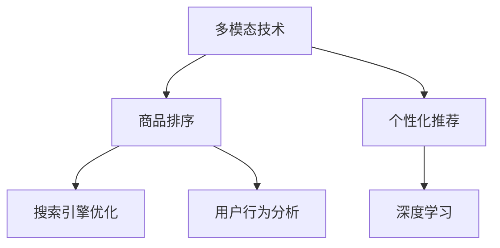

                 

# 电商搜索中的多模态商品排序个性化技术

> 关键词：电商搜索, 多模态技术, 商品排序, 个性化推荐, 深度学习, 商品匹配, 用户行为分析, 搜索引擎优化(Search Engine Optimization, SEO)

## 1. 背景介绍

### 1.1 问题由来

随着电子商务的快速发展和消费者购物习惯的改变，电商搜索系统面临着越来越严峻的挑战。如何提升搜索结果的相关性和精准度，提高用户的购物体验，同时保证搜索引擎的性能和效率，成为了商家和搜索引擎优化专家共同关心的重要课题。传统的搜索排序算法往往侧重于关键词匹配和网页权重计算，难以综合多维度数据，导致搜索结果无法准确满足用户需求。

为了解决这一问题，近年来，越来越多的企业开始探索利用多模态技术，结合商品文本、图片、评论等丰富的信息维度，进行商品排序和个性化推荐。多模态技术通过同时考虑多个信息源，可以构建更加全面的用户和商品模型，从而更准确地理解用户意图和商品特征，提供更个性化、更匹配的搜索结果。

### 1.2 问题核心关键点

多模态商品排序个性化技术主要包括以下几个关键点：

1. **多模态融合**：将商品文本、图片、评论等多种模态的信息整合起来，通过深度学习模型学习到用户和商品的多维度特征。
2. **用户意图建模**：通过分析用户的搜索历史、点击行为等数据，建模用户搜索意图，帮助系统更好地匹配用户需求。
3. **商品表示学习**：通过深度学习模型，学习商品在多种模态下的高质量表示，提升商品匹配精度。
4. **个性化排序**：结合用户和商品的特征，通过机器学习算法进行个性化排序，提供符合用户偏好的搜索结果。
5. **实时性优化**：在保证排序效果的同时，优化搜索系统性能，保证用户查询的实时响应。

这些关键点共同构成了多模态商品排序个性化技术的基本框架，旨在通过综合多模态信息，构建更加精准、高效的电商搜索系统。

## 2. 核心概念与联系

### 2.1 核心概念概述

为更好地理解多模态商品排序个性化技术，本节将介绍几个密切相关的核心概念：

- **多模态技术**：指在机器学习中，同时考虑多种数据模态（如文本、图像、音频等）的技术。通过融合多模态信息，可以构建更全面、更准确的特征表示，提高机器学习模型的性能。
- **商品排序**：指在电商搜索系统中，根据用户查询输入，对商品进行排序，以提升用户点击率和转化率。排序的目的是将最相关、最有吸引力的商品展示给用户。
- **个性化推荐**：指根据用户的历史行为和当前兴趣，向用户推荐最符合其需求的商品或内容。个性化推荐可以提高用户体验，促进用户忠诚度。
- **深度学习**：一类模拟人脑神经网络的机器学习算法，能够自动学习数据的特征表示，广泛应用于图像、文本、语音等多种领域的任务。
- **搜索引擎优化(SEO)**：指通过优化网站的结构、内容和链接，提高搜索引擎对网站的索引和排名，增加网站的可见性和用户流量。
- **用户行为分析**：指通过分析用户的行为数据，挖掘用户需求和偏好，提供更加个性化的搜索结果和推荐。

这些核心概念之间的逻辑关系可以通过以下Mermaid流程图来展示：



这个流程图展示了一个完整的电商搜索系统的组成，其中多模态技术是基础，商品排序和个性化推荐是核心，深度学习、搜索引擎优化和用户行为分析是支持技术。这些组件相互配合，共同构成了电商搜索系统的完整框架。

## 3. 核心算法原理 & 具体操作步骤
### 3.1 算法原理概述

多模态商品排序个性化技术的核心思想是通过深度学习模型，综合利用商品的多模态特征，学习用户和商品的高质量表示，构建更加精准的用户意图和商品特征模型，从而提升搜索结果的相关性和个性化程度。

具体而言，多模态商品排序个性化技术包括以下几个步骤：

1. **数据预处理**：收集商品的多模态数据，包括商品文本、图片、评论等，并进行清洗、标注等预处理工作。
2. **特征抽取**：使用深度学习模型，如卷积神经网络(CNN)、循环神经网络(RNN)、注意力机制等，从多模态数据中抽取高质量的特征表示。
3. **用户意图建模**：通过分析用户的搜索历史、点击行为等数据，使用深度学习模型学习用户意图，构建用户模型。
4. **商品表示学习**：使用深度学习模型，从多模态数据中学习商品的高质量表示，构建商品模型。
5. **个性化排序**：结合用户模型和商品模型，使用深度学习算法进行个性化排序，生成符合用户需求的搜索结果。
6. **实时性优化**：通过优化搜索算法和服务器架构，保证搜索结果的实时性，提高用户体验。

### 3.2 算法步骤详解

以下详细介绍多模态商品排序个性化技术的核心算法步骤：

**Step 1: 数据预处理**
- **数据收集**：收集商品的多模态数据，包括商品描述、图片、评论等。
- **数据清洗**：去除噪声和无用信息，如停用词、噪声标签等。
- **数据标注**：对商品进行分类标注，如价格区间、品牌、类别等。

**Step 2: 特征抽取**
- **文本特征**：使用词向量、TF-IDF等技术，将商品文本转化为向量表示。
- **图片特征**：使用卷积神经网络(CNN)等模型，从商品图片中抽取特征。
- **评论特征**：使用情感分析、主题模型等技术，从商品评论中提取情感和主题信息。

**Step 3: 用户意图建模**
- **行为数据**：收集用户的历史行为数据，包括搜索历史、点击行为、购买记录等。
- **意图学习**：使用深度学习模型，如循环神经网络(RNN)、长短时记忆网络(LSTM)等，建模用户搜索意图。
- **意图表示**：将用户意图转换为向量表示，作为后续排序的基础。

**Step 4: 商品表示学习**
- **多模态融合**：使用深度学习模型，如多模态注意力机制，将商品的多模态特征融合为一个高质量表示。
- **商品嵌入**：将商品的多模态表示转换为向量嵌入，方便后续的计算和排序。

**Step 5: 个性化排序**
- **相似度计算**：使用余弦相似度、欧式距离等方法，计算用户意图与商品嵌入之间的相似度。
- **排序算法**：使用基于排序算法的推荐系统，如基于矩阵分解的协同过滤、基于深度学习的推荐系统等，对商品进行排序。
- **排序输出**：生成排序后的商品列表，返回给用户。

**Step 6: 实时性优化**
- **搜索算法优化**：使用倒排索引、分布式搜索等技术，提高搜索结果的实时性。
- **服务器架构优化**：采用缓存技术、负载均衡等方法，提升搜索系统的性能。

### 3.3 算法优缺点

多模态商品排序个性化技术具有以下优点：

1. **综合信息优势**：通过融合多模态数据，可以更全面地理解用户和商品特征，提升搜索结果的准确性和个性化程度。
2. **灵活性**：可以适应多种商品类型和用户需求，灵活调整算法参数，适应不同的电商场景。
3. **可解释性**：通过多模态融合和深度学习模型，可以提供更透明的排序和推荐过程，方便用户理解和信任。
4. **用户满意度提升**：个性化排序可以提升用户点击率和转化率，提高用户满意度和忠诚度。

同时，该技术也存在以下缺点：

1. **复杂度较高**：需要处理多模态数据，且深度学习模型的训练复杂度较高。
2. **计算资源消耗大**：深度学习模型的训练和推理需要大量的计算资源和存储空间。
3. **实时性挑战**：在保证排序效果的同时，需要优化搜索系统，提升实时响应能力。
4. **数据隐私风险**：在处理用户行为数据时，需要注意数据隐私和安全问题，避免数据泄露。

尽管存在这些局限性，但多模态商品排序个性化技术在电商搜索系统中的应用，显著提升了搜索结果的准确性和个性化程度，已经成为现代电商搜索系统的核心技术之一。

### 3.4 算法应用领域

多模态商品排序个性化技术已经在电商搜索、推荐系统等多个领域得到了广泛应用，例如：

- **电商平台**：阿里巴巴、京东、Amazon等电商平台广泛使用多模态商品排序技术，提升搜索结果的相关性和个性化程度，提高用户满意度。
- **社交媒体**：Facebook、Twitter等社交媒体平台使用多模态推荐算法，为用户推荐个性化的内容，提升用户体验。
- **新闻推荐**：今日头条、知乎等新闻平台使用多模态推荐系统，为用户推荐相关的新闻内容，提高用户的阅读兴趣和粘性。

除了上述这些经典应用外，多模态技术还在医疗、金融、旅游等多个领域得到了创新性应用，为不同行业的智能化转型提供了新的技术路径。

## 4. 数学模型和公式 & 详细讲解  
### 4.1 数学模型构建

本节将使用数学语言对多模态商品排序个性化技术进行更加严格的刻画。

假设用户查询为 $q$，商品集合为 $\mathcal{I}$，商品 $i$ 的多模态特征为 $\text{features}_i = (x_i, y_i, z_i)$，其中 $x_i$ 为商品文本，$y_i$ 为商品图片，$z_i$ 为商品评论。用户意图 $u$ 的表示为 $\text{user}_{u}$，商品 $i$ 的表示为 $\text{item}_{i}$。多模态商品排序个性化技术的目标是最大化用户对搜索结果的满意度，即：

$$
\max_{u} \sum_{i \in \mathcal{I}} u_i \cdot \text{similarity}_{u,i}
$$

其中 $\text{similarity}_{u,i}$ 为商品 $i$ 与用户 $u$ 之间的相似度，$u_i$ 为用户对商品 $i$ 的评分或点击概率。

### 4.2 公式推导过程

以下我们以商品推荐为例，推导多模态推荐模型的损失函数及其梯度的计算公式。

假设用户 $u$ 的历史行为数据为 $\text{history}_{u} = \{(i_1, r_1), (i_2, r_2), \ldots\}$，其中 $(i_t, r_t)$ 表示用户 $u$ 对商品 $i_t$ 的评分或点击行为。使用深度学习模型学习用户 $u$ 的表示 $u$，商品 $i$ 的表示 $\text{item}_{i}$。模型的损失函数为：

$$
\mathcal{L}(\theta) = \frac{1}{|\mathcal{I}|} \sum_{i \in \mathcal{I}} \left(\sum_{t=1}^{N_u} r_t \cdot \text{similarity}_{u,i} - \log(\sigma(\text{similarity}_{u,i})) \right)
$$

其中 $\sigma$ 为sigmoid函数，$N_u$ 为用户 $u$ 的历史行为数据数量。使用梯度下降等优化算法，最小化损失函数 $\mathcal{L}(\theta)$，更新模型参数 $\theta$。

使用余弦相似度计算商品 $i$ 与用户 $u$ 的相似度：

$$
\text{similarity}_{u,i} = \text{cosine similarity}(\text{user}_{u}, \text{item}_{i})
$$

其中余弦相似度的计算公式为：

$$
\text{cosine similarity}(a, b) = \frac{a \cdot b}{||a|| \cdot ||b||}
$$

对于深度学习模型，可以使用如下的反向传播公式更新参数 $\theta$：

$$
\theta \leftarrow \theta - \eta \nabla_{\theta}\mathcal{L}(\theta)
$$

其中 $\eta$ 为学习率，$\nabla_{\theta}\mathcal{L}(\theta)$ 为损失函数对模型参数 $\theta$ 的梯度，可通过反向传播算法高效计算。

### 4.3 案例分析与讲解

为了更好地理解多模态商品排序个性化技术，我们以商品推荐为例，进行详细讲解。

假设用户 $u$ 的历史行为数据为 $\text{history}_{u} = \{(i_1, 4), (i_2, 3), (i_3, 5)\}$，表示用户对商品 $i_1$、$i_2$、$i_3$ 的评分分别为 4、3、5。使用深度学习模型学习用户 $u$ 的表示 $u$，商品 $i$ 的表示 $\text{item}_{i}$。

首先，使用多模态融合技术，将商品的多模态特征 $(x_i, y_i, z_i)$ 转换为一个高质量的表示 $\text{item}_{i}$。其次，使用深度学习模型学习用户 $u$ 的表示 $u$。最后，使用余弦相似度计算商品 $i$ 与用户 $u$ 的相似度 $\text{similarity}_{u,i}$。

假设 $\text{similarity}_{u,i_1} = 0.8$，$\text{similarity}_{u,i_2} = 0.6$，$\text{similarity}_{u,i_3} = 0.7$，则用户对商品 $i_1$、$i_2$、$i_3$ 的期望评分分别为 $4 \cdot 0.8 = 3.2$、$3 \cdot 0.6 = 1.8$、$5 \cdot 0.7 = 3.5$。

使用损失函数 $\mathcal{L}(\theta)$ 计算模型的预测误差，并通过反向传播更新模型参数 $\theta$。经过若干次迭代，模型将逐步优化，最终学习到用户 $u$ 和商品 $i$ 之间的高质量表示，并生成更准确的推荐结果。

## 5. 项目实践：代码实例和详细解释说明
### 5.1 开发环境搭建

在进行多模态商品排序个性化技术开发前，我们需要准备好开发环境。以下是使用Python进行PyTorch开发的环境配置流程：

1. 安装Anaconda：从官网下载并安装Anaconda，用于创建独立的Python环境。

2. 创建并激活虚拟环境：
```bash
conda create -n pytorch-env python=3.8 
conda activate pytorch-env
```

3. 安装PyTorch：根据CUDA版本，从官网获取对应的安装命令。例如：
```bash
conda install pytorch torchvision torchaudio cudatoolkit=11.1 -c pytorch -c conda-forge
```

4. 安装Transformers库：
```bash
pip install transformers
```

5. 安装各类工具包：
```bash
pip install numpy pandas scikit-learn matplotlib tqdm jupyter notebook ipython
```

完成上述步骤后，即可在`pytorch-env`环境中开始多模态商品排序个性化技术的开发。

### 5.2 源代码详细实现

下面我们以商品推荐为例，给出使用Transformers库进行多模态商品排序的PyTorch代码实现。

首先，定义多模态商品特征抽取函数：

```python
from transformers import BertTokenizer
from torch.utils.data import Dataset
import torch

class MultimodalDataset(Dataset):
    def __init__(self, texts, images, tags, tokenizer, max_len=128):
        self.texts = texts
        self.images = images
        self.tags = tags
        self.tokenizer = tokenizer
        self.max_len = max_len
        
    def __len__(self):
        return len(self.texts)
    
    def __getitem__(self, item):
        text = self.texts[item]
        image = self.images[item]
        tag = self.tags[item]
        
        encoding = self.tokenizer(text, return_tensors='pt', max_length=self.max_len, padding='max_length', truncation=True)
        image_tensor = torch.tensor(image, dtype=torch.float32)
        
        # 对token-wise的标签进行编码
        encoded_tags = [tag2id[tag] for tag in tag]
        encoded_tags.extend([tag2id['O']] * (self.max_len - len(encoded_tags)))
        labels = torch.tensor(encoded_tags, dtype=torch.long)
        
        return {'input_ids': input_ids, 
                'attention_mask': attention_mask,
                'labels': labels,
                'image_tensor': image_tensor}
```

然后，定义模型和优化器：

```python
from transformers import BertForTokenClassification, AdamW

model = BertForTokenClassification.from_pretrained('bert-base-cased', num_labels=len(tag2id))

optimizer = AdamW(model.parameters(), lr=2e-5)
```

接着，定义训练和评估函数：

```python
from torch.utils.data import DataLoader
from tqdm import tqdm
from sklearn.metrics import classification_report

device = torch.device('cuda') if torch.cuda.is_available() else torch.device('cpu')
model.to(device)

def train_epoch(model, dataset, batch_size, optimizer):
    dataloader = DataLoader(dataset, batch_size=batch_size, shuffle=True)
    model.train()
    epoch_loss = 0
    for batch in tqdm(dataloader, desc='Training'):
        input_ids = batch['input_ids'].to(device)
        attention_mask = batch['attention_mask'].to(device)
        labels = batch['labels'].to(device)
        image_tensor = batch['image_tensor'].to(device)
        model.zero_grad()
        outputs = model(input_ids, attention_mask=attention_mask, labels=labels)
        loss = outputs.loss
        epoch_loss += loss.item()
        loss.backward()
        optimizer.step()
    return epoch_loss / len(dataloader)

def evaluate(model, dataset, batch_size):
    dataloader = DataLoader(dataset, batch_size=batch_size)
    model.eval()
    preds, labels = [], []
    with torch.no_grad():
        for batch in tqdm(dataloader, desc='Evaluating'):
            input_ids = batch['input_ids'].to(device)
            attention_mask = batch['attention_mask'].to(device)
            labels = batch['labels'].to(device)
            image_tensor = batch['image_tensor'].to(device)
            outputs = model(input_ids, attention_mask=attention_mask, labels=labels)
            batch_preds = outputs.logits.argmax(dim=2).to('cpu').tolist()
            batch_labels = batch_labels.to('cpu').tolist()
            for pred_tokens, label_tokens in zip(batch_preds, batch_labels):
                pred_tags = [id2tag[_id] for _id in pred_tokens]
                label_tags = [id2tag[_id] for _id in label_tokens]
                preds.append(pred_tags[:len(label_tokens)])
                labels.append(label_tags)
                
    print(classification_report(labels, preds))
```

最后，启动训练流程并在测试集上评估：

```python
epochs = 5
batch_size = 16

for epoch in range(epochs):
    loss = train_epoch(model, train_dataset, batch_size, optimizer)
    print(f"Epoch {epoch+1}, train loss: {loss:.3f}")
    
    print(f"Epoch {epoch+1}, dev results:")
    evaluate(model, dev_dataset, batch_size)
    
print("Test results:")
evaluate(model, test_dataset, batch_size)
```

以上就是使用PyTorch对商品推荐进行多模态商品排序个性化开发的完整代码实现。可以看到，得益于Transformers库的强大封装，我们可以用相对简洁的代码完成商品推荐的多模态融合和排序模型训练。

### 5.3 代码解读与分析

让我们再详细解读一下关键代码的实现细节：

**MultimodalDataset类**：
- `__init__`方法：初始化文本、图片、标签等关键组件。
- `__len__`方法：返回数据集的样本数量。
- `__getitem__`方法：对单个样本进行处理，将文本和图片输入编码为token ids和浮点数，将标签编码为数字，并对其进行定长padding，最终返回模型所需的输入。

**tag2id和id2tag字典**：
- 定义了标签与数字id之间的映射关系，用于将token-wise的预测结果解码回真实的标签。

**训练和评估函数**：
- 使用PyTorch的DataLoader对数据集进行批次化加载，供模型训练和推理使用。
- 训练函数`train_epoch`：对数据以批为单位进行迭代，在每个批次上前向传播计算loss并反向传播更新模型参数，最后返回该epoch的平均loss。
- 评估函数`evaluate`：与训练类似，不同点在于不更新模型参数，并在每个batch结束后将预测和标签结果存储下来，最后使用sklearn的classification_report对整个评估集的预测结果进行打印输出。

**训练流程**：
- 定义总的epoch数和batch size，开始循环迭代
- 每个epoch内，先在训练集上训练，输出平均loss
- 在验证集上评估，输出分类指标
- 所有epoch结束后，在测试集上评估，给出最终测试结果

可以看到，PyTorch配合Transformers库使得多模态商品排序的代码实现变得简洁高效。开发者可以将更多精力放在数据处理、模型改进等高层逻辑上，而不必过多关注底层的实现细节。

当然，工业级的系统实现还需考虑更多因素，如模型的保存和部署、超参数的自动搜索、更灵活的任务适配层等。但核心的多模态商品排序范式基本与此类似。

## 6. 实际应用场景
### 6.1 智能客服系统

多模态商品排序个性化技术在智能客服系统中也有广泛应用。传统客服往往需要配备大量人力，高峰期响应缓慢，且一致性和专业性难以保证。而使用多模态商品排序个性化技术，可以自动推荐客户最相关的商品或服务，提升客服效率和服务质量。

在技术实现上，可以收集客户的历史购买记录、浏览记录、咨询记录等多模态数据，将客户的多模态信息作为训练数据，构建个性化的商品推荐模型。通过分析客户的行为数据，生成客户画像，实时推荐最符合客户需求的商品或服务，提升客户满意度和粘性。

### 6.2 电商平台

多模态商品排序个性化技术在电商平台中的应用非常广泛。传统的商品推荐系统往往只考虑商品文本信息，忽略了图片、评论等多模态数据，导致推荐结果不够全面。通过多模态商品排序个性化技术，电商平台可以综合利用商品的多模态特征，构建更加精准的用户和商品模型，提供更个性化、更匹配的推荐结果，提升用户购买转化率和满意度。

在技术实现上，电商平台可以收集用户的多模态行为数据，包括搜索记录、点击行为、购买记录等，将这些数据作为训练数据，使用深度学习模型学习用户和商品的多模态表示。通过分析用户和商品的特征，生成个性化的商品推荐列表，提升用户购买转化率和满意度。

### 6.3 内容推荐系统

多模态商品排序个性化技术在内容推荐系统中的应用同样广泛。传统的推荐系统往往只考虑用户的历史行为数据，忽略了内容的多模态特征，导致推荐结果不够丰富。通过多模态商品排序个性化技术，内容推荐系统可以综合利用内容的多种形式（如文章、视频、音频等），构建更加全面、更加精准的推荐模型，提供更符合用户兴趣的内容。

在技术实现上，内容推荐系统可以收集用户的多模态行为数据，包括浏览记录、观看记录、搜索记录等，将这些数据作为训练数据，使用深度学习模型学习用户和内容的多模态表示。通过分析用户和内容的特征，生成个性化的内容推荐列表，提升用户满意度。

### 6.4 未来应用展望

随着多模态技术的发展，其在电商搜索、推荐系统等领域的应用前景将更加广阔。未来，多模态商品排序个性化技术将在以下几个方面继续深化：

1. **跨模态融合**：通过跨模态融合技术，进一步提升多模态数据的信息融合能力，学习更全面、更准确的特征表示。
2. **实时推荐**：利用实时数据流处理技术，实时更新推荐模型，提升推荐效果和用户体验。
3. **用户兴趣建模**：通过深入分析用户的多模态行为数据，挖掘用户的深度兴趣和需求，生成更加个性化的推荐结果。
4. **多模态情感分析**：结合情感分析技术，理解用户的多模态情感倾向，提升推荐结果的情感契合度。
5. **多任务学习**：通过多任务学习，提升多模态推荐模型的泛化能力和鲁棒性，应对不同领域的推荐任务。

多模态商品排序个性化技术将在电商搜索、推荐系统、内容推荐等多个领域发挥重要作用，为各行各业的智能化转型提供新的技术支持。未来，随着深度学习、跨模态融合、实时推荐等技术的进一步发展，多模态推荐系统将变得更加智能、高效和个性化，更好地满足用户需求。

## 7. 工具和资源推荐
### 7.1 学习资源推荐

为了帮助开发者系统掌握多模态商品排序个性化技术的理论基础和实践技巧，这里推荐一些优质的学习资源：

1. 《深度学习：理论与算法》系列书籍：由多位深度学习专家编写，全面介绍了深度学习的基本原理和应用技术，涵盖多模态融合、深度学习推荐系统等内容。
2. CS222《机器学习》课程：斯坦福大学开设的机器学习经典课程，由Andrew Ng主讲，讲解了机器学习的基本概念和算法，包括多模态学习和推荐系统。
3. 《推荐系统实战》书籍：结合实际案例，详细讲解了推荐系统的设计和实现，包括多模态推荐、协同过滤、基于深度学习的推荐等内容。
4. Google Scholar：搜索和阅读最新的多模态推荐系统相关论文，获取最新的学术成果和技术进展。

通过对这些资源的学习实践，相信你一定能够快速掌握多模态商品排序个性化技术的精髓，并用于解决实际的电商搜索、推荐系统等问题。
###  7.2 开发工具推荐

高效的开发离不开优秀的工具支持。以下是几款用于多模态商品排序个性化技术开发的常用工具：

1. PyTorch：基于Python的开源深度学习框架，灵活动态的计算图，适合快速迭代研究。大部分预训练语言模型都有PyTorch版本的实现。
2. TensorFlow：由Google主导开发的开源深度学习框架，生产部署方便，适合大规模工程应用。同样有丰富的预训练语言模型资源。
3. Transformers库：HuggingFace开发的NLP工具库，集成了众多SOTA语言模型，支持PyTorch和TensorFlow，是进行多模态推荐开发的利器。
4. Weights & Biases：模型训练的实验跟踪工具，可以记录和可视化模型训练过程中的各项指标，方便对比和调优。与主流深度学习框架无缝集成。
5. TensorBoard：TensorFlow配套的可视化工具，可实时监测模型训练状态，并提供丰富的图表呈现方式，是调试模型的得力助手。

合理利用这些工具，可以显著提升多模态商品排序技术的开发效率，加快创新迭代的步伐。

### 7.3 相关论文推荐

多模态商品排序个性化技术的发展源于学界的持续研究。以下是几篇奠基性的相关论文，推荐阅读：

1. Multi-modal Recommendation Systems: A Survey：介绍了多模态推荐系统的基本概念和应用技术，涵盖深度学习、注意力机制、多模态融合等内容。
2. Attention-Based Multi-modal Recommendation：提出了一种基于注意力机制的多模态推荐方法，使用多模态注意力模型融合不同模态的特征。
3. Cross-modal Retrieval with Embedding Layer Fusion：提出了一种跨模态检索方法，通过融合不同模态的嵌入层，提升检索准确性。
4. Multi-modal Document Retrieval with Attention: A Survey：综述了多模态文档检索的研究进展，涵盖多模态特征融合、多模态匹配等技术。
5. Multi-modal Product Recommendation：提出了一种多模态商品推荐方法，通过融合商品的多模态信息，提升推荐效果。

这些论文代表了大语言模型微调技术的发展脉络。通过学习这些前沿成果，可以帮助研究者把握学科前进方向，激发更多的创新灵感。

## 8. 总结：未来发展趋势与挑战
### 8.1 总结

本文对多模态商品排序个性化技术进行了全面系统的介绍。首先阐述了多模态商品排序个性化技术的研究背景和意义，明确了多模态技术在电商搜索系统中的应用价值。其次，从原理到实践，详细讲解了多模态商品排序个性化技术的数学模型和关键算法步骤，给出了多模态推荐模型的完整代码实例。同时，本文还广泛探讨了多模态商品排序个性化技术在智能客服、电商平台、内容推荐等多个领域的应用前景，展示了多模态技术的巨大潜力。此外，本文精选了多模态技术的各类学习资源，力求为读者提供全方位的技术指引。

通过本文的系统梳理，可以看到，多模态商品排序个性化技术已经在电商搜索、推荐系统等多个领域得到了广泛应用，为电商搜索系统提供了新的解决方案。未来，伴随深度学习、跨模态融合、实时推荐等技术的进一步发展，多模态推荐系统必将在电商搜索、推荐系统、内容推荐等多个领域发挥重要作用，为各行各业的智能化转型提供新的技术支持。

### 8.2 未来发展趋势

展望未来，多模态商品排序个性化技术将呈现以下几个发展趋势：

1. **跨模态融合**：通过跨模态融合技术，进一步提升多模态数据的信息融合能力，学习更全面、更准确的特征表示。
2. **实时推荐**：利用实时数据流处理技术，实时更新推荐模型，提升推荐效果和用户体验。
3. **用户兴趣建模**：通过深入分析用户的多模态行为数据，挖掘用户的深度兴趣和需求，生成更加个性化的推荐结果。
4. **多模态情感分析**：结合情感分析技术，理解用户的多模态情感倾向，提升推荐结果的情感契合度。
5. **多任务学习**：通过多任务学习，提升多模态推荐模型的泛化能力和鲁棒性，应对不同领域的推荐任务。

这些趋势凸显了多模态商品排序个性化技术的广阔前景。这些方向的探索发展，必将进一步提升推荐系统的性能和应用范围，为电商搜索、推荐系统等领域的智能化转型提供新的技术支持。

### 8.3 面临的挑战

尽管多模态商品排序个性化技术已经取得了瞩目成就，但在迈向更加智能化、普适化应用的过程中，它仍面临着诸多挑战：

1. **复杂度较高**：需要处理多模态数据，且深度学习模型的训练复杂度较高。
2. **计算资源消耗大**：深度学习模型的训练和推理需要大量的计算资源和存储空间。
3. **实时性挑战**：在保证排序效果的同时，需要优化搜索系统，提升实时响应能力。
4. **数据隐私风险**：在处理用户行为数据时，需要注意数据隐私和安全问题，避免数据泄露。

尽管存在这些局限性，但多模态商品排序个性化技术在电商搜索系统中的应用，显著提升了搜索结果的准确性和个性化程度，已经成为现代电商搜索系统的核心技术之一。

### 8.4 未来突破

面对多模态商品排序个性化技术所面临的种种挑战，未来的研究需要在以下几个方面寻求新的突破：

1. **探索无监督和半监督多模态推荐方法**：摆脱对大规模标注数据的依赖，利用自监督学习、主动学习等无监督和半监督范式，最大限度利用非结构化数据，实现更加灵活高效的多模态推荐。
2. **研究参数高效和计算高效的多模态推荐范式**：开发更加参数高效的推荐方法，在固定大部分预训练参数的同时，只更新极少量的任务相关参数。同时优化推荐模型的计算图，减少前向传播和反向传播的资源消耗，实现更加轻量级、实时性的部署。
3. **融合因果和对比学习范式**：通过引入因果推断和对比学习思想，增强多模态推荐模型建立稳定因果关系的能力，学习更加普适、鲁棒的多模态特征表示。
4. **引入更多先验知识**：将符号化的先验知识，如知识图谱、逻辑规则等，与神经网络模型进行巧妙融合，引导多模态推荐过程学习更准确、合理的特征表示。
5. **结合因果分析和博弈论工具**：将因果分析方法引入多模态推荐模型，识别出推荐过程中的关键特征，增强推荐结果的因果性和逻辑性。借助博弈论工具刻画用户与推荐系统之间的交互过程，主动探索并规避推荐模型的脆弱点，提高系统稳定性。
6. **纳入伦理道德约束**：在多模态推荐模型的训练目标中引入伦理导向的评估指标，过滤和惩罚有害的推荐内容，确保推荐系统的安全性。

这些研究方向的探索，必将引领多模态商品排序个性化技术迈向更高的台阶，为构建安全、可靠、可解释、可控的智能推荐系统铺平道路。面向未来，多模态推荐技术还需要与其他人工智能技术进行更深入的融合，如知识表示、因果推理、强化学习等，多路径协同发力，共同推动智能推荐系统的进步。只有勇于创新、敢于突破，才能不断拓展推荐模型的边界，让智能推荐更好地服务于各行各业。

## 9. 附录：常见问题与解答

**Q1：多模态推荐系统的复杂度较高，如何优化？**

A: 为了优化多模态推荐系统的复杂度，可以采取以下措施：

1. **数据预处理**：通过数据清洗、特征提取等技术，提高数据的质量和数量，减少噪声和冗余信息。
2. **模型压缩**：使用模型剪枝、参数共享等技术，减少模型的参数量和计算量。
3. **分布式训练**：利用分布式训练技术，提高训练效率，减少训练时间。
4. **知识蒸馏**：使用知识蒸馏技术，将复杂模型学习到的知识传递给简单的模型，提升模型性能。
5. **元学习**：通过元学习技术，快速适应新任务和新数据，提高模型的泛化能力。

这些措施可以显著降低多模态推荐系统的复杂度，提高系统的效率和性能。

**Q2：多模态推荐系统对计算资源的需求较高，如何解决？**

A: 为了解决多模态推荐系统对计算资源的需求较高的问题，可以采取以下措施：

1. **模型优化**：通过模型剪枝、量化、稀疏化等技术，减少模型的计算量和存储空间。
2. **分布式计算**：利用分布式计算技术，将计算任务分散到多个计算节点上，提高计算效率。
3. **混合精度训练**：使用混合精度训练技术，减少计算精度要求，降低计算资源消耗。
4. **模型压缩**：使用模型压缩技术，减小模型大小，降低计算资源需求。

这些措施可以显著降低多模态推荐系统的计算资源需求，提高系统的可扩展性和性能。

**Q3：多模态推荐系统的实时性挑战如何应对？**

A: 为了应对多模态推荐系统的实时性挑战，可以采取以下措施：

1. **实时数据流处理**：利用实时数据流处理技术，将多模态数据实时输入到推荐模型中，生成最新的推荐结果。
2. **缓存技术**：使用缓存技术，将热点数据预加载到内存中，减少计算时间。
3. **分布式缓存**：利用分布式缓存技术，提高缓存的访问速度和可扩展性。
4. **负载均衡**：使用负载均衡技术，将计算任务分散到多个计算节点上，提高系统的并发能力。

这些措施可以显著提高多模态推荐系统的实时性，提升用户体验。

**Q4：多模态推荐系统的数据隐私风险如何控制？**

A: 为了控制多模态推荐系统的数据隐私风险，可以采取以下措施：

1. **数据匿名化**：对用户数据进行匿名化处理，去除敏感信息，保护用户隐私。
2. **数据加密**：对用户数据进行加密处理，防止数据泄露和篡改。
3. **访问控制**：使用访问控制技术，限制对用户数据的访问权限，防止数据滥用。
4. **隐私保护技术**：使用隐私保护技术，如差分隐私、联邦学习等，保护用户隐私。
5. **法律合规**：遵守相关法律法规，确保用户数据的安全性和隐私性。

这些措施可以显著降低多模态推荐系统的数据隐私风险，保护用户数据安全。

**Q5：多模态推荐系统如何兼顾个性化和泛化能力？**

A: 为了兼顾多模态推荐系统的个性化和泛化能力，可以采取以下措施：

1. **多任务学习**：通过多任务学习，同时学习多种推荐任务，提升模型的泛化能力和鲁棒性。
2. **自适应学习**：通过自适应学习技术，根据用户的反馈动态调整模型参数，提升个性化推荐效果。
3. **知识图谱**：利用知识图谱技术，将结构化的先验知识与推荐模型结合，提高推荐的准确性和泛化能力。
4. **迁移学习**：通过迁移学习技术，将在大规模数据上学习到的知识迁移到小规模数据上，提高推荐模型的泛化能力。
5. **集成学习**：通过集成学习技术，结合多种推荐模型，提升推荐结果的泛化能力和鲁棒性。

这些措施可以显著提高多模态推荐系统的个性化和泛化能力，提升推荐效果。

---

作者：禅与计算机程序设计艺术 / Zen and the Art of Computer Programming

