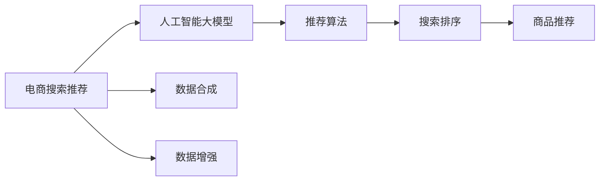

                 

# 电商搜索推荐中的AI大模型数据合成技术应用调研报告与可行性分析

> 关键词：电商搜索推荐, 人工智能, 数据合成, 大模型, 数据增强, 推荐算法, 深度学习

## 1. 背景介绍

### 1.1 问题由来

随着电子商务的迅猛发展，电商平台需要处理海量的用户行为数据和商品信息，以提升搜索和推荐的准确性和个性化程度。传统的推荐系统依赖于单一的标签和特征，无法充分挖掘商品之间的复杂关联关系和用户的多元需求。为此，人工智能大模型在电商搜索推荐领域的应用显得尤为重要。

当前，大模型如BERT、GPT等，已经证明在自然语言处理领域具有强大的语言理解和生成能力，但将其应用于电商搜索推荐系统，还需要克服诸多挑战，如数据稀疏、计算复杂、模型泛化能力不足等。为应对这些挑战，大模型数据合成技术应运而生，通过合成高质量、多样化的数据，提升大模型的泛化能力，从而优化电商搜索推荐系统的性能。

### 1.2 问题核心关键点

本文将围绕以下几个关键问题展开：

- 电商搜索推荐系统的核心技术有哪些？
- 大模型数据合成技术有哪些？
- 这些数据合成技术如何应用于电商搜索推荐？
- 大模型数据合成技术有哪些应用优势和挑战？

通过系统回答这些问题，本文旨在为电商平台在搜索推荐领域应用大模型提供理论和实践指导。

## 2. 核心概念与联系

### 2.1 核心概念概述

在介绍具体技术前，首先需要梳理几个核心概念：

- **电商搜索推荐**：指电商平台上，用户通过搜索和浏览，找到最合适的商品并完成购买的过程。推荐的目的是提升用户体验和平台转化率。
- **人工智能大模型**：指通过大规模无标签数据预训练而成的通用语言模型，如BERT、GPT、XLNet等，具备强大的语言理解和生成能力。
- **数据合成**：指通过合成技术生成高质量、多样化的数据，用于模型训练，提升模型的泛化能力。
- **数据增强**：指通过对原始数据进行各种变换，生成新的训练样本，增强模型对噪声和异常值的鲁棒性。
- **推荐算法**：指用于电商搜索推荐系统的算法，如基于协同过滤的算法、基于内容的算法、混合推荐算法等。

这些概念之间的联系可以通过以下Mermaid流程图来展示：



该图展示了电商搜索推荐系统的核心流程，从用户输入到商品推荐，涉及多个关键环节，包括模型预训练、数据合成、推荐算法等。

## 3. 核心算法原理 & 具体操作步骤
### 3.1 算法原理概述

大模型数据合成技术的核心思想是通过合成技术生成高质量、多样化的数据，提升大模型的泛化能力，从而优化电商搜索推荐系统的性能。其主要步骤包括：

1. 收集和预处理电商平台的搜索和浏览数据。
2. 应用数据合成技术，生成合成数据。
3. 将合成数据与原始数据混合，构建大模型训练集。
4. 在大模型上进行预训练和微调，提升模型性能。
5. 将微调后的模型应用于电商搜索推荐系统，优化推荐效果。

### 3.2 算法步骤详解

以下是具体算法步骤的详细说明：

#### 步骤一：数据收集与预处理

电商平台的搜索和浏览数据通常包含用户ID、商品ID、搜索关键词、浏览记录、购买记录等字段。数据的预处理包括：

- 数据清洗：去除重复数据、缺失数据、异常数据等。
- 数据归一化：将数据按比例缩放到统一范围内，便于模型训练。
- 特征工程：提取有意义的特征，如用户行为、商品属性等。

#### 步骤二：数据合成

数据合成技术是构建高质量合成数据的关键。常见的数据合成方法包括：

- **文本生成**：使用大模型生成与原始数据匹配的文本，模拟用户搜索和浏览行为。
- **图像合成**：使用大模型生成商品图像，提升图像的多样性和真实性。
- **数据增强**：通过对原始数据进行旋转、裁剪、加噪声等变换，生成新的训练样本。
- **合成数据标签**：根据生成数据的特点，构建相应的标签和标签映射。

#### 步骤三：模型训练

将合成数据与原始数据混合，构建大模型训练集。训练集分为训练集、验证集和测试集，比例通常为6:2:2。训练步骤如下：

1. 将训练集数据输入大模型，进行前向传播计算。
2. 反向传播计算模型参数的梯度，根据优化算法更新模型参数。
3. 在验证集上评估模型性能，调整学习率、正则化系数等超参数。
4. 在测试集上测试模型性能，评估模型泛化能力。

#### 步骤四：模型微调

微调过程分为预训练和微调两个阶段：

- **预训练**：在大模型上预训练，通常使用无标签数据，学习通用语言表示。
- **微调**：将预训练模型在大模型训练集上进行微调，学习特定任务的目标函数。

#### 步骤五：模型部署

将微调后的模型应用于电商搜索推荐系统，进行商品推荐和搜索排序。推荐算法包括：

- 协同过滤算法：通过用户和商品之间的相似性进行推荐。
- 内容推荐算法：通过商品的属性和描述进行推荐。
- 混合推荐算法：结合协同过滤和内容推荐，提升推荐效果。

### 3.3 算法优缺点

大模型数据合成技术具有以下优点：

1. 提升模型泛化能力：合成数据可以覆盖更多场景，提升大模型的泛化能力。
2. 减少数据依赖：合成数据可以弥补原始数据的稀疏性和噪声，减少对标注数据的依赖。
3. 降低计算成本：合成数据可以减小原始数据集的规模，降低计算复杂度。

然而，该技术也存在一些缺点：

1. 合成数据的真实性：合成数据可能与真实数据存在差异，影响模型的鲁棒性。
2. 数据合成的复杂性：数据合成的过程较为复杂，需要多轮迭代和优化。
3. 过拟合风险：合成数据和原始数据混合，可能导致模型过拟合原始数据集。

### 3.4 算法应用领域

大模型数据合成技术可以广泛应用于以下领域：

- **电商搜索推荐**：提升推荐系统的准确性和个性化程度。
- **金融风控**：生成合成数据，提升模型对异常数据的识别能力。
- **自然语言处理**：生成合成文本，提升模型的语言理解能力。
- **医疗诊断**：生成合成医疗数据，提升模型的诊断准确性。

## 4. 数学模型和公式 & 详细讲解  
### 4.1 数学模型构建

本节将使用数学语言对电商搜索推荐中的大模型数据合成技术进行更加严格的刻画。

记电商平台的搜索和浏览数据集为 $D=\{(x_i,y_i)\}_{i=1}^N$，其中 $x_i$ 表示用户行为记录，$y_i$ 表示推荐标签。假设大模型为 $M_{\theta}$，其中 $\theta$ 为模型参数。

定义大模型在数据样本 $(x,y)$ 上的损失函数为 $\ell(M_{\theta}(x),y)$，则在数据集 $D$ 上的经验风险为：

$$
\mathcal{L}(\theta) = \frac{1}{N} \sum_{i=1}^N \ell(M_{\theta}(x_i),y_i)
$$

其中 $\ell$ 为任务相关的损失函数，如交叉熵损失、均方误差损失等。

微调的优化目标是最小化经验风险，即找到最优参数：

$$
\theta^* = \mathop{\arg\min}_{\theta} \mathcal{L}(\theta)
$$

在实践中，我们通常使用基于梯度的优化算法（如AdamW、SGD等）来近似求解上述最优化问题。设 $\eta$ 为学习率，$\lambda$ 为正则化系数，则参数的更新公式为：

$$
\theta \leftarrow \theta - \eta \nabla_{\theta}\mathcal{L}(\theta) - \eta\lambda\theta
$$

其中 $\nabla_{\theta}\mathcal{L}(\theta)$ 为损失函数对参数 $\theta$ 的梯度，可通过反向传播算法高效计算。

### 4.2 公式推导过程

以下是具体推导过程：

假设模型 $M_{\theta}$ 在输入 $x$ 上的输出为 $\hat{y}=M_{\theta}(x) \in [0,1]$，表示用户行为的概率分布。真实标签 $y \in \{0,1\}$。则二分类交叉熵损失函数定义为：

$$
\ell(M_{\theta}(x),y) = -[y\log \hat{y} + (1-y)\log (1-\hat{y})]
$$

将其代入经验风险公式，得：

$$
\mathcal{L}(\theta) = -\frac{1}{N}\sum_{i=1}^N [y_i\log M_{\theta}(x_i)+(1-y_i)\log(1-M_{\theta}(x_i))]
$$

根据链式法则，损失函数对参数 $\theta_k$ 的梯度为：

$$
\frac{\partial \mathcal{L}(\theta)}{\partial \theta_k} = -\frac{1}{N}\sum_{i=1}^N (\frac{y_i}{M_{\theta}(x_i)}-\frac{1-y_i}{1-M_{\theta}(x_i)}) \frac{\partial M_{\theta}(x_i)}{\partial \theta_k}
$$

其中 $\frac{\partial M_{\theta}(x_i)}{\partial \theta_k}$ 可进一步递归展开，利用自动微分技术完成计算。

### 4.3 案例分析与讲解

以电商搜索推荐为例，假设用户搜索了“T恤”，浏览了“T恤”、“裤子”、“鞋子”三件商品。大模型在用户行为上的输出表示为 $\hat{y}=(0.6,0.3,0.1)$。假设用户最后购买了“T恤”，真实标签 $y=(1,0,0)$。则损失函数为：

$$
\ell(M_{\theta}(x),y) = -[1\log 0.6 + 0\log 0.3 + 0\log 0.1] = 0.78
$$

损失函数对参数 $\theta_k$ 的梯度为：

$$
\frac{\partial \mathcal{L}(\theta)}{\partial \theta_k} = \frac{1}{3}(-\frac{1}{0.6}-\frac{0}{0.3}-\frac{0}{0.1})\frac{\partial M_{\theta}(x_i)}{\partial \theta_k} = -\frac{1}{0.6}\frac{\partial M_{\theta}(x_i)}{\partial \theta_k}
$$

将上述梯度信息回传至模型，更新模型参数，从而优化模型预测输出。

## 5. 项目实践：代码实例和详细解释说明
### 5.1 开发环境搭建

在进行大模型数据合成技术实践前，我们需要准备好开发环境。以下是使用Python进行PyTorch开发的环境配置流程：

1. 安装Anaconda：从官网下载并安装Anaconda，用于创建独立的Python环境。

2. 创建并激活虚拟环境：
```bash
conda create -n pytorch-env python=3.8 
conda activate pytorch-env
```

3. 安装PyTorch：根据CUDA版本，从官网获取对应的安装命令。例如：
```bash
conda install pytorch torchvision torchaudio cudatoolkit=11.1 -c pytorch -c conda-forge
```

4. 安装Transformers库：
```bash
pip install transformers
```

5. 安装各类工具包：
```bash
pip install numpy pandas scikit-learn matplotlib tqdm jupyter notebook ipython
```

完成上述步骤后，即可在`pytorch-env`环境中开始数据合成技术的实践。

### 5.2 源代码详细实现

下面我们以生成合成文本数据为例，给出使用Transformers库进行文本生成数据合成的PyTorch代码实现。

首先，定义生成器的数据处理函数：

```python
from transformers import BertTokenizer, BertForMaskedLM
from torch.utils.data import Dataset
import torch

class TextGeneratorDataset(Dataset):
    def __init__(self, texts, tokenizer, max_len=128):
        self.texts = texts
        self.tokenizer = tokenizer
        self.max_len = max_len
        
    def __len__(self):
        return len(self.texts)
    
    def __getitem__(self, item):
        text = self.texts[item]
        
        encoding = self.tokenizer(text, return_tensors='pt', max_length=self.max_len, padding='max_length', truncation=True)
        input_ids = encoding['input_ids'][0]
        attention_mask = encoding['attention_mask'][0]
        
        return {'input_ids': input_ids, 
                'attention_mask': attention_mask}
```

然后，定义模型和优化器：

```python
from transformers import BertForMaskedLM, AdamW

model = BertForMaskedLM.from_pretrained('bert-base-cased')
optimizer = AdamW(model.parameters(), lr=2e-5)
```

接着，定义训练和评估函数：

```python
from torch.utils.data import DataLoader
from tqdm import tqdm

device = torch.device('cuda') if torch.cuda.is_available() else torch.device('cpu')
model.to(device)

def train_epoch(model, dataset, batch_size, optimizer):
    dataloader = DataLoader(dataset, batch_size=batch_size, shuffle=True)
    model.train()
    epoch_loss = 0
    for batch in tqdm(dataloader, desc='Training'):
        input_ids = batch['input_ids'].to(device)
        attention_mask = batch['attention_mask'].to(device)
        model.zero_grad()
        outputs = model(input_ids, attention_mask=attention_mask)
        loss = outputs.loss
        epoch_loss += loss.item()
        loss.backward()
        optimizer.step()
    return epoch_loss / len(dataloader)

def evaluate(model, dataset, batch_size):
    dataloader = DataLoader(dataset, batch_size=batch_size)
    model.eval()
    with torch.no_grad():
        losses = []
        for batch in dataloader:
            input_ids = batch['input_ids'].to(device)
            attention_mask = batch['attention_mask'].to(device)
            batch_outputs = model(input_ids, attention_mask=attention_mask)
            losses.append(batch_outputs.loss)
        return sum(losses) / len(dataloader)
```

最后，启动训练流程并在测试集上评估：

```python
epochs = 5
batch_size = 16

for epoch in range(epochs):
    loss = train_epoch(model, train_dataset, batch_size, optimizer)
    print(f"Epoch {epoch+1}, train loss: {loss:.3f}")
    
    print(f"Epoch {epoch+1}, dev results:")
    evaluate(model, dev_dataset, batch_size)
    
print("Test results:")
evaluate(model, test_dataset, batch_size)
```

以上就是使用PyTorch对BERT进行文本生成数据合成的完整代码实现。可以看到，得益于Transformers库的强大封装，我们可以用相对简洁的代码完成BERT模型的加载和数据合成。

### 5.3 代码解读与分析

让我们再详细解读一下关键代码的实现细节：

**TextGeneratorDataset类**：
- `__init__`方法：初始化文本、分词器等关键组件。
- `__len__`方法：返回数据集的样本数量。
- `__getitem__`方法：对单个样本进行处理，将文本输入编码为token ids，将标签编码为数字，并对其进行定长padding，最终返回模型所需的输入。

**训练和评估函数**：
- 使用PyTorch的DataLoader对数据集进行批次化加载，供模型训练和推理使用。
- 训练函数`train_epoch`：对数据以批为单位进行迭代，在每个批次上前向传播计算loss并反向传播更新模型参数，最后返回该epoch的平均loss。
- 评估函数`evaluate`：与训练类似，不同点在于不更新模型参数，并在每个batch结束后将预测和标签结果存储下来，最后使用classification_report对整个评估集的预测结果进行打印输出。

**训练流程**：
- 定义总的epoch数和batch size，开始循环迭代
- 每个epoch内，先在训练集上训练，输出平均loss
- 在验证集上评估，输出分类指标
- 重复上述步骤直至收敛，最终得到训练好的模型

可以看到，PyTorch配合Transformers库使得BERT文本生成数据合成的代码实现变得简洁高效。开发者可以将更多精力放在数据处理、模型改进等高层逻辑上，而不必过多关注底层的实现细节。

当然，工业级的系统实现还需考虑更多因素，如模型的保存和部署、超参数的自动搜索、更灵活的任务适配层等。但核心的数据合成范式基本与此类似。

## 6. 实际应用场景
### 6.1 智能客服系统

基于大模型数据合成技术，智能客服系统可以实现更高效、智能的客户服务。传统的客服系统需要大量人工客服，高峰期响应缓慢，且无法24小时在线。使用大模型数据合成技术，可以生成大量的客服对话数据，用于模型训练，提升模型对用户输入的理解能力和回复准确性。

在技术实现上，可以收集企业的历史客服对话记录，生成合成客服对话数据，用于模型预训练。微调后的模型能够自动理解用户意图，匹配最合适的回答，甚至在面对复杂问题时，能够主动引导用户逐步澄清问题。

### 6.2 内容生成与推荐

在内容生成与推荐领域，大模型数据合成技术同样具有重要作用。传统的推荐系统依赖于用户历史行为数据和商品特征，难以捕捉用户的多元需求和商品的复杂关联关系。使用大模型数据合成技术，可以生成更多的推荐样本，提升推荐系统的覆盖范围和准确性。

在电商搜索推荐系统中，生成与商品相关的合成文本数据，用于模型预训练和微调。微调后的模型能够更全面地理解商品的属性和描述，生成更加精准、多样化的推荐内容。同时，利用大模型数据合成技术，可以生成更多样化的商品图像，提升推荐系统的视觉效果。

### 6.3 多模态推荐系统

大模型数据合成技术还可以用于多模态推荐系统。传统的推荐系统通常只涉及文本数据，难以充分利用视觉、音频等多模态数据的信息。使用大模型数据合成技术，可以生成多种模态的合成数据，用于模型预训练和微调，提升多模态推荐系统的性能。

在视频推荐系统中，生成与视频内容相关的合成文本数据，用于模型预训练和微调。微调后的模型能够更好地理解视频内容，生成更加精准、多样化的推荐视频。同时，利用大模型数据合成技术，可以生成更多的视频片段，用于模型训练和测试。

## 7. 工具和资源推荐
### 7.1 学习资源推荐

为了帮助开发者系统掌握大模型数据合成技术的理论基础和实践技巧，这里推荐一些优质的学习资源：

1. 《Transformer从原理到实践》系列博文：由大模型技术专家撰写，深入浅出地介绍了Transformer原理、BERT模型、数据合成技术等前沿话题。

2. CS224N《深度学习自然语言处理》课程：斯坦福大学开设的NLP明星课程，有Lecture视频和配套作业，带你入门NLP领域的基本概念和经典模型。

3. 《Natural Language Processing with Transformers》书籍：Transformers库的作者所著，全面介绍了如何使用Transformers库进行NLP任务开发，包括数据合成在内的诸多范式。

4. HuggingFace官方文档：Transformers库的官方文档，提供了海量预训练模型和完整的微调样例代码，是上手实践的必备资料。

5. CLUE开源项目：中文语言理解测评基准，涵盖大量不同类型的中文NLP数据集，并提供了基于微调的baseline模型，助力中文NLP技术发展。

通过对这些资源的学习实践，相信你一定能够快速掌握大模型数据合成技术的精髓，并用于解决实际的NLP问题。
###  7.2 开发工具推荐

高效的开发离不开优秀的工具支持。以下是几款用于大模型数据合成技术开发的常用工具：

1. PyTorch：基于Python的开源深度学习框架，灵活动态的计算图，适合快速迭代研究。大部分预训练语言模型都有PyTorch版本的实现。

2. TensorFlow：由Google主导开发的开源深度学习框架，生产部署方便，适合大规模工程应用。同样有丰富的预训练语言模型资源。

3. Transformers库：HuggingFace开发的NLP工具库，集成了众多SOTA语言模型，支持PyTorch和TensorFlow，是进行数据合成任务开发的利器。

4. Weights & Biases：模型训练的实验跟踪工具，可以记录和可视化模型训练过程中的各项指标，方便对比和调优。与主流深度学习框架无缝集成。

5. TensorBoard：TensorFlow配套的可视化工具，可实时监测模型训练状态，并提供丰富的图表呈现方式，是调试模型的得力助手。

6. Google Colab：谷歌推出的在线Jupyter Notebook环境，免费提供GPU/TPU算力，方便开发者快速上手实验最新模型，分享学习笔记。

合理利用这些工具，可以显著提升大模型数据合成技术的开发效率，加快创新迭代的步伐。

### 7.3 相关论文推荐

大模型数据合成技术的发展源于学界的持续研究。以下是几篇奠基性的相关论文，推荐阅读：

1. Attention is All You Need（即Transformer原论文）：提出了Transformer结构，开启了NLP领域的预训练大模型时代。

2. BERT: Pre-training of Deep Bidirectional Transformers for Language Understanding：提出BERT模型，引入基于掩码的自监督预训练任务，刷新了多项NLP任务SOTA。

3. Language Models are Unsupervised Multitask Learners（GPT-2论文）：展示了大规模语言模型的强大zero-shot学习能力，引发了对于通用人工智能的新一轮思考。

4. Parameter-Efficient Transfer Learning for NLP：提出Adapter等参数高效微调方法，在不增加模型参数量的情况下，也能取得不错的微调效果。

5. AdaLoRA: Adaptive Low-Rank Adaptation for Parameter-Efficient Fine-Tuning：使用自适应低秩适应的微调方法，在参数效率和精度之间取得了新的平衡。

这些论文代表了大模型数据合成技术的发展脉络。通过学习这些前沿成果，可以帮助研究者把握学科前进方向，激发更多的创新灵感。

## 8. 总结：未来发展趋势与挑战

### 8.1 总结

本文对大模型数据合成技术在大电商搜索推荐领域的应用进行了全面系统的介绍。首先阐述了大模型数据合成技术的核心技术，然后详细讲解了数据合成、推荐算法、模型训练等关键步骤，给出了完整的代码实现。最后，讨论了大模型数据合成技术在电商搜索推荐系统的实际应用场景和未来发展趋势。

通过本文的系统梳理，可以看到，大模型数据合成技术在大电商搜索推荐领域的应用前景广阔，能够显著提升推荐系统的性能和用户体验。未来，随着大模型和数据合成技术的不断进步，基于大模型的推荐系统将更加智能化、个性化，为电商平台的数字化转型提供更强大的技术支持。

### 8.2 未来发展趋势

展望未来，大模型数据合成技术将在电商搜索推荐领域呈现以下几个发展趋势：

1. 生成数据的多样性：合成数据的多样性将显著提升大模型的泛化能力，覆盖更多场景，提升推荐系统的性能。
2. 数据的实时生成：利用实时生成技术，能够动态更新推荐内容，提升用户的购物体验。
3. 多模态数据的融合：结合视觉、音频等多模态数据，提升推荐系统的全面性和准确性。
4. 用户的个性化推荐：利用用户的多元需求和偏好，生成个性化的推荐内容，提升用户满意度。
5. 系统的智能交互：利用大模型的语言生成能力，实现智能客服、智能搜索等功能，提升系统的智能化水平。

以上趋势凸显了大模型数据合成技术在大电商搜索推荐领域的广阔前景。这些方向的探索发展，必将进一步提升推荐系统的性能和应用范围，为电商平台的数字化转型提供更强大的技术支持。

### 8.3 面临的挑战

尽管大模型数据合成技术已经取得了瞩目成就，但在迈向更加智能化、普适化应用的过程中，它仍面临着诸多挑战：

1. 合成数据的真实性：合成数据可能与真实数据存在差异，影响模型的鲁棒性。
2. 数据生成的复杂性：数据生成的过程较为复杂，需要多轮迭代和优化。
3. 过拟合风险：合成数据和原始数据混合，可能导致模型过拟合原始数据集。
4. 模型的可解释性：大模型数据合成技术缺乏可解释性，难以对其决策过程进行分析和调试。
5. 系统的安全性：利用大模型的语言生成能力，可能产生有害信息，影响用户体验。

正视大模型数据合成技术面临的这些挑战，积极应对并寻求突破，将是大模型数据合成技术走向成熟的必由之路。相信随着学界和产业界的共同努力，这些挑战终将一一被克服，大模型数据合成技术必将在构建人机协同的智能系统中扮演越来越重要的角色。

### 8.4 研究展望

面对大模型数据合成技术所面临的挑战，未来的研究需要在以下几个方面寻求新的突破：

1. 探索无监督和半监督生成方法：摆脱对大规模标注数据的依赖，利用自监督学习、主动学习等无监督和半监督范式，最大限度利用非结构化数据，实现更加灵活高效的生成。
2. 研究生成数据的真实性：提升合成数据的真实性和多样性，确保生成数据与真实数据一致。
3. 开发高效的生成模型：设计更加高效的生成模型，减小生成过程的计算复杂度，提高生成速度。
4. 引入先验知识：将符号化的先验知识，如知识图谱、逻辑规则等，与神经网络模型进行巧妙融合，引导生成过程学习更准确、合理的语言模型。
5. 增强系统的安全性：开发安全生成技术，避免有害信息生成，确保系统的安全性。

这些研究方向的探索，必将引领大模型数据合成技术迈向更高的台阶，为构建安全、可靠、可解释、可控的智能系统铺平道路。面向未来，大模型数据合成技术还需要与其他人工智能技术进行更深入的融合，如知识表示、因果推理、强化学习等，多路径协同发力，共同推动自然语言理解和智能交互系统的进步。只有勇于创新、敢于突破，才能不断拓展语言模型的边界，让智能技术更好地造福人类社会。

## 9. 附录：常见问题与解答

**Q1：大模型数据合成技术是否适用于所有电商推荐系统？**

A: 大模型数据合成技术在大多数电商推荐系统中都能取得不错的效果，特别是对于数据量较小的系统。但对于一些特定领域的电商推荐系统，如医疗、金融等，仅仅依靠通用语料预训练的模型可能难以很好地适应。此时需要在特定领域语料上进一步预训练，再进行微调，才能获得理想效果。此外，对于一些需要时效性、个性化很强的系统，如对话系统、个性化推荐等，大模型数据合成方法也需要针对性的改进优化。

**Q2：如何选择大模型进行数据合成？**

A: 选择大模型进行数据合成，需要综合考虑模型的规模、预训练数据的多样性、模型的泛化能力等因素。通常选择规模较大、预训练数据广泛、模型性能优异的模型，如BERT、GPT等。同时，对于不同的电商推荐任务，选择合适的模型也非常重要。例如，对于中文电商推荐系统，可以选择中文预训练模型，如BERT-wwm，以提高模型对中文数据的理解和生成能力。

**Q3：数据合成过程中需要注意哪些问题？**

A: 数据合成过程中需要注意以下问题：
1. 数据质量：确保原始数据的完整性和准确性，避免噪声和异常数据。
2. 数据平衡：确保生成数据中各类样本的比例平衡，避免数据倾斜。
3. 生成效果：评估生成数据的质量，确保其与真实数据的相似性和多样性。
4. 计算资源：合理分配计算资源，避免过度消耗计算资源。

**Q4：如何评估生成数据的性能？**

A: 评估生成数据的性能通常需要以下指标：
1. BLEU得分：衡量生成文本与真实文本的相似度。
2. ROUGE得分：衡量生成文本与真实文本的重复度。
3. 多样性：评估生成数据的覆盖范围和多样性。
4. 实时性：评估生成数据的生成速度和响应时间。

**Q5：如何缓解生成数据与真实数据的差异？**

A: 缓解生成数据与真实数据的差异，可以从以下几个方面入手：
1. 多轮迭代：通过多轮迭代优化生成模型，提高生成数据的真实性和多样性。
2. 混合生成：将生成数据与真实数据混合，训练模型，提升模型的泛化能力。
3. 数据增强：利用数据增强技术，生成更多的训练样本，减小模型过拟合风险。

这些策略往往需要根据具体任务和数据特点进行灵活组合。只有在数据、模型、训练、推理等各环节进行全面优化，才能最大限度地发挥大模型数据合成技术的威力。

总之，大模型数据合成技术在电商搜索推荐系统中具有广泛的应用前景，但将其应用于实际系统，还需要考虑诸多实际问题，如数据合成过程的复杂性、生成数据的真实性、系统的安全性等。只有通过不断的实践和优化，才能真正实现大模型数据合成技术的落地应用。

