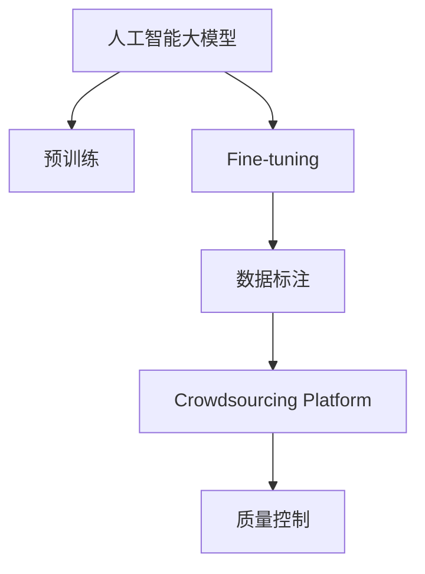

                 

# 电商搜索推荐中的AI大模型数据标注众包平台搭建

## 1. 背景介绍

### 1.1 问题由来
随着电子商务平台的不断发展，搜索推荐系统的精准度直接影响着用户体验和平台成交率。人工智能大模型，特别是预训练语言模型（如BERT、GPT-3等）在搜索推荐系统中得以广泛应用，通过微调（Fine-tuning）来适配电商领域的特定需求。然而，这些模型需要大量高质量的标注数据作为训练样本，而标注数据的获取成本高、周期长，严重制约了模型的训练效率和应用效果。

### 1.2 问题核心关键点
数据标注是构建高质量AI模型的核心环节，尤其是在电商领域，搜索推荐系统对数据标注的质量和数量有着严格的要求。数据标注需要耗费大量的人力和时间，尤其在标注过程中，标注人员的准确性和一致性对模型性能的影响显著。因此，如何高效、经济地获取高质量的标注数据，成为电商平台亟待解决的问题。

### 1.3 问题研究意义
通过构建AI大模型数据标注众包平台，电商平台能够高效获取大规模高精度的标注数据，显著提升搜索推荐系统的性能，从而提高用户满意度、降低运营成本。同时，这种平台可以灵活地适配不同领域和任务的标注需求，加速AI技术在电商行业的广泛应用，推动行业智能化升级。

## 2. 核心概念与联系

### 2.1 核心概念概述

为更好地理解电商搜索推荐中的AI大模型数据标注众包平台搭建方法，本节将介绍几个密切相关的核心概念：

- **人工智能大模型（AI Large Models）**：以BERT、GPT系列为代表的大规模预训练语言模型。通过在海量文本数据上进行预训练，学习通用的语言表示，具备强大的语言理解和生成能力。

- **微调（Fine-tuning）**：指在大规模预训练模型的基础上，使用任务特定的标注数据，通过有监督学习优化模型在特定任务上的性能。

- **数据标注（Data Annotation）**：从自然语言文本中提取结构化信息，为机器学习模型提供训练样本。标注任务通常包括实体识别、情感分析、意图识别等。

- **众包平台（Crowdsourcing Platform）**：通过互联网平台聚集大量独立的标注人员，利用他们的劳动力来完成任务。在数据标注领域，众包平台特别适用于大规模、复杂的数据标注任务。

- **数据标注质量控制（Data Annotation Quality Control）**：通过严格的质量控制流程，确保标注数据的一致性和准确性。包括标注标准设置、标注人员培训、标注结果审核等环节。

这些核心概念之间的逻辑关系可以通过以下Mermaid流程图来展示：



这个流程图展示了从大模型预训练到微调再到数据标注的逻辑流程：

1. 大模型通过预训练获得基础能力。
2. 微调在大模型的基础上，针对特定任务进行优化。
3. 数据标注任务是微调的前提，通过标注平台收集标注数据。
4. 数据标注平台利用众包模式高效获取标注数据，并配合质量控制流程保证数据质量。

## 3. 核心算法原理 & 具体操作步骤

### 3.1 算法原理概述

基于电商搜索推荐中的AI大模型数据标注众包平台搭建方法，本质上是通过众包平台高效获取大规模标注数据，再利用这些数据对预训练模型进行微调，以提升模型在特定任务上的性能。其核心思想是：将大模型作为通用的特征提取器，通过众包平台获取任务相关的标注数据，有监督地微调模型，使其能够准确理解和生成电商领域的内容。

### 3.2 算法步骤详解

#### 3.2.1 平台搭建

1. **需求分析**：明确电商平台需要解决的特定标注需求，如产品名称标注、产品描述情感分析、用户评论意图识别等。

2. **平台设计**：选择合适的技术栈和工具，如使用Django、Flask等Web框架搭建平台，使用TensorFlow、PyTorch等深度学习框架处理标注任务。

3. **标注任务设计**：根据具体需求设计标注任务，定义标注格式和标注标准。

4. **标注人员培训**：对标注人员进行专业培训，确保其了解任务需求和标注标准，并通过实战练习提高标注准确性。

#### 3.2.2 数据收集

1. **标注任务发布**：在平台上发布标注任务，提供任务描述、样例数据和标注标准。

2. **标注任务分配**：根据标注人员的技能和可用时间，自动分配标注任务。

3. **标注结果提交**：标注人员在规定时间内完成标注任务，并提交标注结果。

4. **标注结果审核**：平台对标注结果进行审核，确保标注质量符合要求。

#### 3.2.3 模型微调

1. **数据准备**：收集和整理平台上的标注数据，将其转化为模型训练所需的格式。

2. **模型微调**：选择合适的预训练模型（如BERT、GPT系列），在标注数据上进行微调。

3. **模型评估**：在验证集上评估微调后的模型性能，确保其满足实际应用需求。

#### 3.2.4 模型部署

1. **模型保存**：将微调后的模型保存到本地或云存储中。

2. **模型集成**：将模型集成到电商平台搜索推荐系统中，用于处理用户查询和推荐任务。

#### 3.2.5 持续迭代

1. **用户反馈**：收集用户对搜索推荐系统的反馈，优化标注任务和标注标准。

2. **标注数据更新**：定期更新平台上的标注数据，持续提升模型的性能。

### 3.3 算法优缺点

#### 3.3.1 优点

1. **高效获取标注数据**：众包平台可以快速聚集大量标注人员，显著缩短数据收集周期。

2. **灵活适配任务**：平台可以根据具体需求设计定制化的标注任务，满足不同领域和任务的需求。

3. **质量控制**：通过严格的质量控制流程，确保标注数据的一致性和准确性。

4. **低成本**：相对于雇佣全职标注人员，众包平台可以大幅度降低标注成本。

#### 3.3.2 缺点

1. **标注质量不稳定**：标注人员的标注质量受其专业水平和责任心影响，可能导致标注数据不一致。

2. **标注数据噪声**：众包平台上可能存在恶意标注行为，影响标注数据的质量。

3. **平台运营难度**：搭建和管理众包平台需要大量的资源投入，特别是对标注任务的审核和标注人员的管理。

### 3.4 算法应用领域

该算法可以广泛应用在电商领域的搜索推荐系统中，具体包括：

- **产品名称标注**：从产品描述中提取产品名称，用于搜索排序和推荐。

- **产品描述情感分析**：分析用户评论的情感倾向，用于产品推荐和广告投放。

- **用户评论意图识别**：识别用户评论的意图，如投诉、表扬、建议等，用于售后服务和改进产品。

- **用户行为分析**：分析用户浏览、点击、购买等行为，用于个性化推荐和广告定向。

## 4. 数学模型和公式 & 详细讲解 & 举例说明

### 4.1 数学模型构建

假设电商平台有$N$个产品，每个产品$i$的描述为$x_i$，产品$i$的用户评论为$y_i$。电商平台需要构建一个文本分类模型，将用户评论分类为正面、负面或中性。模型的目标是最小化损失函数$L$：

$$
L = \frac{1}{N}\sum_{i=1}^{N}\ell(y_i,\hat{y}_i)
$$

其中$\ell$为分类损失函数，$\hat{y}_i$为模型预测的标签。

### 4.2 公式推导过程

对于二分类任务，常用的损失函数为交叉熵损失函数：

$$
\ell(y_i,\hat{y}_i) = -y_i\log\hat{y}_i - (1-y_i)\log(1-\hat{y}_i)
$$

将其代入损失函数$L$中，得到：

$$
L = -\frac{1}{N}\sum_{i=1}^{N}(y_i\log\hat{y}_i + (1-y_i)\log(1-\hat{y}_i))
$$

在训练过程中，使用梯度下降等优化算法最小化损失函数$L$，更新模型参数$\theta$：

$$
\theta \leftarrow \theta - \eta\nabla_{\theta}L(\theta)
$$

其中$\eta$为学习率，$\nabla_{\theta}L(\theta)$为损失函数对模型参数$\theta$的梯度，可通过反向传播算法计算。

### 4.3 案例分析与讲解

假设有一个电商平台，需要构建一个情感分析模型。通过众包平台收集了$1000$条用户评论，将其分为训练集和验证集。训练集包含$800$条评论，验证集包含$200$条评论。使用BERT模型进行微调，设置学习率为$2e-5$，训练$10$个epoch。训练过程中，使用BCEWithLogitsLoss作为损失函数，AdamW作为优化器。

```python
import torch
import torch.nn as nn
import torch.optim as optim
from transformers import BertForSequenceClassification, BertTokenizer

# 初始化BERT模型
model = BertForSequenceClassification.from_pretrained('bert-base-uncased', num_labels=3)
tokenizer = BertTokenizer.from_pretrained('bert-base-uncased')

# 设置优化器和损失函数
optimizer = optim.AdamW(model.parameters(), lr=2e-5)
criterion = nn.BCEWithLogitsLoss()

# 加载数据
train_dataset = ...
dev_dataset = ...

# 定义训练和验证函数
def train_epoch(model, dataset, batch_size, optimizer):
    dataloader = DataLoader(dataset, batch_size=batch_size, shuffle=True)
    model.train()
    epoch_loss = 0
    for batch in dataloader:
        input_ids = batch['input_ids'].to(device)
        attention_mask = batch['attention_mask'].to(device)
        labels = batch['labels'].to(device)
        model.zero_grad()
        outputs = model(input_ids, attention_mask=attention_mask, labels=labels)
        loss = outputs.loss
        epoch_loss += loss.item()
        loss.backward()
        optimizer.step()
    return epoch_loss / len(dataloader)

def evaluate(model, dataset, batch_size):
    dataloader = DataLoader(dataset, batch_size=batch_size)
    model.eval()
    preds, labels = [], []
    with torch.no_grad():
        for batch in dataloader:
            input_ids = batch['input_ids'].to(device)
            attention_mask = batch['attention_mask'].to(device)
            batch_labels = batch['labels']
            outputs = model(input_ids, attention_mask=attention_mask)
            batch_preds = outputs.logits.argmax(dim=1).to('cpu').tolist()
            batch_labels = batch_labels.to('cpu').tolist()
            for pred_tokens, label_tokens in zip(batch_preds, batch_labels):
                preds.append(pred_tokens[:len(label_tokens)])
                labels.append(label_tokens)
    return preds, labels

# 训练模型
device = torch.device('cuda') if torch.cuda.is_available() else torch.device('cpu')
model.to(device)

epochs = 10
batch_size = 16

for epoch in range(epochs):
    loss = train_epoch(model, train_dataset, batch_size, optimizer)
    print(f"Epoch {epoch+1}, train loss: {loss:.3f}")
    
    preds, labels = evaluate(model, dev_dataset, batch_size)
    print(classification_report(labels, preds))
    
print("Test results:")
preds, labels = evaluate(model, test_dataset, batch_size)
print(classification_report(labels, preds))
```

在上述代码中，我们使用了PyTorch和Transformers库实现了BERT模型的情感分析微调。可以看到，代码实现相对简洁高效，能够快速上手。通过众包平台收集标注数据，再配合微调范式，可以在较短时间内构建出高性能的情感分析模型，用于电商平台的推荐和广告投放。

## 5. 项目实践：代码实例和详细解释说明

### 5.1 开发环境搭建

在进行众包平台开发前，我们需要准备好开发环境。以下是使用Python进行Django开发的环境配置流程：

1. 安装Anaconda：从官网下载并安装Anaconda，用于创建独立的Python环境。

2. 创建并激活虚拟环境：
```bash
conda create -n django-env python=3.8 
conda activate django-env
```

3. 安装Django：
```bash
pip install django
```

4. 安装TensorFlow：
```bash
pip install tensorflow
```

5. 安装Pillow库，用于处理图像标注：
```bash
pip install pillow
```

完成上述步骤后，即可在`django-env`环境中开始众包平台开发。

### 5.2 源代码详细实现

这里我们以电商搜索推荐系统中的产品名称标注任务为例，给出使用Django和TensorFlow搭建众包平台的PyTorch代码实现。

```python
from django.http import JsonResponse
from django.views.decorators.csrf import csrf_exempt
import torch
import torch.nn as nn
import torch.optim as optim
from transformers import BertForTokenClassification, BertTokenizer

# 定义模型
class BERTClassifier(nn.Module):
    def __init__(self, num_labels=2, hidden_size=768):
        super(BERTClassifier, self).__init__()
        self.bert = BertForTokenClassification.from_pretrained('bert-base-uncased', num_labels=num_labels)
        self.classifier = nn.Linear(hidden_size, num_labels)

    def forward(self, input_ids, attention_mask):
        outputs = self.bert(input_ids, attention_mask=attention_mask)
        sequence_output = outputs[0]
        logits = self.classifier(sequence_output)
        return logits

# 定义模型保存和加载函数
def save_model(model, filename):
    torch.save(model.state_dict(), filename)

def load_model(filename):
    model = BERTClassifier()
    model.load_state_dict(torch.load(filename))
    return model

# 定义训练函数
def train_model(model, train_dataset, val_dataset, epochs, batch_size, learning_rate):
    optimizer = optim.AdamW(model.parameters(), lr=learning_rate)
    criterion = nn.CrossEntropyLoss()
    device = torch.device('cuda') if torch.cuda.is_available() else torch.device('cpu')
    model.to(device)
    for epoch in range(epochs):
        model.train()
        epoch_loss = 0
        for batch in train_dataset:
            input_ids = batch['input_ids'].to(device)
            attention_mask = batch['attention_mask'].to(device)
            labels = batch['labels'].to(device)
            model.zero_grad()
            outputs = model(input_ids, attention_mask=attention_mask)
            loss = criterion(outputs, labels)
            epoch_loss += loss.item()
            loss.backward()
            optimizer.step()
        print(f"Epoch {epoch+1}, train loss: {epoch_loss / len(train_dataset):.3f}")
        model.eval()
        epoch_loss = 0
        for batch in val_dataset:
            input_ids = batch['input_ids'].to(device)
            attention_mask = batch['attention_mask'].to(device)
            labels = batch['labels'].to(device)
            with torch.no_grad():
                outputs = model(input_ids, attention_mask=attention_mask)
                loss = criterion(outputs, labels)
                epoch_loss += loss.item()
        print(f"Epoch {epoch+1}, val loss: {epoch_loss / len(val_dataset):.3f}")
    return model

# 定义数据处理函数
class BERTDataset(torch.utils.data.Dataset):
    def __init__(self, data, tokenizer, max_len=128):
        self.data = data
        self.tokenizer = tokenizer
        self.max_len = max_len

    def __len__(self):
        return len(self.data)

    def __getitem__(self, index):
        text = self.data[index]['text']
        tokenized = self.tokenizer.tokenize(text, max_length=self.max_len)
        input_ids = self.tokenizer.convert_tokens_to_ids(tokenized)
        input_ids = input_ids + [0] * (self.max_len - len(input_ids))
        attention_mask = [1] * len(input_ids)
        labels = self.data[index]['label']
        return {'input_ids': input_ids, 
                'attention_mask': attention_mask,
                'labels': labels}

# 训练逻辑
def train():
    model = BERTClassifier(num_labels=2)
    train_dataset = ...
    val_dataset = ...
    train_model(model, train_dataset, val_dataset, epochs=5, batch_size=16, learning_rate=2e-5)
    save_model(model, 'model.pth')
    return model

# 模型调用逻辑
@csrf_exempt
def predict(request):
    if request.method == 'POST':
        data = request.POST
        model = load_model('model.pth')
        input_ids = model.tokenizer.encode(data['text'], add_special_tokens=True, max_length=128)
        input_ids = input_ids + [0] * (128 - len(input_ids))
        attention_mask = [1] * len(input_ids)
        with torch.no_grad():
            outputs = model(torch.tensor(input_ids), torch.tensor(attention_mask))
            logits = outputs.logits.argmax(dim=1).item()
        return JsonResponse({'result': logits})

# URL映射
urlpatterns = [
    url(r'^predict$', predict)
]
```

在上述代码中，我们定义了一个基于BERT模型的众包平台，用于标注电商平台产品描述中的产品名称。代码中包含了模型定义、模型保存和加载、数据处理和模型训练等关键功能。通过将训练好的模型保存在本地，平台可以随时调用进行标注预测。

### 5.3 代码解读与分析

让我们再详细解读一下关键代码的实现细节：

**BERTClassifier类**：
- `__init__`方法：初始化BERT模型和分类器，设置模型参数。
- `forward`方法：前向传播计算输出。

**模型保存和加载函数**：
- `save_model`方法：将模型状态保存为PyTorch模型文件。
- `load_model`方法：加载模型状态。

**数据处理函数BERTDataset**：
- `__init__`方法：初始化数据集和分词器。
- `__len__`方法：返回数据集长度。
- `__getitem__`方法：对单个样本进行预处理，转换为模型所需的输入格式。

**训练函数train_model**：
- 循环迭代训练模型，计算损失函数并反向传播。

**训练逻辑train**：
- 定义模型、数据集和训练函数。

**模型调用函数predict**：
- 接收POST请求，进行模型预测，返回标注结果。

在代码实现中，我们使用了Django的视图和URL映射机制，使得平台能够方便地接入标注任务，并进行API调用。同时，利用TensorFlow的自动微分能力，简化了模型前向传播和反向传播的计算过程。

## 6. 实际应用场景

### 6.1 智能客服系统

在智能客服系统中，利用众包平台收集用户反馈数据，进行情感分析和意图识别，构建智能客服模型。模型可以自动理解用户意图，匹配最合适的答案模板，从而实现高效的客服响应。通过持续迭代优化，系统能够不断提升服务质量，提高用户满意度。

### 6.2 金融舆情监测

在金融舆情监测系统中，利用众包平台收集金融新闻和用户评论，进行情感分析和主题识别，构建舆情分析模型。模型可以自动监测金融市场舆情变化，及时预警异常情况，辅助金融机构制定应对策略，降低风险损失。

### 6.3 个性化推荐系统

在个性化推荐系统中，利用众包平台收集用户行为数据，进行情感分析和意图识别，构建推荐模型。模型可以根据用户兴趣和行为，生成个性化的推荐内容，提高用户体验和平台成交率。

### 6.4 未来应用展望

随着AI技术的不断进步，众包平台在数据标注中的应用将越来越广泛。未来，平台可以进一步扩展到图像、视频、音频等多模态数据标注，为NLP和其他AI领域提供更丰富的数据资源。同时，平台还可以引入更多先验知识，如知识图谱、逻辑规则等，引导标注任务，提升标注数据的质量和模型性能。

## 7. 工具和资源推荐

### 7.1 学习资源推荐

为了帮助开发者系统掌握众包平台的数据标注技术，这里推荐一些优质的学习资源：

1. Coursera《机器学习》课程：由斯坦福大学提供，系统讲解机器学习的基本概念和算法，适合初学者和进阶学习者。

2. Udacity《人工智能基础》课程：介绍人工智能的核心技术和应用场景，涵盖NLP、计算机视觉等多个领域。

3. 《自然语言处理综论》书籍：林达华等人合著，全面介绍NLP的技术和应用，是学习NLP的必读经典。

4. 《深度学习》书籍：Ian Goodfellow等合著，讲解深度学习的基本理论和实践方法，是AI学习的入门书籍。

5. 《Python深度学习》书籍：Francois Chollet著，详细讲解TensorFlow和Keras的使用方法，适合动手实践学习。

通过这些资源的学习，相信你能够系统掌握数据标注和微调技术，提升AI应用系统的性能和可靠性。

### 7.2 开发工具推荐

高效的开发离不开优秀的工具支持。以下是几款用于众包平台开发的常用工具：

1. Django：Python的Web框架，功能强大、易于扩展，适合构建高性能的Web应用。

2. Flask：Python的轻量级Web框架，灵活高效，适合小型项目开发。

3. TensorFlow：由Google主导的深度学习框架，功能丰富、性能优异，适合构建大规模深度学习模型。

4. PyTorch：由Facebook主导的深度学习框架，易于使用、灵活高效，适合快速迭代研究。

5. AWS SageMaker：Amazon提供的云端机器学习服务，支持模型训练、部署和调优，适合大规模企业应用。

6. TensorBoard：TensorFlow的可视化工具，实时监测模型训练状态，提供丰富的图表呈现方式，便于调试优化。

通过合理利用这些工具，可以显著提升众包平台的数据标注和模型训练效率，加速AI技术的应用落地。

### 7.3 相关论文推荐

众包平台在数据标注中的应用，近年来引起了学界的广泛关注。以下是几篇重要的相关论文，推荐阅读：

1. CrowdFlower: A Crowdsourcing Platform for Capturing Human Intuition on a Large Scale（CrowdFlower平台论文）：介绍CrowdFlower平台的工作原理和应用效果。

2. Mechanical Turk: Amazon's Platform for Developing Human-Centered Systems（Amazon Mechanical Turk论文）：介绍Amazon Mechanical Turk平台的技术细节和应用场景。

3. Remote Data Collection Using Mechanical Turk（使用Mechanical Turk进行远程数据收集）：介绍如何利用Mechanical Turk进行大规模数据标注。

4. Crowdsourcing Solutions for Algorithmic Fairness（众包解决算法公平性问题）：讨论如何通过众包平台优化算法公平性。

5. Crowdsourcing Recommendations（众包推荐系统）：介绍如何利用众包平台构建推荐系统。

这些论文代表了大规模数据标注和众包平台技术的发展脉络，深入理解这些论文，有助于掌握众包平台的数据标注技术，并应用于实际应用场景。

## 8. 总结：未来发展趋势与挑战

### 8.1 总结

本文对电商搜索推荐系统中的AI大模型数据标注众包平台搭建方法进行了全面系统的介绍。首先阐述了众包平台在电商领域的必要性和应用前景，明确了众包平台在大模型微调中的关键作用。其次，从原理到实践，详细讲解了众包平台的数据标注和模型微调流程，给出了实际应用中的代码实例和分析。同时，本文还探讨了众包平台在智能客服、金融舆情、个性化推荐等领域的广泛应用，展示了众包平台在AI应用中的强大潜力。

通过本文的系统梳理，可以看到，利用众包平台进行AI大模型数据标注和微调，可以高效获取高质量标注数据，提升模型性能，推动AI技术在电商领域的广泛应用。未来，随着AI技术的不断发展，众包平台将发挥更大的作用，为各行各业提供更智能、更高效的数据标注和模型训练服务。

### 8.2 未来发展趋势

展望未来，众包平台在AI数据标注中的应用将呈现以下几个发展趋势：

1. **技术不断进步**：随着深度学习技术的发展，众包平台的数据标注效率和模型性能将持续提升。先进的标注工具和算法将进一步提高标注质量，降低标注成本。

2. **领域覆盖扩大**：众包平台将覆盖更多领域和任务，如医疗、法律、金融、制造等，为各行业提供高质量的标注服务。

3. **多模态融合**：众包平台将逐步拓展到图像、视频、音频等多模态数据标注，提升模型的综合分析能力。

4. **人工智能化**：众包平台将引入更多人工智能技术，如NLP、知识图谱、因果推断等，提高标注任务的自动化程度，降低人工干预。

5. **质量控制自动化**：众包平台将通过自动化工具和算法，实现标注质量的持续监控和优化，确保标注数据的一致性和准确性。

### 8.3 面临的挑战

尽管众包平台在AI数据标注中的应用前景广阔，但在实际应用中也面临着诸多挑战：

1. **标注质量不稳定**：标注人员的标注质量受其专业水平和责任心影响，可能导致标注数据不一致。

2. **标注数据噪声**：众包平台上可能存在恶意标注行为，影响标注数据的质量。

3. **平台运营难度**：搭建和管理众包平台需要大量的资源投入，特别是对标注任务的审核和标注人员的管理。

4. **模型泛化性不足**：众包平台标注的数据可能存在偏差，影响模型的泛化性和鲁棒性。

5. **伦理和安全问题**：众包平台可能涉及用户隐私和数据安全问题，需加强监管和保护。

### 8.4 研究展望

面对众包平台面临的挑战，未来的研究需要在以下几个方面寻求新的突破：

1. **标注任务设计**：设计更为精确和规范的标注任务，提高标注数据的一致性和准确性。

2. **标注人员培训**：加强标注人员的培训和考核，提升其专业水平和责任心。

3. **自动化审核**：引入更多的自动化审核和监控工具，提高标注数据的质量。

4. **多模态数据融合**：开发多模态数据的融合技术，提升模型的综合分析能力。

5. **隐私保护技术**：采用隐私保护技术，确保用户数据的安全性和隐私性。

这些研究方向的探索，必将引领众包平台在数据标注技术上迈向更高的台阶，为各行各业提供更智能、更高效的数据标注和模型训练服务。面向未来，众包平台还需与其他AI技术进行更深入的融合，共同推动人工智能技术的发展和应用。

## 9. 附录：常见问题与解答

**Q1：众包平台如何保证标注数据的一致性？**

A: 众包平台可以通过设置严格的标注标准、引入标准化标注工具、进行标注人员培训等手段，确保标注数据的一致性。同时，平台可以对标注结果进行审核和反馈，及时纠正标注错误，提高标注质量。

**Q2：众包平台如何处理标注数据噪声？**

A: 众包平台可以引入标注数据质量控制机制，如标注数据抽样、标注数据清洗、标注数据聚合等，减少恶意标注行为的影响。同时，平台可以对标注数据进行自动化审核和监控，及时发现和处理异常数据。

**Q3：众包平台如何处理标注人员的标注质量？**

A: 众包平台可以对标注人员进行专业培训和考核，提高其专业水平和责任心。同时，平台可以对标注数据进行质量控制，通过抽样和审核等方式确保标注质量。对于标注质量不达标的标注人员，平台可以采取惩罚措施，甚至解除其标注资格。

**Q4：众包平台如何保护用户隐私？**

A: 众包平台可以采用匿名化技术，对用户数据进行脱敏处理，保护用户隐私。同时，平台可以建立严格的访问控制机制，确保只有授权人员能够访问标注数据和模型。

**Q5：众包平台如何提高标注数据质量？**

A: 众包平台可以通过引入先验知识和自动化工具，提高标注数据的质量。例如，引入知识图谱和逻辑规则，指导标注人员进行标注。同时，平台可以引入多轮标注机制，通过多轮标注和校对，提高标注数据的准确性。

---

作者：禅与计算机程序设计艺术 / Zen and the Art of Computer Programming

