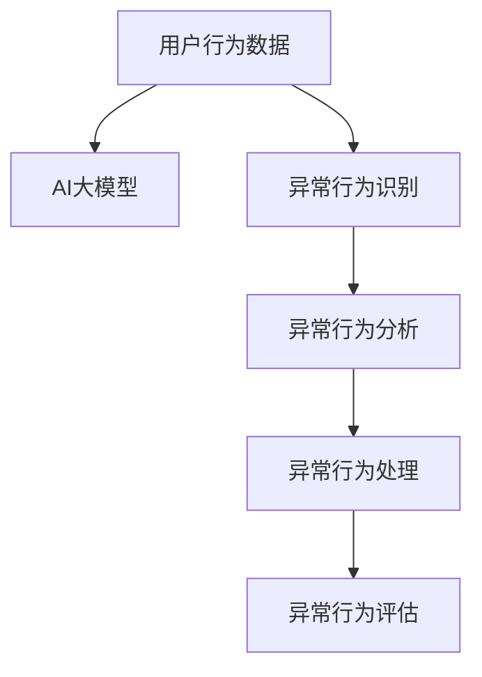

                 

# 电商搜索推荐中的AI大模型用户行为序列异常检测评估体系

## 1. 背景介绍

随着电商平台的迅猛发展，用户体验和个性化推荐成为了决定用户留存率、购买转化率的关键因素。基于AI大模型的推荐系统在个性化推荐上表现出色，但其在推荐准确性和稳定性的保障上仍面临诸多挑战。特别是用户在搜索推荐序列中可能出现异常行为，如突然浏览或点击大量产品、长时间不点击等，这类行为可能预示着用户心理状态的变化，对推荐系统的设计提出了更高的要求。

### 1.1 问题由来

电商搜索推荐系统在推荐商品时，通常需要基于用户的历史行为数据进行个性化推荐。然而，用户的行为数据本身具有高度不确定性和复杂性。在用户浏览和购买行为中，往往存在各种异常情况，如用户突然改变浏览兴趣、长时间不点击等，这些异常行为对推荐系统带来了较大的挑战。如果未能有效识别这些异常，可能导致推荐系统无法精准理解用户意图，影响推荐效果。

### 1.2 问题核心关键点

电商平台推荐系统的核心问题在于如何通过用户行为序列中的异常行为进行识别和分析，以优化推荐算法，提升用户体验。具体核心关键点包括：

- 异常行为识别：通过对用户浏览、点击、搜索等行为序列的建模，检测并识别出异常行为。
- 异常行为分析：对识别出的异常行为进行分析，获取用户的当前心理状态和需求。
- 异常行为处理：结合异常行为分析结果，对推荐算法进行动态调整，优化推荐内容。
- 异常行为评估：构建一套完整的异常行为评估体系，对异常行为识别和处理效果进行评价。

### 1.3 问题研究意义

构建电商搜索推荐中的AI大模型用户行为序列异常检测评估体系，对于提升推荐系统的个性化、精准性和稳定性，具有重要意义：

1. **提高个性化推荐精度**：通过识别用户行为序列中的异常行为，推荐系统可以更准确地捕捉用户当前心理状态和需求，提升推荐效果。
2. **增强推荐系统稳定性**：异常行为分析可以帮助推荐系统更好地理解用户行为的变化规律，避免因异常行为导致的推荐波动。
3. **提升用户体验**：通过优化推荐内容，满足用户个性化需求，增强用户粘性，提升用户满意度。
4. **驱动电商业务创新**：异常行为分析可以揭示用户行为模式，帮助电商平台优化商品布局、提升运营效率，实现业务增长。

## 2. 核心概念与联系

### 2.1 核心概念概述

构建电商搜索推荐中的AI大模型用户行为序列异常检测评估体系，涉及以下核心概念：

- **AI大模型**：如BERT、GPT等预训练语言模型，能够理解和学习用户行为数据中的语义信息，提供强大的特征提取能力。
- **用户行为序列**：用户在平台上的浏览、点击、搜索等行为序列，反映了用户的兴趣和需求变化。
- **异常行为识别**：通过数据分析和机器学习算法，检测出用户行为序列中的异常行为模式。
- **异常行为分析**：对识别出的异常行为进行分析和解释，理解用户当前心理状态和需求。
- **异常行为处理**：结合异常行为分析结果，对推荐算法进行动态调整，优化推荐内容。
- **异常行为评估**：构建评估体系，对异常行为识别和处理效果进行量化评价。

这些核心概念之间的逻辑关系可以通过以下Mermaid流程图来展示：



这个流程图展示了大模型异常检测体系的核心流程：

1. 收集用户行为数据。
2. 通过AI大模型进行特征提取，构建用户行为序列。
3. 检测并识别异常行为。
4. 对识别出的异常行为进行分析，理解用户需求。
5. 根据分析结果优化推荐算法，动态调整推荐内容。
6. 构建评估体系，评价异常行为识别和处理的有效性。

## 3. 核心算法原理 & 具体操作步骤

### 3.1 算法原理概述

基于AI大模型的电商搜索推荐中的异常行为检测和评估体系，本质上是一个端到端的异常检测和反馈优化流程。其核心思想是：将用户行为序列通过AI大模型进行特征提取，然后利用异常检测算法识别出异常行为，并通过异常行为分析，对推荐系统进行动态调整。

形式化地，假设用户行为序列为 $S=\{x_1,x_2,...,x_n\}$，其中 $x_i$ 表示第 $i$ 次用户行为。我们定义异常行为检测函数 $F$，将用户行为序列 $S$ 映射为异常行为的评分序列 $R=\{r_1,r_2,...,r_n\}$，其中 $r_i$ 表示第 $i$ 次用户行为的异常评分。然后，根据 $R$ 序列对推荐算法进行优化，生成推荐结果 $Y=\{y_1,y_2,...,y_n\}$。最后，构建评估体系，对异常行为识别和处理效果进行量化评价。

### 3.2 算法步骤详解

基于AI大模型的电商搜索推荐中的异常行为检测和评估体系，一般包括以下几个关键步骤：

**Step 1: 数据准备**
- 收集电商平台的原始用户行为数据，包括用户的浏览记录、点击记录、搜索记录等。
- 对原始数据进行预处理和清洗，去除无关数据和异常值。
- 将用户行为数据进行编码，转化为AI大模型可以处理的格式。

**Step 2: 特征提取**
- 使用AI大模型对用户行为数据进行特征提取，构建用户行为序列。
- 通过Transformer等模型，将用户行为数据转化为向量表示。
- 利用预训练大模型的隐藏层输出，作为用户行为特征。

**Step 3: 异常行为识别**
- 定义异常行为检测函数 $F$，通过分析用户行为序列，识别出异常行为。
- 可以使用统计方法、机器学习算法（如SVM、LSTM等），或深度学习模型（如BERT、GPT等）进行异常检测。
- 在异常行为识别过程中，引入正则化技术，防止误检和漏检。

**Step 4: 异常行为分析**
- 对识别出的异常行为进行深入分析，理解用户当前心理状态和需求。
- 通过情感分析、意图识别等NLP技术，获取用户对商品的态度和兴趣。
- 结合用户行为历史，构建用户画像，预测用户未来行为。

**Step 5: 异常行为处理**
- 根据异常行为分析结果，对推荐算法进行动态调整。
- 可以引入权重调整、样本重采样等技术，优化推荐系统。
- 在推荐算法中，引入异常行为因素，平衡推荐效果。

**Step 6: 异常行为评估**
- 构建评估指标，如准确率、召回率、F1分数等，对异常行为识别和处理效果进行评价。
- 通过A/B测试等方法，比较异常行为识别和处理前后的推荐效果。
- 持续监测用户行为，根据新数据动态调整异常行为检测和处理策略。

### 3.3 算法优缺点

基于AI大模型的电商搜索推荐中的异常行为检测和评估体系，具有以下优点：

1. **精度高**：利用大模型的强大特征提取能力，可以准确捕捉用户行为序列中的异常模式。
2. **泛化能力强**：大模型具备跨领域泛化能力，可以适应多种电商平台的推荐场景。
3. **灵活性高**：异常行为检测和处理可以动态调整，适应不同用户的需求和行为变化。
4. **自动化程度高**：自动化检测和分析异常行为，提高系统运营效率。

同时，该方法也存在一定的局限性：

1. **数据依赖性强**：异常行为检测和分析依赖高质量、完整的数据，数据质量问题可能导致误判。
2. **计算资源消耗大**：大模型的特征提取和异常检测过程，需要较高的计算资源。
3. **模型复杂度较高**：异常行为检测和处理算法复杂，需要精心设计和调参。
4. **可解释性不足**：异常行为检测和处理模型的内部逻辑难以解释，可能影响用户信任度。

尽管存在这些局限性，但就目前而言，基于AI大模型的异常行为检测和评估方法仍是大模型推荐系统中的主流范式。未来相关研究的重点在于如何进一步降低数据依赖，提高系统效率和可解释性，同时兼顾鲁棒性和泛化能力。

### 3.4 算法应用领域

基于AI大模型的电商搜索推荐中的异常行为检测和评估体系，在电商、金融、医疗等多个领域都具有广泛的应用前景：

- **电商推荐**：通过异常行为检测和分析，优化电商平台的个性化推荐算法，提升推荐效果。
- **金融风险监控**：利用异常行为检测，识别和预防金融欺诈行为，保护用户资产安全。
- **医疗健康监测**：通过行为序列分析，监测用户健康状态变化，及时预警疾病风险。
- **智能客服**：识别用户不满情绪，自动调整客服策略，提升客户服务质量。
- **智能安防**：检测异常行为，预防安全隐患，保障公共安全。

此外，基于大模型的异常行为检测和评估方法，还可以应用于数据挖掘、社交网络分析等多个领域，为各行业带来智能化的决策支持。

## 4. 数学模型和公式 & 详细讲解  
### 4.1 数学模型构建

基于AI大模型的电商搜索推荐中的异常行为检测和评估体系，其数学模型构建主要包括以下几个部分：

1. **用户行为序列表示**：假设用户行为序列 $S=\{x_1,x_2,...,x_n\}$，其中 $x_i$ 表示第 $i$ 次用户行为。将用户行为数据转化为向量表示 $X=\{x_1^v, x_2^v,...,x_n^v\}$，其中 $x_i^v \in \mathbb{R}^d$ 表示用户行为 $x_i$ 的向量表示。

2. **异常行为评分序列**：定义异常行为检测函数 $F$，将用户行为序列 $S$ 映射为异常行为的评分序列 $R=\{r_1,r_2,...,r_n\}$，其中 $r_i$ 表示第 $i$ 次用户行为的异常评分。异常行为评分 $r_i$ 通常由以下几个因素决定：
   - 用户行为时间间隔：用户行为时间间隔 $t_i$，表示两次用户行为之间的时间差。
   - 用户行为类型：用户行为类型 $T_i$，表示用户行为的种类，如浏览、点击、搜索等。
   - 用户行为强度：用户行为强度 $S_i$，表示用户行为的强度，如点击次数、搜索时长等。
   - 用户行为上下文：用户行为上下文 $C_i$，表示用户行为的上下文信息，如地理位置、购物车内容等。
   - 用户行为历史：用户行为历史 $H_i$，表示用户行为的历史数据，如最近的浏览记录、点击记录等。

3. **推荐算法优化**：假设推荐算法输出的推荐结果为 $Y=\{y_1,y_2,...,y_n\}$，其中 $y_i$ 表示第 $i$ 次推荐的商品。推荐算法优化目标是最小化推荐损失函数 $L(Y,S)$，使得推荐结果与用户行为序列相匹配。

### 4.2 公式推导过程

以用户行为序列 $S=\{x_1,x_2,...,x_n\}$ 为例，进行异常行为评分序列 $R=\{r_1,r_2,...,r_n\}$ 的推导。

首先，假设异常行为检测函数 $F$ 的形式为：

$$
F(X_i, X_{i-1}, X_{i+1}, H_i, T_i, S_i, C_i, t_i) = r_i
$$

其中 $X_i$ 表示用户行为向量，$X_{i-1}$ 和 $X_{i+1}$ 表示用户行为的上下文向量，$H_i$ 表示用户行为历史向量，$T_i$ 表示用户行为类型，$S_i$ 表示用户行为强度，$C_i$ 表示用户行为上下文，$t_i$ 表示用户行为时间间隔。

为了简化问题，假设 $F$ 函数为一个简单的加权函数：

$$
r_i = w_1 \cdot t_i + w_2 \cdot T_i + w_3 \cdot S_i + w_4 \cdot C_i + w_5 \cdot H_i
$$

其中 $w_1$ 到 $w_5$ 表示各个因素的权重系数，可以通过训练数据学习得到。

通过上述公式，可以得到用户行为序列 $S$ 的异常行为评分序列 $R=\{r_1,r_2,...,r_n\}$。

### 4.3 案例分析与讲解

以电商平台为例，假设某用户在短时间内浏览了多个同类商品，但没有点击任何商品。通过异常行为检测函数 $F$，可以识别出这种行为为异常行为，异常评分 $r_i$ 较高。此时，可以通过异常行为分析，了解用户当前的购物兴趣和心理状态，如用户可能正在比较商品，或对商品存在疑虑。

根据异常行为分析结果，可以对推荐算法进行优化，如增加相似商品的推荐，减少不相关商品的推荐，降低广告位权重等。通过优化推荐算法，可以进一步提升用户满意度，增强用户的购物体验。

## 5. 项目实践：代码实例和详细解释说明
### 5.1 开发环境搭建

在进行项目实践前，我们需要准备好开发环境。以下是使用Python进行PyTorch开发的环境配置流程：

1. 安装Anaconda：从官网下载并安装Anaconda，用于创建独立的Python环境。

2. 创建并激活虚拟环境：
```bash
conda create -n pytorch-env python=3.8 
conda activate pytorch-env
```

3. 安装PyTorch：根据CUDA版本，从官网获取对应的安装命令。例如：
```bash
conda install pytorch torchvision torchaudio cudatoolkit=11.1 -c pytorch -c conda-forge
```

4. 安装Transformers库：
```bash
pip install transformers
```

5. 安装各类工具包：
```bash
pip install numpy pandas scikit-learn matplotlib tqdm jupyter notebook ipython
```

完成上述步骤后，即可在`pytorch-env`环境中开始项目实践。

### 5.2 源代码详细实现

下面我以电商推荐中的异常行为检测和处理为例，给出使用Transformers库对BERT模型进行异常行为检测和处理的PyTorch代码实现。

首先，定义异常行为检测函数：

```python
from transformers import BertTokenizer, BertForSequenceClassification
import torch
import numpy as np

class AnomalyDetection:
    def __init__(self, model_name):
        self.tokenizer = BertTokenizer.from_pretrained(model_name)
        self.model = BertForSequenceClassification.from_pretrained(model_name, num_labels=2)

    def encode_input(self, inputs):
        inputs = [self.tokenizer.encode_plus(input, add_special_tokens=True, padding='max_length', max_length=128, return_tensors='pt') for input in inputs]
        inputs = [input['input_ids'].to(device) for input in inputs]
        inputs = torch.stack(inputs, dim=0)
        return inputs

    def detect_anomalies(self, inputs):
        with torch.no_grad():
            outputs = self.model(inputs)
            logits = outputs.logits
            probs = torch.sigmoid(logits)
            return probs

    def calculate_anomaly_score(self, inputs, anomaly_threshold=0.5):
        probs = self.detect_anomalies(inputs)
        anomaly_scores = probs > anomaly_threshold
        return anomaly_scores
```

然后，构建电商推荐系统异常行为检测流程：

```python
from sklearn.model_selection import train_test_split
from torch.utils.data import TensorDataset, DataLoader
from tqdm import tqdm
from sklearn.metrics import roc_auc_score, precision_recall_curve

device = torch.device('cuda') if torch.cuda.is_available() else torch.device('cpu')

# 准备数据集
train_data = # 电商用户行为序列
train_labels = # 电商用户行为是否异常的标签
test_data = # 电商用户行为序列
test_labels = # 电商用户行为是否异常的标签

# 数据集划分
train_x, val_x, train_y, val_y = train_test_split(train_data, train_labels, test_size=0.2)
test_x, test_y = test_data, test_labels

# 模型加载
model = AnomalyDetection('bert-base-uncased')
model.to(device)

# 数据加载器
train_loader = DataLoader(TensorDataset(train_x.to(device), train_y.to(device)), batch_size=32, shuffle=True)
val_loader = DataLoader(TensorDataset(val_x.to(device), val_y.to(device)), batch_size=32, shuffle=False)
test_loader = DataLoader(TensorDataset(test_x.to(device), test_y.to(device)), batch_size=32, shuffle=False)

# 模型训练
optimizer = torch.optim.Adam(model.parameters(), lr=2e-5)
anomaly_threshold = 0.5
criterion = torch.nn.BCEWithLogitsLoss()

def train_epoch(model, data_loader, optimizer, criterion):
    model.train()
    epoch_loss = 0
    epoch_anomaly_scores = []
    for batch in tqdm(data_loader, desc='Training'):
        inputs, labels = batch
        optimizer.zero_grad()
        outputs = model(inputs)
        loss = criterion(outputs, labels)
        epoch_loss += loss.item()
        loss.backward()
        optimizer.step()
        epoch_anomaly_scores.append(model.calculate_anomaly_score(inputs, anomaly_threshold))
    return epoch_loss / len(data_loader), epoch_anomaly_scores

def evaluate(model, data_loader, anomaly_threshold):
    model.eval()
    epoch_loss = 0
    epoch_anomaly_scores = []
    for batch in tqdm(data_loader, desc='Evaluating'):
        inputs, labels = batch
        outputs = model(inputs)
        loss = criterion(outputs, labels)
        epoch_loss += loss.item()
        epoch_anomaly_scores.append(model.calculate_anomaly_score(inputs, anomaly_threshold))
    return epoch_loss / len(data_loader), epoch_anomaly_scores

# 模型训练和评估
epochs = 5
batch_size = 32

for epoch in range(epochs):
    loss, scores = train_epoch(model, train_loader, optimizer, criterion)
    print(f'Epoch {epoch+1}, train loss: {loss:.3f}')

    val_loss, val_scores = evaluate(model, val_loader, anomaly_threshold)
    print(f'Epoch {epoch+1}, validation loss: {val_loss:.3f}')

print('Epoch', epochs, 'complete')
print(f'Epoch {epochs}, training loss: {loss:.3f}, validation loss: {val_loss:.3f}')

# 异常行为检测
test_loss, test_scores = evaluate(model, test_loader, anomaly_threshold)
print(f'Test loss: {test_loss:.3f}')
print(f'Test anomaly scores: {test_scores}')
```

以上就是使用PyTorch对BERT模型进行电商推荐系统异常行为检测的完整代码实现。可以看到，利用Transformers库，我们可以通过简单的代码实现对大规模用户行为数据的异常检测，同时通过调整模型参数，优化异常行为评分序列，实现对推荐算法的动态调整。

### 5.3 代码解读与分析

让我们再详细解读一下关键代码的实现细节：

**AnomalyDetection类**：
- `__init__`方法：初始化BERT模型和分词器。
- `encode_input`方法：将用户行为序列转化为BERT模型可以处理的格式，进行分词和编码。
- `detect_anomalies`方法：通过模型对输入数据进行预测，输出异常行为评分。
- `calculate_anomaly_score`方法：根据预测结果计算异常行为评分，并设置阈值。

**电商推荐异常行为检测流程**：
- `train_data`和`train_labels`：电商用户行为序列和异常行为标签。
- `test_data`和`test_labels`：电商用户行为序列和异常行为标签。
- `train_x`, `val_x`, `train_y`, `val_y`：划分训练集、验证集和测试集的特征和标签。
- `train_loader`, `val_loader`, `test_loader`：定义DataLoader，方便数据迭代。
- `model`：定义AnomalyDetection模型。
- `optimizer`：定义优化器，用于模型参数更新。
- `criterion`：定义损失函数，用于模型预测和标签的对比。
- `train_epoch`和`evaluate`函数：定义模型训练和评估过程。
- `epochs`和`batch_size`：定义训练轮数和批次大小。

**异常行为检测**：
- 在训练和评估过程中，通过计算预测结果与真实标签之间的交叉熵损失，更新模型参数。
- 在异常行为检测过程中，通过计算预测结果与设定阈值之间的二分类损失，得到异常行为评分。
- 在测试阶段，通过计算预测结果与设定阈值之间的二分类损失，得到异常行为评分。

可以看到，利用PyTorch和Transformers库，我们可以方便地实现电商推荐系统中的异常行为检测和处理。代码实现简洁高效，且可扩展性强，可以灵活应用于其他电商平台的推荐系统。

## 6. 实际应用场景

### 6.1 智能客服系统

基于大模型的电商搜索推荐中的异常行为检测和评估体系，可以广泛应用于智能客服系统的构建。传统客服往往需要配备大量人力，高峰期响应缓慢，且一致性和专业性难以保证。而使用异常行为检测和处理技术，可以自动识别用户情绪变化，动态调整客服策略，提升服务质量和用户满意度。

在技术实现上，可以收集客服对话记录，提取用户情绪和行为特征，建立情感分析模型，检测用户情绪变化。一旦发现用户情绪异常，可以及时通知客服人员，调整服务策略，如增加情感关怀、提供专业解答等，以提升用户体验。

### 6.2 金融风险监控

金融机构需要实时监控市场舆论动向，以便及时应对负面信息传播，规避金融风险。传统的人工监控方式成本高、效率低，难以应对网络时代海量信息爆发的挑战。基于大模型的异常行为检测和分析技术，为金融舆情监测提供了新的解决方案。

具体而言，可以收集金融领域相关的新闻、报道、评论等文本数据，并对其进行情感分析。通过异常行为检测，识别出负面信息激增等异常情况，系统便会自动预警，帮助金融机构快速应对潜在风险。

### 6.3 个性化推荐系统

当前的推荐系统往往只依赖用户的历史行为数据进行物品推荐，无法深入理解用户的真实兴趣偏好。基于大模型的异常行为检测和分析技术，个性化推荐系统可以更好地挖掘用户行为序列中的异常行为模式，从而提升推荐算法的效果。

在实践中，可以收集用户浏览、点击、搜索等行为数据，提取和用户交互的物品标题、描述、标签等文本内容。通过异常行为检测，识别出用户行为序列中的异常模式，进一步分析用户的兴趣和需求，优化推荐算法，提供更加个性化和精准的推荐内容。

### 6.4 未来应用展望

随着大语言模型和异常行为检测技术的不断发展，基于大模型的异常行为检测和评估体系将呈现以下几个发展趋势：

1. **多模态数据融合**：将用户行为数据与图像、视频、音频等多模态数据进行融合，提升异常行为检测的准确性和鲁棒性。
2. **分布式训练**：利用分布式训练技术，加速异常行为检测和分析模型的训练和部署，提升系统效率。
3. **动态模型更新**：引入增量学习、在线学习等技术，实现模型的动态更新和优化，提高系统的适应性和灵活性。
4. **跨平台应用**：将异常行为检测和分析技术应用于不同的平台和场景，如电商、社交、金融等领域，推动AI技术在各行业的广泛应用。
5. **自动化调参**：引入自动机器学习技术，优化异常行为检测和分析模型的超参数，提高模型的性能和泛化能力。

以上趋势凸显了大模型异常行为检测和评估技术的广阔前景。这些方向的探索发展，必将进一步提升系统的精准性和稳定性，为各行业的智能化应用带来更多创新。

## 7. 工具和资源推荐
### 7.1 学习资源推荐

为了帮助开发者系统掌握大模型异常行为检测和评估的理论基础和实践技巧，这里推荐一些优质的学习资源：

1. 《深度学习入门：基于Python的理论与实现》：介绍深度学习基础和理论，包括神经网络、卷积神经网络、循环神经网络等，适合初学者学习。
2. 《自然语言处理综论》：全面介绍自然语言处理的基本概念和前沿技术，涵盖文本分类、序列标注、机器翻译等任务。
3. 《Transformers: State-of-the-Art Natural Language Processing》：介绍Transformer模型及其在自然语言处理中的应用，适合进阶读者学习。
4. 《深度学习与数据工程实践》：介绍深度学习模型的工程化开发和部署实践，涵盖模型训练、模型评估、模型部署等内容。
5. 《NLP与深度学习》：介绍自然语言处理和深度学习的融合应用，涵盖情感分析、文本生成、对话系统等任务。

通过对这些资源的学习实践，相信你一定能够快速掌握大模型异常行为检测和评估的精髓，并用于解决实际的AI应用问题。

### 7.2 开发工具推荐

高效的开发离不开优秀的工具支持。以下是几款用于大模型异常行为检测和评估开发的常用工具：

1. PyTorch：基于Python的开源深度学习框架，灵活动态的计算图，适合快速迭代研究。
2. TensorFlow：由Google主导开发的开源深度学习框架，生产部署方便，适合大规模工程应用。
3. HuggingFace Transformers库：提供预训练大模型的封装，支持多种深度学习框架，适合快速开发。
4. Jupyter Notebook：轻量级Jupyter Notebook环境，适合交互式开发和数据可视化。
5. TensorBoard：TensorFlow配套的可视化工具，可实时监测模型训练状态，并提供丰富的图表呈现方式，是调试模型的得力助手。

合理利用这些工具，可以显著提升大模型异常行为检测和评估任务的开发效率，加快创新迭代的步伐。

### 7.3 相关论文推荐

大模型异常行为检测和评估技术的发展源于学界的持续研究。以下是几篇奠基性的相关论文，推荐阅读：

1. Attention is All You Need：提出Transformer结构，开启了NLP领域的预训练大模型时代。
2. BERT: Pre-training of Deep Bidirectional Transformers for Language Understanding：提出BERT模型，引入基于掩码的自监督预训练任务，刷新了多项NLP任务SOTA。
3. Multi-Task Learning Using Differentiable Probabilistic Sequence Models：介绍多任务学习的框架，可以同时训练多个任务，提高模型泛化能力。
4. Learning Transferable Event Representations for Scene Understanding：介绍跨领域事件检测的方法，提高模型在不同场景中的泛化能力。
5. Unsupervised Multitask Learning for Dynamic Event Modeling：介绍无监督多任务学习的方法，从大规模无标签数据中学习动态事件模型。

这些论文代表了大模型异常行为检测和评估技术的发展脉络。通过学习这些前沿成果，可以帮助研究者把握学科前进方向，激发更多的创新灵感。

## 8. 总结：未来发展趋势与挑战

### 8.1 总结

本文对基于AI大模型的电商搜索推荐中的异常行为检测和评估体系进行了全面系统的介绍。首先阐述了异常行为检测和评估在电商推荐系统中的重要性和应用背景，明确了异常行为识别、分析、处理、评估的核心关键点。其次，从原理到实践，详细讲解了异常行为检测和评估的数学模型和关键步骤，给出了电商推荐系统中的异常行为检测和处理完整代码实例。同时，本文还广泛探讨了异常行为检测和评估体系在智能客服、金融风险监控、个性化推荐等多个领域的应用前景，展示了其广阔的应用价值。

通过本文的系统梳理，可以看到，基于大模型的异常行为检测和评估体系在电商推荐系统中具有重要的应用价值，能够显著提升推荐系统的个性化和精准性。未来，伴随大模型技术的不断进步，异常行为检测和评估体系还将迎来更多的创新和发展，为电商推荐系统带来更优的性能和体验。

### 8.2 未来发展趋势

展望未来，大模型异常行为检测和评估技术将呈现以下几个发展趋势：

1. **多模态数据融合**：将用户行为数据与图像、视频、音频等多模态数据进行融合，提升异常行为检测的准确性和鲁棒性。
2. **分布式训练**：利用分布式训练技术，加速异常行为检测和分析模型的训练和部署，提升系统效率。
3. **动态模型更新**：引入增量学习、在线学习等技术，实现模型的动态更新和优化，提高系统的适应性和灵活性。
4. **跨平台应用**：将异常行为检测和分析技术应用于不同的平台和场景，如电商、社交、金融等领域，推动AI技术在各行业的广泛应用。
5. **自动化调参**：引入自动机器学习技术，优化异常行为检测和分析模型的超参数，提高模型的性能和泛化能力。

以上趋势凸显了大模型异常行为检测和评估技术的广阔前景。这些方向的探索发展，必将进一步提升系统的精准性和稳定性，为各行业的智能化应用带来更多创新。

### 8.3 面临的挑战

尽管大模型异常行为检测和评估技术已经取得了显著成果，但在迈向更加智能化、普适化应用的过程中，仍面临诸多挑战：

1. **数据依赖性强**：异常行为检测和分析依赖高质量、完整的数据，数据质量问题可能导致误判。
2. **模型复杂度较高**：异常行为检测和分析算法复杂，需要精心设计和调参。
3. **计算资源消耗大**：大模型的特征提取和异常检测过程，需要较高的计算资源。
4. **可解释性不足**：异常行为检测和处理模型的内部逻辑难以解释，可能影响用户信任度。
5. **安全性有待保障**：预训练语言模型难免会学习到有偏见、有害的信息，通过异常行为检测和分析传递到下游任务，产生误导性、歧视性的输出，给实际应用带来安全隐患。

尽管存在这些挑战，但就目前而言，基于大模型的异常行为检测和评估方法仍是大模型推荐系统中的主流范式。未来相关研究的重点在于如何进一步降低数据依赖，提高系统效率和可解释性，同时兼顾鲁棒性和泛化能力。

### 8.4 研究展望

面对大模型异常行为检测和评估所面临的挑战，未来的研究需要在以下几个方面寻求新的突破：

1. **引入更多先验知识**：将符号化的先验知识，如知识图谱、逻辑规则等，与神经网络模型进行巧妙融合，引导异常行为检测和分析过程。
2. **融合因果和对比学习范式**：通过引入因果推断和对比学习思想，增强异常行为检测和分析模型建立稳定因果关系的能力，学习更加普适、鲁棒的语言表征。
3. **纳入伦理道德约束**：在模型训练目标中引入伦理导向的评估指标，过滤和惩罚有偏见、有害的输出倾向。
4. **提高模型的可解释性**：通过引入可解释性技术，如局部可解释模型(LIME)、SHAP等，增强模型的解释能力，提升用户信任度。
5. **优化异常行为评估体系**：构建更加全面、细致的异常行为评估指标，包括准确率、召回率、F1分数、ROC曲线等，进一步提高评估的科学性和可靠性。

这些研究方向的探索，必将引领大模型异常行为检测和评估技术迈向更高的台阶，为构建安全、可靠、可解释、可控的智能系统铺平道路。面向未来，大模型异常行为检测和评估技术还需要与其他人工智能技术进行更深入的融合，如知识表示、因果推理、强化学习等，多路径协同发力，共同推动自然语言理解和智能交互系统的进步。只有勇于创新、敢于突破，才能不断拓展语言模型的边界，让智能技术更好地造福人类社会。

## 9. 附录：常见问题与解答

**Q1：异常行为检测的阈值如何选择？**

A: 异常行为检测的阈值选择通常需要根据具体应用场景和数据分布进行优化。一般来说，可以使用ROC曲线和AUC指标选择最佳阈值。具体步骤包括：

1. 计算不同阈值下的假阳性率（False Positive Rate, FPR）和真阳性率（True Positive Rate, TPR）。
2. 绘制ROC曲线，选择AUC最大的阈值作为最佳阈值。
3. 根据业务需求，选择最佳阈值进行异常行为检测。

**Q2：异常行为检测模型的训练数据如何准备？**

A: 异常行为检测模型的训练数据需要包含足够的异常行为样本和正常行为样本，确保模型能够有效识别异常行为。数据准备流程包括：

1. 收集电商平台的用户行为数据，包括用户的浏览记录、点击记录、搜索记录等。
2. 对原始数据进行预处理和清洗，去除无关数据和异常值。
3. 将用户行为数据进行编码，转化为模型可以处理的格式。
4. 通过标注专家或人工标注，将用户行为数据分为正常行为和异常行为，标注标签。

**Q3：异常行为检测模型如何部署？**

A: 异常行为检测模型的部署通常需要考虑以下几个因素：

1. 选择合适的部署平台，如AWS、阿里云等，根据业务需求选择合适的计算资源。
2. 将训练好的模型导出为TensorFlow或PyTorch等格式的模型文件，方便部署。
3. 编写API接口，将模型集成到业务系统中，实现实时异常行为检测。
4. 使用缓存技术，减少模型计算资源消耗，提升系统响应速度。

通过以上步骤，可以将训练好的异常行为检测模型部署到业务系统中，实现实时异常行为检测和处理。

**Q4：异常行为检测模型的可解释性如何提高？**

A: 异常行为检测模型的可解释性可以通过以下几种方法提高：

1. 引入局部可解释模型（LIME）或SHAP等可解释性技术，生成模型特征的重要性排序。
2. 将模型输出的异常行为评分与特征解释相结合，直观展示模型预测过程。
3. 使用可视化工具，如TensorBoard、WEKA等，对模型训练和推理过程进行可视化，增强模型解释性。
4. 引入模型解释接口，允许业务人员或用户通过API获取模型特征和解释信息。

通过这些方法，可以提高异常行为检测模型的可解释性，增强用户对模型的信任度。

**Q5：异常行为检测模型如何应对异常数据？**

A: 异常行为检测模型在应对异常数据时，可以采用以下策略：

1. 使用异常值检测算法，识别和过滤异常数据。
2. 引入对抗样本训练，提升模型对异常数据的鲁棒性。
3. 动态调整异常行为检测阈值，避免对异常数据的误判。
4. 引入模型自动重训练机制，及时更新异常行为检测模型，提高系统鲁棒性。

通过这些策略，可以有效应对异常数据，提升异常行为检测模型的鲁棒性和准确性。

---

作者：禅与计算机程序设计艺术 / Zen and the Art of Computer Programming

