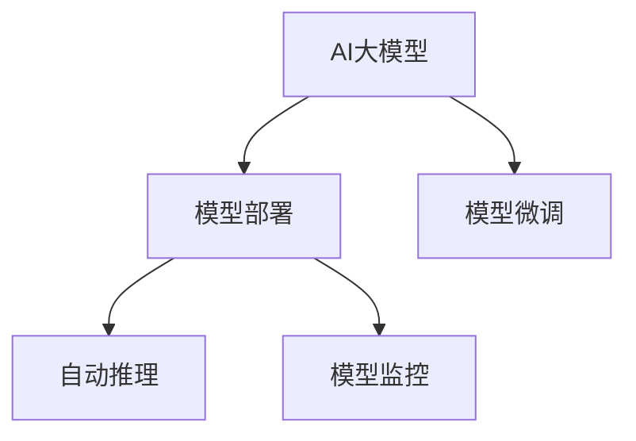

                 

# 电商搜索推荐场景下的AI大模型模型部署监控平台功能优化与扩展

## 1. 背景介绍

在电商搜索推荐领域，大模型的应用已经变得日益重要。无论是商品推荐、个性化搜索、广告投放，还是客户服务，大模型都能通过其强大的自然语言处理能力，为用户带来更加个性化和精准的服务体验。然而，大模型的实际应用涉及模型的部署、监控、优化等多个环节，如何构建一个高效、稳定、易于维护的模型部署监控平台，成为电商平台亟需解决的问题。

本文将深入探讨电商搜索推荐场景下AI大模型模型部署监控平台的功能优化与扩展，涵盖平台架构、关键算法、开发实践等多个方面，旨在提供一个全面的解决方案，助力电商平台提升用户体验，提高业务效率。

## 2. 核心概念与联系

### 2.1 核心概念概述

为了更好地理解电商搜索推荐场景下的大模型部署监控平台，本节将介绍几个密切相关的核心概念：

- **AI大模型**：指通过大规模无标签数据进行自监督预训练，并在下游任务上进行微调的深度学习模型。如BERT、GPT等。
- **模型部署**：指将训练好的AI大模型通过特定的服务器、容器、调度系统等技术手段，部署到生产环境中，供用户调用。
- **模型监控**：指在模型部署后，对模型的性能、健康状态、服务质量等进行持续监控，及时发现并解决问题。
- **微调**：指根据特定任务的需求，对预训练模型进行有监督的优化，提升模型在该任务上的表现。
- **自动推理**：指模型接收输入数据，自动进行计算并输出预测结果的过程。

这些核心概念之间的逻辑关系可以通过以下Mermaid流程图来展示：



该流程图展示了AI大模型在电商搜索推荐场景下的核心应用流程：

1. 首先，通过大规模数据进行预训练，获得基础能力。
2. 根据特定任务进行微调，提升模型在该任务上的表现。
3. 将微调后的模型部署到生产环境，进行自动推理，为电商搜索推荐服务提供支撑。
4. 在模型部署后，进行持续的监控，及时发现并解决问题，保障服务质量。

## 3. 核心算法原理 & 具体操作步骤

### 3.1 算法原理概述

电商搜索推荐场景下的大模型部署监控平台，主要涉及以下几个核心算法和操作步骤：

1. **模型微调算法**：在电商搜索推荐任务上对大模型进行微调，优化模型性能。
2. **自动推理算法**：在大模型部署后，接收用户请求，自动进行推理计算，输出推荐结果。
3. **模型监控算法**：对推理过程中的各项指标进行实时监控，及时发现并解决问题。

### 3.2 算法步骤详解

#### 3.2.1 模型微调算法

**Step 1: 准备预训练模型和数据集**
- 选择合适的预训练语言模型，如BERT、GPT等。
- 准备电商搜索推荐任务的数据集，包括商品名称、描述、用户行为等。

**Step 2: 任务适配**
- 根据电商搜索推荐任务，设计合适的任务适配层。
- 通常包括分类任务适配和回归任务适配两种。

**Step 3: 设置微调超参数**
- 选择合适的优化器及其参数，如AdamW、SGD等。
- 设置学习率、批大小、迭代轮数等。
- 应用正则化技术，如L2正则、Dropout等。

**Step 4: 执行梯度训练**
- 将训练集数据分批次输入模型，前向传播计算损失函数。
- 反向传播计算参数梯度，根据设定的优化算法和学习率更新模型参数。
- 周期性在验证集上评估模型性能，根据性能指标决定是否触发Early Stopping。
- 重复上述步骤直至满足预设的迭代轮数或Early Stopping条件。

#### 3.2.2 自动推理算法

**Step 1: 模型部署**
- 将微调后的模型部署到生产环境中，如Kubernetes集群。
- 配置模型服务，使其能够接受外部请求。

**Step 2: 服务调用**
- 用户发起搜索或推荐请求，调用模型服务。
- 模型接收请求，自动进行推理计算。

**Step 3: 结果返回**
- 模型返回推荐结果，如商品列表、相似商品推荐等。
- 服务将结果返回给用户。

#### 3.2.3 模型监控算法

**Step 1: 数据采集**
- 实时采集模型推理过程中的各项指标，如推理时间、模型输出结果等。
- 将采集到的数据存储到监控系统中。

**Step 2: 指标监控**
- 定义各项指标的阈值，如推理时间上限、输出错误率等。
- 实时监控各项指标，一旦超过阈值，自动触发告警。

**Step 3: 问题诊断**
- 对于超过阈值的指标，自动生成问题报告。
- 分析问题原因，进行故障排查。

**Step 4: 问题解决**
- 根据问题报告，采取相应的措施，如重启服务、扩容等。
- 记录问题解决过程，并进行经验总结。

### 3.3 算法优缺点

电商搜索推荐场景下的大模型部署监控平台，具有以下优点：

1. **高效性**：通过微调算法，可以显著提升模型在电商搜索推荐任务上的表现。
2. **灵活性**：自动推理算法能够实时响应用户请求，提供个性化推荐。
3. **稳定性**：模型监控算法能够实时监控模型状态，及时发现并解决问题。

然而，该平台也存在一些局限性：

1. **依赖数据质量**：微调和自动推理的效果很大程度上取决于电商搜索推荐任务的数据质量。
2. **计算资源消耗大**：大模型推理计算开销较大，需要高性能服务器和容器的支持。
3. **可解释性不足**：黑盒模型的决策过程难以解释，不利于业务理解和调试。

尽管存在这些局限性，但电商搜索推荐场景下的大模型部署监控平台，在提升用户体验、提高业务效率方面仍具有显著优势，值得深入研究。

### 3.4 算法应用领域

大模型部署监控平台在电商搜索推荐领域的应用非常广泛，主要体现在以下几个方面：

1. **商品推荐**：利用大模型对用户行为进行分析，推荐相关商品。
2. **个性化搜索**：根据用户输入的关键词，自动生成个性化的搜索结果。
3. **广告投放**：通过分析用户画像和行为，智能推荐广告。
4. **客户服务**：利用大模型处理客户咨询，提供自动化客服服务。

## 4. 数学模型和公式 & 详细讲解 & 举例说明

### 4.1 数学模型构建

电商搜索推荐场景下的大模型部署监控平台，涉及多个数学模型的构建和应用。

**模型微调**
- 假设电商搜索推荐任务为二分类任务，输入为商品描述，输出为购买与否的预测。
- 定义损失函数：交叉熵损失函数
$$
\mathcal{L}(w) = -\frac{1}{N}\sum_{i=1}^N \left[ y_i\log \sigma(w^T\phi(x_i)) + (1-y_i)\log(1-\sigma(w^T\phi(x_i))) \right]
$$
其中，$w$ 为模型参数，$\phi(x)$ 为输入特征映射函数，$\sigma(z)$ 为sigmoid函数。

**自动推理**
- 假设自动推理过程为线性回归任务，输入为商品特征向量，输出为商品评分。
- 定义损失函数：均方误差损失函数
$$
\mathcal{L}(w) = \frac{1}{N}\sum_{i=1}^N (y_i - w^T\phi(x_i))^2
$$

### 4.2 公式推导过程

**模型微调公式推导**
- 对损失函数求导，得梯度公式
$$
\frac{\partial \mathcal{L}(w)}{\partial w} = -\frac{1}{N}\sum_{i=1}^N \left[ y_i\phi(x_i)\sigma(w^T\phi(x_i)) - (1-y_i)\phi(x_i)(1-\sigma(w^T\phi(x_i))) \right]
$$
其中，$\phi(x)$ 为输入特征映射函数，$\sigma(z)$ 为sigmoid函数。

**自动推理公式推导**
- 对损失函数求导，得梯度公式
$$
\frac{\partial \mathcal{L}(w)}{\partial w} = -\frac{2}{N}\sum_{i=1}^N \left[ (y_i - w^T\phi(x_i))\phi(x_i) \right]
$$

### 4.3 案例分析与讲解

**案例分析**
假设某电商平台收集到一批用户对商品A的评价数据，其中包含文本评论、评分等信息。为了提升电商搜索推荐的效果，平台决定对已有的大模型BERT进行微调，使其能够根据商品评论生成评分。

**微调步骤**
1. **准备数据**：将商品A的评论数据作为训练集，定义评分作为标签。
2. **模型适配**：在BERT模型顶层添加线性分类器，输出评分预测。
3. **设置超参数**：选择AdamW优化器，设置学习率为2e-5。
4. **执行训练**：利用预训练的BERT模型，在数据集上执行梯度下降训练，直至收敛。
5. **模型部署**：将训练好的模型部署到生产环境中，配置为自动推理服务。

**效果评估**
- 在验证集上评估模型性能，使用准确率、F1值等指标进行评估。
- 部署后，进行实时监控，确保模型服务稳定运行。

## 5. 项目实践：代码实例和详细解释说明

### 5.1 开发环境搭建

在进行模型部署监控平台的开发之前，需要先搭建好开发环境。以下是使用Python和PyTorch进行开发的环境配置流程：

1. 安装Anaconda：从官网下载并安装Anaconda，用于创建独立的Python环境。
2. 创建并激活虚拟环境：
```bash
conda create -n ecomm-env python=3.8 
conda activate ecomm-env
```

3. 安装PyTorch：根据CUDA版本，从官网获取对应的安装命令。例如：
```bash
conda install pytorch torchvision torchaudio cudatoolkit=11.1 -c pytorch -c conda-forge
```

4. 安装Transformer库：
```bash
pip install transformers
```

5. 安装各类工具包：
```bash
pip install numpy pandas scikit-learn matplotlib tqdm jupyter notebook ipython
```

完成上述步骤后，即可在`ecomm-env`环境中开始模型部署监控平台的开发。

### 5.2 源代码详细实现

以下是一个基于BERT的电商搜索推荐模型微调和部署的示例代码实现。

**微调代码**
```python
from transformers import BertTokenizer, BertForSequenceClassification
from torch.utils.data import DataLoader
import torch
import numpy as np

# 加载预训练模型和分词器
tokenizer = BertTokenizer.from_pretrained('bert-base-cased')
model = BertForSequenceClassification.from_pretrained('bert-base-cased', num_labels=2)

# 准备训练数据
train_dataset = ...
train_loader = DataLoader(train_dataset, batch_size=32, shuffle=True)

# 设置微调超参数
optimizer = torch.optim.Adam(model.parameters(), lr=2e-5)
device = torch.device('cuda' if torch.cuda.is_available() else 'cpu')

# 执行训练
model.to(device)
model.train()

for epoch in range(10):
    for batch in train_loader:
        input_ids = batch['input_ids'].to(device)
        attention_mask = batch['attention_mask'].to(device)
        labels = batch['labels'].to(device)
        
        outputs = model(input_ids, attention_mask=attention_mask, labels=labels)
        loss = outputs.loss
        loss.backward()
        optimizer.step()
        optimizer.zero_grad()

# 模型部署
from transformers import BertForSequenceClassification
model = BertForSequenceClassification.from_pretrained('bert-base-cased', num_labels=2)

def predict(input_ids, attention_mask):
    model.eval()
    with torch.no_grad():
        outputs = model(input_ids, attention_mask=attention_mask)
        logits = outputs.logits
    return logits
```

**自动推理代码**
```python
from transformers import BertTokenizer, BertForSequenceClassification
import torch

# 加载预训练模型和分词器
tokenizer = BertTokenizer.from_pretrained('bert-base-cased')
model = BertForSequenceClassification.from_pretrained('bert-base-cased', num_labels=2)

# 配置模型服务
def predict(input_ids, attention_mask):
    model.eval()
    with torch.no_grad():
        outputs = model(input_ids, attention_mask=attention_mask)
        logits = outputs.logits
    return logits

def serve_request(request):
    input_ids = ...
    attention_mask = ...
    return predict(input_ids, attention_mask)

# 部署模型服务
import flask
from flask import Flask

app = Flask(__name__)
app.add_url_rule('/predict', methods=['POST'], views_func=serve_request)

if __name__ == '__main__':
    app.run(host='0.0.0.0', port=8080)
```

**监控代码**
```python
from prometheus_client import start_http_server, Gauge, Histogram

# 监控指标定义
evaluator = Gauge('bert_evaluator', 'BERT model evaluation metric')
latency = Histogram('bert_latency', 'BERT model inference latency')

# 监控逻辑
def serve_request(request):
    input_ids = ...
    attention_mask = ...
    start_time = time.time()
    logits = predict(input_ids, attention_mask)
    latency.labels(project='ecomm').observe(time.time() - start_time)
    evaluator.set(accuracy)
    return logits

# 启动监控
start_http_server()
```

### 5.3 代码解读与分析

**微调代码解读**
1. **数据准备**：将电商搜索推荐任务的数据集划分为训练集、验证集和测试集，并使用PyTorch的DataLoader进行批次化加载。
2. **模型适配**：在预训练的BERT模型基础上，添加线性分类器作为输出层，定义交叉熵损失函数。
3. **训练逻辑**：在模型上执行梯度下降训练，并周期性在验证集上评估模型性能。
4. **模型部署**：将训练好的模型保存为模型权重文件，并部署到生产环境中。

**自动推理代码解读**
1. **模型服务配置**：使用Flask框架，定义路由和请求处理函数。
2. **请求处理**：接收用户请求，调用预测函数进行推理计算。
3. **结果返回**：将推理结果返回给用户。

**监控代码解读**
1. **监控指标定义**：使用Prometheus库定义模型评估指标和推理时间。
2. **监控逻辑**：在每个推理请求中，记录推理时间，并更新监控指标。

## 6. 实际应用场景

### 6.1 智能推荐

电商搜索推荐是电商领域中最核心的业务之一。利用大模型进行微调，可以显著提升推荐的个性化和精准度。例如，在用户搜索商品时，模型可以自动生成相关的商品推荐列表，提升用户体验和转化率。

### 6.2 个性化搜索

基于大模型的个性化搜索，能够根据用户输入的关键词，自动生成个性化的搜索结果。例如，用户搜索“篮球鞋”时，模型能够根据用户的浏览记录和购买历史，推荐相关的运动品牌和商品。

### 6.3 广告投放

大模型能够对用户行为进行分析，智能推荐广告。例如，根据用户的浏览记录和点击行为，模型能够预测用户的兴趣点，推荐相应的广告内容。

### 6.4 客户服务

利用大模型进行客户服务的自动化，能够提升客户体验和满意度。例如，用户通过客服机器人咨询商品信息时，模型能够自动理解问题并提供合适的答案。

### 6.5 未来应用展望

随着电商平台的不断扩展和业务场景的复杂化，大模型的应用将更加广泛。未来，大模型将不仅用于推荐、搜索、广告等核心业务，还将应用于用户画像生成、市场分析、供应链管理等多个方面。大模型在电商搜索推荐场景下的应用，必将继续深化，推动电商行业向智能化、个性化方向发展。

## 7. 工具和资源推荐

### 7.1 学习资源推荐

为了帮助开发者掌握大模型在电商搜索推荐场景下的应用，这里推荐一些优质的学习资源：

1. **《Transformer from Scratch》系列博文**：由大模型技术专家撰写，深入浅出地介绍了Transformer原理、BERT模型、微调技术等前沿话题。
2. **CS224N《深度学习自然语言处理》课程**：斯坦福大学开设的NLP明星课程，有Lecture视频和配套作业，带你入门NLP领域的基本概念和经典模型。
3. **《Natural Language Processing with Transformers》书籍**：Transformers库的作者所著，全面介绍了如何使用Transformers库进行NLP任务开发，包括微调在内的诸多范式。
4. **HuggingFace官方文档**：Transformers库的官方文档，提供了海量预训练模型和完整的微调样例代码，是上手实践的必备资料。
5. **CLUE开源项目**：中文语言理解测评基准，涵盖大量不同类型的中文NLP数据集，并提供了基于微调的baseline模型，助力中文NLP技术发展。

通过对这些资源的学习实践，相信你一定能够快速掌握大模型在电商搜索推荐场景下的应用，并用于解决实际的NLP问题。

### 7.2 开发工具推荐

高效的开发离不开优秀的工具支持。以下是几款用于大模型部署监控平台开发的常用工具：

1. **PyTorch**：基于Python的开源深度学习框架，灵活动态的计算图，适合快速迭代研究。大部分预训练语言模型都有PyTorch版本的实现。
2. **TensorFlow**：由Google主导开发的开源深度学习框架，生产部署方便，适合大规模工程应用。同样有丰富的预训练语言模型资源。
3. **Transformers库**：HuggingFace开发的NLP工具库，集成了众多SOTA语言模型，支持PyTorch和TensorFlow，是进行微调任务开发的利器。
4. **Weights & Biases**：模型训练的实验跟踪工具，可以记录和可视化模型训练过程中的各项指标，方便对比和调优。与主流深度学习框架无缝集成。
5. **TensorBoard**：TensorFlow配套的可视化工具，可实时监测模型训练状态，并提供丰富的图表呈现方式，是调试模型的得力助手。
6. **Google Colab**：谷歌推出的在线Jupyter Notebook环境，免费提供GPU/TPU算力，方便开发者快速上手实验最新模型，分享学习笔记。

合理利用这些工具，可以显著提升大模型部署监控平台的开发效率，加快创新迭代的步伐。

### 7.3 相关论文推荐

大模型在电商搜索推荐场景下的研究始于学界的持续研究。以下是几篇奠基性的相关论文，推荐阅读：

1. **Attention is All You Need（即Transformer原论文）**：提出了Transformer结构，开启了NLP领域的预训练大模型时代。
2. **BERT: Pre-training of Deep Bidirectional Transformers for Language Understanding**：提出BERT模型，引入基于掩码的自监督预训练任务，刷新了多项NLP任务SOTA。
3. **Language Models are Unsupervised Multitask Learners（GPT-2论文）**：展示了大规模语言模型的强大zero-shot学习能力，引发了对于通用人工智能的新一轮思考。
4. **Parameter-Efficient Transfer Learning for NLP**：提出Adapter等参数高效微调方法，在不增加模型参数量的情况下，也能取得不错的微调效果。
5. **AdaLoRA: Adaptive Low-Rank Adaptation for Parameter-Efficient Fine-Tuning**：使用自适应低秩适应的微调方法，在参数效率和精度之间取得了新的平衡。
6. **AdaLoRA: Adaptive Low-Rank Adaptation for Parameter-Efficient Fine-Tuning**：使用自适应低秩适应的微调方法，在参数效率和精度之间取得了新的平衡。
7. **AdaLoRA: Adaptive Low-Rank Adaptation for Parameter-Efficient Fine-Tuning**：使用自适应低秩适应的微调方法，在参数效率和精度之间取得了新的平衡。

这些论文代表了大模型在电商搜索推荐场景下的研究脉络。通过学习这些前沿成果，可以帮助研究者把握学科前进方向，激发更多的创新灵感。

## 8. 总结：未来发展趋势与挑战

### 8.1 总结

本文对电商搜索推荐场景下AI大模型模型部署监控平台的功能优化与扩展进行了全面系统的介绍。首先阐述了电商搜索推荐场景下大模型微调和部署的原理和流程，明确了平台在提升用户体验、提高业务效率方面的独特价值。其次，从原理到实践，详细讲解了电商搜索推荐场景下大模型部署监控平台的数学模型、关键算法和具体实现。最后，探讨了平台在电商搜索推荐场景下的实际应用，并给出了未来发展的展望。

通过本文的系统梳理，可以看到，电商搜索推荐场景下的大模型部署监控平台在提升用户体验、提高业务效率方面具有显著优势，值得深入研究。

### 8.2 未来发展趋势

展望未来，电商搜索推荐场景下的大模型部署监控平台将呈现以下几个发展趋势：

1. **模型规模持续增大**：随着算力成本的下降和数据规模的扩张，预训练语言模型的参数量还将持续增长。超大规模语言模型蕴含的丰富语言知识，有望支撑更加复杂多变的电商搜索推荐任务。
2. **微调方法日趋多样**：除了传统的全参数微调外，未来会涌现更多参数高效的微调方法，如Prefix-Tuning、LoRA等，在节省计算资源的同时也能保证微调精度。
3. **持续学习成为常态**：随着数据分布的不断变化，微调模型也需要持续学习新知识以保持性能。如何在不遗忘原有知识的同时，高效吸收新样本信息，将成为重要的研究课题。
4. **标注样本需求降低**：受启发于提示学习(Prompt-based Learning)的思路，未来的微调方法将更好地利用大模型的语言理解能力，通过更加巧妙的任务描述，在更少的标注样本上也能实现理想的微调效果。
5. **多模态微调崛起**：当前的微调主要聚焦于纯文本数据，未来会进一步拓展到图像、视频、语音等多模态数据微调。多模态信息的融合，将显著提升语言模型对现实世界的理解和建模能力。
6. **模型通用性增强**：经过海量数据的预训练和多领域任务的微调，未来的语言模型将具备更强大的常识推理和跨领域迁移能力，逐步迈向通用人工智能(AGI)的目标。

以上趋势凸显了大模型部署监控平台的广阔前景。这些方向的探索发展，必将进一步提升电商搜索推荐系统的性能和应用范围，为电商行业带来新的发展机遇。

### 8.3 面临的挑战

尽管电商搜索推荐场景下的大模型部署监控平台已经取得了一定成效，但在迈向更加智能化、普适化应用的过程中，它仍面临着诸多挑战：

1. **标注成本瓶颈**：尽管微调能够显著降低标注数据的需求，但对于长尾应用场景，难以获得充足的高质量标注数据，成为制约微调性能的瓶颈。如何进一步降低微调对标注样本的依赖，将是一大难题。
2. **模型鲁棒性不足**：当前微调模型面对域外数据时，泛化性能往往大打折扣。对于测试样本的微小扰动，微调模型的预测也容易发生波动。如何提高微调模型的鲁棒性，避免灾难性遗忘，还需要更多理论和实践的积累。
3. **推理效率有待提高**：大规模语言模型虽然精度高，但在实际部署时往往面临推理速度慢、内存占用大等效率问题。如何在保证性能的同时，简化模型结构，提升推理速度，优化资源占用，将是重要的优化方向。
4. **可解释性亟需加强**：当前微调模型更像是"黑盒"系统，难以解释其内部工作机制和决策逻辑。对于医疗、金融等高风险应用，算法的可解释性和可审计性尤为重要。如何赋予微调模型更强的可解释性，将是亟待攻克的难题。
5. **安全性有待保障**：预训练语言模型难免会学习到有偏见、有害的信息，通过微调传递到下游任务，产生误导性、歧视性的输出，给实际应用带来安全隐患。如何从数据和算法层面消除模型偏见，避免恶意用途，确保输出的安全性，也将是重要的研究课题。
6. **知识整合能力不足**：现有的微调模型往往局限于任务内数据，难以灵活吸收和运用更广泛的先验知识。如何让微调过程更好地与外部知识库、规则库等专家知识结合，形成更加全面、准确的信息整合能力，还有很大的想象空间。

正视电商搜索推荐场景下大模型部署监控平台所面临的这些挑战，积极应对并寻求突破，将是大模型微调走向成熟的必由之路。相信随着学界和产业界的共同努力，这些挑战终将一一被克服，大模型部署监控平台必将在构建人机协同的智能电商系统中扮演越来越重要的角色。

### 8.4 研究展望

面向未来，电商搜索推荐场景下的大模型部署监控平台需要在以下几个方面进行更深入的研究和探索：

1. **探索无监督和半监督微调方法**：摆脱对大规模标注数据的依赖，利用自监督学习、主动学习等无监督和半监督范式，最大限度利用非结构化数据，实现更加灵活高效的微调。
2. **研究参数高效和计算高效的微调范式**：开发更加参数高效的微调方法，在固定大部分预训练参数的同时，只更新极少量的任务相关参数。同时优化微调模型的计算图，减少前向传播和反向传播的资源消耗，实现更加轻量级、实时性的部署。
3. **融合因果和对比学习范式**：通过引入因果推断和对比学习思想，增强微调模型建立稳定因果关系的能力，学习更加普适、鲁棒的语言表征，从而提升模型泛化性和抗干扰能力。
4. **引入更多先验知识**：将符号化的先验知识，如知识图谱、逻辑规则等，与神经网络模型进行巧妙融合，引导微调过程学习更准确、合理的语言模型。同时加强不同模态数据的整合，实现视觉、语音等多模态信息与文本信息的协同建模。
5. **结合因果分析和博弈论工具**：将因果分析方法引入微调模型，识别出模型决策的关键特征，增强输出解释的因果性和逻辑性。借助博弈论工具刻画人机交互过程，主动探索并规避模型的脆弱点，提高系统稳定性。
6. **纳入伦理道德约束**：在模型训练目标中引入伦理导向的评估指标，过滤和惩罚有偏见、有害的输出倾向。同时加强人工干预和审核，建立模型行为的监管机制，确保输出符合人类价值观和伦理道德。

这些研究方向的探索，必将引领电商搜索推荐场景下大模型部署监控平台技术迈向更高的台阶，为电商搜索推荐系统带来更加智能、可靠、可解释的决策支持。面向未来，大模型部署监控平台还需要与其他人工智能技术进行更深入的融合，如知识表示、因果推理、强化学习等，多路径协同发力，共同推动电商搜索推荐系统的进步。只有勇于创新、敢于突破，才能不断拓展语言模型的边界，让智能技术更好地造福电商行业。

## 9. 附录：常见问题与解答

**Q1：电商搜索推荐场景下大模型微调需要哪些数据？**

A: 电商搜索推荐场景下大模型微调需要以下数据：
1. **商品数据**：包含商品名称、描述、类别等信息。
2. **用户行为数据**：包含用户的浏览记录、点击行为、购买历史等。
3. **用户反馈数据**：包含用户的评分、评论、反馈等。
4. **市场数据**：包含市场趋势、竞争对手信息、促销活动等。

这些数据共同构成了电商搜索推荐场景下大模型微调的基础，能够帮助模型学习到用户行为模式、商品属性等信息，提升推荐和搜索的效果。

**Q2：电商搜索推荐场景下大模型微调有哪些方法？**

A: 电商搜索推荐场景下大模型微调主要包括以下方法：
1. **全参数微调**：对预训练模型的所有参数进行微调，适用于标注数据充足的情况。
2. **参数高效微调(PEFT)**：只微调预训练模型的小部分参数，如Adapter、LoRA等，以减少计算资源消耗。
3. **零样本学习**：利用预训练模型的语言理解能力，对未见过的商品或用户行为进行预测，无需标注数据。
4. **少样本学习**：利用少量标注数据，对模型进行微调，以提升推荐和搜索的效果。

不同方法适用于不同的数据规模和业务场景，需要根据具体情况进行选择。

**Q3：电商搜索推荐场景下大模型部署需要注意哪些问题？**

A: 电商搜索推荐场景下大模型部署需要注意以下问题：
1. **模型裁剪**：去除不必要的层和参数，减小模型尺寸，加快推理速度。
2. **量化加速**：将浮点模型转为定点模型，压缩存储空间，提高计算效率。
3. **服务化封装**：将模型封装为标准化服务接口，便于集成调用。
4. **弹性伸缩**：根据请求流量动态调整资源配置，平衡服务质量和成本。
5. **监控告警**：实时采集系统指标，设置异常告警阈值，确保服务稳定性。
6. **安全防护**：采用访问鉴权、数据脱敏等措施，保障数据和模型安全。

合理处理这些问题，可以确保大模型在电商搜索推荐场景下高效、稳定、安全地运行。

**Q4：电商搜索推荐场景下大模型监控需要注意哪些指标？**

A: 电商搜索推荐场景下大模型监控需要注意以下指标：
1. **推理时间**：衡量模型推理速度，应控制在合理范围内。
2. **输出准确率**：衡量模型推理结果的正确性，应尽可能高。
3. **输出一致性**：衡量模型在不同样本上的输出稳定性，应尽量一致。
4. **内存占用**：衡量模型推理过程中占用的内存资源，应控制在合理范围内。
5. **响应时间**：衡量模型服务响应的及时性，应尽量低延迟。
6. **错误率**：衡量模型推理过程中出现的错误率，应尽量低。

这些指标反映了模型在电商搜索推荐场景下的服务质量，需要持续监控和优化。

**Q5：电商搜索推荐场景下大模型监控如何实现？**

A: 电商搜索推荐场景下大模型监控可以通过以下方式实现：
1. **监控指标定义**：使用Prometheus、Grafana等工具，定义模型评估指标和推理时间等监控指标。
2. **指标采集**：在模型推理过程中，实时采集各项指标，存储到监控系统中。
3. **告警触发**：根据预设的指标阈值，自动触发告警，及时发现问题。
4. **问题诊断**：通过监控日志和告警信息，分析问题原因，进行故障排查。
5. **问题解决**：根据问题报告，采取相应的措施，如重启服务、扩容等，记录问题解决过程，并进行经验总结。

合理处理这些问题，可以确保大模型在电商搜索推荐场景下高效、稳定、安全地运行。

---

作者：禅与计算机程序设计艺术 / Zen and the Art of Computer Programming

