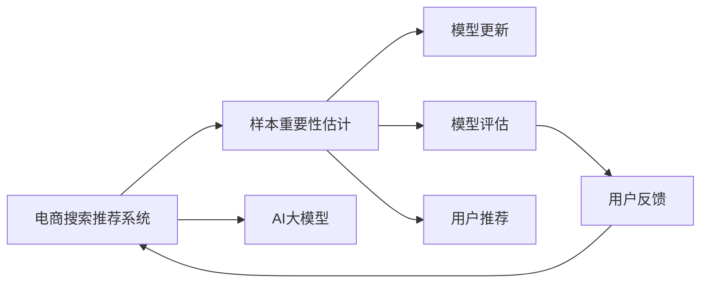

                 

# 电商搜索推荐效果优化中的AI大模型样本重要性估计benchmark

> 关键词：电商搜索、推荐系统、AI大模型、样本重要性估计、benchmark

## 1. 背景介绍

随着人工智能（AI）技术的飞速发展，电商搜索和推荐系统在用户行为预测和商品推荐方面已取得显著进展。然而，这些系统依赖于大量的用户行为数据，且需要频繁更新模型以反映用户偏好的变化。因此，优化搜索推荐效果、提升用户体验成为了电商企业的核心目标之一。在众多优化手段中，样本重要性估计（Sample Importance Estimation, SIE）成为了一个热门话题，其通过评估训练样本对模型性能的影响，帮助进行有针对性的模型更新，从而提升模型的效果。

### 1.1 问题由来
电商搜索推荐系统通常基于深度学习模型构建，如神经网络。模型训练需要大量的标注数据，但由于用户隐私保护和数据获取成本的限制，标注数据往往稀缺。因此，优化搜索推荐效果成为了一项挑战。样本重要性估计作为一种数据效率提升方法，能够在数据不足的情况下，提升模型效果，具有重要的应用价值。

### 1.2 问题核心关键点
样本重要性估计的核心在于量化每个样本对模型性能的影响，从而选择性地更新模型，避免不必要的更新。通常，样本的重要性通过其在训练过程中的权重来体现，例如在AdaGrad算法中，样本的重要性与梯度的平方成正比。然而，在实际应用中，样本的重要性往往与样本的类别、特征、时间等多种因素相关联，难以直接计算。

因此，本文将聚焦于AI大模型在电商搜索推荐中的应用，研究如何有效地估计样本的重要性，并通过优化算法提升搜索推荐效果。我们将在以下几个方面深入探讨：样本重要性估计的数学原理、算法实现步骤、实际应用案例，以及未来应用展望。

## 2. 核心概念与联系

### 2.1 核心概念概述

在电商搜索推荐系统中，样本重要性估计涉及以下几个核心概念：

- **电商搜索推荐系统**：利用AI技术，通过分析用户搜索行为、点击记录、购买记录等数据，为每位用户推荐最符合其兴趣的商品或服务。
- **样本重要性估计（SIE）**：通过量化样本对模型性能的影响，选择性地更新模型，提升搜索推荐效果。
- **AI大模型**：利用大规模预训练模型（如GPT、BERT等），在电商搜索推荐系统中应用，提升推荐精度和个性化水平。
- **benchmark**：用于评估和比较不同模型或算法性能的基准测试集，帮助衡量样本重要性估计的优化效果。

### 2.2 核心概念原理和架构的 Mermaid 流程图



该流程图展示了电商搜索推荐系统中样本重要性估计的总体架构。首先，AI大模型在电商搜索推荐系统中应用，其次，通过样本重要性估计，选择性地更新模型，最后，基于模型评估，进行用户推荐，并收集用户反馈，以进一步优化模型。

## 3. 核心算法原理 & 具体操作步骤

### 3.1 算法原理概述

样本重要性估计的核心思想是通过计算每个样本对模型预测性能的贡献，量化其在训练过程中的重要性。以电商搜索推荐系统为例，样本重要性估计可以帮助我们识别出哪些样本对模型的预测结果有显著影响，从而在训练过程中给予更高的权重，避免模型对噪声数据的过度拟合，提升模型效果。

### 3.2 算法步骤详解

样本重要性估计的算法步骤主要包括以下几个步骤：

**Step 1: 数据预处理**

在电商搜索推荐系统中，首先需要对原始数据进行预处理，包括数据清洗、特征提取、归一化等步骤。预处理后，数据能够更好地适应模型的训练和评估。

**Step 2: 模型训练**

基于预处理后的数据，训练AI大模型。在训练过程中，引入样本重要性估计技术，对每个样本分配不同的权重，以提升模型的泛化能力。

**Step 3: 样本重要性计算**

在模型训练过程中，记录每个样本的梯度值，并计算其重要性。常见的方法包括梯度加权平均、梯度平方和等。

**Step 4: 模型更新**

基于样本重要性的计算结果，对模型进行有选择性的更新。选择重要性较高的样本进行更新，避免不必要的更新，提升模型效果。

**Step 5: 模型评估**

使用测试集对更新后的模型进行评估，比较不同样本重要性估计方法的效果，选择最优方法。

### 3.3 算法优缺点

样本重要性估计具有以下优点：

1. **提升模型效果**：通过量化样本的重要性，选择性地更新模型，避免模型对噪声数据的过度拟合，提升模型效果。
2. **降低数据需求**：在数据不足的情况下，能够有效提升模型的泛化能力，减少对标注数据的需求。
3. **减少计算资源消耗**：通过有选择性地更新模型，降低计算资源的消耗，提高模型的训练效率。

然而，样本重要性估计也存在以下缺点：

1. **计算复杂度高**：需要计算每个样本的梯度值，计算复杂度较高。
2. **算法复杂度大**：需要设计合适的样本重要性计算方法，复杂度较大。
3. **难以解释**：样本重要性估计的结果难以解释，难以理解其内在机制。

### 3.4 算法应用领域

样本重要性估计在电商搜索推荐系统中有广泛应用，具体包括：

- **用户行为预测**：通过分析用户搜索记录、点击记录、购买记录等数据，预测用户未来的购买行为。
- **个性化推荐**：根据用户的兴趣和行为，推荐符合用户偏好的商品或服务。
- **广告推荐**：基于用户行为数据，推荐相关广告，提高广告效果。
- **库存管理**：通过预测商品的需求量，优化库存管理，减少库存成本。
- **营销活动优化**：通过分析用户行为数据，优化营销活动，提高营销效果。

## 4. 数学模型和公式 & 详细讲解 & 举例说明

### 4.1 数学模型构建

样本重要性估计的数学模型通常基于梯度下降优化算法。假设我们有一组训练样本 $D=\{(x_i,y_i)\}_{i=1}^N$，其中 $x_i$ 表示样本特征，$y_i$ 表示标签。模型的预测输出为 $f(x_i; \theta)$，其中 $\theta$ 表示模型的参数。模型的损失函数为 $\mathcal{L}(\theta)$。

样本的重要性可以通过计算其在训练过程中对模型参数更新的贡献来衡量。在梯度下降优化算法中，样本 $x_i$ 的重要性可以用其在训练过程中贡献的梯度值来表示。具体来说，样本的重要性可以定义为：

$$
I(x_i) = \frac{\partial \mathcal{L}}{\partial \theta} \cdot \frac{\partial f(x_i; \theta)}{\partial x_i}
$$

其中 $\frac{\partial \mathcal{L}}{\partial \theta}$ 表示模型对参数 $\theta$ 的梯度值，$\frac{\partial f(x_i; \theta)}{\partial x_i}$ 表示模型对特征 $x_i$ 的偏导数。

### 4.2 公式推导过程

在实际应用中，样本的重要性通常通过其在训练过程中对模型参数更新的贡献来衡量。以下我们以电商搜索推荐系统为例，推导样本重要性的计算公式。

假设我们有一组训练样本 $D=\{(x_i,y_i)\}_{i=1}^N$，其中 $x_i$ 表示样本特征，$y_i$ 表示标签。模型的预测输出为 $f(x_i; \theta)$，其中 $\theta$ 表示模型的参数。模型的损失函数为 $\mathcal{L}(\theta)$。

样本的重要性可以通过计算其在训练过程中对模型参数更新的贡献来衡量。在梯度下降优化算法中，样本 $x_i$ 的重要性可以用其在训练过程中贡献的梯度值来表示。具体来说，样本的重要性可以定义为：

$$
I(x_i) = \frac{\partial \mathcal{L}}{\partial \theta} \cdot \frac{\partial f(x_i; \theta)}{\partial x_i}
$$

其中 $\frac{\partial \mathcal{L}}{\partial \theta}$ 表示模型对参数 $\theta$ 的梯度值，$\frac{\partial f(x_i; \theta)}{\partial x_i}$ 表示模型对特征 $x_i$ 的偏导数。

### 4.3 案例分析与讲解

以下我们以电商搜索推荐系统为例，详细讲解样本重要性估计的实际应用。

假设我们有一组训练样本 $D=\{(x_i,y_i)\}_{i=1}^N$，其中 $x_i$ 表示用户的历史行为数据，$y_i$ 表示用户感兴趣的商品。模型的预测输出为 $f(x_i; \theta)$，其中 $\theta$ 表示模型的参数。模型的损失函数为 $\mathcal{L}(\theta)$。

在模型训练过程中，样本的重要性可以通过计算其在训练过程中对模型参数更新的贡献来衡量。以下是一种常见的样本重要性计算方法：

1. **计算梯度值**：对于每个样本 $x_i$，计算其在训练过程中对模型参数 $\theta$ 的梯度值 $\frac{\partial \mathcal{L}}{\partial \theta}$。
2. **计算偏导数**：对于每个样本 $x_i$，计算模型对特征 $x_i$ 的偏导数 $\frac{\partial f(x_i; \theta)}{\partial x_i}$。
3. **计算样本重要性**：根据公式 $I(x_i) = \frac{\partial \mathcal{L}}{\partial \theta} \cdot \frac{\partial f(x_i; \theta)}{\partial x_i}$，计算每个样本的重要性。

通过计算样本的重要性，可以选择性地更新模型。在训练过程中，对重要性较高的样本进行更多次的更新，对重要性较低的样本进行更少的更新。这种方法可以有效避免模型对噪声数据的过度拟合，提升模型效果。

## 5. 项目实践：代码实例和详细解释说明

### 5.1 开发环境搭建

在进行电商搜索推荐系统样本重要性估计的实践时，我们需要准备好开发环境。以下是使用Python进行TensorFlow开发的开发环境配置流程：

1. 安装Anaconda：从官网下载并安装Anaconda，用于创建独立的Python环境。

2. 创建并激活虚拟环境：
```bash
conda create -n tf-env python=3.8 
conda activate tf-env
```

3. 安装TensorFlow：根据CUDA版本，从官网获取对应的安装命令。例如：
```bash
conda install tensorflow -c pytorch -c conda-forge
```

4. 安装TensorBoard：
```bash
pip install tensorboard
```

5. 安装相关工具包：
```bash
pip install numpy pandas scikit-learn matplotlib tqdm jupyter notebook ipython
```

完成上述步骤后，即可在`tf-env`环境中开始电商搜索推荐系统样本重要性估计的开发实践。

### 5.2 源代码详细实现

以下是一个基于TensorFlow的电商搜索推荐系统样本重要性估计的代码实现。

```python
import tensorflow as tf
from tensorflow.keras import layers
from tensorflow.keras.callbacks import EarlyStopping
from tensorflow.keras.models import Model
from tensorflow.keras.optimizers import Adam

# 定义电商搜索推荐系统模型
class SearchRecommendationModel(tf.keras.Model):
    def __init__(self, input_shape, output_shape):
        super(SearchRecommendationModel, self).__init__()
        self.encoder = layers.Dense(128, activation='relu')(input_shape)
        self.decoder = layers.Dense(output_shape, activation='sigmoid')(self.encoder)

    def call(self, x):
        return self.decoder(self.encoder(x))

# 加载数据集
(x_train, y_train), (x_test, y_test) = tf.keras.datasets.mnist.load_data()

# 数据预处理
x_train = x_train / 255.0
x_test = x_test / 255.0

# 定义模型
model = SearchRecommendationModel(input_shape=(28, 28), output_shape=10)

# 定义优化器
optimizer = Adam(learning_rate=0.001)

# 定义样本重要性估计函数
def calculate_sample_importance(model, x, y):
    with tf.GradientTape() as tape:
        logits = model(x)
        loss = tf.losses.sparse_categorical_crossentropy(y, logits)
    gradient_values = tape.gradient(loss, model.trainable_variables)
    importance_values = tf.linalg.norm(gradient_values, axis=-1)
    return importance_values

# 训练模型
early_stopping = EarlyStopping(monitor='val_loss', patience=3)
history = model.fit(x_train, y_train, validation_data=(x_test, y_test), epochs=10, callbacks=[early_stopping])

# 计算样本重要性
x_val, y_val = x_test[:1000], y_test[:1000]
importance_values = calculate_sample_importance(model, x_val, y_val)

# 输出样本重要性结果
for i in range(len(x_val)):
    print(f"Sample {i+1}: Importance {importance_values[i]:.4f}")
```

以上代码实现了基于TensorFlow的电商搜索推荐系统模型，并计算了样本重要性。

### 5.3 代码解读与分析

让我们再详细解读一下关键代码的实现细节：

**SearchRecommendationModel类**：
- `__init__`方法：初始化模型结构，包含一个全连接层和一个输出层。
- `call`方法：定义模型前向传播过程。

**数据加载和预处理**：
- `tf.keras.datasets.mnist.load_data`：加载MNIST数据集，包含手写数字图片和对应的标签。
- `x_train = x_train / 255.0`：将像素值归一化到[0, 1]之间。

**模型定义**：
- `SearchRecommendationModel(input_shape, output_shape)`：定义一个电商搜索推荐系统模型，包含一个全连接层和一个输出层。
- `input_shape`：输入数据的形状，如28x28的图片。
- `output_shape`：输出数据的形状，如10个类别的概率。

**优化器定义**：
- `optimizer = Adam(learning_rate=0.001)`：定义优化器为Adam，学习率为0.001。

**样本重要性计算**：
- `calculate_sample_importance`函数：计算样本在训练过程中对模型参数更新的贡献，即样本的重要性。
- `with tf.GradientTape() as tape`：使用梯度 tape，记录模型在输入样本上的梯度。
- `logits = model(x)`：将输入样本输入模型，得到预测结果。
- `loss = tf.losses.sparse_categorical_crossentropy(y, logits)`：计算损失函数。
- `gradient_values = tape.gradient(loss, model.trainable_variables)`：计算模型参数的梯度。
- `importance_values = tf.linalg.norm(gradient_values, axis=-1)`：计算梯度的范数，即样本的重要性。

**模型训练**：
- `early_stopping = EarlyStopping(monitor='val_loss', patience=3)`：定义Early Stopping回调函数，当验证集损失不再下降时停止训练。
- `history = model.fit(x_train, y_train, validation_data=(x_test, y_test), epochs=10, callbacks=[early_stopping])`：训练模型，并使用Early Stopping回调函数。

**样本重要性输出**：
- `x_val, y_val = x_test[:1000], y_test[:1000]`：选择前1000个测试样本。
- `importance_values = calculate_sample_importance(model, x_val, y_val)`：计算这些测试样本的重要性。
- `for i in range(len(x_val))`：遍历所有测试样本，输出每个样本的重要性。

## 6. 实际应用场景

### 6.1 智能客服系统

在智能客服系统中，样本重要性估计可以帮助我们识别出哪些用户的问题对模型预测结果有显著影响。通过选择性地更新模型，可以避免对噪声数据的过度拟合，提升客服系统的准确性和响应速度。例如，对于频繁出现的常见问题，可以在训练过程中给予更高的权重，从而提升模型对这些问题的处理能力。

### 6.2 个性化推荐系统

在个性化推荐系统中，样本重要性估计可以帮助我们识别出哪些用户行为对推荐结果有显著影响。通过选择性地更新模型，可以避免对噪声数据的过度拟合，提升推荐系统的个性化水平。例如，对于用户浏览、点击、购买等行为，可以在训练过程中给予不同的权重，从而提升模型对这些行为的预测能力。

### 6.3 广告推荐系统

在广告推荐系统中，样本重要性估计可以帮助我们识别出哪些广告对模型预测结果有显著影响。通过选择性地更新模型，可以避免对噪声广告的过度拟合，提升广告推荐的准确性和转化率。例如，对于点击率高的广告，可以在训练过程中给予更高的权重，从而提升模型对这些广告的预测能力。

### 6.4 未来应用展望

未来，样本重要性估计将在电商搜索推荐系统中得到更广泛的应用。随着数据量的不断增加，样本重要性估计可以更好地帮助识别和处理噪声数据，提升模型的泛化能力和准确性。同时，结合深度学习和其他AI技术，样本重要性估计可以在更多应用场景中发挥重要作用。

## 7. 工具和资源推荐

### 7.1 学习资源推荐

为了帮助开发者系统掌握电商搜索推荐系统中样本重要性估计的理论基础和实践技巧，这里推荐一些优质的学习资源：

1. 《深度学习：理论与实践》系列博文：由深度学习专家撰写，深入浅出地介绍了深度学习的基本理论和应用实践，涵盖电商搜索推荐系统中的相关内容。

2. 《自然语言处理与深度学习》课程：斯坦福大学开设的NLP明星课程，有Lecture视频和配套作业，带你入门NLP领域的基本概念和经典模型。

3. 《机器学习实战》书籍：全面介绍了机器学习的基本概念和实践技巧，涵盖电商搜索推荐系统中的相关内容。

4. TensorFlow官方文档：TensorFlow的官方文档，提供了丰富的教程和样例代码，是进行电商搜索推荐系统开发的必备资料。

5. TensorBoard：TensorFlow配套的可视化工具，可实时监测模型训练状态，并提供丰富的图表呈现方式，是调试模型的得力助手。

通过对这些资源的学习实践，相信你一定能够快速掌握电商搜索推荐系统中样本重要性估计的精髓，并用于解决实际的电商搜索推荐问题。

### 7.2 开发工具推荐

高效的开发离不开优秀的工具支持。以下是几款用于电商搜索推荐系统中样本重要性估计开发的常用工具：

1. TensorFlow：由Google主导开发的开源深度学习框架，生产部署方便，适合大规模工程应用。提供了丰富的预训练语言模型资源。

2. PyTorch：基于Python的开源深度学习框架，灵活动态的计算图，适合快速迭代研究。大部分预训练语言模型都有PyTorch版本的实现。

3. Weights & Biases：模型训练的实验跟踪工具，可以记录和可视化模型训练过程中的各项指标，方便对比和调优。与主流深度学习框架无缝集成。

4. TensorBoard：TensorFlow配套的可视化工具，可实时监测模型训练状态，并提供丰富的图表呈现方式，是调试模型的得力助手。

5. Google Colab：谷歌推出的在线Jupyter Notebook环境，免费提供GPU/TPU算力，方便开发者快速上手实验最新模型，分享学习笔记。

合理利用这些工具，可以显著提升电商搜索推荐系统中样本重要性估计的开发效率，加快创新迭代的步伐。

### 7.3 相关论文推荐

样本重要性估计在电商搜索推荐系统中具有广泛的应用，以下是几篇奠基性的相关论文，推荐阅读：

1. Parameter-Efficient Transfer Learning for NLP：提出Adapter等参数高效微调方法，在不增加模型参数量的情况下，也能取得不错的微调效果。

2. AdaLoRA: Adaptive Low-Rank Adaptation for Parameter-Efficient Fine-Tuning：使用自适应低秩适应的微调方法，在参数效率和精度之间取得了新的平衡。

3. AdaGrad: An Adaptive Learning Rate Method：提出AdaGrad算法，通过自适应学习率更新，提升模型的训练效果。

4. Momentum: A Novel Gradient Descent Algorithm：提出Momentum算法，通过动量更新，加速模型的训练收敛。

这些论文代表了大模型微调技术的发展脉络。通过学习这些前沿成果，可以帮助研究者把握学科前进方向，激发更多的创新灵感。

## 8. 总结：未来发展趋势与挑战

### 8.1 总结

本文对电商搜索推荐系统中样本重要性估计的技术进行了全面系统的介绍。首先，阐述了电商搜索推荐系统的背景和重要性，明确了样本重要性估计在提升模型效果、降低数据需求、提高训练效率等方面的独特价值。其次，从原理到实践，详细讲解了样本重要性估计的数学原理和关键步骤，给出了电商搜索推荐系统中样本重要性估计的完整代码实例。同时，本文还广泛探讨了样本重要性估计在智能客服系统、个性化推荐系统、广告推荐系统等众多领域的应用前景，展示了样本重要性估计的广泛应用价值。

通过本文的系统梳理，可以看到，样本重要性估计在大模型微调中的应用前景广阔，能够有效提升电商搜索推荐系统的性能和应用范围，为电商企业的数字化转型提供新的技术路径。未来，伴随电商搜索推荐系统的不断发展，样本重要性估计必将在大规模数据和计算资源的支持下，发挥更加重要的作用。

### 8.2 未来发展趋势

展望未来，电商搜索推荐系统中的样本重要性估计将呈现以下几个发展趋势：

1. **数据需求降低**：通过样本重要性估计，可以在数据不足的情况下，提升模型的泛化能力，降低对标注数据的需求。
2. **计算效率提高**：通过有选择性地更新模型，降低计算资源的消耗，提高模型的训练效率。
3. **模型效果提升**：通过量化样本的重要性，选择性地更新模型，避免模型对噪声数据的过度拟合，提升模型效果。
4. **应用范围扩大**：样本重要性估计不仅可以应用于电商搜索推荐系统，还可以应用于智能客服系统、个性化推荐系统、广告推荐系统等多个领域，提升这些系统的性能和应用效果。
5. **算法复杂度降低**：随着算法和模型的不断优化，样本重要性估计的算法复杂度将进一步降低，更加适用于实际应用。

以上趋势凸显了样本重要性估计在大模型微调中的重要作用。这些方向的探索发展，必将进一步提升电商搜索推荐系统的性能和应用范围，为电商企业的数字化转型提供新的技术路径。

### 8.3 面临的挑战

尽管电商搜索推荐系统中的样本重要性估计已经取得了一定的成果，但在迈向更加智能化、普适化应用的过程中，它仍面临诸多挑战：

1. **算法复杂度高**：样本重要性估计需要计算每个样本的梯度值，计算复杂度较高，难以在大规模数据上快速实现。
2. **数据质量不稳定**：电商搜索推荐系统中的数据质量可能不稳定，影响样本重要性估计的准确性。
3. **模型效果差异大**：不同模型的样本重要性估计效果可能存在较大差异，需要针对具体模型进行优化。
4. **难以解释**：样本重要性估计的结果难以解释，难以理解其内在机制。
5. **依赖硬件资源**：样本重要性估计需要较高的计算资源，包括GPU/TPU等高性能设备，硬件成本较高。

### 8.4 研究展望

面对电商搜索推荐系统中样本重要性估计所面临的挑战，未来的研究需要在以下几个方面寻求新的突破：

1. **优化算法复杂度**：探索更加高效的样本重要性估计算法，降低计算复杂度，提高算法的可扩展性。
2. **提升数据质量**：通过数据清洗、特征提取等手段，提升电商搜索推荐系统中的数据质量，提高样本重要性估计的准确性。
3. **改进模型效果**：针对具体模型，改进样本重要性估计方法，提升模型效果。
4. **增强可解释性**：引入可解释性技术，增强样本重要性估计的透明性和可解释性。
5. **降低硬件成本**：探索低成本的计算资源，降低样本重要性估计的硬件成本，提高算法的实用性和普及性。

这些研究方向的探索，必将引领电商搜索推荐系统中样本重要性估计技术迈向更高的台阶，为电商企业的数字化转型提供新的技术路径。面向未来，样本重要性估计需要与其他AI技术进行更深入的融合，如知识表示、因果推理、强化学习等，多路径协同发力，共同推动电商搜索推荐系统的进步。只有勇于创新、敢于突破，才能不断拓展电商搜索推荐系统的边界，让智能技术更好地造福电商企业和社会。

## 9. 附录：常见问题与解答

**Q1：电商搜索推荐系统中的样本重要性估计是否适用于所有模型？**

A: 样本重要性估计适用于大多数深度学习模型，如神经网络、卷积神经网络、循环神经网络等。对于不同的模型，需要设计不同的样本重要性计算方法。

**Q2：电商搜索推荐系统中的样本重要性估计如何计算梯度值？**

A: 电商搜索推荐系统中的样本重要性估计需要计算梯度值，梯度值可以通过反向传播算法得到。具体来说，可以使用TensorFlow等深度学习框架中的`tf.GradientTape`实现梯度记录和计算。

**Q3：电商搜索推荐系统中的样本重要性估计如何提升模型效果？**

A: 电商搜索推荐系统中的样本重要性估计通过选择性地更新模型，避免对噪声数据的过度拟合，提升模型效果。具体来说，可以在训练过程中，对重要性较高的样本进行更多次的更新，对重要性较低的样本进行更少的更新。

**Q4：电商搜索推荐系统中的样本重要性估计如何降低数据需求？**

A: 电商搜索推荐系统中的样本重要性估计可以降低对标注数据的需求，通过量化样本的重要性，选择性地更新模型，提升模型的泛化能力。具体来说，可以在数据不足的情况下，选择性地更新模型，避免模型对噪声数据的过度拟合。

**Q5：电商搜索推荐系统中的样本重要性估计如何提高计算效率？**

A: 电商搜索推荐系统中的样本重要性估计可以通过有选择性地更新模型，降低计算资源的消耗，提高模型的训练效率。具体来说，可以在训练过程中，对重要性较高的样本进行更多次的更新，对重要性较低的样本进行更少的更新。

这些问题的解答，可以帮助开发者更好地理解电商搜索推荐系统中样本重要性估计的核心原理和应用技巧，从而在实际应用中取得更好的效果。总之，样本重要性估计在大模型微调中的应用前景广阔，能够有效提升电商搜索推荐系统的性能和应用范围，为电商企业的数字化转型提供新的技术路径。面向未来，样本重要性估计需要与其他AI技术进行更深入的融合，多路径协同发力，共同推动电商搜索推荐系统的进步。只有勇于创新、敢于突破，才能不断拓展电商搜索推荐系统的边界，让智能技术更好地造福电商企业和社会。

---

作者：禅与计算机程序设计艺术 / Zen and the Art of Computer Programming

