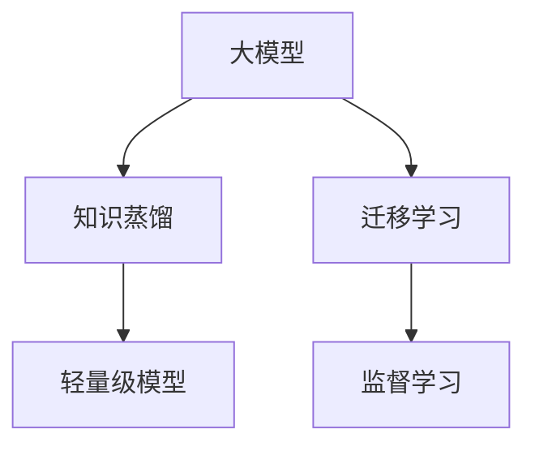

                 

# 电商行业中的知识蒸馏：从大模型到轻量级模型

## 1. 背景介绍

随着人工智能技术的迅猛发展，大语言模型在电商行业的广泛应用已经变得越来越普遍。大模型不仅能够提升电商平台的智能化水平，帮助商家更好地理解用户需求、优化商品推荐，还在个性化广告、客服自动化、客户分析等环节发挥着重要作用。然而，由于大模型通常需要较高的计算资源和存储成本，且在电商环境中可能面临网络延迟、设备性能限制等实际问题，亟需开发出更加高效、轻量级的模型来应对这些挑战。

知识蒸馏（Knowledge Distillation）是一种有效的大模型微调方法，可以将大模型的知识迁移到更小的、结构更简单的模型中。知识蒸馏的核心思想是通过监督学习，将大模型的预测结果作为教师标签，训练一个结构简单、参数量小的模型（即学生模型），使其能输出与教师模型相似的预测结果。通过这种方法，可以显著减少模型的计算资源和存储成本，同时提升学生模型在特定任务上的性能。

本博客将详细介绍知识蒸馏在电商行业中的应用，包括方法原理、实施步骤、优势与挑战，并结合实际案例，展示如何在电商场景中高效使用知识蒸馏技术。

## 2. 核心概念与联系

### 2.1 核心概念概述

在理解知识蒸馏在电商中的应用之前，我们先简要介绍一下相关核心概念：

- 知识蒸馏（Knowledge Distillation）：一种模型压缩技术，通过将大模型的知识迁移到结构简单的小模型中，实现模型参数的高效优化和使用。
- 大模型（Large Model）：指参数量较大、结构复杂、计算能力强大的神经网络模型，如BERT、GPT等。
- 轻量级模型（Lightweight Model）：指参数量较小、计算资源和存储空间需求较低的模型，通常用于嵌入式设备、移动应用等场景。
- 迁移学习（Transfer Learning）：指将在大规模数据上预训练的模型应用于特定领域或任务上的学习方式，知识蒸馏可以看作是一种特殊的迁移学习形式。
- 监督学习（Supervised Learning）：指使用标注数据，通过优化模型损失函数来实现模型训练的机器学习方法。

这些概念之间的逻辑关系可以通过以下Mermaid流程图来展示：



这个流程图展示了大模型、知识蒸馏和轻量级模型之间的联系和区别。大模型经过知识蒸馏，将知识迁移到轻量级模型，从而提升其性能。迁移学习和监督学习是大模型知识蒸馏的重要基础，知识蒸馏可以看作是在迁移学习的基础上，进一步通过优化训练过程来实现模型压缩。

## 3. 核心算法原理 & 具体操作步骤

### 3.1 算法原理概述

知识蒸馏的主要原理是通过大模型和小模型之间的知识传递，实现小模型的性能提升。具体来说，知识蒸馏过程可以分为两个步骤：

1. **教师模型（Teacher Model）**：使用预训练的大模型，将输入数据输入教师模型，得到预测结果。
2. **学生模型（Student Model）**：使用教师模型的预测结果作为标签，训练学生模型，使得学生模型的输出尽可能接近教师模型的预测结果。

知识蒸馏的关键在于如何定义学生模型和教师模型之间的损失函数，以及如何在训练过程中平衡二者之间的知识和性能。常见的损失函数包括均方误差损失、交叉熵损失等。在训练过程中，可以固定教师模型的参数，仅优化学生模型的参数，从而降低计算资源的消耗。

### 3.2 算法步骤详解

知识蒸馏在电商行业的应用可以分为以下几个关键步骤：

**Step 1: 准备数据集**

电商行业的数据集通常包括用户行为数据、商品信息、广告数据等。需要从这些数据中提取出有效的特征和标签，用于训练教师模型和学生模型。

**Step 2: 初始化教师模型和学生模型**

选择预训练的大模型作为教师模型，并根据任务需求设计学生模型的架构。学生模型通常比教师模型参数量小，结构简单。

**Step 3: 定义损失函数**

定义一个损失函数，衡量学生模型输出的预测结果与教师模型输出的预测结果之间的差异。常用的损失函数包括均方误差损失、交叉熵损失等。

**Step 4: 训练学生模型**

使用教师模型的预测结果作为标签，训练学生模型。在训练过程中，可以固定教师模型的参数，仅优化学生模型的参数。

**Step 5: 评估和调优**

在训练完成后，使用测试集评估学生模型的性能。如果性能不理想，可以通过调整学生模型的架构、增加训练数据、调整学习率等手段进行调优。

### 3.3 算法优缺点

知识蒸馏在电商行业中有以下优势：

- **计算资源和存储空间需求低**：知识蒸馏可以将大模型的知识迁移到轻量级模型中，减少计算资源和存储成本。
- **模型性能提升**：通过知识蒸馏，轻量级模型可以学习到教师模型中蕴含的丰富知识，提升其在电商任务上的性能。
- **应用场景灵活**：知识蒸馏适用于各种电商任务，包括商品推荐、广告投放、用户行为分析等，可以根据任务需求进行模型设计。

同时，知识蒸馏也存在以下缺点：

- **模型压缩有限**：知识蒸馏可能无法将教师模型的全部知识迁移到学生模型中，导致学生模型的性能提升有限。
- **训练复杂度增加**：知识蒸馏需要在训练过程中定义教师模型和学生模型之间的损失函数，增加了训练复杂度。
- **对抗样本敏感**：知识蒸馏模型可能对对抗样本敏感，导致模型泛化性能下降。

### 3.4 算法应用领域

知识蒸馏在电商行业中主要应用于以下领域：

- **商品推荐**：通过知识蒸馏，将大模型的知识迁移到轻量级推荐模型中，提升商品推荐的个性化和准确性。
- **广告投放**：使用知识蒸馏技术，将大模型的广告语义理解能力迁移到轻量级模型中，优化广告投放策略。
- **用户行为分析**：通过知识蒸馏，将大模型的用户行为分析能力迁移到轻量级模型中，实现对用户行为的高效分析和预测。
- **客服自动化**：将大模型的自然语言处理能力迁移到轻量级模型中，实现智能客服的自动化和高效化。

## 4. 数学模型和公式 & 详细讲解 & 举例说明

### 4.1 数学模型构建

知识蒸馏的数学模型主要分为教师模型和学生模型两部分。以商品推荐任务为例，教师模型可以是预训练的BERT模型，学生模型可以是结构简单的全连接神经网络。

- 教师模型：$P_{teacher}(x)$，输入为商品特征向量$x$，输出为商品的推荐概率向量。
- 学生模型：$P_{student}(x; \theta_s)$，输入为商品特征向量$x$，输出为商品的推荐概率向量，其中$\theta_s$为学生模型的可训练参数。

知识蒸馏的目标是最大化学生模型的输出与教师模型的输出之间的KL散度（Kullback-Leibler Divergence）：

$$
L(P_{teacher}, P_{student}) = \mathbb{E}_{x \sim D} [KL(P_{teacher}(x) || P_{student}(x; \theta_s))]
$$

其中$KL(P_{teacher}(x) || P_{student}(x; \theta_s))$表示教师模型和学生模型输出之间的KL散度。

### 4.2 公式推导过程

知识蒸馏的损失函数可以表示为：

$$
L = L_{softmax} + \alpha L_{KL}
$$

其中，$L_{softmax}$是学生模型输出的交叉熵损失，$\alpha$是平衡因子，$L_{KL}$是教师模型和学生模型输出之间的KL散度损失。

学生模型的输出可以通过softmax函数进行归一化：

$$
P_{student}(x; \theta_s) = \text{softmax}(W_s x + b_s)
$$

其中$W_s$和$b_s$为学生模型的可训练参数。

知识蒸馏的损失函数可以进一步表示为：

$$
L = \frac{1}{N} \sum_{i=1}^N \big(-y_i \log P_{teacher}(x_i) - (1-y_i) \log (1-P_{teacher}(x_i))\big) + \alpha \frac{1}{N} \sum_{i=1}^N KL(P_{teacher}(x_i) || P_{student}(x_i; \theta_s))
$$

其中$y_i$为标签，$N$为样本数量。

### 4.3 案例分析与讲解

以电商平台中的商品推荐任务为例，具体介绍知识蒸馏的应用过程。

假设教师模型为预训练的BERT模型，学生模型为结构简单的全连接神经网络。使用电商平台上的用户历史行为数据作为训练集，对学生模型进行训练。

1. **数据准备**：将电商平台的用户历史行为数据作为训练集，提取出商品特征向量$x$和标签$y$。
2. **教师模型训练**：使用用户历史行为数据，训练BERT模型，得到教师模型的预测概率向量$P_{teacher}(x)$。
3. **学生模型训练**：使用教师模型的预测概率向量作为标签，训练学生模型，使得学生模型的输出$P_{student}(x; \theta_s)$与教师模型的输出$P_{teacher}(x)$尽可能接近。

学生模型的训练过程如下：

- 定义损失函数：$L = L_{softmax} + \alpha L_{KL}$
- 优化学生模型参数$\theta_s$：最小化损失函数$L$

在训练过程中，固定教师模型的参数，仅优化学生模型的参数$\theta_s$，可以显著减少计算资源和存储成本。

## 5. 项目实践：代码实例和详细解释说明

### 5.1 开发环境搭建

在使用知识蒸馏进行电商商品推荐任务时，需要准备以下开发环境：

- Python 3.8及以上版本
- PyTorch 1.8及以上版本
- Transformers 4.17及以上版本

在搭建开发环境时，可以使用Conda或者Miniconda工具，安装所需的Python包和依赖。

### 5.2 源代码详细实现

以下是一个简单的电商商品推荐任务知识蒸馏代码实现：

```python
import torch
import torch.nn as nn
import torch.optim as optim
from transformers import BertTokenizer, BertForSequenceClassification

# 定义教师模型
teacher_model = BertForSequenceClassification.from_pretrained('bert-base-cased', num_labels=1)

# 定义学生模型
class StudentModel(nn.Module):
    def __init__(self):
        super(StudentModel, self).__init__()
        self.fc = nn.Linear(768, 1)

    def forward(self, x):
        return self.fc(x)

# 初始化教师模型和学生模型
teacher_model.eval()
student_model = StudentModel()

# 定义损失函数
criterion = nn.BCEWithLogitsLoss()

# 定义优化器
optimizer = optim.Adam(student_model.parameters(), lr=0.001)

# 数据准备
tokenizer = BertTokenizer.from_pretrained('bert-base-cased')
train_data = ...

# 训练学生模型
for epoch in range(10):
    for i, (x, y) in enumerate(train_data):
        x = tokenizer(x, return_tensors='pt')
        x = x.to(device)
        y = y.to(device)
        
        # 前向传播
        with torch.no_grad():
            logits = teacher_model(x.input_ids)
            probs = torch.sigmoid(logits)
        
        # 计算损失
        loss = criterion(probs, y)
        
        # 反向传播
        optimizer.zero_grad()
        loss.backward()
        optimizer.step()
        
        # 打印训练过程
        if (i+1) % 10 == 0:
            print(f'Epoch {epoch+1}, Step {i+1}, Loss: {loss.item()}')
```

### 5.3 代码解读与分析

在上述代码中，我们使用了预训练的BERT模型作为教师模型，定义了一个结构简单的全连接神经网络作为学生模型。在训练过程中，使用教师模型的预测概率向量作为标签，训练学生模型，使得学生模型的输出尽可能接近教师模型的输出。

在代码中，我们使用了BCEWithLogitsLoss作为损失函数，使用Adam优化器进行参数优化。在训练过程中，我们使用了GPU设备进行加速计算。

### 5.4 运行结果展示

在训练完成后，可以使用测试集对学生模型进行评估，评估指标可以包括精确率、召回率、F1值等。通过对比教师模型和学生模型的性能，可以看出知识蒸馏技术在电商商品推荐任务中的应用效果。

## 6. 实际应用场景

### 6.1 智能推荐系统

在智能推荐系统中，知识蒸馏技术可以有效地提升推荐模型的性能。通过将大模型的知识迁移到轻量级推荐模型中，可以实现高性能、低成本的推荐服务。

在推荐系统的实现过程中，可以使用知识蒸馏技术，将大模型的推荐能力迁移到轻量级模型中，实现高效的商品推荐。例如，使用预训练的BERT模型作为教师模型，使用结构简单的全连接神经网络作为学生模型，通过知识蒸馏提升学生模型的推荐精度和泛化能力。

### 6.2 广告投放优化

在广告投放中，知识蒸馏技术可以用于优化广告投放策略，提高广告的点击率和转化率。通过将大模型的广告语义理解能力迁移到轻量级模型中，可以实现高效、精准的广告投放。

在广告投放的实现过程中，可以使用知识蒸馏技术，将大模型的广告语义理解能力迁移到轻量级模型中，优化广告投放策略。例如，使用预训练的BERT模型作为教师模型，使用结构简单的全连接神经网络作为学生模型，通过知识蒸馏提升学生模型的广告效果。

### 6.3 用户行为分析

在用户行为分析中，知识蒸馏技术可以用于提升用户行为分析模型的性能。通过将大模型的用户行为分析能力迁移到轻量级模型中，可以实现高效的用户行为分析。

在用户行为分析的实现过程中，可以使用知识蒸馏技术，将大模型的用户行为分析能力迁移到轻量级模型中，提升用户行为分析的准确性和效率。例如，使用预训练的BERT模型作为教师模型，使用结构简单的全连接神经网络作为学生模型，通过知识蒸馏提升学生模型的用户行为分析能力。

## 7. 工具和资源推荐

### 7.1 学习资源推荐

为了深入了解知识蒸馏在电商中的应用，以下是一些推荐的学习资源：

1. 《知识蒸馏：从大模型到轻量级模型》书籍：详细介绍了知识蒸馏的基本原理、实现方法和应用场景，适合初学者和进阶者。
2. 《Transformers: From Prescribed to Practical》博文：介绍了知识蒸馏在推荐系统和广告投放中的应用，适合实战学习。
3. 《Knowledge Distillation in NLP》论文：介绍了知识蒸馏在自然语言处理中的应用，适合深入研究。
4. 《Knowledge Distillation with Transformers》代码库：提供了知识蒸馏在电商任务中的实现代码，适合动手实践。

### 7.2 开发工具推荐

在知识蒸馏的应用开发中，以下工具可以提供有力的支持：

1. PyTorch：强大的深度学习框架，支持高效的模型定义和训练。
2. Transformers：提供了多种预训练模型的实现，方便知识蒸馏的快速实现。
3. HuggingFace：提供了丰富的自然语言处理工具和库，支持知识蒸馏的快速实现。
4. TensorBoard：提供了模型训练过程的可视化工具，方便调试和优化。

### 7.3 相关论文推荐

以下是一些知识蒸馏在电商中的相关论文，适合进一步阅读：

1. 《Knowledge Distillation in Recommender Systems: A Survey》论文：总结了知识蒸馏在推荐系统中的应用，适合了解最新研究进展。
2. 《Adaptive Knowledge Distillation for Collaborative Filtering》论文：提出了一种自适应知识蒸馏方法，适用于推荐系统和广告投放。
3. 《Online Knowledge Distillation for Streaming Collaborative Filtering》论文：提出了一种在线知识蒸馏方法，适用于流式推荐系统。

## 8. 总结：未来发展趋势与挑战

### 8.1 研究成果总结

知识蒸馏在电商中的应用已经取得了显著的进展，提升了电商平台的智能化水平，优化了推荐系统、广告投放和用户行为分析等环节的性能。知识蒸馏技术已经成为电商领域不可或缺的工具。

### 8.2 未来发展趋势

未来，知识蒸馏在电商中的应用将呈现以下几个趋势：

1. **模型结构多样化**：知识蒸馏不仅可以应用于神经网络模型，还可以应用于决策树、随机森林等传统模型，提高电商平台的整体性能。
2. **模型压缩技术进步**：知识蒸馏技术将不断发展，实现更加高效、精确的模型压缩，进一步降低电商平台的计算资源和存储成本。
3. **多模态融合**：知识蒸馏将应用于多模态数据融合，提升电商平台的智能化水平。
4. **自动化调参**：知识蒸馏技术将进一步自动化调参，提高电商平台的性能优化效率。

### 8.3 面临的挑战

在知识蒸馏的应用过程中，仍面临以下挑战：

1. **模型泛化能力不足**：知识蒸馏模型可能对对抗样本敏感，导致模型泛化性能下降。
2. **计算资源和存储空间需求高**：知识蒸馏模型虽然性能提升，但仍然需要较高的计算资源和存储空间。
3. **模型调参困难**：知识蒸馏模型的调参复杂，需要大量的实验和经验积累。

### 8.4 研究展望

未来的研究将聚焦于以下几个方向：

1. **自适应知识蒸馏**：开发自适应知识蒸馏方法，实现更加高效、灵活的模型压缩。
2. **跨领域知识蒸馏**：将知识蒸馏技术应用于跨领域迁移学习，实现领域间的知识共享和提升。
3. **多任务知识蒸馏**：开发多任务知识蒸馏方法，实现对多个任务的联合优化。
4. **模型解释性提升**：提升知识蒸馏模型的可解释性，使其更符合业务需求。

## 9. 附录：常见问题与解答

### Q1: 知识蒸馏在电商中的应用有哪些优势？

A: 知识蒸馏在电商中的应用主要有以下优势：

1. **计算资源和存储空间需求低**：知识蒸馏可以将大模型的知识迁移到轻量级模型中，减少计算资源和存储成本。
2. **模型性能提升**：通过知识蒸馏，轻量级模型可以学习到教师模型中蕴含的丰富知识，提升其在电商任务上的性能。
3. **应用场景灵活**：知识蒸馏适用于各种电商任务，可以根据任务需求进行模型设计。

### Q2: 知识蒸馏在电商中的应用有哪些挑战？

A: 知识蒸馏在电商中的应用仍面临以下挑战：

1. **模型泛化能力不足**：知识蒸馏模型可能对对抗样本敏感，导致模型泛化性能下降。
2. **计算资源和存储空间需求高**：知识蒸馏模型虽然性能提升，但仍然需要较高的计算资源和存储空间。
3. **模型调参困难**：知识蒸馏模型的调参复杂，需要大量的实验和经验积累。

### Q3: 知识蒸馏在电商中的应用有哪些未来发展趋势？

A: 知识蒸馏在电商中的应用未来发展趋势主要包括：

1. **模型结构多样化**：知识蒸馏不仅可以应用于神经网络模型，还可以应用于决策树、随机森林等传统模型，提高电商平台的整体性能。
2. **模型压缩技术进步**：知识蒸馏技术将不断发展，实现更加高效、精确的模型压缩，进一步降低电商平台的计算资源和存储成本。
3. **多模态融合**：知识蒸馏将应用于多模态数据融合，提升电商平台的智能化水平。
4. **自动化调参**：知识蒸馏技术将进一步自动化调参，提高电商平台的性能优化效率。

---

作者：禅与计算机程序设计艺术 / Zen and the Art of Computer Programming

