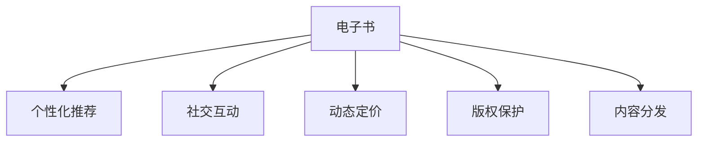

                 

# 电子书市场在注意力经济中的变革

## 1. 背景介绍

### 1.1 问题由来
随着数字化技术的发展，传统的纸质书籍正在向电子化、在线化方向快速演进。电子书的出现，不仅改变了阅读方式，也引发了出版行业、图书销售、版权保护等多个领域的深刻变革。特别是近年来，基于互联网和社交媒体的注意力经济模式在电子书市场中逐步兴起，吸引了众多企业和投资者的关注。

注意力经济（Attention Economy），是指在信息过载的时代，争夺用户的注意力成为重要的经济资源。在数字化的电子书市场中，通过精准推荐、个性化内容、社交互动等方式，吸引用户眼球并提高转化率，成为新的竞争焦点。

### 1.2 问题核心关键点
电子书市场在注意力经济中的变革，主要体现在以下几个方面：

1. **内容个性化推荐**：通过算法模型，根据用户阅读历史、兴趣偏好等数据，推荐个性化的书籍，提高用户粘性。
2. **社交互动增强**：利用社交媒体平台，增加用户间的互动，提高内容的可分享性，形成阅读社区。
3. **动态定价策略**：根据市场需求和用户行为变化，动态调整书籍价格，优化销售收益。
4. **版权保护强化**：采用区块链、水印等技术，确保电子书的版权安全，打击盗版行为。
5. **跨平台内容分发**：整合多渠道（如APP、Web、社交媒体）分发内容，扩大市场覆盖面。

这些变革不仅提升了用户体验，也为电子书市场带来了新的商业模式和发展机遇。

### 1.3 问题研究意义
研究电子书市场在注意力经济中的变革，对于出版业、零售业、技术企业以及政策制定者均具有重要意义：

1. **出版与零售企业**：通过精准推荐、社交互动等手段，提升用户活跃度和转化率，实现精准营销和收益最大化。
2. **技术企业**：利用注意力经济模式，开发个性化推荐、社交互动、动态定价等新型业务，拓宽收入来源。
3. **政策制定者**：理解和规范注意力经济模式，引导和监管电子书市场的健康发展，保障用户权益和市场公平竞争。

## 2. 核心概念与联系

### 2.1 核心概念概述

为更好地理解电子书市场在注意力经济中的变革，本节将介绍几个密切相关的核心概念：

- **电子书（E-books）**：以电子形式存储的书籍，支持在电子设备上阅读，相比纸质书籍具有便携、存储方便等优势。
- **注意力经济（Attention Economy）**：在信息爆炸的时代，争夺用户的注意力成为一种经济资源。电子书市场通过精准推荐、社交互动等方式，争夺用户的注意力，提高销售转化率。
- **个性化推荐系统（Personalized Recommendation System）**：利用算法模型，根据用户的历史行为和兴趣，推荐个性化的书籍，提高用户粘性和满意度。
- **社交互动平台（Social Interaction Platforms）**：利用社交媒体平台，增加用户间的互动，形成阅读社区，提升内容的可分享性和传播效果。
- **动态定价策略（Dynamic Pricing Strategies）**：根据市场需求和用户行为变化，动态调整书籍价格，优化销售收益。
- **版权保护技术（Copyright Protection Technologies）**：利用区块链、数字水印等技术，确保电子书的版权安全，打击盗版行为。

这些核心概念之间的逻辑关系可以通过以下Mermaid流程图来展示：



这个流程图展示了一个典型的电子书市场在注意力经济中的生态系统：电子书作为核心产品，通过个性化推荐、社交互动、动态定价、版权保护、内容分发等多种方式，吸引用户注意力，提升销售收益和市场竞争力。

## 3. 核心算法原理 & 具体操作步骤
### 3.1 算法原理概述

电子书市场在注意力经济中的变革，主要通过以下几个核心算法和操作步骤实现：

1. **个性化推荐算法**：基于用户的阅读历史、兴趣偏好等数据，推荐个性化的书籍。推荐算法一般包括协同过滤、基于内容的推荐、深度学习推荐等。
2. **社交互动算法**：利用社交媒体平台，增加用户间的互动，形成阅读社区。算法包括用户社交网络分析、情感分析、话题建模等。
3. **动态定价算法**：根据市场需求和用户行为变化，动态调整书籍价格。算法包括需求预测、用户价值评估、市场竞争分析等。
4. **版权保护算法**：利用区块链、数字水印等技术，确保电子书的版权安全。算法包括水印嵌入、版权验证、反盗版检测等。
5. **内容分发算法**：整合多渠道（如APP、Web、社交媒体）分发内容。算法包括多通道优化、流量预测、推荐系统集成等。

这些算法和操作步骤共同构成了电子书市场在注意力经济中的核心技术框架，使得电子书市场能够通过用户注意力争夺，实现高效的用户互动和市场收益。

### 3.2 算法步骤详解

以个性化推荐算法为例，其核心步骤包括：

1. **数据收集**：收集用户的历史阅读数据、浏览记录、搜索行为等，构建用户行为特征向量。
2. **特征工程**：对收集的数据进行预处理和特征提取，如文本特征表示、时间特征、社交网络特征等。
3. **模型训练**：选择合适的推荐算法模型（如协同过滤、深度学习推荐等），利用标注数据进行模型训练。
4. **实时推荐**：根据用户当前行为数据，实时计算并推荐个性化书籍。
5. **反馈更新**：根据用户的点击、购买等反馈行为，更新模型参数，提高推荐准确性。

其他算法（如社交互动、动态定价、版权保护、内容分发）的详细操作步骤类似，但具体的算法模型和技术细节有所差异。

### 3.3 算法优缺点

电子书市场在注意力经济中的变革，主要依赖于个性化推荐、社交互动、动态定价、版权保护等核心算法。这些算法的优缺点如下：

**个性化推荐算法的优点**：
1. **提升用户粘性**：通过推荐个性化书籍，满足用户个性化需求，提高用户粘性。
2. **增加转化率**：推荐感兴趣的书籍，提高用户点击和购买转化率。
3. **市场竞争力**：通过精准推荐，提升市场竞争力，吸引更多用户。

**个性化推荐算法的缺点**：
1. **数据依赖**：需要大量标注数据和用户行为数据，获取难度大。
2. **过拟合风险**：模型容易过拟合用户历史行为，推荐偏差较大。
3. **冷启动问题**：新用户缺乏历史行为数据，推荐效果不佳。

**社交互动算法的优点**：
1. **用户粘性提升**：通过社交互动，增加用户间的互动，提高用户粘性。
2. **内容传播扩大**：增加内容的可分享性，扩大内容的传播范围。
3. **社区形成**：形成阅读社区，用户之间互相推荐书籍，形成良性循环。

**社交互动算法的缺点**：
1. **隐私风险**：社交互动需要收集和分享用户信息，存在隐私风险。
2. **互动质量难以控制**：用户间的互动质量难以控制，可能出现负面评论和恶意行为。
3. **过度依赖社交媒体平台**：依赖社交媒体平台，平台变动可能影响用户互动。

**动态定价算法的优点**：
1. **优化收益**：通过动态定价，根据市场需求和用户行为变化，优化销售收益。
2. **竞争优势**：动态定价策略能灵活应对市场变化，提升竞争优势。
3. **需求预测**：通过需求预测，提前调整定价策略，避免价格波动。

**动态定价算法的缺点**：
1. **市场不确定性**：市场需求变化难以预测，定价策略可能失效。
2. **用户敏感度**：价格波动可能影响用户满意度，影响长期收益。
3. **竞争压力**：竞争激烈的市场环境，可能导致价格战，降低整体收益。

**版权保护算法的优点**：
1. **保障版权**：利用区块链、数字水印等技术，保障电子书的版权安全。
2. **打击盗版**：通过技术手段，有效打击盗版行为，保护作者权益。
3. **信任建立**：建立用户对电子书版权的信任，提升市场信任度。

**版权保护算法的缺点**：
1. **技术成本高**：版权保护技术复杂，技术成本较高。
2. **法律风险**：技术手段可能面临法律风险，需要不断更新和完善。
3. **用户体验降低**：部分版权保护技术可能影响用户体验，如增加阅读复杂性。

**内容分发算法的优点**：
1. **市场覆盖扩大**：整合多渠道分发内容，扩大市场覆盖面。
2. **用户需求匹配**：通过多渠道分发，更好地匹配用户需求。
3. **渠道优化**：优化渠道选择和内容分发策略，提高渠道效率。

**内容分发算法的缺点**：
1. **渠道成本高**：多渠道分发需要投入较多成本，成本控制难度大。
2. **渠道协同复杂**：不同渠道的协同和统一管理复杂，可能出现数据冲突。
3. **用户体验不一致**：不同渠道的用户体验可能不一致，影响用户满意度。

## 4. 数学模型和公式 & 详细讲解  
### 4.1 数学模型构建

电子书市场在注意力经济中的变革，涉及到多个领域的数学模型和公式。以下将以个性化推荐系统为例，详细讲解其数学模型和公式。

假设电子书市场中有 $N$ 个用户，每个用户有 $M$ 本书籍。用户与书籍之间的评分矩阵为 $R \in \mathbb{R}^{N \times M}$，用户 $i$ 对书籍 $j$ 的评分记为 $R_{ij}$。

目标是通过用户的历史行为数据，构建推荐模型 $f: \mathbb{R}^N \rightarrow \mathbb{R}^M$，预测用户 $i$ 对书籍 $j$ 的评分，最大化用户满意度。

推荐模型 $f$ 的优化目标为：

$$
\max_{f} \sum_{i=1}^N \sum_{j=1}^M R_{ij} f_i(j)
$$

其中 $f_i(j)$ 表示用户 $i$ 对书籍 $j$ 的预测评分。

### 4.2 公式推导过程

基于矩阵分解的思想，可以使用矩阵分解的方法来构建推荐模型。设 $U \in \mathbb{R}^{N \times K}$ 和 $V \in \mathbb{R}^{M \times K}$ 分别为用户和书籍的潜在特征矩阵，$H = UV^T$ 为推荐矩阵。

通过矩阵分解，可以将用户行为矩阵 $R$ 分解为两个低秩矩阵的乘积，即 $R \approx UV^T$。此时推荐模型 $f$ 可以表示为：

$$
f_i(j) = \langle H_i, V_j \rangle = \sum_{k=1}^K U_{ik} V_{kj}
$$

其中 $H_i = (U_i, 0, ..., 0)^T$ 为用户 $i$ 的潜在特征向量，$V_j = (0, ..., V_{kj}, ..., 0)^T$ 为书籍 $j$ 的潜在特征向量。

为了最小化预测误差，可以使用均方误差（MSE）作为损失函数：

$$
\mathcal{L} = \frac{1}{2} \sum_{i=1}^N \sum_{j=1}^M (R_{ij} - f_i(j))^2
$$

通过最小化损失函数，可以得到模型参数 $U$ 和 $V$ 的最优解。

### 4.3 案例分析与讲解

以Netflix的推荐系统为例，其个性化推荐算法主要基于协同过滤和矩阵分解。Netflix收集了用户的浏览、评分、观看历史等数据，构建用户行为矩阵 $R$。

Netflix通过SVD（奇异值分解）对用户行为矩阵 $R$ 进行分解，得到用户潜在特征矩阵 $U$ 和书籍潜在特征矩阵 $V$。将 $U$ 和 $V$ 相乘，得到推荐矩阵 $H$，预测用户对每本书籍的评分。

Netflix还采用了基于内容的推荐、深度学习推荐等方法，进一步提升了推荐准确性。Netflix的推荐系统通过不断的优化和迭代，实现了高效的用户推荐，极大地提高了用户满意度和平台粘性。

## 5. 项目实践：代码实例和详细解释说明
### 5.1 开发环境搭建

在进行电子书市场在注意力经济中的变革实践前，我们需要准备好开发环境。以下是使用Python进行Scikit-learn开发的环境配置流程：

1. 安装Anaconda：从官网下载并安装Anaconda，用于创建独立的Python环境。

2. 创建并激活虚拟环境：
```bash
conda create -n attention-economy python=3.8 
conda activate attention-economy
```

3. 安装Scikit-learn：
```bash
pip install scikit-learn
```

4. 安装各类工具包：
```bash
pip install numpy pandas scikit-learn matplotlib tqdm jupyter notebook ipython
```

完成上述步骤后，即可在`attention-economy`环境中开始电子书市场在注意力经济中的变革实践。

### 5.2 源代码详细实现

下面以Netflix推荐系统的实现为例，给出使用Scikit-learn进行个性化推荐算法的Python代码实现。

```python
from sklearn.decomposition import TruncatedSVD
from sklearn.metrics import mean_squared_error
import numpy as np
import pandas as pd

# 构建用户行为矩阵R
R = np.array([[5, 4, 0, 0],
              [0, 0, 5, 1],
              [4, 0, 4, 4]])

# 使用奇异值分解进行矩阵分解
svd = TruncatedSVD(n_components=2)
U = svd.fit_transform(R)
V = svd.components_

# 构建推荐矩阵H
H = U.dot(V.T)

# 预测用户对书籍的评分
user_index = 0
book_index = 0
pred_score = H[user_index, book_index]
print("用户{}对书籍{}的预测评分：{}".format(user_index, book_index, pred_score))
```

在上述代码中，我们使用了Scikit-learn库中的TruncatedSVD类，对用户行为矩阵 $R$ 进行奇异值分解。通过分解得到的用户潜在特征矩阵 $U$ 和书籍潜在特征矩阵 $V$，计算推荐矩阵 $H$，并预测用户对书籍的评分。

### 5.3 代码解读与分析

让我们再详细解读一下关键代码的实现细节：

**TruncatedSVD类**：
- 使用奇异值分解对用户行为矩阵 $R$ 进行分解，得到用户潜在特征矩阵 $U$ 和书籍潜在特征矩阵 $V$。
- `n_components`参数指定分解后的特征数量，这里设置为2。

**用户行为矩阵 $R$ 构建**：
- 假设用户行为矩阵 $R$ 中有三个用户，四个书籍，用户对书籍的评分分别为5、4、4、1。

**推荐矩阵 $H$ 计算**：
- 通过矩阵 $U$ 和 $V^T$ 相乘，得到推荐矩阵 $H$，预测用户对每本书籍的评分。

**预测评分输出**：
- 输出用户对书籍的预测评分，通过查询推荐矩阵 $H$ 中的对应元素。

## 6. 实际应用场景
### 6.1 智能推荐系统

基于电子书市场在注意力经济中的变革，智能推荐系统在电子商务、社交媒体、视频平台等领域得到了广泛应用。通过推荐系统，用户可以快速找到感兴趣的书籍，提升用户体验和平台粘性。

在实际应用中，智能推荐系统通常集成多个推荐算法，如协同过滤、深度学习推荐、基于内容的推荐等，结合用户行为数据和商品数据，实现精准推荐。

### 6.2 社交阅读平台

社交阅读平台，如豆瓣读书、Goodreads等，利用社交网络分析、情感分析等算法，增加用户间的互动，形成阅读社区。用户可以分享阅读心得，互相推荐书籍，扩大内容传播范围。

通过社交互动，社交阅读平台可以收集更多用户行为数据，提高推荐系统的准确性。同时，社交互动还能增加用户粘性，提升平台活跃度。

### 6.3 电子书销售优化

电子书销售优化，通过动态定价策略，根据市场需求和用户行为变化，优化销售收益。例如，在促销活动期间，通过降低书籍价格吸引用户购买；在新书发布时，通过价格溢价吸引潜在读者。

动态定价策略需要结合需求预测、用户价值评估等算法，实时调整书籍价格。通过优化定价策略，电子书销售平台可以实现收益最大化。

### 6.4 版权保护

版权保护是电子书市场的重要问题。通过区块链、数字水印等技术，电子书市场可以实现有效的版权保护。例如，在用户下载电子书时，验证数字水印的完整性，确保书籍版权安全。

数字水印技术可以嵌入到书籍的各个部分，如封面、正文、目录等，通过水印验证，打击盗版行为。同时，区块链技术可以记录书籍的版权信息和交易记录，保障版权权益。

## 7. 工具和资源推荐
### 7.1 学习资源推荐

为了帮助开发者系统掌握电子书市场在注意力经济中的变革的理论基础和实践技巧，这里推荐一些优质的学习资源：

1. **《推荐系统基础与算法》**：详细介绍了推荐系统的原理和算法，包括协同过滤、基于内容的推荐、深度学习推荐等。

2. **Coursera《机器学习》课程**：由斯坦福大学Andrew Ng教授主讲，系统讲解了机器学习的核心概念和算法，适合初学者学习。

3. **Kaggle推荐系统竞赛**：通过参与实际竞赛，学习推荐系统的具体实现和调参技巧。

4. **Netflix论文集**：Netflix公开了大量推荐系统相关的论文和数据集，详细介绍了Netflix推荐系统的构建和优化过程。

5. **《数据挖掘导论》**：介绍了数据挖掘的基础理论和方法，包括分类、聚类、关联规则等，适合对推荐系统感兴趣的学生和研究人员。

通过对这些资源的学习实践，相信你一定能够快速掌握电子书市场在注意力经济中的变革的精髓，并用于解决实际的推荐系统问题。

### 7.2 开发工具推荐

高效的开发离不开优秀的工具支持。以下是几款用于电子书市场在注意力经济中的变革开发的常用工具：

1. **Scikit-learn**：基于Python的开源机器学习库，包含多种推荐算法和模型评估工具。

2. **TensorFlow**：由Google主导开发的开源深度学习框架，支持分布式计算和GPU加速，适合大规模推荐系统开发。

3. **PyTorch**：由Facebook开发的深度学习框架，支持动态计算图和GPU加速，适合快速迭代研究。

4. **Elasticsearch**：分布式搜索引擎，适合大规模数据的存储和搜索，支持复杂查询和分布式计算。

5. **Apache Kafka**：分布式消息队列，适合大规模数据的实时处理和分发，支持高吞吐量和低延迟。

6. **Amazon S3**：云存储服务，适合大规模数据的存储和访问，支持多用户协作和数据备份。

合理利用这些工具，可以显著提升电子书市场在注意力经济中的变革开发效率，加快创新迭代的步伐。

### 7.3 相关论文推荐

电子书市场在注意力经济中的变革涉及多个领域的理论研究和实践探索。以下是几篇奠基性的相关论文，推荐阅读：

1. **《协同过滤推荐算法》**：详细介绍了协同过滤推荐算法的基本原理和实现方法，是推荐系统领域的基础论文。

2. **《深度学习在推荐系统中的应用》**：介绍了深度学习在推荐系统中的各种应用，包括深度神经网络、深度学习推荐等。

3. **《Netflix推荐系统》**：详细介绍了Netflix推荐系统的构建和优化过程，展示了推荐系统在实际应用中的挑战和解决方案。

4. **《基于社交网络的推荐系统》**：介绍了社交网络在推荐系统中的各种应用，包括社交网络分析、情感分析等。

5. **《动态定价算法》**：介绍了动态定价算法的基本原理和实现方法，是优化推荐系统收益的重要工具。

这些论文代表了大语言模型微调技术的发展脉络。通过学习这些前沿成果，可以帮助研究者把握学科前进方向，激发更多的创新灵感。

## 8. 总结：未来发展趋势与挑战

### 8.1 总结

本文对电子书市场在注意力经济中的变革进行了全面系统的介绍。首先阐述了电子书市场在注意力经济中的变革背景和意义，明确了个性化推荐、社交互动、动态定价等关键技术在电子书市场中的应用价值。其次，从原理到实践，详细讲解了个性化推荐算法的数学模型和操作步骤，给出了电子书市场在注意力经济中的变革的代码实现。同时，本文还广泛探讨了智能推荐系统、社交阅读平台、电子书销售优化、版权保护等多个实际应用场景，展示了电子书市场在注意力经济中的变革的广阔前景。最后，本文精选了推荐系统的各类学习资源，力求为读者提供全方位的技术指引。

通过本文的系统梳理，可以看到，电子书市场在注意力经济中的变革，通过个性化推荐、社交互动、动态定价等技术，实现了高效的用户互动和市场收益。未来，伴随推荐算法的不断演进和优化，电子书市场在注意力经济中的变革将迎来新的突破，为用户的阅读体验带来更大提升。

### 8.2 未来发展趋势

展望未来，电子书市场在注意力经济中的变革将呈现以下几个发展趋势：

1. **推荐算法优化**：推荐算法将朝着更加个性化、精准化方向发展，结合深度学习、协同过滤、强化学习等技术，提升推荐效果。
2. **社交互动深度融合**：社交互动将成为推荐系统的重要组成部分，通过社交网络分析、情感分析等技术，提升用户互动和内容传播效果。
3. **动态定价策略优化**：动态定价算法将结合需求预测、用户价值评估等技术，实现更智能、更灵活的定价策略，优化销售收益。
4. **版权保护技术进步**：版权保护技术将进一步完善，结合区块链、数字水印等技术，保障电子书版权安全。
5. **跨平台内容分发**：电子书市场将整合多渠道内容分发，提升市场覆盖面和用户粘性。

以上趋势凸显了电子书市场在注意力经济中的变革的广阔前景。这些方向的探索发展，必将进一步提升电子书市场在个性化推荐、社交互动、动态定价等方面的能力，为用户的阅读体验带来更大提升。

### 8.3 面临的挑战

尽管电子书市场在注意力经济中的变革已经取得了显著成就，但在迈向更加智能化、普适化应用的过程中，它仍面临诸多挑战：

1. **数据隐私和安全**：个性化推荐、社交互动等技术需要收集和处理大量用户数据，涉及隐私和安全问题，需要严格的法律和政策规范。
2. **推荐系统公平性**：推荐系统可能存在算法偏见，导致用户间的不公平，需要引入公平性评估和纠偏机制。
3. **推荐系统透明度**：推荐系统的决策过程缺乏透明度，难以解释其内部工作机制，需要提升推荐系统的可解释性和可审计性。
4. **跨平台数据整合**：多渠道内容分发需要整合不同平台的数据，数据格式和标准不统一，导致数据整合难度大。
5. **用户行为预测**：推荐系统依赖于用户行为数据，用户行为难以预测，导致推荐系统效果不稳定。

这些挑战需要多方协同努力，共同推动电子书市场在注意力经济中的变革技术的持续优化和完善。

### 8.4 研究展望

面对电子书市场在注意力经济中的变革所面临的挑战，未来的研究需要在以下几个方面寻求新的突破：

1. **隐私保护技术**：开发更加安全、可靠的隐私保护技术，如差分隐私、联邦学习等，确保用户数据的安全性。
2. **公平性算法**：引入公平性算法，消除推荐系统中的算法偏见，提升推荐系统的公平性和透明性。
3. **推荐系统可解释性**：通过可解释性算法，提升推荐系统的决策透明度，增强用户信任。
4. **跨平台数据整合**：开发标准化的数据格式和整合工具，降低跨平台数据整合的难度，提升数据利用效率。
5. **推荐系统预测能力**：结合多模态数据和多源信息，提升推荐系统的预测能力和稳定性。

这些研究方向将推动电子书市场在注意力经济中的变革技术的进一步发展和完善，为构建更加智能、公平、安全的推荐系统奠定基础。

## 9. 附录：常见问题与解答

**Q1：电子书市场在注意力经济中的变革有哪些应用场景？**

A: 电子书市场在注意力经济中的变革主要应用于以下几个方面：
1. 智能推荐系统：通过个性化推荐算法，提升用户粘性和满意度。
2. 社交阅读平台：利用社交网络分析、情感分析等算法，增加用户互动，形成阅读社区。
3. 电子书销售优化：通过动态定价策略，优化销售收益。
4. 版权保护：利用区块链、数字水印等技术，保障电子书版权安全。

**Q2：如何提升推荐系统的公平性？**

A: 推荐系统的公平性可以通过以下几个方面进行提升：
1. 数据收集和处理：确保数据的多样性和代表性，避免数据偏见。
2. 算法设计：引入公平性评估指标，如召回率、覆盖率、偏差等，优化算法模型。
3. 用户反馈：收集用户反馈，对推荐结果进行纠正和优化。
4. 多样性保护：引入多样性保护机制，确保推荐结果的多样性。
5. 透明性提升：增强推荐系统的可解释性和可审计性，增加用户信任。

**Q3：电子书市场在注意力经济中的变革面临哪些挑战？**

A: 电子书市场在注意力经济中的变革面临以下几个主要挑战：
1. 数据隐私和安全：个性化推荐、社交互动等技术需要收集和处理大量用户数据，涉及隐私和安全问题。
2. 推荐系统公平性：推荐系统可能存在算法偏见，导致用户间的不公平。
3. 推荐系统透明度：推荐系统的决策过程缺乏透明度，难以解释其内部工作机制。
4. 跨平台数据整合：多渠道内容分发需要整合不同平台的数据，数据格式和标准不统一。
5. 用户行为预测：推荐系统依赖于用户行为数据，用户行为难以预测，导致推荐系统效果不稳定。

**Q4：电子书市场在注意力经济中的变革如何应对跨平台数据整合的挑战？**

A: 应对跨平台数据整合的挑战，可以采取以下几个措施：
1. 标准化数据格式：制定统一的数据格式标准，确保不同平台的数据可以互相兼容。
2. 数据同步工具：开发数据同步工具，实时更新和同步不同平台的数据。
3. 数据清洗和处理：对不同平台的数据进行清洗和处理，消除数据不一致性。
4. 数据联邦学习：采用联邦学习等分布式计算技术，降低跨平台数据整合的难度。
5. 数据可视化：通过数据可视化工具，帮助开发者更好地理解和处理跨平台数据。

**Q5：如何构建推荐系统？**

A: 构建推荐系统一般包括以下几个关键步骤：
1. 数据收集：收集用户行为数据、商品数据、社交网络数据等，构建推荐模型所需的数据集。
2. 特征工程：对收集的数据进行预处理和特征提取，如文本特征表示、时间特征、社交网络特征等。
3. 算法选择：选择合适的推荐算法，如协同过滤、深度学习推荐、基于内容的推荐等。
4. 模型训练：利用标注数据和推荐模型，训练推荐算法，优化模型参数。
5. 实时推荐：根据用户当前行为数据，实时计算并推荐个性化商品。
6. 反馈更新：根据用户的点击、购买等反馈行为，更新模型参数，提高推荐准确性。

通过以上步骤，可以构建一个高效、精准的推荐系统，提升用户满意度和平台收益。

**Q6：电子书市场在注意力经济中的变革的数学模型是什么？**

A: 电子书市场在注意力经济中的变革的数学模型，以个性化推荐系统为例，可以表示为：
假设用户行为矩阵为 $R \in \mathbb{R}^{N \times M}$，用户潜在特征矩阵为 $U \in \mathbb{R}^{N \times K}$，书籍潜在特征矩阵为 $V \in \mathbb{R}^{M \times K}$。推荐矩阵为 $H = UV^T$。

目标是通过矩阵分解的方法，最大化用户满意度：

$$
\max_{f} \sum_{i=1}^N \sum_{j=1}^M R_{ij} f_i(j)
$$

其中 $f_i(j)$ 表示用户 $i$ 对书籍 $j$ 的预测评分。

推荐模型的优化目标为：

$$
\mathcal{L} = \frac{1}{2} \sum_{i=1}^N \sum_{j=1}^M (R_{ij} - f_i(j))^2
$$

通过最小化损失函数，可以得到模型参数 $U$ 和 $V$ 的最优解。

---

作者：禅与计算机程序设计艺术 / Zen and the Art of Computer Programming

