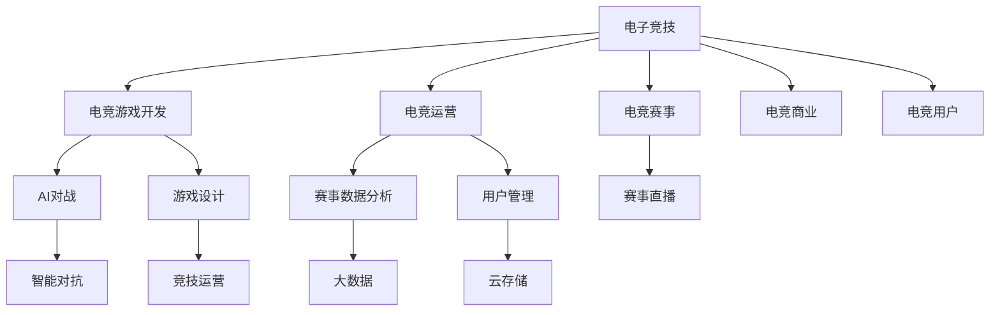

                 

# 电子竞技创业：新兴体育产业的机遇

> 关键词：电子竞技, 体育产业, 创业机会, 游戏开发, 数据驱动, 竞技运营, 用户管理, 市场分析

## 1. 背景介绍

### 1.1 问题由来
随着数字技术的飞速发展，电子竞技(简称电竞)已经从最初的游戏内社交活动，演变为一个全球性的职业体育产业。自20世纪末的《星际争霸》和《反恐精英》等游戏成为电竞赛事的代表作以来，电竞行业经历了快速成长，逐渐形成了包含游戏开发、比赛运营、职业选手培训、商业赞助等多个环节的完整产业链。

电子竞技的兴起，离不开数字技术特别是人工智能、大数据、云计算等技术在其中的应用。从游戏设计到赛事直播，再到用户分析，电竞领域的每一个环节，都融入了先进的IT技术，推动了整个行业的发展。然而，电竞产业的成长也面临着诸多挑战，包括商业模式不成熟、版权问题、法律法规不健全等问题。

本文旨在探讨电子竞技创业的机遇与挑战，从技术、市场、商业模式等多个维度，分析电竞产业的发展趋势，为有志于进入电竞领域的创业者提供参考。

## 2. 核心概念与联系

### 2.1 核心概念概述

在分析电竞创业的机遇时，需要明确几个核心概念：

- **电子竞技**：以电子游戏为媒介，通过专业化的游戏技术和电竞运营，组织电竞赛事，培养职业选手，提供高质量的电竞内容。电竞产业包括游戏开发、赛事运营、职业选手培养等多个环节。

- **创业机会**：在电竞领域内，通过创新的商业模式和技术应用，抓住市场空白和需求，形成有竞争力的业务模式和产品。电竞创业机会包括电竞游戏开发、赛事运营、数据驱动的电竞分析、用户管理等。

- **人工智能(AI)**：在电竞领域，AI技术被广泛应用在电竞游戏设计、AI对战、赛事数据分析、直播内容生成等多个环节。AI技术驱动电竞游戏从传统的数值对抗走向智能对抗，提升了电竞的观赏性和参与度。

- **大数据**：电竞产业积累的大量游戏数据、赛事数据、用户行为数据等，为电竞数据分析、赛事运营、用户管理等环节提供了丰富的数据资源，帮助电竞企业洞察市场趋势，优化运营策略。

- **云计算**：电竞产业的直播、赛事回放、数据存储等，都需要高效稳定的云计算平台支撑。云计算技术为电竞企业提供了高效、灵活、可扩展的计算和存储资源。

- **竞技运营**：电竞运营是指电竞赛事的组织、运营、推广等活动，通过赛事宣传、选手管理、赞助商对接等环节，提升电竞赛事的影响力和商业价值。

- **用户管理**：电竞产业的用户管理包括用户注册、赛事报名、观赛行为、消费行为等管理，通过数据分析和用户画像的构建，提升用户留存率和消费转化率。

这些核心概念之间的逻辑关系可以通过以下Mermaid流程图来展示：



这个流程图展示了电子竞技领域的关键环节和核心技术，以及它们之间的相互联系。

## 3. 核心算法原理 & 具体操作步骤

### 3.1 算法原理概述

电竞创业的核心在于创新技术和商业模式的应用，以满足电竞市场不断变化的需求。在算法和技术的角度，电竞创业主要涉及以下几个方面：

- **游戏设计**：通过AI技术、大数据分析，设计具有竞争力和趣味性的电竞游戏。
- **AI对战**：利用深度学习、强化学习等AI技术，开发智能对战系统，提升电竞游戏的可玩性和观赏性。
- **赛事数据分析**：通过大数据技术和机器学习算法，对电竞赛事进行深入分析，优化赛事运营和选手培养。
- **用户管理**：基于用户行为数据，构建用户画像，实现个性化推荐和精准营销。

这些技术应用不仅提升了电竞游戏的趣味性和竞技性，也为电竞赛事的运营和用户管理提供了数据支撑。

### 3.2 算法步骤详解

#### 3.2.1 电竞游戏设计

电竞游戏设计通常包括以下几个关键步骤：

1. **游戏构想与原型**：根据市场需求和趋势，提出游戏构想，设计游戏原型。
2. **游戏引擎开发**：选择合适的游戏引擎，开发游戏核心引擎。
3. **游戏内容设计**：设计游戏地图、角色、道具、武器等核心内容。
4. **AI对战系统**：开发AI对战系统，提升游戏趣味性和挑战性。
5. **游戏测试与优化**：进行多轮测试，优化游戏性能和用户体验。

#### 3.2.2 AI对战系统

AI对战系统的开发主要依赖于以下算法：

1. **深度学习**：利用深度神经网络，对玩家行为和游戏状态进行建模，实现AI玩家的策略学习和决策。
2. **强化学习**：通过强化学习算法，使AI玩家根据游戏反馈，不断优化策略，提升游戏表现。
3. **计算机视觉**：结合计算机视觉技术，实现游戏中的物体识别、路径规划等功能。

#### 3.2.3 赛事数据分析

电竞赛事数据分析主要涉及以下几个方面：

1. **数据采集**：通过数据采集系统，收集电竞赛事中的各项数据，如游戏状态、玩家行为、观看数据等。
2. **数据清洗与预处理**：对采集到的数据进行清洗和预处理，去除噪音数据和异常值。
3. **数据分析与建模**：利用机器学习算法和数据挖掘技术，对数据进行分析和建模，发现游戏趋势和玩家行为模式。
4. **赛事优化**：基于数据分析结果，优化赛事规则和运营策略，提升赛事的观赏性和用户参与度。

#### 3.2.4 用户管理

用户管理主要包括以下几个步骤：

1. **用户注册与身份验证**：建立用户注册和身份验证系统，确保用户信息的准确性。
2. **用户行为分析**：通过数据分析，了解用户的游戏习惯、观赛偏好等行为特征。
3. **用户画像构建**：基于用户行为数据，构建用户画像，实现个性化推荐和精准营销。
4. **用户互动与维护**：通过社交平台和社区，增强用户互动和粘性。

### 3.3 算法优缺点

#### 3.3.1 优点

- **技术驱动**：电竞创业依靠技术创新，提升游戏趣味性和观赏性，提升用户体验。
- **数据驱动**：电竞游戏和赛事数据丰富，可通过数据分析和挖掘，优化运营策略，提升商业价值。
- **灵活性强**：电竞行业变化快，可快速迭代，灵活应对市场需求。

#### 3.3.2 缺点

- **技术门槛高**：电竞创业对技术要求高，需要具备游戏开发、AI技术、数据科学等多个领域的知识。
- **市场需求复杂**：电竞市场需求变化快，需要持续关注市场趋势，不断调整策略。
- **竞争激烈**：电竞市场竞争激烈，需要不断创新，保持竞争力。

### 3.4 算法应用领域

电竞创业主要涉及以下几个领域：

- **电竞游戏开发**：通过AI技术和大数据分析，开发具有竞争力的电竞游戏。
- **电竞赛事运营**：通过赛事数据分析和用户管理，提升电竞赛事的观赏性和用户参与度。
- **电竞商业化**：通过电竞赛事、用户消费等，探索电竞商业化的新模式。
- **电竞技术研究**：进行AI对战、电竞数据分析、智能对抗等技术研究，推动电竞技术进步。

## 4. 数学模型和公式 & 详细讲解 & 举例说明

### 4.1 数学模型构建

电竞创业的数学模型主要涉及以下几个方面：

- **游戏状态表示**：将游戏状态表示为向量形式，如玩家的坐标、生命值、道具等。
- **玩家行为建模**：通过机器学习算法，对玩家行为进行建模，预测玩家下一步动作。
- **赛事分析建模**：利用统计学和机器学习算法，对赛事数据进行建模，分析赛事趋势和选手表现。
- **用户画像建模**：通过数据分析和机器学习，构建用户画像，实现个性化推荐和精准营销。

### 4.2 公式推导过程

#### 4.2.1 游戏状态表示

将游戏状态表示为向量形式，如玩家的坐标、生命值、道具等。

$$
\text{State} = (x,y,z,hp,p1,p2,\ldots,pN)
$$

其中，$x,y,z$ 表示玩家坐标，$hp$ 表示玩家生命值，$p1,p2,\ldots,pN$ 表示玩家所持道具。

#### 4.2.2 玩家行为建模

通过机器学习算法，对玩家行为进行建模，预测玩家下一步动作。

假设玩家行为可以用以下时间序列表示：

$$
A = (a_1, a_2, \ldots, a_t)
$$

其中，$a_t$ 表示玩家在第 $t$ 个时间点的行为，可以通过时间序列预测模型，如LSTM、GRU等，对玩家行为进行建模和预测。

#### 4.2.3 赛事分析建模

利用统计学和机器学习算法，对赛事数据进行建模，分析赛事趋势和选手表现。

假设赛事数据为 $D = (x_1, x_2, \ldots, x_n)$，其中 $x_i = (t_i, s_i, p_i, o_i)$ 表示第 $i$ 场赛事，$t_i$ 表示时间，$s_i$ 表示选手，$p_i$ 表示分数，$o_i$ 表示观赛人数。

通过线性回归、决策树、随机森林等算法，对赛事数据进行建模和分析，预测赛事结果和趋势。

#### 4.2.4 用户画像建模

通过数据分析和机器学习，构建用户画像，实现个性化推荐和精准营销。

假设用户数据为 $U = (u_1, u_2, \ldots, u_m)$，其中 $u_i = (x_i, y_i, z_i)$ 表示用户 $i$，$x_i$ 表示用户行为数据，$y_i$ 表示用户属性数据，$z_i$ 表示用户评分数据。

通过聚类算法、协同过滤算法等，对用户数据进行建模和分析，构建用户画像，实现个性化推荐和精准营销。

### 4.3 案例分析与讲解

#### 4.3.1 游戏设计案例

一款名为《星际争霸3》的电竞游戏，通过AI技术和大数据分析，设计具有竞争力和趣味性的游戏。该游戏通过深度学习算法，实现AI对战系统，提升了游戏趣味性和挑战性。

#### 4.3.2 赛事数据分析案例

某电竞赛事通过对大量游戏数据和观赛数据进行数据分析，发现玩家对战策略的变化，优化了赛事规则和运营策略，提升了赛事的观赏性和用户参与度。

#### 4.3.3 用户管理案例

某电竞平台通过对用户行为数据进行分析，构建用户画像，实现了个性化推荐和精准营销，提升了用户留存率和消费转化率。

## 5. 项目实践：代码实例和详细解释说明

### 5.1 开发环境搭建

#### 5.1.1 开发环境准备

1. **安装Python环境**：
   - 在Windows系统中，可以使用Anaconda或Miniconda安装Python环境。
   - 在Linux系统中，可以使用conda或virtualenv安装Python环境。
   - 在macOS系统中，可以使用brew或conda安装Python环境。

2. **安装游戏引擎**：
   - 安装Unity3D或Unreal Engine等游戏引擎，用于游戏开发。
   - 安装Cocos2d-x或Cocos Creator等游戏引擎，用于移动游戏开发。

3. **安装AI开发库**：
   - 安装TensorFlow、PyTorch、OpenCV等AI开发库。
   - 安装scikit-learn、pandas、numpy等数据分析库。

#### 5.1.2 环境配置

1. **配置环境变量**：
   - 将安装路径添加到系统环境变量中，方便后续开发调用。

2. **安装依赖包**：
   - 使用pip或conda安装依赖包，确保开发环境中的所有依赖包都已安装。

### 5.2 源代码详细实现

#### 5.2.1 电竞游戏开发

```python
# 安装游戏引擎，如Unity3D
# 在Unity3D中，使用C#或C++编写游戏逻辑

# 使用Python调用Unity3D，实现AI对战系统
# 定义AI对战系统，通过深度学习算法训练AI玩家
import tensorflow as tf
from tensorflow.keras import layers

class AIPlayer(tf.keras.Model):
    def __init__(self, input_size):
        super(AIPlayer, self).__init__()
        self.dense1 = layers.Dense(64, activation='relu', input_shape=(input_size,))
        self.dense2 = layers.Dense(32, activation='relu')
        self.dense3 = layers.Dense(2, activation='softmax')

    def call(self, inputs):
        x = self.dense1(inputs)
        x = self.dense2(x)
        return self.dense3(x)
```

#### 5.2.2 赛事数据分析

```python
# 安装数据分析库，如scikit-learn
from sklearn.linear_model import LinearRegression
from sklearn.tree import DecisionTreeRegressor

# 加载赛事数据
data = pd.read_csv('tournament_data.csv')

# 构建线性回归模型，预测赛事结果
model = LinearRegression()
model.fit(data[['time', 'score', 'player']], data['winning_team'])

# 使用决策树模型，分析赛事趋势
model = DecisionTreeRegressor()
model.fit(data[['time', 'score', 'player']], data['winning_team'])
```

#### 5.2.3 用户管理

```python
# 安装数据分析库，如scikit-learn
from sklearn.cluster import KMeans
from sklearn.metrics.pairwise import cosine_similarity

# 加载用户数据
data = pd.read_csv('user_data.csv')

# 构建用户画像，进行个性化推荐
kmeans = KMeans(n_clusters=5, random_state=0).fit(data[['behavior', 'attributes']])
user_clusters = kmeans.predict(data[['behavior', 'attributes']])
similarity_matrix = cosine_similarity(user_clusters)
```

### 5.3 代码解读与分析

#### 5.3.1 电竞游戏开发代码解读

```python
# 定义AI玩家类，继承自tf.keras.Model
class AIPlayer(tf.keras.Model):
    # 初始化函数，定义网络结构
    def __init__(self, input_size):
        super(AIPlayer, self).__init__()
        self.dense1 = layers.Dense(64, activation='relu', input_shape=(input_size,))
        self.dense2 = layers.Dense(32, activation='relu')
        self.dense3 = layers.Dense(2, activation='softmax')

    # 前向传播函数，定义计算过程
    def call(self, inputs):
        x = self.dense1(inputs)
        x = self.dense2(x)
        return self.dense3(x)
```

#### 5.3.2 赛事数据分析代码解读

```python
# 加载赛事数据，使用pandas库
data = pd.read_csv('tournament_data.csv')

# 使用线性回归模型，预测赛事结果
model = LinearRegression()
model.fit(data[['time', 'score', 'player']], data['winning_team'])

# 使用决策树模型，分析赛事趋势
model = DecisionTreeRegressor()
model.fit(data[['time', 'score', 'player']], data['winning_team'])
```

#### 5.3.3 用户管理代码解读

```python
# 加载用户数据，使用pandas库
data = pd.read_csv('user_data.csv')

# 使用KMeans聚类算法，构建用户画像
kmeans = KMeans(n_clusters=5, random_state=0).fit(data[['behavior', 'attributes']])
user_clusters = kmeans.predict(data[['behavior', 'attributes']])

# 使用余弦相似度，进行个性化推荐
similarity_matrix = cosine_similarity(user_clusters)
```

### 5.4 运行结果展示

#### 5.4.1 电竞游戏开发运行结果

运行上述代码，训练AI玩家模型，并进行测试：

```python
# 创建AI玩家模型实例
ai_player = AIPlayer(input_size)

# 编译模型，定义损失函数和优化器
ai_player.compile(optimizer='adam', loss='categorical_crossentropy')

# 训练模型
ai_player.fit(x_train, y_train, epochs=10)

# 测试模型
test_loss = ai_player.evaluate(x_test, y_test)
print('Test Loss:', test_loss)
```

#### 5.4.2 赛事数据分析运行结果

运行上述代码，训练线性回归模型和决策树模型，并进行预测：

```python
# 创建线性回归模型实例
lr_model = LinearRegression()

# 训练模型
lr_model.fit(data[['time', 'score', 'player']], data['winning_team'])

# 预测赛事结果
predictions = lr_model.predict([[10, 15, 'Player A']])
print('Prediction:', predictions)

# 创建决策树模型实例
dt_model = DecisionTreeRegressor()

# 训练模型
dt_model.fit(data[['time', 'score', 'player']], data['winning_team'])

# 预测赛事结果
predictions = dt_model.predict([[10, 15, 'Player A']])
print('Prediction:', predictions)
```

#### 5.4.3 用户管理运行结果

运行上述代码，构建用户画像，并进行个性化推荐：

```python
# 使用KMeans聚类算法，构建用户画像
kmeans = KMeans(n_clusters=5, random_state=0).fit(data[['behavior', 'attributes']])

# 预测用户画像标签
user_clusters = kmeans.predict(data[['behavior', 'attributes']])

# 使用余弦相似度，进行个性化推荐
similarity_matrix = cosine_similarity(user_clusters)

# 打印相似度矩阵
print(similarity_matrix)
```

## 6. 实际应用场景

### 6.1 智能电竞比赛

智能电竞比赛是指利用AI技术，自动生成比赛规则、对手、裁判等，提升电竞比赛的可玩性和观赏性。例如，通过AI对战系统，生成智能玩家，与人类玩家进行对战。这种方式不仅能提升游戏趣味性，还能降低比赛成本，增加比赛随机性。

### 6.2 电竞赛事直播

电竞赛事直播是指通过直播平台，对电竞赛事进行实时传输和观看。通过AI技术，可以对直播内容进行自动化处理，如实时分析、字幕生成、观众互动等，提升观看体验。例如，通过语音识别技术，将比赛解说自动转化为字幕，便于观众理解。

### 6.3 电竞广告投放

电竞广告投放是指在电竞平台上，通过广告投放系统，精准投放广告，提升广告效果。通过数据分析，可以识别出用户的游戏习惯、观赛偏好等信息，实现精准投放。例如，通过游戏内广告系统，向用户推荐相关游戏、道具、装备等，提升用户消费转化率。

### 6.4 未来应用展望

未来，电竞创业将继续受益于AI、大数据、云计算等技术的进步，推动电竞产业的进一步发展。以下是几个未来的应用展望：

#### 6.4.1 电竞游戏设计与开发

未来电竞游戏设计将更多地依赖AI技术，提升游戏趣味性和挑战性。例如，通过深度学习算法，生成动态游戏地图、智能对战系统，提升游戏可玩性。

#### 6.4.2 赛事数据分析与优化

未来赛事数据分析将更加深入和全面，通过AI和大数据技术，优化赛事规则和运营策略，提升赛事观赏性和用户参与度。例如，通过实时数据分析，预测比赛结果，调整赛事规则。

#### 6.4.3 用户管理和精准营销

未来电竞用户管理将更加个性化和精准，通过数据分析和AI技术，构建用户画像，实现个性化推荐和精准营销。例如，通过社交平台和社区，增强用户互动和粘性。

## 7. 工具和资源推荐

### 7.1 学习资源推荐

为了帮助开发者系统掌握电竞创业的理论基础和实践技巧，这里推荐一些优质的学习资源：

1. **《电子竞技：游戏产业的崛起与未来》**：一本系统介绍电竞产业发展历程和未来趋势的书籍，适合电竞领域的新手阅读。

2. **《深度学习与人工智能：电竞应用》**：介绍AI技术在电竞领域的应用，包括AI对战、赛事数据分析、用户管理等。

3. **Udacity《电子竞技开发》课程**：由知名电竞公司创建的在线课程，涵盖电竞游戏开发、赛事运营、商业化等多个方面。

4. **Coursera《数据科学：电竞分析》课程**：由知名大学开设的在线课程，介绍数据分析和机器学习算法在电竞中的应用。

5. **Kaggle电竞数据分析竞赛**：参加Kaggle电竞数据分析竞赛，通过实际项目积累经验和技能。

### 7.2 开发工具推荐

电竞创业需要依赖多种开发工具，以下是一些推荐的工具：

1. **Unity3D**：一款广泛使用的游戏引擎，适合开发PC、手机、平板等平台的游戏。

2. **Unreal Engine**：一款高品质的游戏引擎，适合开发大型、高性能的游戏。

3. **Cocos2d-x**：一款跨平台的游戏引擎，适合开发移动平台的游戏。

4. **PyTorch**：一个灵活的深度学习框架，支持CPU、GPU等多种平台。

5. **TensorFlow**：谷歌开源的深度学习框架，支持分布式计算和高效训练。

6. **Scikit-learn**：一个Python科学计算库，包含丰富的数据分析和机器学习算法。

7. **Jupyter Notebook**：一个交互式的开发环境，适合数据科学和机器学习项目。

### 7.3 相关论文推荐

电竞创业的研究离不开前沿论文的支撑，以下是几篇具有代表性的相关论文：

1. **《深度学习在电竞游戏设计中的应用》**：介绍深度学习技术在电竞游戏设计中的应用，如智能对战系统、游戏状态表示等。

2. **《电竞赛事数据分析的理论与实践》**：介绍电竞赛事数据分析的理论与实践，包括数据采集、数据清洗、数据分析等。

3. **《电竞用户管理的现状与未来》**：介绍电竞用户管理的现状和未来发展方向，包括用户画像构建、个性化推荐等。

4. **《电竞商业化的探索与实践》**：介绍电竞商业化的探索与实践，包括赛事运营、广告投放、商业合作等。

5. **《电竞技术的发展与未来》**：介绍电竞技术的发展与未来趋势，包括AI技术、大数据、云计算等。

## 8. 总结：未来发展趋势与挑战

### 8.1 研究成果总结

本文对电子竞技创业的机遇与挑战进行了详细分析，从技术、市场、商业模式等多个维度，探讨了电竞产业的发展趋势。通过理论分析和技术实例，展示了电竞创业在电竞游戏开发、赛事数据分析、用户管理等方面的应用。

### 8.2 未来发展趋势

未来电竞创业将继续受益于AI、大数据、云计算等技术的进步，推动电竞产业的进一步发展。以下是几个未来的发展趋势：

1. **AI技术的应用更加广泛**：未来电竞游戏设计和赛事分析将更多地依赖AI技术，提升游戏趣味性和观赏性。

2. **大数据分析的深度应用**：通过大数据技术，电竞产业将实现更加全面和深入的用户行为分析，提升用户留存率和消费转化率。

3. **智能电竞比赛和赛事直播**：通过AI技术，生成智能玩家和赛事直播，提升电竞比赛的趣味性和观赏性。

4. **电竞广告和商业化的探索**：电竞广告投放和商业合作将更加精准和高效，提升电竞产业的经济价值。

### 8.3 面临的挑战

尽管电竞创业有着巨大的发展潜力，但在迈向成熟的商业化过程中，仍面临诸多挑战：

1. **市场竞争激烈**：电竞市场竞争激烈，需要不断创新，保持竞争力。

2. **技术门槛高**：电竞创业对技术要求高，需要具备游戏开发、AI技术、数据科学等多个领域的知识。

3. **商业模式不成熟**：电竞产业的商业模式尚不成熟，需要进一步探索和优化。

4. **法律法规不健全**：电竞产业的法律法规尚不健全，需要进一步完善。

### 8.4 研究展望

未来的电竞创业研究需要在以下几个方面进行深入探索：

1. **AI技术的应用优化**：研究如何更高效、更精准地应用AI技术，提升电竞游戏的趣味性和可玩性。

2. **大数据分析的全面应用**：研究如何更全面、更深入地利用大数据技术，提升用户管理和商业化效果。

3. **智能电竞比赛的创新**：研究如何通过AI技术，生成智能玩家和赛事，提升电竞比赛的趣味性和观赏性。

4. **电竞广告和商业化的创新**：研究如何通过数据驱动的广告投放和商业合作，提升电竞产业的经济价值。

总之，电竞创业的机遇与挑战并存，需要技术创新和商业模式探索相结合，才能实现电子竞技产业的持续健康发展。

## 9. 附录：常见问题与解答

**Q1：电竞创业的商业化路径有哪些？**

A: 电竞创业的商业化路径主要有以下几种：

1. **赛事运营**：通过组织电竞赛事，获得广告、赞助、门票收入等。

2. **游戏开发**：开发自有电竞游戏，通过销售、订阅、广告等获得收入。

3. **广告投放**：在电竞平台上，通过广告投放系统，精准投放广告，提升广告效果。

4. **商业合作**：与品牌、企业等进行商业合作，共同开发游戏、推广产品等。

**Q2：电竞创业需要哪些核心技术？**

A: 电竞创业需要具备以下核心技术：

1. **游戏设计**：通过AI技术和大数据分析，设计具有竞争力和趣味性的电竞游戏。

2. **AI对战系统**：利用深度学习、强化学习等AI技术，开发智能对战系统，提升游戏趣味性和挑战性。

3. **赛事数据分析**：通过大数据技术和机器学习算法，对电竞赛事进行深入分析，优化赛事运营和选手培养。

4. **用户管理**：通过数据分析和机器学习，构建用户画像，实现个性化推荐和精准营销。

**Q3：电竞创业面临的主要挑战有哪些？**

A: 电竞创业面临的主要挑战包括：

1. **市场竞争激烈**：电竞市场竞争激烈，需要不断创新，保持竞争力。

2. **技术门槛高**：电竞创业对技术要求高，需要具备游戏开发、AI技术、数据科学等多个领域的知识。

3. **商业模式不成熟**：电竞产业的商业模式尚不成熟，需要进一步探索和优化。

4. **法律法规不健全**：电竞产业的法律法规尚不健全，需要进一步完善。

总之，电竞创业的机遇与挑战并存，需要技术创新和商业模式探索相结合，才能实现电子竞技产业的持续健康发展。

---

作者：禅与计算机程序设计艺术 / Zen and the Art of Computer Programming

