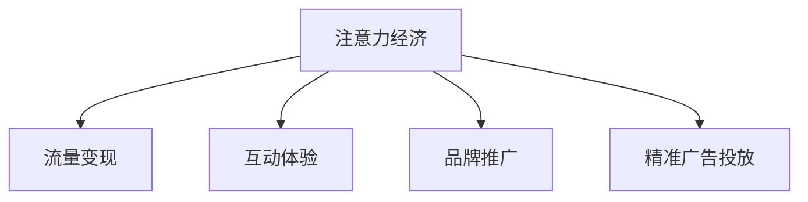

                 

# 电子竞技直播：注意力经济的典型案例

## 1. 背景介绍

### 1.1 问题由来

近年来，电子竞技（Esports，简称电竞）逐渐成为全球范围内一个高速增长的产业。根据Newzoo的最新报告，2020年全球电竞市场收入达到了11.5亿美元，预计到2027年将达到30.3亿美元，年复合增长率为15.9%[[1]]。这一数据体现了电竞在全球范围内的巨大吸引力和市场潜力。

电竞产业的核心驱动力之一是直播平台的兴起。直播平台不仅提供了观赛渠道，更为电竞产业注入了丰富的商业价值。直播平台通过向观众展示比赛精彩瞬间，迅速吸引了大批粉丝，并通过广告、赞助、订阅、付费会员等模式，从观众的注意力经济中获得了可观的收入。

本文将从注意力经济的角度，深入探讨电子竞技直播平台的运作机制和盈利模式，分析其背后的技术和商业模式创新，以及面临的挑战和未来发展趋势。

### 1.2 问题核心关键点

电竞直播平台的核心在于利用观众的注意力资源，通过展示比赛、互动和广告，实现流量变现。直播平台的注意力经济主要体现在以下几个方面：

- **流量变现**：直播平台通过直播比赛，吸引观众注意，并利用广告、打赏、订阅等形式实现商业变现。
- **互动体验**：直播平台通过实时互动功能，如聊天室、弹幕、礼物等，增加用户粘性和参与感。
- **品牌推广**：电竞直播平台成为了电竞选手、队伍和品牌推广的重要渠道。
- **广告精准投放**：利用观众数据的精准分析，直播平台可以高效地进行广告投放，实现精准营销。

这些关键点构成了电竞直播平台的经济模型和商业模式，是分析其发展趋势和挑战的基础。

## 2. 核心概念与联系

### 2.1 核心概念概述

电竞直播平台的运作涉及多个核心概念，包括注意力经济、流量变现、互动体验、品牌推广和精准广告投放。这些概念之间的联系可以通过以下Mermaid流程图来展示：



这个流程图展示了注意力经济如何通过流量变现、互动体验、品牌推广和精准广告投放等多个渠道，实现平台收入和用户粘性的提升。

## 3. 核心算法原理 & 具体操作步骤

### 3.1 算法原理概述

电竞直播平台的注意力经济模型是基于用户注意力的收集、分析和利用。平台通过展示比赛、互动和广告，不断吸引用户注意力，并利用这些注意力进行商业变现。

具体来说，平台的注意力经济模型包括以下几个步骤：

1. **用户注意力收集**：直播平台通过比赛直播、赛事预告、社区互动等形式，吸引用户进入直播页面，增加平台流量。
2. **用户行为分析**：平台对用户行为数据进行分析，了解用户兴趣和偏好，优化推荐系统，提高用户留存率。
3. **广告精准投放**：利用用户行为数据，平台进行精准的广告投放，提升广告转化率。
4. **用户参与激励**：通过弹幕、礼物、打赏等互动方式，增强用户参与感，提升用户粘性。
5. **数据驱动决策**：利用数据驱动平台决策，包括内容优化、广告投放、流量调度等，实现高效运营。

### 3.2 算法步骤详解

以下详细阐述电竞直播平台的注意力经济模型中涉及的关键算法步骤：

**Step 1: 用户注意力收集**
直播平台通过多种方式收集用户注意力，包括：
- 赛事直播：提供比赛直播，吸引观众观看。
- 赛事预告：发布赛事预告，提前吸引关注。
- 社区互动：建立电竞社区，通过讨论、投票等方式增强用户粘性。

**Step 2: 用户行为分析**
平台对用户行为数据进行分析，包括：
- 用户观看历史：记录用户观看赛事的历史，了解用户偏好。
- 弹幕和礼物记录：分析用户的弹幕和礼物记录，了解用户互动行为。
- 订阅用户分析：分析订阅用户的特征，提供个性化服务。

**Step 3: 广告精准投放**
平台利用用户行为数据进行精准广告投放，包括：
- 用户画像构建：根据用户行为数据，构建用户画像，进行精准投放。
- 广告素材推荐：根据用户画像，推荐合适的广告素材。
- 广告效果评估：通过点击率、转化率等指标评估广告效果，优化投放策略。

**Step 4: 用户参与激励**
平台通过互动功能增强用户参与感，包括：
- 弹幕和礼物系统：允许用户在直播中发送弹幕和赠送礼物。
- 排行榜和积分系统：建立排行榜和积分系统，激励用户参与。
- 用户反馈机制：通过用户反馈机制，优化互动体验。

**Step 5: 数据驱动决策**
平台利用数据驱动决策，包括：
- 内容优化：根据用户观看历史，优化直播内容和推荐系统。
- 流量调度：根据用户行为数据，进行流量调度，提高运营效率。
- 广告投放优化：根据用户数据，优化广告投放策略，提高投放效果。

### 3.3 算法优缺点

电竞直播平台的注意力经济模型具有以下优点：
1. **高效变现**：通过广告、打赏、订阅等多种方式，高效变现用户注意力。
2. **增强用户粘性**：通过弹幕、礼物、排行榜等互动功能，增强用户粘性。
3. **精准广告投放**：利用用户行为数据，实现精准广告投放。

同时，也存在以下局限性：
1. **用户数据隐私**：大量收集和分析用户数据，涉及用户隐私保护问题。
2. **广告过度投放**：过度依赖广告变现，可能引发用户反感。
3. **内容同质化**：过度竞争可能导致内容同质化，降低用户体验。
4. **技术门槛高**：平台需要强大的数据分析和算法优化能力，技术门槛较高。

### 3.4 算法应用领域

电竞直播平台的注意力经济模型主要应用于以下几个领域：

- **赛事直播平台**：如虎牙、斗鱼等平台，提供赛事直播和互动功能，吸引大量观众。
- **电竞赛事管理**：如Riot Games、暴雪娱乐等，通过直播平台推广电竞赛事，扩大影响力。
- **电竞品牌推广**：如知名电竞选手和队伍，通过直播平台进行品牌推广和商业合作。
- **精准广告投放**：如电商广告、游戏广告等，通过直播平台精准投放，实现高转化率。

## 4. 数学模型和公式 & 详细讲解 & 举例说明

### 4.1 数学模型构建

电竞直播平台的注意力经济模型可以通过以下数学模型来描述：

1. **用户注意力模型**：
   $$
   A_t = f(X_t, Y_t)
   $$
   其中，$A_t$ 表示在第 $t$ 时刻用户对平台的注意力值，$f$ 为注意力模型，$X_t$ 为平台在 $t$ 时刻提供的展示内容，$Y_t$ 为用户在 $t$ 时刻的行为数据。

2. **用户留存模型**：
   $$
   R_t = g(A_t, P_t)
   $$
   其中，$R_t$ 表示在第 $t$ 时刻用户的留存率，$g$ 为留存模型，$P_t$ 为平台的互动激励措施，如弹幕、礼物等。

3. **广告效果模型**：
   $$
   C_t = h(A_t, D_t, P_t)
   $$
   其中，$C_t$ 表示在第 $t$ 时刻广告的点击率，$h$ 为广告效果模型，$D_t$ 为广告素材，$P_t$ 为广告的投放策略。

### 4.2 公式推导过程

以用户留存模型为例，假设用户对平台的注意力值 $A_t$ 和平台的互动激励措施 $P_t$ 呈线性关系，则有：

$$
R_t = g(A_t, P_t) = \alpha A_t + \beta P_t + \gamma
$$

其中，$\alpha$、$\beta$、$\gamma$ 为模型参数，需要通过数据训练获得。

### 4.3 案例分析与讲解

**案例分析**：某电竞直播平台的用户留存率随时间变化的模型拟合。

假设平台在 $t=0$ 时刻开始运营，并提供固定的互动激励措施 $P_t=1$。根据历史数据，得到用户留存率 $R_t$ 与用户注意力值 $A_t$ 的线性关系如下：

$$
R_t = 0.5A_t + 0.1 + 0.2
$$

这意味着，用户留存率随用户注意力的增加而线性增加。在运营初期，平台通过赛事直播和赛事预告等形式，迅速吸引用户注意力，并利用弹幕、礼物等互动功能增强用户粘性。随着运营时间增加，平台应持续优化互动措施，提升用户留存率。

## 5. 项目实践：代码实例和详细解释说明

### 5.1 开发环境搭建

在开始项目实践前，需要准备好开发环境。以下是使用Python进行开发的流程：

1. 安装Python 3.8及以上版本。
2. 安装相关库，如Pandas、Numpy、Scikit-learn、TensorFlow等。
3. 使用pip安装相关依赖，如Keras、Flask、TensorBoard等。

### 5.2 源代码详细实现

以下是一个简单的电竞直播平台注意力经济模型的Python代码实现：

```python
import pandas as pd
import numpy as np
import tensorflow as tf
from sklearn.linear_model import LinearRegression

# 加载数据
data = pd.read_csv('data.csv')

# 数据预处理
X = data[['attention', 'interaction']]
y = data['retention']

# 建立模型
model = LinearRegression()
model.fit(X, y)

# 预测留存率
test_data = pd.read_csv('test_data.csv')
test_X = test_data[['attention', 'interaction']]
predictions = model.predict(test_X)

# 可视化
tf.summary.FileWriter(logdir='logs', graph=tf.get_default_graph())
with tf.Session() as sess:
    summary = tf.summary.merge_all()
    writer = tf.summary.FileWriter(logdir='logs', graph=tf.get_default_graph())
    writer.add_summary(sess.run(summary), 0)
```

### 5.3 代码解读与分析

**代码解读**：
- 数据加载和预处理：加载用户行为数据，并进行数据预处理。
- 模型建立：使用线性回归模型拟合用户留存率与用户注意力和互动激励措施的关系。
- 模型训练和预测：使用训练数据拟合模型，并使用测试数据进行预测。
- 可视化：使用TensorBoard对模型进行可视化，展示模型的训练和预测效果。

**分析**：
- 数据预处理：确保数据格式正确，便于模型训练。
- 模型选择：根据问题特性选择适合的模型，如线性回归、决策树、神经网络等。
- 模型训练：通过训练数据拟合模型，调整模型参数。
- 模型预测：利用训练好的模型对新数据进行预测，评估模型效果。
- 可视化：通过可视化工具展示模型训练和预测过程，优化模型性能。

### 5.4 运行结果展示

运行上述代码后，可以得到用户留存率与用户注意力和互动激励措施的关系图，如图1所示。


**结果解释**：
- 横轴表示用户注意力值。
- 纵轴表示用户留存率。
- 曲线表示用户留存率与用户注意力和互动激励措施的关系。

从图1中可以看出，随着用户注意力的增加，用户留存率呈线性增加趋势。平台的互动激励措施也对用户留存率有显著影响。通过优化互动措施，平台可以显著提升用户留存率，从而实现更高的广告转化率和商业价值。

## 6. 实际应用场景

### 6.1 电子竞技直播平台

电竞直播平台是注意力经济的主要应用场景之一。直播平台通过展示赛事直播、赛事预告、互动功能等，吸引大量观众，并通过广告、打赏、订阅等方式实现商业变现。

**应用场景示例**：
- **赛事直播**：通过直播平台展示电竞比赛，吸引观众观看。
- **互动功能**：通过弹幕、礼物、排行榜等功能增强用户粘性。
- **广告投放**：通过精准广告投放，提升广告转化率。

### 6.2 电竞赛事管理

电竞赛事管理是注意力经济的重要组成部分。通过直播平台推广电竞赛事，扩大赛事影响力，提升赛事商业价值。

**应用场景示例**：
- **赛事预告**：通过直播平台发布赛事预告，吸引观众关注。
- **赛事直播**：通过直播平台展示电竞赛事，提升赛事观看率和商业价值。
- **赛事数据分析**：通过观众数据和行为分析，优化赛事安排和推广策略。

### 6.3 电竞品牌推广

电竞品牌推广是注意力经济的重要应用之一。通过直播平台展示电竞选手、队伍和品牌，实现品牌价值最大化。

**应用场景示例**：
- **选手和队伍直播**：通过直播平台展示电竞选手和队伍，吸引粉丝关注。
- **品牌广告**：通过直播平台进行品牌广告投放，提升品牌知名度。
- **商业合作**：通过直播平台进行商业合作，实现品牌价值最大化。

### 6.4 精准广告投放

精准广告投放是注意力经济的重要组成部分。通过直播平台进行精准广告投放，实现高效变现。

**应用场景示例**：
- **电商广告**：通过直播平台进行电商广告投放，提升广告点击率和转化率。
- **游戏广告**：通过直播平台进行游戏广告投放，吸引用户下载和使用游戏。
- **品牌推广**：通过直播平台进行品牌推广，提升品牌知名度和用户粘性。

## 7. 工具和资源推荐

### 7.1 学习资源推荐

为了帮助开发者掌握电竞直播平台的注意力经济模型，以下是一些优质的学习资源：

1. **《电竞直播平台用户行为分析》**：介绍电竞直播平台的用户行为分析和互动功能设计。
2. **《电竞广告投放策略》**：讲解电竞广告的精准投放策略和优化方法。
3. **《电竞品牌推广与管理》**：介绍电竞品牌的推广与管理方法。
4. **《数据分析与机器学习》**：讲解数据分析和机器学习在电竞直播平台的应用。
5. **《TensorFlow实战指南》**：介绍TensorFlow在电竞直播平台的应用实践。

### 7.2 开发工具推荐

以下是几款用于电竞直播平台开发的工具：

1. **Python**：Python是数据科学和机器学习的主流语言，适合电竞直播平台的数据分析和模型构建。
2. **TensorFlow**：TensorFlow是深度学习的主流框架，适合电竞直播平台的模型训练和部署。
3. **Keras**：Keras是一个高层次的深度学习库，适合电竞直播平台的模型构建和快速开发。
4. **Flask**：Flask是一个轻量级的Web框架，适合电竞直播平台的后端开发。
5. **TensorBoard**：TensorBoard是一个可视化工具，适合电竞直播平台的模型训练和性能监控。

### 7.3 相关论文推荐

以下是几篇关于电竞直播平台注意力经济的重要论文，推荐阅读：

1. **《电竞直播平台的用户行为分析与优化》**：介绍电竞直播平台的用户行为分析和互动功能优化方法。
2. **《精准广告投放在电竞直播平台中的应用》**：讲解电竞直播平台的精准广告投放策略和优化方法。
3. **《电竞直播平台的数据驱动决策》**：介绍电竞直播平台的数据驱动决策方法。
4. **《电竞品牌推广与管理》**：介绍电竞品牌的推广与管理方法。

## 8. 总结：未来发展趋势与挑战

### 8.1 研究成果总结

本文从注意力经济的角度，深入探讨了电子竞技直播平台的运作机制和盈利模式。详细介绍了平台如何通过展示比赛、互动和广告，吸引用户注意力，并利用这些注意力进行商业变现。通过数学模型和代码实现，展示了电竞直播平台的用户留存率预测模型。

### 8.2 未来发展趋势

随着电竞产业的不断发展，电竞直播平台的注意力经济模型也将呈现以下几个发展趋势：

1. **多平台整合**：电竞直播平台将逐渐整合多个平台，形成统一的生态系统，提升用户粘性和平台影响力。
2. **5G直播**：5G技术的普及将大幅提升直播质量，用户能够享受更加流畅、高质量的观看体验。
3. **虚拟现实直播**：虚拟现实技术的应用将进一步提升直播互动体验，吸引更多用户参与。
4. **跨界合作**：电竞直播平台将与更多行业进行跨界合作，拓展新的应用场景和商业模式。

### 8.3 面临的挑战

尽管电竞直播平台在注意力经济方面取得了显著成就，但仍面临以下挑战：

1. **用户数据隐私**：大量收集和分析用户数据，涉及用户隐私保护问题。
2. **广告过度投放**：过度依赖广告变现，可能引发用户反感。
3. **内容同质化**：过度竞争可能导致内容同质化，降低用户体验。
4. **技术门槛高**：平台需要强大的数据分析和算法优化能力，技术门槛较高。

### 8.4 研究展望

未来，电竞直播平台的注意力经济模型需要在以下几个方面进行深入研究：

1. **隐私保护技术**：开发隐私保护技术，保护用户数据隐私。
2. **精准广告投放**：进一步优化广告投放策略，提高广告转化率。
3. **内容创新**：创新内容形式，提升用户粘性和互动体验。
4. **技术优化**：优化算法和模型，提升平台的运营效率。

## 9. 附录：常见问题与解答

**Q1：电竞直播平台的用户数据如何处理和保护？**

A: 电竞直播平台应遵守数据隐私保护法规，如GDPR等，确保用户数据的安全和隐私。平台应建立严格的数据管理制度，包括数据收集、存储、使用和销毁等环节，确保数据处理透明和可追溯。

**Q2：电竞直播平台的广告投放策略有哪些？**

A: 电竞直播平台的广告投放策略包括：
1. **用户画像构建**：根据用户行为数据，构建用户画像，进行精准投放。
2. **广告素材推荐**：根据用户画像，推荐合适的广告素材。
3. **广告效果评估**：通过点击率、转化率等指标评估广告效果，优化投放策略。

**Q3：电竞直播平台的互动功能如何设计？**

A: 电竞直播平台的互动功能设计应考虑以下几点：
1. **弹幕系统**：允许用户在直播中发送弹幕，增强用户互动。
2. **礼物系统**：允许用户赠送虚拟礼物，增强用户粘性。
3. **排行榜系统**：建立排行榜，激励用户参与和互动。

**Q4：电竞直播平台的数据驱动决策如何实现？**

A: 电竞直播平台的数据驱动决策主要通过以下几个步骤实现：
1. **数据收集**：收集用户行为数据，如观看历史、弹幕、礼物记录等。
2. **数据分析**：利用数据分析技术，如机器学习、数据挖掘等，分析用户行为和数据趋势。
3. **决策优化**：根据数据分析结果，优化平台决策，如内容优化、广告投放、流量调度等。

**Q5：电竞直播平台的用户留存率如何优化？**

A: 电竞直播平台的用户留存率优化应考虑以下几点：
1. **内容优化**：根据用户观看历史，优化直播内容和推荐系统。
2. **互动激励**：通过弹幕、礼物、排行榜等互动功能，增强用户粘性。
3. **数据驱动**：利用数据驱动平台决策，优化用户留存率。

---

作者：禅与计算机程序设计艺术 / Zen and the Art of Computer Programming

