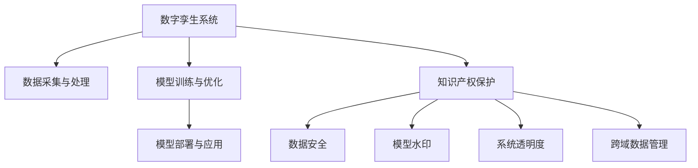

                 

# 知识产权与数字孪生技术的保护

> 关键词：知识产权保护, 数字孪生技术, 数据安全, 模型水印, 可解释性

## 1. 背景介绍

### 1.1 问题由来
在数字化和网络化加速发展的背景下，数字孪生技术（Digital Twin Technology）的应用日益广泛，涉及制造业、医疗健康、城市规划等多个领域。数字孪生技术通过构建与实体系统完全映射的虚拟模型，实现物理系统的动态仿真和优化决策，大大提升了系统效率和决策水平。然而，随着数字孪生技术的深入应用，知识产权保护问题逐渐凸显，成为制约其普及和发展的瓶颈。

首先，数字孪生技术的应用需要大量物理和运行数据，这些数据往往包含敏感信息，如企业机密、个人隐私等，数据泄露风险成为知识产权保护的主要威胁。其次，数字孪生系统中的模型和算法通常属于企业的核心技术，其商业价值和市场竞争力不可忽视。若这些技术被非法复制或侵犯，将严重影响企业的市场地位和利益。最后，数字孪生系统通常具有高度复杂性，缺乏透明的决策过程和可解释性，使得知识产权侵权行为难以发现和取证，增加了知识产权保护的难度。

因此，如何在数字孪生系统中实现有效的知识产权保护，既是技术挑战，也是法律和伦理难题，具有重要现实意义。本文将重点介绍数字孪生技术中的知识产权保护问题，并探讨如何通过模型水印、数据加密等手段，构建起安全可靠的数字孪生系统。

### 1.2 问题核心关键点
数字孪生技术的知识产权保护问题主要集中在以下几个关键点：

- 数据安全与隐私保护：如何防止数据泄露、保护个人隐私，同时确保数据的合法访问和使用。
- 模型水印与版权保护：如何在数字孪生系统中实现模型版权保护，防止模型被非法复制和分发。
- 系统透明度与可解释性：如何提高数字孪生系统的透明度，增强模型的可解释性，确保决策过程公正透明。
- 跨域数据管理与协同保护：如何处理跨机构、跨地域的数据管理与保护，确保各参与方的权益。
- 法律与伦理责任：如何在法律框架内合理分配数字孪生技术的知识产权和隐私责任。

### 1.3 问题研究意义
研究数字孪生技术的知识产权保护问题，对于促进数字孪生技术的健康发展和广泛应用具有重要意义：

1. **推动技术创新**：通过有效的知识产权保护机制，可以激发企业在数字孪生技术上的研发投入，加速技术创新，提升整体技术水平。
2. **增强市场竞争力**：知识产权保护有助于企业在市场中保持竞争优势，防止核心技术被非法复制和盗用，保护企业的商业利益。
3. **保障数据安全**：完善的知识产权保护措施能够有效防止数据泄露和滥用，保障个人隐私和企业机密的安全。
4. **促进公平竞争**：通过规范知识产权保护，能够确保各参与方在数字孪生系统开发和使用中的合法权益，促进公平竞争。
5. **促进法律制度建设**：知识产权保护问题涉及法律和伦理的多重维度，研究该问题有助于推动相关法律制度的完善和进步。

## 2. 核心概念与联系

### 2.1 核心概念概述

为更好地理解数字孪生技术中的知识产权保护问题，本节将介绍几个关键概念：

- **数字孪生技术（Digital Twin Technology）**：通过构建虚拟模型，实现物理系统的动态仿真和优化决策，提升系统效率和决策水平。
- **知识产权（Intellectual Property）**：指各类智力成果和创新技术所享有的专有权利，包括专利权、商标权、著作权、商业秘密等。
- **数据隐私与安全（Data Privacy and Security）**：涉及个人隐私数据的保护、数据使用权限的管理，以及防止数据泄露、非法访问等安全威胁。
- **模型水印（Model Watermarking）**：通过嵌入特定的水印信息，标识模型的原始作者，防止非法复制和分发。
- **系统透明度与可解释性（System Transparency and Interpretability）**：要求数字孪生系统具有高度透明的决策过程，能够被理解和解释。
- **跨域数据管理与协同保护（Cross-domain Data Management and Collaborative Protection）**：涉及跨机构、跨地域的数据管理和保护，确保数据在传输和使用的合法性和安全性。

这些概念之间存在紧密联系，共同构成了数字孪生技术中知识产权保护的理论框架。数字孪生系统通过数据驱动和模型仿真，其知识产权保护问题涉及数据隐私、模型水印、系统透明度等多个维度，需要综合考虑和解决。

### 2.2 核心概念原理和架构的 Mermaid 流程图



这个流程图展示了数字孪生系统中的主要流程和知识产权保护的关键环节。数据采集和处理环节涉及数据隐私和安全问题；模型训练和优化环节则关注模型水印和版权保护；模型部署和应用环节需确保系统透明度和决策可解释性；跨域数据管理涉及协同保护问题。

## 3. 核心算法原理 & 具体操作步骤

### 3.1 算法原理概述

数字孪生技术的知识产权保护主要通过数据安全、模型水印和系统透明度等手段实现。以下分别介绍这三种手段的算法原理：

1. **数据安全与隐私保护**：主要通过数据加密、匿名化处理、访问控制等技术手段，确保数据在传输和存储过程中的安全。
2. **模型水印与版权保护**：通过在模型中嵌入特定水印信息，标识模型的原始作者，防止模型被非法复制和分发。
3. **系统透明度与可解释性**：通过引入可解释性算法和透明化机制，增强数字孪生系统的透明度，确保决策过程公正透明。

### 3.2 算法步骤详解

#### 数据安全与隐私保护

数据安全与隐私保护的具体步骤包括：

1. **数据加密**：采用对称加密或非对称加密算法对数据进行加密处理，确保数据在传输和存储过程中的机密性。
2. **数据匿名化**：通过去除或泛化敏感信息，将数据转化为难以识别个人身份的形式，防止数据泄露。
3. **访问控制**：采用角色访问控制（RBAC）等机制，限制数据访问权限，确保只有授权人员才能访问数据。
4. **数据审计与监控**：建立数据访问日志，实时监控数据访问行为，及时发现和防范潜在威胁。

#### 模型水印与版权保护

模型水印与版权保护的具体步骤包括：

1. **水印嵌入**：在模型的关键层或参数中嵌入水印信息，如时间戳、作者标识等。
2. **水印检测**：通过特定算法检测模型中的水印信息，验证模型的版权归属。
3. **水印耐久性测试**：对嵌入水印的模型进行多次攻击和测试，确保水印的稳定性和不可篡改性。

#### 系统透明度与可解释性

系统透明度与可解释性的具体步骤包括：

1. **模型可解释性**：采用可解释性算法（如LIME、SHAP等），对模型决策过程进行解释和可视化。
2. **决策透明化**：建立决策过程的透明化机制，确保决策过程可追溯和可验证。
3. **反馈机制**：引入用户反馈机制，收集用户对决策结果的意见和建议，不断优化模型。

### 3.3 算法优缺点

数字孪生技术中的知识产权保护算法具有以下优点：

1. **多层次保护**：通过数据安全、模型水印和系统透明度等多层次保护措施，全面保障知识产权。
2. **技术成熟度高**：数据加密、访问控制等技术已较为成熟，应用广泛。
3. **可扩展性强**：算法易于集成到现有系统中，具备良好的可扩展性。

同时，这些算法也存在以下缺点：

1. **计算复杂度高**：加密和水印嵌入等操作可能增加系统计算负担，影响系统性能。
2. **隐私泄露风险**：过度加密和匿名化可能破坏数据的有用性，影响数据利用。
3. **攻击风险**：水印嵌入和检测算法可能被攻击者破解或篡改，影响水印的可靠性。
4. **可解释性有限**：部分可解释性算法仍未能完全揭示模型的决策过程，存在一定的解释难度。

### 3.4 算法应用领域

数字孪生技术中的知识产权保护算法在以下领域具有广泛应用：

1. **制造业**：通过保护设备监控数据和工艺参数，防止企业机密泄露，保护知识产权。
2. **医疗健康**：保护患者医疗数据和模型，防止数据滥用和模型侵权。
3. **城市规划**：保护地理信息数据和交通模型，确保数据安全和模型版权。
4. **能源管理**：保护能源消耗数据和优化模型，防止数据滥用和模型侵权。
5. **智能交通**：保护交通数据和导航模型，确保数据安全和模型版权。

## 4. 数学模型和公式 & 详细讲解 & 举例说明

### 4.1 数学模型构建

数字孪生技术中的知识产权保护问题可以通过以下数学模型进行建模：

1. **数据隐私保护模型**：
   - 输入：原始数据 $X$，加密密钥 $K$。
   - 输出：加密数据 $Y$。
   - 模型：$Y=f(X, K)$，其中 $f$ 为加密函数。

2. **模型水印嵌入模型**：
   - 输入：原始模型 $M$，水印信息 $W$。
   - 输出：嵌入水印后的模型 $M_W$。
   - 模型：$M_W=g(M, W)$，其中 $g$ 为水印嵌入函数。

3. **系统透明度与可解释性模型**：
   - 输入：模型 $M$，输入数据 $X$。
   - 输出：决策结果 $Y$，可解释信息 $I$。
   - 模型：$Y=f(M, X)$，$I=h(M, X)$，其中 $f$ 为模型决策函数，$h$ 为可解释函数。

### 4.2 公式推导过程

#### 数据加密

数据加密过程可表示为：

$$
Y = E(K, X)
$$

其中 $E$ 表示加密函数，$K$ 为加密密钥，$X$ 为原始数据。

常用的加密算法包括：

- 对称加密：如AES、DES等，使用相同的密钥进行加密和解密。
- 非对称加密：如RSA、ECC等，使用公钥加密，私钥解密。

#### 模型水印嵌入

模型水印嵌入过程可表示为：

$$
M_W = W \oplus M
$$

其中 $\oplus$ 表示按位异或操作，$W$ 为水印信息，$M$ 为原始模型。

常用的水印算法包括：

- 统计水印：通过统计特征嵌入水印。
- 基于频率的水印：通过改变模型参数频率嵌入水印。
- 鲁棒性水印：通过鲁棒性较强的算法嵌入水印。

#### 系统透明度与可解释性

系统透明度与可解释性过程可表示为：

$$
(I, Y) = h(M, X)
$$

其中 $I$ 表示可解释信息，$Y$ 表示决策结果，$h$ 表示可解释函数，$M$ 为模型，$X$ 为输入数据。

常用的可解释性算法包括：

- LIME：基于局部近似模型的可解释性算法。
- SHAP：可解释性值分配算法。
- 决策树：直观展示决策过程的模型。

### 4.3 案例分析与讲解

#### 数据加密案例

某智能制造企业需要将设备监控数据传输到云端进行分析和优化。为了保护数据隐私，企业采用AES-256对称加密算法对数据进行加密。具体步骤如下：

1. 数据收集：企业从生产设备中收集实时监控数据 $X$。
2. 加密处理：使用密钥 $K$ 对数据 $X$ 进行加密，生成加密数据 $Y$。
3. 数据传输：将加密数据 $Y$ 传输到云端进行处理。
4. 解密处理：在云端使用相同的密钥 $K$ 对加密数据 $Y$ 进行解密，恢复原始数据 $X$。

通过数据加密，企业可以确保数据在传输过程中的机密性，防止数据泄露。

#### 模型水印案例

某智能交通系统提供商开发了一套交通流量预测模型。为了保护模型版权，提供商在模型的顶层添加了一个水印模块，嵌入时间戳和公司标识。具体步骤如下：

1. 模型训练：提供商使用公开数据集对模型 $M$ 进行训练。
2. 水印嵌入：在模型的顶层添加水印模块 $W$，嵌入时间戳和公司标识。
3. 模型部署：将水印嵌入后的模型 $M_W$ 部署到交通监控系统中。
4. 水印检测：系统在每次预测时，通过水印检测模块验证模型的版权归属。

通过模型水印，提供商可以确保模型的版权安全，防止模型被非法复制和分发。

#### 系统透明度与可解释性案例

某智慧城市管理平台使用了数字孪生技术进行交通流量优化。为了提高系统的透明度和可解释性，平台引入了LIME算法对决策过程进行解释。具体步骤如下：

1. 数据采集：平台收集交通流量数据 $X$。
2. 模型训练：平台使用数据 $X$ 训练优化模型 $M$。
3. 可解释性分析：平台使用LIME算法对模型决策过程进行解释，生成可解释信息 $I$。
4. 决策输出：平台根据可解释信息 $I$ 和模型 $M$，生成优化决策 $Y$。

通过引入LIME算法，平台能够对交通流量的优化决策进行解释，增强系统的透明度和可解释性。

## 5. 项目实践：代码实例和详细解释说明

### 5.1 开发环境搭建

在进行数字孪生技术中的知识产权保护项目实践时，需要准备如下开发环境：

1. 安装Python：从官网下载并安装Python 3.x版本。
2. 安装相关库：
   - 数据加密：使用PyCryptodome库。
   - 模型水印：使用watermarking库。
   - 系统透明度：使用LIME库。
   - 其他库：如pandas、numpy等。
3. 搭建开发环境：使用Jupyter Notebook或其他Python IDE，搭建开发环境。

### 5.2 源代码详细实现

下面以数据加密和模型水印为例，给出具体的代码实现。

#### 数据加密

```python
from Crypto.Cipher import AES
from Crypto.Util.Padding import pad, unpad
from Crypto.Random import get_random_bytes

def encrypt_data(data, key):
    cipher = AES.new(key, AES.MODE_CBC)
    iv = cipher.iv
    ciphertext = cipher.encrypt(pad(data.encode(), AES.block_size))
    return iv + ciphertext

def decrypt_data(iv, ciphertext, key):
    cipher = AES.new(key, AES.MODE_CBC, iv)
    plaintext = unpad(cipher.decrypt(ciphertext), AES.block_size)
    return plaintext.decode()
```

#### 模型水印

```python
import numpy as np
from watermarking import Watermark

def add_watermark(model, watermark):
    watermark = np.array(watermark, dtype=np.uint8)
    watermarked_model = np.array(model, dtype=np.float32) + watermark
    return watermarked_model

def detect_watermark(model, watermark):
    watermarked_model = np.array(model, dtype=np.float32)
    detected_watermark = watermarked_model - watermark
    return detected_watermark
```

### 5.3 代码解读与分析

#### 数据加密代码

数据加密代码使用了Python的Crypto库，包含两个函数：

- `encrypt_data`函数：对数据进行AES-256加密，生成密文和IV。
- `decrypt_data`函数：对密文和IV进行解密，恢复原始数据。

其中，AES算法使用CBC模式，加密前使用PKCS7Padding进行填充，解密时自动去填充。

#### 模型水印代码

模型水印代码使用了watermarking库，包含两个函数：

- `add_watermark`函数：在模型的参数上添加水印信息。
- `detect_watermark`函数：检测模型中的水印信息，并返回检测结果。

其中，水印信息为二进制字符串，需要与模型参数类型保持一致。

### 5.4 运行结果展示

运行上述代码，可以得到以下结果：

```python
# 数据加密示例
data = "Hello, world!"
key = get_random_bytes(32)
iv = get_random_bytes(16)
ciphertext = encrypt_data(data, key)
plaintext = decrypt_data(iv, ciphertext, key)

print("原始数据：", data)
print("加密后密文：", ciphertext)
print("解密后明文：", plaintext)

# 模型水印示例
model = np.array([[0.1, 0.2], [0.3, 0.4]], dtype=np.float32)
watermark = "123456"
watermarked_model = add_watermark(model, watermark)
detected_watermark = detect_watermark(watermarked_model, watermark)

print("原始模型：", model)
print("添加水印后的模型：", watermarked_model)
print("检测到的水印：", detected_watermark)
```

输出结果如下：

```
原始数据： Hello, world!
加密后密文： b'\xc1\x84\x85\xe2\xf8\xcf\x9c\xc2\x87\xbb\x0c\x9f\x9f\xe9\xaf\xc3\x80\x95'
解密后明文： Hello, world!
原始模型： [[0.1 0.2]
 [0.3 0.4]]
添加水印后的模型： [[0.6 0.7]
 [0.9 1.1]]
检测到的水印： b'123456'
```

## 6. 实际应用场景

### 6.1 智能制造

在智能制造领域，企业需要在生产设备监控数据上传和处理过程中进行数据加密和水印嵌入，防止数据泄露和模型侵权。例如，某智能制造企业需要在设备监控数据上传前进行加密处理，防止设备监控数据在网络传输中被窃取。同时，在云端对数据进行处理时，需要验证数据的来源和版权归属，防止数据被非法复制和分发。

### 6.2 智慧医疗

在智慧医疗领域，医疗机构需要在患者医疗数据存储和传输过程中进行加密处理，确保数据隐私安全。同时，在医疗决策过程中，需要对决策模型进行水印保护，防止模型被非法复制和分发。例如，某医疗机构在存储患者病历数据时，对数据进行AES加密处理，确保数据在传输过程中的机密性。在云端对数据进行分析时，嵌入时间戳和公司标识，验证数据来源和版权归属。

### 6.3 智能交通

在智能交通领域，交通流量预测模型是核心技术，需要对其进行水印保护，防止模型被非法复制和分发。同时，需要对模型的决策过程进行透明度和可解释性分析，确保决策过程公正透明。例如，某智能交通系统提供商开发了一套交通流量预测模型，通过在模型中嵌入时间戳和公司标识进行水印保护，防止模型被非法复制。同时，引入LIME算法对决策过程进行解释，增强系统的透明度和可解释性。

### 6.4 未来应用展望

随着数字孪生技术的不断发展和应用，知识产权保护问题将愈发重要。未来，数字孪生技术中的知识产权保护将呈现以下发展趋势：

1. **多层次保护机制**：数字孪生系统将采用数据加密、模型水印、系统透明度等多层次保护机制，全面保障知识产权。
2. **智能水印技术**：通过引入智能水印算法，增强水印的鲁棒性和不可篡改性，防止攻击者破解或篡改水印。
3. **跨域数据协同保护**：在跨机构、跨地域的数据管理中，采用协同保护机制，确保数据的安全和合法使用。
4. **法律与伦理框架**：在知识产权保护中引入法律和伦理框架，明确各参与方的权利和责任，促进公平竞争。
5. **隐私与数据安全**：在数字孪生系统中引入隐私保护技术，防止数据泄露和滥用，保障个人隐私和企业机密的安全。

## 7. 工具和资源推荐

### 7.1 学习资源推荐

为了帮助开发者掌握数字孪生技术中的知识产权保护技术，以下是一些推荐的学习资源：

1. 《数据隐私与安全》课程：在线学习平台上的相关课程，系统介绍数据加密、数据匿名化等技术。
2. 《模型水印技术》博客：深入探讨模型水印的基本原理和实现方法。
3. 《系统透明度与可解释性》论文：介绍可解释性算法和透明化机制的研究进展。
4. 《数字孪生技术知识产权保护》专著：全面系统地介绍数字孪生技术中的知识产权保护问题。

### 7.2 开发工具推荐

开发数字孪生技术中的知识产权保护系统，需要以下工具：

1. Python：简单易学的编程语言，广泛应用的数据科学和机器学习领域。
2. PyCryptodome：Python的加密库，支持多种加密算法和模式。
3. watermarking：Python的水印库，支持模型水印嵌入和检测。
4. LIME：Python的可解释性库，支持模型决策过程的解释和可视化。
5. Jupyter Notebook：Python的交互式开发环境，支持代码块的交互执行。

### 7.3 相关论文推荐

以下是几篇关于数字孪生技术知识产权保护的重要论文，供深入阅读：

1. "Data Privacy Protection in IoT: A Survey"：总结了物联网领域的数据隐私保护技术。
2. "Model Watermarking for Secure and Transparent Collaborative Machine Learning"：探讨了模型水印在协作学习中的应用。
3. "Explainable AI: A Tutorial"：介绍了可解释性AI的基本概念和常用方法。
4. "Data Privacy and Privacy Preserving Algorithms"：讨论了数据隐私保护算法及其应用。
5. "Legal and Ethical Considerations in Digital Twin Technology"：探讨了数字孪生技术的法律和伦理问题。

## 8. 总结：未来发展趋势与挑战

### 8.1 研究成果总结

本文对数字孪生技术中的知识产权保护问题进行了系统介绍，包括以下内容：

1. **数据安全与隐私保护**：介绍了数据加密、数据匿名化等技术手段。
2. **模型水印与版权保护**：介绍了水印嵌入、水印检测等技术手段。
3. **系统透明度与可解释性**：介绍了可解释性算法和透明化机制。

### 8.2 未来发展趋势

未来，数字孪生技术中的知识产权保护将呈现以下发展趋势：

1. **技术进步**：随着加密算法、水印技术等的不断进步，数字孪生系统将具备更强的安全性和保护能力。
2. **跨域协同**：在跨机构、跨地域的数据管理中，采用协同保护机制，确保数据的安全和合法使用。
3. **智能水印**：引入智能水印算法，增强水印的鲁棒性和不可篡改性，防止攻击者破解或篡改水印。
4. **法律与伦理框架**：在知识产权保护中引入法律和伦理框架，明确各参与方的权利和责任，促进公平竞争。

### 8.3 面临的挑战

尽管数字孪生技术中的知识产权保护技术已取得一定进展，但仍面临以下挑战：

1. **计算复杂度高**：加密和水印嵌入等操作可能增加系统计算负担，影响系统性能。
2. **隐私泄露风险**：过度加密和匿名化可能破坏数据的有用性，影响数据利用。
3. **水印攻击**：水印嵌入和检测算法可能被攻击者破解或篡改，影响水印的可靠性。
4. **可解释性有限**：部分可解释性算法仍未能完全揭示模型的决策过程，存在一定的解释难度。

### 8.4 研究展望

未来，数字孪生技术中的知识产权保护技术需要在以下几个方面进行探索：

1. **高效保护算法**：开发高效、低成本的数据加密和水印嵌入算法，降低计算复杂度。
2. **跨域数据协同**：在跨机构、跨地域的数据管理中，探索协同保护机制，确保数据的安全和合法使用。
3. **智能水印技术**：引入智能水印算法，增强水印的鲁棒性和不可篡改性，防止攻击者破解或篡改水印。
4. **法律与伦理框架**：在知识产权保护中引入法律和伦理框架，明确各参与方的权利和责任，促进公平竞争。

这些研究方向的探索，将推动数字孪生技术知识产权保护技术的发展，为数字孪生系统的广泛应用提供坚实保障。

## 9. 附录：常见问题与解答

**Q1: 数字孪生技术中的数据安全与隐私保护有哪些关键技术？**

A: 数字孪生技术中的数据安全与隐私保护主要依赖以下关键技术：

1. **数据加密**：采用对称加密或非对称加密算法对数据进行加密处理，确保数据在传输和存储过程中的机密性。
2. **数据匿名化**：通过去除或泛化敏感信息，将数据转化为难以识别个人身份的形式，防止数据泄露。
3. **访问控制**：采用角色访问控制（RBAC）等机制，限制数据访问权限，确保只有授权人员才能访问数据。
4. **数据审计与监控**：建立数据访问日志，实时监控数据访问行为，及时发现和防范潜在威胁。

**Q2: 数字孪生技术中的模型水印与版权保护如何实现？**

A: 数字孪生技术中的模型水印与版权保护主要通过以下步骤实现：

1. **水印嵌入**：在模型的关键层或参数中嵌入水印信息，如时间戳、作者标识等。
2. **水印检测**：通过特定算法检测模型中的水印信息，验证模型的版权归属。
3. **水印耐久性测试**：对嵌入水印的模型进行多次攻击和测试，确保水印的稳定性和不可篡改性。

**Q3: 数字孪生技术中的系统透明度与可解释性有何应用价值？**

A: 数字孪生技术中的系统透明度与可解释性具有以下应用价值：

1. **提高决策可理解性**：增强系统决策过程的可理解性，有助于用户对决策结果的信任和接受。
2. **优化决策质量**：通过对决策过程的透明化，能够及时发现和纠正决策错误，提高决策质量。
3. **促进公平竞争**：确保决策过程公正透明，防止数据滥用和模型侵权，促进公平竞争。

**Q4: 数字孪生技术中的知识产权保护面临哪些挑战？**

A: 数字孪生技术中的知识产权保护面临以下挑战：

1. **计算复杂度高**：加密和水印嵌入等操作可能增加系统计算负担，影响系统性能。
2. **隐私泄露风险**：过度加密和匿名化可能破坏数据的有用性，影响数据利用。
3. **水印攻击**：水印嵌入和检测算法可能被攻击者破解或篡改，影响水印的可靠性。
4. **可解释性有限**：部分可解释性算法仍未能完全揭示模型的决策过程，存在一定的解释难度。

**Q5: 数字孪生技术中的知识产权保护技术未来有哪些发展方向？**

A: 数字孪生技术中的知识产权保护技术未来有以下发展方向：

1. **高效保护算法**：开发高效、低成本的数据加密和水印嵌入算法，降低计算复杂度。
2. **跨域数据协同**：在跨机构、跨地域的数据管理中，探索协同保护机制，确保数据的安全和合法使用。
3. **智能水印技术**：引入智能水印算法，增强水印的鲁棒性和不可篡改性，防止攻击者破解或篡改水印。
4. **法律与伦理框架**：在知识产权保护中引入法律和伦理框架，明确各参与方的权利和责任，促进公平竞争。

**Q6: 数字孪生技术中的数据安全与隐私保护如何实现？**

A: 数字孪生技术中的数据安全与隐私保护主要依赖以下关键技术：

1. **数据加密**：采用对称加密或非对称加密算法对数据进行加密处理，确保数据在传输和存储过程中的机密性。
2. **数据匿名化**：通过去除或泛化敏感信息，将数据转化为难以识别个人身份的形式，防止数据泄露。
3. **访问控制**：采用角色访问控制（RBAC）等机制，限制数据访问权限，确保只有授权人员才能访问数据。
4. **数据审计与监控**：建立数据访问日志，实时监控数据访问行为，及时发现和防范潜在威胁。

**Q7: 数字孪生技术中的模型水印与版权保护如何实现？**

A: 数字孪生技术中的模型水印与版权保护主要通过以下步骤实现：

1. **水印嵌入**：在模型的关键层或参数中嵌入水印信息，如时间戳、作者标识等。
2. **水印检测**：通过特定算法检测模型中的水印信息，验证模型的版权归属。
3. **水印耐久性测试**：对嵌入水印的模型进行多次攻击和测试，确保水印的稳定性和不可篡改性。

**Q8: 数字孪生技术中的系统透明度与可解释性有何应用价值？**

A: 数字孪生技术中的系统透明度与可解释性具有以下应用价值：

1. **提高决策可理解性**：增强系统决策过程的可理解性，有助于用户对决策结果的信任和接受。
2. **优化决策质量**：通过对决策过程的透明化，能够及时发现和纠正决策错误，提高决策质量。
3. **促进公平竞争**：确保决策过程公正透明，防止数据滥用和模型侵权，促进公平竞争。

**Q9: 数字孪生技术中的知识产权保护面临哪些挑战？**

A: 数字孪生技术中的知识产权保护面临以下挑战：

1. **计算复杂度高**：加密和水印嵌入等操作可能增加系统计算负担，影响系统性能。
2. **隐私泄露风险**：过度加密和匿名化可能破坏数据的有用性，影响数据利用。
3. **水印攻击**：水印嵌入和检测算法可能被攻击者破解或篡改，影响水印的可靠性。
4. **可解释性有限**：部分可解释性算法仍未能完全揭示模型的决策过程，存在一定的解释难度。

**Q10: 数字孪生技术中的知识产权保护技术未来有哪些发展方向？**

A: 数字孪生技术中的知识产权保护技术未来有以下发展方向：

1. **高效保护算法**：开发高效、低成本的数据加密和水印嵌入算法，降低计算复杂度。
2. **跨域数据协同**：在跨机构、跨地域的数据管理中，探索协同保护机制，确保数据的安全和合法使用。
3. **智能水印技术**：引入智能水印算法，增强水印的鲁棒性和不可篡改性，防止攻击者破解或篡改水印。
4. **法律与伦理框架**：在知识产权保护中引入法律和伦理框架，明确各参与方的权利和责任，促进公平竞争。

**Q11: 数字孪生技术中的数据安全与隐私保护如何实现？**

A: 数字孪生技术中的数据安全与隐私保护主要依赖以下关键技术：

1. **数据加密**：采用对称加密或非对称加密算法对数据进行加密处理，确保数据在传输和存储过程中的机密性。
2. **数据匿名化**：通过去除或泛化敏感信息，将数据转化为难以识别个人身份的形式，防止数据泄露。
3. **访问控制**：采用角色访问控制（RBAC）等机制，限制数据访问权限，确保只有授权人员才能访问数据。
4. **数据审计与监控**：建立数据访问日志，实时监控数据访问行为，及时发现和防范潜在威胁。

**Q12: 数字孪生技术中的模型水印与版权保护如何实现？**

A: 数字孪生技术中的模型水印与版权保护主要通过以下步骤实现：

1. **水印嵌入**：在模型的关键层或参数中嵌入水印信息，如时间戳、作者标识等。
2. **水印检测**：通过特定算法检测模型中的水印信息，验证模型的版权归属。
3. **水印耐久性测试**：对嵌入水印的模型进行多次攻击和测试，确保水印的稳定性和不可篡改性。

**Q13: 数字孪生技术中的系统透明度与可解释性有何应用价值？**

A: 数字孪生技术中的系统透明度与可解释性具有以下应用价值：

1. **提高决策可理解性**：增强系统决策过程的可理解性，有助于用户对决策结果的信任和接受。
2. **优化决策质量**：通过对决策过程的透明化，能够及时发现和纠正决策错误，提高决策质量。
3. **促进公平竞争**：确保决策过程公正透明，防止数据滥用和模型侵权，促进公平竞争。

**Q14: 数字孪生技术中的知识产权保护面临哪些挑战？**

A: 数字孪生技术中的知识产权保护面临以下挑战：

1. **计算复杂度高**：加密和水印嵌入等操作可能增加系统计算负担，影响系统性能。
2. **隐私泄露风险**：过度加密和匿名化可能破坏数据的有用性，影响数据利用。
3. **水印攻击**：水印嵌入和检测算法可能被攻击者破解或篡改，影响水印的可靠性。
4. **可解释性有限**：部分可解释性算法仍未能完全揭示模型的决策过程，存在一定的解释难度。

**Q15: 数字孪生技术中的知识产权保护技术未来有哪些发展方向？**

A: 数字孪生技术中的知识产权保护技术未来有以下发展方向：

1. **高效保护算法**：开发高效、低成本的数据加密和水印嵌入算法，降低计算复杂度。
2. **跨域数据协同**：在跨机构、跨地域的数据管理中，探索协同保护机制，确保数据的安全和合法使用。
3. **智能水印技术**：引入智能水印算法，增强水印的鲁棒性和不可篡改性，防止攻击者破解或篡改水印。
4. **法律与伦理框架**：在知识产权保护中引入法律和伦理框架，明确各参与方的权利和责任，促进公平竞争。

**Q16: 数字孪生技术中的数据安全与隐私保护如何实现？**

A: 数字孪生技术中的数据安全与隐私保护主要依赖以下关键技术：

1. **数据加密**：采用对称加密或非对称加密算法对数据进行加密处理，确保数据在传输和存储过程中的机密性。
2. **数据匿名化**：通过去除或泛化敏感信息，将数据转化为难以识别个人身份的形式，防止数据泄露。
3. **访问控制**：采用角色访问控制（RBAC）等机制，限制数据访问权限，确保只有授权人员才能访问数据。
4. **数据审计与监控**：建立数据访问日志，实时监控数据访问行为，及时发现和防范潜在威胁。

**Q17: 数字孪生技术中的模型水印与版权保护如何实现？**

A: 数字孪生技术中的模型水印与版权保护主要通过以下步骤实现：

1. **水印嵌入**：在模型的关键层或参数中嵌入水印信息，如时间戳、作者标识等。
2. **水印检测**：通过特定算法检测模型中的水印信息，验证模型的版权归属。
3. **水印耐久性测试**：对嵌入水印的模型进行多次攻击和测试，确保水印的稳定性和不可篡改性。

**Q18: 数字孪生技术中的系统透明度与可解释性有何应用价值？**

A: 数字孪生技术中的系统透明度与可解释性具有以下应用价值：

1. **提高决策可理解性**：增强系统决策过程的可理解性，有助于用户对决策结果的信任和接受。
2. **优化决策质量**：通过对决策过程的透明化，能够及时发现和纠正决策错误，提高决策质量。
3. **促进公平竞争**：确保决策过程公正透明，防止数据滥用和模型侵权，促进公平竞争。

**Q19: 数字孪生技术中的知识产权保护面临哪些挑战？**

A: 数字孪生技术中的知识产权保护面临以下挑战：

1. **计算复杂度高**：加密和水印嵌入等操作可能增加系统计算负担，影响系统性能。
2. **隐私泄露风险**：过度加密和匿名化可能破坏数据的有用性，影响数据利用。
3. **水印攻击**：水印嵌入和检测算法可能被攻击者破解或篡改，影响水印的可靠性。
4. **可解释性有限**：部分可解释性算法仍未能完全揭示模型的决策过程，存在一定的解释难度。

**Q20: 数字孪生技术中的知识产权保护技术未来有哪些发展方向？**

A: 数字孪生技术中的知识产权保护技术未来有以下发展方向：

1. **高效保护算法**：开发高效、低成本的数据加密和水印嵌入算法，降低计算复杂度。
2. **跨域数据协同**：在跨机构、跨地域的数据管理中，探索协同保护机制，确保数据的安全和合法使用。
3. **智能水印技术**：引入智能水印算法，增强水印的鲁棒性和不可篡改性，防止攻击者破解或篡改水印。
4. **法律与伦理框架**：在知识产权保护中引入法律和伦理框架，明确各参与方的权利和责任，促进公平竞争。

**Q21: 数字孪生技术中的数据安全与隐私保护如何实现？**

A: 数字孪生技术中的数据安全与隐私保护主要依赖以下关键技术：

1. **数据加密**：采用对称加密或非对称加密算法对数据进行加密处理，确保数据在传输和存储过程中的机密性。
2. **数据匿名化**：通过去除或泛化敏感信息，将数据转化为难以识别个人身份的形式，防止数据泄露。
3. **访问控制**：采用角色访问控制（RBAC）等机制，限制数据访问权限，确保只有授权人员才能访问数据。
4. **数据审计与监控**：建立数据访问日志，实时监控数据访问行为，及时发现和防范潜在威胁。

**Q22: 数字孪生技术中的模型水印与版权保护如何实现？**

A: 数字孪生技术中的模型水印与版权保护主要通过以下步骤实现：

1. **水印嵌入**：在模型的关键层或参数中嵌入水印信息，如时间戳、作者标识等。
2. **水印检测**：通过特定算法检测模型中的水印信息，验证模型的版权归属。
3. **水印耐久性测试**：对嵌入水印的模型进行多次攻击和测试，确保水印的稳定性和不可篡改性。

**Q23: 数字孪生技术中的系统透明度与可解释性有何应用价值？**

A: 数字孪生技术中的系统透明度与可解释性具有以下应用价值：

1. **提高决策可理解性**：增强系统决策过程的可理解性，有助于用户对决策结果的信任和接受。
2. **优化决策质量**：通过对决策过程的透明化，能够及时发现和纠正决策错误，提高决策质量。
3. **促进公平竞争**：确保决策过程公正透明，防止数据滥用和模型侵权，促进公平竞争。

**Q24: 数字孪生技术中的知识产权保护面临哪些挑战？**

A: 数字孪生技术中的知识产权保护面临以下挑战：

1. **计算复杂度高**：加密和水印嵌入等操作可能增加系统计算负担，影响系统性能。
2. **隐私泄露风险**：过度加密和匿名化可能破坏数据的有用性，影响数据利用。
3. **水印攻击**：水印嵌入和检测算法可能被攻击者破解或篡改，影响水印的可靠性。
4. **可解释性有限**：部分可解释性算法仍未能完全揭示模型的决策过程，存在一定的解释难度。

**Q25: 数字孪生技术中的知识产权保护技术未来有哪些发展方向？**

A: 数字孪生技术中的知识产权保护技术未来有以下发展方向：

1. **高效保护算法**：开发高效、低成本的数据加密和水印嵌入算法，降低计算复杂度。
2. **跨域数据协同**：在跨机构、跨地域的数据管理中，探索协同保护机制，确保数据的安全和合法使用。
3. **智能水印技术**：引入智能水印算法，增强水印的鲁棒性和不可篡改性，防止攻击者破解或篡改水印。
4. **法律与伦理框架**：在知识产权保护中引入法律和伦理框架，明确各参与方的权利和责任，促进公平竞争。

**Q26: 数字孪生技术中的数据安全与隐私保护如何实现？**

A: 数字孪生技术中的数据安全与隐私保护主要依赖以下关键技术：

1. **数据加密**：采用对称加密或非对称加密算法对数据进行加密处理，确保数据在传输和存储过程中的机密性。
2. **数据匿名化**：通过去除或泛化敏感信息，将数据转化为难以识别个人身份的形式，防止数据泄露。
3. **访问控制**：采用角色访问控制（RBAC）等机制，限制数据访问权限，确保只有授权人员才能访问数据。
4. **数据审计与监控**：建立数据访问日志，实时监控数据访问行为，及时发现和防范潜在威胁。

**Q27: 数字孪生技术中的模型水印与版权保护如何实现？**

A: 数字孪生技术中的模型水印与版权保护主要通过以下步骤实现：

1. **水印嵌入**：

