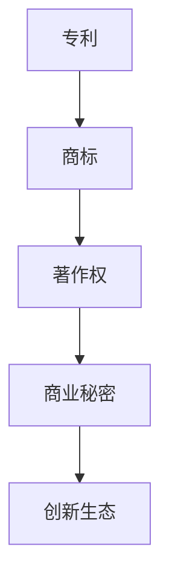

                 

# 知识产权保护：创新动力与阻力

在快速发展的科技创新浪潮中，知识产权保护（Intellectual Property Protection, IP）成为推动创新和促进技术进步的关键因素。然而，复杂的知识产权体系和层出不穷的侵权行为也构成了巨大的阻力，制约了创新生态的健康发展。本文将深入探讨知识产权保护在创新动力与阻力之间的双向作用，探讨如何通过技术手段和法律制度创新，构建更公平、高效、透明的知识产权生态。

## 1. 背景介绍

### 1.1 知识产权概述

知识产权是保护创造者对其智力成果享有专有权利的法律框架，主要包括专利、商标、著作权、版权、商业秘密等。这些权利给予创作者在一定期限内对其作品的独占使用权，防止他人未经授权的复制、分发和商业化利用。

随着科技进步和全球化趋势，知识产权已成为创新和竞争力的重要组成部分。企业通过专利申请、商标保护等手段，保护其技术创新和品牌价值，从而获得市场竞争优势。同时，创新者通过版权登记，确保其创意成果得到认可和保护，激励更多人投身创新活动。

### 1.2 知识产权保护的挑战

尽管知识产权保护在激励创新方面发挥了重要作用，但当前体系仍面临诸多挑战：
1. **跨国侵权**：技术的全球化和网络化使得跨国侵权行为屡禁不止，尤其是软件、药品、生物技术等高价值创新领域，侵权行为隐蔽且难以追溯。
2. **专利滥用**：部分企业通过专利诉讼、许可协议等方式，实施专利滥用，打压竞争对手，限制技术自由流动。
3. **知识产权纠纷**：涉及创新成果归属、专利权纠纷等问题频发，导致创新者利益受损，甚至影响市场健康发展。

## 2. 核心概念与联系

### 2.1 核心概念概述

为更好地理解知识产权保护与创新的关系，本文将介绍几个关键概念：

- **专利**：给予发明人对其发明在一定期限内的独占使用权，防止他人未经授权的制造、使用和销售。
- **商标**：保护品牌的识别性，防止他人使用类似标志混淆消费者。
- **著作权**：保护原创作品，包括文学、艺术、音乐等，防止他人未经授权的复制和分发。
- **商业秘密**：保护企业的技术、设计、流程等非公开信息，防止泄露或被竞争对手利用。
- **创新生态**：涵盖从研发、生产到市场化的全过程，涉及技术创新、产品创新、商业模式创新等多个方面。

这些概念之间的逻辑关系可以通过以下Mermaid流程图来展示：



这个流程图展示了几大知识产权类型与创新生态之间的关联：

1. 专利、商标和著作权保护创新的成果，使其在一定期限内具有独占性。
2. 商业秘密保护企业的非公开信息，促进内部创新。
3. 这些知识产权共同构建了创新生态的基石，使得创新者能够从中受益，激励更多的创新活动。

## 3. 核心算法原理 & 具体操作步骤
### 3.1 算法原理概述

知识产权保护的核心原理是通过法律和技术手段，赋予创新者对其智力成果的独占权，防止他人未经授权的复制和使用。这种保护机制的核心在于确定创新成果的归属，以及如何防止他人对其非法复制和利用。

从技术角度来看，知识产权保护主要涉及以下几个方面：

- **数字水印**：在数字产品中嵌入难以察觉的水印，用于追踪版权归属和侵权行为。
- **区块链技术**：通过去中心化的分布式账本，确保数据透明性和不可篡改性，防止信息泄露和篡改。
- **电子证据采集**：利用电子取证工具，收集和固定数字证据，证明侵权行为的发生。

### 3.2 算法步骤详解

#### 3.2.1 数字水印嵌入与检测

数字水印技术通过在数字产品中嵌入不可见的水印信息，用于追踪版权归属和证明侵权行为。其嵌入过程一般包括以下步骤：

1. **水印生成**：选择适合的水印算法，生成水印序列。
2. **嵌入**：将水印序列嵌入到原始数字产品中，如图片、音频、视频等。
3. **检测**：通过特定的算法，在需要验证版权的产品中检测和提取水印。

#### 3.2.2 区块链技术的实现

区块链技术通过去中心化的分布式账本，确保数据透明性和不可篡改性。在知识产权保护中，区块链可以用于：

1. **版权登记**：通过智能合约在区块链上自动记录作品的发布和版权归属信息。
2. **版权交易**：使用智能合约管理版权的转移和交易，确保交易透明和可追溯。
3. **证据存储**：在区块链上存储电子证据，防止篡改和丢失。

#### 3.2.3 电子证据采集与固定

电子证据采集和固定技术用于在数字环境下收集和保存证据，其过程包括：

1. **电子取证**：使用专业工具和算法，从计算机、手机等设备中提取电子证据。
2. **证据存储**：将收集到的证据进行加密和存储，确保其完整性和不可篡改性。
3. **证据提交**：将电子证据提交给法律机构，用于证明侵权行为。

### 3.3 算法优缺点

数字水印和区块链技术在知识产权保护中具有以下优点：

1. **增强透明性**：通过区块链记录版权信息和交易，增强了数据的透明性和可追溯性。
2. **降低侵权成本**：数字水印技术可以有效追踪和证明侵权行为，降低了维权成本。
3. **提高安全性**：区块链的去中心化和不可篡改性，提高了数据的存储和传输安全性。

然而，这些技术也存在一些局限性：

1. **技术复杂性**：数字水印和区块链技术的实现涉及复杂的算法和分布式系统，需要较高的技术门槛。
2. **成本高**：区块链和电子证据采集技术的实现和维护成本较高，对中小企业来说可能难以负担。
3. **法律挑战**：数字证据和区块链记录的法律效力和可接受度仍需进一步明确，存在法律风险。

### 3.4 算法应用领域

数字水印和区块链技术在多个领域得到了广泛应用，例如：

- **数字版权保护**：在音乐、电影、软件等数字产品中使用数字水印，保护版权归属和追踪侵权行为。
- **供应链管理**：利用区块链技术，记录产品的来源、生产过程和销售记录，确保供应链透明度和可追溯性。
- **智能合约**：在知识产权交易中使用智能合约，自动化管理和执行版权协议，提高交易效率。

## 4. 数学模型和公式 & 详细讲解 & 举例说明

### 4.1 数学模型构建

假设某公司的软件产品被侵权，公司可以通过数字水印技术追踪侵权行为。设侵权者生成的水印为 $W$，原始产品的水印为 $W_0$，水印检测算法为 $D$。模型的目标是最大化检测概率，最小化误报率。

### 4.2 公式推导过程

设 $p(W|W_0)$ 为水印生成的概率分布，$P(D(W_0|W))$ 为检测算法的准确率。检测过程的似然函数为：

$$
P(D(W_0|W)) = \int p(W|W_0)D(W_0|W)dW
$$

为了最大化检测概率，最小化误报率，需要进行优化：

$$
\max_{D} \int p(W|W_0)D(W_0|W)dW
$$

$$
\min_{D} (1 - \int p(W|W_0)D(W_0|W)dW)
$$

### 4.3 案例分析与讲解

假设某软件公司通过数字水印技术保护其软件版权。公司生成一个64位的随机数作为水印，并将其嵌入到软件中。侵权者使用自己的算法生成水印并嵌入到软件副本中。公司通过水印检测算法检测软件副本中的水印，判断其是否来自原始产品。

**案例分析**：

1. **水印生成**：公司使用SHA256算法生成一个64位的随机数作为水印。
2. **嵌入**：将水印嵌入到软件的关键部分，如主函数、重要库函数等。
3. **检测**：使用RSA算法检测软件副本中的水印，比较其与原始水印的差异。

通过数字水印技术，公司能够有效追踪侵权行为，并及时采取法律措施。

## 5. 项目实践：代码实例和详细解释说明

### 5.1 开发环境搭建

在进行数字水印和区块链技术的开发前，需要准备好开发环境。以下是使用Python和Flask进行开发的环境配置流程：

1. 安装Python：从官网下载并安装Python。
2. 安装Flask：使用pip安装Flask框架。
3. 安装区块链库：如web3.py，用于与区块链交互。
4. 安装数字水印库：如pywavedeg。

完成上述步骤后，即可在本地搭建开发环境。

### 5.2 源代码详细实现

以下是使用Python实现数字水印和区块链技术的示例代码：

**数字水印嵌入**：

```python
import pywavedeg
import numpy as np

# 生成随机水印
def generate_watermark(length):
    return np.random.randint(0, 255, size=length)

# 嵌入水印
def embed_watermark(wav, watermark):
    watermark = pywavedeg.add_watermark(wav, watermark)
    return watermark

# 检测水印
def detect_watermark(wav, watermark):
    detected_watermark = pywavedeg.detect_watermark(wav)
    return detected_watermark

# 生成音频文件
wav = generate_audio()
watermark = generate_watermark(64)
embedded_wav = embed_watermark(wav, watermark)

# 检测水印
detected_watermark = detect_watermark(embedded_wav, watermark)
```

**区块链版权登记**：

```python
from web3 import Web3

# 连接区块链
w3 = Web3(Web3.HTTPProvider('http://localhost:8545'))

# 创建智能合约
contract_abi = [
    {'inputs': [{'name': 'title', 'type': 'string'}],
     'name': 'register版权',
     'outputs': [],
     'stateMutability': 'nonpayable'}
]
contract = w3.eth.contract(abi=contract_abi, address='0x1234567890abcdef')

# 登记版权
tx = contract.functions.register版权('原创作品标题').send({'sender': '0x1234567890abcdef', 'gas': 100000})
receipt = w3.eth.waitForTransactionReceipt(tx)
```

**电子证据采集**：

```python
from cryptography.hazmat.primitives import hashes
from cryptography.hazmat.primitives.kdf.pbkdf2 import PBKDF2HMAC

# 电子证据采集
def acquire_evidence(file_path):
    with open(file_path, 'rb') as file:
        data = file.read()
    hashed_data = hashes.Hash(data, hashes.SHA256())
    salt = b'随机盐值'
    kdf = PBKDF2HMAC(algorithm=hashes.SHA256(), length=32, salt=salt, iterations=100000)
    key = kdf.derive(hashed_data.digest())
    return key

# 电子证据存储
def store_evidence(evidence):
    with open('evidence.bin', 'wb') as file:
        file.write(evidence)
```

### 5.3 代码解读与分析

**数字水印代码解读**：

1. **生成随机水印**：使用numpy生成64位的随机数作为水印。
2. **嵌入水印**：使用pywavedeg库将水印嵌入到音频文件中。
3. **检测水印**：使用pywavedeg库检测水印，判断其是否来自原始音频文件。

**区块链代码解读**：

1. **连接区块链**：使用Web3库连接本地测试链。
2. **创建智能合约**：定义版权登记的智能合约接口。
3. **登记版权**：使用智能合约将原创作品标题登记到区块链上。

**电子证据采集和存储代码解读**：

1. **电子证据采集**：使用cryptography库对电子证据进行哈希和加密，生成密钥。
2. **电子证据存储**：将电子证据和密钥保存到本地文件。

## 6. 实际应用场景

### 6.1 版权保护

在版权保护方面，数字水印和区块链技术可以广泛应用于音乐、电影、软件等数字产品的版权保护：

1. **音乐版权**：在音乐软件中嵌入数字水印，用于追踪版权归属和打击盗版。
2. **电影版权**：在电影和视频中嵌入数字水印，确保内容不被非法复制和分发。
3. **软件版权**：在软件产品中嵌入数字水印，追踪侵权行为并及时维权。

### 6.2 供应链管理

区块链技术可以用于记录和追踪供应链中的每一个环节，确保产品来源和生产过程的透明度：

1. **原材料采购**：记录原材料的来源和供应商信息，确保质量和安全。
2. **生产过程**：记录产品的生产过程和步骤，确保符合标准和法规。
3. **销售记录**：记录产品的销售信息和流向，确保供应链透明和可追溯。

### 6.3 智能合约

智能合约可以用于自动化管理和执行版权协议，提高交易效率和透明度：

1. **版权交易**：自动记录版权的转移和交易信息，确保交易透明和可追溯。
2. **授权许可**：自动执行授权许可协议，确保许可信息的准确性和及时性。
3. **收益分配**：自动分配版权收益，确保各方利益平衡。

## 7. 工具和资源推荐

### 7.1 学习资源推荐

为了帮助开发者掌握数字水印和区块链技术的原理和应用，推荐以下学习资源：

1. 《数字水印技术》书籍：详细介绍数字水印的基本概念、算法和应用场景。
2. 《区块链原理与应用》课程：介绍区块链的基本原理和实际应用，包括版权保护和供应链管理。
3. 《智能合约设计与开发》教程：介绍智能合约的基本概念、开发工具和应用案例。

### 7.2 开发工具推荐

1. Python：Python是最常用的编程语言之一，拥有丰富的第三方库和框架，适合数字水印和区块链技术的开发。
2. Flask：Flask是轻量级的Web框架，适合搭建基于Web的数字水印和区块链服务。
3. web3.py：web3.py是Python区块链库，支持与以太坊等区块链的交互，方便区块链版权登记和智能合约开发。
4. cryptography：cryptography库提供了多种加密和哈希算法，适合电子证据采集和存储。

### 7.3 相关论文推荐

1. 《数字水印技术：原理与算法》论文：介绍数字水印的原理和算法，探讨其在版权保护中的应用。
2. 《区块链技术在知识产权保护中的应用》论文：探讨区块链技术在版权保护、供应链管理和智能合约中的应用。
3. 《基于数字水印的版权保护技术》论文：详细介绍数字水印的嵌入、检测和应用案例。

## 8. 总结：未来发展趋势与挑战

### 8.1 研究成果总结

本文系统探讨了数字水印和区块链技术在知识产权保护中的应用，介绍了数字水印嵌入、检测和区块链版权登记、智能合约等核心技术。通过这些技术手段，可以在一定程度上增强知识产权保护的透明度和可追溯性，减少侵权行为，保护创新者的权益。

### 8.2 未来发展趋势

未来，数字水印和区块链技术将进一步发展，成为知识产权保护的重要工具：

1. **技术成熟度提升**：数字水印和区块链技术的算法和实现将更加成熟和高效，降低开发和维护成本。
2. **跨平台支持**：数字水印和区块链技术将支持更多平台和设备，增强其适用性和普及度。
3. **自动化和智能化**：利用AI和机器学习技术，进一步提升数字水印和区块链系统的自动化和智能化水平。

### 8.3 面临的挑战

尽管数字水印和区块链技术在知识产权保护中具有广泛应用前景，但仍面临诸多挑战：

1. **技术门槛高**：数字水印和区块链技术的实现需要较高的技术门槛，对开发者要求较高。
2. **法律和监管挑战**：数字证据和区块链记录的法律效力和可接受度仍需进一步明确，存在法律风险。
3. **隐私保护**：在保护知识产权的同时，需要平衡隐私保护，确保用户数据安全。

### 8.4 研究展望

未来的研究应在以下几个方面寻求新的突破：

1. **增强技术普及度**：通过简化技术实现，降低技术门槛，促进数字水印和区块链技术的普及应用。
2. **增强法律保障**：明确数字证据和区块链记录的法律效力，提供完善的法律保障。
3. **加强隐私保护**：在数字水印和区块链系统中引入隐私保护技术，确保用户数据的安全和隐私。

## 9. 附录：常见问题与解答

**Q1: 数字水印嵌入和检测的原理是什么？**

A: 数字水印嵌入的原理是将不可见的水印信息嵌入到原始数字产品中，如音频、图片等。常用的数字水印算法包括频域水印、空域水印、时域水印等。数字水印检测的原理是通过特定的算法在需要验证的样本中检测和提取水印，判断其是否来自原始产品。常用的检测算法包括统计特征检测、模式匹配检测、特征提取检测等。

**Q2: 区块链技术在知识产权保护中如何应用？**

A: 区块链技术在知识产权保护中主要用于版权登记、版权交易和电子证据存储。版权登记是指通过智能合约在区块链上自动记录作品的发布和版权归属信息。版权交易是指使用智能合约管理版权的转移和交易，确保交易透明和可追溯。电子证据存储是指在区块链上存储电子证据，防止篡改和丢失。

**Q3: 电子证据采集和存储需要注意哪些问题？**

A: 电子证据采集和存储需要注意以下几个问题：
1. 采集到的证据应完整无损，避免部分信息丢失或损坏。
2. 加密和存储证据时，应使用强加密算法，防止数据泄露。
3. 存储证据时，应确保数据的透明性和可追溯性，便于后续验证。

---

作者：禅与计算机程序设计艺术 / Zen and the Art of Computer Programming

