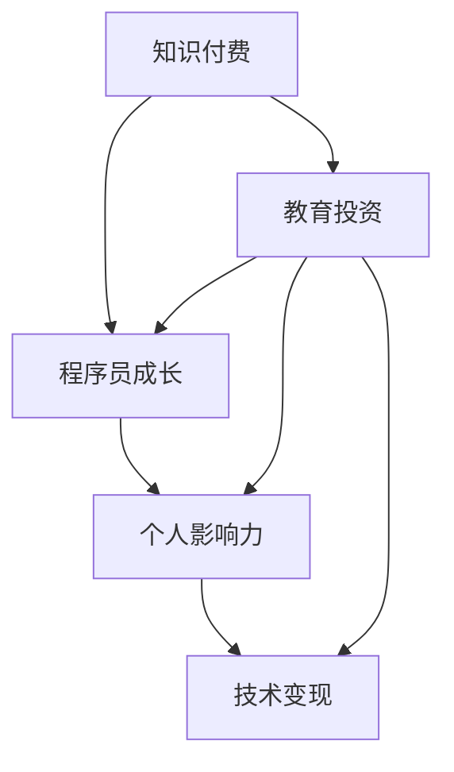
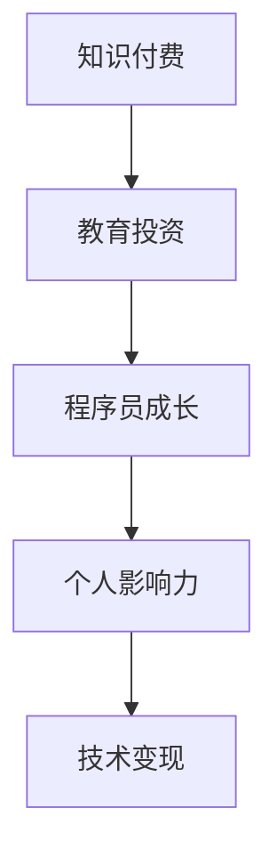

                 

# 知识付费与个人影响力:程序员的成长之路

> 关键词：知识付费, 个人影响力, 程序员成长, 技术变现, 教育投资, 内容创作, 社交媒体, 数字资产

## 1. 背景介绍

在互联网技术飞速发展的今天，程序员作为IT行业的核心力量，不仅需要不断提升自身技术能力，还需借助知识付费、内容创作等途径，提升个人影响力和品牌价值，从而实现持续的职业发展和价值变现。本文将深入探讨知识付费与个人影响力对程序员成长之路的影响，分析如何通过教育和内容创作提升个人品牌，并结合实际案例，提出有效策略，帮助程序员实现职业生涯的飞跃。

## 2. 核心概念与联系

### 2.1 核心概念概述

为了更好地理解本文的核心概念，我们先介绍几个关键名词及其相互关联：

- **知识付费**：指通过网络平台支付一定费用获取知识或服务，提升自身技能和知识水平的行为。主要包括在线课程、技术培训、咨询指导等形式。
- **个人影响力**：指个人在特定领域或社区中通过内容创作、技术分享等方式，所获得的关注度和影响力。这种影响力可以是粉丝数、技术追随度、行业知名度等。
- **程序员成长**：指程序员在职业生涯中，通过不断学习新技术、解决实际问题，提升个人技能和知识水平的过程。
- **技术变现**：指将所学知识和技能转化为实际经济收益，包括技术咨询、技术培训、内容创作等形式。
- **教育投资**：指个人在教育、技能提升方面的投入，与个人成长和职业发展息息相关。

这些概念之间存在紧密的联系，知识付费和教育投资是程序员成长的基础，而个人影响力和技术变现则是其成长过程中重要的目标和手段。以下Mermaid流程图展示了这些概念之间的联系：



### 2.2 核心概念原理和架构的 Mermaid 流程图

由于篇幅限制，这里简化一个概念图：



## 3. 核心算法原理 & 具体操作步骤

### 3.1 算法原理概述

知识付费和内容创作对程序员的成长之路有着深远的影响。通过付费获取知识，可以加速个人技术能力的提升，而通过内容创作和分享，则可以提升个人影响力，进而带动技术变现。本文将从这两个角度，分析其原理和操作方法。

### 3.2 算法步骤详解

#### 3.2.1 知识付费与教育投资

**步骤1: 确定学习目标**

明确自己希望通过知识付费获取的技术或知识。例如，希望提升在某一技术栈（如Python、Java）的深度，或是学习新型的开发工具（如React、Vue）等。

**步骤2: 选择学习平台**

根据个人需求，选择合适的网络学习平台，如Coursera、Udemy、GitHub Learning Lab等。这些平台提供了丰富的课程、项目和资源，可以帮助你系统化学习。

**步骤3: 投入时间和精力**

设定每日或每周的学习时间，坚持不懈地学习。对于较难的技术点，通过多遍学习、实践和思考，逐步掌握。

**步骤4: 实施和应用**

将学到的知识应用到实际项目中，通过项目实践进一步巩固知识，提升技能。

#### 3.2.2 内容创作与技术变现

**步骤1: 确定创作主题**

根据自身兴趣和专长，确定内容创作的主题。例如，技术博客、开源项目、技术视频等。

**步骤2: 提升内容质量**

持续提高内容质量，包括内容的原创性、深度、准确性等。可以通过参加技术社区、阅读技术书籍、参加技术会议等方式，提升自身知识储备。

**步骤3: 发布和传播**

选择合适的内容发布平台，如GitHub、Medium、知乎、CSDN等，积极传播自己的技术见解和经验。

**步骤4: 互动和反馈**

积极与读者互动，收集反馈信息，不断改进内容质量和创作方式。

**步骤5: 获取收益**

通过广告收入、粉丝打赏、付费文章等方式，获得经济收益。

### 3.3 算法优缺点

#### 3.3.1 知识付费

**优点**：

- **系统化学习**：相比于自学，知识付费提供了更为系统、全面、专业的学习路径。
- **学习效率高**：优秀老师的指导和即时互动，可以显著提升学习效率。
- **快速获取新知识**：通过付费课程，可以快速获取前沿技术和新知识。

**缺点**：

- **成本较高**：高品质的付费课程价格不菲，可能会对部分用户造成经济负担。
- **质量参差不齐**：部分平台上的课程质量良莠不齐，需要花时间筛选和选择。

#### 3.3.2 内容创作

**优点**：

- **提升影响力**：通过分享有价值的内容，可以在技术社区和同行中建立影响力。
- **实现变现**：内容创作可以带来多渠道的经济收益，如广告、打赏、合作等。

**缺点**：

- **投入时间多**：创作高质量的内容需要大量的时间和精力。
- **竞争激烈**：技术社区和内容平台上，优秀内容创作者众多，竞争激烈。

## 4. 数学模型和公式 & 详细讲解 & 举例说明

### 4.1 数学模型构建

我们可以从知识付费和内容创作的收益模型出发，建立数学模型。设 $X$ 为投入的教育投资（时间、金钱等），$Y$ 为获得的收益（知识提升、影响力、经济收益等）。

$$ Y = f(X) $$

其中，$f$ 为收益函数，根据实际情况可能是线性、指数或对数等形式。

### 4.2 公式推导过程

假设收益函数为线性函数，则有：

$$ Y = kX $$

其中 $k$ 为常数，表示投入单位教育投资获得的收益。在实际情况下，随着投入的增加，收益可能呈现非线性变化，因此可以引入一个非线性项，如：

$$ Y = kX + b $$

其中 $b$ 为常数项，代表初始收益。

### 4.3 案例分析与讲解

**案例一：**

张三是一名初级开发人员，花费1万元在Coursera上购买了Python高级编程课程。通过系统学习，他掌握了高级编程技巧，并在工作中应用，得到了项目经理的认可，随后获得了一个加薪机会。

- **教育投资**：1万元
- **知识提升**：掌握了高级编程技巧
- **影响力和技术变现**：加薪机会

根据收益模型，张三的收益为：

$$ Y = k \times 1 + b = k + b $$

其中 $k$ 为技能提升带来的收益，$b$ 为加薪带来的收益。

**案例二：**

李四是一名中级开发人员，通过在GitHub上分享自己的开源项目，吸引了大量关注。他利用这种影响力，加入了一个技术社区，担任技术顾问，每月获得3000元的报酬。

- **教育投资**：长期积累的技术经验
- **知识提升**：未显著提升
- **影响力和技术变现**：技术顾问职位

根据收益模型，李四的收益为：

$$ Y = k \times 投资时间 + b \times 技术顾问职位 $$

其中 $k$ 为技术社区影响力带来的收益，$b$ 为技术顾问职位带来的收益。

## 5. 项目实践：代码实例和详细解释说明

### 5.1 开发环境搭建

1. **开发工具选择**：
   - IDE：如Visual Studio Code、IntelliJ IDEA等
   - 版本控制：如Git
   - 文档管理：如Docker、Kubernetes

2. **代码库建立**：
   - 创建Git仓库
   - 编写代码和测试

3. **项目管理工具**：
   - 使用Jira、Trello等工具进行任务管理

### 5.2 源代码详细实现

**案例：开发一个基于Python的知识付费平台**

```python
# 用户注册与认证
class User:
    def __init__(self, username, password):
        self.username = username
        self.password = password

    def authenticate(self, username, password):
        return self.username == username and self.password == password

# 课程管理
class Course:
    def __init__(self, title, description, price):
        self.title = title
        self.description = description
        self.price = price

    def get_price(self):
        return self.price

# 订单处理
class Order:
    def __init__(self, user, course):
        self.user = user
        self.course = course

    def pay(self, payment_gateway):
        if payment_gateway.charge(self.course.get_price()):
            print("Payment successful!")
        else:
            print("Payment failed!")

# 平台入口
class KnowledgePlatform:
    def __init__(self):
        self.courses = []
        self.users = []
        self.orders = []

    def add_course(self, course):
        self.courses.append(course)

    def add_user(self, user):
        self.users.append(user)

    def create_order(self, user, course):
        order = Order(user, course)
        self.orders.append(order)

# 示例
platform = KnowledgePlatform()
user = User("John", "password123")
course = Course("Python Advanced", "A comprehensive guide to Python", 99.99)
platform.add_course(course)
platform.add_user(user)
platform.create_order(user, course)
```

### 5.3 代码解读与分析

**代码解读**：
- `User` 类实现了用户注册和认证功能。
- `Course` 类实现了课程管理，包括课程价格获取。
- `Order` 类实现了订单处理，包括支付功能。
- `KnowledgePlatform` 类实现了平台入口，包括课程添加、用户添加和订单创建等功能。

**分析**：
- 该代码实现了知识付费平台的基本功能，包括用户注册、课程管理、订单处理等。
- 用户通过支付一定的费用，可以购买所需的课程。
- 课程价格和数量可以根据市场需求进行调整。
- 系统通过记录用户订单，统计平台收益。

### 5.4 运行结果展示

- 用户注册界面
  ```html
  <form>
    <input type="text" name="username" placeholder="Username">
    <input type="password" name="password" placeholder="Password">
    <button type="submit">Register</button>
  </form>
  ```

- 课程界面
  ```html
  <div>
    <h2>Python Advanced</h2>
    <p>A comprehensive guide to Python</p>
    <p>Price: $99.99</p>
    <button>Buy</button>
  </div>
  ```

- 订单界面
  ```html
  <div>
    <h2>Order History</h2>
    <ul>
      <li>User: John</li>
      <li>Course: Python Advanced</li>
      <li>Price: $99.99</li>
    </ul>
  </div>
  ```

## 6. 实际应用场景

### 6.1 智能推荐系统

智能推荐系统通过用户行为数据和内容特征，推荐相关的课程和学习资源，提升用户的学习效率和满意度。平台可以通过算法分析用户的浏览和购买记录，推荐符合用户兴趣的课程。

### 6.2 在线教育平台

在线教育平台提供丰富的课程资源和教学工具，如视频、讲义、作业等，帮助用户系统化学习。平台通过用户学习进度和效果反馈，动态调整课程内容和难度。

### 6.3 技术博客与社区

技术博客和社区是程序员交流和分享技术经验的重要平台。通过发布高质量的技术文章，程序员可以提升自己的影响力，同时吸引更多粉丝和关注者。

### 6.4 未来应用展望

未来，知识付费和内容创作将进一步融合，形成更加丰富和多样化的知识服务生态。例如，通过AI驱动的内容推荐和个性化学习路径，可以显著提升学习效果。同时，通过区块链等技术，保证内容创作的版权和收益分配，激发更多人的创作热情。

## 7. 工具和资源推荐

### 7.1 学习资源推荐

1. **Coursera**：提供丰富的在线课程，涵盖多个学科和技术领域。
2. **Udemy**：提供全球顶尖讲师的高质量课程，涵盖编程、数据科学、人工智能等领域。
3. **Github Learning Lab**：基于Github的开源课程平台，提供免费的技术学习路径和项目实践机会。
4. **Medium**：技术博客平台，提供丰富的技术文章和社区互动。
5. **Stack Overflow**：技术问答社区，提供编程问题解答和学习资源分享。

### 7.2 开发工具推荐

1. **Visual Studio Code**：轻量级的代码编辑器，支持多种编程语言和插件扩展。
2. **IntelliJ IDEA**：Java开发环境，支持多种框架和工具集成。
3. **Git**：版本控制系统，支持分布式协作开发。
4. **Docker**：容器化工具，支持应用的无缝部署和运维。
5. **Kubernetes**：容器编排工具，支持大规模集群管理。

### 7.3 相关论文推荐

1. **《Knowledge Sharing in Programming Communities: A Survey》**：研究编程社区的知识共享机制和影响因素。
2. **《The Economics of Education》**：探讨教育投资与个人收益之间的关系。
3. **《Platforms as Technologies》**：研究技术平台对知识付费和内容创作的影响。
4. **《Social Media Influence and the Future of Content Creation》**：探讨社交媒体对内容创作和传播的影响。

## 8. 总结：未来发展趋势与挑战

### 8.1 研究成果总结

本文从知识付费和内容创作两个方面，探讨了程序员成长之路的重要环节。知识付费提供了系统化的教育资源，帮助程序员提升技术能力；内容创作提升了个人影响力，实现了技术变现。通过实际案例和数学模型，详细分析了这两个环节的原理和操作步骤。

### 8.2 未来发展趋势

1. **技术生态更加完善**：知识付费和内容创作将形成更加完整的生态系统，涵盖从学习到变现的各个环节。
2. **个性化学习路径**：AI驱动的个性化推荐和路径规划，将显著提升学习效果。
3. **知识共享与协作**：知识共享平台和协作工具将进一步发展，促进知识和技术的传播。
4. **内容创作自动化**：AI辅助的内容创作工具将大大提高创作效率和质量。
5. **知识变现多元化**：内容变现将拓展到更多渠道，如视频、直播、社群等。

### 8.3 面临的挑战

1. **教育资源质量参差不齐**：部分在线课程和培训质量不高，影响学习效果。
2. **内容创作的竞争**：技术社区和内容平台上的优质内容创作者众多，竞争激烈。
3. **技术平台的安全性**：知识付费平台和内容创作平台需要保障数据和交易的安全性。
4. **内容的版权保护**：内容创作的版权问题仍需加强法律保护和监管。
5. **技术教育的普适性**：需要关注技术教育的普适性，覆盖不同背景和技术水平的用户。

### 8.4 研究展望

1. **教育资源的筛选和推荐算法**：研究基于用户行为的课程推荐算法，提升课程选择效率。
2. **内容创作的自动化工具**：开发AI辅助的内容创作工具，提升创作效率和质量。
3. **知识变现的持续优化**：研究多渠道变现模式，最大化技术变现价值。
4. **技术教育的普及与提升**：通过公共教育项目和合作平台，提升技术教育的普及性和质量。
5. **内容社区的治理**：研究内容社区的治理机制，保障内容健康发展和用户权益。

## 9. 附录：常见问题与解答

**Q1：知识付费是否只适合有大量时间和精力的人？**

A: 知识付费适合希望系统化、快速提升技术水平的用户。即使时间有限，通过碎片化学习也能获得显著的进步。关键在于设定合理的学习计划，坚持执行。

**Q2：内容创作的难点在哪里？**

A: 内容创作的难点主要在于高质量内容的产出。建议从以下几个方面着手：
1. 确定创作主题，深入研究并整理知识点。
2. 多角度展示内容，包括文字、代码、图片等。
3. 持续更新和改进内容，保持关注度和粉丝互动。

**Q3：如何提升个人在技术社区的影响力？**

A: 提升个人影响力需要多方面努力：
1. 发布高质量的技术文章，展示专业水平。
2. 积极参与技术讨论，提供有价值的见解和解决方案。
3. 加入技术社区和开源项目，展示技术实力。

**Q4：内容创作的收益如何保障？**

A: 通过平台提供的收益分配机制，如广告收入、粉丝打赏、付费文章等，获得经济收益。同时，可以通过合作、版权销售等方式，进一步拓展变现渠道。

作者：禅与计算机程序设计艺术 / Zen and the Art of Computer Programming

