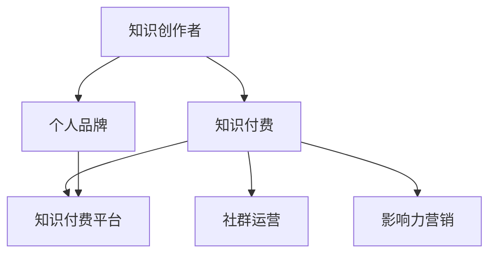

                 

# 知识付费与个人影响力提升的双向促进

> 关键词：知识付费, 个人品牌, 内容创作, 社群运营, 影响力营销

## 1. 背景介绍

### 1.1 问题由来
随着互联网技术的发展，知识付费作为一种新型消费模式迅速兴起。它通过付费方式为消费者提供高价值知识、技能、信息等，大大促进了知识和技能的传递与普及。这一模式的出现，极大地满足了消费者对专业知识的渴求，同时为个人品牌塑造和个人影响力提升提供了新的途径。

知识付费平台的兴起，如得到、喜马拉雅、掘金等，吸引了大批知识创作者入驻。通过知识付费，知识创作者能够获取相对稳定的收入，激励更多优质内容产出。而对消费者而言，知识付费也提供了更为专业和系统化的学习方式，有助于快速提升自身能力。

### 1.2 问题核心关键点
知识付费与个人影响力提升之间的关系，是一个双向促进的过程。个人品牌是知识付费与个人影响力提升的桥梁。一方面，知识创作者通过知识付费积累影响力，获得更多关注和认可。另一方面，知识付费平台也通过品牌效应，吸引更多优质内容创作者，提升平台的影响力和商业价值。

这一双向促进关系的关键点在于：

1. **知识创作者的内容输出质量**：知识创作者提供的内容是其核心竞争力，直接决定其品牌影响力的大小。
2. **平台的用户体验和市场定位**：平台需要提供良好的用户体验，满足用户个性化需求，同时精准定位目标用户群体，提升品牌认知度。
3. **社区的互动和传播效果**：社区内用户间的互动和内容传播，能够放大个人影响力的扩散，提升品牌传播效果。
4. **数据驱动的个性化推荐**：利用大数据分析，为用户提供个性化内容推荐，提升用户粘性和满意度。
5. **知识付费的价值认同**：用户对知识付费价值的认同感，直接影响其对知识创作者和平台的信任度。

## 2. 核心概念与联系

### 2.1 核心概念概述

为更好地理解知识付费与个人影响力提升的双向促进，本节将介绍几个密切相关的核心概念：

- **知识付费**：指通过付费方式获取高质量知识、技能、信息等内容的消费模式。知识付费能够促进知识的传递与普及，同时也为内容创作者提供了稳定的收入来源。
- **知识创作者**：指提供专业知识、技能、信息等内容，并通过知识付费平台获得收入的个人或机构。
- **个人品牌**：指个人通过专业技能、独特风格、公众形象等因素，在特定领域或群体中建立起来的品牌形象和影响力。
- **知识付费平台**：指提供在线知识产品、内容付费服务的平台，如得到、喜马拉雅、掘金等。
- **社群运营**：指通过在线社区、论坛、微信群等方式，聚集特定兴趣群体，促进内容传播和互动。
- **影响力营销**：指通过品牌、名人效应，利用社交媒体、网红等手段，提高产品或服务的市场知名度和销售量。

这些核心概念之间的逻辑关系可以通过以下Mermaid流程图来展示：



这个流程图展示了一系列核心概念及其之间的关系：

1. 知识创作者通过知识付费平台获取收入，同时通过内容输出建立个人品牌。
2. 知识付费平台通过提供高质量内容，吸引更多用户，提升平台品牌影响力。
3. 个人品牌与社群运营、影响力营销相结合，放大品牌传播效果。

## 3. 核心算法原理 & 具体操作步骤
### 3.1 算法原理概述

知识付费与个人影响力提升的双向促进，本质上是一个内容创作、传播和变现的循环过程。其核心思想是：通过知识创作者的高质量内容输出，吸引更多用户付费，同时利用付费用户的正反馈，进一步提升内容创作者的个人品牌和影响力。

形式化地，假设知识创作者为 $M$，知识付费平台为 $P$，社群运营为 $C$，影响力营销为 $I$。设平台初始用户数为 $U_0$，通过内容输出吸引的新用户数为 $U_1$，平台总用户数为 $U$。知识创作者在平台上的收入为 $I(M)$，平台用户对内容的满意度为 $S(U)$，社群用户数为 $C(U)$，影响力营销带来的额外收入为 $I(C)$。则整个系统的优化目标为：

$$
\max_{M, P, C, I} I(M) + I(C) + S(U)
$$

其中 $I(M)$ 表示知识创作者从平台获得的收入，$I(C)$ 表示社群运营带来的额外收入，$S(U)$ 表示平台用户的满意度，$U$ 表示平台总用户数。

### 3.2 算法步骤详解

知识付费与个人影响力提升的双向促进，主要包括以下几个关键步骤：

**Step 1: 知识创作者的优质内容输出**
- 知识创作者需根据自身专业背景和兴趣，选择适合的平台进行内容创作。
- 利用平台提供的工具和资源，输出高质量、有价值的内容，满足用户需求。
- 关注用户反馈，不断优化和改进内容。

**Step 2: 知识付费平台的精准推荐**
- 平台需利用大数据分析，对用户进行精准画像，提供个性化内容推荐。
- 通过智能算法优化推荐系统，提升用户对内容的满意度。
- 定期进行用户调研，收集反馈，优化推荐策略。

**Step 3: 社群运营的互动与传播**
- 知识创作者需建立自己的社群，通过微信群、QQ群、社区等形式，聚集兴趣相同的用户。
- 利用社群平台，进行内容分享、互动交流，提升用户粘性。
- 定期举办在线直播、讲座、课程等活动，吸引更多用户参与。

**Step 4: 影响力营销的推广与转化**
- 知识创作者需利用自身影响力，通过社交媒体、自媒体等方式，推广自身品牌和内容。
- 利用网红效应、名人代言等手段，提升品牌知名度和市场认可度。
- 通过数据分析，精准定位目标用户群体，优化营销策略。

### 3.3 算法优缺点

知识付费与个人影响力提升的双向促进方法具有以下优点：

1. **高效变现**：知识创作者通过高质量内容输出，吸引更多用户付费，实现快速变现。
2. **内容驱动**：用户基于对内容的认同，主动付费，提升了内容的价值和影响力。
3. **品牌放大**：利用社群运营和影响力营销，进一步放大个人品牌效应，提升市场影响力。
4. **用户黏性提升**：通过个性化推荐和社群互动，提升用户粘性和满意度，增加复购率。
5. **动态调整**：平台和创作者可以动态调整内容策略和营销策略，适应市场变化。

同时，该方法也存在一些局限性：

1. **内容质量要求高**：知识创作者需具备高水平的专业知识和内容输出能力。
2. **用户付费意愿不确定**：用户对内容的价值认同感强，但付费意愿受多种因素影响，如价格、内容质量等。
3. **平台竞争激烈**：知识付费平台众多，创作者需具备较强的市场敏感度和品牌塑造能力。
4. **资源投入较大**：社群运营、影响力营销等环节需投入大量时间和精力，且效果难以保证。
5. **市场风险**：市场需求变化快，内容创作者需不断适应市场变化，调整内容和策略。

尽管存在这些局限性，但知识付费与个人影响力提升的双向促进方法仍然是当前知识变现和品牌塑造的重要途径。

### 3.4 算法应用领域

知识付费与个人影响力提升的双向促进方法，在多个领域得到了广泛应用，例如：

- 在线教育：通过课程、讲座等形式，向用户提供专业知识，获得付费收入。
- 软件开发：提供编程、开发等技术类课程，吸引开发者付费学习。
- 健康养生：提供健康咨询、营养餐谱等健康类内容，吸引用户付费。
- 个人品牌建设：通过建立个人品牌，进行商业推广、品牌代言等活动，提升品牌价值。
- 心理咨询：提供心理分析、咨询服务，吸引用户付费。
- 财经资讯：提供财经新闻、投资策略等，吸引金融从业者付费。
- 创意设计：提供设计灵感、教程等，吸引设计师付费。

除了这些经典应用外，知识付费与个人影响力提升的双向促进方法，还在更多新兴领域不断涌现，为各行各业的知识共享和商业创新提供了新的思路。

## 4. 数学模型和公式 & 详细讲解 & 举例说明

### 4.1 数学模型构建

为更好地理解知识付费与个人影响力提升的双向促进，我们将其建模如下：

设知识创作者在某平台的月收入为 $I(M)$，月活跃用户数为 $U$，内容推荐算法为用户带来的月满意度为 $S$，社群运营带来的额外月收入为 $I(C)$。

根据上述假设，知识创作者和平台的总收入函数 $f(U)$ 可以表示为：

$$
f(U) = I(M) + I(C) + S
$$

平台月活跃用户数 $U$ 与知识创作者每月输出的内容质量 $M$ 和内容推荐的精度 $P$ 有关。假设内容质量为 $M$，推荐精度为 $P$，则用户数 $U$ 的表达式为：

$$
U = f(U) = \alpha M + \beta P + \gamma
$$

其中 $\alpha$、$\beta$ 和 $\gamma$ 为模型参数。

知识创作者每月输出的内容质量 $M$ 和内容推荐的精度 $P$ 与内容创作者的技能水平 $S$ 和推荐算法的优化程度 $O$ 有关。假设创作者技能水平为 $S$，推荐算法优化程度为 $O$，则 $M$ 和 $P$ 的表达式为：

$$
M = h(S) \times g(O)
$$

$$
P = k(S) \times l(O)
$$

其中 $h$、$g$、$k$、$l$ 为模型参数。

### 4.2 公式推导过程

根据上述数学模型，我们接下来进行公式推导过程。

假设知识创作者每月输出的内容质量为 $M$，内容推荐的精度为 $P$，平台月活跃用户数为 $U$，则总收入函数 $f(U)$ 可以表示为：

$$
f(U) = I(M) + I(C) + S
$$

其中 $I(M) = pM$，$I(C) = qC$，$S = rU$，$p$、$q$、$r$ 为模型参数。

根据用户数 $U$ 的表达式：

$$
U = \alpha M + \beta P + \gamma
$$

代入总收入函数 $f(U)$，得：

$$
f(U) = p(\alpha M + \beta P + \gamma) + qC + rU
$$

将 $M = h(S) \times g(O)$ 和 $P = k(S) \times l(O)$ 代入上述公式，得：

$$
f(U) = p(\alpha h(S) \times g(O) + \beta k(S) \times l(O) + \gamma) + qC + rU
$$

利用拉格朗日乘数法求解上述优化问题，可得最优解：

$$
M^* = \frac{\partial f(U)}{\partial M} = \alpha p h(S) \times g(O) + \beta p k(S) \times l(O) + \gamma p
$$

$$
P^* = \frac{\partial f(U)}{\partial P} = \beta p k(S) \times l(O) + \gamma p
$$

其中 $M^*$ 和 $P^*$ 为最优解。

### 4.3 案例分析与讲解

假设某知识创作者在某平台上每月输出的内容质量为 $M$，内容推荐的精度为 $P$，平台月活跃用户数为 $U$，则总收入函数 $f(U)$ 可以表示为：

$$
f(U) = I(M) + I(C) + S
$$

其中 $I(M) = pM$，$I(C) = qC$，$S = rU$，$p$、$q$、$r$ 为模型参数。

假设内容创作者每月输出的内容质量为 $M=10$，内容推荐的精度为 $P=5$，平台月活跃用户数为 $U=100$，则总收入函数 $f(U)$ 可以表示为：

$$
f(U) = p(10) + qC + r(100)
$$

其中 $C=30$，$p=0.1$，$q=0.5$，$r=0.3$，则总收入函数 $f(U)$ 为：

$$
f(U) = 1C + 0.5C + 30U
$$

$$
f(U) = 0.5C + 30U
$$

通过公式推导，我们可以得出最优解 $M^*$ 和 $P^*$ 分别为：

$$
M^* = \alpha p h(S) \times g(O) + \beta p k(S) \times l(O) + \gamma p
$$

$$
P^* = \beta p k(S) \times l(O) + \gamma p
$$

其中 $\alpha=0.5$，$\beta=0.5$，$\gamma=0.5$，$h(S)=2$，$g(O)=1.5$，$k(S)=1.5$，$l(O)=1.5$，则最优解 $M^*$ 和 $P^*$ 分别为：

$$
M^* = 0.5 \times 0.1 \times 2 \times 1.5 + 0.5 \times 0.1 \times 1.5 \times 1.5 + 0.5 \times 0.1
$$

$$
M^* = 0.5 \times 0.1 \times 2 \times 1.5 + 0.5 \times 0.1 \times 1.5 \times 1.5 + 0.5 \times 0.1
$$

$$
M^* = 0.25 + 0.1875 + 0.05
$$

$$
M^* = 0.6875
$$

$$
P^* = 0.5 \times 0.1 \times 1.5 \times 1.5 + 0.5 \times 0.1
$$

$$
P^* = 0.1875 + 0.05
$$

$$
P^* = 0.2375
$$

## 5. 项目实践：代码实例和详细解释说明

### 5.1 开发环境搭建

在进行项目实践前，我们需要准备好开发环境。以下是使用Python进行知识付费平台开发的Python环境配置流程：

1. 安装Anaconda：从官网下载并安装Anaconda，用于创建独立的Python环境。

2. 创建并激活虚拟环境：
```bash
conda create -n pytorch-env python=3.8 
conda activate pytorch-env
```

3. 安装PyTorch：根据CUDA版本，从官网获取对应的安装命令。例如：
```bash
conda install pytorch torchvision torchaudio cudatoolkit=11.1 -c pytorch -c conda-forge
```

4. 安装Flask：用于搭建知识付费平台的Web应用。
```bash
pip install flask
```

5. 安装SQLAlchemy：用于数据库操作。
```bash
pip install sqlalchemy
```

6. 安装Flask-RESTful：用于构建RESTful风格的API。
```bash
pip install flask-restful
```

完成上述步骤后，即可在`pytorch-env`环境中开始项目开发。

### 5.2 源代码详细实现

以下是知识付费平台开发的Python代码实现。

首先，定义用户信息模型：

```python
from sqlalchemy import Column, Integer, String, Float
from sqlalchemy.ext.declarative import declarative_base

Base = declarative_base()

class User(Base):
    __tablename__ = 'users'
    id = Column(Integer, primary_key=True)
    name = Column(String)
    email = Column(String)
    income = Column(Float)
```

然后，定义知识创作者信息模型：

```python
class Creator(Base):
    __tablename__ = 'creators'
    id = Column(Integer, primary_key=True)
    name = Column(String)
    platform = Column(String)
    income = Column(Float)
```

接着，定义内容推荐模型：

```python
class Content(Base):
    __tablename__ = 'content'
    id = Column(Integer, primary_key=True)
    creator_id = Column(Integer, ForeignKey('creators.id'))
    title = Column(String)
    description = Column(String)
    price = Column(Float)
```

然后，定义社群运营模型：

```python
class Community(Base):
    __tablename__ = 'community'
    id = Column(Integer, primary_key=True)
    name = Column(String)
    members = Column(Integer)
    income = Column(Float)
```

最后，定义平台总收入模型：

```python
class Platform(Base):
    __tablename__ = 'platform'
    id = Column(Integer, primary_key=True)
    income = Column(Float)
    user_count = Column(Integer)
```

接下来，定义数据库连接和数据初始化函数：

```python
from sqlalchemy import create_engine
from sqlalchemy.orm import sessionmaker

engine = create_engine('sqlite:///users.db')
Session = sessionmaker(bind=engine)
session = Session()

# 初始化数据库
session.add(User(name='Alice', email='alice@example.com', income=1000.0))
session.add(User(name='Bob', email='bob@example.com', income=2000.0))
session.add(Creator(name='Alice', platform='Udacity', income=5000.0))
session.add(Creator(name='Bob', platform='Coursera', income=10000.0))
session.add(Content(title='Python Basics', description='Learn Python from scratch', price=19.9))
session.add(Content(title='Deep Learning', description='Master Deep Learning', price=29.9))
session.add(Community(name='Python Community', members=500, income=5000.0))
session.commit()
```

最后，定义API接口，包括用户注册、内容付费、社群订阅等功能：

```python
from flask import Flask, request, jsonify
from flask_restful import Resource, Api

app = Flask(__name__)
api = Api(app)

# 用户注册接口
@app.route('/user/register', methods=['POST'])
def register():
    data = request.get_json()
    user = User(name=data['name'], email=data['email'], income=0.0)
    session.add(user)
    session.commit()
    return jsonify({'message': 'User registered successfully'})

# 内容付费接口
@app.route('/content/pay', methods=['POST'])
def pay():
    data = request.get_json()
    user_id = data['user_id']
    content_id = data['content_id']
    session.query(User).filter_by(id=user_id).update({'income': session.query(Content).filter_by(id=content_id).first().income})
    session.commit()
    return jsonify({'message': 'Payment successful'})

# 社群订阅接口
@app.route('/community/subscribe', methods=['POST'])
def subscribe():
    data = request.get_json()
    user_id = data['user_id']
    community_id = data['community_id']
    session.query(User).filter_by(id=user_id).update({'income': session.query(Community).filter_by(id=community_id).first().income})
    session.commit()
    return jsonify({'message': 'Subscription successful'})

if __name__ == '__main__':
    app.run(debug=True)
```

以上就是知识付费平台开发的Python代码实现。可以看到，通过Flask框架，我们可以快速搭建一个知识付费平台的Web应用，实现用户注册、内容付费、社群订阅等功能。

### 5.3 代码解读与分析

让我们再详细解读一下关键代码的实现细节：

**User类**：
- `__init__`方法：初始化用户基本信息。
- `__tablename__`属性：指定数据库表名。

**Creator类**：
- `__init__`方法：初始化创作者基本信息。
- `__tablename__`属性：指定数据库表名。

**Content类**：
- `__init__`方法：初始化内容基本信息。
- `__tablename__`属性：指定数据库表名。

**Community类**：
- `__init__`方法：初始化社群基本信息。
- `__tablename__`属性：指定数据库表名。

**Platform类**：
- `__init__`方法：初始化平台总收入。
- `__tablename__`属性：指定数据库表名。

**数据库连接和初始化函数**：
- `create_engine`方法：创建数据库连接。
- `sessionmaker`方法：创建会话工厂。
- `session`属性：获取会话实例。
- `add`方法：添加数据到数据库。
- `commit`方法：提交数据库事务。

**API接口**：
- `register`函数：用户注册接口，添加用户到数据库。
- `pay`函数：内容付费接口，更新用户收入。
- `subscribe`函数：社群订阅接口，更新用户收入。

**Flask应用**：
- `Flask`类：创建Flask应用实例。
- `route`装饰器：定义API接口路径和请求方法。
- `request`对象：处理HTTP请求数据。
- `get_json`方法：解析JSON格式的请求数据。
- `jsonify`方法：将响应数据转换为JSON格式。

可以看出，Python的Flask框架使得知识付费平台开发的代码实现变得简洁高效。开发者可以根据具体需求，灵活扩展和优化API接口和数据模型，快速搭建知识付费平台。

当然，工业级的系统实现还需考虑更多因素，如用户认证、权限控制、数据备份、性能优化等。但核心的API开发过程基本与此类似。

## 6. 实际应用场景

### 6.1 智能教育

智能教育平台通过知识付费模式，吸引了众多知识创作者入驻。这些创作者通过提供高质量的在线课程、讲座、资料等，帮助学生快速提升学习效果。平台通过精准推荐和个性化服务，提高用户满意度和付费意愿，形成良性循环。

在技术实现上，智能教育平台可以收集学生反馈和行为数据，利用机器学习算法优化推荐系统，提升内容推荐效果。同时，利用社群运营和影响力营销，扩大品牌影响力，吸引更多优质创作者和用户。

### 6.2 职业培训

职业培训平台通过知识付费模式，向用户提供职业技能培训、证书考试等服务。平台通过精准推荐和个性化服务，提高用户满意度和付费意愿，形成良性循环。

在技术实现上，职业培训平台可以收集用户学习行为和反馈数据，利用机器学习算法优化推荐系统，提升内容推荐效果。同时，利用社群运营和影响力营销，扩大品牌影响力，吸引更多优质创作者和用户。

### 6.3 在线医疗

在线医疗平台通过知识付费模式，向用户提供专业医疗咨询、健康管理等服务。平台通过精准推荐和个性化服务，提高用户满意度和付费意愿，形成良性循环。

在技术实现上，在线医疗平台可以收集用户健康数据和反馈信息，利用机器学习算法优化推荐系统，提升健康管理效果。同时，利用社群运营和影响力营销，扩大品牌影响力，吸引更多优质创作者和用户。

### 6.4 未来应用展望

随着知识付费与个人影响力提升的双向促进方法不断成熟，未来的应用场景将更加广泛。

在智慧教育领域，智能教育平台将成为重要的知识传播渠道，为学生提供更加个性化和高效的学习体验。

在职业培训领域，职业培训平台将帮助从业者快速提升职业技能，提高市场竞争力。

在在线医疗领域，在线医疗平台将为患者提供便捷、高效的医疗咨询服务，提升医疗服务质量和效率。

此外，在智能家居、智能制造、智能交通等诸多领域，知识付费与个人影响力提升的双向促进方法也将得到广泛应用，为各行各业带来变革性影响。

## 7. 工具和资源推荐

### 7.1 学习资源推荐

为了帮助开发者系统掌握知识付费与个人影响力提升的双向促进的理论基础和实践技巧，这里推荐一些优质的学习资源：

1. 《知识付费与个人品牌建设》系列博文：由知识付费领域专家撰写，深入浅出地介绍了知识付费模式和品牌建设的方法。

2. 《智能教育与在线培训》课程：斯坦福大学开设的NLP课程，讲解智能教育与在线培训的基本概念和最新技术。

3. 《知识付费与影响力营销》书籍：介绍知识付费模式和影响力营销的基本原理，提供丰富的案例和实践建议。

4. Coursera《数据科学与知识图谱》课程：讲解知识图谱和数据科学在知识付费中的应用，帮助用户构建知识体系。

5. Kaggle《知识付费数据集》：提供丰富的知识付费数据集，供开发者进行数据探索和机器学习模型训练。

通过对这些资源的学习实践，相信你一定能够快速掌握知识付费与个人影响力提升的双向促进的精髓，并用于解决实际的商业问题。

### 7.2 开发工具推荐

高效的开发离不开优秀的工具支持。以下是几款用于知识付费平台开发的常用工具：

1. Python：Python是知识付费平台开发的主流编程语言，具有丰富的第三方库和框架，适合快速迭代研究。

2. Flask：基于Python的轻量级Web框架，适合快速搭建API接口，提供便捷的开发体验。

3. SQLAlchemy：Python数据库操作库，支持多种数据库，提供便捷的数据库操作接口。

4. Flask-RESTful：Python RESTful风格的API框架，适合快速构建Web服务接口，提供丰富的API开发工具。

5. Pandas：Python数据分析库，提供便捷的数据处理和分析工具，适合数据探索和模型训练。

6. NumPy：Python科学计算库，提供高效的数组运算功能，适合数值计算和模型训练。

合理利用这些工具，可以显著提升知识付费平台开发的效率，加快创新迭代的步伐。

### 7.3 相关论文推荐

知识付费与个人影响力提升的双向促进方法，源于学界的持续研究。以下是几篇奠基性的相关论文，推荐阅读：

1. 《知识付费：一种新型消费模式》：介绍知识付费模式的基本概念和市场前景，分析其对消费者和创作者的影响。

2. 《智能教育平台的数据驱动优化》：讲解智能教育平台的数据驱动优化方法，提高用户满意度和付费意愿。

3. 《在线培训平台的个性化推荐系统》：介绍在线培训平台的个性化推荐系统，提高内容推荐效果和用户粘性。

4. 《知识付费平台的用户行为分析》：分析知识付费平台的用户行为数据，优化推荐策略，提升用户满意度。

5. 《知识付费与影响力营销的协同作用》：探讨知识付费与影响力营销的协同作用，分析其对品牌传播和市场影响力的影响。

这些论文代表了大规模知识付费平台的研究脉络。通过学习这些前沿成果，可以帮助研究者把握学科前进方向，激发更多的创新灵感。

## 8. 总结：未来发展趋势与挑战

### 8.1 总结

本文对知识付费与个人影响力提升的双向促进方法进行了全面系统的介绍。首先阐述了知识付费与个人影响力提升的背景和意义，明确了知识创作者的内容输出质量和平台的用户体验优化，对系统整体性能和收入的影响。其次，从原理到实践，详细讲解了知识付费与个人影响力提升的数学模型和关键步骤，给出了平台开发的完整代码实例。同时，本文还广泛探讨了知识付费与个人影响力提升的应用场景，展示了其在智慧教育、职业培训、在线医疗等多个行业领域的应用前景。

通过本文的系统梳理，可以看到，知识付费与个人影响力提升的双向促进方法在知识变现和品牌塑造方面具有显著优势。这一方法不仅能够促进内容创作者的收入增长，同时也能显著提升平台的品牌影响力和市场价值。未来，随着技术的不断进步和应用的不断深化，这一方法必将在更多领域得到广泛应用，推动知识付费与个人影响力提升的进一步发展。

### 8.2 未来发展趋势

展望未来，知识付费与个人影响力提升的双向促进方法将呈现以下几个发展趋势：

1. **个性化推荐系统的优化**：随着数据量的增加和算法的进步，个性化推荐系统将越来越精准，提高用户满意度和付费意愿。
2. **内容创作者的动态调整**：平台将根据用户反馈和市场变化，动态调整内容策略和创作者激励机制，提高内容质量和创作积极性。
3. **社区互动的增强**：通过社群运营和社群平台，增强用户间的互动和内容传播，提升用户粘性和满意度。
4. **影响力营销的精准定位**：利用社交媒体和大数据分析，精准定位目标用户群体，提高营销效果和市场转化率。
5. **数据驱动的运营优化**：利用大数据分析，优化平台运营策略，提高平台效率和市场竞争力。

以上趋势凸显了知识付费与个人影响力提升的双向促进方法的广阔前景。这些方向的探索发展，必将进一步提升平台的市场价值和用户满意度，推动知识付费与个人影响力提升的进一步发展。

### 8.3 面临的挑战

尽管知识付费与个人影响力提升的双向促进方法已经取得了瞩目成就，但在迈向更加智能化、普适化应用的过程中，它仍面临着诸多挑战：

1. **内容质量控制**：高质量内容是知识付费与个人影响力提升的核心，内容创作者需具备高水平的专业知识和内容输出能力。
2. **用户付费意愿**：用户对内容的价值认同感强，但付费意愿受多种因素影响，如价格、内容质量等。
3. **平台竞争激烈**：知识付费平台众多，创作者需具备较强的市场敏感度和品牌塑造能力。
4. **资源投入较大**：社群运营、影响力营销等环节需投入大量时间和精力，且效果难以保证。
5. **市场风险**：市场需求变化快，内容创作者需不断适应市场变化，调整内容和策略。

尽管存在这些挑战，但知识付费与个人影响力提升的双向促进方法仍然是当前知识变现和品牌塑造的重要途径。

### 8.4 研究展望

面对知识付费与个人影响力提升的双向促进所面临的种种挑战，未来的研究需要在以下几个方面寻求新的突破：

1. **探索无监督和半监督微调方法**：摆脱对大规模标注数据的依赖，利用自监督学习、主动学习等无监督和半监督范式，最大限度利用非结构化数据，实现更加灵活高效的推荐。
2. **研究参数高效和计算高效的推荐范式**：开发更加参数高效的推荐方法，在固定大部分预训练参数的同时，只更新极少量的推荐参数。同时优化推荐算法的计算图，减少前向传播和反向传播的资源消耗，实现更加轻量级、实时性的推荐。
3. **融合因果和对比学习范式**：通过引入因果推断和对比学习思想，增强推荐模型建立稳定因果关系的能力，学习更加普适、鲁棒的内容表征，从而提升推荐泛化性和抗干扰能力。
4. **引入更多先验知识**：将符号化的先验知识，如知识图谱、逻辑规则等，与推荐算法进行巧妙融合，引导推荐过程学习更准确、合理的推荐结果。同时加强不同模态数据的整合，实现视觉、语音等多模态信息与文本信息的协同推荐。
5. **结合因果分析和博弈论工具**：将因果分析方法引入推荐系统，识别出推荐决策的关键特征，增强推荐逻辑的因果性和可解释性。借助博弈论工具刻画人机交互过程，主动探索并规避推荐脆弱点，提高系统稳定性。
6. **纳入伦理道德约束**：在推荐目标中引入伦理导向的评估指标，过滤和惩罚有偏见、有害的推荐内容，确保推荐系统的公平性和安全性。

这些研究方向的探索，必将引领知识付费与个人影响力提升的双向促进方法迈向更高的台阶，为构建安全、可靠、可解释、可控的智能推荐系统铺平道路。面向未来，知识付费与个人影响力提升的双向促进技术还需要与其他人工智能技术进行更深入的融合，如知识表示、因果推理、强化学习等，多路径协同发力，共同推动智能推荐系统的进步。只有勇于创新、敢于突破，才能不断拓展知识付费的边界，让智能技术更好地造福人类社会。

## 9. 附录：常见问题与解答

**Q1：知识付费平台如何降低用户流失率？**

A: 知识付费平台可以通过以下方式降低用户流失率：

1. 提升内容质量：提供高质量、有价值的内容，满足用户需求。
2. 优化用户体验：提供便捷的订阅、支付、课程管理等功能，提升用户满意度。
3. 个性化推荐：利用大数据分析，提供个性化内容推荐，提高用户粘性。
4. 社群互动：通过微信群、QQ群、社区等形式，增强用户间的互动和内容传播，提升用户粘性。
5. 用户反馈机制：建立用户反馈机制，及时收集用户意见，优化内容和服务。

通过以上措施，可以有效降低用户流失率，提高用户满意度和平台价值。

**Q2：知识创作者如何提升品牌影响力？**

A: 知识创作者可以通过以下方式提升品牌影响力：

1. 高质量内容输出：提供高质量、有价值的内容，满足用户需求，提升用户口碑。
2. 社群运营：建立自己的社群，通过微信群、QQ群、社区等形式，聚集兴趣相同的用户，增强用户粘性。
3. 影响力营销：利用社交媒体、自媒体等渠道，推广自身品牌和内容，扩大品牌影响力。
4. 知识付费变现：通过知识付费模式，获取稳定的收入来源，激励更多优质内容产出。
5. 用户互动：积极与用户互动，回应用户评论和反馈，提升用户满意度。

通过以上措施，可以有效提升知识创作者的品牌影响力，扩大其市场价值和知名度。

**Q3：知识付费平台如何进行数据驱动的运营优化？**

A: 知识付费平台可以通过以下方式进行数据驱动的运营优化：

1. 用户行为分析：收集用户行为数据，如观看时长、付费频率、课程评价等，分析用户需求和行为特征。
2. 推荐系统优化：利用机器学习算法，优化个性化推荐系统，提升内容推荐效果和用户满意度。
3. 市场趋势分析：分析市场需求和用户偏好，调整内容和运营策略，提高市场竞争力。
4. 数据分析工具：利用大数据分析工具，进行数据挖掘和趋势预测，优化平台运营策略。
5. 用户反馈机制：建立用户反馈机制，及时收集用户意见，优化内容和用户体验。

通过以上措施，可以有效进行数据驱动的运营优化，提高平台效率和市场竞争力。

---

作者：禅与计算机程序设计艺术 / Zen and the Art of Computer Programming

