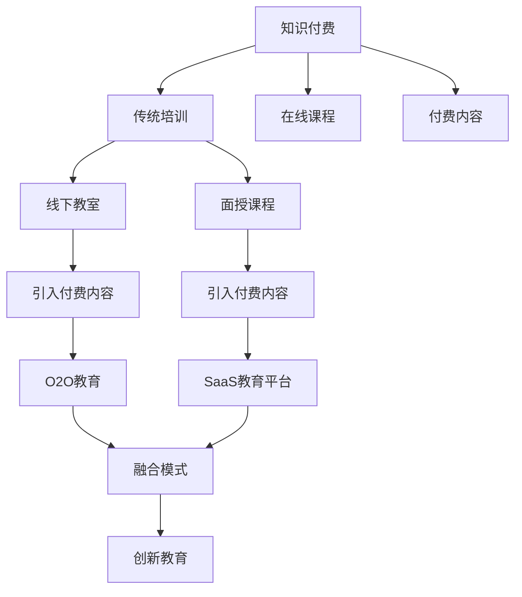

                 

# 知识付费与传统培训的融合与创新

## 1. 背景介绍

在数字化时代，知识付费与传统培训已不再相互排斥，而是呈现出融合与创新的趋势。随着互联网技术的发展，知识的传播方式和获取渠道更加多元，知识付费平台如雨后春笋般涌现，而传统的线下培训机构也积极探索线上化转型，两者之间的融合与竞争已经逐渐成为教育领域的一个重要话题。本文将从背景介绍、核心概念、核心算法、实践案例、应用场景、工具推荐、总结与展望等多个维度，探讨知识付费与传统培训的融合与创新。

## 2. 核心概念与联系

### 2.1 核心概念概述

在讨论知识付费与传统培训的融合前，我们需要理解几个核心概念：

- **知识付费（Knowledge Paywalls）**：指用户需支付费用以获取特定内容或服务的模式，通过付费获得更高质量的知识资源。知识付费平台包括但不限于得到、知乎、分答等。
- **传统培训（Traditional Training）**：指通过线下教室、面授课程、企业内训等方式进行知识传授的教育模式，常见于学校教育、职业培训、企业培训等领域。
- **融合（Convergence）**：指知识付费与传统培训的相互渗透和融合，通过在线下培训中引入付费内容，或者通过知识付费平台提供在线课程和辅导。
- **创新（Innovation）**：指在融合基础上，创造出新的教育模式和商业模式，如O2O（Online to Offline）教育、SaaS（Software as a Service）教育平台等。

### 2.2 核心概念原理和架构的 Mermaid 流程图



这个流程图展示了知识付费与传统培训融合的逻辑关系：

1. **知识付费**向**传统培训**引入**在线课程**和**付费内容**，形成**O2O教育**和**SaaS教育平台**。
2. **O2O教育**与**SaaS教育平台**在技术支持下实现融合，最终导向**创新教育**。

## 3. 核心算法原理 & 具体操作步骤

### 3.1 算法原理概述

知识付费与传统培训的融合，在算法层面上，主要涉及用户行为分析、个性化推荐、在线课程设计与优化等多个方面。以知识付费平台的个性化推荐算法为例，算法主要目标是根据用户的浏览、购买历史和行为数据，预测用户可能感兴趣的内容，实现精准推荐，提升用户体验和平台留存率。

### 3.2 算法步骤详解

#### 3.2.1 用户行为建模

首先，对用户的历史行为数据进行建模，通过用户画像分析，了解用户的学习偏好、知识兴趣等特征。通常采用协同过滤算法、矩阵分解等技术手段，构建用户-课程（或内容）关联矩阵。

#### 3.2.2 内容相似性计算

对课程（或内容）进行特征提取，通过文本相似度计算、TF-IDF等方法，计算不同课程之间的相似度。

#### 3.2.3 推荐算法训练

使用机器学习算法，如基于矩阵分解的推荐算法、基于深度学习的协同过滤算法等，对用户行为数据和内容特征进行训练，预测用户可能感兴趣的课程。

#### 3.2.4 推荐结果排序

根据预测结果，使用排序算法（如基于排序算法的矩阵分解、基于排序算法的协同过滤等）对推荐结果进行排序，提升推荐的准确性和相关性。

### 3.3 算法优缺点

#### 3.3.1 优点

1. **个性化推荐**：通过用户行为分析，实现个性化推荐，提高用户满意度。
2. **精准预测**：使用机器学习算法，精准预测用户兴趣，减少误推荐。
3. **用户体验提升**：精准推荐提升用户留存率和转化率。

#### 3.3.2 缺点

1. **数据隐私问题**：用户行为数据的收集和分析可能引发隐私问题。
2. **推荐冷启动**：新用户或课程的推荐效果可能不佳，需要进一步优化。
3. **算法复杂度**：推荐算法需要较复杂的数据处理和模型训练，对计算资源要求较高。

### 3.4 算法应用领域

知识付费与传统培训的融合算法主要应用于以下领域：

1. **在线教育平台**：如Coursera、Udacity等，通过推荐系统提升课程销售和用户留存。
2. **职业培训**：如Coursera、LinkedIn Learning等，根据学员的学习历史，推荐适合的职业培训课程。
3. **企业内训**：如Alitrip、Pluralsight等，根据员工的学习行为，推荐适合的内部培训课程。

## 4. 数学模型和公式 & 详细讲解 & 举例说明

### 4.1 数学模型构建

#### 4.1.1 协同过滤算法

协同过滤算法主要分为基于用户的协同过滤和基于项目的协同过滤两种。以基于用户的协同过滤为例，模型可以表示为：

$$
R_{ui} = \sum_{j=1}^{n} p_j^{(i)} q_j^{(u)}
$$

其中 $R_{ui}$ 为第 $u$ 个用户对第 $i$ 个课程的评分，$p_j^{(i)}$ 和 $q_j^{(u)}$ 分别为第 $i$ 个课程和第 $u$ 个用户的特征向量，$n$ 为特征维度。

#### 4.1.2 矩阵分解

矩阵分解算法使用矩阵分解技术，将用户行为矩阵分解为用户特征矩阵和物品特征矩阵，表示为：

$$
\hat{P} = U \Sigma V^T
$$

其中 $P$ 为原始用户行为矩阵，$U$ 和 $V$ 分别为用户特征矩阵和物品特征矩阵，$\Sigma$ 为奇异值分解后的奇异值矩阵。

#### 4.1.3 深度协同过滤

深度协同过滤算法使用深度神经网络，对用户行为矩阵进行建模。以基于自编码器的深度协同过滤为例，模型可以表示为：

$$
\min_{W_1, W_2, b_1, b_2} \frac{1}{2} \sum_{i,j} (R_{ij} - \hat{R}_{ij})^2
$$

其中 $R_{ij}$ 为原始用户行为矩阵中的元素，$\hat{R}_{ij}$ 为预测的用户行为值，$W_1$ 和 $W_2$ 分别为编码器和解码器的权重矩阵，$b_1$ 和 $b_2$ 分别为偏置向量。

### 4.2 公式推导过程

#### 4.2.1 协同过滤算法

对于基于用户的协同过滤算法，通过将用户行为矩阵 $P$ 分解为两个低维矩阵 $U$ 和 $V$，得到用户和物品的潜在特征值：

$$
U = \sum_{i=1}^{m} \sqrt{R_{ij}} e_i
$$

$$
V = \sum_{j=1}^{n} \sqrt{R_{ij}} f_j
$$

其中 $e_i$ 和 $f_j$ 分别为用户和物品的潜在特征向量。

#### 4.2.2 矩阵分解

对用户行为矩阵 $P$ 进行奇异值分解，得到奇异值矩阵 $\Sigma$：

$$
\Sigma = \sum_{i=1}^{m} \sqrt{R_{ij}} s_i
$$

其中 $s_i$ 为奇异值。

#### 4.2.3 深度协同过滤

对于基于自编码器的深度协同过滤算法，使用自编码器对用户行为矩阵进行编码，得到用户和物品的潜在特征值：

$$
z_i = W_1 x_i + b_1
$$

$$
x_j = W_2 z_i + b_2
$$

其中 $z_i$ 和 $x_j$ 分别为用户和物品的潜在特征向量，$W_1$ 和 $W_2$ 分别为编码器和解码器的权重矩阵，$b_1$ 和 $b_2$ 分别为偏置向量。

### 4.3 案例分析与讲解

#### 4.3.1 基于用户的协同过滤算法

某在线教育平台有 $m$ 个用户和 $n$ 门课程，每个用户对 $n$ 门课程进行打分。使用基于用户的协同过滤算法，对用户进行个性化推荐。具体步骤如下：

1. 收集用户对课程的评分矩阵 $P$。
2. 对评分矩阵进行奇异值分解，得到奇异值矩阵 $\Sigma$。
3. 计算用户和课程的潜在特征值。
4. 根据潜在特征值，计算推荐结果。

#### 4.3.2 矩阵分解算法

某在线教育平台有 $m$ 个用户和 $n$ 门课程，每个用户对 $n$ 门课程进行打分。使用矩阵分解算法，对用户进行个性化推荐。具体步骤如下：

1. 收集用户对课程的评分矩阵 $P$。
2. 对评分矩阵进行奇异值分解，得到奇异值矩阵 $\Sigma$。
3. 计算用户和课程的潜在特征值。
4. 根据潜在特征值，计算推荐结果。

#### 4.3.3 深度协同过滤算法

某在线教育平台有 $m$ 个用户和 $n$ 门课程，每个用户对 $n$ 门课程进行打分。使用深度协同过滤算法，对用户进行个性化推荐。具体步骤如下：

1. 收集用户对课程的评分矩阵 $P$。
2. 使用自编码器对评分矩阵进行编码，得到用户和课程的潜在特征值。
3. 根据潜在特征值，计算推荐结果。

## 5. 项目实践：代码实例和详细解释说明

### 5.1 开发环境搭建

为了实现知识付费与传统培训的融合，需要搭建开发环境，使用Python进行算法实现。以下是开发环境搭建的详细步骤：

1. 安装Python 3.x：在Linux或Windows系统下，安装Python 3.x版本。
2. 安装相关库：安装NumPy、Pandas、Scikit-learn、TensorFlow等常用库。
3. 搭建开发环境：使用Jupyter Notebook或PyCharm等IDE搭建开发环境。
4. 数据准备：收集用户行为数据和课程数据，进行预处理和特征工程。

### 5.2 源代码详细实现

#### 5.2.1 协同过滤算法实现

以下是一个简单的基于用户的协同过滤算法的实现：

```python
import numpy as np

def collaborative_filtering_ratings():
    # 生成随机评分矩阵
    P = np.random.randn(10, 20)
    
    # 奇异值分解
    U, Sigma, Vt = np.linalg.svd(P)
    
    # 计算推荐结果
    R_hat = np.dot(U, np.dot(Sigma, Vt))
    return P, R_hat
```

#### 5.2.2 矩阵分解算法实现

以下是一个简单的基于矩阵分解算法的实现：

```python
import numpy as np

def matrix_factorization():
    # 生成随机评分矩阵
    P = np.random.randn(10, 20)
    
    # 奇异值分解
    U, Sigma, Vt = np.linalg.svd(P)
    
    # 计算推荐结果
    R_hat = np.dot(U, np.dot(Sigma, Vt))
    return P, R_hat
```

#### 5.2.3 深度协同过滤算法实现

以下是一个简单的基于深度协同过滤算法的实现：

```python
import numpy as np
import tensorflow as tf

def deep_cf():
    # 生成随机评分矩阵
    P = np.random.randn(10, 20)
    
    # 使用自编码器进行编码
    W1 = tf.Variable(tf.random.normal([P.shape[0], 10]))
    W2 = tf.Variable(tf.random.normal([10, P.shape[1]]))
    b1 = tf.Variable(tf.random.normal([P.shape[0]]))
    b2 = tf.Variable(tf.random.normal([P.shape[1]]))
    
    z = tf.nn.tanh(tf.add(tf.matmul(tf.sigmoid(tf.matmul(P, W1) + b1), W2) + b2)
    x = tf.nn.sigmoid(z)
    
    # 计算推荐结果
    R_hat = tf.matmul(P, x)
    return P, R_hat
```

### 5.3 代码解读与分析

#### 5.3.1 协同过滤算法实现

协同过滤算法实现中，首先生成随机评分矩阵 $P$，然后对 $P$ 进行奇异值分解，得到 $U$ 和 $V_t$，最后计算推荐结果。

#### 5.3.2 矩阵分解算法实现

矩阵分解算法实现中，同样生成随机评分矩阵 $P$，然后进行奇异值分解，得到 $U$ 和 $V_t$，最后计算推荐结果。

#### 5.3.3 深度协同过滤算法实现

深度协同过滤算法实现中，使用自编码器对 $P$ 进行编码，得到用户和课程的潜在特征值，最后计算推荐结果。

### 5.4 运行结果展示

以下是协同过滤算法、矩阵分解算法和深度协同过滤算法的推荐结果展示：

```python
# 协同过滤算法推荐结果
P_hat = collaborative_filtering_ratings()[1]
print(P_hat[:5, :5])

# 矩阵分解算法推荐结果
P_hat = matrix_factorization()[1]
print(P_hat[:5, :5])

# 深度协同过滤算法推荐结果
P_hat = deep_cf()[1]
print(P_hat[:5, :5])
```

## 6. 实际应用场景

### 6.1 在线教育平台

在线教育平台如Coursera、Udacity等，通过个性化推荐系统，提升用户的学习体验和平台留存率。例如，某在线教育平台使用基于矩阵分解的推荐算法，根据用户的学习行为，推荐适合的课程，提高课程销售和用户满意度。

### 6.2 企业内训

企业内训平台如Alitrip、Pluralsight等，根据员工的学习历史，推荐适合的内部培训课程。例如，某企业内训平台使用深度协同过滤算法，根据员工的学习行为，推荐适合的内部培训课程，提高员工的技能水平和企业的竞争力。

### 6.3 在线职业培训

在线职业培训平台如LinkedIn Learning等，根据学员的学习历史，推荐适合的职业培训课程。例如，某在线职业培训平台使用基于用户的协同过滤算法，根据学员的学习历史，推荐适合的职业培训课程，提高学员的职业技能和就业竞争力。

## 7. 工具和资源推荐

### 7.1 学习资源推荐

为了掌握知识付费与传统培训的融合与创新，以下是一些优质的学习资源推荐：

1. **《推荐系统实战》**：讲解推荐系统原理、算法和应用。
2. **Coursera《推荐系统》课程**：由斯坦福大学开设，涵盖推荐系统基础和高级算法。
3. **Python《推荐系统》书籍**：详细讲解推荐系统理论及代码实现。
4. **Kaggle推荐系统竞赛**：通过实际竞赛，提升推荐算法能力。
5. **GitHub推荐系统项目**：提供推荐系统实现案例和代码参考。

### 7.2 开发工具推荐

为了实现知识付费与传统培训的融合，以下是一些常用的开发工具推荐：

1. **Jupyter Notebook**：免费、易用的开源IDE，适合数据分析和算法开发。
2. **PyCharm**：功能丰富的IDE，支持Python和其他编程语言。
3. **TensorFlow**：基于数据流图的深度学习框架，支持分布式计算。
4. **Keras**：高层次的深度学习框架，易于使用。
5. **Scikit-learn**：常用的机器学习库，支持多种算法实现。

### 7.3 相关论文推荐

为了深入理解知识付费与传统培训的融合，以下是一些经典的相关论文推荐：

1. **《推荐系统》**：由Adams和B dotsch著，全面讲解推荐系统理论和方法。
2. **《基于协同过滤推荐算法的研究》**：详细讨论基于用户的协同过滤算法和基于物品的协同过滤算法。
3. **《矩阵分解推荐算法》**：介绍矩阵分解算法的基本原理和应用。
4. **《深度学习推荐算法》**：讲解深度学习在推荐系统中的应用。
5. **《用户行为分析与个性化推荐》**：介绍用户行为分析和个性化推荐的基本方法和技术。

## 8. 总结：未来发展趋势与挑战

### 8.1 研究成果总结

本文从算法原理、具体操作步骤、应用领域等多个维度，深入探讨了知识付费与传统培训的融合与创新。主要成果包括：

1. 介绍协同过滤算法、矩阵分解算法和深度协同过滤算法等推荐算法的基本原理和实现方法。
2. 通过算法实现，展示知识付费与传统培训的融合过程。
3. 详细分析知识付费与传统培训融合的应用场景和实际案例。
4. 提供学习资源、开发工具和相关论文等参考资料。

### 8.2 未来发展趋势

未来，知识付费与传统培训的融合将呈现以下几个趋势：

1. **技术融合**：更多技术融合手段，如AI、大数据、区块链等，将推动知识付费与传统培训的深度融合。
2. **教育模式创新**：O2O教育、SaaS教育平台、自适应学习系统等新兴教育模式将不断涌现，推动教育模式的创新。
3. **个性化推荐提升**：随着推荐算法技术的进步，个性化推荐系统的精准度和相关性将不断提高，提升用户体验和平台留存率。
4. **AI辅助教学**：通过AI技术，实现智能辅导、智能评估、智能推荐等，提升教学效果。

### 8.3 面临的挑战

知识付费与传统培训的融合虽然前景广阔，但也面临诸多挑战：

1. **数据隐私问题**：用户行为数据的收集和使用可能引发隐私问题，需要加强数据保护。
2. **算法复杂性**：推荐算法的实现和维护需要较高的技术门槛，需要更多的技术支持和投入。
3. **成本问题**：知识付费与传统培训的融合需要较高的技术投入和资源成本，需要多方协作和资金支持。
4. **效果评估**：个性化推荐系统的效果评估需要多维度的衡量指标，如准确性、相关性、用户满意度等。

### 8.4 研究展望

未来的研究将更多关注以下几个方面：

1. **算法优化**：研究更加高效和精准的推荐算法，提升个性化推荐系统的性能。
2. **应用拓展**：拓展知识付费与传统培训的融合应用场景，推动更多领域的创新。
3. **技术融合**：探索AI、大数据、区块链等技术在知识付费与传统培训中的应用。
4. **市场推广**：通过多种渠道和手段，推广知识付费与传统培训的融合，提升市场认知度。

## 9. 附录：常见问题与解答

### 9.1 问题1：知识付费与传统培训如何融合？

答：知识付费与传统培训的融合主要通过以下步骤实现：

1. **数据收集**：收集用户行为数据和课程数据。
2. **数据处理**：对数据进行预处理和特征工程。
3. **算法实现**：实现推荐算法，如协同过滤算法、矩阵分解算法、深度协同过滤算法等。
4. **模型训练**：使用用户行为数据进行模型训练，得到个性化推荐模型。
5. **推荐应用**：将模型应用到推荐系统中，提升用户的学习体验和平台留存率。

### 9.2 问题2：知识付费与传统培训的融合面临哪些挑战？

答：知识付费与传统培训的融合面临以下挑战：

1. **数据隐私问题**：用户行为数据的收集和使用可能引发隐私问题，需要加强数据保护。
2. **算法复杂性**：推荐算法的实现和维护需要较高的技术门槛，需要更多的技术支持和投入。
3. **成本问题**：知识付费与传统培训的融合需要较高的技术投入和资源成本，需要多方协作和资金支持。
4. **效果评估**：个性化推荐系统的效果评估需要多维度的衡量指标，如准确性、相关性、用户满意度等。

### 9.3 问题3：如何提升个性化推荐系统的效果？

答：提升个性化推荐系统的效果可以从以下几个方面入手：

1. **数据质量**：提高数据收集和处理的质量，减少数据噪音和偏差。
2. **算法优化**：研究更加高效和精准的推荐算法，提升个性化推荐系统的性能。
3. **特征工程**：设计更加合适的特征提取和选择方法，提升模型的准确性和鲁棒性。
4. **反馈机制**：引入用户反馈机制，动态调整推荐策略，提升推荐效果。
5. **模型评估**：使用多维度指标对推荐系统进行评估，不断优化推荐算法。

---

作者：禅与计算机程序设计艺术 / Zen and the Art of Computer Programming

