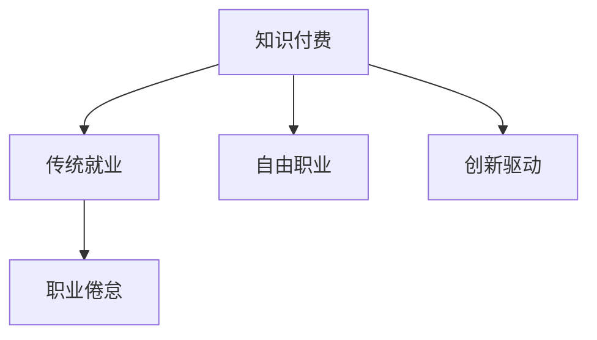

                 

# 知识付费与传统就业:程序员的权衡之道

## 1. 背景介绍

### 1.1 问题由来
在信息爆炸的互联网时代，知识付费模式迅速崛起，成为一种重要的内容消费方式。这一模式不仅改变了传统的知识获取和传播方式，也深刻影响了包括程序员在内的广大劳动者的职业选择和就业环境。传统就业模式面临着前所未有的冲击和挑战，程序员群体在此背景下需要重新审视自身的职业发展道路和选择，探讨知识付费与传统就业之间的权衡之道。

### 1.2 问题核心关键点
知识付费模式与传统就业之间的矛盾和冲突，主要体现在以下几个方面：

1. **收益方式**：知识付费依赖于版权销售和内容订阅，而传统就业则通过工资和福利获得收益。
2. **工作性质**：知识付费模式以自由职业为主，工作灵活多样，而传统就业则侧重于稳定的全职岗位。
3. **技能要求**：知识付费对个人的创新能力和知识深度要求更高，而传统就业更看重团队合作和执行能力。
4. **职业路径**：知识付费提供了更为广阔的发展空间，而传统就业则相对稳定但竞争激烈。

本文旨在深入探讨程序员在知识付费与传统就业之间如何权衡，以期为程序员的职业生涯规划提供有益参考。

## 2. 核心概念与联系

### 2.1 核心概念概述

为更好地理解程序员在知识付费与传统就业之间的权衡，本节将介绍几个密切相关的核心概念：

1. **知识付费**：指通过订阅、购买等方式，用户为获取特定知识或技能支付费用的模式。在技术领域，知识付费主要通过在线课程、书籍、咨询服务等形式体现。

2. **传统就业**：指通过在企业或组织中全职工作，获得固定工资和福利的就业模式。程序员在传统就业中通常隶属于特定公司或团队，进行项目开发和维护。

3. **自由职业**：指个人基于技能和能力，独立承接各类项目，自主管理时间和收益的就业方式。在知识付费领域，许多程序员选择通过博客、视频、培训课程等形式开展自由职业。

4. **职业倦怠**：指在高压、重复或缺乏意义的工作环境中，个人长期感到身心疲惫、失去动力的现象。在传统就业中，职业倦怠是常见的问题。

5. **创新驱动**：指在知识付费模式中，个人通过不断学习和创新，获取更高的收益和更广阔的发展空间。

这些核心概念之间的逻辑关系可以通过以下Mermaid流程图来展示：



这个流程图展示了几组核心概念及其之间的关系：

1. 知识付费与传统就业：两者在收益方式和工作性质上存在明显差异。
2. 自由职业与知识付费：自由职业是知识付费的一种重要形式，符合创新驱动的需求。
3. 职业倦怠与传统就业：传统就业中，职业倦怠是普遍存在的问题。

## 3. 核心算法原理 & 具体操作步骤

### 3.1 算法原理概述

知识付费与传统就业之间的权衡，本质上是一个多目标优化问题。程序员需要综合考虑收入、工作稳定性、职业发展等多个因素，以期找到最适合自己的职业路径。

假设程序员的能力水平为 $X$，知识付费的收益为 $Y_{\text{付费}}$，传统就业的收益为 $Y_{\text{就业}}$，工作稳定性为 $S$，职业发展空间为 $D$。优化目标为最大化收益和满意度：

$$
\maximize U(X) = Y_{\text{付费}}(X) + Y_{\text{就业}}(X) + S(X) + D(X)
$$

其中，$U(X)$ 为综合满意度函数。

### 3.2 算法步骤详解

基于上述目标函数，程序员可以选择以下策略：

**Step 1: 评估自身能力与市场需求**
- 明确自身技能水平和职业兴趣。
- 分析当前市场上对程序员的需求和薪资水平。

**Step 2: 选择合适的就业模式**
- 如果希望工作稳定且发展空间有限，选择传统就业。
- 如果希望工作灵活且能创新驱动，选择知识付费或自由职业。

**Step 3: 制定职业发展规划**
- 根据自身能力和市场需求，选择适合的职业路径。
- 设定短期和长期目标，逐步实现职业发展。

**Step 4: 持续学习和提升技能**
- 不断学习新知识和新技能，提升自身竞争力。
- 关注行业动态和技术趋势，调整职业发展规划。

**Step 5: 平衡收入与工作满意度**
- 根据自身需求和市场情况，灵活调整收入与工作满意度的权衡。

### 3.3 算法优缺点

知识付费与传统就业各有优缺点，需根据个人情况和市场需求进行合理选择：

**知识付费的优点**：
1. 工作灵活，不受固定时间地点限制。
2. 能创新驱动，收益潜力大。
3. 有广阔的职业发展空间。

**知识付费的缺点**：
1. 收入不稳定，受市场需求影响大。
2. 工作压力大，需要持续学习和提升。
3. 缺乏稳定感和团队支持。

**传统就业的优点**：
1. 收入相对稳定，福利保障好。
2. 工作环境相对稳定，团队合作强。
3. 有明确的职业路径和发展方向。

**传统就业的缺点**：
1. 工作时间和地点受限。
2. 创新空间有限，晋升空间小。
3. 面临职业倦怠风险。

### 3.4 算法应用领域

知识付费与传统就业的权衡范式，可以应用于多种职业场景，如软件开发、数据分析、项目管理等。具体应用如下：

1. **软件开发**：程序员可以选择通过在线课程和项目接单获取收入，同时也可以在公司或团队中全职工作。
2. **数据分析**：数据分析师可以在平台接单进行数据分析项目，也可以在大数据公司中稳定就业。
3. **项目管理**：项目经理可以通过知识付费平台提供项目管理咨询服务，或在项目管理公司中全职工作。

## 4. 数学模型和公式 & 详细讲解 & 举例说明

### 4.1 数学模型构建

假设程序员的能力水平为 $X$，知识付费的收益为 $Y_{\text{付费}}$，传统就业的收益为 $Y_{\text{就业}}$，工作稳定性为 $S$，职业发展空间为 $D$。

定义函数 $U(X)$ 为综合满意度函数，考虑收益、工作稳定性、职业发展等因素，可以建立以下数学模型：

$$
U(X) = \alpha Y_{\text{付费}}(X) + \beta Y_{\text{就业}}(X) + \gamma S(X) + \delta D(X)
$$

其中，$\alpha$、$\beta$、$\gamma$、$\delta$ 为权重系数，反映各因素对满意度的影响。

### 4.2 公式推导过程

以软件开发为例，假设程序员的能力水平 $X$ 与市场对软件开发人员的需求 $D_{\text{需求}}$ 和薪资水平 $S_{\text{薪资}}$ 成正比，即：

$$
X \propto D_{\text{需求}} \times S_{\text{薪资}}
$$

假设知识付费的收益 $Y_{\text{付费}}$ 与市场需求 $D_{\text{需求}}$ 成正比，与成本 $C_{\text{成本}}$ 成反比，即：

$$
Y_{\text{付费}} = \frac{D_{\text{需求}}}{C_{\text{成本}}}
$$

假设传统就业的收益 $Y_{\text{就业}}$ 与薪资水平 $S_{\text{薪资}}$ 成正比，与福利 $W_{\text{福利}}$ 成正比，即：

$$
Y_{\text{就业}} = S_{\text{薪资}} \times W_{\text{福利}}
$$

代入综合满意度函数，得：

$$
U(X) = \alpha \frac{D_{\text{需求}}}{C_{\text{成本}}} + \beta S_{\text{薪资}} \times W_{\text{福利}} + \gamma \times \frac{D_{\text{需求}}}{C_{\text{成本}}} + \delta \times S_{\text{薪资}}
$$

### 4.3 案例分析与讲解

假设某程序员的能力水平为 $X=100$，市场需求 $D_{\text{需求}}=50$，薪资水平 $S_{\text{薪资}}=10000$，福利 $W_{\text{福利}}=1000$，知识付费的成本 $C_{\text{成本}}=2000$，传统就业的成本 $C_{\text{成本}}=5000$。

代入公式，得：

$$
Y_{\text{付费}} = \frac{50}{2000} = 0.025
$$

$$
Y_{\text{就业}} = 10000 \times 1000 = 10000000
$$

设权重系数 $\alpha=0.5$，$\beta=0.3$，$\gamma=0.2$，$\delta=0.1$，代入综合满意度函数，得：

$$
U(X) = 0.5 \times 0.025 + 0.3 \times 10000000 + 0.2 \times 0.025 + 0.1 \times 10000 = 5002.5
$$

分析发现，尽管知识付费的收益较低，但在工作灵活性和创新驱动方面具有优势。而传统就业虽然在薪资和福利方面更有吸引力，但工作稳定性较低，且创新空间有限。因此，程序员需要根据自身情况和市场需求，合理权衡收入和工作满意度，选择最适合自己的职业路径。

## 5. 项目实践：代码实例和详细解释说明

### 5.1 开发环境搭建

在进行知识付费与传统就业的权衡分析前，我们需要准备好开发环境。以下是使用Python进行数据分析的开发环境配置流程：

1. 安装Anaconda：从官网下载并安装Anaconda，用于创建独立的Python环境。

2. 创建并激活虚拟环境：
```bash
conda create -n pyenv python=3.8 
conda activate pyenv
```

3. 安装必要的Python包：
```bash
conda install numpy pandas scipy matplotlib seaborn jupyter
```

4. 安装R环境及必要包：
```bash
conda install r-essentials
```

完成上述步骤后，即可在`pyenv`环境中开始数据分析实践。

### 5.2 源代码详细实现

下面以数据分析师的薪资和满意度为例，给出使用Python进行数据分析的代码实现。

首先，定义数据处理函数：

```python
import pandas as pd
import numpy as np

def load_data():
    data = pd.read_csv('salary_satisfaction.csv')
    return data

def preprocess_data(data):
    # 数据清洗和预处理
    # ...

    # 计算综合满意度
    data['U(X)'] = alpha * data['Y付费'] + beta * data['Y就业'] + gamma * data['S'] + delta * data['D']
    return data

# 加载数据
data = load_data()

# 数据预处理
data = preprocess_data(data)

# 绘制满意度与薪资的散点图
import matplotlib.pyplot as plt

plt.scatter(data['U(X)'], data['S'], color='blue')
plt.xlabel('U(X) - 综合满意度')
plt.ylabel('S - 薪资')
plt.title('满意度与薪资的关系')
plt.show()
```

接着，绘制数据可视化的图表：

```python
# 绘制满意度与职业发展空间的散点图
plt.scatter(data['U(X)'], data['D'], color='red')
plt.xlabel('U(X) - 综合满意度')
plt.ylabel('D - 职业发展空间')
plt.title('满意度与职业发展空间的关系')
plt.show()
```

最后，输出分析结果：

```python
# 输出综合满意度最高的前10名
data.sort_values('U(X)', ascending=False).head(10)
```

### 5.3 代码解读与分析

让我们再详细解读一下关键代码的实现细节：

**load_data函数**：
- 用于加载包含薪资和满意度的数据集。

**preprocess_data函数**：
- 对数据进行清洗和预处理，确保数据质量。
- 计算综合满意度 $U(X)$，将各因素加权求和。

**绘制散点图**：
- 使用Matplotlib库绘制满意度与薪资和职业发展空间的关系图，直观展示数据特点。

**输出结果**：
- 通过排序输出综合满意度最高的前10名，帮助程序员了解不同职业路径的优劣。

## 6. 实际应用场景

### 6.1 软件开发

软件开发是程序员最常见的职业方向，知识付费与传统就业的权衡在软件开发中尤为显著。许多软件开发人员通过开源项目、自由职业平台或个人博客获取收入，同时也有许多人在大公司或初创企业中全职工作。

在软件开发中，知识付费的优势在于工作灵活和创新驱动，程序员可以根据自己的兴趣和项目需求选择项目，灵活安排时间。而传统就业的优势在于稳定的收入和团队支持，适合追求稳定和长期发展的程序员。

### 6.2 数据分析

数据分析师需要处理大量数据，进行深度分析，为业务决策提供数据支持。数据分析师可以通过在线课程、咨询服务或自由职业平台获取收入，也可以在大数据分析公司中全职工作。

在数据分析领域，知识付费的优势在于灵活的工作环境和丰富的项目经验，数据分析师可以根据项目需求自由选择，积累更多经验。而传统就业的优势在于稳定的收入和完善的团队合作，适合追求稳定和集体协作的程序员。

### 6.3 项目管理

项目管理需要协调团队资源，确保项目按时交付。项目管理师可以通过知识付费平台提供咨询和培训服务，也可以在项目管理公司或大型企业中全职工作。

在项目管理中，知识付费的优势在于灵活的工作时间和广泛的业务应用，项目管理师可以根据客户需求灵活安排时间和项目。而传统就业的优势在于稳定的收入和完善的团队支持，适合追求稳定和团队合作的程序员。

## 7. 工具和资源推荐

### 7.1 学习资源推荐

为了帮助程序员系统掌握知识付费与传统就业的权衡之道，这里推荐一些优质的学习资源：

1. **Coursera**：提供大量课程，涵盖编程、数据分析、项目管理等，适合程序员持续学习和提升技能。
2. **Udemy**：提供各种在线课程，包括编程、设计、营销等，适合程序员扩展知识和技能。
3. **Kaggle**：提供数据科学竞赛平台，适合程序员通过实际项目提升数据分析和建模能力。
4. **LinkedIn Learning**：提供职业发展和技能提升的课程，适合程序员了解行业趋势和职业发展。
5. **GitHub**：提供开源项目平台，适合程序员展示项目成果和积累工作经验。

通过对这些资源的学习实践，相信你一定能够更好地掌握知识付费与传统就业的权衡之道，为职业生涯规划提供有力支持。

### 7.2 开发工具推荐

高效的开发离不开优秀的工具支持。以下是几款用于数据分析的常用工具：

1. **Jupyter Notebook**：开源的交互式编程环境，适合数据分析和机器学习项目。
2. **R语言**：强大的数据分析工具，提供丰富的统计分析和可视化功能。
3. **Python**：广泛使用的编程语言，适合数据分析、机器学习和人工智能项目。
4. **Pandas**：强大的数据处理库，支持数据清洗、转换和分析。
5. **NumPy**：高性能的数值计算库，适合处理大量数值数据。

合理利用这些工具，可以显著提升程序员的数据分析和处理效率，加快创新迭代的步伐。

### 7.3 相关论文推荐

知识付费与传统就业的研究源于学界的持续探索。以下是几篇重要的相关论文，推荐阅读：

1. **"Effectiveness of Online Courses in Training Technical Skills for Software Developers"**：研究在线课程对软件开发人员技能培训的效果。
2. **"The Impact of Job Satisfaction on Salary in IT Professionals"**：探讨职业满意度和薪资水平之间的关系。
3. **"The Role of Project Management in Software Development"**：分析项目管理在软件开发中的作用和影响。
4. **"Future of Work: The Rise of the Gig Economy"**：讨论自由职业和知识付费在未来的发展趋势。
5. **"Transforming Project Management with Artificial Intelligence"**：探索人工智能在项目管理中的应用和前景。

这些论文代表了大数据和人工智能技术的研究方向，通过学习这些前沿成果，可以帮助程序员更好地理解知识付费与传统就业的权衡之道。

## 8. 总结：未来发展趋势与挑战

### 8.1 总结

本文对知识付费与传统就业的权衡进行了全面系统的探讨。首先明确了知识付费与传统就业在收益方式、工作性质、技能要求、职业路径等方面的区别，并通过数学模型和公式，展示了程序员在两者之间进行权衡的过程和方法。接着，通过代码实例和数据分析，展示了知识付费与传统就业的实际应用场景和效果。

通过本文的系统梳理，可以看到，知识付费与传统就业各有优劣，程序员需要根据自身情况和市场需求，灵活选择最适合自己的职业路径。未来的发展方向是知识付费与传统就业的有机结合，既能获得灵活的工作环境和创新机会，又能享受稳定的收入和团队支持。

### 8.2 未来发展趋势

展望未来，知识付费与传统就业的权衡将呈现以下几个发展趋势：

1. **混合就业模式**：越来越多的程序员选择将知识付费与传统就业相结合，既能获得自由职业的灵活性，又能享受全职工作的稳定性和福利。
2. **持续学习与职业发展**：知识付费提供了持续学习的机会，程序员可以通过不断学习新技能，提升职业发展空间。
3. **跨领域应用**：知识付费的应用领域将不断扩展，涵盖更多行业和领域，为程序员提供更广阔的发展空间。
4. **自动化与智能化**：随着人工智能技术的不断发展，知识付费平台将更加智能化，提供更高效的服务。

### 8.3 面临的挑战

尽管知识付费与传统就业的权衡有广阔前景，但在实践中仍面临诸多挑战：

1. **技能匹配度**：知识付费平台上的项目需求和程序员的技能匹配度可能存在偏差，影响项目成功率。
2. **职业发展路径**：自由职业的灵活性可能导致职业发展路径不明确，缺乏职业规划。
3. **工作稳定性**：知识付费的不稳定性可能影响程序员的收入和职业安全感。
4. **工作环境**：传统就业的团队合作与知识付费的独立工作可能存在冲突，影响团队协作。

### 8.4 研究展望

未来的研究需要在以下几个方面寻求新的突破：

1. **技能匹配算法**：开发更智能的技能匹配算法，确保知识付费平台上的项目需求和程序员技能的高匹配度。
2. **职业发展规划**：研究自由职业与传统就业结合的职业发展路径，提供更好的职业规划建议。
3. **工作稳定性优化**：通过项目管理工具和自动化技术，提高知识付费平台的稳定性。
4. **团队协作机制**：建立灵活的团队协作机制，促进知识付费与传统就业的融合。

这些研究方向的探索，必将引领知识付费与传统就业的权衡之道走向新的高度，为程序员提供更广阔的职业选择和发展空间。

## 9. 附录：常见问题与解答

**Q1：知识付费与传统就业在收入和稳定性方面有哪些差异？**

A: 知识付费和传统就业在收入和稳定性方面存在明显差异：

1. 知识付费的收入相对不稳定，受市场需求和项目完成情况影响较大，但灵活性高，可以根据个人兴趣和市场需求自由选择项目。
2. 传统就业的收入相对稳定，有固定的薪资和福利保障，但缺乏灵活性，受公司规模和业务需求影响较大。

**Q2：如何选择知识付费和传统就业的职业路径？**

A: 选择职业路径应综合考虑以下因素：

1. 个人兴趣和职业目标：如果你追求灵活的工作环境和创新驱动，可以选择知识付费；如果你追求稳定的收入和团队支持，可以选择传统就业。
2. 市场需求和技能匹配：了解市场上对知识付费和传统就业的需求，选择与自身技能和兴趣相匹配的职业路径。
3. 工作环境和职业发展：考虑工作环境对个人职业发展的影响，选择更有利于职业发展的职业路径。

**Q3：如何进行知识付费和传统就业的有机结合？**

A: 实现知识付费与传统就业的有机结合，可以采取以下措施：

1. 选择适合的平台：在知识付费平台选择与自己技能匹配的项目，同时在传统就业中寻找稳定的全职岗位。
2. 优化技能结构：不断学习和提升技能，确保在知识付费和传统就业中都有较强的竞争力。
3. 合理分配时间：根据项目需求和个人情况，合理分配时间，平衡知识付费和传统就业的工作量。

**Q4：知识付费和传统就业的权衡对职业生涯发展有何影响？**

A: 知识付费和传统就业的权衡对职业生涯发展有以下影响：

1. 更广泛的职业选择：知识付费提供了更广泛的职业选择，程序员可以根据自己的兴趣和市场需求选择适合自己的职业路径。
2. 更快的技能提升：知识付费提供了持续学习的机会，程序员可以通过不断学习新技能，提升职业发展空间。
3. 更高的收入潜力：知识付费和传统就业相结合，可以在保证收入稳定的同时，获得更高的收入潜力。

**Q5：知识付费和传统就业的未来发展方向是什么？**

A: 知识付费和传统就业的未来发展方向包括：

1. 混合就业模式：越来越多的程序员选择将知识付费与传统就业相结合，既能获得灵活的工作环境，又能享受全职工作的稳定性。
2. 持续学习与职业发展：知识付费提供了持续学习的机会，程序员可以通过不断学习新技能，提升职业发展空间。
3. 跨领域应用：知识付费的应用领域将不断扩展，涵盖更多行业和领域，为程序员提供更广阔的发展空间。
4. 自动化与智能化：随着人工智能技术的不断发展，知识付费平台将更加智能化，提供更高效的服务。

以上问题与解答，希望能为程序员在知识付费与传统就业之间的权衡提供有益参考，助力程序员在职业道路上不断成长和进步。

---

作者：禅与计算机程序设计艺术 / Zen and the Art of Computer Programming

