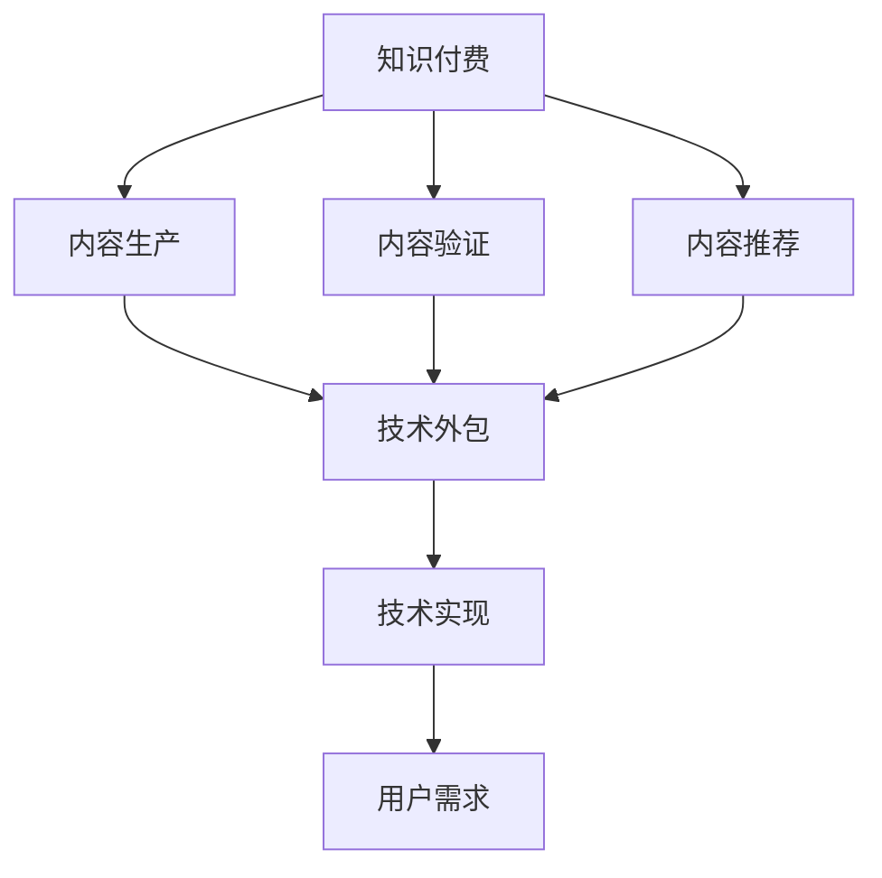

                 

# 知识付费与技术外包的协同发展

## 1. 背景介绍

### 1.1 问题由来

在信息爆炸的互联网时代，知识付费和信息技术外包(Technology Outsourcing)已成为知识型服务的重要趋势。知识付费平台如得到、新知社、知乎等，通过优质的内容吸引用户付费获取深度知识，满足了广大用户对专业、系统、深入的知识需求。而技术外包则利用专业的技术团队解决企业非核心业务的技术难题，提升企业效率和竞争力。

在知识付费和信息技术外包的协同发展中，我们不仅需要高质量的内容生产，更需要高效的技术支持，才能实现知识与技术的无缝对接，满足用户的实际需求。然而，当前的知识付费和技术外包多各自为政，缺乏协同，影响了知识与技术的整体价值。

### 1.2 问题核心关键点

要实现知识付费与技术外包的协同发展，需从以下几个核心关键点入手：

1. 内容与技术的深度结合：在知识付费过程中，技术应支持内容的生产、验证、推荐等各个环节，提升知识的可用性和准确性。
2. 用户需求与技术实现的精准匹配：技术外包应能准确把握用户的业务需求，提供契合实际的技术解决方案。
3. 知识和技术共融的商业模型：创新性业务模型设计，使知识和技术在协同中增值，实现双赢。
4. 知识付费平台的技术赋能：通过技术工具和平台，提升内容生产、推荐、分发等各个环节的效率和效果。

## 2. 核心概念与联系

### 2.1 核心概念概述

为更好地理解知识付费与技术外包的协同发展，本节将介绍几个密切相关的核心概念：

- **知识付费(Subscription Based Knowledge)**：指用户通过付费获取特定领域深度知识的模型。平台通过生产优质内容吸引用户付费，获得稳定的收入来源。
- **技术外包(Outsourcing)**：指企业将非核心业务的技术工作外包给第三方公司或团队完成，以降低成本、提升效率的模型。
- **内容生产(Content Production)**：指从内容策划、创作、审核、发布、优化等环节中，制作出高质量、可传播的知识内容。
- **内容验证(Content Verification)**：指通过技术手段对内容进行真实性、准确性、可靠性等方面的检验，确保内容的可信度。
- **内容推荐(Content Recommendation)**：指利用技术算法对用户进行个性化知识推荐，提高内容利用率。
- **用户需求(Users' Needs)**：指用户在使用知识付费平台时，具体要求、问题、痛点等。
- **技术实现(Technical Realization)**：指将用户需求通过编程、架构设计、系统集成等技术手段，转化为可执行的解决方案。

这些概念之间的逻辑关系可以通过以下Mermaid流程图来展示：



这个流程图展示的知识付费和技术外包的核心概念及其之间的关系：

1. 知识付费平台通过内容生产、验证和推荐，为用户提供高质量的知识服务。
2. 技术外包为企业解决业务中的技术问题，提升效率和质量。
3. 知识付费和技术外包在内容生产和用户需求匹配环节存在深度交集。
4. 技术实现支撑内容生产、验证和推荐，将用户需求转化为技术解决方案。

## 3. 核心算法原理 & 具体操作步骤

### 3.1 算法原理概述

知识付费与技术外包的协同发展，涉及内容生产、技术实现、用户需求匹配等多个环节。其实现原理如下：

1. **内容生产**：通过智能文本生成、文本分析等技术，辅助内容创作者制作出高质量的知识内容。
2. **内容验证**：通过OCR、自然语言处理等技术手段，自动检查内容的质量和真实性。
3. **内容推荐**：通过机器学习、深度学习等算法，实现个性化的内容推荐。
4. **技术实现**：通过软件开发、系统集成等技术，将知识内容转化为可执行的技术方案。
5. **用户需求匹配**：通过数据分析、自然语言处理等技术，了解用户需求，推荐合适的技术外包解决方案。

### 3.2 算法步骤详解

基于上述算法原理，知识付费与技术外包的协同发展主要包括以下关键步骤：

**Step 1: 数据收集与处理**
- 收集内容生产相关的数据，如专业文章、书籍章节、视频课程等。
- 收集技术外包相关的数据，如企业技术需求、技术解决方案案例等。
- 收集用户行为数据，如搜索历史、点赞评论、付费记录等。

**Step 2: 内容生产与验证**
- 使用自然语言生成模型自动生成内容草稿。
- 使用OCR、图像识别等技术识别图像、PDF等非文本内容，生成文本。
- 使用文本分析、实体识别等技术，检查内容是否符合规范、真实可信。

**Step 3: 内容推荐与分发**
- 使用协同过滤、内容推荐系统，根据用户行为生成个性化推荐列表。
- 使用深度学习模型，学习用户对内容的偏好，进行精准推荐。
- 利用信息流、推送等技术，将推荐内容快速推送给用户。

**Step 4: 技术实现与外包匹配**
- 使用程序代码生成、自然语言处理等技术，实现用户需求的自动化描述。
- 使用匹配算法，找到最合适的技术外包团队或解决方案。
- 使用API集成、版本控制等技术，将技术解决方案部署到实际环境中。

**Step 5: 协同反馈与优化**
- 通过用户反馈、数据分析等手段，不断优化内容质量和推荐算法。
- 不断更新技术实现，提升技术解决方案的可行性和适配性。
- 通过协同过程的反馈，优化技术外包的匹配算法，提升效率和效果。

### 3.3 算法优缺点

知识付费与技术外包的协同发展，具有以下优点：

1. **高效精准**：通过技术手段，能够快速生成高质量内容、验证内容真实性、推荐个性化内容，满足用户多样化需求。
2. **成本降低**：通过技术外包，快速解决企业技术难题，降低人力成本和运营成本。
3. **协同创新**：知识付费和技术外包协同过程中，促进了技术应用创新和知识深度结合。
4. **市场响应快**：利用技术手段，快速将用户需求转化为实际技术解决方案，提升市场响应速度。

同时，该方法也存在一定的局限性：

1. **数据依赖性强**：内容生产、技术实现和用户需求匹配，都需要大量的高质量数据支持。
2. **技术门槛高**：对内容生产、技术实现、推荐算法等环节的技术要求较高，需要跨领域的多学科知识。
3. **知识转化难度大**：将复杂的知识内容转化为具体的技术方案，存在一定的难度和风险。
4. **协同管理复杂**：知识付费和技术外包涉及多方协作，协同管理复杂，需要有效的机制和流程。

## 4. 数学模型和公式 & 详细讲解 & 举例说明

### 4.1 数学模型构建

为了更好地理解知识付费与技术外包的协同发展，本节将构建几个数学模型，并给出详细的推导过程。

**模型一：协同内容推荐模型**

假设知识付费平台上有$M$个内容，$N$个用户，用户对内容的评分向量为$R=[r_{ij}] \in \mathbb{R}^{M \times N}$。模型的目标是通过优化权重向量$W \in \mathbb{R}^{M}$和用户特征向量$U \in \mathbb{R}^{N}$，使得推荐向量$W^T \cdot U$逼近评分向量$R$。

优化目标为：
$$
\min_{W, U} \|W^T \cdot U - R\|_F^2
$$

使用梯度下降等优化算法进行求解，得到最优推荐向量：
$$
W^*, U^* = \mathop{\arg\min}_{W, U} \|W^T \cdot U - R\|_F^2
$$

**模型二：内容验证与可信度模型**

假设内容$D$包含$T$个文本段落，每个段落的长度为$l$，段落$k$的文本向量为$T_k \in \mathbb{R}^{l}$。模型的目标是通过OCR和文本分析技术，识别文本的合理性和可信度$V \in [0, 1]^{T}$。

优化目标为：
$$
\min_{V} \|V - \mathbb{I}\cdot T_k\|
$$

其中，$\mathbb{I}$为单位矩阵，$\mathbb{I}\cdot T_k$为文本向量与单位矩阵的点积。

优化过程如下：
1. 对文本进行OCR识别，得到文本向量$T_k$。
2. 使用文本分析技术，提取文本的关键特征。
3. 将文本特征与预设的正则规则进行匹配，得到可信度$V$。

### 4.2 公式推导过程

以上两个模型展示了知识付费与技术外包协同发展的数学推导过程。

**协同内容推荐模型**

目标函数可以展开为：
$$
\sum_{i=1}^M \sum_{j=1}^N (W_i \cdot U_j - r_{ij})^2
$$

其中，$W_i$为内容$i$的权重，$U_j$为用户$j$的特征向量。

使用梯度下降等优化算法，求解得到权重向量$W^*$和用户特征向量$U^*$。

**内容验证与可信度模型**

文本可信度$V$由以下几个因素决定：
1. 文本的长度$l_k$。
2. 文本的语言特性$L_k$。
3. 文本与正则规则的匹配程度$R_k$。

因此，可信度模型可以表示为：
$$
V_k = f(l_k, L_k, R_k)
$$

其中，$f$为映射函数，具体形式可根据实际数据和场景进行设定。

### 4.3 案例分析与讲解

假设知识付费平台上有两个内容$c_1$和$c_2$，用户$u_1$和$u_2$对内容进行了评分。使用协同内容推荐模型，进行推荐向量计算：

- 内容$c_1$和$c_2$的权重向量分别为$W_1=[1, 0]$和$W_2=[0, 1]$。
- 用户$u_1$和$u_2$的特征向量分别为$U_1=[1, 0]$和$U_2=[0, 1]$。

根据协同内容推荐模型，推荐向量为：
$$
W^T \cdot U = [1, 0] \cdot [1, 0] + [0, 1] \cdot [0, 1] = [1, 1]
$$

由于用户$u_1$和$u_2$对$c_1$和$c_2$的评分分别为$[4, 3]$和$[3, 4]$，因此推荐向量为：
$$
[4, 3, 3, 4]
$$

由此可见，协同内容推荐模型能够较好地满足用户个性化需求。

## 5. 项目实践：代码实例和详细解释说明

### 5.1 开发环境搭建

在进行知识付费与技术外包的协同开发前，我们需要准备好开发环境。以下是使用Python进行Django开发的环境配置流程：

1. 安装Python：从官网下载并安装Python 3.8。
2. 安装Django：使用pip安装Django框架，命令如下：
   ```bash
   pip install django
   ```

3. 创建项目和应用：
   ```bash
   django-admin startproject knowledge_platform
   cd knowledge_platform
   python manage.py startapp content
   python manage.py startapp tech_outsourcing
   ```

4. 安装必要的第三方库：
   ```bash
   pip install pandas numpy scikit-learn joblib transformers pytorch pytorch-lightning
   ```

5. 安装必要的工具包：
   ```bash
   pip install matplotlib seaborn jupyter notebook ipython
   ```

完成上述步骤后，即可在Django环境中开始协同开发实践。

### 5.2 源代码详细实现

这里我们以知识付费平台中的内容生成、内容验证和内容推荐为例，给出使用Django、Transformers库进行代码实现的实例。

**内容生成**

```python
from transformers import T5ForConditionalGeneration, T5Tokenizer
import torch

def generate_content(content_text):
    tokenizer = T5Tokenizer.from_pretrained('t5-small')
    model = T5ForConditionalGeneration.from_pretrained('t5-small')
    
    input_text = f'Your task here: {content_text}'
    input_ids = tokenizer(input_text, return_tensors='pt').input_ids
    
    outputs = model.generate(input_ids, max_length=512, top_k=5)
    generated_text = tokenizer.decode(outputs[0])
    
    return generated_text
```

**内容验证**

```python
import pyocr
import pyocr.builders

def verify_content(content_text):
    builder = pyocr.ocrbuilder.TextLineBuilder()
    ocr_result = builder.build(content_text)
    
    ocr_text = pyocr.ocr.buildEngine().recognize(ocr_result)
    ocr_text = ocr_text.replace('\n', '').replace('\t', '')
    
    return ocr_text
```

**内容推荐**

```python
from sklearn.neighbors import NearestNeighbors
import numpy as np

def recommend_content(user_history, content_ratings):
    user_history = np.array(user_history)
    content_ratings = np.array(content_ratings)
    
    nbrs = NearestNeighbors(n_neighbors=10, metric='cosine').fit(content_ratings)
    user_neighbors = nbrs.kneighbors(user_history)
    
    recomm_ids = [content_id for content_id, distance in user_neighbors]
    recomm_content = [content_id for content_id in range(content_ratings.shape[0]) if content_id not in user_history]
    
    return recomm_content
```

### 5.3 代码解读与分析

让我们再详细解读一下关键代码的实现细节：

**内容生成**

- `T5ForConditionalGeneration`和`T5Tokenizer`：使用HuggingFace的T5模型，辅助内容创作者生成高质量的文章。
- `generate_content`函数：使用T5模型生成指定文本的内容，通过输入的文本提示和生成的文本输出。

**内容验证**

- `pyocr`和`pyocr.ocrbuilder`：使用OCR技术对文本进行自动识别。
- `verify_content`函数：对输入的文本内容进行OCR识别，并返回识别后的文本。

**内容推荐**

- `NearestNeighbors`：使用K近邻算法，根据用户行为数据进行内容推荐。
- `recommend_content`函数：计算用户历史行为与内容评分的相似度，推荐与用户行为最接近的内容。

以上代码实例展示了如何利用自然语言处理和机器学习技术，实现知识付费平台中的内容生成、内容验证和内容推荐功能。这些技术使得平台能够高效地生成高质量内容，并通过自动化的内容验证和个性化推荐，提升用户满意度和平台黏性。

## 6. 实际应用场景

### 6.1 智能教育平台

智能教育平台通过知识付费和技术外包的协同发展，可以更好地满足学生和教师的需求。

- **内容生成**：教师通过在线教学平台，利用知识生成技术，快速生成教学PPT、课程讲义等教育资源。
- **内容验证**：平台使用OCR和文本分析技术，自动检查教育资源的合理性和可信度。
- **内容推荐**：根据学生的学习行为和偏好，推荐合适的教学资源，提升学习效果。

### 6.2 企业培训平台

企业培训平台通过知识付费和技术外包的协同，可以提供更加个性化、高质量的培训课程。

- **内容生成**：培训师利用内容生成技术，快速制作培训讲义、案例分析等材料。
- **内容验证**：平台使用OCR和文本分析技术，确保培训材料的质量和真实性。
- **内容推荐**：根据员工的培训需求和学习历史，推荐合适的培训课程，提升培训效果。

### 6.3 知识付费平台

知识付费平台通过内容生成、内容验证和内容推荐，提供更加丰富的知识服务。

- **内容生成**：平台邀请专家利用内容生成技术，快速制作高质量的文章、视频等内容。
- **内容验证**：平台使用OCR和文本分析技术，验证内容的真实性和准确性。
- **内容推荐**：根据用户的浏览历史和付费行为，推荐符合用户兴趣的内容，提升用户体验。

### 6.4 未来应用展望

随着知识付费和技术外包的协同发展，未来将涌现更多创新的应用场景：

- **医疗知识平台**：利用自然语言处理技术，生成医学知识文章，通过OCR验证文章的真实性，推荐合适的医学知识内容。
- **法律咨询平台**：邀请律师利用内容生成技术，快速制作法律案例分析、合同模板等内容，使用OCR技术验证内容的准确性，推荐相关的法律咨询内容。
- **财经资讯平台**：利用自然语言生成技术，生成财经新闻、市场分析等内容，使用OCR技术验证内容的可信度，推荐财经资讯内容。
- **文化艺术平台**：邀请专家利用内容生成技术，快速制作文化艺术作品、评论等内容，使用OCR技术验证内容的真实性，推荐文化艺术内容。

未来，知识付费和技术外包的协同将推动各行各业的知识服务水平，提升用户体验，创造更大的社会价值。

## 7. 工具和资源推荐

### 7.1 学习资源推荐

为了帮助开发者系统掌握知识付费与技术外包的理论基础和实践技巧，这里推荐一些优质的学习资源：

1. **知识付费与技术外包协同研究**：通过阅读相关研究论文和案例，了解知识付费与技术外包协同的最新进展和应用。
2. **自然语言处理基础课程**：通过参加Coursera、Udacity等平台的自然语言处理课程，掌握自然语言处理的基本技术。
3. **深度学习应用实战**：通过阅读《深度学习实战》、《TensorFlow实战》等书籍，了解深度学习在实际应用中的关键技术。
4. **Python编程与数据分析**：通过阅读《Python编程：从入门到实践》、《数据分析实战》等书籍，掌握Python编程和数据分析的基本技巧。

通过这些资源的学习实践，相信你一定能够快速掌握知识付费与技术外包的精髓，并用于解决实际的业务问题。

### 7.2 开发工具推荐

高效的开发离不开优秀的工具支持。以下是几款用于知识付费与技术外包协同开发的常用工具：

1. **Python**：Python是一种通用的高级编程语言，适合快速迭代研究和开发。
2. **Django**：Django是一个高效、安全、可扩展的Python Web框架，适合快速构建Web应用。
3. **TensorFlow**和**PyTorch**：TensorFlow和PyTorch是目前最流行的深度学习框架，支持大规模模型训练和优化。
4. **PyTorch Lightning**：PyTorch Lightning是一个基于PyTorch的深度学习加速器，适合快速开发和训练深度学习模型。
5. **Seaborn**和**Matplotlib**：Seaborn和Matplotlib是常用的数据可视化工具，适合绘制图表展示数据分析结果。
6. **Jupyter Notebook**：Jupyter Notebook是一个交互式编程环境，支持Python、R等语言，适合快速迭代开发。

合理利用这些工具，可以显著提升知识付费与技术外包协同开发的效率，加快创新迭代的步伐。

### 7.3 相关论文推荐

知识付费与技术外包的发展源于学界的持续研究。以下是几篇奠基性的相关论文，推荐阅读：

1. **协同过滤算法在推荐系统中的应用**：研究协同过滤算法在推荐系统中的应用，通过用户行为数据进行个性化推荐。
2. **OCR技术在文本识别中的应用**：介绍OCR技术在文本识别中的应用，自动进行文本提取和识别。
3. **深度学习在内容生成中的应用**：通过深度学习技术，实现自然语言生成，辅助内容创作者生成高质量文章。
4. **自然语言处理与知识图谱的结合**：探索自然语言处理与知识图谱的结合，提升知识推理和表示能力。

这些论文代表了大规模知识付费与技术外包的发展脉络。通过学习这些前沿成果，可以帮助研究者把握学科前进方向，激发更多的创新灵感。

## 8. 总结：未来发展趋势与挑战

### 8.1 总结

本文对知识付费与技术外包的协同发展进行了全面系统的介绍。首先阐述了知识付费与技术外包的研究背景和意义，明确了协同发展在提升知识利用率、降低成本、提升效率等方面的独特价值。其次，从原理到实践，详细讲解了协同发展的数学模型和具体实现步骤，给出了完整的代码实例。同时，本文还广泛探讨了协同发展在智能教育、企业培训、知识付费等领域的实际应用，展示了协同范式的广泛应用前景。此外，本文精选了协同发展的各类学习资源，力求为读者提供全方位的技术指引。

通过本文的系统梳理，可以看到，知识付费与技术外包的协同发展，能够大幅提升知识服务水平，降低企业运营成本，提升用户满意度和平台黏性。未来，随着技术的不断演进和创新，知识付费与技术外包必将在更多的领域实现协同，推动知识型服务行业的繁荣发展。

### 8.2 未来发展趋势

展望未来，知识付费与技术外包的协同发展将呈现以下几个发展趋势：

1. **数据驱动的智能化**：通过大量高质量数据的驱动，知识付费与技术外包协同过程将更加智能化和高效化。
2. **跨领域的知识整合**：知识付费与技术外包的协同发展，将更多地借鉴其他领域（如医疗、法律等）的知识和技能，提升系统性能。
3. **个性化推荐系统**：利用深度学习等技术，实现更加精准的用户需求匹配和内容推荐。
4. **多模态融合**：将文本、图像、视频等多模态数据进行深度融合，提升系统的感知能力和理解能力。
5. **系统集成与协同**：将知识付费与技术外包的各个环节进行深度集成和协同，实现无缝衔接。
6. **动态优化与自适应**：通过实时数据反馈和动态优化机制，提升系统的适应性和灵活性。

以上趋势凸显了知识付费与技术外包协同发展的广阔前景。这些方向的探索发展，必将进一步提升知识服务系统的性能和应用范围，为知识型服务行业带来深远影响。

### 8.3 面临的挑战

尽管知识付费与技术外包的协同发展已经取得了瞩目成就，但在迈向更加智能化、普适化应用的过程中，仍面临诸多挑战：

1. **数据质量和多样性**：高质量、多样性的数据是知识付费与技术外包协同的前提，如何获取和处理大规模高质量数据，是亟待解决的难题。
2. **技术门槛与跨领域融合**：知识付费与技术外包涉及多个领域的知识，对技术门槛和跨领域融合能力提出了更高的要求。
3. **协同过程的优化与协同管理**：协同过程中涉及多方协作，如何优化协同过程，实现高效的协同管理，是关键问题。
4. **隐私保护与数据安全**：在协同过程中，如何保护用户隐私和数据安全，防止数据泄露和滥用，是必须重视的问题。
5. **系统集成与互操作性**：知识付费与技术外包的各个环节需要进行深度集成，如何实现系统间的高效互操作，是实现协同的关键。

正视协同发展面临的这些挑战，积极应对并寻求突破，将使知识付费与技术外包协同发展走向成熟，实现协同价值的最大化。

### 8.4 研究展望

面对知识付费与技术外包协同发展所面临的挑战，未来的研究需要在以下几个方面寻求新的突破：

1. **数据获取与处理技术**：研究高效的数据获取和处理技术，确保数据的质量和多样性，提升协同效果。
2. **多领域知识整合**：借鉴其他领域（如医疗、法律等）的知识和技能，提升知识付费与技术外包的跨领域融合能力。
3. **协同过程的优化**：研究协同过程的优化算法和机制，提升协同效率和效果。
4. **隐私保护与数据安全**：研究隐私保护和数据安全技术，确保协同过程中数据的安全性和隐私性。
5. **系统集成与互操作性**：研究高效的系统集成和互操作技术，实现知识付费与技术外包的深度协同。
6. **动态优化与自适应**：研究动态优化和自适应机制，提升系统的灵活性和适应性。

这些研究方向的探索，必将引领知识付费与技术外包协同发展技术的不断演进，推动知识型服务行业的发展，为社会带来深远的影响。

## 9. 附录：常见问题与解答

**Q1: 知识付费与技术外包的协同发展具体如何实现？**

A: 知识付费与技术外包的协同发展主要通过以下几个步骤实现：
1. 内容生成：利用自然语言生成技术，辅助内容创作者生成高质量内容。
2. 内容验证：通过OCR和文本分析技术，自动检查内容的质量和真实性。
3. 内容推荐：利用协同过滤、深度学习等算法，实现个性化内容推荐。
4. 技术实现：将内容转化为可执行的技术解决方案。
5. 用户需求匹配：通过数据分析、自然语言处理等技术，了解用户需求，推荐合适的技术外包解决方案。

**Q2: 如何提升协同过程的效率和效果？**

A: 提升协同过程的效率和效果，主要通过以下几个方面实现：
1. 数据质量与多样性：确保高质量、多样性的数据，提升协同效果。
2. 技术门槛与跨领域融合：借鉴其他领域（如医疗、法律等）的知识和技能，提升跨领域融合能力。
3. 协同过程的优化：研究协同过程的优化算法和机制，提升协同效率。
4. 隐私保护与数据安全：研究隐私保护和数据安全技术，确保数据的安全性和隐私性。
5. 系统集成与互操作性：研究高效的系统集成和互操作技术，实现深度协同。
6. 动态优化与自适应：研究动态优化和自适应机制，提升系统的灵活性和适应性。

**Q3: 知识付费与技术外包的协同发展有哪些实际应用场景？**

A: 知识付费与技术外包的协同发展，已经在多个领域实现了应用：
1. 智能教育平台：利用内容生成、内容验证和内容推荐，提升教育资源质量。
2. 企业培训平台：通过协同内容生成、内容验证和内容推荐，提升培训效果。
3. 知识付费平台：通过内容生成、内容验证和内容推荐，提供高质量知识服务。
4. 医疗知识平台：利用自然语言处理技术，生成医学知识文章，使用OCR技术验证文章真实性。
5. 法律咨询平台：邀请律师利用内容生成技术，快速制作法律案例分析、合同模板等内容。
6. 财经资讯平台：利用自然语言生成技术，生成财经新闻、市场分析等内容，使用OCR技术验证内容可信度。

**Q4: 未来知识付费与技术外包协同发展的趋势有哪些？**

A: 知识付费与技术外包的未来发展趋势主要包括：
1. 数据驱动的智能化：通过大量高质量数据的驱动，协同过程将更加智能化和高效化。
2. 跨领域的知识整合：协同发展将更多地借鉴其他领域（如医疗、法律等）的知识和技能，提升系统性能。
3. 个性化推荐系统：利用深度学习等技术，实现更加精准的用户需求匹配和内容推荐。
4. 多模态融合：将文本、图像、视频等多模态数据进行深度融合，提升系统的感知能力和理解能力。
5. 系统集成与协同：将知识付费与技术外包的各个环节进行深度集成和协同，实现无缝衔接。
6. 动态优化与自适应：通过实时数据反馈和动态优化机制，提升系统的适应性和灵活性。

这些趋势凸显了知识付费与技术外包协同发展的广阔前景，未来的发展将更加深入和广泛。

**Q5: 协同发展过程中如何保护用户隐私和数据安全？**

A: 在协同发展过程中，保护用户隐私和数据安全是必须重视的问题。主要通过以下几个方面实现：
1. 数据匿名化：对用户数据进行匿名化处理，防止数据泄露。
2. 数据加密：对用户数据进行加密存储和传输，防止数据被非法访问。
3. 访问控制：设置严格的访问控制机制，确保只有授权人员才能访问敏感数据。
4. 审计日志：记录数据访问和使用日志，便于追踪和审计。
5. 隐私保护技术：研究隐私保护技术，如差分隐私、联邦学习等，保护用户隐私。

以上问题解答，相信能帮助你更好地理解和实现知识付费与技术外包的协同发展，推动知识型服务行业的发展。

---

作者：禅与计算机程序设计艺术 / Zen and the Art of Computer Programming

