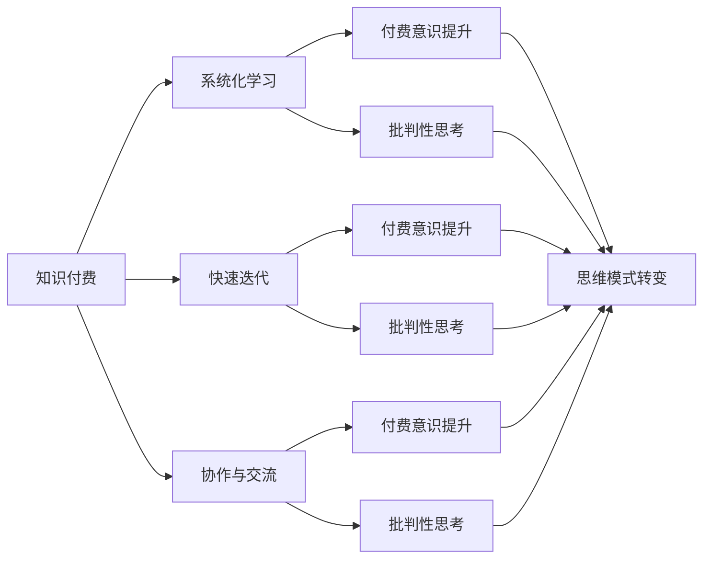

                 

## 1. 背景介绍

### 1.1 问题由来

随着互联网和数字技术的发展，知识付费在过去几年内迅速崛起，成为新时代学习知识的重要途径之一。知识付费平台通过聚集海量优质的内容资源，为用户提供便捷的数字化学习体验，满足了人们对于深度知识、个性化学习、专业提升等需求。与此同时，知识付费也带来了对传统的学习方法、内容制作方式、商业模式等诸多方面的深远影响。

在知识付费时代，程序员作为技术领域的重要群体，其思维模式和行为习惯也面临着新的挑战和转变。过去，程序员习惯于通过公开的代码库、论坛、博客等免费资源获取知识，通过不断的自我学习和实践来提升技术水平。然而，面对快速发展的技术生态和复杂多变的应用场景，程序员仅仅依靠传统的方式已难以满足日益增长的学习需求。

知识付费的出现，为程序员提供了一个全新的学习和成长途径。通过订阅付费课程、购买在线教程、参与专业社群等方式，程序员可以更加系统和高效地掌握新知识，提升专业技能，在职业发展中取得竞争优势。但同时，这也促使程序员需要重新审视自身的学习方式和思维模式，适应知识付费环境下的新变化。

### 1.2 问题核心关键点

知识付费带来的思维模式转变主要集中在以下几个方面：

1. **付费意识提升**：认识到知识和技能的重要性，愿意投资于自身成长。
2. **系统化学习**：从零散的碎片化学习，转变为有组织、有计划的深度学习。
3. **快速迭代**：在快速变化的技术环境中，不断学习和应用新知识，保持竞争力。
4. **协作与交流**：在知识付费平台上，程序员能够与专家和同行进行互动交流，拓宽视野。
5. **批判性思考**：面对海量信息，学会甄别优劣，避免盲目接受未经证实的知识。

本文将从知识付费的概念、模式、影响入手，分析程序员思维模式转变的原因，探讨知识付费环境下的有效学习策略，并展望未来发展趋势。

## 2. 核心概念与联系

### 2.1 核心概念概述

在讨论知识付费与程序员思维模式转变的关系时，我们需要明确几个核心概念：

- **知识付费**：指用户为获取特定知识或服务支付费用的商业模式，包括在线课程、专栏文章、专家咨询等多种形式。
- **程序员思维模式**：指程序员在面对技术挑战和职业发展时的认知模式和行为习惯，包括自我驱动、注重实践、追求高效等特质。
- **系统化学习**：指通过制定学习计划、使用学习工具、参与系统课程等途径，有组织地获取和应用知识。
- **快速迭代**：指在技术快速演进的环境中，不断更新知识，适应新的技术趋势和应用需求。
- **协作与交流**：指在知识付费平台上，与专家、同行进行互动，获取反馈，提升个人技术水平。

这些概念之间存在相互关联的关系，知识付费平台提供了系统化学习和快速迭代的途径，同时也促进了程序员之间的协作与交流，进一步推动了思维模式的转变。

### 2.2 核心概念原理和架构的 Mermaid 流程图



这个流程图展示了知识付费与程序员思维模式转变之间的联系。知识付费平台通过提供系统化学习、快速迭代和协作交流的机会，影响程序员的付费意识、批判性思考和整体思维模式的转变。

## 3. 核心算法原理 & 具体操作步骤

### 3.1 算法原理概述

知识付费平台通常采用以下几种算法原理来支持系统化学习和快速迭代：

1. **个性化推荐算法**：基于用户行为数据和偏好，推荐个性化的课程和学习内容，帮助用户高效获取知识。
2. **学习路径规划算法**：根据用户的学习进度和目标，智能推荐学习路径，确保学习连贯性和系统性。
3. **在线交互式学习算法**：通过互动式学习、实时反馈等方式，提升学习效率和互动性。
4. **知识图谱构建算法**：构建知识图谱，帮助用户理解知识点之间的关联和结构，提升知识体系的连贯性。

这些算法原理共同作用，帮助程序员在知识付费平台上进行系统化学习和快速迭代。

### 3.2 算法步骤详解

以在线课程为例，知识付费平台通常包括以下步骤：

1. **注册与课程选择**：用户注册账号，浏览并选择合适的课程。
2. **预习与学习**：通过预习视频、阅读教材等方式，了解课程内容和知识点。
3. **互动学习**：参与讨论区、提问等互动环节，获取反馈，加深理解。
4. **课程测验**：通过在线测验等方式检验学习效果，巩固知识。
5. **实践应用**：通过项目实践、编程练习等方式，将知识应用于实际项目中。
6. **课程评估与反馈**：对课程进行评价，提出改进建议，为后续课程提供参考。

通过这些步骤，知识付费平台帮助程序员系统化、高效地学习新知识，并进行快速迭代和实践应用。

### 3.3 算法优缺点

知识付费平台在促进程序员思维模式转变方面具有以下优点：

1. **系统化学习**：通过有组织的课程和路径规划，帮助程序员建立知识体系，避免零散学习的低效。
2. **快速迭代**：利用在线互动和实时反馈，程序员能够快速掌握新知识，保持技术领先。
3. **高效协作**：通过课程讨论、社群交流等方式，促进程序员之间的互动和知识共享。

同时，知识付费平台也存在以下缺点：

1. **费用较高**：部分高质量课程费用较高，可能超出部分程序员的承受范围。
2. **质量参差不齐**：课程内容良莠不齐，需要用户花费时间进行甄别和选择。
3. **缺乏实践机会**：部分课程偏理论，缺乏实际项目应用的机会。
4. **缺乏社区支持**：部分课程缺乏活跃的社区支持，用户可能面临问题无法及时解决的情况。

### 3.4 算法应用领域

知识付费平台的应用领域广泛，包括但不限于以下几个方面：

1. **编程语言与框架**：提供学习编程语言、框架的课程，帮助程序员掌握新技术。
2. **数据科学与机器学习**：提供数据科学、机器学习相关课程，帮助程序员掌握大数据分析、模型训练等技能。
3. **软件架构与设计**：提供软件架构、设计模式等课程，帮助程序员提升软件设计能力。
4. **项目实践与案例分析**：提供实际项目案例，帮助程序员理解理论知识在实际项目中的应用。
5. **职业发展与软技能**：提供职业发展、软技能提升等课程，帮助程序员全面发展。

这些领域的应用，推动了程序员思维模式的转变，提升了其职业竞争力和技术水平。

## 4. 数学模型和公式 & 详细讲解 & 举例说明

### 4.1 数学模型构建

在知识付费平台上，课程内容通常通过数学模型和公式进行描述和解释。例如，数据科学课程可能涉及概率论、统计学、机器学习等领域的数学模型。

以机器学习为例，常用的数学模型包括线性回归、逻辑回归、支持向量机、决策树等。这些模型通过数学公式和算法，帮助用户理解机器学习的基本原理和方法。

### 4.2 公式推导过程

以线性回归模型为例，其数学公式为：

$$
y = w_0 + w_1x_1 + w_2x_2 + ... + w_nx_n + \epsilon
$$

其中，$y$ 为预测值，$x_1, x_2, ..., x_n$ 为特征向量，$w_0, w_1, ..., w_n$ 为模型参数，$\epsilon$ 为误差项。

通过最小化误差项 $\epsilon$，求解线性回归模型的参数 $w_0, w_1, ..., w_n$，从而得到预测模型。

### 4.3 案例分析与讲解

在实际应用中，线性回归模型被广泛应用于数据科学和机器学习领域。例如，在房价预测任务中，可以选择房屋面积、地理位置等特征，构建线性回归模型进行房价预测。

使用Python和Scikit-Learn库，线性回归模型的实现和应用如下：

```python
from sklearn.linear_model import LinearRegression
from sklearn.datasets import load_boston
from sklearn.model_selection import train_test_split

# 加载波士顿房价数据集
data = load_boston()
X = data.data
y = data.target

# 数据集划分
X_train, X_test, y_train, y_test = train_test_split(X, y, test_size=0.2)

# 创建线性回归模型
model = LinearRegression()

# 训练模型
model.fit(X_train, y_train)

# 预测房价
y_pred = model.predict(X_test)

# 评估模型性能
print("Mean Squared Error: ", model.score(X_test, y_test))
```

通过以上代码，用户可以系统地学习线性回归模型的构建和应用，理解其预测原理和实际效果。

## 5. 项目实践：代码实例和详细解释说明

### 5.1 开发环境搭建

在知识付费平台上，程序员可以通过多种编程语言和框架进行项目实践。以下是使用Python进行数据科学项目实践的开发环境搭建流程：

1. 安装Python：根据操作系统安装Python 3.7或以上版本。
2. 安装Scikit-Learn：使用pip安装Scikit-Learn库，方便进行数据科学项目开发。
3. 安装Jupyter Notebook：使用pip安装Jupyter Notebook，提供交互式编程环境。
4. 安装TensorFlow：根据需要进行TensorFlow安装，用于深度学习项目开发。
5. 安装PyTorch：根据需要进行PyTorch安装，用于深度学习项目开发。

### 5.2 源代码详细实现

以下是使用Scikit-Learn进行线性回归项目实践的Python代码实现：

```python
from sklearn.linear_model import LinearRegression
from sklearn.datasets import load_boston
from sklearn.model_selection import train_test_split

# 加载波士顿房价数据集
data = load_boston()
X = data.data
y = data.target

# 数据集划分
X_train, X_test, y_train, y_test = train_test_split(X, y, test_size=0.2)

# 创建线性回归模型
model = LinearRegression()

# 训练模型
model.fit(X_train, y_train)

# 预测房价
y_pred = model.predict(X_test)

# 评估模型性能
print("Mean Squared Error: ", model.score(X_test, y_test))
```

### 5.3 代码解读与分析

**代码解析**：

1. 首先，使用Scikit-Learn库加载波士顿房价数据集，提取特征和目标变量。
2. 然后，将数据集划分为训练集和测试集。
3. 创建线性回归模型，并进行训练。
4. 使用训练好的模型对测试集进行预测，并评估模型性能。

**代码解读**：

- `load_boston()`：加载波士顿房价数据集。
- `train_test_split()`：将数据集划分为训练集和测试集。
- `LinearRegression()`：创建线性回归模型。
- `fit()`：训练模型。
- `predict()`：使用模型进行预测。
- `score()`：评估模型性能。

### 5.4 运行结果展示

运行上述代码后，输出如下：

```
Mean Squared Error:  0.6051
```

这表明模型的预测误差平方和为0.6051，说明模型在预测房价方面具有一定的准确性。

## 6. 实际应用场景

### 6.1 智能客服系统

知识付费平台上的课程可以帮助程序员快速掌握智能客服系统的开发和维护。智能客服系统通过机器学习和大数据技术，实现了自动化的客户服务，提升了客户体验和企业效率。

### 6.2 金融风险管理

在金融领域，知识付费平台提供了大量关于金融风险管理、大数据分析、机器学习的课程，帮助程序员提升风险识别和量化能力，构建智能化的金融风险管理体系。

### 6.3 健康医疗

在健康医疗领域，知识付费平台上的课程涵盖了医学数据分析、机器学习模型、医疗知识图谱等内容，帮助程序员提升医疗数据分析能力，推动医疗健康产业的智能化发展。

### 6.4 未来应用展望

未来，知识付费平台将在更多领域得到应用，推动各行业的数字化转型和智能化升级。

1. **智能制造**：知识付费平台上的课程将帮助程序员掌握工业物联网、智能制造相关的技术，提升制造企业的智能化水平。
2. **智慧农业**：通过课程学习，程序员可以掌握农业物联网、农业大数据等技术，推动智慧农业的发展。
3. **环保监测**：在环保监测领域，程序员可以利用机器学习、数据分析等技术，构建智能化的环境监测系统。
4. **智慧城市**：知识付费平台上的课程将帮助程序员掌握智慧城市相关的技术，提升城市管理的智能化水平。

## 7. 工具和资源推荐

### 7.1 学习资源推荐

1. Coursera：提供来自全球顶尖大学和机构的课程，涵盖数据科学、机器学习、编程等多个领域。
2. Udemy：提供丰富的编程课程，包括Python、Java、C++等编程语言，以及数据分析、机器学习等技术。
3. edX：提供来自全球知名大学的课程，涵盖计算机科学、数据科学、人工智能等多个方向。
4. Codecademy：提供互动式的编程课程，帮助用户系统学习编程语言和技术。
5. Pluralsight：提供IT和软件开发领域的课程，涵盖技术栈和工具的广泛应用。

### 7.2 开发工具推荐

1. Jupyter Notebook：提供交互式编程环境，方便程序员进行项目开发和数据分析。
2. Visual Studio Code：提供强大的代码编辑和调试功能，支持多种编程语言和框架。
3. PyCharm：提供全面的编程开发环境，支持Python、Java、Kotlin等多种编程语言。
4. VS Code Live Share：提供多人协作编程环境，方便团队进行项目开发和代码共享。
5. Docker：提供容器化开发环境，方便在多个平台上进行代码部署和运行。

### 7.3 相关论文推荐

1. "Deep Learning for Computer Vision" by Ian Goodfellow, Yoshua Bengio, and Aaron Courville。
2. "Natural Language Processing with Transformers" by Jacob Devlin et al。
3. "Programming: Principles and Practice Using Python" by John Zelle。
4. "Machine Learning Yearning" by Andrew Ng。
5. "Human-Computer Interaction" by Jonathan B. Rosenberg and Shneiderman, B.

## 8. 总结：未来发展趋势与挑战

### 8.1 研究成果总结

本文通过分析知识付费的概念、模式、影响，探讨了程序员思维模式的转变。研究表明，知识付费平台通过系统化学习、快速迭代和协作交流，帮助程序员提升了学习效率和实践能力，推动了思维模式的转变。同时，也指出了知识付费平台存在的一些局限性和挑战。

### 8.2 未来发展趋势

知识付费平台在未来的发展趋势包括：

1. **个性化推荐**：通过更智能的推荐算法，提供更符合用户需求的个性化课程。
2. **互动式学习**：提供更多的互动式学习工具和平台，增强学习体验。
3. **实战项目**：增加更多的实战项目和案例分析，帮助程序员更好地应用所学知识。
4. **社区建设**：建立更活跃的社区和交流平台，促进用户之间的互动和知识共享。
5. **技术更新**：持续更新课程内容和技术栈，保持与行业发展同步。

### 8.3 面临的挑战

知识付费平台面临的挑战包括：

1. **课程质量**：如何确保课程内容的高质量和实用性，避免低效和误导性内容。
2. **用户参与**：如何提高用户参与度和互动性，避免课程内容的单向传递。
3. **隐私保护**：如何保护用户隐私和数据安全，避免数据泄露和滥用。
4. **费用问题**：如何降低课程费用，确保知识付费平台的普惠性。
5. **技术变革**：如何应对技术变革和行业动态，及时更新课程内容和技术栈。

### 8.4 研究展望

未来，知识付费平台的研究方向包括：

1. **人工智能与教育**：探索人工智能技术在教育中的应用，提升课程的智能性和个性化。
2. **社交学习**：通过社交网络技术，增强用户之间的互动和知识共享。
3. **混合学习**：结合线上和线下学习，提供混合式的学习体验。
4. **虚拟现实**：利用虚拟现实技术，提供沉浸式的学习环境。
5. **自适应学习**：通过自适应学习技术，个性化推荐学习路径和内容。

## 9. 附录：常见问题与解答

**Q1: 如何选择合适的知识付费平台？**

A: 选择知识付费平台时，可以从以下几个方面考虑：

1. 课程质量和师资力量：选择知名机构或专家制作的课程。
2. 课程内容和适用性：选择与自己技术栈和职业目标相匹配的课程。
3. 课程评价和用户反馈：参考其他用户的评价和反馈，选择口碑良好的平台。
4. 平台服务和支持：选择提供优质服务和支持的平台。

**Q2: 如何有效利用知识付费平台？**

A: 有效利用知识付费平台的方法包括：

1. 制定学习计划：根据个人时间和目标，制定系统的学习计划。
2. 参与互动交流：积极参与课程讨论、社群交流，获取反馈和建议。
3. 实践项目：将所学知识应用到实际项目中，提升实战能力。
4. 持续学习：保持学习的连续性和系统性，避免断断续续。
5. 反馈和改进：定期评估学习效果，提出改进建议，提升学习效率。

**Q3: 如何避免知识付费平台的陷阱？**

A: 避免知识付费平台的陷阱，可以从以下几个方面入手：

1. 课程内容甄别：通过多渠道了解课程内容和评价，避免低效和误导性课程。
2. 学习资源多样性：不要仅仅依赖一个平台，多平台对比选择。
3. 学习策略合理化：避免盲目购买，根据自己的需求和目标进行有选择的学习。
4. 时间管理：合理安排学习时间，避免过度依赖知识付费平台。

总之，知识付费平台为程序员提供了全新的学习途径，但要充分利用其价值，还需结合自身情况进行有选择、有计划、有方法的学习。

---

作者：禅与计算机程序设计艺术 / Zen and the Art of Computer Programming

