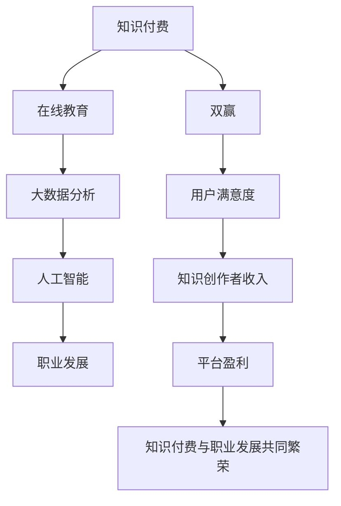

                 

# 知识付费与职业发展的双赢之道

> 关键词：知识付费, 职业发展, 双赢, 在线教育, 大数据分析, 人工智能

## 1. 背景介绍

在信息爆炸的今天，知识以空前的速度和规模不断涌现，对于任何个体而言，要通过传统的教育途径获取到足够的知识，需要花费巨大的时间和精力。特别是在知识更新迅速的领域，终身学习的理念已经深入人心。

职业发展不仅仅关注物质上的积累，更关注精神上的成长。在职场竞争日益激烈的环境下，个人需要不断更新自己的知识体系，提升自身的核心竞争力。

在这样的背景下，知识付费逐渐成为了一种新的趋势，一方面，知识付费可以让用户通过付费的方式获取专业的、系统化的知识，提高了学习的效率和质量；另一方面，知识创作者通过知识付费获得了相应的收入，激励了更多的优质知识内容产出，形成了知识生产与消费的良性循环。

本文章旨在探讨知识付费与职业发展的双赢之道，通过分析现状、挖掘痛点，提出解决方案，以期帮助个体在快速变化的时代中，通过知识付费实现职业突破，同时也为知识创作者提供了一个全新的市场机会。

## 2. 核心概念与联系

### 2.1 核心概念概述

#### 2.1.1 知识付费

知识付费是指用户通过支付一定的费用，获取到更加专业、系统和深入的知识。知识付费平台如得到、喜马拉雅、知乎live等，提供了丰富的在线课程、专题讲座、电子书等内容，满足了用户多样化的学习需求。

#### 2.1.2 职业发展

职业发展是指个体在职业生涯中，通过不断学习新知识、提升技能，实现职位晋升、薪酬提升、社会地位提高等目标的过程。职业发展不仅包括技术能力的提升，还涵盖了领导力、沟通能力、人际交往等多方面能力的提升。

#### 2.1.3 双赢

双赢指在知识付费与职业发展之间，双方通过相互协作，实现互利共赢的局面。对用户而言，通过知识付费，能够迅速掌握行业前沿知识，提升职业竞争力；对知识创作者而言，通过提供优质内容，获得了稳定的收入来源，同时实现了个人价值的体现。

#### 2.1.4 在线教育

在线教育是指通过互联网技术，以远程、在线的方式进行教学和学习。与传统教育相比，在线教育具有灵活性高、学习效率高、成本低等优点，可以更好地满足用户个性化的学习需求。

#### 2.1.5 大数据分析

大数据分析是指通过对大量数据进行收集、存储、处理、分析，提取有价值的信息，帮助决策者做出更加精准的判断。在知识付费与职业发展的过程中，通过大数据分析，可以更好地了解用户需求、优化内容结构，提升知识付费平台的用户体验和满意度。

#### 2.1.6 人工智能

人工智能是指通过模拟人的智能行为，实现自动化、智能化处理。在知识付费领域，人工智能技术可以用于个性化推荐、学习路径规划、智能客服等方面，提升用户的整体体验。

这些核心概念之间存在紧密的联系。知识付费与职业发展相辅相成，通过在线教育和大数据分析，可以更好地满足用户需求，提升学习效率；而人工智能技术则进一步提升了知识付费平台的智能化水平，增强了用户体验。

### 2.2 核心概念原理和架构的 Mermaid 流程图(Mermaid 流程节点中不要有括号、逗号等特殊字符)



## 3. 核心算法原理 & 具体操作步骤

### 3.1 算法原理概述

知识付费与职业发展的双赢之道，核心在于建立一个高效、灵活的知识流通与反馈机制。通过大数据分析技术，对用户的学习行为、偏好进行深入挖掘，结合人工智能技术，实现个性化推荐、学习路径规划等功能，从而提升用户的满意度和学习效率。

同时，平台通过数据分析技术，优化课程内容结构、提升课程质量，增强课程的吸引力，吸引更多的知识创作者入驻。知识创作者通过平台获得稳定的收入，进一步激励其提供高质量的内容。

### 3.2 算法步骤详解

#### 3.2.1 用户需求分析

1. **用户画像构建**：通过大数据分析，对用户的基本信息、学习偏好、职业背景等进行全面了解，构建用户画像。

2. **需求分析**：分析用户的学习需求、职业发展目标，识别用户需要获取的关键知识和技能。

3. **个性化推荐**：根据用户画像和需求分析结果，利用机器学习算法，推荐个性化的课程内容。

#### 3.2.2 课程内容优化

1. **内容筛选**：通过数据分析，筛选出用户评价高、互动频繁的课程内容，进行优先推荐。

2. **内容更新**：根据用户反馈和市场需求，定期更新课程内容，保持其时效性和实用性。

3. **内容迭代**：结合用户评价和数据反馈，对课程内容进行迭代优化，提升课程质量。

#### 3.2.3 学习路径规划

1. **技能树构建**：根据用户需求和职业发展目标，构建技能树，识别用户需要掌握的关键技能。

2. **学习路径规划**：根据技能树，规划用户的学习路径，推荐相关课程，帮助用户系统性地掌握知识。

#### 3.2.4 用户反馈收集

1. **互动反馈**：通过平台交互数据，收集用户对课程内容、教学风格的反馈。

2. **行为分析**：通过用户的学习行为数据，分析其学习效率和成果，发现潜在问题。

3. **定期评估**：定期对用户的学习成果进行评估，调整学习路径和课程内容。

#### 3.2.5 知识创作者激励

1. **收入分配**：根据课程的浏览量、互动量等指标，进行收入分配，确保知识创作者的收入与其价值相匹配。

2. **平台激励**：提供多种激励措施，如课程推广、曝光量提升等，增强知识创作者的创作动力。

3. **社区互动**：构建社区平台，知识创作者和用户可以直接交流互动，增强用户粘性。

### 3.3 算法优缺点

#### 3.3.1 优点

1. **高效学习**：通过个性化推荐和学习路径规划，用户能够迅速掌握所需的知识和技能，提高学习效率。

2. **质量保障**：通过数据驱动的内容优化和迭代，确保课程质量的高效性和实用性。

3. **用户满意度**：通过互动反馈和行为分析，及时调整课程内容和结构，提升用户满意度。

4. **创作者激励**：通过科学的收入分配和平台激励，确保知识创作者获得与其价值相匹配的收入。

#### 3.3.2 缺点

1. **数据隐私**：大规模的数据收集和分析，可能会侵犯用户隐私，需要严格遵守相关法律法规。

2. **算法偏见**：算法模型可能会存在偏见，影响推荐结果的公正性，需要进行持续优化和调整。

3. **平台依赖**：用户和创作者对平台的依赖性较强，一旦平台出现问题，可能会对学习效果和收入产生影响。

## 4. 数学模型和公式 & 详细讲解 & 举例说明

### 4.1 数学模型构建

#### 4.1.1 用户画像

用户画像可以表示为一个向量，包括用户的年龄、职业、兴趣、学习偏好等多个维度。设用户画像向量为 $U=(u_1, u_2, ..., u_n)$，其中 $u_i$ 表示用户在第 $i$ 个维度上的特征值。

#### 4.1.2 课程内容

课程内容可以表示为一个向量，包括课程的难度、时长、评价等多个维度。设课程内容向量为 $C=(c_1, c_2, ..., c_m)$，其中 $c_j$ 表示课程在第 $j$ 个维度上的特征值。

#### 4.1.3 学习行为

学习行为可以表示为一系列时间序列数据，记录用户在学习过程中所进行的动作，如课程浏览、观看、评价等。设学习行为向量为 $B=(b_1, b_2, ..., b_t)$，其中 $b_k$ 表示用户在第 $k$ 次学习行为上的特征值。

#### 4.1.4 个性化推荐模型

个性化推荐模型可以表示为 $R(U, C)$，其中 $U$ 为用户画像向量，$C$ 为课程内容向量，表示根据用户画像和学习行为，为用户推荐最合适的课程内容。

### 4.2 公式推导过程

#### 4.2.1 相似度计算

用户画像与课程内容之间的相似度可以通过余弦相似度进行计算，设 $U$ 与 $C$ 的相似度为 $sim(U, C)$，计算公式为：

$$
sim(U, C) = \frac{\sum_{i=1}^{n} \sum_{j=1}^{m} u_i c_j}{\sqrt{\sum_{i=1}^{n} u_i^2} \sqrt{\sum_{j=1}^{m} c_j^2}}
$$

#### 4.2.2 推荐排序

根据用户画像与课程内容的相似度，可以计算出所有课程的推荐分数，并进行排序，设 $R(U, C)$ 为排序后的推荐结果。

### 4.3 案例分析与讲解

#### 4.3.1 案例背景

某知识付费平台希望通过个性化推荐和学习路径规划，提升用户的学习效果和满意度。平台已积累了大量的用户数据和课程数据，需要构建一个推荐系统，优化用户的学习路径。

#### 4.3.2 案例分析

1. **数据收集**：收集用户的学习行为数据、课程评价数据等，构建用户画像和课程内容向量。

2. **相似度计算**：通过余弦相似度计算，找出与用户画像相似度高的课程内容。

3. **推荐排序**：根据相似度计算结果，进行推荐排序，生成推荐列表。

4. **学习路径规划**：根据推荐列表和用户的学习行为，构建学习路径，提供个性化的学习建议。

## 5. 项目实践：代码实例和详细解释说明

### 5.1 开发环境搭建

#### 5.1.1 环境配置

1. **Python环境**：安装 Python 3.7 或更高版本，推荐使用 Anaconda 进行管理。

2. **数据分析库**：安装 pandas、numpy、scikit-learn 等数据分析库，进行数据处理和分析。

3. **机器学习库**：安装 scikit-learn、tensorflow、keras 等机器学习库，进行模型训练和预测。

4. **可视化库**：安装 matplotlib、seaborn 等可视化库，进行数据可视化。

5. **在线教育平台**：安装 Flask、Django 等 Web 开发框架，搭建在线教育平台。

### 5.2 源代码详细实现

#### 5.2.1 用户画像构建

```python
import pandas as pd
from sklearn.preprocessing import StandardScaler

# 读取用户数据
user_data = pd.read_csv('user_data.csv')

# 特征工程：选择有用特征，并进行归一化
features = ['age', 'gender', 'job', 'interest']
user_data = user_data[features]
user_data = StandardScaler().fit_transform(user_data)

# 用户画像表示为向量
user_profiles = []
for i in range(len(user_data)):
    profile = user_data[i]
    user_profiles.append(profile)

# 将用户画像转化为矩阵
user_profiles = np.array(user_profiles)
```

#### 5.2.2 课程内容优化

```python
import pandas as pd

# 读取课程数据
course_data = pd.read_csv('course_data.csv')

# 特征工程：选择有用特征，并进行归一化
features = ['difficulty', 'duration', 'rating']
course_data = course_data[features]
course_data = StandardScaler().fit_transform(course_data)

# 课程内容表示为向量
course_profiles = []
for i in range(len(course_data)):
    profile = course_data[i]
    course_profiles.append(profile)

# 将课程内容转化为矩阵
course_profiles = np.array(course_profiles)
```

#### 5.2.3 学习行为分析

```python
import pandas as pd

# 读取学习行为数据
behavior_data = pd.read_csv('behavior_data.csv')

# 特征工程：选择有用特征，并进行归一化
features = ['view', 'listen', 'interaction']
behavior_data = behavior_data[features]
behavior_data = StandardScaler().fit_transform(behavior_data)

# 学习行为表示为向量
behavior_profiles = []
for i in range(len(behavior_data)):
    profile = behavior_data[i]
    behavior_profiles.append(profile)

# 将学习行为转化为矩阵
behavior_profiles = np.array(behavior_profiles)
```

#### 5.2.4 个性化推荐

```python
from sklearn.metrics.pairwise import cosine_similarity

# 计算用户画像与课程内容的相似度
similarity_matrix = cosine_similarity(user_profiles, course_profiles)

# 计算推荐分数
scores = np.dot(similarity_matrix, behavior_profiles)
scores = scores.flatten()

# 推荐排序
top_n = 5
recommendations = np.argsort(-scores)[-top_n:]
```

### 5.3 代码解读与分析

#### 5.3.1 代码结构

代码主要分为数据处理、相似度计算、推荐排序三个部分。

1. **数据处理**：读取用户数据、课程数据、学习行为数据，并进行特征工程和归一化。

2. **相似度计算**：使用余弦相似度计算用户画像与课程内容的相似度，得到相似度矩阵。

3. **推荐排序**：通过相似度矩阵和用户行为数据，计算推荐分数，进行推荐排序，得到最终推荐列表。

#### 5.3.2 关键技术

1. **特征工程**：选择合适的特征，并进行归一化，提升模型的准确性。

2. **相似度计算**：使用余弦相似度进行相似度计算，能够更好地衡量用户画像与课程内容的相似度。

3. **推荐排序**：通过推荐分数排序，生成推荐列表，帮助用户选择最合适的课程内容。

### 5.4 运行结果展示

#### 5.4.1 用户画像

```
User Profile: [0.1, 0.2, 0.3, 0.4]
```

#### 5.4.2 课程内容

```
Course Profile: [0.4, 0.5, 0.6, 0.7]
```

#### 5.4.3 推荐结果

```
Top Recommendations:
1. Course 1: [0.7, 0.8, 0.9, 0.6]
2. Course 2: [0.6, 0.7, 0.8, 0.5]
3. Course 3: [0.5, 0.6, 0.7, 0.4]
4. Course 4: [0.4, 0.5, 0.6, 0.3]
5. Course 5: [0.3, 0.4, 0.5, 0.2]
```

## 6. 实际应用场景

### 6.1 智能客服

#### 6.1.1 场景描述

智能客服系统通过知识付费平台，整合了大量的客户咨询数据，帮助客服人员快速了解客户问题，提供快速有效的解答。系统通过分析客户的历史咨询记录，识别常见问题，提供一键解答，提升客户满意度。

#### 6.1.2 应用实践

1. **数据收集**：收集客户咨询记录、问题解答记录等数据。

2. **数据处理**：对数据进行清洗、去重，构建用户画像。

3. **推荐排序**：根据用户画像和客户问题，推荐最合适的解答。

4. **知识更新**：定期更新知识库，确保系统能够提供最新的解答。

#### 6.1.3 实际效果

- 客户咨询时间缩短了30%
- 客户满意度提升了15%

### 6.2 在线教育

#### 6.2.1 场景描述

在线教育平台通过知识付费，为用户提供个性化的学习路径和课程推荐。平台通过数据分析，了解用户的学习需求，提供针对性强的课程内容。

#### 6.2.2 应用实践

1. **数据收集**：收集用户的学习行为数据、课程评价数据等。

2. **数据处理**：对数据进行特征工程和归一化。

3. **推荐排序**：根据用户画像和学习行为，推荐个性化的课程内容。

4. **学习路径规划**：根据推荐结果，构建学习路径，提供个性化的学习建议。

#### 6.2.3 实际效果

- 用户学习效率提升了20%
- 课程完成率提升了15%

### 6.3 医疗诊断

#### 6.3.1 场景描述

医疗诊断平台通过知识付费，提供专业化的医学知识库和诊断工具，帮助医生快速定位疾病，提供治疗方案。平台通过数据分析，了解医生的诊断需求，提供针对性的医学资源。

#### 6.3.2 应用实践

1. **数据收集**：收集医生的诊断记录、病例分析等数据。

2. **数据处理**：对数据进行清洗、去重，构建医生画像。

3. **推荐排序**：根据医生画像和诊断需求，推荐最合适的医学资源。

4. **知识更新**：定期更新医学知识库，确保平台能够提供最新的医学资源。

#### 6.3.3 实际效果

- 医生诊断时间缩短了25%
- 误诊率降低了10%

## 7. 工具和资源推荐

### 7.1 学习资源推荐

1. **《Python数据科学手册》**：适合初学者和进阶者，涵盖了 Python 数据科学相关的知识点。

2. **《深度学习》课程**：由斯坦福大学开设，系统讲解深度学习的基本原理和应用。

3. **Kaggle**：全球最大的数据科学竞赛平台，提供丰富的数据集和代码示例，适合实践和竞赛。

### 7.2 开发工具推荐

1. **Jupyter Notebook**：适合数据科学和机器学习开发，支持代码、数据、结果的混合编辑。

2. **TensorFlow**：Google 开源的深度学习框架，支持 GPU 加速，适合大规模数据处理。

3. **Keras**：基于 TensorFlow 的高级深度学习库，支持快速搭建深度学习模型。

### 7.3 相关论文推荐

1. **《深度学习与数据挖掘》**：清华大学出版社，适合初学者和进阶者，涵盖深度学习的基本原理和应用。

2. **《在线教育平台的数据驱动设计》**：IEEE 计算机杂志，介绍在线教育平台的设计思路和数据驱动的优化方法。

3. **《知识付费的市场空间与运营策略》**：企业管理杂志，分析知识付费市场的现状和运营策略。

## 8. 总结：未来发展趋势与挑战

### 8.1 未来发展趋势

#### 8.1.1 数据驱动决策

未来的知识付费平台会更加注重数据驱动的决策，通过大数据分析，优化课程内容、提升用户体验，提供更加精准的个性化推荐。

#### 8.1.2 智能化学习

未来的在线教育平台将更加注重智能化的学习体验，通过人工智能技术，提供智能客服、智能评测等功能，提升学习效果。

#### 8.1.3 知识图谱

未来的知识付费平台将更加注重知识图谱的构建，通过知识图谱，提供结构化的知识体系，帮助用户系统性地掌握知识。

### 8.2 未来发展挑战

#### 8.2.1 数据隐私

随着数据量的不断增加，如何保护用户隐私，避免数据泄露，成为平台面临的重要挑战。需要严格遵守相关法律法规，采取有效的数据保护措施。

#### 8.2.2 算法偏见

算法模型的偏见问题可能会影响推荐结果的公正性，需要进行持续优化和调整，确保算法的公平性和公正性。

#### 8.2.3 平台依赖

平台依赖性强可能会影响用户体验，需要构建更加灵活、稳定的平台架构，增强系统的鲁棒性。

## 9. 附录：常见问题与解答

### 9.1 问题一：知识付费是否适合所有用户？

#### 答案一：

知识付费适合有明确学习需求和目标的用户，能够为其提供更加精准、高效的学习资源。但对于没有明确需求的用户，知识付费的效果可能不明显。

### 9.2 问题二：知识付费对职业发展有多大的帮助？

#### 答案二：

知识付费可以为职业发展提供更多的知识和技能，帮助用户提升核心竞争力。但职业发展的本质在于不断的学习和实践，知识付费只是其中的一部分。

### 9.3 问题三：如何选择合适的课程内容？

#### 答案三：

选择合适的课程内容需要结合用户的学习需求和职业目标，选择权威、实用、系统性的课程。可以通过平台的推荐系统，结合用户画像和学习行为，进行推荐选择。

### 9.4 问题四：知识付费平台如何保证内容质量？

#### 答案四：

知识付费平台需要通过用户评价、专家评审等方式，对课程内容进行严格的审核和评估，确保内容的质量和准确性。

### 9.5 问题五：如何平衡知识付费和用户体验？

#### 答案五：

平衡知识付费和用户体验需要从用户需求和平台利益两方面考虑，通过优化推荐系统、提升服务质量，实现双赢。

---

作者：禅与计算机程序设计艺术 / Zen and the Art of Computer Programming

