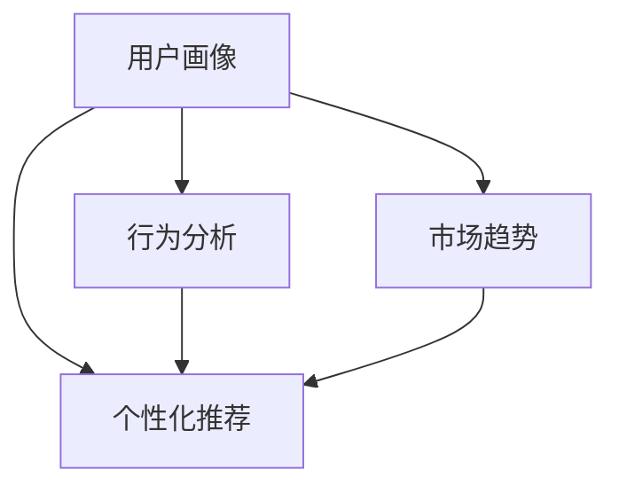

                 

# 知识付费产品的用户画像分析

> 关键词：知识付费,用户画像,行为分析,个性化推荐,市场趋势

## 1. 背景介绍

在数字化浪潮的推动下，知识付费逐渐成为一种趋势，用户通过订阅平台获取有价值的知识内容，从而提升自我素质和职业技能。然而，如何在海量用户中精准定位并满足不同用户的需求，成为了知识付费产品亟需解决的问题。本文旨在通过深入分析用户画像，提出针对性的策略，帮助知识付费产品提升用户粘性和商业价值。

## 2. 核心概念与联系

### 2.1 核心概念概述

为更好地理解用户画像分析，本节将介绍几个密切相关的核心概念：

- **用户画像(User Persona)**：通过对用户基本信息、行为数据等进行综合分析，形成对用户特征的全面刻画，以便进行精细化运营和个性化推荐。
- **行为分析(Behavior Analysis)**：通过跟踪用户的点击、浏览、订阅、消费等行为，分析用户的偏好和需求。
- **个性化推荐(Personalized Recommendation)**：根据用户画像和行为分析结果，推荐用户可能感兴趣的内容，提升用户体验和转化率。
- **市场趋势(Market Trend)**：通过对用户需求和行业动态的监测，把握知识付费市场的变化方向，指导产品策略制定。

这些概念之间存在紧密联系：
- 用户画像通过对用户数据的多维度分析，为行为分析和个性化推荐提供依据。
- 行为分析进一步细化用户特征，通过数据挖掘和机器学习等技术揭示用户需求。
- 个性化推荐将用户画像和行为分析转化为具体的推荐策略，实现精准匹配。
- 市场趋势通过外部环境变化，调整和优化用户画像和推荐策略，保持产品竞争力。

这些概念共同构成了知识付费产品运营的基础框架，通过深入分析用户画像，可以最大化挖掘用户价值，提升产品效果和市场占有率。

### 2.2 核心概念原理和架构的 Mermaid 流程图(Mermaid 流程节点中不要有括号、逗号等特殊字符)



这个流程图展示了用户画像、行为分析、个性化推荐和市场趋势之间的逻辑关系：

1. 用户画像通过多维度数据生成，为行为分析和个性化推荐提供输入。
2. 行为分析对用户行为进行深入挖掘，更新和细化用户画像。
3. 个性化推荐根据用户画像和行为分析结果，进行内容推荐。
4. 市场趋势通过宏观环境变化，对用户画像和推荐策略进行动态调整。

## 3. 核心算法原理 & 具体操作步骤
### 3.1 算法原理概述

知识付费产品的用户画像分析，本质上是基于大数据分析和机器学习技术，对用户行为数据进行建模和预测的过程。其核心思想是通过对用户历史行为数据的分析，构建用户特征向量，并利用这些特征向量进行内容推荐。

假设用户行为数据集为 $D=\{(x_i, y_i)\}_{i=1}^N$，其中 $x_i$ 为行为特征向量，$y_i$ 为内容标签。目标是从数据中学习一个映射函数 $f(x)$，使得对于任意行为特征向量 $x$，能够预测其最感兴趣的内容标签 $y$。

具体而言，我们通过以下步骤实现用户画像和推荐策略的构建：

1. 数据预处理：清洗、归一化、特征工程等步骤，保证数据质量。
2. 特征提取：通过TF-IDF、Word2Vec、BERT等技术，提取行为特征。
3. 用户画像建模：利用K-means、LDA、PCA等聚类和降维算法，生成用户特征向量。
4. 个性化推荐算法：采用协同过滤、基于内容的推荐、矩阵分解等方法，进行内容匹配和推荐。
5. 市场趋势分析：通过情感分析、主题建模等技术，跟踪市场动态，调整推荐策略。

### 3.2 算法步骤详解

用户画像的构建通常包括以下关键步骤：

**Step 1: 数据采集和预处理**

1. 数据来源：包括平台内用户的点击、浏览、订阅、消费、评价等行为数据，以及第三方数据，如社交媒体、公开数据等。

2. 数据清洗：去除重复、缺失、异常值，保证数据完整性和一致性。

3. 特征提取：根据业务需求，提取有意义的特征，如点击次数、浏览时长、订阅时间、消费金额等。

4. 特征归一化：对特征进行标准化或归一化处理，以便于后续分析。

**Step 2: 特征工程**

1. 特征选择：根据特征重要性，选择对用户行为有较强影响的特征。

2. 特征变换：使用PCA、LDA等降维技术，减小特征维度。

3. 特征组合：通过特征工程生成新的特征，如点击路径、消费行为模式等。

**Step 3: 用户画像建模**

1. 聚类分析：利用K-means、层次聚类等算法，将用户分为不同的群体。

2. 降维处理：通过PCA、LDA等技术，将高维特征向量映射到低维空间。

3. 用户画像生成：结合聚类结果和降维结果，生成用户特征向量。

**Step 4: 个性化推荐**

1. 协同过滤：基于用户和内容的历史行为，找到相似用户和内容，推荐相关内容。

2. 基于内容的推荐：通过文本相似度等技术，匹配用户兴趣和内容标签。

3. 矩阵分解：将用户和内容看作矩阵，通过分解技术找到用户和内容的潜在隐含因子，进行推荐。

**Step 5: 市场趋势分析**

1. 情感分析：通过自然语言处理技术，分析用户评论和反馈的情感倾向。

2. 主题建模：利用LDA、LSI等技术，提取热门话题和趋势。

3. 动态调整：根据市场趋势和用户反馈，动态调整推荐策略。

### 3.3 算法优缺点

用户画像和个性化推荐算法在知识付费产品中应用广泛，具有以下优点：

1. 提升用户体验：根据用户兴趣推荐个性化内容，增加用户粘性。

2. 增加收入：精准推荐高价值内容，提升用户订阅率和消费转化率。

3. 数据驱动：基于数据分析进行决策，减少主观判断，提高产品效果。

然而，这些方法也存在一些局限：

1. 数据依赖性强：用户画像和推荐算法依赖大量数据，数据质量直接影响算法效果。

2. 隐私问题：用户行为数据涉及隐私，不当使用可能导致隐私泄露。

3. 模型复杂度：用户画像和推荐算法模型较为复杂，需要较高的技术门槛和计算资源。

4. 过拟合风险：数据不均衡和噪音可能导致模型过拟合，泛化能力下降。

5. 推荐效果不稳定：用户需求变化较快，推荐算法需要频繁更新以保持效果。

尽管存在这些挑战，但总体而言，用户画像和推荐算法在知识付费产品中已证明其有效性和必要性，帮助企业提升运营效率和市场竞争力。

### 3.4 算法应用领域

用户画像和个性化推荐技术，在知识付费产品中的应用非常广泛，具体包括：

1. 课程推荐：根据用户浏览和订阅行为，推荐可能感兴趣的课程。

2. 用户细分：通过聚类分析，将用户分为不同细分市场，实现精细化运营。

3. 内容评价：通过情感分析，评估用户对内容的满意度，指导内容优化。

4. 市场分析：通过主题建模，跟踪行业趋势，制定产品策略。

5. 广告投放：根据用户画像和行为数据，进行精准的广告投放，提升转化率。

6. 社区运营：通过行为分析，了解用户活跃度和兴趣变化，优化社区运营策略。

这些领域的应用，使得用户画像和个性化推荐成为知识付费产品不可或缺的重要工具。

## 4. 数学模型和公式 & 详细讲解 & 举例说明（备注：数学公式请使用latex格式，latex嵌入文中独立段落使用 $$，段落内使用 $)
### 4.1 数学模型构建

本节将使用数学语言对用户画像和个性化推荐过程进行更加严格的刻画。

假设用户行为数据集为 $D=\{(x_i, y_i)\}_{i=1}^N$，其中 $x_i$ 为行为特征向量，$y_i$ 为内容标签。定义用户画像模型为 $P(x)$，其输出为用户特征向量，记为 $p(x)$。目标是最小化预测误差，即：

$$
\min_{P} \sum_{i=1}^N \mathcal{L}(y_i, P(x_i))
$$

其中 $\mathcal{L}$ 为损失函数，通常采用均方误差（MSE）或交叉熵（CE）。

### 4.2 公式推导过程

以协同过滤算法为例，推导其核心公式。

假设用户 $u$ 的特征向量为 $u$，内容 $i$ 的特征向量为 $v_i$，用户 $u$ 对内容 $i$ 的评分 $r_{ui}$ 为 $1, 2, 3, \cdots$。协同过滤的目标是根据用户 $u$ 的历史评分，预测其对内容 $i$ 的评分，从而推荐相似的内容。

协同过滤的核心在于找到用户 $u$ 和内容 $i$ 的相似度 $s_{ui}$，通常使用余弦相似度公式：

$$
s_{ui} = \frac{\dot{u} \cdot v_i}{||u|| \cdot ||v_i||}
$$

其中 $\dot{u}$ 为 $u$ 的特征向量，$v_i$ 为内容 $i$ 的特征向量，$||\cdot||$ 表示向量的范数。

利用上述相似度，协同过滤推荐公式为：

$$
\hat{r}_{ui} = \hat{r}_{ui}^{(0)} + \sum_{j \in \mathcal{N}_i} \frac{s_{uj}^{(0)} \cdot r_{ji}}{||s_{uj}^{(0)}||}
$$

其中 $\hat{r}_{ui}^{(0)}$ 为初始评分，$\mathcal{N}_i$ 为与内容 $i$ 相似的内容集合，$s_{uj}^{(0)}$ 为初始相似度。

### 4.3 案例分析与讲解

假设某知识付费平台用户 $u$ 的历史行为数据如下：

| 时间       | 内容ID | 评分 |
|------------|--------|------|
| 2022-01-01 | 内容1   | 3    |
| 2022-01-05 | 内容2   | 2    |
| 2022-01-08 | 内容3   | 4    |

平台有 $n=100$ 个内容，每个内容的特征向量 $v_i$ 为 $(0, 0, 1, 0, 0, 0, 0, 1, 0, 0, 0, 0, 0, 0, 0, 1)$。

利用上述协同过滤算法，计算用户 $u$ 对内容 $i$ 的预测评分 $\hat{r}_{ui}$。

设内容 $i$ 的相似内容集合为 $\mathcal{N}_i = \{内容1, 内容2, 内容3\}$，初始评分 $\hat{r}_{ui}^{(0)} = 3$，初始相似度 $s_{uj}^{(0)} = 0.5$。

计算内容 $i$ 与用户 $u$ 的相似度 $s_{ui}$：

$$
s_{ui} = \frac{(0, 0, 1, 0, 0, 0, 0, 1, 0, 0, 0, 0, 0, 0, 0, 1) \cdot (0, 0, 1, 0, 0, 0, 0, 1, 0, 0, 0, 0, 0, 0, 0, 1)}{\sqrt{2} \cdot \sqrt{2}} = \frac{1}{2}
$$

计算用户 $u$ 对内容 $i$ 的预测评分：

$$
\hat{r}_{ui} = 3 + \frac{1/2 \cdot 2}{\sqrt{1/4}} = 5
$$

根据 $\hat{r}_{ui}$，平台可以推荐内容 $i$ 给用户 $u$，提升用户体验和内容转化率。

## 5. 项目实践：代码实例和详细解释说明
### 5.1 开发环境搭建

在进行用户画像和推荐系统开发前，我们需要准备好开发环境。以下是使用Python进行Spark MLlib开发的环境配置流程：

1. 安装Anaconda：从官网下载并安装Anaconda，用于创建独立的Python环境。

2. 创建并激活虚拟环境：
```bash
conda create -n spark-env python=3.8 
conda activate spark-env
```

3. 安装Spark：根据CUDA版本，从官网获取对应的安装命令。例如：
```bash
conda install spark=3.1.2 -c conda-forge
```

4. 安装Spark MLlib：
```bash
pip install spark-mllib
```

5. 安装各类工具包：
```bash
pip install numpy pandas scikit-learn matplotlib tqdm jupyter notebook ipython
```

完成上述步骤后，即可在`spark-env`环境中开始开发。

### 5.2 源代码详细实现

下面我们以协同过滤推荐系统为例，给出使用Spark MLlib进行用户画像和推荐开发的PySpark代码实现。

首先，定义用户和内容的数据：

```python
from pyspark.sql import SparkSession

spark = SparkSession.builder.appName("Collaborative Filtering").getOrCreate()

# 定义用户行为数据集
user_data = spark.createDataFrame([
    (1, [3, 2, 4]),
    (2, [5, 4, 0]),
    (3, [0, 0, 2]),
    (4, [1, 0, 0])
], ["user_id", "item_ratings"])

# 定义内容特征数据集
item_data = spark.createDataFrame([
    (1, [0, 0, 1, 0, 0, 0, 0, 1, 0, 0, 0, 0, 0, 0, 0, 1]),
    (2, [0, 0, 0, 0, 1, 0, 0, 0, 1, 0, 0, 0, 0, 0, 0, 1]),
    (3, [1, 0, 0, 0, 0, 0, 0, 0, 0, 0, 0, 0, 0, 0, 0, 1]),
    (4, [0, 0, 0, 0, 0, 0, 1, 0, 0, 0, 0, 0, 0, 0, 0, 1])
], ["item_id", "item_features"])
```

然后，实现协同过滤推荐算法：

```python
from pyspark.ml.recommendation import ALS
from pyspark.ml.evaluation import RegressionEvaluator
from pyspark.ml.linalg import VectorUDT

# 定义协同过滤模型
als = ALS(
    ranks=5, 
    iterations=10, 
    regParam=0.1, 
    userCol="user_id", 
    itemCol="item_id", 
    ratingCol="item_ratings",
    predictionCol="prediction"
)

# 训练模型
model = als.fit(user_data)

# 预测评分
item_ratings = model.transform(item_data)

# 评估模型
evaluator = RegressionEvaluator(metricName="rmse")
rmse = evaluator.evaluate(item_ratings, predictionCol="prediction", labelCol="item_ratings")
print(f"RMSE: {rmse}")
```

最后，运行模型并查看推荐结果：

```python
# 推荐内容
recommended_items = model.recommendationsForUser(user_id=1)
for item in recommended_items:
    print(f"User {item.user_id} might like item {item.item_id} with rating {item.rating}")
```

以上就是使用Spark MLlib对协同过滤推荐系统进行开发的完整代码实现。可以看到，利用Spark的高效计算能力，可以轻松处理大规模数据集，进行推荐系统开发。

### 5.3 代码解读与分析

让我们再详细解读一下关键代码的实现细节：

**定义用户和内容数据**：
- 利用Spark创建DataFrame，将用户和内容数据表示为二维表格，方便后续处理。

**协同过滤模型**：
- 使用ALS算法定义协同过滤模型，设定模型参数，如秩、迭代次数、正则化参数等。
- 训练模型，利用用户行为数据进行参数优化。

**模型评估**：
- 定义RMSE评估指标，评估模型预测精度。
- 计算并输出RMSE值。

**推荐内容**：
- 利用模型生成用户推荐内容，返回推荐项的用户ID、内容ID和评分。
- 遍历推荐结果，打印用户可能喜欢的内容。

Spark MLlib提供了便捷的机器学习库，结合分布式计算能力，能够高效处理大规模数据集，进行推荐系统开发。开发者可以根据具体需求，灵活定制推荐算法和模型参数，实现精准推荐。

当然，工业级的系统实现还需考虑更多因素，如模型的保存和部署、超参数的自动搜索、更灵活的任务适配层等。但核心的推荐范式基本与此类似。

## 6. 实际应用场景
### 6.1 教育平台

基于用户画像的推荐技术，可以在教育平台中实现课程和教材的精准推荐。通过分析学生的学习行为和成绩，推荐与其能力水平相匹配的课程和教材，帮助学生更好地掌握知识。

在技术实现上，可以收集学生的学习记录、测试成绩、互动行为等数据，构建用户画像。利用聚类和降维算法，将学生分为不同的学习群体，结合主题建模技术，推荐适合的课程和教材。此外，平台还可以通过情感分析技术，了解学生的反馈，动态调整推荐策略，提升用户体验。

### 6.2 金融投资

金融投资领域的信息纷繁复杂，用户需要快速获取有价值的信息和建议。通过用户画像和推荐技术，可以为用户定制个性化的投资方案和市场分析报告，帮助用户做出更明智的投资决策。

在实践中，平台可以收集用户的浏览记录、交易数据、新闻阅读等行为数据，构建用户画像。利用协同过滤和内容推荐算法，为用户推荐相关的新闻、报告和投资建议。同时，平台还可以通过情感分析技术，跟踪市场情绪，动态调整推荐内容，规避市场风险。

### 6.3 医疗健康

医疗健康领域的信息高度专业，用户需要精准获取医学知识和健康建议。通过用户画像和推荐技术，可以为用户推荐适合其健康状况的医学知识和健康建议，提升用户健康管理水平。

在技术实现上，平台可以收集用户的健康记录、生活方式、疾病症状等数据，构建用户画像。利用协同过滤和医疗推荐算法，为用户推荐相关的医学知识、健康建议和治疗方案。此外，平台还可以通过情感分析技术，跟踪用户反馈，优化推荐内容，提升用户满意度。

### 6.4 未来应用展望

伴随知识付费产品和推荐技术的不断发展，未来的应用场景将更加丰富多样，具体包括：

1. 内容创作：平台可以基于用户画像和行为数据，推荐可能感兴趣的创作话题和素材，提升内容创作者的生产效率。

2. 市场推广：平台可以通过用户画像和行为数据，精准定位目标用户，优化广告投放策略，提升广告效果。

3. 用户转化：平台可以结合用户画像和行为数据，设计个性化的转化方案，提升用户的购买转化率和满意度。

4. 服务定制：平台可以分析用户需求，提供个性化的服务解决方案，提升用户的体验和满意度。

总之，用户画像和推荐技术的应用将不断拓展，为知识付费产品带来更广阔的市场前景和商业价值。

## 7. 工具和资源推荐
### 7.1 学习资源推荐

为了帮助开发者系统掌握用户画像和推荐技术的理论基础和实践技巧，这里推荐一些优质的学习资源：

1. 《推荐系统实战》：详解协同过滤、基于内容的推荐、矩阵分解等核心算法，结合实际案例，提供详细的操作指南。

2. 《机器学习实战》：通过Spark MLlib等工具，讲解机器学习的基本概念和实用技巧，适合入门学习。

3. 《数据科学导论》：全面介绍数据科学的基础知识，包括数据预处理、特征工程、模型评估等，适合系统学习。

4. Coursera《推荐系统》课程：由斯坦福大学开设的推荐系统课程，涵盖推荐系统的主要算法和实践，适合深入学习。

5. Udacity《数据科学》课程：通过实际操作和项目实践，深入讲解数据科学的核心技术，包括数据清洗、数据可视化、机器学习等，适合综合提升。

通过对这些资源的学习实践，相信你一定能够快速掌握用户画像和推荐技术的精髓，并用于解决实际的NLP问题。

### 7.2 开发工具推荐

高效的开发离不开优秀的工具支持。以下是几款用于用户画像和推荐系统开发的常用工具：

1. Spark：基于内存的分布式计算框架，处理大规模数据高效便捷。

2. TensorFlow：基于图形计算的深度学习框架，支持复杂的模型构建和训练。

3. PyTorch：动态计算图深度学习框架，灵活便捷，适合研究和开发。

4. Scikit-learn：开源机器学习库，提供丰富的算法和工具，支持快速原型开发。

5. Elasticsearch：分布式搜索和分析引擎，适合处理大规模文本数据。

6. Apache Kafka：分布式消息队列，支持实时数据流处理，适合推荐系统的数据采集和实时分析。

合理利用这些工具，可以显著提升用户画像和推荐系统的开发效率，加快创新迭代的步伐。

### 7.3 相关论文推荐

用户画像和推荐技术的发展源于学界的持续研究。以下是几篇奠基性的相关论文，推荐阅读：

1. SVD++: A Scalable Matrix Factorization Technique for Recommender Systems：提出SVD++算法，改进矩阵分解模型的精度和可扩展性。

2. Learning to Predict Short Video Demand：利用深度学习模型，预测视频点播需求，提升推荐效果。

3. Model-Based Collaborative Filtering for Recommender Systems：提出基于模型的协同过滤算法，提升推荐系统的稳定性和可解释性。

4. Implicit Feedback for Recommender Systems: Algorithmic and Theoretical Challenges：分析隐式反馈数据的特性，提出新的推荐算法。

5. Trust-aware recommendation algorithms for social networks：提出基于信任的推荐算法，结合社交网络信息，提升推荐效果。

这些论文代表了大语言模型微调技术的最新进展，通过学习这些前沿成果，可以帮助研究者把握学科前进方向，激发更多的创新灵感。

## 8. 总结：未来发展趋势与挑战

### 8.1 总结

本文对用户画像和推荐技术进行了全面系统的介绍。首先阐述了用户画像和推荐技术的研究背景和意义，明确了推荐在知识付费产品的核心作用。其次，从原理到实践，详细讲解了用户画像和推荐算法的构建方法，给出了完整的代码实现。同时，本文还探讨了推荐技术在教育、金融、医疗等多个领域的应用前景，展示了推荐范式的广泛适用性。此外，本文精选了推荐技术的各类学习资源，力求为读者提供全方位的技术指引。

通过本文的系统梳理，可以看到，用户画像和推荐技术在知识付费产品中具有重要价值，能够最大化挖掘用户价值，提升产品效果和市场竞争力。未来，伴随推荐技术的不断发展，知识付费产品必将在更广阔的应用场景中大放异彩，为用户带来更多便捷和价值。

### 8.2 未来发展趋势

展望未来，用户画像和推荐技术的发展趋势主要包括以下几个方面：

1. 个性化推荐算法更加智能化：结合自然语言处理、图像识别等技术，提升推荐内容的精准度。

2. 推荐系统更加自适应：通过在线学习和增量学习，实时调整推荐策略，提升推荐效果。

3. 推荐系统多模态融合：结合文本、图片、视频等多模态数据，提升推荐内容的丰富性和多样性。

4. 推荐系统的可解释性增强：通过因果推断、解释性机器学习等技术，增强推荐模型的可解释性，提升用户信任度。

5. 推荐系统的安全性提升：通过隐私保护技术、风险控制机制，保障用户数据安全和推荐内容的安全性。

6. 推荐系统的可控性提高：通过用户反馈和系统监控，及时发现和纠正推荐偏差，提升系统稳定性。

这些趋势凸显了用户画像和推荐技术的广阔前景。这些方向的探索发展，必将进一步提升推荐系统的性能和用户满意度，推动知识付费产品的创新和进步。

### 8.3 面临的挑战

尽管用户画像和推荐技术已取得显著进展，但在迈向更加智能化、普适化应用的过程中，仍面临诸多挑战：

1. 数据质量问题：用户画像和推荐系统依赖大量高质量数据，数据不平衡、噪音等问题可能导致推荐效果不佳。

2. 隐私保护问题：用户画像和推荐系统涉及大量个人隐私数据，不当使用可能导致隐私泄露和数据安全问题。

3. 推荐效果不稳定：用户需求变化较快，推荐算法需要频繁更新以保持效果。

4. 模型复杂度：推荐算法模型较为复杂，需要较高的技术门槛和计算资源。

5. 可解释性不足：推荐系统的决策过程缺乏可解释性，难以理解和调试。

6. 安全性问题：推荐系统可能面临模型篡改、恶意攻击等风险，需要加强安全防护。

尽管存在这些挑战，但总体而言，用户画像和推荐技术在知识付费产品中已证明其有效性和必要性，帮助企业提升运营效率和市场竞争力。

### 8.4 研究展望

面向未来，用户画像和推荐技术的研究方向应进一步聚焦于以下几个方面：

1. 数据驱动的用户画像构建：通过多渠道数据收集和融合，构建更加全面和准确的用户画像。

2. 推荐算法的可解释性和安全性：通过可解释性机器学习和安全防护技术，提升推荐系统的透明性和可信度。

3. 多模态数据的融合与分析：结合图像、视频、语音等多模态数据，提升推荐内容的丰富性和多样性。

4. 推荐系统的自适应与动态优化：通过在线学习和增量学习，实时调整推荐策略，提升推荐效果。

5. 推荐系统的隐私保护与合规：通过隐私保护技术、合规机制，保障用户数据安全和隐私权益。

这些研究方向的探索，必将引领用户画像和推荐技术的创新发展，为知识付费产品带来更广阔的应用前景和更高的价值。

## 9. 附录：常见问题与解答

**Q1：用户画像和推荐系统的数据来源有哪些？**

A: 用户画像和推荐系统的数据来源包括但不限于：

1. 平台内用户的行为数据：如点击、浏览、订阅、消费、评价等。

2. 第三方数据：如社交媒体数据、公开数据等。

3. 用户反馈数据：如评论、评分、反馈等。

4. 内容属性数据：如标题、标签、作者等。

这些数据综合起来，可以构建全面且准确的用户画像和推荐模型。

**Q2：用户画像和推荐算法如何避免过拟合？**

A: 避免过拟合的方法包括：

1. 数据增强：通过数据扩充和采样，增加训练集的多样性。

2. 正则化：使用L1/L2正则、Dropout等技术，防止模型过拟合。

3. 交叉验证：通过交叉验证技术，评估模型泛化能力，调整模型参数。

4. 早停策略：设定早停阈值，在验证集性能不再提升时停止训练。

5. 模型简化：减少模型复杂度，避免过度拟合。

这些方法需要根据具体场景进行灵活应用，以达到最佳效果。

**Q3：推荐系统的用户画像如何更新？**

A: 用户画像的更新通常包括以下步骤：

1. 数据收集：定期收集用户最新的行为数据，如浏览、点击、订阅、消费等。

2. 数据清洗：清洗、归一化、特征工程等步骤，保证数据质量。

3. 特征更新：重新提取、更新用户特征向量，如点击路径、消费模式等。

4. 画像更新：根据特征更新结果，重新构建用户画像，更新推荐模型。

5. 模型评估：通过离线和在线评估，调整推荐策略，保证模型效果。

这些步骤需要持续循环迭代，以保持用户画像的时效性和准确性。

**Q4：推荐系统的推荐效果如何评估？**

A: 推荐系统的推荐效果可以通过以下指标进行评估：

1. 准确率：衡量推荐系统推荐的正确率。

2. 召回率：衡量推荐系统推荐的覆盖率。

3. 点击率：衡量用户对推荐内容的点击情况。

4. 转化率：衡量用户对推荐内容的操作情况，如购买、订阅等。

5. 用户满意度：通过用户反馈和评价，评估推荐系统的用户体验。

6. 个性化指标：如多样性、新颖性等，衡量推荐内容的个性化程度。

这些指标可以综合使用，评估推荐系统的整体效果，并指导推荐策略的优化。

**Q5：推荐系统如何处理长尾数据？**

A: 长尾数据是推荐系统面临的重要挑战之一。处理长尾数据的方法包括：

1. 基于协同过滤的推荐：通过协同过滤算法，为用户推荐相似内容，弥补数据稀疏问题。

2. 基于内容的推荐：通过内容特征匹配，为用户推荐相关内容，提升推荐效果。

3. 基于模型的推荐：通过矩阵分解等技术，生成隐含因子，提升推荐精度。

4. 冷启动策略：对于新用户或新内容，采用基于模型的推荐策略，进行冷启动处理。

5. 实时数据融合：结合实时数据，动态调整推荐策略，提升推荐效果。

这些方法可以结合使用，应对长尾数据带来的挑战。

总之，用户画像和推荐技术在知识付费产品中具有重要价值，能够最大化挖掘用户价值，提升产品效果和市场竞争力。未来，伴随推荐技术的不断发展，知识付费产品必将在更广阔的应用场景中大放异彩，为用户带来更多便捷和价值。

---

作者：禅与计算机程序设计艺术 / Zen and the Art of Computer Programming

