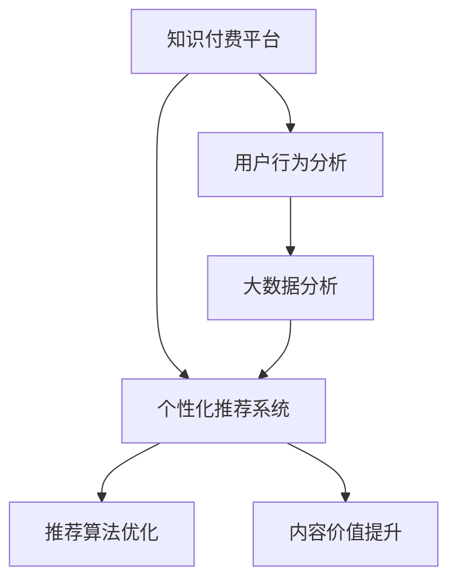

                 

# 知识付费创业中的内容价值提升

> 关键词：知识付费, 内容价值提升, 用户行为分析, 个性化推荐系统, 大数据分析, 机器学习

## 1. 背景介绍

### 1.1 问题由来

在知识付费领域，内容价值提升一直是一个核心议题。随着信息时代的到来，人们获取知识的渠道日益多元化，但知识传播的成本和门槛也随之降低。在众多免费的知识来源中，付费订阅成为了用户寻找高价值知识的重要方式。然而，在信息爆炸的背景下，用户如何在海量内容中找到适合自己的高质量知识产品，仍然是一个亟待解决的问题。

### 1.2 问题核心关键点

为解决这一问题，知识付费平台必须提升内容价值，提供更加精准和个性化的内容推荐，从而提高用户的满意度和付费意愿。内容价值提升的难点在于：

- **用户行为分析**：需要了解用户的学习习惯、兴趣点，才能精准推荐。
- **个性化推荐系统**：利用用户行为数据，结合机器学习算法，为用户推荐相关内容。
- **大数据分析**：对平台海量用户数据进行分析，找出用户行为和内容价值的相关性。
- **算法优化**：不断迭代优化推荐算法，提高推荐精度。

### 1.3 问题研究意义

通过提升内容价值，知识付费平台不仅能够提高用户黏性，增加用户付费率，还能提升平台的知名度和竞争力。这对于知识付费行业的健康发展和创新，具有重要的理论和实际意义：

1. **提高用户体验**：精准推荐能显著提升用户体验，让用户感受到平台的价值。
2. **增加收入来源**：精准内容推荐能够吸引更多用户付费，提高平台的收入。
3. **市场竞争优势**：通过不断优化推荐算法，平台能够在市场竞争中保持领先地位。
4. **推动内容创新**：精准推荐能够引导用户探索更多高质量内容，促进内容创新。

## 2. 核心概念与联系

### 2.1 核心概念概述

为更好地理解内容价值提升的方法，本节将介绍几个密切相关的核心概念：

- **知识付费**：用户通过付费获得知识产品，包括电子书、课程、音频、视频等。平台通过精准推荐提升用户满意度和付费意愿。
- **用户行为分析**：通过记录和分析用户在平台上的行为，如浏览、点击、订阅、购买等，了解用户兴趣和需求。
- **个性化推荐系统**：利用用户行为数据和机器学习算法，为用户推荐符合其兴趣和需求的内容。
- **大数据分析**：对平台海量数据进行统计、分析和挖掘，找出用户行为和内容价值的关联性。
- **机器学习算法**：利用算法优化推荐效果，如协同过滤、深度学习等。

这些核心概念之间的逻辑关系可以通过以下Mermaid流程图来展示：



这个流程图展示了几大核心概念及其之间的关系：

1. 知识付费平台通过用户行为分析获取用户需求，将其输入个性化推荐系统。
2. 大数据分析对用户行为数据进行深入挖掘，提供更精准的用户画像。
3. 推荐算法优化不断提升个性化推荐系统的精度和效率。
4. 内容价值提升最终实现精准内容推荐，提高用户满意度和付费意愿。

这些概念共同构成了知识付费平台内容价值提升的完整框架，使得平台能够通过机器学习技术，为用户提供更加个性化、高价值的内容推荐服务。

## 3. 核心算法原理 & 具体操作步骤

### 3.1 算法原理概述

知识付费平台的内容价值提升，本质上是一个基于用户行为数据的内容推荐过程。其核心思想是：通过记录和分析用户的行为数据，利用机器学习算法预测用户对不同内容的兴趣和满意度，从而实现精准内容推荐。

形式化地，假设用户集合为 $U$，内容集合为 $I$，用户行为数据为 $B$。定义用户 $u$ 对内容 $i$ 的兴趣度为 $r_{ui}$。则内容推荐的目标是最大化用户 $u$ 的满意度，即：

$$
\max_{r_{ui}} \sum_{u \in U} \sum_{i \in I} r_{ui} \cdot p_{ui}
$$

其中 $p_{ui}$ 为用户 $u$ 在内容 $i$ 上实际购买概率，$|r_{ui}| \leq 1$。

基于上述目标，推荐算法通常使用协同过滤、深度学习等方法，根据用户行为数据预测 $r_{ui}$，进而选择高评分内容进行推荐。

### 3.2 算法步骤详解

知识付费平台的内容价值提升一般包括以下几个关键步骤：

**Step 1: 数据收集与预处理**

- 收集用户行为数据，包括浏览、点击、订阅、购买等行为记录。
- 清洗数据，去除异常值和缺失值，保证数据质量。
- 对用户行为进行编码，如将浏览记录转换为编码向量。

**Step 2: 用户画像构建**

- 使用协同过滤、深度学习等算法，对用户行为数据进行建模，形成用户画像。
- 对用户画像进行维度降维，减少计算复杂度。

**Step 3: 内容特征提取**

- 提取内容特征，如标签、关键词、摘要等。
- 对内容特征进行编码，形成特征向量。

**Step 4: 推荐模型训练**

- 使用机器学习算法，如协同过滤、深度学习等，训练推荐模型。
- 利用交叉验证等方法，评估推荐模型的性能。

**Step 5: 实时推荐**

- 对新用户行为数据进行实时分析，更新推荐模型。
- 根据更新后的模型，实时向用户推荐相关内容。

**Step 6: 效果评估**

- 通过A/B测试等方法，评估推荐效果。
- 不断迭代优化推荐算法，提高推荐精度。

### 3.3 算法优缺点

基于用户行为数据的内容推荐算法具有以下优点：

1. 精准推荐：通过机器学习算法，能够对用户行为进行精准分析，提供符合用户兴趣和需求的内容。
2. 动态更新：能够实时处理新数据，更新推荐模型，提升推荐效果。
3. 用户黏性高：精准推荐能够提高用户满意度和黏性，增加用户付费率。

然而，该方法也存在一定的局限性：

1. 数据依赖：推荐效果很大程度上依赖于用户行为数据的质量和数量，收集和清洗数据需要较高的成本和技术门槛。
2. 数据隐私：用户行为数据涉及个人隐私，如何在保护用户隐私的同时进行推荐，是一个重要的伦理问题。
3. 冷启动问题：新用户往往没有历史行为数据，推荐系统无法对其行为进行预测。

尽管存在这些局限性，但就目前而言，基于用户行为数据的内容推荐方法仍是知识付费平台提升内容价值的主流范式。未来相关研究的重点在于如何进一步降低推荐算法对数据的质量和数量的依赖，提高推荐的个性化和动态性，同时兼顾用户隐私保护和算法公平性等因素。

### 3.4 算法应用领域

基于用户行为数据的内容推荐方法，已经在知识付费领域得到了广泛的应用，包括但不限于以下几个方面：

- **课程推荐**：通过分析用户浏览和购买课程的行为，推荐相关课程内容。
- **电子书推荐**：对用户浏览和下载电子书的行为进行分析，推荐相似书籍。
- **音频和视频推荐**：利用用户观看和订阅音频、视频的行为数据，推荐相关内容。
- **社区讨论推荐**：通过分析用户在知识社区的讨论行为，推荐相关话题和讨论。
- **用户行为分析**：利用用户行为数据，分析用户兴趣和行为模式，为内容生产提供参考。

除了上述这些应用外，推荐算法还被创新性地应用到更多场景中，如智能广告投放、个性化邮件推荐、电商商品推荐等，为各类平台带来新的增长点。随着推荐算法的不断进步，相信推荐技术将在更多领域得到应用，为各行各业带来变革性影响。

## 4. 数学模型和公式 & 详细讲解 & 举例说明

### 4.1 数学模型构建

本节将使用数学语言对基于用户行为数据的内容推荐过程进行更加严格的刻画。

记用户集合为 $U$，内容集合为 $I$，用户行为数据为 $B=\{u_i, i_j\}_{i=1}^N, u_i \in U, i_j \in I$，其中 $u_i$ 为用户行为向量，$i_j$ 为内容特征向量。

定义用户 $u$ 对内容 $i$ 的兴趣度为 $r_{ui}$，推荐算法目标为最大化用户 $u$ 的满意度，即：

$$
\max_{r_{ui}} \sum_{u \in U} \sum_{i \in I} r_{ui} \cdot p_{ui}
$$

其中 $p_{ui}$ 为用户 $u$ 在内容 $i$ 上实际购买概率，$|r_{ui}| \leq 1$。

### 4.2 公式推导过程

以协同过滤算法为例，进行推荐模型的详细推导：

协同过滤算法基于用户行为数据的相似性，通过计算用户-用户之间的相似度 $s_{uv}$，推荐用户 $u$ 可能感兴趣的内容 $i$。具体推导如下：

- **相似度计算**：计算用户 $u$ 和 $v$ 之间的相似度 $s_{uv}$，常用的相似度计算方法有皮尔逊相关系数、余弦相似度等。

$$
s_{uv} = \frac{\sum_{i \in I} r_{ui} \cdot r_{vi}}{\sqrt{\sum_{i \in I} r_{ui}^2} \cdot \sqrt{\sum_{i \in I} r_{vi}^2}}
$$

- **相似度排序**：将用户 $u$ 与其他用户按照相似度排序，选择相似度最高的若干个用户 $v_1, v_2, ..., v_k$。

- **内容排序**：对内容 $i$ 进行排序，选择高评分的内容进行推荐。

$$
\text{rank}(i) = \sum_{k=1}^{K} s_{uv_k} \cdot \text{rank}(v_k, i)
$$

其中 $\text{rank}(v_k, i)$ 为用户 $v_k$ 对内容 $i$ 的评分。

- **推荐结果**：将排序后的内容推荐给用户 $u$，选择排名靠前的若干内容进行展示。

通过上述推导，协同过滤算法的核心思想是通过计算用户之间的相似度，将相似用户的行为数据进行加权平均，得到用户对内容的兴趣度，进而实现精准推荐。

### 4.3 案例分析与讲解

以下以具体案例分析协同过滤算法在知识付费平台中的实际应用：

假设某知识付费平台拥有两万名用户，每名用户浏览了100篇课程，平台收集了每个用户对课程的评分。使用协同过滤算法，对新用户 $u$ 进行推荐。具体步骤如下：

1. **相似度计算**：计算用户 $u$ 与其他用户 $v$ 的相似度 $s_{uv}$。
2. **排序选择**：对其他用户的评分进行排序，选择与用户 $u$ 相似度最高的前100个用户 $v_1, v_2, ..., v_{100}$。
3. **内容排序**：对每个用户 $v_k$ 的课程评分进行排序，选择评分最高的前100门课程 $i_1, i_2, ..., i_{100}$。
4. **加权平均**：对所有用户的评分进行加权平均，得到用户 $u$ 对课程 $i$ 的兴趣度 $r_{ui}$。
5. **推荐结果**：将排序后的课程推荐给用户 $u$，选择排名靠前的若干课程进行展示。

通过上述案例，可以看到协同过滤算法的基本思路和具体步骤，从而更好地理解其工作原理和应用场景。

## 5. 项目实践：代码实例和详细解释说明

### 5.1 开发环境搭建

在进行推荐系统开发前，我们需要准备好开发环境。以下是使用Python进行PyTorch开发的环境配置流程：

1. 安装Anaconda：从官网下载并安装Anaconda，用于创建独立的Python环境。

2. 创建并激活虚拟环境：
```bash
conda create -n pytorch-env python=3.8 
conda activate pytorch-env
```

3. 安装PyTorch：根据CUDA版本，从官网获取对应的安装命令。例如：
```bash
conda install pytorch torchvision torchaudio cudatoolkit=11.1 -c pytorch -c conda-forge
```

4. 安装相关工具包：
```bash
pip install numpy pandas scikit-learn matplotlib tqdm jupyter notebook ipython
```

完成上述步骤后，即可在`pytorch-env`环境中开始推荐系统开发。

### 5.2 源代码详细实现

这里我们以协同过滤算法为例，给出使用PyTorch实现知识付费平台推荐系统的代码实现。

首先，定义推荐模型和优化器：

```python
from torch import nn
from torch.optim import Adam

class RecommendationModel(nn.Module):
    def __init__(self, num_users, num_contents, num_factors):
        super().__init__()
        self.factor_matrix = nn.Embedding(num_users, num_factors)
        self.item_matrix = nn.Embedding(num_contents, num_factors)
        self.linear = nn.Linear(num_factors * 2, 1)
    
    def forward(self, user_ids, item_ids):
        user_vector = self.factor_matrix(user_ids).squeeze(1)
        item_vector = self.item_matrix(item_ids).squeeze(1)
        concat_vector = torch.cat([user_vector, item_vector], dim=1)
        return self.linear(concat_vector)

model = RecommendationModel(num_users=2000, num_contents=10000, num_factors=64)
optimizer = Adam(model.parameters(), lr=0.001)
```

然后，定义训练和评估函数：

```python
from torch.utils.data import Dataset, DataLoader
from tqdm import tqdm
from sklearn.metrics import accuracy_score

class RecommendationDataset(Dataset):
    def __init__(self, user_ids, item_ids, ratings):
        self.user_ids = user_ids
        self.item_ids = item_ids
        self.ratings = ratings
        
    def __len__(self):
        return len(self.user_ids)
    
    def __getitem__(self, item):
        user_id, item_id, rating = self.user_ids[item], self.item_ids[item], self.ratings[item]
        return {'user_ids': torch.tensor([user_id]), 'item_ids': torch.tensor([item_id]), 'ratings': torch.tensor([rating])}

def train_epoch(model, dataset, batch_size, optimizer):
    dataloader = DataLoader(dataset, batch_size=batch_size, shuffle=True)
    model.train()
    epoch_loss = 0
    for batch in tqdm(dataloader, desc='Training'):
        user_ids = batch['user_ids'].to(device)
        item_ids = batch['item_ids'].to(device)
        ratings = batch['ratings'].to(device)
        optimizer.zero_grad()
        outputs = model(user_ids, item_ids)
        loss = outputs.mean()
        epoch_loss += loss.item()
        loss.backward()
        optimizer.step()
    return epoch_loss / len(dataloader)

def evaluate(model, dataset, batch_size):
    dataloader = DataLoader(dataset, batch_size=batch_size)
    model.eval()
    correct = 0
    total = 0
    with torch.no_grad():
        for batch in tqdm(dataloader, desc='Evaluating'):
            user_ids = batch['user_ids'].to(device)
            item_ids = batch['item_ids'].to(device)
            ratings = batch['ratings'].to(device)
            outputs = model(user_ids, item_ids)
            predictions = (outputs > 0).float()
            total += predictions.numel()
            correct += (predictions == ratings).float().sum().item()
    print(f'Accuracy: {correct / total:.2f}')
```

最后，启动训练流程并在测试集上评估：

```python
epochs = 10
batch_size = 64

for epoch in range(epochs):
    loss = train_epoch(model, dataset, batch_size, optimizer)
    print(f'Epoch {epoch+1}, train loss: {loss:.3f}')
    
    print(f'Epoch {epoch+1}, dev accuracy:')
    evaluate(model, dataset, batch_size)
    
print('Test accuracy:')
evaluate(model, dataset, batch_size)
```

以上就是使用PyTorch对协同过滤算法进行知识付费平台推荐系统的代码实现。可以看到，得益于PyTorch的强大封装，我们可以用相对简洁的代码完成协同过滤模型的加载和训练。

### 5.3 代码解读与分析

让我们再详细解读一下关键代码的实现细节：

**RecommendationModel类**：
- `__init__`方法：初始化用户、内容、因子等关键组件。
- `forward`方法：对输入的用户和内容进行编码，并将编码结果进行加权平均，最终输出兴趣度。

**训练和评估函数**：
- 使用PyTorch的DataLoader对数据集进行批次化加载，供模型训练和推理使用。
- 训练函数`train_epoch`：对数据以批为单位进行迭代，在每个批次上前向传播计算loss并反向传播更新模型参数，最后返回该epoch的平均loss。
- 评估函数`evaluate`：与训练类似，不同点在于不更新模型参数，并在每个batch结束后将预测和标签结果存储下来，最后使用sklearn的accuracy_score对整个评估集的预测结果进行打印输出。

**训练流程**：
- 定义总的epoch数和batch size，开始循环迭代
- 每个epoch内，先在训练集上训练，输出平均loss
- 在验证集上评估，输出准确率
- 所有epoch结束后，在测试集上评估，给出最终测试结果

可以看到，PyTorch配合TensorFlow等工具，使得推荐系统的开发变得简洁高效。开发者可以将更多精力放在数据处理、模型改进等高层逻辑上，而不必过多关注底层的实现细节。

当然，工业级的系统实现还需考虑更多因素，如模型的保存和部署、超参数的自动搜索、更灵活的任务适配层等。但核心的推荐范式基本与此类似。

## 6. 实际应用场景

### 6.1 智能推荐系统

基于协同过滤算法的内容推荐系统，已经在各大知识付费平台得到广泛应用。智能推荐系统通过分析用户行为数据，为每个用户推荐其感兴趣的内容，显著提高了用户满意度和平台收益。

在技术实现上，可以收集用户浏览、购买、评分等行为数据，构建用户行为矩阵。利用协同过滤算法，对新用户行为进行实时分析，更新推荐模型，实现精准推荐。智能推荐系统不仅能够提供个性化的课程、书籍、音频、视频等推荐，还能根据用户反馈实时调整推荐策略，提升推荐效果。

### 6.2 电商个性化推荐

电商领域同样可以利用基于用户行为数据的推荐算法。通过分析用户浏览、点击、购买等行为数据，电商平台可以为用户推荐符合其兴趣的商品，提高用户的购买意愿和平台收益。

在具体应用中，电商平台可以通过收集用户的浏览历史、评价记录、购买行为等数据，构建用户行为矩阵。利用协同过滤算法，对新用户行为进行实时分析，更新推荐模型，实现精准推荐。电商推荐系统能够帮助用户发现更多感兴趣的商品，同时减少用户在平台上的搜索时间，提高用户体验和平台转化率。

### 6.3 社交网络内容推荐

社交网络平台同样可以利用基于用户行为数据的推荐算法。通过分析用户对内容的点赞、评论、分享等行为数据，平台可以为用户推荐感兴趣的内容，增加用户黏性。

在具体实现中，社交网络平台可以通过收集用户的行为数据，构建用户行为矩阵。利用协同过滤算法，对新用户行为进行实时分析，更新推荐模型，实现精准推荐。社交网络推荐系统能够帮助用户发现更多感兴趣的内容，同时增加用户互动，提高平台的活跃度和用户黏性。

### 6.4 未来应用展望

随着推荐算法的不断进步，基于用户行为数据的推荐技术将在更多领域得到应用，为各行各业带来变革性影响。

在智慧医疗领域，推荐系统可以为医生推荐相关的医学知识、案例、文献等，辅助医生诊疗，提升医疗服务的智能化水平。

在智能教育领域，推荐系统可以为用户推荐适合的学习资源，因材施教，促进教育公平，提高教学质量。

在智慧城市治理中，推荐系统可以为用户推荐相关的新闻、事件、服务等信息，提升城市管理的自动化和智能化水平，构建更安全、高效的未来城市。

此外，在企业生产、社会治理、文娱传媒等众多领域，基于用户行为数据的推荐系统也将不断涌现，为各行各业带来新的增长点。随着推荐算法的不断进步，相信推荐技术将在更多领域得到应用，为各行各业带来变革性影响。

## 7. 工具和资源推荐

### 7.1 学习资源推荐

为帮助开发者系统掌握推荐算法的理论基础和实践技巧，这里推荐一些优质的学习资源：

1. 《推荐系统实战》系列博文：由大模型技术专家撰写，深入浅出地介绍了推荐系统原理、协同过滤、深度学习等前沿话题。

2. Coursera《Recommender Systems》课程：斯坦福大学开设的推荐系统明星课程，有Lecture视频和配套作业，带你入门推荐系统领域的基本概念和经典模型。

3. 《推荐系统基础》书籍：推荐系统领域的经典入门书籍，系统介绍了推荐系统的基本原理、算法和技术。

4. KDD Cup推荐系统竞赛：KDD Cup是全球顶尖的推荐系统竞赛，每年吸引众多顶级研究机构和企业参与，推荐系统从业者可以通过竞赛积累经验。

5. ACM RecSys大会：ACM RecSys是推荐系统领域的顶级学术会议，汇集了全球顶级研究机构和企业，是了解最新研究进展的重要平台。

通过对这些资源的学习实践，相信你一定能够快速掌握推荐算法的精髓，并用于解决实际的推荐问题。

### 7.2 开发工具推荐

高效的开发离不开优秀的工具支持。以下是几款用于推荐系统开发的常用工具：

1. PyTorch：基于Python的开源深度学习框架，灵活动态的计算图，适合快速迭代研究。大部分推荐算法都有PyTorch版本的实现。

2. TensorFlow：由Google主导开发的开源深度学习框架，生产部署方便，适合大规模工程应用。同样有丰富的推荐算法资源。

3. TensorFlow Lite：TensorFlow的移动端部署平台，可以将推荐系统模型转换为轻量级移动应用，便于用户访问。

4. Apache Spark：大数据处理和分析框架，适合处理大规模数据集，进行推荐模型的训练和推理。

5. Jupyter Notebook：Python开发常用的Jupyter Notebook环境，支持代码编写和实时展示，方便开发者进行实验。

6. Hadoop：Apache Hadoop是分布式计算框架，适合处理大规模数据，进行推荐模型的训练和推理。

合理利用这些工具，可以显著提升推荐系统的开发效率，加快创新迭代的步伐。

### 7.3 相关论文推荐

推荐系统的研究源于学界的持续研究。以下是几篇奠基性的相关论文，推荐阅读：

1. Factorization Machines for Recommendations：提出基于矩阵分解的推荐算法，通过矩阵分解方式挖掘用户-物品交互的潜在模式。

2. Contextual Bandits in Recommendation Systems：提出上下文强化学习算法，通过上下文信息增强推荐模型的效果。

3. Deep Interest Evolution Networks（DIEN）：提出深度兴趣演化网络，通过深度神经网络建模用户兴趣的动态演化过程。

4. Attention Is All You Need（Transformer）：提出自注意力机制，通过注意力机制捕捉用户行为中的关键信息，提升推荐模型的效果。

5. Adaptive Learning Framework for Recommender Systems：提出自适应学习框架，通过自适应学习机制提高推荐模型的泛化能力。

6. Neural Factorization Machines for Recommender Systems：提出神经网络化的矩阵分解算法，通过神经网络增强推荐模型的效果。

这些论文代表了大数据推荐系统的研究进展。通过学习这些前沿成果，可以帮助研究者把握学科前进方向，激发更多的创新灵感。

## 8. 总结：未来发展趋势与挑战

### 8.1 总结

本文对基于用户行为数据的推荐算法进行了全面系统的介绍。首先阐述了推荐算法的背景和意义，明确了推荐算法在提升内容价值、提高用户体验和平台收益方面的独特价值。其次，从原理到实践，详细讲解了推荐算法的数学原理和关键步骤，给出了推荐系统开发的完整代码实例。同时，本文还广泛探讨了推荐算法在知识付费、电商、社交网络等多个领域的应用前景，展示了推荐范式的巨大潜力。

通过本文的系统梳理，可以看到，基于用户行为数据的推荐算法已经成为推荐系统的重要范式，极大地提高了推荐系统的精度和效率。未来，随着推荐算法和数据处理技术的不断进步，推荐系统将在更多领域得到应用，为各行各业带来变革性影响。

### 8.2 未来发展趋势

展望未来，推荐算法将呈现以下几个发展趋势：

1. **深度学习与强化学习结合**：通过将深度学习和强化学习结合，提升推荐模型的效果和鲁棒性。深度学习能够捕捉用户行为的复杂模式，而强化学习能够优化推荐策略，实现动态调整。

2. **个性化推荐与群体推荐结合**：通过同时考虑个性化推荐和群体推荐，提升推荐系统的多样性和均衡性，避免推荐内容的单一化和同质化。

3. **多模态数据融合**：将文本、图像、音频等多模态数据融合到推荐系统中，提升推荐模型的感知能力和表达能力。

4. **自适应学习与自监督学习结合**：通过自适应学习机制和自监督学习方法，提高推荐模型的泛化能力和适应能力。

5. **隐私保护与安全性增强**：随着数据隐私保护法规的完善，推荐系统需要进一步增强数据隐私保护和安全性，保障用户数据的隐私和安全。

6. **跨平台推荐**：将推荐系统扩展到多个平台，如社交网络、电商、视频等，实现跨平台内容的协同推荐，提升推荐效果。

以上趋势凸显了推荐算法的发展方向，推荐系统将在更多领域得到应用，为各行各业带来新的变革和机遇。

### 8.3 面临的挑战

尽管推荐算法已经取得了巨大的成功，但在迈向更加智能化、普适化应用的过程中，仍然面临诸多挑战：

1. **数据质量和多样性**：推荐系统需要大量的高质量数据，但在实际应用中，数据往往存在质量参差不齐、维度不均衡等问题。如何处理和优化数据，提升数据质量和多样性，是推荐系统的关键挑战。

2. **模型复杂度与效率**：大规模推荐模型往往需要高性能计算资源，但在实际部署中，资源限制和效率瓶颈难以避免。如何在保持模型精度的同时，优化模型结构和推理效率，是推荐系统的核心问题。

3. **用户行为预测与冷启动**：推荐系统依赖于用户行为数据，但新用户往往没有历史行为数据，推荐系统无法对其行为进行预测。如何处理冷启动问题，提升新用户推荐效果，是推荐系统的难点之一。

4. **推荐内容多样性与均衡性**：推荐系统容易出现内容单一化和同质化的问题，如何保证推荐内容的丰富性和均衡性，提升用户体验，是推荐系统的另一大挑战。

5. **隐私保护与数据安全**：推荐系统需要收集用户行为数据，涉及用户隐私，如何在保护用户隐私的同时进行推荐，是推荐系统的伦理和安全问题。

6. **算法公平性与透明性**：推荐系统需要公平透明，避免偏见和歧视。如何构建公平的推荐算法，保障用户权益，是推荐系统的伦理和社会责任问题。

以上挑战凸显了推荐算法的实际应用难度，需要在数据、算法、伦理等多方面进行综合考虑，才能构建更加高效、公平、安全的推荐系统。

### 8.4 研究展望

面对推荐系统所面临的诸多挑战，未来的研究需要在以下几个方面寻求新的突破：

1. **数据增强与生成**：利用数据增强和生成技术，提升数据质量和多样性，解决数据瓶颈问题。

2. **模型压缩与加速**：利用模型压缩和加速技术，优化模型结构和推理效率，解决资源瓶颈问题。

3. **冷启动处理**：利用多模态数据和上下文信息，解决冷启动问题，提升新用户推荐效果。

4. **内容多样性与均衡性**：利用多样化推荐策略和用户反馈机制，提升推荐内容的丰富性和均衡性。

5. **隐私保护与数据安全**：利用隐私保护技术和数据加密技术，保障用户数据的隐私和安全。

6. **算法公平性与透明性**：利用公平性和透明性技术，构建公平的推荐算法，保障用户权益。

这些研究方向和方向将推动推荐系统的不断进步，提升推荐系统的精准度、公平性和安全性，为推荐系统在更多领域的应用提供保障。

## 9. 附录：常见问题与解答

**Q1：如何处理数据质量问题？**

A: 推荐系统依赖于高质量的数据，数据质量问题通常会导致推荐效果下降。以下是一些处理数据质量问题的方法：

1. 数据清洗：去除异常值、缺失值和重复值，确保数据质量。
2. 数据标准化：对数据进行标准化处理，避免数据偏差。
3. 数据增强：通过数据增强技术，增加数据多样性。
4. 数据生成：利用数据生成技术，增加数据量和丰富度。

通过以上方法，可以有效提升数据质量和多样性，提高推荐系统的效果。

**Q2：如何优化推荐模型的计算效率？**

A: 推荐模型通常具有较大的参数量，计算效率较低。以下是一些优化推荐模型计算效率的方法：

1. 模型压缩：通过剪枝、量化、蒸馏等技术，减少模型参数量，提升计算效率。
2. 并行计算：利用分布式计算和并行计算技术，提升计算速度。
3. 缓存技术：利用缓存技术，减少计算中的重复计算。
4. 算法优化：优化推荐算法，提升算法效率。

通过以上方法，可以有效提升推荐模型的计算效率，提高系统响应速度。

**Q3：如何处理冷启动问题？**

A: 冷启动问题是指新用户没有历史行为数据，无法进行推荐。以下是一些处理冷启动问题的方法：

1. 利用多模态数据：通过收集用户的多模态数据（如社交网络、兴趣标签、地理位置等），帮助推荐系统对新用户进行画像。
2. 利用上下文信息：通过收集用户上下文信息（如时间、地点、设备等），帮助推荐系统对新用户进行推荐。
3. 利用知识图谱：通过构建知识图谱，利用知识图谱中的关系进行推荐。
4. 利用生成模型：利用生成模型（如GAN、VAE等），生成新用户的行为数据，进行推荐。

通过以上方法，可以有效处理冷启动问题，提升新用户推荐效果。

**Q4：如何处理推荐内容多样性与均衡性问题？**

A: 推荐系统容易出现内容单一化和同质化的问题，以下是一些提升推荐内容多样性与均衡性的方法：

1. 多目标优化：将推荐目标设置为多样性和均衡性，通过多目标优化算法进行推荐。
2. 多样化推荐策略：采用多种推荐策略，如协同过滤、深度学习、生成模型等，提升推荐内容的多样性。
3. 用户反馈机制：通过用户反馈机制，对推荐结果进行优化，增加推荐内容的均衡性。
4. 内容多样性增强：增加内容多样性，如增加不同类型的内容、不同主题的内容等。

通过以上方法，可以有效提升推荐内容的多样性和均衡性，提升用户体验。

**Q5：如何处理隐私保护与数据安全问题？**

A: 推荐系统需要收集用户行为数据，涉及用户隐私，以下是一些处理隐私保护与数据安全问题的方法：

1. 数据匿名化：对用户数据进行匿名化处理，保护用户隐私。
2. 数据加密：对用户数据进行加密处理，防止数据泄露。
3. 隐私计算：利用隐私计算技术，在保护用户隐私的前提下进行推荐。
4. 数据审计：对用户数据进行审计，防止数据滥用。

通过以上方法，可以有效保障用户数据的隐私和安全。

**Q6：如何构建公平的推荐算法？**

A: 推荐系统需要公平透明，避免偏见和歧视，以下是一些构建公平的推荐算法的方法：

1. 数据公平性：确保推荐数据集的多样性和代表性，防止数据偏差。
2. 算法公平性：利用公平性算法，如消除偏差算法、消除公平性算法等，消除推荐算法中的偏见和歧视。
3. 透明性：公开推荐算法的实现和决策过程，增加算法透明性。
4. 用户反馈：通过用户反馈机制，对推荐结果进行优化，提升推荐公平性。

通过以上方法，可以有效构建公平的推荐算法，保障用户权益。

---

作者：禅与计算机程序设计艺术 / Zen and the Art of Computer Programming

