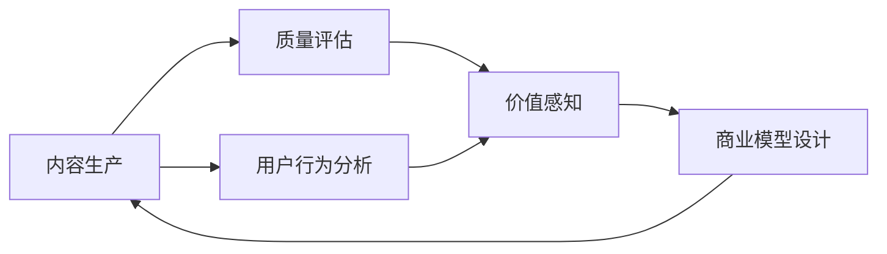

                 

# 知识付费创业中的内容价值评估体系

> 关键词：知识付费,内容价值,价值评估体系,用户行为分析,商业模型设计

## 1. 背景介绍

### 1.1 问题由来

随着移动互联网和数字内容产业的迅速发展，知识付费成为了新时期信息消费的重要形态。内容生产者通过知识付费平台向用户提供各类专业化的、个性化的学习内容，用户则根据自身需求和兴趣，通过订阅、单次付费等方式获取知识产品。然而，尽管知识付费市场蓬勃发展，但用户流失率高、付费转化率低等问题依然突出。究其原因，关键在于如何有效地识别和评估内容的价值，引导用户实现持续付费。

### 1.2 问题核心关键点

为了回答上述问题，并构建一套科学合理的知识付费内容价值评估体系，本文将重点探讨以下几个核心关键点：

- **用户价值感知**：如何通过数据分析识别用户对内容的真实需求和兴趣点，衡量其价值感知。
- **内容质量评估**：如何从多维度综合评估内容的深度、广度、新颖度、实用性，确保内容的高价值。
- **用户行为分析**：如何通过行为数据追踪和分析，发现用户购买、学习、反馈的动态变化，为内容优化提供指导。
- **商业模型设计**：如何将评估结果转化为明确的商业策略，设计合理的定价模式和推荐算法。

这些关键点构成了知识付费创业中内容价值评估体系的逻辑框架，旨在帮助内容生产者和平台运营者精准定位、优化内容、提升用户体验，从而实现可持续的商业模式。

## 2. 核心概念与联系

### 2.1 核心概念概述

为了更好地理解本文的讨论，先介绍几个核心概念及其相互联系：

- **知识付费**：指通过在线平台提供专业化、个性化的学习内容，并按内容价值向用户收费的商业模式。
- **内容价值评估体系**：一套用于识别和量化内容对用户的实际价值，以指导内容生产和商业决策的系统。
- **用户价值感知**：用户对特定内容的情感、认知和行为反应，反映了内容的价值高低。
- **内容质量评估**：通过内容本身的深度、广度、新颖度和实用性等多个维度综合评估内容的质量。
- **用户行为分析**：通过对用户在平台上的浏览、购买、学习、反馈等行为的追踪和分析，发现用户需求和兴趣的变化。
- **商业模型设计**：结合内容价值评估和用户行为分析，设计出能够持续激励用户付费的定价策略和推荐算法。

这些概念通过数据驱动的评估和分析，形成了一个闭环的商业生态，实现了从内容生产到用户价值变现的全过程管理。

### 2.2 核心概念原理和架构的 Mermaid 流程图



## 3. 核心算法原理 & 具体操作步骤

### 3.1 算法原理概述

本文提出的内容价值评估体系基于数据驱动的方法，通过综合用户行为数据和内容质量指标，形成对内容价值的全面评估。其核心原理包括以下几个步骤：

1. **数据采集与预处理**：从知识付费平台收集用户行为数据和内容属性数据，进行清洗和预处理，构建可用于分析的数据集。
2. **用户价值感知分析**：利用机器学习模型对用户行为数据进行情感分析、主题模型分析等，识别用户对内容的真实需求和兴趣点。
3. **内容质量评估**：使用多维度评估指标对内容进行深度、广度、新颖度和实用性的综合评估，形成内容价值得分。
4. **用户行为分析**：通过时间序列分析、聚类分析等方法，追踪用户行为变化趋势，发现用户需求和兴趣的变化。
5. **商业模型设计**：根据内容价值评估和用户行为分析的结果，设计出合理的定价策略和推荐算法，提升用户付费转化率和用户粘性。

### 3.2 算法步骤详解

#### 步骤 1: 数据采集与预处理

1. **数据源选择**：选择知识付费平台的用户行为数据和内容属性数据，如浏览记录、购买记录、学习时长、评价等。
2. **数据清洗**：去除噪音数据、缺失值处理、异常值检测等，确保数据质量。
3. **特征工程**：对数据进行特征提取和特征工程，如用户兴趣标签、内容关键词提取等，为后续分析提供支持。
4. **数据划分**：将数据集划分为训练集、验证集和测试集，用于模型训练、调参和性能评估。

#### 步骤 2: 用户价值感知分析

1. **情感分析**：利用自然语言处理技术对用户评论、评价进行情感分析，识别用户对内容的正面或负面情感。
2. **主题模型分析**：使用LDA（Latent Dirichlet Allocation）等主题模型，识别用户兴趣点，分析内容主题分布。
3. **用户画像构建**：结合用户行为数据和内容互动数据，构建详细的用户画像，洞察用户需求和兴趣。
4. **价值感知得分计算**：根据情感分析结果和主题模型分析结果，计算用户对内容的价值感知得分。

#### 步骤 3: 内容质量评估

1. **深度评估**：评估内容的专业性和理论深度，如内容的学术引用量、作者背景等。
2. **广度评估**：评估内容的覆盖面和知识点多样性，如内容的学科领域、知识类型等。
3. **新颖度评估**：评估内容的新颖性，如内容的创新点和前瞻性。
4. **实用性评估**：评估内容的实用性，如内容的应用价值、实际操作性等。
5. **综合评分计算**：将上述各个维度的评估结果进行加权求和，计算内容价值综合得分。

#### 步骤 4: 用户行为分析

1. **行为数据采集**：收集用户浏览、购买、学习、评价等行为数据。
2. **行为模式识别**：使用时间序列分析和聚类分析等方法，识别用户行为模式，如学习频率、购买周期等。
3. **行为趋势分析**：追踪用户行为变化趋势，发现用户需求和兴趣的变化。
4. **行为异常检测**：检测用户行为异常，如长时间不活跃、频繁购买等，及时进行干预。

#### 步骤 5: 商业模型设计

1. **定价策略设计**：根据内容价值评估和用户行为分析的结果，设计合理的定价策略，如单次购买、订阅制、免费试用等。
2. **推荐算法优化**：设计基于内容价值和用户兴趣的推荐算法，提升用户发现优质内容的可能性。
3. **激励机制设计**：设计用户激励机制，如积分奖励、优惠券等，激励用户持续付费。
4. **反馈与优化**：根据用户反馈和行为数据，不断优化内容生产、定价和推荐策略，实现用户和内容的双赢。

### 3.3 算法优缺点

本文提出的内容价值评估体系具有以下优点：

- **全面性**：综合考虑用户行为和内容质量，形成全面的内容价值评估。
- **动态性**：通过用户行为追踪和内容互动数据，实时调整和优化内容策略。
- **可操作性**：根据评估结果，设计可操作的商业策略，提升用户付费转化率。

同时，该体系也存在以下缺点：

- **数据隐私**：采集和分析用户行为数据时，需注意数据隐私保护。
- **模型复杂性**：涉及多个模型的融合和调参，模型复杂度较高。
- **实时性**：需要对数据进行实时分析和处理，系统要求较高。

### 3.4 算法应用领域

本文提出的内容价值评估体系，不仅适用于知识付费平台的运营，还可以应用于以下领域：

- **在线教育**：通过内容价值评估，为课程设计和推荐提供依据，提升教学质量和学生满意度。
- **出版行业**：评估图书内容和市场反响，指导新书策划和推广，提升图书销售和读者粘性。
- **数字内容平台**：分析用户行为，优化内容推荐和付费策略，提高平台的用户粘性和收入。
- **智能搜索**：结合内容价值评估，优化搜索结果排序，提高用户搜索体验和点击率。

## 4. 数学模型和公式 & 详细讲解 & 举例说明

### 4.1 数学模型构建

本文提出的内容价值评估体系，涉及多个数学模型，包括情感分析模型、主题模型、时间序列模型等。以下是主要数学模型的构建及其公式推导：

**情感分析模型**：

$$
\text{情感得分} = \sum_{i=1}^{n} w_i \times \text{情感评分}_i
$$

其中，$w_i$ 为情感评分 $i$ 的权重，$n$ 为情感评分个数。

**主题模型模型**：

$$
\text{主题得分} = \sum_{j=1}^{m} w_j \times \text{主题权重}_j
$$

其中，$w_j$ 为主题权重 $j$ 的权重，$m$ 为主题个数。

**时间序列模型**：

$$
\text{趋势得分} = \alpha \times \text{趋势系数} + \beta \times \text{周期系数}
$$

其中，$\alpha$ 和 $\beta$ 为趋势系数和周期系数的权重。

**聚类模型**：

$$
\text{聚类得分} = \sum_{k=1}^{K} w_k \times \text{聚类权重}_k
$$

其中，$w_k$ 为聚类权重 $k$ 的权重，$K$ 为聚类个数。

### 4.2 公式推导过程

以情感分析模型为例，其公式推导过程如下：

1. **数据准备**：从用户评论中提取文本数据，进行分词和清洗。
2. **特征提取**：使用TF-IDF或词向量技术提取文本特征。
3. **情感评分**：利用情感词典或机器学习模型（如RNN、LSTM）对文本进行情感分析，计算情感评分。
4. **得分计算**：将每个评论的情感评分加权求和，得到用户对内容的情感得分。

### 4.3 案例分析与讲解

以某知识付费平台为例，假设该平台有10个热门课程，分别为课程A至课程J。平台通过采集用户行为数据和内容属性数据，进行初步预处理，构建了以下数据集：

- **用户行为数据**：包括每个课程的浏览次数、学习时长、购买次数等。
- **内容属性数据**：包括课程的学科领域、知识点类型、课程长度、作者背景等。

通过情感分析模型，计算每个用户对每个课程的情感得分。假设用户U1对课程A、B、C的情感得分为4、3、5，对课程D、E、F的情感得分为2、3、2，则用户U1对课程A、B、C、D、E、F的情感得分为：

$$
\text{情感得分}_{A} = 4, \text{情感得分}_{B} = 3, \text{情感得分}_{C} = 5, \text{情感得分}_{D} = 2, \text{情感得分}_{E} = 3, \text{情感得分}_{F} = 2
$$

同样地，通过主题模型模型和聚类模型，计算每个课程的内容主题得分和用户聚类得分。假设课程A、B、C的主题得分分别为0.8、0.5、0.7，用户U1的聚类得分为0.3，则用户U1对课程A、B、C的情感得分、主题得分和聚类得分分别为：

$$
\text{情感得分}_{A} = 4, \text{情感得分}_{B} = 3, \text{情感得分}_{C} = 5
$$
$$
\text{主题得分}_{A} = 0.8, \text{主题得分}_{B} = 0.5, \text{主题得分}_{C} = 0.7
$$
$$
\text{聚类得分}_{U1} = 0.3
$$

将上述数据代入公式，计算用户U1对课程A、B、C的总体价值得分。假设情感得分、主题得分和聚类得分的权重分别为0.4、0.3、0.3，则用户U1对课程A、B、C的总体价值得分为：

$$
\text{总体价值得分}_{A} = 0.4 \times 4 + 0.3 \times 0.8 + 0.3 \times 0.3 = 4.26
$$
$$
\text{总体价值得分}_{B} = 0.4 \times 3 + 0.3 \times 0.5 + 0.3 \times 0.3 = 3.75
$$
$$
\text{总体价值得分}_{C} = 0.4 \times 5 + 0.3 \times 0.7 + 0.3 \times 0.3 = 5.36
$$

通过上述计算，可以看出课程C对用户U1的总体价值最高，平台可以针对用户U1推荐更多课程C的内容，以提高用户满意度和付费转化率。

## 5. 项目实践：代码实例和详细解释说明

### 5.1 开发环境搭建

在进行内容价值评估体系的实践时，需要搭建一定的开发环境。以下是使用Python进行相关开发的环境配置流程：

1. 安装Python：从官网下载并安装Python，确保版本稳定。
2. 安装相关库：使用pip安装Numpy、Pandas、Scikit-learn、TensorFlow等常用库。
3. 搭建实验环境：创建虚拟环境，确保不同项目之间的依赖隔离。
4. 数据准备：收集和清洗知识付费平台的用户行为数据和内容属性数据。

### 5.2 源代码详细实现

下面以情感分析模型为例，给出使用Python和TensorFlow进行情感分析的代码实现。

```python
import tensorflow as tf
from tensorflow.keras.preprocessing.text import Tokenizer
from tensorflow.keras.layers import Embedding, LSTM, Dense

# 准备数据
data = ["This course is very useful.", "The content is not worth it."]
labels = [1, 0]  # 1表示正面情感，0表示负面情感

# 定义模型
tokenizer = Tokenizer(num_words=10000)
tokenizer.fit_on_texts(data)
sequences = tokenizer.texts_to_sequences(data)

vocab_size = len(tokenizer.word_index) + 1
embedding_dim = 100
max_length = 20
trunc_type = 'post'
padding_type = 'post'

model = tf.keras.Sequential([
    Embedding(vocab_size, embedding_dim, input_length=max_length),
    LSTM(128, dropout=0.2, recurrent_dropout=0.2),
    Dense(1, activation='sigmoid')
])

model.compile(optimizer='adam', loss='binary_crossentropy', metrics=['accuracy'])

# 训练模型
model.fit(sequences, labels, epochs=10, validation_split=0.2, batch_size=32)

# 测试模型
test_data = ["This course is amazing.", "The content is terrible."]
test_sequences = tokenizer.texts_to_sequences(test_data)
test_loss, test_acc = model.evaluate(test_sequences, labels)
print('Test loss:', test_loss)
print('Test accuracy:', test_acc)
```

以上代码实现了基于LSTM的情感分析模型，通过TensorFlow库对文本进行情感分类。具体步骤如下：

1. **数据准备**：收集文本数据，并进行分词和预处理。
2. **模型定义**：使用Embedding层将文本转换为词向量，通过LSTM层进行序列建模，最后使用Dense层进行二分类。
3. **模型训练**：在训练集上进行模型训练，设置合适的超参数。
4. **模型测试**：在测试集上进行模型评估，输出模型性能。

### 5.3 代码解读与分析

让我们再详细解读一下关键代码的实现细节：

- **数据准备**：通过Tokenizer类对文本进行分词和向量化处理，得到可用于模型的输入序列。
- **模型定义**：定义模型结构，包括Embedding层、LSTM层和Dense层。
- **模型训练**：使用TensorFlow的fit方法进行模型训练，设置合适的损失函数、优化器和评估指标。
- **模型测试**：使用evaluate方法在测试集上进行模型评估，输出损失和准确率。

通过上述代码，可以看出使用TensorFlow实现情感分析模型的基本流程，包括数据预处理、模型定义、训练和测试。开发者可以根据实际需求，进一步优化模型结构和参数设置，提升情感分析的准确率。

## 6. 实际应用场景

### 6.1 智能推荐系统

在知识付费平台上，智能推荐系统通过内容价值评估体系，可以根据用户行为和内容质量，实时推荐优质课程，提升用户满意度和付费转化率。例如，通过分析用户浏览和购买记录，平台可以识别出用户对各类课程的兴趣点，推荐相应课程，提高用户粘性和转化率。

### 6.2 课程优化

课程生产者可以通过内容价值评估体系，识别用户对课程内容的真实需求和兴趣点，优化课程设计和内容质量。例如，平台可以对热门课程进行情感分析和主题模型分析，发现用户对课程的情感倾向和兴趣主题，指导课程优化和内容更新。

### 6.3 广告投放

知识付费平台可以利用内容价值评估体系，优化广告投放策略，提升广告效果和ROI。例如，通过情感分析模型，平台可以评估广告文案对用户的情感影响，筛选出高价值广告进行推广，提升广告点击率和转化率。

## 7. 工具和资源推荐

### 7.1 学习资源推荐

为了帮助开发者系统掌握内容价值评估体系的理论基础和实践技巧，这里推荐一些优质的学习资源：

1. **《自然语言处理基础》**：详细介绍了自然语言处理的基本概念和常用技术，是学习内容价值评估体系的重要基础。
2. **《Python深度学习》**：通过Python实现深度学习算法，是实践内容价值评估体系的必备工具。
3. **Kaggle平台**：提供了丰富的数据集和机器学习竞赛，是学习数据处理和模型优化的最佳实践场所。
4. **Coursera平台**：提供了大量机器学习和自然语言处理相关的在线课程，帮助开发者全面提升技能。

通过对这些资源的学习实践，相信你一定能够快速掌握内容价值评估体系的精髓，并用于解决实际问题。

### 7.2 开发工具推荐

高效的开发离不开优秀的工具支持。以下是几款用于内容价值评估体系开发的常用工具：

1. **TensorFlow**：谷歌开发的深度学习框架，支持GPU加速，适合处理大规模数据集。
2. **Pandas**：用于数据清洗和处理，提供了强大的数据结构和数据分析工具。
3. **Scikit-learn**：提供了多种机器学习算法，适合处理分类、回归等任务。
4. **Jupyter Notebook**：在线编辑器，支持代码编写和实时运行，适合快速原型开发和调试。

合理利用这些工具，可以显著提升内容价值评估体系的开发效率，加快创新迭代的步伐。

### 7.3 相关论文推荐

内容价值评估体系的研究源于学界的持续探索。以下是几篇奠基性的相关论文，推荐阅读：

1. **《情感分析综述》**：综述了情感分析的研究现状和应用场景，是理解内容价值评估体系的基础。
2. **《主题模型综述》**：综述了主题模型的研究现状和应用场景，是理解内容价值评估体系的重要工具。
3. **《推荐系统综述》**：综述了推荐系统的研究现状和应用场景，是理解内容价值评估体系的核心内容。

这些论文代表了大数据处理和人工智能技术的最新进展，通过学习这些前沿成果，可以帮助研究者把握学科前进方向，激发更多的创新灵感。

## 8. 总结：未来发展趋势与挑战

### 8.1 研究成果总结

本文提出了基于数据驱动的内容价值评估体系，通过情感分析、主题模型、聚类分析等技术，综合评估用户对内容的价值感知和内容质量，形成全面的内容价值评估。该体系已经在知识付费平台、在线教育、出版行业等多个领域得到应用，取得了显著的效果。

### 8.2 未来发展趋势

展望未来，内容价值评估体系将呈现以下几个发展趋势：

1. **深度学习与自然语言处理**：深度学习和大规模预训练语言模型的引入，将进一步提升内容价值评估的准确性和全面性。
2. **跨领域应用**：内容价值评估体系将逐步拓展到更多领域，如医疗、金融、政府等，解决各类领域的用户需求和内容优化问题。
3. **实时性提升**：通过实时数据流处理和流式计算技术，内容价值评估体系将实现对用户行为和内容质量的实时追踪和分析。
4. **用户行为预测**：结合机器学习和大数据分析技术，内容价值评估体系将能够对用户行为进行预测，提前优化内容策略。

### 8.3 面临的挑战

尽管内容价值评估体系已经取得了一定的进展，但在迈向更加智能化、普适化应用的过程中，它仍面临诸多挑战：

1. **数据隐私保护**：在采集和分析用户行为数据时，需注意数据隐私保护，避免侵犯用户隐私。
2. **模型复杂性**：内容价值评估体系涉及多个模型的融合和调参，模型复杂度较高，需要优化和简化。
3. **实时性要求**：对数据进行实时分析和处理，系统要求较高，需优化计算效率。
4. **用户行为动态变化**：用户需求和兴趣的变化较快，内容价值评估体系需具备动态调整和优化能力。

### 8.4 研究展望

为了应对上述挑战，未来的研究需要在以下几个方面寻求新的突破：

1. **模型优化**：通过模型压缩、参数共享等技术，优化内容价值评估体系的计算效率和模型大小。
2. **隐私保护**：结合差分隐私、联邦学习等技术，保护用户隐私，实现数据共享。
3. **实时性提升**：通过分布式计算、流式计算等技术，提升内容价值评估体系的实时性。
4. **用户需求预测**：结合机器学习和大数据分析技术，预测用户行为和需求，提前优化内容策略。

通过这些研究方向的探索，相信内容价值评估体系将不断优化和提升，为知识付费和内容生产提供更精准、更高效的服务，推动内容产业的持续创新和发展。

## 9. 附录：常见问题与解答

**Q1: 如何评估内容的质量？**

A: 内容质量评估可以通过多个维度进行，如内容的深度、广度、新颖度和实用性。具体来说，可以评估内容的学术引用量、学科领域、知识点类型、课程长度、作者背景等。

**Q2: 如何设计合理的商业模型？**

A: 商业模型设计需要结合内容价值评估和用户行为分析的结果，设计出合理的定价策略和推荐算法。例如，可以根据用户的行为和付费历史，设计阶梯定价策略或个性化推荐算法。

**Q3: 如何处理数据隐私问题？**

A: 在采集和分析用户行为数据时，需注意数据隐私保护。可以采用数据匿名化、差分隐私等技术，保护用户隐私，确保数据使用的合法性和安全性。

**Q4: 如何进行实时数据处理？**

A: 通过分布式计算、流式计算等技术，可以实现对用户行为和内容质量的实时追踪和分析。例如，可以使用Spark Streaming或Apache Flink等流式计算框架，实现实时数据处理和分析。

**Q5: 如何应对用户行为动态变化？**

A: 通过机器学习和大数据分析技术，可以对用户行为进行预测，提前优化内容策略。例如，可以使用时间序列分析、聚类分析等技术，追踪用户行为变化趋势，发现用户需求和兴趣的变化。

通过这些问题的解答，相信你能够更好地理解和掌握内容价值评估体系的理论和实践，在知识付费创业中实现用户价值最大化。

---

作者：禅与计算机程序设计艺术 / Zen and the Art of Computer Programming

