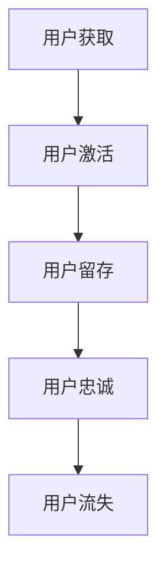

                 

# 知识付费创业中的用户忠诚度培养

## 1. 背景介绍

在知识付费领域，用户忠诚度是衡量平台长期价值的直接指标。高质量的内容、精准的用户体验以及完善的社区建设，是用户持续付费和推荐的基石。本文旨在深入探讨知识付费平台中用户忠诚度培养的关键要素，涵盖用户获取、激活、留存、续费的各个阶段，并结合实际案例分析，提出针对性的策略与建议。

## 2. 核心概念与联系

### 2.1 核心概念概述

1. **用户激活（Activation）**：用户在平台上完成首次有价值的互动，如观看视频、阅读文章、参与讨论等。
2. **用户留存（Retention）**：用户在一段时间内持续与平台互动，形成稳定的使用习惯。
3. **用户忠诚度（Loyalty）**：用户对平台的长期承诺和情感依附，表现为持续付费、推荐新用户、积极参与社区互动。
4. **用户流失（Churn）**：用户停止与平台互动，不再产生价值。

### 2.2 核心概念原理和架构的 Mermaid 流程图



通过上述流程图可以看出，用户忠诚度的培养是一个循环往复的过程，平台需要不断优化各个环节，形成正向的反馈循环。

## 3. 核心算法原理 & 具体操作步骤

### 3.1 算法原理概述

用户忠诚度的培养可以归结为一系列的算法优化与运营策略，旨在通过数据分析和机器学习技术，持续提升用户体验和平台价值。

核心算法原理主要包括以下几个方面：

1. **用户行为分析**：利用数据挖掘技术，分析用户的行为模式，识别不同用户群体的需求和偏好。
2. **个性化推荐**：基于用户的历史行为和偏好，推荐相关内容，提升用户满意度。
3. **多渠道互动**：通过社交媒体、电子邮件、APP推送等方式，与用户保持持续的互动和沟通。
4. **动态定价策略**：根据市场需求和用户价值，灵活调整内容订阅价格，提高用户续订意愿。

### 3.2 算法步骤详解

1. **数据采集与预处理**
   - 通过API接口、APP使用数据、社交媒体监控等方式，收集用户行为数据。
   - 对数据进行清洗和去重，确保数据的准确性和完整性。

2. **用户画像构建**
   - 利用机器学习算法，如K-means聚类、协同过滤等，构建用户画像。
   - 包括用户的基本信息、兴趣偏好、消费行为等维度。

3. **行为分析与预测**
   - 使用时间序列分析、决策树等算法，分析用户行为，识别高流失风险用户。
   - 利用预测模型，如随机森林、GBDT等，预测用户流失概率。

4. **个性化推荐**
   - 根据用户画像和行为数据，使用协同过滤、基于内容的推荐算法，推荐相关内容。
   - 定期更新推荐算法模型，确保推荐效果。

5. **互动与反馈**
   - 通过社交媒体、电子邮件等渠道，主动与用户沟通，收集反馈。
   - 分析用户反馈，优化产品功能和用户体验。

6. **动态定价与促销**
   - 根据用户价值和市场需求，灵活调整内容订阅价格。
   - 定期推出限时优惠、新用户优惠等促销活动，提升用户续订率。

### 3.3 算法优缺点

#### 优点

1. **个性化推荐**：通过精准的推荐，提升用户满意度，减少流失风险。
2. **动态定价**：灵活的定价策略，根据市场需求和用户价值，提高续订率。
3. **多渠道互动**：通过多渠道互动，增强用户粘性，形成正向反馈。

#### 缺点

1. **数据依赖**：算法优化依赖于高质量的数据，数据偏差会影响结果。
2. **模型复杂**：算法模型的构建和维护需要较高的技术要求。
3. **用户隐私**：处理用户数据需要遵守隐私法规，如GDPR等。

### 3.4 算法应用领域

该算法原理和方法不仅适用于知识付费平台，还可应用于电商、社交网络、在线教育等多个领域，通过提升用户体验和增加用户互动，实现用户留存和忠诚度培养。

## 4. 数学模型和公式 & 详细讲解 & 举例说明

### 4.1 数学模型构建

我们假设用户行为数据为 $D=\{(x_i,y_i)\}_{i=1}^N$，其中 $x_i$ 为特征向量，$y_i$ 为标签（如流失概率）。我们的目标是通过训练一个二分类模型 $M_{\theta}$，预测用户流失概率。

### 4.2 公式推导过程

我们可以使用Logistic回归模型来预测用户流失概率：

$$
P(y_i=1|x_i;\theta) = \frac{1}{1+e^{-M_{\theta}(x_i)}}
$$

其中 $M_{\theta}$ 为模型参数。模型的损失函数为：

$$
\mathcal{L}(\theta) = -\frac{1}{N}\sum_{i=1}^N [y_i\log P(y_i=1|x_i;\theta) + (1-y_i)\log(1-P(y_i=1|x_i;\theta))]
$$

使用梯度下降算法更新模型参数 $\theta$：

$$
\theta \leftarrow \theta - \eta \nabla_{\theta}\mathcal{L}(\theta)
$$

其中 $\eta$ 为学习率。

### 4.3 案例分析与讲解

以一个在线教育平台的用户流失预测为例：

1. **数据采集**：通过学习行为数据（学习时间、成绩、点击率等）、支付数据（订阅记录、续费率等）、社交数据（点赞、评论等）采集用户行为。
2. **特征工程**：将用户行为数据转化为机器学习模型可处理的形式，如归一化、编码等。
3. **模型训练**：使用随机森林、GBDT等算法，训练流失预测模型。
4. **预测与干预**：对高流失风险用户进行预警，并通过个性化推荐、优惠活动等手段，降低流失率。

## 5. 项目实践：代码实例和详细解释说明

### 5.1 开发环境搭建

在项目实践中，我们需要搭建Python开发环境，并安装必要的依赖库，如Scikit-Learn、XGBoost等。

```bash
pip install scikit-learn xgboost pandas numpy
```

### 5.2 源代码详细实现

以下是一个基于Scikit-Learn的流失预测模型的示例代码：

```python
import pandas as pd
from sklearn.model_selection import train_test_split
from sklearn.ensemble import RandomForestClassifier
from sklearn.metrics import accuracy_score, precision_recall_fscore_support

# 数据加载
data = pd.read_csv('user_behavior.csv')

# 特征工程
X = data.drop(['user_id', 'churn'], axis=1)
y = data['churn']

# 数据分割
X_train, X_test, y_train, y_test = train_test_split(X, y, test_size=0.2, random_state=42)

# 模型训练
clf = RandomForestClassifier(n_estimators=100, random_state=42)
clf.fit(X_train, y_train)

# 预测与评估
y_pred = clf.predict(X_test)
accuracy = accuracy_score(y_test, y_pred)
precision, recall, f1, _ = precision_recall_fscore_support(y_test, y_pred, average='binary')
print(f'Accuracy: {accuracy:.2f}, Precision: {precision:.2f}, Recall: {recall:.2f}, F1 Score: {f1:.2f}')
```

### 5.3 代码解读与分析

- **数据加载**：使用Pandas加载用户行为数据。
- **特征工程**：使用Pandas的drop方法去除无用列，使用scikit-learn的train_test_split方法进行数据分割。
- **模型训练**：使用随机森林算法，通过fit方法训练模型。
- **预测与评估**：使用predict方法进行预测，通过accuracy_score等方法评估模型性能。

## 6. 实际应用场景

### 6.1 用户获取阶段

- **SEO优化**：优化网站和APP的搜索引擎排名，吸引更多潜在用户。
- **社交媒体推广**：利用Facebook、Twitter等社交媒体，推广免费试用和优惠活动。
- **内容营销**：通过博客、视频、直播等方式，发布有价值的内容，吸引目标用户。

### 6.2 用户激活阶段

- **引导页优化**：优化新用户引导页，简化注册流程，提升用户体验。
- **个性化推荐**：利用推荐算法，快速推荐相关内容，增加用户黏性。
- **用户引导**：通过视频介绍、新手教程等方式，引导用户完成首次有价值互动。

### 6.3 用户留存阶段

- **定期推送**：定期推送个性化推荐和优惠活动，增加用户回访率。
- **互动奖励**：通过积分、优惠券等方式，奖励用户互动，提升用户粘性。
- **社区建设**：建设用户社区，增强用户归属感和互动频率。

### 6.4 用户忠诚度阶段

- **忠诚度计划**：设计用户忠诚度计划，如会员制、积分兑换等，提升用户续订率。
- **高质量内容**：持续提供高质量内容，满足用户需求，增强用户信任和依赖。
- **用户反馈**：收集用户反馈，持续优化产品功能和用户体验。

## 7. 工具和资源推荐

### 7.1 学习资源推荐

1. **《用户行为分析与数据挖掘》**：介绍用户行为分析的基本概念和方法。
2. **《个性化推荐系统》**：详细讲解个性化推荐算法的实现原理与应用。
3. **《数据驱动的产品管理》**：探讨数据在产品决策中的作用，如何利用数据提升产品性能。

### 7.2 开发工具推荐

1. **Jupyter Notebook**：强大的Python开发环境，支持代码调试和数据可视化。
2. **TensorBoard**：可视化工具，可实时监控模型训练过程，帮助优化模型性能。
3. **Alfred**：任务管理工具，帮助协调多个任务和项目。

### 7.3 相关论文推荐

1. **User-Generated Content for Personalized Recommendations**：探讨如何利用用户生成内容提升个性化推荐效果。
2. **Churn Prediction in Mobile Subscription Services**：介绍如何通过机器学习预测用户流失，提出有效的干预措施。
3. **Dynamic Pricing Strategies in Online Education Platforms**：探讨在线教育平台的动态定价策略，提升用户续订率。

## 8. 总结：未来发展趋势与挑战

### 8.1 研究成果总结

本文从用户获取、激活、留存、忠诚度的各个阶段，探讨了知识付费平台中用户忠诚度培养的算法优化与运营策略。通过实际案例分析，展示了如何通过个性化推荐、动态定价、多渠道互动等手段，提升用户满意度和忠诚度。

### 8.2 未来发展趋势

1. **智能化互动**：利用AI技术，提升平台与用户的互动质量，如智能客服、推荐引擎等。
2. **多模态数据融合**：融合语音、视频、文本等多模态数据，提供更丰富、更精准的用户画像。
3. **个性化定制**：根据用户偏好，提供个性化定制的内容和体验，满足用户的个性化需求。
4. **数据隐私保护**：加强数据隐私保护，确保用户信息安全。

### 8.3 面临的挑战

1. **数据获取与处理**：高质量的数据获取和处理是算法优化的基础，但数据获取和处理成本较高。
2. **算法优化与维护**：算法优化需要持续的维护和调整，技术要求较高。
3. **用户隐私保护**：处理用户数据需要遵守隐私法规，保护用户隐私。
4. **用户教育**：提高用户对算法的认知，提升用户对平台的信任。

### 8.4 研究展望

未来的研究可以聚焦以下几个方向：

1. **用户行为建模**：利用深度学习技术，更深入地建模用户行为，提升预测精度。
2. **跨平台互动**：实现跨平台的用户互动与数据共享，提升用户体验。
3. **算法自动化**：开发自动化的算法优化工具，减少人工干预，提高运营效率。
4. **多模态融合**：将语音、视频、文本等多模态数据融合，提升用户体验和推荐效果。

## 9. 附录：常见问题与解答

**Q1：如何衡量用户忠诚度？**

A：用户忠诚度可以通过用户续订率、平均访问时长、内容消费量等指标进行衡量。续订率高、访问时长长、内容消费量大，说明用户对平台的粘性强。

**Q2：个性化推荐如何提升用户满意度？**

A：个性化推荐能够根据用户的历史行为和偏好，推荐相关内容，减少用户在平台上搜寻的时间，提升用户体验。

**Q3：动态定价策略有哪些形式？**

A：动态定价策略包括限时优惠、新用户优惠、套餐价等，根据用户价值和市场需求，灵活调整内容订阅价格。

**Q4：如何处理用户数据隐私？**

A：处理用户数据需要遵守隐私法规，如GDPR等，确保用户信息安全。可以通过数据匿名化、加密传输等方式，保护用户隐私。

---

作者：禅与计算机程序设计艺术 / Zen and the Art of Computer Programming

