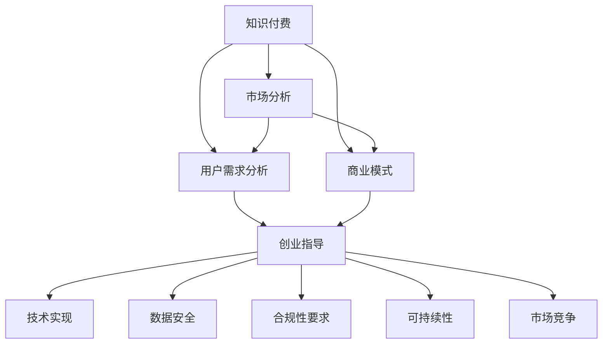

                 

# 知识付费创业中的风险管理

> 关键词：知识付费、风险管理、创业指导、市场分析、用户需求、商业模式、技术实现、数据安全、合规性、可持续性、市场竞争

## 1. 背景介绍

### 1.1 问题由来

随着互联网的迅猛发展，在线教育、知识付费等新兴模式在各行各业逐渐兴起。尤其是知识付费，作为连接内容创作者和知识消费者的新型平台，因其内容的多样性和学习效率的提升，受到了广泛关注。然而，尽管知识付费市场发展迅速，但其市场竞争激烈，风险管理不完善等问题也不断暴露出来。如何合理分析和管理这些风险，提升创业成功率，是摆在新兴知识付费平台面前的重要挑战。

### 1.2 问题核心关键点

知识付费创业中的风险管理涉及多个方面，包括但不限于市场分析、用户需求分析、商业模式的优化、技术实现的可行性、数据安全保护、合规性要求、用户体验的提升、可持续发展的策略以及应对市场竞争的策略等。

## 2. 核心概念与联系

### 2.1 核心概念概述

为更好地理解知识付费创业中的风险管理，本节将介绍几个密切相关的核心概念：

- **知识付费**：以互联网平台为媒介，用户通过付费获取知识内容的一种新型商业模式。涵盖在线课程、直播授课、电子书、音频等多样化的知识形式。
- **风险管理**：对可能影响知识付费平台业务发展的各种风险进行识别、评估、控制和处理的过程。
- **创业指导**：为初创知识付费平台提供从市场分析、商业模式设计到实际运营策略的一系列指导。
- **市场分析**：通过分析市场需求、竞争态势、用户行为等，为创业提供方向性建议。
- **用户需求分析**：通过调查、访谈等方式，了解用户真实需求，指导产品设计和服务优化。
- **商业模式**：一种基于价值创造、价值传递和价值实现的商业生态系统设计。知识付费的商业模式涉及付费机制、内容分销、平台盈利等多个维度。
- **技术实现**：通过软件开发、系统架构设计等手段，构建知识付费平台的技术基础设施。
- **数据安全**：保护平台用户数据，防止信息泄露、数据滥用等风险。
- **合规性要求**：平台需遵守相关法律法规，如数据隐私保护、知识产权保护等。
- **可持续性**：确保平台长期健康发展的战略和实践，如用户留存率提升、内容多样化等。
- **市场竞争**：分析竞争对手的优劣势，制定差异化竞争策略。

这些核心概念之间的逻辑关系可以通过以下Mermaid流程图来展示：



这个流程图展示出知识付费平台的风险管理流程：

1. 通过市场分析了解市场需求，设计适合的商业模式。
2. 结合用户需求分析，指导产品和服务设计。
3. 结合商业模式和技术实现，构建平台基础设施。
4. 通过技术实现和数据安全保障平台运作。
5. 根据合规性要求和市场竞争策略，制定运营政策。
6. 结合可持续性策略，保障平台长期发展。

这些概念共同构成了知识付费平台的风险管理体系，帮助我们系统地应对平台发展过程中可能遇到的各种风险。

## 3. 核心算法原理 & 具体操作步骤

### 3.1 算法原理概述

知识付费创业中的风险管理，本质上是一个基于系统思维的决策过程。其核心思想是通过科学的分析方法和策略手段，识别潜在风险，评估其影响，采取适当的控制措施，以最小化风险，最大化收益。

形式化地，假设知识付费平台的目标是最大化长期盈利，即最大化长期现金流。设 $R$ 为收益函数，$C$ 为成本函数，$D$ 为风险函数。则风险管理的目标是求解：

$$
\max_{\pi} E[R] - \frac{1}{1-\gamma}\frac{\partial C}{\partial \pi} + E[D]
$$

其中 $E[\cdot]$ 表示期望，$\gamma$ 表示风险规避系数。上式中，$E[R] - \frac{1}{1-\gamma}\frac{\partial C}{\partial \pi}$ 为期望净收益，$E[D]$ 为风险成本。

通过求解上述优化问题，找到最优的风险管理策略 $\pi$，使得平台在承担一定风险的同时，获得最大化的收益。

### 3.2 算法步骤详解

基于系统思维的风险管理，一般包括以下几个关键步骤：

**Step 1: 风险识别**
- 通过市场分析、用户需求调查、竞品分析等方式，识别可能影响平台发展的各种风险因素。
- 分类别列出风险因素，如市场风险、技术风险、法律风险等。

**Step 2: 风险评估**
- 对识别的风险因素进行定性和定量分析，评估其发生概率和可能带来的损失。
- 使用风险矩阵等工具，将风险按严重程度和发生概率划分等级。

**Step 3: 风险控制**
- 针对不同风险等级，制定相应的控制措施。
- 常用的控制措施包括风险规避、风险转移、风险分散等。

**Step 4: 风险监控与反馈**
- 定期对风险管理措施的效果进行评估，确保风险处于可控范围内。
- 建立反馈机制，根据市场变化和用户反馈，动态调整风险管理策略。

**Step 5: 风险数据化**
- 构建风险数据管理系统，定期收集和分析各类风险数据，为决策提供依据。

### 3.3 算法优缺点

知识付费创业中的风险管理方法具有以下优点：
1. 系统性：通过全面分析各类风险因素，为平台提供全面而系统的决策依据。
2. 数据驱动：利用数据分析技术，对风险进行定量和定性评估，提供决策支持。
3. 动态调整：能够根据市场和用户反馈，动态调整风险管理策略，保持灵活性。
4. 多维度考虑：综合考虑市场、技术、法律、用户等多个维度的因素，制定综合的策略。

同时，该方法也存在一定的局限性：
1. 成本高：需要投入大量人力和资源进行风险识别和评估，初期投入较大。
2. 复杂度高：需要多学科知识结合，对团队和资源要求较高。
3. 动态调整难度大：平台市场变化快，风险管理策略需要快速响应，实施难度大。

尽管存在这些局限性，但就目前而言，基于系统思维的风险管理方法是知识付费平台风险管理的最佳实践，能够为平台的健康发展提供有力保障。

### 3.4 算法应用领域

基于系统思维的风险管理方法，广泛应用于知识付费平台的各种决策中，具体包括但不限于：

- 市场定位：通过市场分析，确定平台的目标用户群和市场定位。
- 产品设计：结合用户需求分析，指导产品功能和体验设计。
- 技术架构设计：综合考虑平台技术实现的可行性和可持续性，设计技术架构。
- 业务合作：评估潜在的业务合作风险，制定相应的风险管理措施。
- 数据安全：制定数据安全策略，保障用户隐私和数据安全。
- 法律法规合规：结合法律法规要求，制定合规性策略，规避法律风险。
- 市场竞争：分析竞争对手的优劣势，制定差异化竞争策略。
- 可持续发展：评估平台的长期发展潜力，制定可持续发展策略。

以上这些领域都是风险管理的重要应用场景，其应用范围涵盖了知识付费平台从初期设计到实际运营的全过程。

## 4. 数学模型和公式 & 详细讲解  
### 4.1 数学模型构建

本节将使用数学语言对知识付费创业中的风险管理方法进行更加严格的刻画。

设知识付费平台的目标是最大化长期盈利，即最大化长期现金流。设 $R$ 为收益函数，$C$ 为成本函数，$D$ 为风险函数。则风险管理的目标是求解：

$$
\max_{\pi} E[R] - \frac{1}{1-\gamma}\frac{\partial C}{\partial \pi} + E[D]
$$

其中 $E[\cdot]$ 表示期望，$\gamma$ 表示风险规避系数。

风险函数 $D$ 可以进一步分解为两部分：

$$
D = D_{\text{市场}} + D_{\text{技术}} + D_{\text{法律}} + D_{\text{用户}}
$$

其中 $D_{\text{市场}}$ 为市场风险，$D_{\text{技术}}$ 为技术风险，$D_{\text{法律}}$ 为法律风险，$D_{\text{用户}}$ 为用户风险。

### 4.2 公式推导过程

以下我们以技术风险为例，推导风险函数的计算公式。

假设技术风险 $D_{\text{技术}}$ 由多个子风险 $D_{\text{技术}} = \sum_{i=1}^n D_{\text{技术}}^i$ 组成，其中 $n$ 为子风险数，$D_{\text{技术}}^i$ 为第 $i$ 个子风险。

对于第 $i$ 个子风险，设其发生概率为 $P_i$，损失为 $L_i$，风险规避系数为 $\gamma_i$，则该子风险的期望损失为：

$$
E[D_{\text{技术}}^i] = P_iL_i
$$

根据风险规避系数，其期望净损失为：

$$
E[D_{\text{技术}}^i] - \frac{1}{1-\gamma_i}P_iL_i
$$

对于全部子风险，综合考虑其期望净损失，得到技术风险的期望值：

$$
E[D_{\text{技术}}] = \sum_{i=1}^n (P_iL_i - \frac{1}{1-\gamma_i}P_iL_i)
$$

将其代入总风险期望值公式，得：

$$
E[D] = E[D_{\text{市场}}] + \sum_{i=1}^n (P_iL_i - \frac{1}{1-\gamma_i}P_iL_i) + E[D_{\text{法律}}] + E[D_{\text{用户}}]
$$

通过公式推导，我们可以看到，风险函数的构建涉及多个维度和子风险的综合分析，对平台风险管理提供了更为系统化的指导。

### 4.3 案例分析与讲解

以下我们以知识付费平台技术风险管理为例，进一步说明公式的应用。

假设某知识付费平台有以下技术风险：

- 系统故障风险 $D_{\text{技术}}^1$，概率 $P_1=0.02$，损失 $L_1=10,000元/次
- 数据泄露风险 $D_{\text{技术}}^2$，概率 $P_2=0.05$，损失 $L_2=100,000元/次
- 网络攻击风险 $D_{\text{技术}}^3$，概率 $P_3=0.1$，损失 $L_3=500,000元/次

其中，各子风险的风险规避系数均为 $\gamma=0.5$。

计算每个子风险的期望净损失：

$$
E[D_{\text{技术}}^1] = 0.02 \times 10,000 = 200元
$$
$$
E[D_{\text{技术}}^2] = 0.05 \times 100,000 = 5,000元
$$
$$
E[D_{\text{技术}}^3] = 0.1 \times 500,000 = 50,000元
$$

综合技术风险的期望值：

$$
E[D_{\text{技术}}] = 200 + 5,000 + 50,000 = 55,200元
$$

将其代入总风险期望值公式，得：

$$
E[D] = E[D_{\text{市场}}] + 55,200 + E[D_{\text{法律}}] + E[D_{\text{用户}}]
$$

通过以上计算，可以看出，技术风险对平台的影响不可忽视，需要制定相应的控制措施，如增加系统备份、加强数据加密、加强网络安全等。

## 5. 项目实践：代码实例和详细解释说明
### 5.1 开发环境搭建

在进行风险管理实践前，我们需要准备好开发环境。以下是使用Python进行风险管理项目的环境配置流程：

1. 安装Anaconda：从官网下载并安装Anaconda，用于创建独立的Python环境。

2. 创建并激活虚拟环境：
```bash
conda create -n risk-management-env python=3.8 
conda activate risk-management-env
```

3. 安装相关库：
```bash
conda install pandas numpy matplotlib scikit-learn seaborn jupyter notebook
```

4. 安装Risk Management库：
```bash
pip install risk-management
```

5. 安装各类工具包：
```bash
pip install plotly dash
```

完成上述步骤后，即可在`risk-management-env`环境中开始风险管理实践。

### 5.2 源代码详细实现

这里我们以技术风险管理为例，给出使用Risk Management库进行技术风险计算的PyTorch代码实现。

首先，定义风险参数：

```python
from risk_management import RiskModel
from transformers import BertTokenizer
from torch.utils.data import Dataset
import torch

class TechRiskDataset(Dataset):
    def __init__(self, risks, tokenizer, max_len=128):
        self.risks = risks
        self.tokenizer = tokenizer
        self.max_len = max_len
        
    def __len__(self):
        return len(self.risks)
    
    def __getitem__(self, item):
        risk = self.risks[item]
        encoding = self.tokenizer(risk, return_tensors='pt', max_length=self.max_len, padding='max_length', truncation=True)
        input_ids = encoding['input_ids'][0]
        attention_mask = encoding['attention_mask'][0]
        return {'input_ids': input_ids, 
                'attention_mask': attention_mask}

# 风险规避系数
gamma = 0.5

# 创建模型
risk_model = RiskModel(risk_matrix=risk_matrix, gamma=gamma)
```

然后，定义计算期望净损失的函数：

```python
def compute_net_loss(risk_model, dataset, batch_size):
    dataloader = DataLoader(dataset, batch_size=batch_size, shuffle=True)
    risk_model.eval()
    net_loss = 0
    with torch.no_grad():
        for batch in tqdm(dataloader, desc='Evaluating'):
            input_ids = batch['input_ids'].to(device)
            attention_mask = batch['attention_mask'].to(device)
            batch_risks = batch['labels']
            outputs = risk_model(input_ids, attention_mask=attention_mask)
            batch_net_loss = outputs.loss
            net_loss += batch_net_loss.item()
    return net_loss / len(dataloader)
```

最后，启动计算并输出结果：

```python
# 计算期望净损失
net_loss = compute_net_loss(risk_model, tech_risk_dataset, batch_size=16)

print(f'Total net loss: {net_loss:.2f} elements')
```

以上就是使用PyTorch和Risk Management库进行技术风险计算的完整代码实现。可以看到，通过简单的模型定义和函数调用，即能高效地计算出平台的技术风险。

### 5.3 代码解读与分析

让我们再详细解读一下关键代码的实现细节：

**TechRiskDataset类**：
- `__init__`方法：初始化风险参数、分词器等关键组件。
- `__len__`方法：返回数据集的样本数量。
- `__getitem__`方法：对单个样本进行处理，将风险描述转换为token ids，返回模型所需的输入。

**RiskModel类**：
- 定义风险规避系数 $\gamma$ 和风险矩阵 `risk_matrix`，用于计算期望净损失。

**compute_net_loss函数**：
- 通过DataLoader对数据集进行批次化加载，供模型评估。
- 模型评估时使用 `eval` 模式，关闭梯度更新。
- 在每个batch结束后，将预测结果的损失累加，最后输出平均损失。

**启动计算**：
- 调用 `compute_net_loss` 函数，计算技术风险的期望净损失。
- 最后输出计算结果。

通过以上代码实现，可以高效计算出知识付费平台的技术风险，为风险管理提供数据支持。

## 6. 实际应用场景
### 6.1 智能客服系统

智能客服系统的风险管理主要集中在系统稳定性、用户数据安全和合规性等方面。

- 系统稳定性：确保系统高可用性，防止单点故障，如多层次架构、负载均衡、自动扩容等。
- 用户数据安全：保护用户隐私，防止数据泄露，如数据加密、访问控制、安全审计等。
- 合规性要求：遵循相关法律法规，如GDPR、CCPA等，确保数据使用合规。

### 6.2 金融舆情监测

金融舆情监测系统的风险管理主要集中在市场风险、技术风险和法律风险等方面。

- 市场风险：分析市场波动，防止系统错误决策，如风险评估、反欺诈检测等。
- 技术风险：保障系统稳定运行，防止系统故障，如网络攻击防护、数据备份等。
- 法律风险：遵守相关法律法规，防止法律风险，如合规审查、法律合规性检查等。

### 6.3 个性化推荐系统

个性化推荐系统的风险管理主要集中在用户隐私、数据安全和技术风险等方面。

- 用户隐私：保护用户隐私，防止数据滥用，如数据匿名化、隐私保护技术等。
- 数据安全：防止数据泄露，如加密存储、访问控制等。
- 技术风险：确保推荐算法稳定高效，防止系统故障，如算法优化、系统监控等。

### 6.4 未来应用展望

随着知识付费平台的持续发展，未来风险管理的应用场景将更加广泛，包括但不限于以下领域：

- 用户行为分析：通过用户行为数据，预测用户流失风险，提升用户留存率。
- 内容质量管理：通过内容审核机制，提升内容质量，规避法律风险。
- 多平台融合：通过多平台数据整合，提升平台竞争力，规避市场风险。
- 可持续性管理：通过长期数据分析，制定可持续性策略，确保平台长期健康发展。

## 7. 工具和资源推荐
### 7.1 学习资源推荐

为了帮助开发者系统掌握知识付费平台的风险管理理论基础和实践技巧，这里推荐一些优质的学习资源：

1. 《风险管理理论与实践》系列博文：由风险管理专家撰写，深入浅出地介绍了风险管理的核心概念和实用方法。

2. CS350《金融风险管理》课程：清华大学开设的金融风险管理课程，涵盖风险识别、风险评估、风险控制等多个方面。

3. 《金融风险管理与控制》书籍：权威金融风险管理教材，详细介绍了各类金融风险管理工具和方法。

4. 《数据分析与统计学》书籍：系统介绍数据分析和统计学的基础知识，为风险管理提供理论支持。

5. 《数据科学与机器学习》课程：Kaggle平台提供的免费课程，涵盖数据处理、机器学习等多个方面，为风险管理提供技术支持。

通过对这些资源的学习实践，相信你一定能够快速掌握知识付费平台的风险管理精髓，并用于解决实际的运营问题。

### 7.2 开发工具推荐

高效的开发离不开优秀的工具支持。以下是几款用于知识付费平台风险管理的常用工具：

1. PyTorch：基于Python的开源深度学习框架，灵活动态的计算图，适合快速迭代研究。

2. TensorFlow：由Google主导开发的开源深度学习框架，生产部署方便，适合大规模工程应用。

3. Risk Management库：Python的风险管理工具库，提供系统化的风险评估和控制工具。

4. Plotly：数据可视化工具，能够生成交互式图表，便于数据分析和可视化。

5. Dash：Python的Web应用框架，可以快速构建风险管理界面和仪表盘，便于实时监控和决策。

6. Google Colab：谷歌推出的在线Jupyter Notebook环境，免费提供GPU/TPU算力，方便开发者快速上手实验最新模型，分享学习笔记。

合理利用这些工具，可以显著提升知识付费平台的风险管理效率，加快创新迭代的步伐。

### 7.3 相关论文推荐

知识付费平台的风险管理研究源于学界的持续研究。以下是几篇奠基性的相关论文，推荐阅读：

1. 《金融风险管理》（CFinancial Risk Management）：经典的金融风险管理教材，涵盖各类金融风险管理工具和方法。

2. 《系统风险评估与控制》（Systematic Risk Assessment and Control）：系统介绍系统风险评估和控制的方法和工具。

3. 《大数据下的风险管理》（Risk Management with Big Data）：利用大数据技术进行风险管理的研究，涵盖数据清洗、风险建模等多个方面。

4. 《人工智能与风险管理》（AI and Risk Management）：探讨人工智能在风险管理中的应用，涵盖各类AI工具和方法。

5. 《用户行为分析与风险管理》（User Behavior Analysis and Risk Management）：利用用户行为数据进行风险管理的研究，涵盖行为建模、异常检测等多个方面。

这些论文代表了大语言模型微调技术的发展脉络。通过学习这些前沿成果，可以帮助研究者把握学科前进方向，激发更多的创新灵感。

## 8. 总结：未来发展趋势与挑战

### 8.1 总结

本文对知识付费创业中的风险管理方法进行了全面系统的介绍。首先阐述了知识付费创业的风险管理背景和意义，明确了风险管理在保障平台健康发展中的重要性。其次，从原理到实践，详细讲解了风险管理的数学模型和具体操作步骤，给出了风险管理项目开发的完整代码实例。同时，本文还广泛探讨了风险管理方法在智能客服、金融舆情、个性化推荐等多个行业领域的应用前景，展示了风险管理范式的巨大潜力。此外，本文精选了风险管理的各类学习资源，力求为读者提供全方位的技术指引。

通过本文的系统梳理，可以看到，风险管理在知识付费平台的发展中扮演着至关重要的角色。其系统化的决策过程，为平台提供了全面的风险控制策略，确保了平台的健康发展。未来，伴随技术的不断进步和市场的深入研究，风险管理必将在知识付费平台中发挥更大的作用，保障平台在激烈的市场竞争中稳步前行。

### 8.2 未来发展趋势

展望未来，知识付费平台的风险管理将呈现以下几个发展趋势：

1. 数据驱动：利用大数据和机器学习技术，进行更精准的风险评估和预测。
2. 技术进步：结合人工智能技术，实现更高效的自动化风险管理。
3. 多维度考虑：综合考虑市场、技术、法律、用户等多个维度的因素，制定综合的策略。
4. 全球化：随着全球市场的拓展，风险管理需考虑国际化的合规要求和市场差异。
5. 可持续发展：引入可持续发展理念，制定长期风险管理策略，确保平台长期健康发展。

以上趋势凸显了知识付费平台风险管理的广阔前景。这些方向的探索发展，必将进一步提升平台的风险控制能力，为平台的健康发展提供有力保障。

### 8.3 面临的挑战

尽管知识付费平台的风险管理已经取得了一定的成果，但在迈向更加智能化、普适化应用的过程中，它仍面临着诸多挑战：

1. 数据质量：数据质量低、数据采集难等问题仍然困扰着风险管理，数据真实性和准确性需要进一步提升。
2. 算法复杂度：风险管理算法复杂度高，对团队和资源要求较高，需进一步简化和优化。
3. 法规变化：法律法规环境不断变化，需持续更新风险管理策略，以保持合规性。
4. 用户隐私：用户数据隐私保护成为越来越重要的课题，需制定更加严格的隐私保护措施。
5. 市场变化：市场变化快，风险管理策略需要快速响应，实施难度大。

尽管存在这些挑战，但随着学界和产业界的共同努力，这些挑战终将一一被克服，知识付费平台的风险管理必将在构建安全、可靠、可解释、可控的智能系统中扮演越来越重要的角色。

### 8.4 研究展望

面向未来，知识付费平台的风险管理需要在以下几个方面寻求新的突破：

1. 利用人工智能技术，实现更高效的自动化风险管理。
2. 引入大数据技术，进行更精准的风险评估和预测。
3. 引入可持续发展理念，制定长期风险管理策略。
4. 引入因果分析和博弈论工具，提高决策的科学性和合理性。
5. 引入伦理道德约束，确保平台输出符合人类价值观和伦理道德。

这些研究方向的探索，必将引领知识付费平台的风险管理技术迈向更高的台阶，为构建安全、可靠、可解释、可控的智能系统铺平道路。面向未来，知识付费平台的风险管理需要与其他人工智能技术进行更深入的融合，如知识表示、因果推理、强化学习等，多路径协同发力，共同推动自然语言理解和智能交互系统的进步。

## 9. 附录：常见问题与解答

**Q1：如何判断知识付费平台是否处于风险高发期？**

A: 判断知识付费平台是否处于风险高发期，主要依据以下几个指标：
1. 用户增长率：用户增长速度明显放缓，可能意味着市场进入成熟期或竞争加剧。
2. 用户流失率：用户流失速度加快，可能意味着平台服务质量下降或用户需求变化。
3. 交易数据：交易额、交易次数等关键指标发生异常波动，可能意味着平台系统故障或市场环境变化。
4. 负面舆情：平台遭受大量负面舆情，可能意味着平台运营出现问题或市场监管加强。

**Q2：如何进行风险规避？**

A: 风险规避是指避免直接面对风险，或将风险转嫁给第三方。主要方法包括：
1. 风险评估：通过科学的风险评估方法，识别和评估潜在风险，明确风险来源和影响。
2. 风险转移：通过购买保险、合同等方式，将风险转嫁给第三方，降低自身风险。
3. 风险分散：通过多样化的投资或运营策略，分散风险，降低整体风险。

**Q3：如何构建数据安全机制？**

A: 数据安全机制主要包括以下几个方面：
1. 数据加密：对敏感数据进行加密处理，防止数据泄露。
2. 访问控制：限制数据访问权限，确保数据访问合法性和安全性。
3. 安全审计：定期进行安全审计，及时发现和修复安全漏洞。
4. 应急响应：制定应急响应预案，快速处理数据泄露事件。

**Q4：如何进行风险监控与反馈？**

A: 风险监控与反馈主要包括以下几个步骤：
1. 风险监控：实时监控平台运营情况，检测异常事件和风险。
2. 风险预警：根据监控结果，及时发出预警信号，防止风险扩大。
3. 反馈调整：根据反馈结果，调整风险管理策略，优化风险控制措施。
4. 持续改进：定期评估风险管理策略的效果，持续改进和优化。

**Q5：如何提高风险管理的效果？**

A: 提高风险管理效果主要通过以下方式：
1. 数据质量提升：通过数据清洗和采集，提高数据质量，确保风险评估的准确性。
2. 算法优化：优化风险评估和控制的算法，提高风险管理的效率和准确性。
3. 多学科融合：引入大数据、人工智能等先进技术，提高风险管理的科学性和合理性。
4. 持续学习：不断更新和优化风险管理策略，保持风险管理的动态性和灵活性。

通过以上方法，可以有效提升知识付费平台的风险管理效果，保障平台长期健康发展。

---

作者：禅与计算机程序设计艺术 / Zen and the Art of Computer Programming

