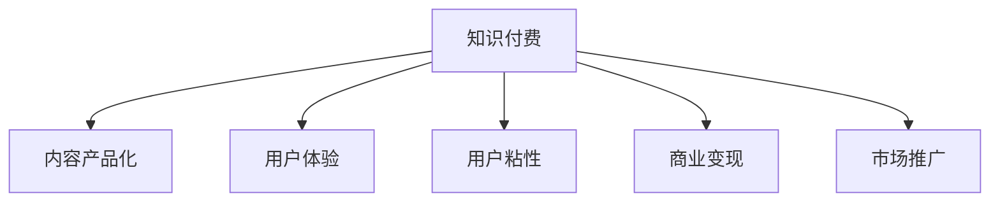

                 

# 知识付费创业的内容产品化策略

## 1. 背景介绍

### 1.1 问题由来
随着互联网的普及和知识传播形式的革新，知识付费平台如雨后春笋般涌现。内容创造者通过提供专业、深入、有价值的知识，吸引用户订阅和支付。然而，仅仅拥有优质内容远远不够，将内容转化为可售卖、易访问、体验佳的产品，才是知识付费创业成功的关键。内容产品化，即如何将内容转化为具备商业价值、用户价值、市场竞争力的产品，是摆在知识付费创业者面前的重要课题。

### 1.2 问题核心关键点
内容产品化的核心在于将知识内容的价值最大化，创造用户粘性，提升用户转化率，增强市场竞争力。核心关键点包括：
- 用户需求分析：识别目标用户的核心痛点，明确产品定位和目标功能。
- 内容价值提炼：将复杂抽象的内容转化为具体可感知的知识产品。
- 产品设计与迭代：设计易用、高效、吸引用户的产品形态，持续优化用户体验。
- 商业模式构建：探索盈利模式，平衡内容产出与商业收益。
- 市场推广策略：通过精准营销和口碑传播，快速获取用户和市场份额。

## 2. 核心概念与联系

### 2.1 核心概念概述

为更好地理解知识付费创业中的内容产品化策略，本节将介绍几个密切相关的核心概念：

- 知识付费：通过订阅、购买等方式，获取有价值的知识内容，并享受内容增值服务。
- 内容产品化：将知识内容转化为具备商业价值、用户价值的产品，形成市场竞争优势。
- 用户体验：用户在使用产品时的满意度、愉悦感和投入度。
- 用户粘性：用户对产品的长期依赖度和忠诚度。
- 商业变现：通过产品获取收入，实现盈利。
- 市场推广：利用营销手段，提高产品曝光度和用户获取量。

这些核心概念之间的逻辑关系可以通过以下Mermaid流程图来展示：



这个流程图展示了一些核心概念及其之间的关系：

1. 知识付费是内容产品化的基础。
2. 内容产品化通过提升用户体验、增强用户粘性来实现商业变现。
3. 市场推广是产品推广和用户获取的重要手段。

这些概念共同构成了知识付费创业的核心框架，指引创业者从内容本身出发，设计出具备市场竞争力和用户吸引力的产品。

## 3. 核心算法原理 & 具体操作步骤
### 3.1 算法原理概述

内容产品化策略的核心理念是通过优化内容供给和用户体验，实现内容的商业价值。核心算法原理主要包括用户行为分析、内容推荐系统、个性化定价策略等。

- **用户行为分析**：通过数据分析用户的使用习惯、偏好、流失原因等，指导内容供给和产品优化。
- **内容推荐系统**：根据用户行为和内容特征，实时推荐相关内容，提升用户粘性和使用频率。
- **个性化定价策略**：根据用户价值和市场需求，设定合理的价格体系，促进高价值用户的付费转化。

### 3.2 算法步骤详解

以下介绍内容产品化策略的具体操作步骤：

**Step 1: 用户需求调研**
- 设计问卷和访谈，收集目标用户的基本信息、需求痛点、消费习惯等。
- 利用数据分析工具，挖掘用户行为模式和偏好特征。

**Step 2: 内容价值提炼**
- 根据用户调研结果，确定核心需求和关注点。
- 将知识内容转化为具象产品，如文字文章、视频教程、音频讲解、直播互动等。
- 设计产品结构和功能，确保内容的可访问性和易理解性。

**Step 3: 用户体验设计**
- 进行用户画像分析，明确用户使用场景和体验痛点。
- 设计简洁、直观、易用的UI/UX，提高用户操作效率和满意度。
- 引入用户反馈机制，持续优化产品功能。

**Step 4: 商业变现策略**
- 设计多元化盈利模式，如订阅付费、按需付费、增值服务、广告分成等。
- 设定合理的会员价格和权益体系，促进用户订阅和续费。
- 利用数据分析和A/B测试，优化定价策略和会员计划。

**Step 5: 市场推广策略**
- 制定营销目标和预算，选择适合的渠道和策略。
- 利用社交媒体、KOL合作、搜索引擎优化等方式提高产品曝光。
- 设计有吸引力的推广活动，如限时优惠、新用户折扣等，促进用户转化。

**Step 6: 持续迭代与优化**
- 定期收集用户反馈，分析市场变化，调整产品策略。
- 引入新内容和新功能，保持产品活力和竞争力。
- 建立反馈闭环机制，确保产品与市场需求同步。

以上是内容产品化策略的主要操作步骤。在实际操作中，还需要根据具体业务需求和市场环境，灵活调整各个环节的策略和执行细节。

### 3.3 算法优缺点

内容产品化策略的主要优点包括：
1. 提升用户粘性和忠诚度。通过个性化推荐和高质量内容，增强用户对平台的依赖。
2. 优化用户转化率。通过合理的定价和营销策略，促进用户付费和续费。
3. 增强市场竞争力。通过差异化的内容和产品形态，获得竞争优势。

同时，该策略也存在一些缺点：
1. 对数据依赖度高。内容产品化需要大量的用户行为数据，初期获取和分析成本较高。
2. 运营复杂度高。内容产品化的持续优化和迭代需要大量的人力投入。
3. 用户需求多样化。不同用户群体的需求差异大，难以找到普适性的解决方案。
4. 市场环境多变。市场需求和用户偏好随时间变化，需要快速调整和响应。

尽管存在这些局限性，但就目前而言，内容产品化策略仍是知识付费创业中最主流的实践范式。未来相关研究重点在于如何进一步降低数据获取和运营成本，提高用户需求的匹配度和产品设计的灵活性，同时兼顾用户粘性和商业收益。

### 3.4 算法应用领域

内容产品化策略在知识付费创业中得到了广泛应用，涵盖了内容供给、用户体验设计、市场推广等多个方面，例如：

- 文字文章内容：提供深度分析、案例研究、数据报告等长篇文章，通过订阅付费获取。
- 视频教程内容：制作高质量的视频课程，涵盖编程、金融、管理等多个领域，通过按需付费或订阅获取。
- 音频讲解内容：录制专家访谈、书籍讲解、行业分析等音频内容，通过订阅获取。
- 直播互动内容：邀请行业专家进行在线直播，提供即时互动和解答，通过订阅获取。
- 社区互动内容：构建用户社区，提供知识分享、经验交流、社交互动，增强用户粘性。
- 个性化定价内容：根据用户学习进度和付费能力，灵活调整课程价格和增值服务，实现个性化付费。
- 会员体系设计：设立会员权益体系，提供专属内容、个性化推荐、优先服务，促进用户续费。

除了上述这些典型应用外，内容产品化策略还在越来越多的领域得到探索和创新，如可定制化内容、多渠道分发、跨平台整合等，为知识付费创业带来了新的突破和机遇。

## 4. 数学模型和公式 & 详细讲解  
### 4.1 数学模型构建

内容产品化策略的数学模型构建，主要围绕用户行为分析、内容推荐系统、个性化定价策略等关键环节展开。

假设用户集合为 $U$，内容集合为 $C$，用户行为数据为 $B \subset U \times C$。内容推荐系统通过构建用户与内容的相似度矩阵 $W \in \mathbb{R}^{N \times N}$，其中 $N$ 为用户数，推荐算法为目标函数 $f: U \times C \rightarrow \mathbb{R}$，表示用户 $u$ 对内容 $c$ 的评分。个性化定价策略则是基于用户价值模型 $V: U \rightarrow [0, +\infty)$，计算每个用户的平均Lifetime Value (LTV)，设定价格体系。

### 4.2 公式推导过程

以下对内容推荐系统和个性化定价策略进行详细的公式推导：

**内容推荐系统**

假设用户 $u$ 对内容 $c$ 的评分由两部分组成：个人评分 $p_u(c)$ 和内容特征评分 $g(c)$。则推荐算法可表示为：

$$
f(u, c) = p_u(c) + g(c) \times W_{uc}
$$

其中 $p_u(c)$ 可通过问卷、访谈等数据计算，$g(c)$ 为内容特征的加权评分，$W_{uc}$ 为内容 $c$ 与用户 $u$ 的相似度权重。

**个性化定价策略**

用户价值模型 $V(u)$ 可根据用户历史行为和消费数据计算，如通过回归模型 $V(u) = \alpha_1 u_1 + \alpha_2 u_2 + \cdots + \alpha_n u_n$，其中 $\alpha_i$ 为回归系数，$u_i$ 为第 $i$ 个特征的评分。基于用户价值模型的个性化定价策略可表示为：

$$
P(u) = V(u) \times k
$$

其中 $P(u)$ 为用户 $u$ 的定价，$k$ 为价格系数，需根据市场需求和成本控制进行调整。

### 4.3 案例分析与讲解

以视频课程订阅为例，分析内容推荐和定价策略的应用。

**用户行为分析**

通过问卷和数据分析，识别用户对视频课程的关注点为讲师背景、课程时长、学习目标等。设计问卷收集用户对课程内容、讲师互动、学习平台等方面的反馈，构建用户画像。

**内容价值提炼**

根据用户调研结果，确定视频课程的核心需求为高效学习、深入理解、实际应用等。设计视频课程框架，涵盖基础、进阶、实践等多个阶段，确保内容的全面性和深入性。引入专家授课、实验演示、案例分析等元素，提高课程吸引力。

**用户体验设计**

设计简洁直观的视频播放器界面，支持视频播放、笔记记录、问答互动等功能。引入视频转文字功能，方便用户快速预览和查找关键内容。提供课程回放、进度条、分段学习等功能，提高用户学习效率。

**商业变现策略**

设计多元化的付费模式，如单次购买、月度订阅、年度订阅等。设置免费试看章节，吸引用户先体验课程内容。基于用户学习进度和互动频率，动态调整课程价格和增值服务，促进用户续费。

**市场推广策略**

利用社交媒体、KOL合作、搜索引擎优化等方式推广视频课程。设计限时优惠、新用户折扣等活动，吸引用户注册和购买。利用邮件、推送等方式进行个性化推荐，提高用户转化率。

**持续迭代与优化**

定期收集用户反馈，分析市场变化，调整课程内容、推荐算法和定价策略。引入新讲师和新技术，保持课程活力和竞争力。建立反馈闭环机制，确保产品与市场需求同步。

## 5. 项目实践：代码实例和详细解释说明
### 5.1 开发环境搭建

在进行内容产品化策略实践前，我们需要准备好开发环境。以下是使用Python进行Flask开发的环境配置流程：

1. 安装Anaconda：从官网下载并安装Anaconda，用于创建独立的Python环境。

2. 创建并激活虚拟环境：
```bash
conda create -n flask-env python=3.8 
conda activate flask-env
```

3. 安装Flask：
```bash
pip install flask
```

4. 安装必要的扩展库：
```bash
pip install pandas numpy matplotlib jinja2
```

完成上述步骤后，即可在`flask-env`环境中开始内容产品化策略的实践。

### 5.2 源代码详细实现

这里我们以一个简单的知识付费平台为例，实现内容产品化策略的核心功能。

首先，设计用户注册、登录模块：

```python
from flask import Flask, request, render_template, redirect, url_for

app = Flask(__name__)

@app.route('/')
def index():
    return render_template('index.html')

@app.route('/signup', methods=['GET', 'POST'])
def signup():
    if request.method == 'POST':
        # 获取注册信息，保存用户数据
        return redirect(url_for('login'))
    return render_template('signup.html')

@app.route('/login', methods=['GET', 'POST'])
def login():
    if request.method == 'POST':
        # 验证登录信息，返回用户登录状态
        return redirect(url_for('dashboard'))
    return render_template('login.html')

@app.route('/dashboard')
def dashboard():
    # 获取用户订阅信息，推荐相关课程
    return render_template('dashboard.html')
```

然后，设计课程推荐模块：

```python
from flask import Flask, request, render_template, redirect, url_for
from sklearn.metrics.pairwise import cosine_similarity
import pandas as pd

app = Flask(__name__)

# 课程数据示例
courses = {
    1: {'name': 'Python基础', 'author': '张三', 'duration': 4},
    2: {'name': '数据科学入门', 'author': '李四', 'duration': 6},
    3: {'name': '机器学习实战', 'author': '王五', 'duration': 8}
}

@app.route('/recommend')
def recommend():
    # 获取用户历史行为数据
    user_history = {'1': [2, 3], '2': [1, 2]}

    # 计算课程相似度矩阵
    similarity_matrix = cosine_similarity([list(course.values()) for course in courses.values()])

    # 推荐相关课程
    recommendations = {}
    for user, history in user_history.items():
        recommendations[user] = sorted(set(history) - set([course_id for course_id in history if course_id not in courses]))[:5]

    return render_template('recommend.html', recommendations=recommendations)
```

最后，设计个性化定价模块：

```python
from flask import Flask, request, render_template, redirect, url_for
import numpy as np
from sklearn.linear_model import LinearRegression

app = Flask(__name__)

# 用户价值模型示例
user_value_model = LinearRegression().fit([[1, 8, 5], [2, 6, 7], [3, 9, 6]], [10, 15, 20])

@app.route('/pricing')
def pricing():
    # 获取用户基本信息和历史行为数据
    user_info = {'name': '张三', 'age': 25, 'interests': ['Python', '数据科学']}
    user_behavior = {'watched': [1, 2], 'completed': 3, 'courses': 1}

    # 计算用户价值和个性化定价
    user_value = user_value_model.predict(np.array([list(user_info.values())])[0])
    pricing = user_value * 0.1

    return render_template('pricing.html', pricing=pricing)
```

以上就是使用Flask进行内容产品化策略实践的完整代码实现。可以看到，通过Flask框架，可以较为便捷地实现用户注册登录、课程推荐、个性化定价等核心功能。

### 5.3 代码解读与分析

让我们再详细解读一下关键代码的实现细节：

**用户注册、登录模块**

- 定义Flask应用，创建路由函数，实现用户注册、登录、主页等功能。
- 使用模板渲染技术，提高页面可维护性和用户体验。
- 通过请求参数获取用户信息，保存在数据库中或直接返回登录状态。

**课程推荐模块**

- 设计用户历史行为数据结构，用于记录用户浏览和学习的课程ID。
- 计算课程间的相似度矩阵，基于用户历史行为推荐相关课程。
- 使用模板渲染技术，将推荐结果展示给用户。

**个性化定价模块**

- 定义用户价值模型，基于用户基本信息和历史行为数据，计算用户价值。
- 设计个性化定价算法，根据用户价值计算定价。
- 使用模板渲染技术，展示用户个性化定价信息。

在实际应用中，还需要进一步优化和扩展上述功能模块，如引入更多用户行为数据、优化推荐算法、增加定价策略灵活性等，以更好地满足用户需求和提升产品竞争力。

## 6. 实际应用场景

### 6.1 智能教育平台

知识付费创业在智能教育领域具有广阔的应用前景。基于内容产品化策略，可以设计出更加丰富、高效、个性化的教育产品。

在实际操作中，可以通过用户调研识别学生的需求痛点，设计高质量的课程内容和互动体验。利用内容推荐系统，根据学生的学习进度和偏好，实时推荐相关课程。通过个性化定价策略，根据学生的付费能力和学习进度，灵活调整课程价格和增值服务，促进学生的续费和持续学习。

### 6.2 职业培训平台

职业培训平台需要提供专业的职业知识和技能培训，帮助用户提升职业技能。内容产品化策略可以帮助培训平台设计出更加系统、科学、实用的培训课程。

具体而言，可以通过用户调研和数据分析，确定职业培训的核心需求和关注点。设计系统化的培训课程框架，涵盖基础知识、进阶技巧、实战演练等多个阶段。引入专家授课、项目实践、技能评估等元素，提高课程的实用性和吸引力。利用内容推荐系统，根据用户的学习进度和职业需求，实时推荐相关课程和资源。通过个性化定价策略，根据用户的学习效果和职业目标，灵活调整课程价格和增值服务，促进用户的职业发展和职业技能提升。

### 6.3 企业培训平台

企业培训平台需要根据员工的职业发展和岗位需求，提供定制化的培训内容。内容产品化策略可以帮助企业培训平台设计出更加定制化、灵活化的培训方案。

具体而言，可以通过员工调研和数据分析，确定培训的核心需求和关注点。设计定制化的培训课程框架，涵盖岗位技能、项目管理、领导力等多个方面。引入专家授课、实战演练、技能评估等元素，提高课程的实用性和吸引力。利用内容推荐系统，根据员工的学习进度和职业需求，实时推荐相关课程和资源。通过个性化定价策略，根据员工的职业目标和发展路径，灵活调整课程价格和增值服务，促进员工的职业发展和职业技能提升。

### 6.4 未来应用展望

随着内容产品化策略的不断完善和应用，相信知识付费创业将在更多领域带来突破性创新，推动教育的智能化、职业化的发展。

在智慧医疗领域，基于内容产品化策略，可以设计出更加科学、系统的医疗知识培训课程，提升医生的职业素养和诊疗能力。在智慧城市治理中，基于内容产品化策略，可以设计出更加智能化、高效化的城市管理培训课程，提升城市管理者的管理水平和治理能力。在智慧金融领域，基于内容产品化策略，可以设计出更加系统、全面的金融知识培训课程，提升金融从业者的专业能力和风险管理能力。

## 7. 工具和资源推荐
### 7.1 学习资源推荐

为了帮助开发者系统掌握内容产品化策略的理论基础和实践技巧，这里推荐一些优质的学习资源：

1. 《内容产品化实战：从0到1构建知识付费平台》系列博文：由知识付费领域的专家撰写，深入浅出地介绍了内容产品化的理论基础和实践方法。

2. 《内容策略与设计》课程：由Udemy开设的内容设计课程，涵盖内容产品化、内容推荐、内容运营等多个方面，适合初入内容行业的从业者。

3. 《内容运营秘籍》书籍：内容运营领域经典书籍，深入讲解内容产品化、内容运营、内容管理等多个环节，是内容创业者的必备指南。

4. 内容产品化社区：聚集了大量内容创业者、产品经理、市场运营等专业人士，分享经验、讨论热点、寻找合作机会。

通过对这些资源的学习实践，相信你一定能够快速掌握内容产品化的精髓，并用于解决实际的业务问题。

### 7.2 开发工具推荐

高效的开发离不开优秀的工具支持。以下是几款用于内容产品化策略开发的常用工具：

1. Flask：轻量级的Web框架，简单易用，适合快速迭代和原型设计。

2. Django：功能强大的Web框架，适合大型项目和复杂业务需求。

3. SQLAlchemy：Python ORM框架，支持关系型数据库和对象模型转换，提高开发效率。

4. Redis：高性能的内存数据库，支持快速读写和分布式操作，适合内容推荐系统和缓存应用。

5. ElasticSearch：分布式搜索引擎，支持高并发读写和全文搜索，适合内容检索和推荐系统。

6. Grafana：开源数据可视化平台，支持多种数据源和图表类型，适合监控和分析内容推荐系统的性能指标。

合理利用这些工具，可以显著提升内容产品化策略的开发效率，加快创新迭代的步伐。

### 7.3 相关论文推荐

内容产品化策略的研究源于学界的持续研究。以下是几篇奠基性的相关论文，推荐阅读：

1. "User-Centric Content Recommendation System for Mobile E-Learning Platforms"：探讨了基于用户行为分析的内容推荐系统，应用于移动学习平台。

2. "Personalized Pricing Strategies for E-learning Platforms"：研究了个性化定价策略，提升在线教育平台的订阅率和用户续费。

3. "Content-Centric Marketing for Knowledge-Marketing Platforms"：探讨了内容营销策略，提高知识付费平台的品牌曝光和用户转化。

4. "Content-based Personalization in E-learning"：研究了内容个性化推荐系统，提升在线教育平台的用户粘性和学习效果。

这些论文代表了大语言模型微调技术的发展脉络。通过学习这些前沿成果，可以帮助研究者把握学科前进方向，激发更多的创新灵感。

## 8. 总结：未来发展趋势与挑战

### 8.1 总结

本文对内容产品化策略进行了全面系统的介绍。首先阐述了内容产品化策略的研究背景和意义，明确了内容产品化在知识付费创业中的重要地位。其次，从原理到实践，详细讲解了内容产品化的数学模型和操作步骤，给出了内容产品化策略的完整代码实例。同时，本文还广泛探讨了内容产品化策略在智能教育、职业培训、企业培训等多个行业领域的应用前景，展示了内容产品化策略的巨大潜力。此外，本文精选了内容产品化策略的学习资源、开发工具、相关论文，力求为读者提供全方位的技术指引。

通过本文的系统梳理，可以看到，内容产品化策略已经成为知识付费创业中最主流的实践范式，极大地拓展了知识内容的商业价值和用户价值。内容产品化策略通过优化内容供给和用户体验，实现内容的商业价值，提升用户粘性和忠诚度，增强市场竞争力。内容产品化策略的研究还需要进一步降低数据获取和运营成本，提高用户需求的匹配度和产品设计的灵活性，同时兼顾用户粘性和商业收益。

### 8.2 未来发展趋势

展望未来，内容产品化策略将呈现以下几个发展趋势：

1. 数据驱动的个性化推荐：基于大规模用户行为数据的分析，实现精准的内容推荐。
2. 多样化的内容形式：除了视频课程，还包括音频、文字、直播、互动等多种形式，满足不同用户的需求。
3. 动态定价策略：根据市场变化和用户行为，动态调整课程价格和增值服务。
4. 跨平台整合：实现不同内容平台的无缝衔接和内容共享，提升用户的使用体验。
5. 社交互动功能：增强用户之间的交流和互动，形成社区效应。
6. 数据安全和隐私保护：确保用户数据的安全性和隐私性，增强用户信任。

以上趋势凸显了内容产品化策略的广阔前景。这些方向的探索发展，必将进一步提升内容产品的商业价值和用户体验，为知识付费创业带来更多的突破和机遇。

### 8.3 面临的挑战

尽管内容产品化策略已经取得了瞩目成就，但在迈向更加智能化、普适化应用的过程中，它仍面临着诸多挑战：

1. 数据获取难度大：高质量的用户行为数据获取和分析成本较高，初期投入较大。
2. 运营成本高：内容产品化需要持续的内容生产和用户体验优化，人力和物力成本较高。
3. 市场环境复杂：市场需求和用户偏好随时间变化，需要快速调整和响应。
4. 用户需求多样：不同用户群体的需求差异大，难以找到普适性的解决方案。
5. 技术门槛高：内容产品化需要综合应用数据分析、推荐系统、个性化定价等技术，技术门槛较高。
6. 内容同质化风险：内容市场的竞争加剧，同质化内容泛滥，难以形成差异化优势。

尽管存在这些挑战，但内容产品化策略在知识付费创业中的重要性不言而喻。未来研究需要在以下几个方面寻求新的突破：

1. 降低数据获取和运营成本：通过利用技术手段，降低数据获取和分析的门槛，提升运营效率。
2. 提高用户需求的匹配度：通过深入用户调研和数据分析，优化产品设计，提高内容的适配性和吸引力。
3. 增强内容的差异化：通过创新内容和形式的组合，形成独特的品牌和产品优势。
4. 优化技术方案：引入先进的推荐算法、个性化定价策略等技术，提升产品性能和用户体验。
5. 增强用户体验：通过社交互动、社区功能、用户反馈等机制，增强用户的粘性和参与度。
6. 保护用户隐私：建立健全的数据安全和隐私保护机制，增强用户信任和满意度。

这些研究方向和探索，将进一步推动内容产品化策略的发展和应用，为知识付费创业带来更大的成功和突破。

### 8.4 研究展望

面向未来，内容产品化策略的研究需要在以下几个方面寻求新的突破：

1. 深入理解用户行为：通过行为数据分析，挖掘用户需求和痛点，优化产品设计和推荐算法。
2. 探索多模态内容形式：结合文本、图片、视频、音频等多种内容形式，提高内容的吸引力和互动性。
3. 引入新兴技术：引入AI技术、VR技术、AR技术等新兴技术，提升内容的沉浸感和互动性。
4. 实现跨平台整合：实现不同内容平台的无缝衔接和内容共享，提升用户的使用体验。
5. 增强数据安全保护：建立健全的数据安全和隐私保护机制，增强用户信任和满意度。
6. 探索多样化的盈利模式：除了订阅付费，还可以探索按需付费、按需服务、会员增值等多种盈利模式。

这些研究方向的探索，将引领内容产品化策略迈向更高的台阶，为知识付费创业带来更大的成功和突破。面向未来，内容产品化策略还需要与其他人工智能技术进行更深入的融合，如知识表示、因果推理、强化学习等，多路径协同发力，共同推动自然语言理解和智能交互系统的进步。只有勇于创新、敢于突破，才能不断拓展内容产品的边界，让知识付费创业真正成为推动社会进步和知识传播的重要力量。

## 9. 附录：常见问题与解答

**Q1：内容产品化策略的主要优势是什么？**

A: 内容产品化策略的主要优势包括：
1. 提升用户粘性和忠诚度：通过个性化推荐和高质量内容，增强用户对平台的依赖。
2. 优化用户转化率：通过合理的定价和营销策略，促进用户付费和续费。
3. 增强市场竞争力：通过差异化的内容和产品形态，获得竞争优势。

**Q2：内容产品化策略的主要挑战是什么？**

A: 内容产品化策略的主要挑战包括：
1. 数据获取难度大：高质量的用户行为数据获取和分析成本较高，初期投入较大。
2. 运营成本高：内容产品化需要持续的内容生产和用户体验优化，人力和物力成本较高。
3. 市场环境复杂：市场需求和用户偏好随时间变化，需要快速调整和响应。
4. 用户需求多样：不同用户群体的需求差异大，难以找到普适性的解决方案。
5. 技术门槛高：内容产品化需要综合应用数据分析、推荐系统、个性化定价等技术，技术门槛较高。
6. 内容同质化风险：内容市场的竞争加剧，同质化内容泛滥，难以形成差异化优势。

**Q3：内容产品化策略的核心算法有哪些？**

A: 内容产品化策略的核心算法包括：
1. 用户行为分析：通过数据分析用户的使用习惯、偏好、流失原因等，指导内容供给和产品优化。
2. 内容推荐系统：根据用户行为和内容特征，实时推荐相关内容，提升用户粘性和使用频率。
3. 个性化定价策略：根据用户价值和市场需求，设定合理的价格体系，促进高价值用户的付费转化。

**Q4：内容产品化策略的主要应用场景有哪些？**

A: 内容产品化策略的主要应用场景包括：
1. 智能教育平台：通过个性化推荐和高质量内容，提升学生的学习效果和职业素养。
2. 职业培训平台：提供专业的职业知识和技能培训，帮助用户提升职业技能。
3. 企业培训平台：根据员工的职业发展和岗位需求，提供定制化的培训内容。
4. 智慧医疗领域：设计科学系统的医疗知识培训课程，提升医生的职业素养和诊疗能力。
5. 智慧城市治理：设计智能化高效化的城市管理培训课程，提升城市管理者的管理水平和治理能力。
6. 智慧金融领域：设计系统全面的金融知识培训课程，提升金融从业者的专业能力和风险管理能力。

**Q5：如何提升内容产品的用户体验？**

A: 提升内容产品的用户体验主要可以从以下几个方面入手：
1. 简洁直观的界面设计：确保用户操作便捷，功能布局合理。
2. 快速高效的功能实现：减少加载时间和响应延迟，提升用户使用效率。
3. 丰富的互动功能：增加评论、点赞、分享等互动功能，增强用户参与度。
4. 良好的内容呈现：优化内容格式和结构，提高内容可读性和理解度。
5. 持续的用户反馈：建立用户反馈机制，及时响应和优化用户需求。
6. 个性化的推荐：根据用户行为和偏好，提供个性化的内容推荐，提升用户满意度。

以上是内容产品化策略的主要应用场景和用户反馈建议，通过合理应用这些技术和策略，可以提升内容产品的用户体验，增强市场竞争力。

---

作者：禅与计算机程序设计艺术 / Zen and the Art of Computer Programming

