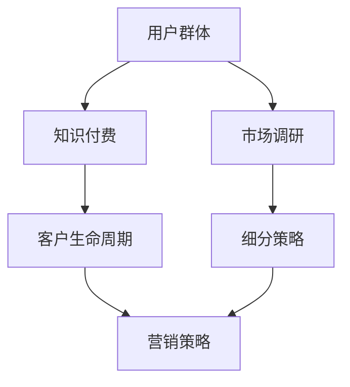

                 

# 知识付费创业的用户群体细分策略

> 关键词：知识付费, 用户群体, 细分策略, 商业模型, 市场调研, 用户体验, 客户生命周期, 营销策略

## 1. 背景介绍

### 1.1 问题由来
知识付费这一新兴商业模式在过去几年内快速发展，成为内容消费市场的重要组成部分。知识付费平台，如得到、喜马拉雅、慕课网等，通过提供高质量的课程、音频、文章等内容，满足了用户快速获取知识、提升自我能力的需求。但同时，随着市场竞争的加剧，平台之间的用户获取和留存问题也变得越来越突出。如何更精准地定位目标用户群体，提升用户转化率和留存率，成为了知识付费创业者必须面对的挑战。

### 1.2 问题核心关键点
用户在知识付费平台上消费行为的影响因素复杂多样，包括内容质量、用户体验、营销渠道、价格策略等。但用户群体细分是其中的关键点，通过将用户群体细分为不同类型，并针对性地制定营销、产品改进策略，可以有效提升平台的运营效率和用户满意度。

## 2. 核心概念与联系

### 2.1 核心概念概述

为更好地理解知识付费创业的用户群体细分策略，本节将介绍几个关键概念：

- **用户群体(User Segmentation)**：根据用户行为、需求、人口统计特征等标准将用户划分为不同的群体，以便更精准地制定营销策略和产品改进措施。
- **知识付费(Knowledge Paywall)**：用户需要支付一定费用才能获取平台提供的内容。这种商业模式依赖于高品质的内容和服务，以及用户的付费意愿。
- **细分策略(Segmentation Strategy)**：在市场调研的基础上，根据用户特征、需求、行为等标准，将用户划分为不同群体，并针对性地制定营销策略。
- **客户生命周期(Customer Lifecycle)**：描述用户从潜在客户到流失客户的过程，包括意识、考虑、购买、使用和流失等不同阶段。

这些概念之间的逻辑关系可以通过以下Mermaid流程图来展示：



这个流程图展示了几大核心概念及其之间的关系：

1. 用户群体通过市场调研确定，用于指导知识付费平台的商业模式设计。
2. 知识付费是用户付费获取内容的过程，依赖于平台的盈利模式和用户体验。
3. 细分策略根据用户特征进行用户群体划分，制定针对性营销策略。
4. 客户生命周期描述用户的行为变化，帮助平台优化产品和服务，提升用户留存率。

这些概念共同构成了知识付费平台用户群体细分策略的框架，使其能够针对不同用户群体制定有效的运营和营销措施。

## 3. 核心算法原理 & 具体操作步骤
### 3.1 算法原理概述

用户群体细分的核心是利用市场调研数据，通过聚类分析等统计方法，将用户分为不同群体。常见的聚类算法包括K-Means、层次聚类、DBSCAN等。然后针对每个群体，分析其特征，制定相应的营销策略。

知识付费平台的用户群体细分算法流程一般包括：

1. **数据收集**：收集用户的注册信息、行为数据、购买数据等。
2. **特征提取**：从收集的数据中提取用户的关键特征，如年龄、性别、职业、购买频率、消费金额等。
3. **聚类分析**：使用聚类算法将用户划分为不同的群体。
4. **群体分析**：分析每个群体的特征，找出不同群体之间的差异。
5. **策略制定**：针对每个群体制定针对性的营销和产品改进策略。

### 3.2 算法步骤详解

以K-Means聚类算法为例，用户群体细分的具体操作步骤如下：

**Step 1: 数据准备**
- 收集用户的注册信息、行为数据、购买数据等。
- 对数据进行清洗和预处理，如去除噪声、处理缺失值等。

**Step 2: 特征提取**
- 根据用户行为和消费数据，提取用户的关键特征。如年龄、性别、职业、购买频率、消费金额等。
- 将特征数据标准化，如使用Z-score标准化方法。

**Step 3: 聚类分析**
- 使用K-Means算法对用户进行聚类。首先设定聚类数$K$，然后计算每个样本到质心的距离，将其划分到最近的聚类中。
- 不断迭代调整聚类中心，直到聚类结果收敛。

**Step 4: 群体分析**
- 分析每个群体的特征，找出不同群体之间的差异。
- 根据分析结果，选择代表性特征作为群体的标识。

**Step 5: 策略制定**
- 针对每个群体，制定针对性的营销和产品改进策略。如针对高消费群体的优惠策略，针对新用户的引导策略等。
- 通过A/B测试等方法，验证不同策略的效果。

### 3.3 算法优缺点

用户群体细分算法具有以下优点：
1. 提高用户转化率和留存率。通过精准营销，提高用户满意度，提升用户粘性。
2. 优化产品和服务。针对不同用户群体，改进产品功能和用户体验，满足用户需求。
3. 降低运营成本。通过精细化运营，降低平台的营销成本和运营成本。

同时，该算法也存在一些局限性：
1. 依赖数据质量。聚类结果的准确性依赖于数据的完整性和代表性，数据质量差可能导致聚类不准确。
2. 聚类数选择困难。K-Means需要预先设定聚类数$K$，但选择不当可能导致聚类效果不佳。
3. 计算复杂度高。特别是对于大规模数据集，K-Means的计算复杂度较高。
4. 特征选择困难。选择不合适的特征可能导致聚类效果不佳。

尽管存在这些局限性，但用户群体细分算法仍然是知识付费创业中不可或缺的工具，特别是在市场调研数据可得的情况下。

### 3.4 算法应用领域

用户群体细分算法在知识付费平台中的应用主要包括以下几个方面：

- **内容推荐**：根据用户群体的兴趣和行为，推荐适合的内容，提升用户满意度和活跃度。
- **营销策略**：针对不同用户群体制定不同的营销策略，提高转化率和用户留存率。
- **产品改进**：通过分析用户群体特征，改进产品功能和用户体验，满足用户需求。
- **用户流失预测**：预测用户流失风险，提前采取措施，提升用户留存率。
- **用户细分分析**：分析用户群体特征，识别高价值用户群体，进行重点营销。

除了以上应用外，用户群体细分算法还广泛应用于社交媒体、电商、金融等行业，成为企业精细化运营的重要工具。

## 4. 数学模型和公式 & 详细讲解 & 举例说明
### 4.1 数学模型构建

本节将使用数学语言对用户群体细分算法进行更加严格的刻画。

记用户群体数据集为 $D=\{(x_i,y_i)\}_{i=1}^N$，其中 $x_i$ 为特征向量，$y_i$ 为标签（如年龄、性别、职业等）。假设用户群体总数为 $K$，则用户群体细分的目标是最小化误差函数：

$$
\min_{C_1,\cdots,C_K}\sum_{i=1}^N\sum_{j=1}^K(y_{i,j}-C_j)^2
$$

其中 $C_j$ 为聚类中心，$y_{i,j}=1$ 表示用户 $i$ 属于第 $j$ 个聚类。

### 4.2 公式推导过程

以下是K-Means算法的详细推导过程。

**Step 1: 初始化聚类中心**
- 随机选取 $K$ 个初始聚类中心 $C_{k,i}$，其中 $k=1,\cdots,K$。

**Step 2: 分配每个数据点到最近的聚类中心**
- 对于每个数据点 $x_i$，计算其到每个聚类中心的距离，将其分配到距离最近的聚类 $C_j$。

**Step 3: 更新聚类中心**
- 对于每个聚类 $C_j$，计算其中所有数据点的均值，作为新的聚类中心 $C_{j,i}$。

**Step 4: 重复迭代**
- 不断迭代更新聚类中心，直到聚类结果收敛。

**Step 5: 评估聚类效果**
- 使用轮廓系数（Silhouette Coefficient）评估聚类效果。轮廓系数越大，聚类效果越好。

### 4.3 案例分析与讲解

以一个简单的用户行为数据集为例，进行K-Means聚类的计算。

假设数据集 $D$ 包含 100 个用户的购买数据，特征为购买金额和时间。使用K-Means算法将其分为 3 个群体。

- **初始聚类中心**：随机选取 3 个点作为初始聚类中心。
- **分配每个数据点到最近的聚类中心**：计算每个数据点到每个聚类中心的距离，分配到距离最近的聚类。
- **更新聚类中心**：计算每个聚类中所有数据点的均值，作为新的聚类中心。
- **重复迭代**：不断重复以上步骤，直到聚类结果收敛。
- **评估聚类效果**：计算每个用户的轮廓系数，评估聚类效果。

通过上述过程，可以得到用户群体的聚类结果，并进一步分析各群体的特征，制定针对性的营销策略。

## 5. 项目实践：代码实例和详细解释说明
### 5.1 开发环境搭建

在进行用户群体细分实践前，我们需要准备好开发环境。以下是使用Python进行K-Means聚类算法的开发环境配置流程：

1. 安装Anaconda：从官网下载并安装Anaconda，用于创建独立的Python环境。

2. 创建并激活虚拟环境：
```bash
conda create -n cluster-env python=3.8 
conda activate cluster-env
```

3. 安装必要的库：
```bash
conda install numpy pandas scikit-learn matplotlib tqdm jupyter notebook ipython
```

4. 安装K-Means库：
```bash
pip install scikit-learn
```

完成上述步骤后，即可在`cluster-env`环境中开始聚类实践。

### 5.2 源代码详细实现

下面给出使用K-Means算法进行用户群体细分的PyTorch代码实现：

```python
from sklearn.cluster import KMeans
import pandas as pd
import numpy as np

# 读取用户数据
data = pd.read_csv('user_data.csv')

# 选择关键特征
features = ['purchase_amount', 'purchase_time']

# 数据标准化
data[features] = (data[features] - np.mean(data[features])) / np.std(data[features])

# 进行聚类
kmeans = KMeans(n_clusters=3, random_state=0).fit(data[features])
labels = kmeans.labels_

# 输出聚类结果
print(labels)
```

### 5.3 代码解读与分析

让我们再详细解读一下关键代码的实现细节：

**KMeans类**：
- `KMeans`类提供了K-Means聚类算法的实现。
- `n_clusters`参数：指定聚类数目。
- `random_state`参数：设置随机种子，保证实验可重复性。

**数据处理**：
- `data.read_csv`方法：从CSV文件中读取用户数据。
- `data[features]`：选择关键特征进行聚类。
- `np.mean`和`np.std`方法：计算特征的均值和标准差。
- `(data[features] - np.mean(data[features])) / np.std(data[features])`：将特征数据标准化。

**聚类过程**：
- `kmeans.fit(data[features])`：对特征数据进行聚类。
- `kmeans.labels_`：输出每个数据点的聚类标签。

**聚类结果**：
- 最后输出每个数据点的聚类标签，进行聚类效果的评估。

通过上述代码实现，可以方便地进行K-Means聚类，获取用户群体的聚类结果。

## 6. 实际应用场景
### 6.1 智能推荐系统

用户群体细分在智能推荐系统中的应用非常广泛。通过分析用户群体的兴趣和行为，推荐系统可以向用户推荐更加精准的内容，提高用户满意度和平台活跃度。

在技术实现上，可以收集用户的浏览、点击、购买等行为数据，通过聚类算法将其分为不同群体。针对不同群体，设计不同的推荐策略，如对高消费群体推荐高价值内容，对新用户推荐基础课程等。通过不断优化推荐算法，可以显著提升用户的转化率和留存率。

### 6.2 个性化营销

用户群体细分还可以应用于个性化营销中。通过分析用户的特征和行为，识别出不同群体的需求和偏好，有针对性地设计营销活动，提升营销效果。

例如，对于高消费群体，可以设计高价值的优惠活动，如折扣、会员专属服务等。对于新用户，可以设计引导注册和购买的活动，如免费试用、新用户福利等。通过精细化的营销策略，可以大幅提升用户的转化率和用户粘性。

### 6.3 客户流失预测

用户群体细分还可以用于客户流失预测。通过分析用户的行为数据，识别出高流失风险的群体，提前采取措施，降低流失率。

例如，对于长时间未登录的用户，可以设计登录提醒和奖励活动，吸引其回流。对于购买频率低且消费金额少的用户，可以设计优惠活动，提升其消费频次和消费金额。通过个性化的干预措施，可以有效提升用户的留存率。

### 6.4 未来应用展望

随着用户群体细分技术的不断发展，其在知识付费平台中的应用前景将更加广阔。未来，随着数据技术和算法算法的不断进步，用户群体细分将能够更加精准地识别出用户需求，提升平台的运营效率和用户满意度。

例如，未来可以结合深度学习、强化学习等先进技术，提升聚类算法的精度和效果。同时，通过引入更多先验知识，如用户画像、行为数据等，提升用户群体的细分效果。

## 7. 工具和资源推荐
### 7.1 学习资源推荐

为了帮助开发者系统掌握用户群体细分理论基础和实践技巧，这里推荐一些优质的学习资源：

1. 《数据挖掘导论》（Introduction to Data Mining）书籍：详细介绍数据挖掘的各个概念和技术，包括聚类算法和用户群体细分的应用。

2. Coursera《机器学习》课程：斯坦福大学开设的机器学习课程，涵盖聚类算法和用户群体细分的基本概念和实践。

3. Kaggle竞赛：参加Kaggle上的聚类和用户群体细分竞赛，通过实际数据集进行练习，积累实战经验。

4. DataCamp：提供一系列关于数据挖掘和聚类算法的在线课程，帮助开发者系统学习。

通过对这些资源的学习实践，相信你一定能够快速掌握用户群体细分的精髓，并用于解决实际的业务问题。

### 7.2 开发工具推荐

高效的开发离不开优秀的工具支持。以下是几款用于用户群体细分开发的常用工具：

1. Python：作为数据科学和机器学习的核心语言，Python提供了丰富的库和工具，如Pandas、NumPy、Scikit-Learn等，方便数据处理和聚类分析。

2. Jupyter Notebook：提供交互式的开发环境，方便调试和可视化数据处理和分析过程。

3. TensorFlow：由Google主导开发的开源机器学习框架，支持大规模深度学习模型的训练和优化。

4. Kaggle：提供丰富的数据集和工具，方便数据探索和建模。

合理利用这些工具，可以显著提升用户群体细分的开发效率，加快创新迭代的步伐。

### 7.3 相关论文推荐

用户群体细分技术的发展源于学界的持续研究。以下是几篇奠基性的相关论文，推荐阅读：

1. "A Density-Based Algorithm for Discovering Clusters in Large Spatial Databases with Noise"：DBSCAN算法的经典论文，提出了基于密度的聚类算法。

2. "K-Means: Algorithms and Applications"：K-Means算法的经典论文，详细介绍了K-Means算法的原理和应用。

3. "Customer Segmentation: Conceptual Framework and Application"：用户群体细分的经典论文，提出了用户群体细分的概念和应用。

4. "Segmentation of Potential Customers for Insurance Sales"：用户群体细分的实际应用案例，展示了如何通过用户群体细分提升保险销售效果。

这些论文代表了大规模用户群体细分的理论和技术发展脉络，通过学习这些前沿成果，可以帮助研究者把握学科前进方向，激发更多的创新灵感。

## 8. 总结：未来发展趋势与挑战
### 8.1 研究成果总结

用户群体细分技术在知识付费创业中扮演着重要角色，通过精准营销和产品改进，提升用户转化率和留存率，优化平台运营效率。近年来，该技术得到了广泛的应用，并在多个实际场景中取得了显著的效果。

### 8.2 未来发展趋势

展望未来，用户群体细分技术将呈现以下几个发展趋势：

1. 数据融合技术的发展：随着大数据技术的进步，更多的数据源和先验知识可以整合到用户群体细分的模型中，提升聚类效果。

2. 深度学习在聚类中的应用：深度学习算法在图像、语音等领域取得了巨大成功，未来将逐步引入到用户群体细分的算法中，提升聚类效果。

3. 实时聚类算法：面对海量用户数据的实时处理需求，未来将出现更加高效的实时聚类算法，满足实时数据处理的需要。

4. 用户群体细分工具的集成：用户群体细分技术将与其他AI技术，如自然语言处理、推荐系统等集成，形成更加完善的AI技术体系。

### 8.3 面临的挑战

尽管用户群体细分技术已经取得了一定的进展，但在应用过程中仍然面临一些挑战：

1. 数据隐私和伦理问题：用户群体细分需要大量用户数据，如何保护用户隐私和数据安全是一个重要问题。

2. 算法复杂度问题：用户群体细分算法计算复杂度较高，如何在保持聚类效果的同时降低计算成本是一个重要挑战。

3. 数据质量问题：聚类效果依赖于数据的质量和代表性，如何提高数据质量是一个重要问题。

4. 聚类算法选择问题：不同的聚类算法适用于不同的场景，如何选择合适的聚类算法是一个重要挑战。

尽管存在这些挑战，但用户群体细分技术仍然是知识付费创业中不可或缺的工具，特别是在市场调研数据可得的情况下。

### 8.4 研究展望

面对用户群体细分面临的挑战，未来的研究需要在以下几个方面寻求新的突破：

1. 结合深度学习和大数据技术，提升聚类算法的精度和效果。

2. 引入更多先验知识，如用户画像、行为数据等，提升用户群体的细分效果。

3. 开发更加高效的实时聚类算法，满足实时数据处理的需要。

4. 引入隐私保护技术，保护用户隐私和数据安全。

这些研究方向的探索，必将引领用户群体细分技术迈向更高的台阶，为知识付费创业提供更加精准、高效的运营支持。面向未来，用户群体细分技术还需要与其他人工智能技术进行更深入的融合，共同推动知识付费平台的进步。

## 9. 附录：常见问题与解答

**Q1：用户群体细分需要多少用户数据？**

A: 用户群体细分的数据量需求取决于应用场景和聚类算法。通常来说，用户群体细分需要至少几百个用户的数据才能获得较为准确的聚类结果。数据量越大，聚类效果越好。

**Q2：用户群体细分有哪些聚类算法可选？**

A: 常见的聚类算法包括K-Means、层次聚类、DBSCAN、GMM等。不同的算法适用于不同的数据分布和聚类效果需求，需要根据实际情况进行选择。

**Q3：用户群体细分的效果如何评估？**

A: 用户群体细分的聚类效果可以通过轮廓系数（Silhouette Coefficient）和Calinski-Harabasz指数等指标进行评估。轮廓系数越大，聚类效果越好。

**Q4：如何保护用户数据隐私？**

A: 在用户群体细分过程中，需要采取数据加密、数据匿名化等措施保护用户数据隐私。同时，需要在法律框架下进行合规性审查，确保数据使用的合法性。

**Q5：如何优化用户群体细分算法的计算效率？**

A: 可以通过数据预处理、模型优化、并行计算等手段优化聚类算法的计算效率。同时，可以引入分布式计算框架，如Hadoop、Spark等，提高聚类算法的处理能力。

这些回答可以帮助你更好地理解用户群体细分算法的基本原理和应用场景，进一步优化知识付费创业中的运营策略，提升用户满意度和平台价值。通过不断优化和创新，相信知识付费平台能够更好地满足用户需求，实现可持续的商业成功。

---

作者：禅与计算机程序设计艺术 / Zen and the Art of Computer Programming

