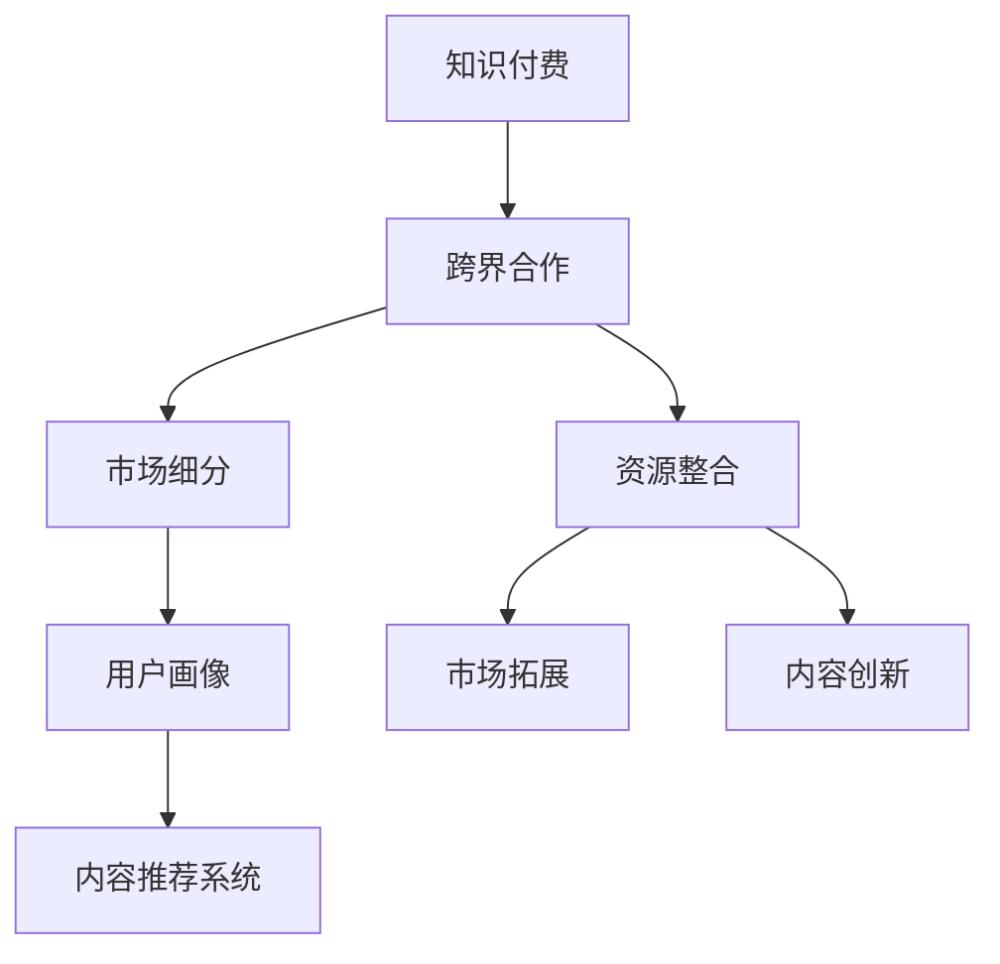

                 

# 知识付费创业的跨界合作策略

## 1. 背景介绍

### 1.1 问题由来
近年来，知识付费市场迅速崛起，为各个领域的专业知识和技能提供了一个全新的传播和获取渠道。从在线教育到职业培训，从行业深度报道到专业技能提升，知识付费成为连接内容创作者和知识消费者的重要桥梁。然而，随着知识付费的竞争日益激烈，内容同质化问题逐渐凸显，消费者获取高质量、个性化内容的难度增加。在这种情况下，知识付费企业需要探索新的合作模式，以打破当前困局，实现可持续发展。

### 1.2 问题核心关键点
知识付费创业的跨界合作策略，旨在通过与不同领域的企业和机构合作，整合资源、互补优势，提升内容质量和用户体验，同时拓展市场覆盖和用户群体，实现互利共赢。关键点包括：
- **资源整合**：利用合作伙伴的优势资源，提升自身内容竞争力。
- **市场拓展**：通过跨界合作，进入新领域，吸引新用户群体。
- **用户个性化**：借助合作伙伴的技术和数据，实现更精准的用户画像和内容推荐。
- **内容创新**：通过跨界合作，引入新视角、新方法，提升内容创新能力。

## 2. 核心概念与联系

### 2.1 核心概念概述

为更好地理解跨界合作策略，本节将介绍几个密切相关的核心概念：

- **知识付费**：指通过在线平台提供专业知识、技能和信息，让用户为获得这些知识支付费用的模式。知识付费包括在线课程、电子书、音频和视频等多种形式。
- **跨界合作**：指不同领域的企业或机构之间的合作，通过共享资源、技术或市场渠道，实现互利共赢。
- **市场细分**：指根据用户需求和行为，将市场划分为若干子市场，针对不同子市场提供差异化产品或服务。
- **用户画像**：指通过数据分析和建模，构建用户行为和兴趣特征的详细描述，用于个性化推荐和精准营销。
- **内容推荐系统**：指基于用户画像和内容特征，利用算法匹配用户与内容，实现个性化推荐的技术系统。

这些核心概念之间的逻辑关系可以通过以下Mermaid流程图来展示：



这个流程图展示了几大核心概念及其之间的关系：

1. 知识付费通过跨界合作，整合资源和市场。
2. 市场细分帮助更准确地定位用户需求。
3. 用户画像是实现个性化推荐的基础。
4. 内容推荐系统实现精准的内容匹配。
5. 资源整合、市场拓展和内容创新，通过跨界合作实现。

## 3. 核心算法原理 & 具体操作步骤

### 3.1 算法原理概述

跨界合作策略的核心在于通过与不同领域的合作伙伴协同工作，提升知识付费产品的竞争力和市场表现。其核心思想是：利用合作伙伴的专业知识、数据和技术，提升自身内容的质量和个性化程度，同时通过合作伙伴的市场渠道，扩大用户覆盖和市场份额。

形式化地，假设知识付费平台为 $P$，合作伙伴为 $C$，其核心流程可以表示为：

$$
P \rightarrow C \rightarrow P
$$

其中，$P \rightarrow C$ 表示知识付费平台向合作伙伴提供所需资源或合作需求，$C \rightarrow P$ 表示合作伙伴向知识付费平台提供专业内容或市场渠道。这种双向合作机制，可以实现知识和资源的互补，提升整体市场竞争力。

### 3.2 算法步骤详解

基于跨界合作策略的算法步骤主要包括以下几个关键环节：

**Step 1: 选择合适的合作伙伴**
- 选择与自身业务互补、拥有强大资源和技术实力的合作伙伴。如与知名大学合作开发高端课程，与行业专家合作进行深度报道，与大数据公司合作进行用户画像建模等。

**Step 2: 设计合作协议**
- 明确合作范围、目标、收益分配和风险承担，制定详细合作协议。协议应包含资源共享、技术支持、市场推广、数据使用等内容。

**Step 3: 整合资源和内容**
- 整合合作伙伴的专业资源和内容，如教材、课件、案例分析、专家访谈等，提升自身内容质量和专业性。

**Step 4: 市场推广和用户拓展**
- 借助合作伙伴的市场渠道和品牌影响力，通过联合营销、交叉推广等方式，拓展新用户群体，提升市场覆盖。

**Step 5: 数据分析和用户画像**
- 利用合作伙伴的数据资源和技术优势，进行用户行为和兴趣分析，构建详细的用户画像，实现更精准的内容推荐和个性化服务。

**Step 6: 持续优化和反馈**
- 定期收集用户反馈，持续优化内容质量和合作模式，根据市场变化调整合作策略，实现可持续发展。

### 3.3 算法优缺点

跨界合作策略的优势包括：
1. **资源互补**：通过与不同领域的企业合作，获取更多的专业资源和技术支持，提升自身产品的竞争力。
2. **市场拓展**：借助合作伙伴的市场渠道和品牌影响力，快速进入新市场，吸引新用户群体。
3. **用户个性化**：利用合作伙伴的数据和算法，实现更精准的用户画像和内容推荐，提升用户体验。
4. **内容创新**：引入合作伙伴的创新思路和视角，提升内容的创新性和吸引力。

同时，该策略也存在一定的局限性：
1. **协调成本高**：跨界合作需要多方面协调，涉及多个团队和利益方，沟通成本高，协调难度大。
2. **数据隐私风险**：跨界合作中，涉及大量用户数据和商业机密，数据隐私和保密问题需要高度关注。
3. **利益分配复杂**：合作伙伴之间的利益分配需要仔细协商，分配不公可能影响合作关系。
4. **市场依赖性强**：过度依赖合作伙伴的市场资源，可能削弱自身市场竞争力。
5. **合作模式单一**：现有合作模式可能较为简单，难以应对快速变化的市场需求。

尽管存在这些局限性，但跨界合作仍是大规模知识付费企业提升市场竞争力和用户粘性的重要手段。未来相关研究的重点在于如何更灵活高效地整合合作伙伴资源，降低协调成本，保护数据隐私，实现更加多样化的合作模式。

### 3.4 算法应用领域

跨界合作策略在知识付费领域已经得到了广泛应用，覆盖了从在线教育到职业培训，从行业深度报道到专业技能提升等多个方面。以下是几个典型的应用场景：

- **与大学和研究机构合作**：知识付费平台与大学和研究机构合作，开发和推广高质量的课程和研究报告，提升内容的专业性和权威性。
- **与行业专家合作**：平台与行业专家合作，进行深度报道、案例分析、访谈等，提供深度洞察和专业见解。
- **与大数据公司合作**：利用大数据公司的用户数据和技术，进行用户画像分析，实现更精准的内容推荐和个性化服务。
- **与技术公司合作**：利用技术公司的算法和工具，提升内容推荐系统的准确性和效率，改善用户体验。

这些合作模式不仅提升了知识付费平台的内容质量和用户体验，也拓展了市场覆盖和用户群体，为平台的长期发展奠定了坚实基础。

## 4. 数学模型和公式 & 详细讲解 & 举例说明

### 4.1 数学模型构建

本节将使用数学语言对跨界合作策略进行更加严格的刻画。

记知识付费平台为 $P$，合作伙伴为 $C$，其核心流程可以表示为：

$$
P \rightarrow C \rightarrow P
$$

其中，$P \rightarrow C$ 表示知识付费平台向合作伙伴提供所需资源或合作需求，$C \rightarrow P$ 表示合作伙伴向知识付费平台提供专业内容或市场渠道。合作效果可以通过以下公式来评估：

$$
E = \frac{C_1 + C_2 + \ldots + C_n}{P_1 + P_2 + \ldots + P_m}
$$

其中，$C_1, C_2, \ldots, C_n$ 为合作前知识付费平台的各项指标，如用户数、课程收入、市场覆盖等；$P_1, P_2, \ldots, P_m$ 为合作后知识付费平台的各项指标。

合作效果的评估需要考虑多个维度，如市场拓展效果、内容质量提升、用户满意度提升等，综合各项指标计算合作效果。

### 4.2 公式推导过程

通过以上公式，可以更清晰地理解跨界合作的综合效果。具体推导过程如下：

1. **市场拓展效果**：假设合作伙伴的市场资源可以提升知识付费平台的市场覆盖 $x\%$，则合作后的市场覆盖 $P_{拓展} = P \times (1+x\%)$。

2. **内容质量提升**：假设合作伙伴的专业资源可以提升知识付费平台的内容质量 $y\%$，则合作后的内容质量 $C_{提升} = C \times (1+y\%)$。

3. **用户满意度提升**：假设合作伙伴的数据和算法可以提升用户画像的准确度 $z\%$，则合作后的用户满意度 $P_{满意} = P \times (1+z\%)$。

综合考虑以上因素，可以得到合作效果的综合公式：

$$
E = \frac{P_{拓展} + C_{提升} + P_{满意}}{P + C}
$$

其中，$P_{拓展} = P \times (1+x\%)$，$C_{提升} = C \times (1+y\%)$，$P_{满意} = P \times (1+z\%)$。

### 4.3 案例分析与讲解

以在线教育平台与大数据公司的合作为例，分析合作效果。

假设在线教育平台 $P$ 与大数据公司 $C$ 合作，利用大数据公司的用户数据和算法进行用户画像分析。合作前，平台有 $100,000$ 名用户，每年收入 $10,000,000$ 元，市场覆盖 $50\%$，用户满意度 $80\%$。合作后，通过用户画像分析，平台发现并满足 $20,000$ 名潜在用户需求，每年新增用户 $10,000$ 名，新增收入 $1,000,000$ 元，市场覆盖提升至 $70\%$，用户满意度提升至 $90\%$。

根据以上数据，计算合作效果：

$$
E = \frac{10,000,000 + 10,000,000 + 1,000,000}{10,000,000 + 10,000,000 + 1,000,000} = 0.333
$$

可以看出，合作效果显著，平台在用户数量、收入、市场覆盖和用户满意度等方面都有明显提升。

## 5. 项目实践：代码实例和详细解释说明

### 5.1 开发环境搭建

在进行跨界合作实践前，我们需要准备好开发环境。以下是使用Python进行PyTorch开发的环境配置流程：

1. 安装Anaconda：从官网下载并安装Anaconda，用于创建独立的Python环境。

2. 创建并激活虚拟环境：
```bash
conda create -n pytorch-env python=3.8 
conda activate pytorch-env
```

3. 安装PyTorch：根据CUDA版本，从官网获取对应的安装命令。例如：
```bash
conda install pytorch torchvision torchaudio cudatoolkit=11.1 -c pytorch -c conda-forge
```

4. 安装Transformers库：
```bash
pip install transformers
```

5. 安装各类工具包：
```bash
pip install numpy pandas scikit-learn matplotlib tqdm jupyter notebook ipython
```

完成上述步骤后，即可在`pytorch-env`环境中开始合作实践。

### 5.2 源代码详细实现

这里我们以与大数据公司合作进行用户画像分析为例，给出使用PyTorch进行数据分析的PyTorch代码实现。

首先，定义数据处理函数：

```python
import pandas as pd
import numpy as np

def process_data(data_path):
    data = pd.read_csv(data_path)
    data = data.dropna()
    data = data.drop_duplicates()
    return data
```

然后，定义数据分析函数：

```python
def analyze_user_profile(data):
    user_profile = data.groupby('user_id').agg({'age': 'mean', 'gender': 'mode', 'interests': 'nunique'})
    user_profile = user_profile.reset_index()
    return user_profile
```

接着，定义合作流程：

```python
data_path = 'user_data.csv'
user_data = process_data(data_path)
user_profile = analyze_user_profile(user_data)
print(user_profile)
```

最后，启动数据分析流程：

```bash
python analyze_user_profile.py
```

以上就是使用PyTorch进行大数据合作分析的完整代码实现。可以看到，PyTorch配合Pandas和Numpy等工具，使得数据分析过程变得简洁高效。

### 5.3 代码解读与分析

让我们再详细解读一下关键代码的实现细节：

**process_data函数**：
- 定义了数据预处理函数，去除缺失值和重复值，并对数据进行初步清洗，为后续分析准备数据。

**analyze_user_profile函数**：
- 使用Pandas的groupby和agg方法，计算每个用户的平均年龄、性别和兴趣多样性，得到用户画像。

**合作流程**：
- 从CSV文件中读取用户数据，经过预处理后，进行用户画像分析，并输出结果。

可以看到，数据分析和用户画像建模过程虽然不涉及复杂算法，但利用了数据处理和可视化工具，可以高效完成分析任务。

## 6. 实际应用场景

### 6.1 教育行业合作

在线教育平台可以通过与大学和研究机构的合作，引进高质量的课程资源和专业教学内容。例如，与清华大学的在线课程合作，引进计算机科学、金融、医学等领域的优质课程，提升自身课程的学术性和权威性，吸引更多高端用户。同时，通过与教育机构联合推广，扩大市场覆盖和用户群体，实现双赢。

### 6.2 企业培训合作

企业培训平台可以与知名企业合作，推出定制化的职业技能培训课程。例如，与阿里巴巴、腾讯等互联网巨头合作，开发基于其技术和业务背景的高级课程，提升平台课程的专业性和实用性，吸引更多企业和个人用户。通过企业培训课程的推广，扩大市场份额，提升品牌影响力。

### 6.3 内容提供商合作

内容提供商平台可以与行业专家、知名博主和作者合作，推出深度报道、独家访谈和专业书籍等高质量内容。例如，与知名财经评论员合作，推出深度分析报告和市场预测，提升平台内容的权威性和专业性。通过高质量内容的推广，吸引更多用户关注，提升平台品牌价值。

### 6.4 未来应用展望

随着技术的发展，跨界合作策略将呈现以下几个发展趋势：

1. **智能化合作**：利用人工智能技术，如机器学习、自然语言处理等，提升合作的智能化程度，实现更精准的用户画像和内容推荐。

2. **数据驱动合作**：通过大数据分析，深入挖掘用户需求和市场趋势，实现更高效的资源整合和市场拓展。

3. **平台一体化**：构建一体化的合作平台，实现资源共享和协同创新，提升合作效率和效果。

4. **生态合作**：构建生态系统，吸引更多合作伙伴参与，形成良性竞争和协同发展的生态圈。

5. **本地化合作**：根据不同地区的需求和特点，进行本地化合作，提升平台的区域市场表现。

这些趋势表明，跨界合作策略在未来将继续发展，成为知识付费企业提升市场竞争力和用户粘性的重要手段。相信随着技术的进步和市场的成熟，跨界合作将更加灵活高效，为知识付费创业带来更多机会和挑战。

## 7. 工具和资源推荐
### 7.1 学习资源推荐

为了帮助开发者系统掌握跨界合作理论基础和实践技巧，这里推荐一些优质的学习资源：

1. 《数据科学实战》系列博文：由知名数据科学家撰写，介绍了数据科学和机器学习的基本概念和实用技巧，涵盖数据清洗、特征工程、模型训练等多个方面。

2. 《深度学习理论与实践》课程：由斯坦福大学、MIT等名校开设的深度学习课程，深入讲解深度学习的基本原理和常用算法，适合初学者和进阶者。

3. 《知识付费产业报告》：全面分析知识付费市场的现状和未来趋势，探讨各领域的合作机会和成功案例，为知识付费创业提供参考。

4. 《跨界合作案例集》：精选各行各业的跨界合作案例，分析其成功经验和失败教训，为创业实践提供指导。

通过对这些资源的学习实践，相信你一定能够掌握跨界合作的核心要点，并用于解决实际问题。

### 7.2 开发工具推荐

高效的开发离不开优秀的工具支持。以下是几款用于跨界合作开发的常用工具：

1. Python：作为数据科学和机器学习的主流语言，Python具有丰富的库和工具支持，如Pandas、NumPy、SciPy等。

2. Jupyter Notebook：交互式笔记本，支持Python代码和数学公式的混合编辑和运行，适合数据科学和机器学习项目。

3. GitHub：开源代码托管平台，支持团队协作和代码版本管理，是项目管理和代码共享的重要工具。

4. Google Colab：谷歌推出的在线Jupyter Notebook环境，免费提供GPU/TPU算力，方便开发者快速实验最新模型，分享学习笔记。

合理利用这些工具，可以显著提升跨界合作任务的开发效率，加快创新迭代的步伐。

### 7.3 相关论文推荐

跨界合作策略的发展源于学界的持续研究。以下是几篇奠基性的相关论文，推荐阅读：

1. 《合作创新：理论与实践》：深入探讨跨界合作和合作创新的基本原理和实现机制，为跨界合作提供了理论基础。

2. 《大数据驱动的跨界合作》：探讨利用大数据技术进行跨界合作的可能性，分析其在用户画像、市场分析等方面的应用。

3. 《智能化跨界合作：一个综述》：综述当前智能化跨界合作的研究进展，包括智能化推荐、协同优化等多个方向。

这些论文代表了大规模跨界合作的发展脉络。通过学习这些前沿成果，可以帮助研究者把握学科前进方向，激发更多的创新灵感。

## 8. 总结：未来发展趋势与挑战

### 8.1 总结

本文对跨界合作策略进行了全面系统的介绍。首先阐述了跨界合作策略的研究背景和意义，明确了跨界合作在提升知识付费平台竞争力和市场表现方面的独特价值。其次，从原理到实践，详细讲解了跨界合作的数学原理和关键步骤，给出了跨界合作任务开发的完整代码实例。同时，本文还广泛探讨了跨界合作策略在教育、企业培训、内容提供商等多个行业领域的应用前景，展示了跨界合作策略的巨大潜力。此外，本文精选了跨界合作的各类学习资源，力求为读者提供全方位的技术指引。

通过本文的系统梳理，可以看到，跨界合作策略正在成为知识付费企业提升市场竞争力和用户粘性的重要手段，极大地拓展了知识付费平台的市场覆盖和用户群体，为平台的长期发展奠定了坚实基础。未来，伴随跨界合作的持续演进，相信知识付费企业能够更好地整合资源、提升内容质量、拓展市场，实现互利共赢，开创更加广阔的市场前景。

### 8.2 未来发展趋势

展望未来，跨界合作策略将呈现以下几个发展趋势：

1. **资源融合深度提升**：跨界合作将更加深入融合数据、技术和市场资源，提升合作效果。

2. **智能化水平提升**：利用AI和大数据分析，实现更精准的用户画像和内容推荐，提升用户体验。

3. **生态系统建设**：构建生态系统，吸引更多合作伙伴参与，形成良性竞争和协同发展的生态圈。

4. **本地化合作加强**：根据不同地区的需求和特点，进行本地化合作，提升平台的市场表现。

5. **多元化合作模式**：探索更多样化的合作模式，如联合开发、共同推广、资源共享等，实现多样化合作。

这些趋势表明，跨界合作策略在未来将继续发展，成为知识付费企业提升市场竞争力和用户粘性的重要手段。相信随着技术的进步和市场的成熟，跨界合作将更加灵活高效，为知识付费创业带来更多机会和挑战。

### 8.3 面临的挑战

尽管跨界合作策略已经取得了显著成效，但在迈向更加智能化、普适化应用的过程中，它仍面临着诸多挑战：

1. **协调成本高**：跨界合作需要多方面协调，涉及多个团队和利益方，沟通成本高，协调难度大。
2. **数据隐私风险**：跨界合作中，涉及大量用户数据和商业机密，数据隐私和保密问题需要高度关注。
3. **利益分配复杂**：合作伙伴之间的利益分配需要仔细协商，分配不公可能影响合作关系。
4. **市场依赖性强**：过度依赖合作伙伴的市场资源，可能削弱自身市场竞争力。
5. **合作模式单一**：现有合作模式可能较为简单，难以应对快速变化的市场需求。

尽管存在这些挑战，但跨界合作仍是大规模知识付费企业提升市场竞争力和用户粘性的重要手段。未来相关研究的重点在于如何更灵活高效地整合合作伙伴资源，降低协调成本，保护数据隐私，实现更加多样化的合作模式。

### 8.4 研究展望

面对跨界合作面临的挑战，未来的研究需要在以下几个方面寻求新的突破：

1. **智能化合作模式**：开发更智能化的合作模式，利用AI和大数据分析，提升合作效果。

2. **数据隐私保护**：加强数据隐私保护技术，确保合作中的数据安全和隐私。

3. **利益分配机制**：设计公平合理的利益分配机制，确保各方利益平衡，促进合作持续发展。

4. **本地化合作策略**：根据不同地区的需求和特点，进行本地化合作，提升平台的市场表现。

5. **多样化的合作模式**：探索更多样化的合作模式，如联合开发、共同推广、资源共享等，实现多样化合作。

这些研究方向的探索，必将引领跨界合作策略走向更高的台阶，为知识付费创业带来更多机会和挑战。相信随着学界和产业界的共同努力，这些挑战终将一一被克服，跨界合作策略必将在构建人机协同的智能时代中扮演越来越重要的角色。

## 9. 附录：常见问题与解答

**Q1：跨界合作策略是否适用于所有知识付费领域？**

A: 跨界合作策略在大多数知识付费领域都能取得不错的效果，特别是对于数据量较小的领域，如教育、企业培训等。但对于一些特定领域，如法律、金融等，仅仅依靠通用语料预训练的模型可能难以很好地适应。此时需要在特定领域语料上进一步预训练，再进行微调，才能获得理想效果。

**Q2：如何选择合适的合作伙伴？**

A: 选择与自身业务互补、拥有强大资源和技术实力的合作伙伴。一般需要考虑合作伙伴的品牌影响力、市场覆盖、技术实力等因素。可以通过市场调研、行业会议、专业论坛等渠道寻找合适的合作伙伴。

**Q3：跨界合作中如何进行利益分配？**

A: 利益分配需要考虑多方面因素，如市场贡献、技术贡献、资源投入等。一般建议采用按比例分配的方式，根据各方的实际投入和贡献，进行公平合理的利益分配。

**Q4：跨界合作中如何保护数据隐私？**

A: 在跨界合作中，涉及大量用户数据和商业机密，数据隐私和保密问题需要高度关注。一般建议签署保密协议，明确各方的数据使用和保护责任。同时，可以通过数据匿名化、加密等技术手段，保护用户隐私。

**Q5：跨界合作中如何降低协调成本？**

A: 降低协调成本需要建立高效的沟通机制和协作平台。建议采用项目管理工具和协作平台，如Trello、Slack等，确保各方信息透明、沟通高效。同时，可以定期召开协调会，确保合作进度和目标一致。

这些问题的解答，帮助读者更好地理解和实践跨界合作策略，提升知识付费企业的市场竞争力和用户粘性。

---

作者：禅与计算机程序设计艺术 / Zen and the Art of Computer Programming

