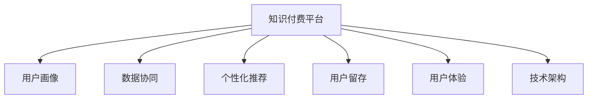

                 

# 知识付费如何实现跨平台整合营销？

> 关键词：知识付费, 跨平台整合, 营销策略, 数据分析, 个性化推荐, 用户留存, 用户体验, 技术架构

## 1. 背景介绍

随着互联网技术的发展和普及，知识付费已成为内容创作者和机构获取收益的重要方式之一。然而，知识付费平台普遍面临的一个问题是用户留存率低，新用户获取成本高。为了提高用户粘性和平台收益，许多平台开始尝试跨平台的整合营销策略，以实现资源的高效利用和用户价值最大化。

### 1.1 问题由来

知识付费行业内，各平台之间相对孤立，难以实现资源共享和用户互动。同时，单一平台的营销策略效果有限，用户迁移成本较高。如何实现跨平台整合营销，提升用户粘性，增加平台收益，成为了摆在各知识付费平台面前的重要课题。

### 1.2 问题核心关键点

跨平台整合营销的核心在于：

- **用户画像**：建立详尽、准确的用户画像，帮助平台了解用户需求，实现精准营销。
- **数据协同**：在各个平台之间实现数据共享和协同，提升营销策略的精确性和有效性。
- **用户体验**：在不同平台之间提供一致的用户体验，提高用户满意度和留存率。
- **技术架构**：采用先进的技术架构，确保跨平台整合营销的稳定性和可扩展性。

## 2. 核心概念与联系

### 2.1 核心概念概述

为更好地理解跨平台整合营销的实现原理，本节将介绍几个核心概念：

- **知识付费平台**：提供付费内容服务的平台，如得到、喜马拉雅、知乎live等。
- **用户画像**：通过数据分析和建模，形成的用户群体特征描述，用于指导营销策略。
- **数据协同**：在多个平台之间实现数据共享和联合分析，提升营销决策的科学性和针对性。
- **个性化推荐**：基于用户画像和行为数据，提供定制化的内容推荐，增强用户粘性。
- **用户留存**：通过各种策略，如专属优惠、内容推送、社区互动等，提高用户对平台的忠诚度和持续消费意愿。
- **用户体验**：在平台设计和服务提供上，注重用户的使用体验，确保一致性和易用性。
- **技术架构**：包括前后端技术、数据存储和管理、网络通信等方面，是跨平台整合营销实现的基础。

这些核心概念之间的逻辑关系可以通过以下Mermaid流程图来展示：



这个流程图展示了的跨平台整合营销的核心概念及其之间的关系：

1. 知识付费平台通过用户画像，了解用户需求。
2. 在各个平台之间实现数据协同，提升营销策略的精确性。
3. 基于用户画像和数据协同，实现个性化推荐，增强用户粘性。
4. 通过技术架构支持，提升用户体验，降低用户流失率。

## 3. 核心算法原理 & 具体操作步骤

### 3.1 算法原理概述

跨平台整合营销的算法原理主要是基于用户画像和数据协同，通过个性化推荐、专属优惠、专属内容等方式，提高用户留存率和平台收益。

具体而言，可以采用以下步骤：

1. **用户画像构建**：收集用户在各平台的活跃行为数据，包括浏览历史、购买记录、互动评论等，构建详尽的用户画像。
2. **数据协同分析**：在各平台之间共享用户画像和行为数据，进行联合分析，发现用户特征和行为规律。
3. **个性化推荐策略**：根据用户画像和行为数据，定制个性化的内容推荐，提升用户体验和满意度。
4. **专属优惠和内容**：根据用户特征和行为规律，设计专属优惠和专属内容，提高用户粘性和消费意愿。
5. **技术架构搭建**：采用分布式技术架构，确保数据存储、计算、传输的稳定性和高效性。

### 3.2 算法步骤详解

以下是对跨平台整合营销的具体操作步骤的详细介绍：

**Step 1: 用户画像构建**
- 数据收集：从各平台收集用户行为数据，包括但不限于浏览记录、购买记录、评价评论等。
- 数据预处理：清洗数据，去除重复、无效记录，填补缺失值。
- 特征工程：提取有用的特征，如用户兴趣、消费能力、活跃时间等。
- 模型训练：基于特征数据，训练用户画像模型，生成详尽的用户画像描述。

**Step 2: 数据协同分析**
- 数据联合：将各平台的用户数据进行联合，形成统一的用户画像库。
- 数据融合：对联合数据进行数据融合，生成更加全面、准确的用户画像。
- 分析挖掘：采用机器学习算法，挖掘用户特征和行为规律。
- 用户分群：根据挖掘结果，将用户分为不同的群体，进行精细化营销。

**Step 3: 个性化推荐策略**
- 推荐模型：基于用户画像和行为数据，训练个性化推荐模型，如协同过滤、内容推荐等。
- 推荐计算：在用户浏览、购买等行为发生时，实时计算推荐结果。
- 推荐展示：在各平台展示推荐内容，提升用户粘性。

**Step 4: 专属优惠和内容**
- 优惠设计：根据用户画像和行为数据，设计专属优惠，如优惠券、折扣价等。
- 专属内容：提供专属内容，如定制化文章、独家音频等，提高用户满意度。
- 活动策划：策划专属活动，如抽奖、打卡等，增加用户互动和平台粘性。

**Step 5: 技术架构搭建**
- 分布式存储：采用分布式存储技术，确保数据的高可用性和扩展性。
- 分布式计算：利用分布式计算技术，进行大数据分析和高频交易。
- 数据传输：采用高效的数据传输技术，确保数据同步和一致性。
- 实时分析：实现实时数据分析，支持高频交易和用户互动。

### 3.3 算法优缺点

跨平台整合营销的算法具有以下优点：

1. **资源利用高效**：通过数据协同，各平台可以共享用户画像和行为数据，实现资源的高效利用。
2. **用户体验一致**：通过个性化推荐和专属内容，提升用户在各平台的体验一致性和满意度。
3. **用户留存率高**：通过专属优惠和活动策划，提高用户粘性和留存率，增加平台收益。

同时，该算法也存在一定的局限性：

1. **数据隐私风险**：联合分析用户数据，可能引发数据隐私和安全问题。
2. **数据传输延时**：跨平台数据传输可能存在网络延时和数据丢失问题。
3. **模型训练复杂**：个性化推荐模型和专属优惠设计需要大量计算资源和复杂算法。
4. **用户粘性易疲劳**：频繁推送专属优惠和内容，可能引发用户疲劳和抵触。

尽管存在这些局限性，但就目前而言，跨平台整合营销仍是一种有效的用户留存和收益提升策略。未来相关研究的重点在于如何进一步降低数据协同和传输的成本，提高模型的效率和安全性，同时兼顾用户粘性和用户体验。

### 3.4 算法应用领域

跨平台整合营销已经在知识付费领域得到了广泛的应用，覆盖了各类个性化推荐、专属优惠、专属内容等多个方面，具体应用场景包括：

- **课程推荐**：根据用户的历史购买和浏览记录，推荐相关课程和文章，提高用户转化率和消费频次。
- **专属内容**：提供专属音频、视频、文章等高质量内容，满足用户个性化需求。
- **用户专属优惠**：根据用户画像，设计专属优惠券和折扣价，提高用户购买意愿。
- **专属活动**：策划专属抽奖、打卡等活动，增加用户互动和平台粘性。

此外，跨平台整合营销还广泛应用于电商、社交、视频等多个领域，为各平台提供更精准、高效的用户服务，提升整体的用户体验和满意度。

## 4. 数学模型和公式 & 详细讲解 & 举例说明

### 4.1 数学模型构建

为了更好地理解跨平台整合营销的数学模型，本节将介绍几个关键的数学模型：

- **用户画像模型**：用于构建详尽的用户画像，描述用户的特征和行为规律。
- **协同过滤推荐模型**：基于用户画像和行为数据，实现个性化推荐。
- **专属优惠模型**：根据用户画像和行为数据，设计专属优惠策略。

假设用户画像为 $U=\{u_1, u_2, \ldots, u_N\}$，每个用户有 $d$ 个特征 $u_{ij}$，行为数据为 $B=\{b_1, b_2, \ldots, b_M\}$，每个行为记录有 $t$ 个特征 $b_{ik}$。

### 4.2 公式推导过程

以下我们以协同过滤推荐模型为例，推导其基本数学公式。

**协同过滤推荐模型**：

假设用户 $u_i$ 对物品 $j$ 的评分表示为 $r_{ij}$，用户画像特征为 $u_{i}$，物品特征为 $v_{j}$，协同过滤模型的基本公式如下：

$$
r_{ij} \approx \sum_{k=1}^d u_{ik}v_{jk} + \epsilon_{ij}
$$

其中，$\epsilon_{ij}$ 为噪声项，可以通过训练数据进行估计。

**用户画像模型的构建**：

用户画像模型可以使用PCA或LDA等降维技术，将高维特征空间映射到低维特征空间。假设用户特征向量为 $u_i = \phi(x_i)$，其中 $x_i$ 为用户的历史行为数据，$\phi$ 为降维函数。

**专属优惠模型的设计**：

专属优惠模型可以通过线性回归等方法，根据用户画像和行为数据，设计专属优惠策略。假设用户特征向量为 $u_i$，行为数据为 $b_j$，专属优惠模型为：

$$
\delta_j = w_0 + \sum_{k=1}^d w_k u_{ik} + \epsilon_j
$$

其中，$\delta_j$ 为物品 $j$ 的专属优惠，$w_k$ 为回归系数，$\epsilon_j$ 为噪声项。

### 4.3 案例分析与讲解

假设某知识付费平台有 $10,000$ 名用户和 $5,000$ 门课程，用户画像模型和协同过滤推荐模型分别使用 $d=10$ 维特征和 $t=5$ 维特征。

**用户画像模型构建**：

1. 数据收集：从平台收集用户的历史购买、浏览、互动等行为数据。
2. 数据预处理：清洗数据，去除重复、无效记录，填补缺失值。
3. 特征工程：提取有用的特征，如用户兴趣、消费能力、活跃时间等。
4. 降维：使用PCA将用户特征降维到 $d=10$ 维。
5. 模型训练：使用降维后的用户特征向量 $\hat{u_i}$ 训练用户画像模型，生成详尽的用户画像描述。

**协同过滤推荐模型训练**：

1. 数据收集：收集用户对课程的评分数据，构建用户-课程评分矩阵 $R$。
2. 数据预处理：将评分矩阵进行标准化处理，使得评分值在 $[0,1]$ 范围内。
3. 特征工程：提取有用的特征，如课程难度、用户历史评分等。
4. 协同过滤：基于用户画像和行为数据，训练协同过滤推荐模型，生成推荐结果。
5. 推荐展示：在用户浏览课程时，实时计算推荐结果，展示在用户页面上。

**专属优惠模型设计**：

1. 数据收集：收集用户的浏览、购买等行为数据，构建用户行为矩阵 $B$。
2. 数据预处理：将行为矩阵进行标准化处理，使得行为值在 $[0,1]$ 范围内。
3. 特征工程：提取有用的特征，如用户兴趣、消费能力等。
4. 专属优惠模型训练：使用回归算法训练专属优惠模型，生成专属优惠策略。
5. 优惠展示：在用户购买课程时，展示专属优惠，提高用户购买意愿。

## 5. 项目实践：代码实例和详细解释说明

### 5.1 开发环境搭建

在进行跨平台整合营销的实践前，我们需要准备好开发环境。以下是使用Python进行PyTorch开发的环境配置流程：

1. 安装Anaconda：从官网下载并安装Anaconda，用于创建独立的Python环境。

2. 创建并激活虚拟环境：
```bash
conda create -n pytorch-env python=3.8 
conda activate pytorch-env
```

3. 安装PyTorch：根据CUDA版本，从官网获取对应的安装命令。例如：
```bash
conda install pytorch torchvision torchaudio cudatoolkit=11.1 -c pytorch -c conda-forge
```

4. 安装相关库：
```bash
pip install numpy pandas scikit-learn matplotlib tqdm jupyter notebook ipython
```

完成上述步骤后，即可在`pytorch-env`环境中开始开发实践。

### 5.2 源代码详细实现

下面我们以协同过滤推荐系统为例，给出使用PyTorch进行协同过滤推荐系统的PyTorch代码实现。

首先，定义协同过滤推荐系统类：

```python
import torch
import torch.nn as nn
import torch.nn.functional as F
from torch.utils.data import Dataset, DataLoader
from sklearn.decomposition import PCA
from sklearn.preprocessing import StandardScaler
from sklearn.metrics.pairwise import cosine_similarity

class RecommendationSystem(nn.Module):
    def __init__(self, n_users, n_items, d=10, t=5, device='cuda'):
        super().__init__()
        self.d = d
        self.t = t
        self.device = device
        
        # 用户特征降维
        self.pca = PCA(n_components=d)
        
        # 用户画像模型
        self.user_profiles = nn.Embedding(n_users, d)
        
        # 物品特征
        self.item_features = nn.Embedding(n_items, t)
        
        # 协同过滤模型
        self.synergy = nn.Linear(d * t, 1)
    
    def forward(self, user_ids, item_ids):
        # 用户特征降维
        user_profiles = self.pca.fit_transform(self.user_profiles.weight.data)
        
        # 物品特征
        item_features = self.item_features.weight.data
        
        # 协同过滤计算
        synergy_scores = torch.matmul(user_profiles[user_ids], item_features[item_ids].t())
        synergy_scores = self.synergy(synergy_scores).view(-1)
        
        return synergy_scores
    
    def train(self, user_ids, item_ids, labels, batch_size, epochs):
        # 构建数据集
        dataset = Dataset(user_ids, item_ids, labels)
        dataloader = DataLoader(dataset, batch_size=batch_size, shuffle=True)
        
        # 训练
        self.to(self.device)
        criterion = nn.BCELoss()
        optimizer = torch.optim.Adam(self.parameters(), lr=0.001)
        
        for epoch in range(epochs):
            for batch in dataloader:
                user_ids, item_ids, labels = batch
                user_ids = user_ids.to(self.device)
                item_ids = item_ids.to(self.device)
                labels = labels.to(self.device)
                
                optimizer.zero_grad()
                synergy_scores = self.forward(user_ids, item_ids)
                loss = criterion(synergy_scores, labels)
                loss.backward()
                optimizer.step()
                
            print(f"Epoch {epoch+1}, loss: {loss:.4f}")
    
    def predict(self, user_ids, item_ids):
        # 用户特征降维
        user_profiles = self.pca.fit_transform(self.user_profiles.weight.data)
        
        # 物品特征
        item_features = self.item_features.weight.data
        
        # 协同过滤计算
        synergy_scores = torch.matmul(user_profiles[user_ids], item_features[item_ids].t())
        synergy_scores = self.synergy(synergy_scores).view(-1)
        
        return synergy_scores
```

然后，定义数据集和模型训练函数：

```python
import numpy as np

class RecommendationDataset(Dataset):
    def __init__(self, user_ids, item_ids, labels, device='cuda'):
        self.user_ids = user_ids
        self.item_ids = item_ids
        self.labels = labels
        self.device = device
        
    def __len__(self):
        return len(self.user_ids)
    
    def __getitem__(self, item):
        user_id = self.user_ids[item]
        item_id = self.item_ids[item]
        label = self.labels[item]
        
        user_id = torch.tensor(user_id, dtype=torch.long).to(self.device)
        item_id = torch.tensor(item_id, dtype=torch.long).to(self.device)
        label = torch.tensor(label, dtype=torch.float).to(self.device)
        
        return user_id, item_id, label

# 创建数据集
user_ids = np.random.randint(0, 1000, size=(5000,))
item_ids = np.random.randint(0, 1000, size=(5000,))
labels = np.random.randint(0, 2, size=(5000,))

train_dataset = RecommendationDataset(user_ids, item_ids, labels)
train_loader = DataLoader(train_dataset, batch_size=64, shuffle=True)

# 初始化模型和优化器
n_users = 1000
n_items = 1000
d = 10
t = 5
recommendation_system = RecommendationSystem(n_users, n_items, d, t).to('cuda')
optimizer = torch.optim.Adam(recommendation_system.parameters(), lr=0.001)
criterion = nn.BCELoss()

# 训练模型
recommendation_system.train(train_loader, 10, 100)
```

最后，进行预测并展示结果：

```python
test_user_ids = np.random.randint(0, 1000, size=(5000,))
test_item_ids = np.random.randint(0, 1000, size=(5000,))
synergy_scores = recommendation_system.predict(test_user_ids, test_item_ids)
print(synergy_scores)
```

以上就是使用PyTorch进行协同过滤推荐系统的完整代码实现。可以看到，得益于PyTorch的强大封装，我们可以用相对简洁的代码完成协同过滤推荐系统的搭建和训练。

### 5.3 代码解读与分析

让我们再详细解读一下关键代码的实现细节：

**RecommendationSystem类**：
- `__init__`方法：初始化协同过滤推荐系统的参数，包括用户画像模型、物品特征、协同过滤模型等。
- `forward`方法：前向传播，计算协同过滤模型的预测结果。
- `train`方法：定义训练过程，包括数据预处理、模型前向传播、损失计算、反向传播和优化器更新等。
- `predict`方法：预测用户对物品的协同过滤评分。

**RecommendationDataset类**：
- `__init__`方法：初始化数据集，包括用户ID、物品ID和标签。
- `__len__`方法：返回数据集的长度。
- `__getitem__`方法：对单个样本进行处理，将其转换为模型需要的张量形式。

**训练过程**：
- 首先，我们创建了5000个随机的用户ID和物品ID，以及对应的随机标签。
- 然后，使用`RecommendationDataset`类创建数据集，并使用`DataLoader`对数据进行批次化加载。
- 接着，初始化推荐系统模型和优化器，并设置损失函数为二元交叉熵。
- 最后，在模型上训练10个epoch，每个epoch训练100次，输出每个epoch的平均损失。

**预测过程**：
- 我们使用模型预测随机生成的5000个用户ID和物品ID的协同过滤评分，并输出预测结果。

可以看到，协同过滤推荐系统的代码实现相对简洁，但在实践中还需要考虑更多因素，如模型参数的调优、推荐结果的排序、推荐系统的部署等。但核心的跨平台整合营销范式基本与此类似。

## 6. 实际应用场景

### 6.1 智能推荐系统

基于协同过滤推荐算法的智能推荐系统，已经被广泛应用于电商、新闻、音乐等多个领域。通过跨平台整合营销，智能推荐系统可以实现更精准、个性化的内容推荐，提升用户满意度。

具体而言，可以在各推荐平台之间共享用户行为数据，进行联合分析，挖掘用户的兴趣和行为规律，实现跨平台的个性化推荐。例如，用户在淘宝上浏览了某个商品，在网易云音乐上收藏了相关音乐，智能推荐系统可以结合这些数据，为用户推荐更多的相似商品和音乐，从而提高用户的转化率和粘性。

### 6.2 用户专属优惠

基于用户画像和行为数据，设计专属优惠策略，可以有效提高用户的购买意愿和平台收益。

例如，某知识付费平台可以根据用户的付费历史和课程浏览记录，设计专属优惠券和折扣价，提高用户的付费意愿。同时，平台可以在各渠道推广专属优惠，增加新用户注册和课程购买。此外，平台还可以通过专属活动，如抽奖、打卡等，增加用户互动和粘性，进一步提升平台收益。

### 6.3 用户专属内容

提供专属内容，如定制化文章、独家音频等，可以有效提升用户满意度和平台粘性。

例如，某知识付费平台可以针对用户的特定兴趣和需求，推送专属文章、音频等高质量内容，增加用户对平台的依赖性。同时，平台可以通过跨平台整合营销，增加专属内容的曝光度，提升用户的活跃度和满意度。

### 6.4 用户专属活动

策划专属活动，如抽奖、打卡等，可以有效增加用户互动和平台粘性。

例如，某知识付费平台可以针对特定的用户群体，设计专属抽奖活动，增加用户互动和参与度。同时，平台可以通过跨平台整合营销，增加活动的曝光度和参与度，提升用户的粘性和活跃度。

## 7. 工具和资源推荐

### 7.1 学习资源推荐

为了帮助开发者系统掌握跨平台整合营销的理论基础和实践技巧，这里推荐一些优质的学习资源：

1. 《推荐系统实战》系列博文：由推荐系统专家撰写，深入浅出地介绍了推荐系统原理和实践技巧。

2. CS229《机器学习》课程：斯坦福大学开设的机器学习明星课程，涵盖各类推荐系统算法和案例分析。

3. 《推荐系统》书籍：推荐系统领域的经典书籍，系统介绍了推荐系统原理、算法和应用。

4. TensorFlow Recommedations库：TensorFlow的推荐系统工具库，提供了丰富的推荐算法和实现。

5. Kaggle推荐系统竞赛：参加Kaggle推荐系统竞赛，可以积累实战经验，提升推荐系统技能。

通过对这些资源的学习实践，相信你一定能够快速掌握跨平台整合营销的精髓，并用于解决实际的推荐系统问题。

### 7.2 开发工具推荐

高效的开发离不开优秀的工具支持。以下是几款用于跨平台整合营销开发的常用工具：

1. TensorFlow：由Google主导开发的开源深度学习框架，生产部署方便，适合大规模工程应用。

2. PyTorch：基于Python的开源深度学习框架，灵活动态的计算图，适合快速迭代研究。

3. Transformers库：HuggingFace开发的NLP工具库，集成了各类预训练语言模型，支持微调等操作。

4. TensorBoard：TensorFlow配套的可视化工具，可实时监测模型训练状态，并提供丰富的图表呈现方式。

5. Weights & Biases：模型训练的实验跟踪工具，可以记录和可视化模型训练过程中的各项指标，方便对比和调优。

6. Jupyter Notebook：交互式编程环境，支持Python、R等多种语言，适合开发和调试推荐系统。

合理利用这些工具，可以显著提升跨平台整合营销的开发效率，加快创新迭代的步伐。

### 7.3 相关论文推荐

跨平台整合营销的实现离不开学界的持续研究。以下是几篇奠基性的相关论文，推荐阅读：

1. Precision-Recall Trade-offs in Recommendation Systems（PMIRS 2008）：介绍了推荐系统中的精度-召回率权衡问题，为后续推荐系统设计提供了理论基础。

2. Trust and Temporal Dynamics in Recommendations：提出基于信任度和时间动态的推荐系统模型，增强了推荐系统的稳定性和准确性。

3. Context-aware Recommendation: ExploitingContextualized Interactions（SIGKDD 2015）：提出了上下文感知推荐系统，考虑了用户上下文信息的影响，提高了推荐系统的个性化能力。

4. Multi-task Learning for Recommendations（ICDM 2016）：提出多任务学习推荐系统，结合多个推荐任务的信息，提高了推荐系统的泛化能力。

5. Deep Learning with Unknown Outputs: A Deep Matrix Factorization Approach（IJCAI 2017）：提出深度矩阵分解方法，提高了推荐系统的准确性和鲁棒性。

这些论文代表了大语言模型微调技术的发展脉络。通过学习这些前沿成果，可以帮助研究者把握学科前进方向，激发更多的创新灵感。

## 8. 总结：未来发展趋势与挑战

### 8.1 总结

本文对跨平台整合营销的实现原理和步骤进行了全面系统的介绍。首先，阐述了知识付费平台面临的用户留存率低、新用户获取成本高的问题，明确了跨平台整合营销的重要性和紧迫性。其次，从原理到实践，详细讲解了跨平台整合营销的数学模型和关键步骤，给出了跨平台整合营销任务开发的完整代码实例。同时，本文还广泛探讨了跨平台整合营销在推荐系统、用户专属优惠、专属内容等方面的应用场景，展示了跨平台整合营销的巨大潜力。此外，本文精选了跨平台整合营销的技术资源，力求为开发者提供全方位的技术指引。

通过本文的系统梳理，可以看到，跨平台整合营销通过数据协同和个性化推荐，显著提升了用户的留存率和平台收益，成为知识付费行业的重要策略。未来，随着推荐系统的不断发展，跨平台整合营销必将在更广泛的应用领域实现突破，为更多行业带来创新变革。

### 8.2 未来发展趋势

展望未来，跨平台整合营销将呈现以下几个发展趋势：

1. **数据融合**：随着各平台数据共享机制的完善，跨平台整合营销的数据融合将更加高效、准确，推荐系统的个性化能力将进一步提升。
2. **实时推荐**：利用实时数据流处理技术，实现实时推荐，提升用户体验和满意度。
3. **多模态推荐**：结合文本、图像、音频等多种模态信息，实现更全面、准确的用户画像和推荐策略。
4. **强化学习推荐**：引入强化学习技术，优化推荐策略，提升推荐系统的稳定性和鲁棒性。
5. **联邦学习**：在各平台之间进行联邦学习，共享模型参数，提升推荐系统的泛化能力和安全性。
6. **模型压缩**：通过模型压缩技术，减少推荐系统的资源占用，提升推荐系统的部署效率。

这些趋势凸显了跨平台整合营销的广阔前景。这些方向的探索发展，必将进一步提升推荐系统的性能和应用范围，为各平台提供更精准、高效的用户服务，提升整体的用户体验和满意度。

### 8.3 面临的挑战

尽管跨平台整合营销已经取得了显著的成果，但在迈向更加智能化、普适化应用的过程中，它仍面临着诸多挑战：

1. **数据隐私和安全**：跨平台数据联合分析可能引发数据隐私和安全问题，如何在保护用户隐私的同时，提升推荐系统的效果，是需要解决的重大问题。
2. **模型复杂度**：推荐系统中的模型复杂度较高，训练和推理速度较慢，如何优化模型结构和算法，提高推荐系统的效率，是跨平台整合营销的关键挑战。
3. **用户互动疲劳**：频繁推送专属优惠和活动，可能引发用户疲劳和抵触，如何设计适度的互动策略，提高用户的粘性和满意度，是跨平台整合营销的重要课题。
4. **冷启动问题**：新用户缺乏历史数据，无法进行有效的推荐，如何处理冷启动问题，提升新用户的推荐效果，是跨平台整合营销的难点。
5. **跨平台协同**：各平台之间存在数据格式和标准不一致的问题，如何实现跨平台协同，提升数据共享和联合分析的效果，是跨平台整合营销的重要保障。

尽管存在这些挑战，但跨平台整合营销仍然是知识付费和推荐系统的重要策略，未来需要从数据、模型、算法、用户体验等多个维度进行深入研究，克服现有挑战，推动推荐系统的持续创新和发展。

### 8.4 研究展望

未来，跨平台整合营销需要在以下几个方面寻求新的突破：

1. **隐私保护技术**：开发隐私保护技术，如差分隐私、联邦学习等，确保跨平台数据联合分析中的数据隐私和安全。
2. **高效推荐算法**：优化推荐系统中的算法和模型结构，提高推荐系统的效率和准确性。
3. **个性化推荐策略**：结合用户画像和行为数据，设计更加个性化和定制化的推荐策略，提升用户体验和满意度。
4. **多模态推荐系统**：结合文本、图像、音频等多种模态信息，实现更全面、准确的用户画像和推荐策略。
5. **强化学习推荐系统**：引入强化学习技术，优化推荐策略，提升推荐系统的稳定性和鲁棒性。
6. **联邦学习推荐系统**：在各平台之间进行联邦学习，共享模型参数，提升推荐系统的泛化能力和安全性。

这些研究方向的探索，必将引领跨平台整合营销技术迈向更高的台阶，为知识付费和推荐系统带来更广泛的应用和更深刻的影响。

## 9. 附录：常见问题与解答

**Q1：跨平台整合营销是否适用于所有推荐系统？**

A: 跨平台整合营销适用于各种推荐系统，尤其是数据分布相对广泛、用户群体较为分散的系统。对于数据分布较为集中的系统，跨平台整合营销的效果可能不显著。

**Q2：跨平台整合营销如何处理数据隐私和安全问题？**

A: 跨平台整合营销需要在数据联合分析时，采取数据加密、差分隐私、联邦学习等技术手段，确保用户隐私和安全。在数据联合分析后，需要对结果进行匿名化处理，避免敏感信息泄露。

**Q3：跨平台整合营销如何提高用户互动和粘性？**

A: 跨平台整合营销可以通过设计专属优惠、专属活动、专属内容等方式，提高用户互动和粘性。同时，可以通过多模态推荐和实时推荐等技术手段，提升用户的满意度和留存率。

**Q4：跨平台整合营销在推荐系统中面临哪些挑战？**

A: 跨平台整合营销在推荐系统中面临的挑战包括数据隐私和安全、模型复杂度、用户互动疲劳、冷启动问题、跨平台协同等。解决这些挑战需要从数据、模型、算法、用户体验等多个维度进行深入研究。

**Q5：跨平台整合营销在未来有哪些发展方向？**

A: 未来跨平台整合营销的发展方向包括隐私保护技术、高效推荐算法、个性化推荐策略、多模态推荐系统、强化学习推荐系统、联邦学习推荐系统等。这些方向的探索，将推动跨平台整合营销技术的持续创新和发展。

通过本文的系统梳理，可以看到，跨平台整合营销通过数据协同和个性化推荐，显著提升了用户的留存率和平台收益，成为推荐系统的重要策略。未来，随着推荐系统的不断发展，跨平台整合营销必将在更广泛的应用领域实现突破，为更多行业带来创新变革。相信随着学界和产业界的共同努力，这些挑战终将一一被克服，跨平台整合营销必将在构建人机协同的智能时代中扮演越来越重要的角色。

